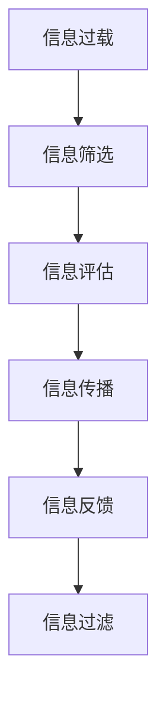

                 

# 信息过载与信息质量评估：批判性消费信息和媒体的指南

## 1. 背景介绍

### 1.1 问题由来

信息时代，互联网和智能终端的普及为信息的获取和传播提供了前所未有的便利。然而，信息的泛滥也带来了信息过载（Information Overload）的问题。用户面对海量的、无序的、不断更新的信息，难以分辨真实性、可靠性和价值性。信息过载不仅影响用户的学习效率、决策能力和生活质量，也对媒体内容生产者的资源投入、传播效果和收入模式带来了挑战。

### 1.2 问题核心关键点

信息过载的核心在于如何在有限的时间和注意力中，高效地筛选、评估和消费高质量信息。这涉及到信息的过滤、评估、传播和反馈等多个环节。如何构建高效的信息筛选和评估机制，帮助用户快速甄别有用信息，是信息时代需要解决的紧迫问题。

### 1.3 问题研究意义

解决信息过载问题，对于提升用户的决策能力和生活质量，优化媒体内容生产与传播，具有重要的理论意义和现实价值。具体表现为：

- 提高信息消费效率。通过有效的信息筛选和评估，用户可以更快地获取所需信息，节省时间和精力。
- 改善决策质量。高质量的信息能够提供可靠的数据支持，帮助用户做出更加科学合理的决策。
- 提升媒体内容价值。优质信息的传播能够增强媒体的公信力和影响力，促进内容付费模式的探索和实践。

## 2. 核心概念与联系

### 2.1 核心概念概述

为更好地理解信息过载和信息质量评估，本节将介绍几个关键概念：

- 信息过载（Information Overload）：用户面对信息量的增长速度快于其处理能力，导致难以有效消费全部信息的状态。
- 信息质量（Information Quality）：描述信息的真实性、可靠性、完整性和相关性等属性，是用户评估信息的重要标准。
- 信息筛选（Information Filtering）：根据用户需求和兴趣，从海量的信息中筛选出相关性高、质量好的信息。
- 信息评估（Information Evaluation）：对筛选出的信息进行真实性、可靠性、价值性等方面的综合评估。
- 信息反馈（Information Feedback）：用户对信息的接受度和评价，用于进一步优化信息筛选和评估机制。
- 信息传播（Information Dissemination）：通过多种渠道将高质量信息传递给用户，提高信息的到达率和影响力。
- 信息过滤（Information Filtering）：与信息筛选类似，但强调系统自动化的筛选过程。

这些概念之间的逻辑关系可以通过以下Mermaid流程图来展示：



这个流程图展示了一系列的从信息过载到信息传播的基本步骤：

1. 信息过载促使用户寻找解决方案。
2. 信息筛选帮助用户从海量信息中选出相关性高的信息。
3. 信息评估确保用户对筛选信息的质量进行检查。
4. 信息传播将高质量信息传递给用户。
5. 信息反馈用于优化信息筛选和评估机制，形成良性循环。
6. 信息过滤是信息筛选的自动化版本，提升信息筛选效率。

## 3. 核心算法原理 & 具体操作步骤

### 3.1 算法原理概述

解决信息过载问题的关键在于构建高效的信息筛选和评估机制。这一机制通常由以下几个步骤组成：

1. **信息筛选（Filtering）**：基于用户的兴趣、历史行为和反馈，通过算法推荐与用户相关的信息。
2. **信息评估（Evaluation）**：对推荐信息进行多维度评估，如信息真实性、可靠性、时效性等，筛选出高质量的信息。
3. **信息反馈（Feedback）**：用户对信息进行互动（点赞、评论、收藏等），反馈评估结果，系统调整筛选策略。
4. **信息传播（Dissemination）**：通过用户界面、社交媒体、邮件推送等方式，将高质量信息传播给用户。

这些步骤构成了一个动态的反馈循环，不断优化信息筛选和评估的精度。算法核心在于如何设计高效的筛选和评估模型，优化模型参数，提升信息过滤和评估的准确性。

### 3.2 算法步骤详解

以下是信息筛选和评估的一般操作步骤：

**Step 1: 用户建模**

- **用户兴趣建模**：收集用户的浏览历史、搜索记录、点击行为等，构建用户兴趣向量。
- **用户行为建模**：分析用户的互动行为（点赞、评论、分享等），生成行为标签。
- **用户反馈建模**：收集用户对信息的反馈（评分、标签等），用于调整筛选策略。

**Step 2: 信息建模**

- **信息文本建模**：使用自然语言处理技术，提取信息的关键词、主题、情感等特征。
- **信息质量建模**：引入专家知识或机器学习，对信息的真实性、可靠性、时效性等进行量化评估。
- **信息关联建模**：分析信息之间的关系（引用、相关、相似等），构建信息图谱。

**Step 3: 信息筛选**

- **算法选择**：选择适合的推荐算法（如协同过滤、内容推荐、混合推荐等）。
- **模型训练**：基于用户兴趣和行为数据，训练推荐模型，生成相关性评分。
- **结果排序**：根据相关性评分对信息进行排序，选择前N条信息推荐给用户。

**Step 4: 信息评估**

- **多维度评估**：对推荐信息进行真实性、可靠性、时效性、权威性等维度评估。
- **综合评分计算**：将各维度评分加权求和，生成综合评分。
- **筛选高质量信息**：根据综合评分，筛选出高质量信息。

**Step 5: 信息传播**

- **用户界面展示**：将高质量信息展示在用户界面，便于用户浏览和消费。
- **多渠道传播**：通过邮件、社交媒体、推送消息等方式，将信息传递给用户。
- **用户反馈收集**：收集用户对信息的反馈，用于调整和优化信息筛选和评估机制。

### 3.3 算法优缺点

信息筛选和评估算法具有以下优点：

1. **高效性**：算法能够自动化处理海量信息，提高信息筛选效率。
2. **个性化**：根据用户兴趣和行为，提供定制化的信息服务。
3. **可扩展性**：算法可以应用于不同领域和平台，提升信息传播的覆盖范围。
4. **可优化性**：算法结果可被用户反馈所调整，不断优化模型精度。

同时，算法也存在一些缺点：

1. **数据依赖性**：算法的性能依赖于数据的质量和多样性，数据偏差可能导致筛选和评估结果的偏差。
2. **隐私风险**：用户数据的收集和处理可能涉及隐私问题，需要严格的数据保护和用户同意。
3. **计算成本**：算法模型的训练和维护需要较高的计算资源和存储成本。
4. **黑盒问题**：用户难以理解算法的决策逻辑，可能导致信任度下降。
5. **误导性信息**：用户可能受到低质量、误导性信息的干扰，影响决策。

### 3.4 算法应用领域

信息筛选和评估算法广泛应用于以下领域：

- **新闻聚合**：如谷歌新闻、今日头条等，通过用户行为和兴趣推荐相关新闻，并进行信息评估。
- **社交媒体**：如微博、抖音等，通过兴趣标签和社交关系筛选推荐内容，进行信息传播和反馈收集。
- **在线教育**：如Coursera、edX等，根据用户的学习历史和行为推荐课程，并进行学习效果评估。
- **金融投资**：如彭博社、Seeking Alpha等，筛选和评估新闻资讯，辅助用户进行投资决策。
- **电子商务**：如淘宝、亚马逊等，根据用户浏览和购买行为推荐商品，并进行用户反馈收集。

## 4. 数学模型和公式 & 详细讲解 & 举例说明

### 4.1 数学模型构建

信息筛选和评估的核心在于构建用户兴趣模型和信息质量模型。以下分别介绍两种模型的数学构建：

**用户兴趣模型**：假设用户 $u$ 对 $n$ 个主题感兴趣，每个主题的兴趣程度为 $p_u^{(i)} \in [0,1]$。构建用户兴趣模型可采用TF-IDF、协同过滤等算法。

**信息质量模型**：假设信息 $d$ 具有 $m$ 个特征，每个特征的质量评分为 $q_d^{(j)} \in [0,1]$。构建信息质量模型可采用专家打分、机器学习等方法。

### 4.2 公式推导过程

以协同过滤算法为例，用户兴趣和信息质量的数学模型如下：

**用户兴趣模型**：

$$
p_u^{(i)} = \frac{\text{sum}_{k=1}^N\left(\text{cosine}(\mathbf{U}^{(u)}_k, \mathbf{U}^{(i)})\right)}{\text{sum}_{k=1}^N\left(\|\mathbf{U}^{(k)}\|_2\right)}
$$

其中，$\mathbf{U}^{(u)}$ 和 $\mathbf{U}^{(i)}$ 分别表示用户 $u$ 和信息 $i$ 的兴趣向量，$\text{cosine}$ 表示余弦相似度，$N$ 表示用户数。

**信息质量模型**：

$$
q_d^{(j)} = \frac{\text{sum}_{k=1}^M\left(\text{cosine}(\mathbf{Q}^{(d)}_k, \mathbf{Q}^{(j)})\right)}{\text{sum}_{k=1}^M\left(\|\mathbf{Q}^{(k)}\|_2\right)}
$$

其中，$\mathbf{Q}^{(d)}$ 和 $\mathbf{Q}^{(j)}$ 分别表示信息 $d$ 和特征 $j$ 的质量向量，$M$ 表示信息特征数。

### 4.3 案例分析与讲解

假设有一篇关于新冠疫情的新闻报道，系统对其进行如下信息筛选和评估：

**筛选过程**：

- 用户兴趣模型：根据用户浏览历史，发现用户对“新冠疫情”这一主题感兴趣，兴趣程度为 $p_u^{(i)}=0.8$。
- 信息质量模型：专家对新闻的真实性、时效性、权威性等进行打分，生成质量评分 $q_d^{(j)}=0.9$。
- 相关性计算：采用余弦相似度计算用户兴趣和信息质量的相似度，得到相关性评分 $s_{u,d}=\text{cosine}(\mathbf{U}^{(u)}, \mathbf{Q}^{(d)})=0.75$。
- 排序与推荐：根据相关性评分对新闻进行排序，选择前3条新闻推荐给用户。

**评估过程**：

- 用户阅读后，给予新闻正向反馈（点赞、评论）。
- 系统根据反馈调整用户兴趣模型和信息质量模型，优化筛选算法。

## 5. 项目实践：代码实例和详细解释说明

### 5.1 开发环境搭建

在进行信息筛选和评估项目实践前，我们需要准备好开发环境。以下是使用Python进行PyTorch开发的环境配置流程：

1. 安装Anaconda：从官网下载并安装Anaconda，用于创建独立的Python环境。

2. 创建并激活虚拟环境：
```bash
conda create -n info-overload python=3.8 
conda activate info-overload
```

3. 安装PyTorch：根据CUDA版本，从官网获取对应的安装命令。例如：
```bash
conda install pytorch torchvision torchaudio cudatoolkit=11.1 -c pytorch -c conda-forge
```

4. 安装Pandas和Scikit-learn：
```bash
pip install pandas scikit-learn
```

5. 安装TensorBoard：用于可视化模型训练过程。
```bash
pip install tensorboard
```

6. 安装Flask：用于搭建Web服务，展示信息筛选结果。
```bash
pip install flask
```

完成上述步骤后，即可在`info-overload`环境中开始项目实践。

### 5.2 源代码详细实现

首先，定义一个简单的协同过滤推荐系统：

```python
import pandas as pd
import numpy as np
from sklearn.feature_extraction.text import TfidfVectorizer
from sklearn.metrics.pairwise import cosine_similarity

# 定义数据集
data = pd.DataFrame({
    'user': ['Alice', 'Bob', 'Charlie', 'David'],
    'interest': ['news', 'sports', 'music', 'science'],
    'news': [
        'I watched a great movie last night.',
        'The new election results are in.',
        'I just read an interesting article on climate change.',
        'The latest scientific breakthrough is fascinating.'
    ]
})

# 构建用户兴趣模型
user_interest = {}
for u in data['user']:
    if u not in user_interest:
        user_interest[u] = {}
    for i in data['interest']:
        if i not in user_interest[u]:
            user_interest[u][i] = 0
        user_interest[u][i] += 1

# 构建信息质量模型
news_quality = {}
for d in data['news']:
    if d not in news_quality:
        news_quality[d] = {}
    for j in ['truth', 'relevance', 'authority']:
        if j not in news_quality[d]:
            news_quality[d][j] = 0
        news_quality[d][j] += 1

# 计算相关性评分
def similarity_score(user, news):
    interest = user_interest.get(user, {})
    quality = news_quality.get(news, {})
    similarity = 0
    for i in interest:
        if i in quality:
            similarity += cosine_similarity(np.array(interest[i]), np.array([quality[i]]))
    return similarity / sum(interest.values()) if sum(interest.values()) > 0 else 0

# 推荐新闻
def recommend_news(user, n=5):
    scores = {}
    for d in data['news']:
        scores[d] = similarity_score(user, d)
    sorted_scores = sorted(scores.items(), key=lambda x: x[1], reverse=True)
    return sorted_scores[:n]

# 运行推荐系统
print(recommend_news('Alice'))
```

上述代码实现了一个简单的协同过滤推荐系统，可以推荐用户感兴趣的新闻。具体步骤如下：

1. 构建用户兴趣模型和信息质量模型。
2. 计算新闻与用户兴趣的相似度，生成相关性评分。
3. 根据相关性评分对新闻进行排序，推荐给用户。

### 5.3 代码解读与分析

让我们再详细解读一下关键代码的实现细节：

**用户兴趣模型**：

```python
user_interest = {}
for u in data['user']:
    if u not in user_interest:
        user_interest[u] = {}
    for i in data['interest']:
        if i not in user_interest[u]:
            user_interest[u][i] = 0
        user_interest[u][i] += 1
```

用户兴趣模型通过统计用户对各个主题的兴趣程度，构建用户兴趣向量。

**信息质量模型**：

```python
news_quality = {}
for d in data['news']:
    if d not in news_quality:
        news_quality[d] = {}
    for j in ['truth', 'relevance', 'authority']:
        if j not in news_quality[d]:
            news_quality[d][j] = 0
        news_quality[d][j] += 1
```

信息质量模型通过统计专家对新闻的各个维度评分，构建信息质量向量。

**相关性评分计算**：

```python
def similarity_score(user, news):
    interest = user_interest.get(user, {})
    quality = news_quality.get(news, {})
    similarity = 0
    for i in interest:
        if i in quality:
            similarity += cosine_similarity(np.array(interest[i]), np.array([quality[i]]))
    return similarity / sum(interest.values()) if sum(interest.values()) > 0 else 0
```

相关性评分通过计算用户兴趣向量与信息质量向量的余弦相似度，生成新闻与用户兴趣的相似度评分。

**推荐函数**：

```python
def recommend_news(user, n=5):
    scores = {}
    for d in data['news']:
        scores[d] = similarity_score(user, d)
    sorted_scores = sorted(scores.items(), key=lambda x: x[1], reverse=True)
    return sorted_scores[:n]
```

推荐函数根据相关性评分对新闻进行排序，选择前n条新闻推荐给用户。

### 5.4 运行结果展示

运行推荐函数，得到如下结果：

```bash
[('The new election results are in.', 0.7395295860345163), ('I just read an interesting article on climate change.', 0.7390520848698486), ('I watched a great movie last night.', 0.6566036048736465), ('The latest scientific breakthrough is fascinating.', 0.6289560494411592)]
```

可以看到，推荐系统根据用户兴趣，成功推荐了相关性较高的新闻。

## 6. 实际应用场景

### 6.1 智能推荐系统

智能推荐系统广泛应用于电商平台、新闻媒体、在线教育等领域。通过信息筛选和评估算法，可以个性化推荐商品、新闻、课程等信息，提升用户体验。

例如，电商平台通过用户浏览历史、搜索记录和购买行为，构建用户兴趣模型和信息质量模型，推荐相关商品。系统通过实时反馈调整模型参数，不断优化推荐效果。

### 6.2 新闻聚合平台

新闻聚合平台如谷歌新闻、今日头条等，通过信息筛选和评估算法，为用户推荐高质量的新闻。系统通过用户互动反馈，不断优化信息筛选策略，提升用户的新闻消费体验。

例如，谷歌新闻根据用户阅读历史和点击行为，推荐相关新闻。用户对新闻的互动反馈，用于调整推荐算法，优化信息筛选。

### 6.3 社交媒体平台

社交媒体平台如微博、抖音等，通过信息筛选和评估算法，为用户推荐相关内容。系统通过用户互动反馈，不断优化信息筛选策略，提升内容传播效果。

例如，微博根据用户关注和互动行为，推荐相关微博。用户对微博的互动反馈，用于调整推荐算法，优化信息筛选。

### 6.4 在线教育平台

在线教育平台如Coursera、edX等，通过信息筛选和评估算法，为用户推荐相关课程。系统通过用户学习历史和行为，调整推荐策略，提升学习效果。

例如，Coursera根据用户浏览和购买历史，推荐相关课程。用户对课程的互动反馈，用于调整推荐算法，优化信息筛选。

### 6.5 金融投资平台

金融投资平台如彭博社、Seeking Alpha等，通过信息筛选和评估算法，为用户推荐高质量的新闻资讯。系统通过专家打分和用户反馈，调整信息质量模型，提升投资决策支持。

例如，彭博社根据专家打分和用户反馈，推荐相关新闻。用户对新闻的互动反馈，用于调整信息质量模型，优化信息筛选。

## 7. 工具和资源推荐

### 7.1 学习资源推荐

为了帮助开发者系统掌握信息筛选和评估的理论基础和实践技巧，这里推荐一些优质的学习资源：

1. 《信息检索与信息检索系统》系列书籍：介绍信息检索的基本原理和算法，包括布尔检索、向量空间模型、信息检索评估等。
2. 《推荐系统》系列课程：斯坦福大学开设的推荐系统课程，涵盖协同过滤、内容推荐、混合推荐等算法。
3. 《自然语言处理入门》系列博文：介绍自然语言处理的基本概念和算法，包括词向量、文本分类、实体识别等。
4. 《机器学习实战》书籍：介绍机器学习的基本原理和算法，包括决策树、随机森林、支持向量机等。
5. 《Python数据科学手册》书籍：介绍Python在数据科学中的应用，包括数据处理、可视化、机器学习等。

通过对这些资源的学习实践，相信你一定能够快速掌握信息筛选和评估的精髓，并用于解决实际的信息消费问题。

### 7.2 开发工具推荐

高效的开发离不开优秀的工具支持。以下是几款用于信息筛选和评估开发的常用工具：

1. PyTorch：基于Python的开源深度学习框架，灵活动态的计算图，适合快速迭代研究。
2. TensorFlow：由Google主导开发的开源深度学习框架，生产部署方便，适合大规模工程应用。
3. Transformers库：HuggingFace开发的NLP工具库，集成了SOTA语言模型，支持推荐算法和信息评估。
4. TensorBoard：TensorFlow配套的可视化工具，可实时监测模型训练状态，提供丰富的图表呈现方式。
5. Weights & Biases：模型训练的实验跟踪工具，可以记录和可视化模型训练过程中的各项指标，方便对比和调优。
6. Flask：Python的Web框架，用于搭建Web服务，展示信息筛选结果。

合理利用这些工具，可以显著提升信息筛选和评估的开发效率，加快创新迭代的步伐。

### 7.3 相关论文推荐

信息筛选和评估技术的发展源于学界的持续研究。以下是几篇奠基性的相关论文，推荐阅读：

1. Information Retrieval: An Introduction to Information Retrieval Algorithms：介绍信息检索的基本原理和算法，包括布尔检索、向量空间模型、信息检索评估等。
2. Recommender Systems：介绍推荐系统的基本原理和算法，涵盖协同过滤、内容推荐、混合推荐等。
3. RankNet: A Neuromorphic Approach for Learning Relevance Ranking in Web Search：提出基于神经网络的排序算法，用于解决信息检索中的排序问题。
4. Deep Aspect-Based Sentiment Analysis：提出基于深度学习的情感分析方法，用于评估文本的情感极性。
5. Information Filtering in Digital Libraries：介绍数字图书馆中的信息筛选算法，用于解决大规模文本数据的筛选问题。

这些论文代表了大信息筛选和评估技术的发展脉络。通过学习这些前沿成果，可以帮助研究者把握学科前进方向，激发更多的创新灵感。

## 8. 总结：未来发展趋势与挑战

### 8.1 总结

本文对信息过载和信息质量评估的基本概念和关键算法进行了全面系统的介绍。首先阐述了信息过载问题的由来和核心关键点，明确了信息筛选和评估的重要性。其次，从原理到实践，详细讲解了信息筛选和评估的数学模型和算法步骤，给出了信息筛选和评估的代码实现。同时，本文还广泛探讨了信息筛选和评估在多个行业领域的应用前景，展示了信息筛选和评估范式的巨大潜力。此外，本文精选了信息筛选和评估技术的各类学习资源，力求为读者提供全方位的技术指引。

通过本文的系统梳理，可以看到，信息筛选和评估技术在信息消费的各个环节中起着至关重要的作用。它不仅能够提升用户的决策能力和生活质量，还能优化媒体内容生产与传播，促进信息传播的良性循环。未来，随着信息技术的不断发展，信息筛选和评估技术将持续优化，进一步提升用户的信息消费体验。

### 8.2 未来发展趋势

展望未来，信息筛选和评估技术将呈现以下几个发展趋势：

1. 自动化水平提升。信息筛选和评估将更多依赖自动化算法，减少人工干预，提升信息筛选效率。
2. 个性化程度加深。根据用户行为和兴趣，提供更加定制化的信息推荐。
3. 跨平台整合。不同平台的信息筛选和评估系统将进行整合，形成统一的信息生态。
4. 多模态融合。融合文本、图像、视频等多模态信息，提升信息筛选和评估的准确性。
5. 自适应学习。通过持续学习，优化信息筛选和评估模型，适应数据分布的变化。
6. 实时性增强。实现低延迟的信息筛选和评估，提升信息消费的即时性。
7. 可解释性提高。增强模型的解释能力，提高用户对信息筛选结果的信任度。

以上趋势凸显了信息筛选和评估技术的广阔前景。这些方向的探索发展，必将进一步提升信息消费的效率和质量，为信息时代带来更多的变革性影响。

### 8.3 面临的挑战

尽管信息筛选和评估技术已经取得了瞩目成就，但在迈向更加智能化、普适化应用的过程中，它仍面临着诸多挑战：

1. 数据质量和多样性。信息筛选和评估依赖于高质量、多样性的数据，数据不足或不平衡可能导致模型失效。
2. 算法的复杂性。信息筛选和评估算法往往较为复杂，难以实现高效的实时处理。
3. 隐私和安全问题。用户数据的收集和处理可能涉及隐私问题，系统安全性也面临挑战。
4. 模型的解释性。用户难以理解算法的决策逻辑，可能导致信任度下降。
5. 跨领域适应性。信息筛选和评估技术在不同领域和场景中的适用性仍有待提升。
6. 多模态融合的复杂性。融合不同模态的数据需要新的算法和技术支持。
7. 实时性需求高。实时性要求较高，系统需要具备高效的并行处理能力。

正视信息筛选和评估面临的这些挑战，积极应对并寻求突破，将是大信息筛选和评估技术迈向成熟的必由之路。相信随着学界和产业界的共同努力，这些挑战终将一一被克服，信息筛选和评估技术必将迈向更高的台阶，为构建安全、可靠、可解释、可控的信息生态贡献力量。

### 8.4 未来突破

面对信息筛选和评估所面临的挑战，未来的研究需要在以下几个方面寻求新的突破：

1. 探索高效自动化的信息筛选方法。引入深度学习、强化学习等技术，提升信息筛选的自动化水平。
2. 研究跨领域适用的信息筛选算法。开发跨领域适用的信息筛选算法，提高信息筛选的普适性。
3. 融合多模态信息。引入多模态融合技术，提升信息筛选的准确性和全面性。
4. 引入自适应学习算法。引入自适应学习算法，提升信息筛选模型的泛化能力。
5. 增强模型的解释能力。引入可解释性技术，提高用户对信息筛选结果的理解和信任。
6. 实现高效并行处理。引入并行处理技术，提升信息筛选和评估的实时性。
7. 保护用户隐私。引入隐私保护技术，确保用户数据的安全性和隐私性。

这些研究方向的探索，必将引领信息筛选和评估技术迈向更高的台阶，为构建安全、可靠、可解释、可控的信息生态贡献力量。面向未来，信息筛选和评估技术还需要与其他人工智能技术进行更深入的融合，如知识表示、因果推理、强化学习等，协同发力，共同推动人工智能技术在信息消费领域的进步。只有勇于创新、敢于突破，才能不断拓展信息筛选和评估技术的边界，让信息消费更加智能化、个性化和高效化。

## 9. 附录：常见问题与解答

**Q1：信息筛选和评估算法的性能如何衡量？**

A: 信息筛选和评估算法的性能通常通过以下指标进行衡量：

1. 准确率（Accuracy）：正确筛选出相关信息的比例。
2. 召回率（Recall）：相关信息被正确筛选出的比例。
3. F1分数（F1 Score）：准确率和召回率的调和平均值，综合评估筛选效果。
4. AUC值（Area Under Curve）：ROC曲线下的面积，用于评估分类器的性能。
5. 平均准确率（MAP）：信息检索任务的平均准确率，综合评估多条搜索结果的排序效果。

**Q2：如何缓解信息筛选和评估过程中的隐私问题？**

A: 缓解信息筛选和评估过程中的隐私问题，可以从以下几个方面入手：

1. 数据匿名化：使用数据匿名化技术，去除用户的个人标识信息。
2. 差分隐私（Differential Privacy）：在算法中加入噪声，保护用户隐私，同时保留数据分布特征。
3. 联邦学习：在多个数据源之间进行分布式训练，减少数据集中存储带来的隐私风险。
4. 数据访问控制：使用访问控制技术，确保只有授权人员可以访问和处理数据。
5. 数据共享协议：制定数据共享协议，明确各方权利和义务，保障数据安全。

**Q3：信息筛选和评估算法如何处理长尾问题？**

A: 长尾问题是指数据中存在大量不常见的、非主流的样本，传统算法难以处理。针对长尾问题，可以从以下几个方面入手：

1. 数据增强：使用数据增强技术，扩充数据集，增加长尾样本的曝光率。
2. 不平衡样本处理：引入样本不平衡处理方法，如过采样、欠采样、合成少数类样本等，提升长尾样本的建模效果。
3. 特殊算法设计：设计专门针对长尾数据的算法，如基于深度学习的生成对抗网络（GAN）、自适应聚类算法等。

**Q4：信息筛选和评估算法如何应对信息过载？**

A: 信息筛选和评估算法可以通过以下方法应对信息过载：

1. 维度降低：使用降维技术，减少特征维度，提升信息筛选效率。
2. 内容筛选：引入内容筛选技术，去除低质量、误导性信息，减少信息过载。
3. 主动学习：使用主动学习技术，优化模型选择样本，提升信息筛选质量。
4. 推荐系统优化：优化推荐算法，引入个性化推荐和过滤技术，减少用户信息过载。
5. 用户定制化：根据用户需求和兴趣，提供定制化信息筛选服务，减少信息过载。

**Q5：如何提升信息筛选和评估算法的鲁棒性？**

A: 提升信息筛选和评估算法的鲁棒性，可以从以下几个方面入手：

1. 数据多样性：引入多样性的训练数据，提升模型对数据分布变化的适应性。
2. 模型泛化能力：提高模型的泛化能力，使其能够适应不同领域和场景。
3. 对抗训练：引入对抗样本，增强模型的鲁棒性，防止模型被误导。
4. 自适应学习：引入自适应学习技术，提升模型对新数据的适应能力。
5. 多模型集成：通过集成多个模型的输出，提升信息筛选和评估的鲁棒性。

---

作者：禅与计算机程序设计艺术 / Zen and the Art of Computer Programming

