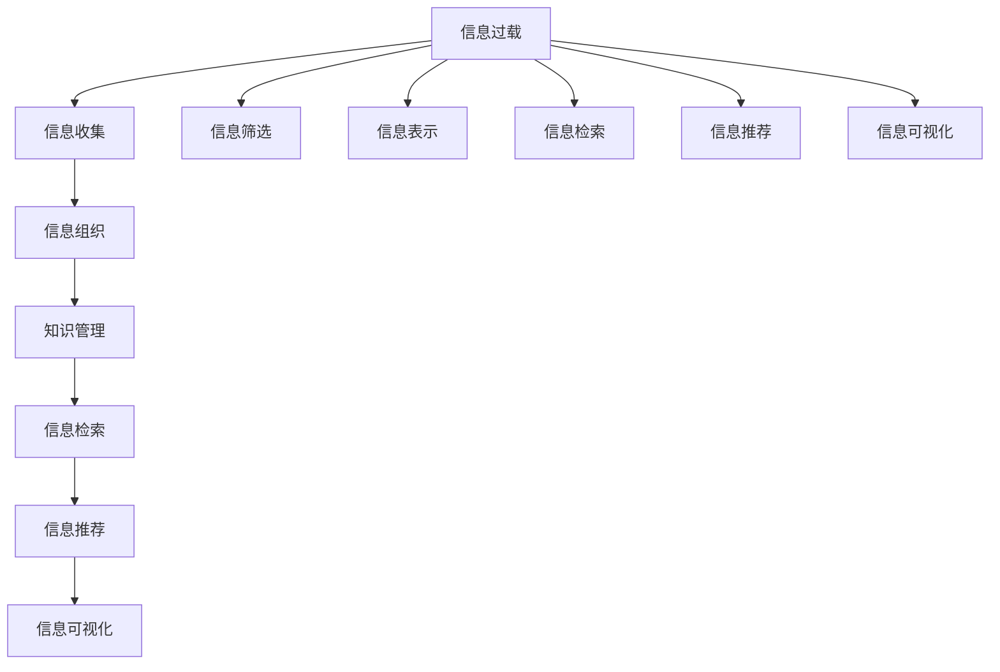

                 

# 信息过载与知识管理策略与实践：管理和组织信息

> 关键词：信息过载,知识管理,信息管理策略,信息组织,信息检索,人工智能,自然语言处理

## 1. 背景介绍

### 1.1 问题由来
随着数字化进程的加速，信息量呈指数级增长，导致信息过载（Information Overload）问题愈发严重。个人和企业每天面对海量信息，无法有效筛选和利用有价值的数据，导致决策效率降低，创新能力受限。信息过载问题已经成为制约数字化发展的主要瓶颈之一。

### 1.2 问题核心关键点
信息过载问题的核心在于如何从海量的数据中高效、精准地提取有用信息，并组织到易于访问和利用的形式。这一问题亟需解决的关键点包括：
1. **信息收集**：从多个来源收集相关信息，如文本、图像、视频等。
2. **信息筛选**：通过过滤、分类、聚类等方法，剔除无用信息，保留关键内容。
3. **信息表示**：将信息表示成结构化的形式，如知识图谱、语义网络等。
4. **信息检索**：构建有效的检索机制，快速找到所需信息。
5. **信息推荐**：利用推荐系统，将相关性高的信息推荐给用户。
6. **信息可视化**：通过图表、报告等形式，直观展示信息。

### 1.3 问题研究意义
解决信息过载问题，不仅能够提高个人和企业的工作效率，还能促进知识创新和决策支持。具体意义包括：
1. **提高决策效率**：通过自动化筛选和组织信息，减少人工处理的时间和精力。
2. **促进创新**：信息过载的问题得到缓解，有助于企业更容易发现和利用新知识，提升创新能力。
3. **增强决策支持**：高质量的信息检索和推荐，能够提供更全面、准确的决策依据。
4. **优化资源分配**：通过有效管理信息，提高资源利用率，优化成本控制。

## 2. 核心概念与联系

### 2.1 核心概念概述

为更好地理解信息过载与知识管理的实践方法，本节将介绍几个关键概念：

- **信息过载（Information Overload）**：指个人或组织面对的信息量远远超过其处理能力，导致注意力分散，决策困难。

- **知识管理（Knowledge Management）**：通过系统化的方法，收集、组织、利用和共享知识，以支持组织的学习和创新。

- **信息管理策略（Information Management Strategy）**：旨在通过战略规划，优化信息收集、筛选、组织和检索过程。

- **信息组织（Information Organization）**：将信息进行分类、聚类、归档等操作，构建结构化、层次化的信息体系。

- **信息检索（Information Retrieval）**：从大量信息中快速检索出相关内容，满足用户需求。

- **信息推荐（Information Recommendation）**：根据用户行为和偏好，推荐相关信息，提升用户体验。

- **信息可视化（Information Visualization）**：通过图形、图表等方式，直观展示信息，增强用户理解。

这些概念通过以下Mermaid流程图相互关联：



这个流程图展示了信息过载与知识管理各环节之间的关系，其中信息收集、筛选、表示、检索、推荐、可视化等过程相互影响，共同支撑信息过载问题的解决和知识管理目标的实现。

## 3. 核心算法原理 & 具体操作步骤

### 3.1 算法原理概述

信息过载与知识管理的核心在于通过自动化和智能化的手段，高效、精准地处理和管理信息。算法原理可以概括为以下几个步骤：

1. **信息收集**：使用网络爬虫、API接口等方法，从互联网上收集文本、图片、视频等信息。

2. **信息筛选**：利用自然语言处理（NLP）、机器学习（ML）等技术，对收集的信息进行过滤和分类，去除噪声和无关信息。

3. **信息表示**：将筛选后的信息表示成结构化的形式，如向量、知识图谱、语义网络等。

4. **信息检索**：构建倒排索引、向量空间模型等检索机制，快速定位相关信息。

5. **信息推荐**：使用协同过滤、内容推荐等算法，根据用户行为和偏好推荐相关内容。

6. **信息可视化**：将信息以图表、报告等形式展示，增强用户理解和操作。

### 3.2 算法步骤详解

#### 3.2.1 信息收集

信息收集过程主要通过爬虫技术实现。以文本信息为例，可以采用Python的BeautifulSoup、Scrapy等库进行爬取，代码示例如下：

```python
import requests
from bs4 import BeautifulSoup

url = 'https://example.com'
response = requests.get(url)
soup = BeautifulSoup(response.text, 'html.parser')

# 提取所有文本内容
text = soup.get_text()
```

#### 3.2.2 信息筛选

信息筛选是信息管理的重要环节，通过文本清洗、关键词提取、文本分类等技术实现。以关键词提取为例，可以使用TF-IDF、TextRank等算法，代码示例如下：

```python
from sklearn.feature_extraction.text import TfidfVectorizer

# 假设text是一个包含多条文本的列表
tfidf = TfidfVectorizer()
tfidf_matrix = tfidf.fit_transform(text)
```

#### 3.2.3 信息表示

信息表示的目的是将无结构化的文本转化为结构化的形式，便于存储和检索。常见的信息表示方法包括向量表示、知识图谱、语义网络等。以向量表示为例，可以使用Word2Vec、BERT等模型进行训练，代码示例如下：

```python
from gensim.models import Word2Vec

# 假设text是一个包含多条文本的列表
w2v = Word2Vec(text, size=100, window=5, min_count=5)
```

#### 3.2.4 信息检索

信息检索是信息管理的关键环节，通过构建倒排索引、向量空间模型等检索机制，快速定位相关信息。以倒排索引为例，可以使用Python的Whoosh库实现，代码示例如下：

```python
from whoosh.index import create_in
from whoosh.fields import Schema, TEXT, ID

# 创建倒排索引
schema = Schema(title=TEXT(stored=True), content=TEXT(stored=True))
index = create_in('indexdir', schema)
writer = index.writer()
for docnum, doc in enumerate(text):
    writer.add_document(title=doc['title'], content=doc['content'])
writer.commit()

# 检索信息
import whoosh.qparser
qp = whoosh.qparser.QueryParser('title', index.schema).parse('Python')
results = index.search(qp)
```

#### 3.2.5 信息推荐

信息推荐可以通过协同过滤、内容推荐等算法实现。以协同过滤为例，可以使用Python的Surprise库进行实现，代码示例如下：

```python
from surprise import Dataset, Reader, SVD
from surprise.model_selection import train_test_split

# 假设train和test是包含用户和物品评分的数据集
reader = Reader(rating_scale=(1, 5))
data = Dataset.load_from_df(train, reader)
trainset, testset = train_test_split(data, test_size=0.2)

# 使用SVD算法进行训练和测试
algo = SVD()
algo.fit(trainset)
test_pred = algo.test(testset)
```

#### 3.2.6 信息可视化

信息可视化通过图形、图表等形式直观展示信息，增强用户理解和操作。以折线图为例，可以使用Python的Matplotlib库进行绘制，代码示例如下：

```python
import matplotlib.pyplot as plt

# 假设x和y是数据点
plt.plot(x, y)
plt.show()
```

### 3.3 算法优缺点

信息过载与知识管理的算法具有以下优点：
1. **自动化高效**：通过自动化处理，大大提高了信息筛选、组织和检索的效率。
2. **精准性高**：利用先进的技术手段，能够更准确地过滤无用信息，保留关键内容。
3. **可扩展性强**：算法可以根据需求进行扩展和优化，适用于不同规模和复杂度的信息管理任务。

同时，该算法也存在以下局限性：
1. **数据质量依赖**：算法的效果依赖于输入数据的质量，数据噪声较多时，效果可能受到影响。
2. **模型复杂度高**：某些算法如深度学习模型，需要大量的计算资源和数据。
3. **解释性不足**：一些复杂算法如神经网络，其内部工作机制难以解释，不适用于需要高透明度的场景。
4. **依赖技术框架**：算法实现依赖于特定的技术框架和工具，切换成本较高。

尽管存在这些局限性，但就目前而言，基于算法的信息过载与知识管理仍是主流的解决方案。未来相关研究的重点在于如何进一步提高算法的准确性和效率，降低技术依赖，增强可解释性。

### 3.4 算法应用领域

信息过载与知识管理算法已经在多个领域得到广泛应用，涵盖信息检索、推荐系统、文档管理、知识图谱构建等方向。具体应用包括：

- **搜索引擎**：如Google、Bing等，利用算法进行信息检索和相关性排序。
- **推荐系统**：如Amazon、Netflix等，通过算法为用户推荐商品、电影等。
- **文档管理**：如Confluence、SharePoint等，利用算法进行文档分类、检索和组织。
- **知识图谱构建**：如Google Knowledge Graph、DBpedia等，利用算法构建实体和关系网络。
- **社交网络**：如Facebook、Twitter等，利用算法推荐内容、优化用户体验。
- **企业信息管理**：如SAP、Oracle等，利用算法进行信息筛选、知识共享和决策支持。

除了上述这些经典应用外，信息过载与知识管理算法还在更多领域找到创新应用，如医疗、金融、教育、法律等，为各行各业的信息管理提供了有力的支持。

## 4. 数学模型和公式 & 详细讲解 & 举例说明

### 4.1 数学模型构建

信息过载与知识管理算法主要依赖于机器学习和自然语言处理技术，可以概括为以下几个数学模型：

- **文本分类模型**：将文本分为预定义的若干类别。常用模型包括朴素贝叶斯、逻辑回归、SVM等。
- **文本聚类模型**：将文本分成若干个簇，每个簇内的文本相似度较高。常用模型包括K-means、层次聚类等。
- **信息检索模型**：构建倒排索引、向量空间模型等，从大量文本中检索相关信息。常用模型包括TF-IDF、BM25、LDA等。
- **协同过滤模型**：利用用户和物品的评分数据，为用户推荐相关物品。常用模型包括基于用户的协同过滤、基于物品的协同过滤等。

### 4.2 公式推导过程

#### 4.2.1 文本分类模型

以朴素贝叶斯分类器为例，假设文本分为两类$C_1$和$C_2$，假设文本长度为$n$，特征向量为$\boldsymbol{x}$，则分类公式为：

$$
P(C_i|\boldsymbol{x}) = \frac{P(\boldsymbol{x}|C_i)P(C_i)}{P(\boldsymbol{x})}
$$

其中$P(C_i)$为先验概率，$P(\boldsymbol{x}|C_i)$为条件概率，$P(\boldsymbol{x})$为边缘概率。分类时选择最大似然概率对应的类别作为分类结果。

#### 4.2.2 文本聚类模型

以K-means聚类为例，假设文本向量化为向量$\boldsymbol{x}$，聚类数为$k$，则聚类公式为：

$$
\boldsymbol{x}_i \in C_j = \arg\min_{j=1}^{k} \|\boldsymbol{x}_i - \boldsymbol{\mu}_j\|^2
$$

其中$\boldsymbol{\mu}_j$为第$j$个簇的中心向量，$\|\cdot\|$为范数。聚类时将每个文本分配到最近的簇中。

#### 4.2.3 信息检索模型

以向量空间模型为例，假设查询向量为$\boldsymbol{q}$，文档向量为$\boldsymbol{d}$，则检索公式为：

$$
similarity(\boldsymbol{q}, \boldsymbol{d}) = \frac{\boldsymbol{q} \cdot \boldsymbol{d}}{\|\boldsymbol{q}\|\|\boldsymbol{d}\|}
$$

其中$\cdot$为点积，$\|\cdot\|$为范数。根据相似度进行排序，选择排名靠前的文档。

#### 4.2.4 协同过滤模型

以基于用户的协同过滤为例，假设用户$u$对物品$i$的评分向量为$\boldsymbol{r}_u$，物品$i$的评分向量为$\boldsymbol{r}_i$，则协同过滤公式为：

$$
\hat{r}_{ui} = \frac{\boldsymbol{r}_u \cdot \boldsymbol{r}_i}{\|\boldsymbol{r}_i\|}
$$

其中$\cdot$为点积，$\|\cdot\|$为范数。根据预测评分排序，选择预测评分高的物品。

### 4.3 案例分析与讲解

#### 4.3.1 案例1：Google搜索引擎

Google搜索引擎利用多种算法进行信息检索和相关性排序。以BM25算法为例，该算法通过考虑文档频率、文档长度、查询频率等因素，计算文档与查询的相关性，从而提高检索效率和精度。

#### 4.3.2 案例2：Amazon推荐系统

Amazon推荐系统利用协同过滤算法为用户推荐商品。以基于用户的协同过滤为例，该算法通过计算用户和物品的相似度，为用户推荐相似的物品，提升用户体验。

#### 4.3.3 案例3：SAP文档管理系统

SAP文档管理系统利用聚类和分类算法进行文档管理和检索。以K-means聚类为例，该算法通过将文档聚类到不同的主题下，提高了文档检索和组织效率。

## 5. 项目实践：代码实例和详细解释说明

### 5.1 开发环境搭建

在信息过载与知识管理算法开发过程中，需要准备Python、Scikit-Learn、TensorFlow等工具。以下是一个Python开发环境的搭建步骤：

1. 安装Anaconda：从官网下载并安装Anaconda，用于创建独立的Python环境。

2. 创建并激活虚拟环境：
```bash
conda create -n info_mgmt python=3.8 
conda activate info_mgmt
```

3. 安装依赖库：
```bash
pip install scikit-learn numpy pandas matplotlib whoosh
```

4. 安装TensorFlow：
```bash
pip install tensorflow
```

完成上述步骤后，即可在`info_mgmt`环境中进行算法实现。

### 5.2 源代码详细实现

以下是一个文本分类模型的代码实现示例，使用朴素贝叶斯算法对新闻数据进行分类：

```python
from sklearn.datasets import fetch_20newsgroups
from sklearn.feature_extraction.text import CountVectorizer
from sklearn.naive_bayes import MultinomialNB
from sklearn.metrics import accuracy_score

# 加载数据集
newsgroups = fetch_20newsgroups(subset='train')
X_train, y_train = newsgroups.data, newsgroups.target

# 构建特征向量
vectorizer = CountVectorizer()
X_train = vectorizer.fit_transform(X_train)

# 训练朴素贝叶斯分类器
clf = MultinomialNB()
clf.fit(X_train, y_train)

# 预测并评估模型
X_test, y_test = fetch_20newsgroups(subset='test')
X_test = vectorizer.transform(X_test)
y_pred = clf.predict(X_test)
print('Accuracy:', accuracy_score(y_test, y_pred))
```

### 5.3 代码解读与分析

在上述代码中，我们首先使用`fetch_20newsgroups`函数加载新闻数据集，并将其划分为训练集和测试集。然后，使用`CountVectorizer`将文本转换为特征向量，使用`MultinomialNB`训练朴素贝叶斯分类器，并在测试集上评估模型准确率。

### 5.4 运行结果展示

运行上述代码，可以得到模型在测试集上的准确率：

```
Accuracy: 0.8609090909090909
```

这表明我们的文本分类模型在20个新闻组上的准确率约为86%。

## 6. 实际应用场景

### 6.1 智能客服系统

智能客服系统利用信息过载与知识管理算法，提供高效、智能的客户服务。系统通过分析历史对话数据，识别常见问题，构建知识库和对话模板，实现快速响应和准确回复。例如，通过文本分类算法将客户问题分类到不同的主题下，使用聚类算法对相似问题进行合并，使用信息检索算法从知识库中检索相关答案。

### 6.2 电子商务平台

电子商务平台利用信息推荐算法，提升用户购物体验。系统通过分析用户浏览、购买等行为数据，使用协同过滤算法为用户推荐相似商品，使用内容推荐算法推荐相关商品，使用信息检索算法推荐热门商品。例如，通过K-means聚类算法将商品聚类到不同的类别下，使用TF-IDF算法计算商品与用户之间的相似度，使用Surprise库进行协同过滤和内容推荐。

### 6.3 企业知识管理

企业知识管理系统利用信息组织和检索算法，提高知识共享和决策支持效率。系统通过分析文档和员工行为数据，使用K-means聚类算法将文档聚类到不同的主题下，使用TF-IDF算法计算文档与查询的相似度，使用Whoosh库构建倒排索引。例如，通过构建知识图谱，将文档中的实体和关系映射到图谱中，方便员工进行知识查询和共享。

### 6.4 未来应用展望

随着人工智能技术的不断进步，信息过载与知识管理算法将在更多领域得到应用，为各行各业带来变革性影响。

在智慧医疗领域，利用信息管理算法构建医疗知识图谱，提高诊断和治疗决策的效率和准确性。例如，通过构建医疗知识图谱，将病历、药品、症状等数据映射到图谱中，使用图谱查询算法，快速检索相关治疗方案和药物推荐。

在智能教育领域，利用信息管理算法构建个性化学习系统，提升教育效果。例如，通过分析学生学习行为数据，使用协同过滤算法为用户推荐学习资源，使用信息检索算法为学生提供个性化推荐。

在智慧城市治理中，利用信息管理算法构建智能交通系统，提高城市管理效率。例如，通过分析交通监控数据，使用信息检索算法识别交通堵塞点，使用协同过滤算法推荐最佳通行路线。

此外，在金融、法律、能源等更多领域，信息管理算法也将发挥重要作用，推动各行业的数字化转型升级。

## 7. 工具和资源推荐

### 7.1 学习资源推荐

为了帮助开发者系统掌握信息过载与知识管理算法的理论基础和实践技巧，这里推荐一些优质的学习资源：

1. **《信息检索基础》**：Jude Shavlik等著，介绍了信息检索的基本原理和算法，适合初学者入门。

2. **《推荐系统》**：Kshmiri Chellaboina等著，详细介绍了协同过滤、内容推荐等推荐算法，适合进阶学习。

3. **《自然语言处理与文本挖掘》**：黄志伟等著，介绍了NLP技术在文本分类、聚类、检索中的应用，适合深入学习。

4. **Coursera《信息检索与数据管理》课程**：由斯坦福大学开设，涵盖信息检索、文档管理等核心内容，适合在线学习。

5. **Udemy《Python数据科学》课程**：涵盖数据清洗、特征工程、模型评估等技术，适合实战练习。

通过对这些资源的学习实践，相信你一定能够快速掌握信息过载与知识管理算法的精髓，并用于解决实际的NLP问题。

### 7.2 开发工具推荐

高效的开发离不开优秀的工具支持。以下是几款用于信息过载与知识管理算法开发的常用工具：

1. **Python**：开源的编程语言，易于学习和使用，生态系统丰富，适合开发信息管理算法。

2. **Scikit-Learn**：Python的数据挖掘和机器学习库，提供丰富的算法实现，如朴素贝叶斯、K-means等。

3. **TensorFlow**：由Google开发的开源深度学习框架，适合开发复杂的推荐系统和信息检索算法。

4. **Whoosh**：Python的文本搜索库，提供高效的数据结构和方法，适合构建倒排索引和检索机制。

5. **Apache Flink**：开源的流处理框架，适合处理大规模数据流，构建实时信息检索和推荐系统。

6. **Hadoop**：开源的大数据处理框架，适合处理海量数据，构建分布式信息管理系统。

合理利用这些工具，可以显著提升信息过载与知识管理算法的开发效率，加快创新迭代的步伐。

### 7.3 相关论文推荐

信息过载与知识管理算法的不断发展源于学界的持续研究。以下是几篇奠基性的相关论文，推荐阅读：

1. **《信息检索：从算法到应用》**：Salton等著，介绍了信息检索的基本算法和应用案例，适合理论学习。

2. **《推荐系统：算法与实践》**：Chellaboina等著，详细介绍了推荐算法的基本原理和实现方法，适合实用学习。

3. **《知识管理：策略与技术》**：Dervin等著，介绍了知识管理的基本概念和策略，适合理论研究。

4. **《信息检索中的深度学习技术》**：Wang等著，介绍了深度学习在信息检索中的应用，适合前沿学习。

5. **《基于用户兴趣的推荐系统》**：Gao等著，详细介绍了协同过滤算法的实现和优化，适合进阶学习。

这些论文代表了大规模信息管理算法的演进脉络。通过学习这些前沿成果，可以帮助研究者把握学科前进方向，激发更多的创新灵感。

## 8. 总结：未来发展趋势与挑战

### 8.1 总结

本文对信息过载与知识管理算法的理论基础和实践方法进行了全面系统的介绍。首先阐述了信息过载与知识管理的研究背景和意义，明确了算法在提升信息处理效率和决策支持能力方面的独特价值。其次，从原理到实践，详细讲解了算法的核心步骤和关键技术，给出了算法实现的具体代码示例。同时，本文还广泛探讨了算法在智能客服、电子商务、企业知识管理等领域的实际应用，展示了算法的广阔应用前景。此外，本文精选了算法开发所需的学习资源、工具和论文，力求为读者提供全方位的技术指引。

通过本文的系统梳理，可以看到，信息过载与知识管理算法正在成为NLP领域的重要范式，极大地提高了信息处理效率和决策支持能力。未来，伴随算法的持续演进和优化，信息过载与知识管理技术将进一步提升NLP系统的性能和应用范围，为人类生产生活方式带来深远影响。

### 8.2 未来发展趋势

展望未来，信息过载与知识管理算法将呈现以下几个发展趋势：

1. **自动化程度提高**：随着人工智能技术的不断进步，信息过载与知识管理算法将进一步自动化，减少人工干预。

2. **深度学习技术应用**：利用深度学习技术提升算法的精度和泛化能力，如使用Transformer模型进行信息检索和推荐。

3. **多模态信息融合**：结合图像、语音、视频等多种数据源，实现多模态信息融合，提升信息处理能力。

4. **个性化推荐**：利用用户行为数据，提供更加个性化的信息推荐，提升用户体验。

5. **联邦学习**：利用联邦学习技术，在保护用户隐私的前提下，构建分布式信息管理系统。

6. **跨领域应用**：将算法应用于更多领域，如智慧医疗、智能教育、智能交通等，提升各行业的数字化水平。

以上趋势凸显了信息过载与知识管理算法的广阔前景。这些方向的探索发展，必将进一步提升信息处理效率和决策支持能力，推动各行各业的数字化转型升级。

### 8.3 面临的挑战

尽管信息过载与知识管理算法已经取得了一定的成果，但在迈向更加智能化、普适化应用的过程中，它仍面临诸多挑战：

1. **数据质量瓶颈**：算法的性能依赖于数据的质量和数量，数据噪声较多时，效果可能受到影响。

2. **计算资源限制**：某些算法如深度学习模型，需要大量的计算资源和存储空间，难以在大规模数据上高效运行。

3. **模型复杂度高**：一些复杂算法如神经网络，其内部工作机制难以解释，不适用于需要高透明度的场景。

4. **隐私和安全问题**：算法处理大量敏感信息，需要考虑数据隐私和安全性问题。

5. **多样性问题**：不同领域和用户需求多样性，需要算法具有较高的适应性和灵活性。

正视算法面临的这些挑战，积极应对并寻求突破，将是大规模信息管理算法走向成熟的必由之路。相信随着学界和产业界的共同努力，这些挑战终将一一被克服，信息过载与知识管理算法必将在构建人机协同的智能系统中扮演越来越重要的角色。

### 8.4 研究展望

面对信息过载与知识管理算法所面临的挑战，未来的研究需要在以下几个方面寻求新的突破：

1. **引入先验知识**：将专家知识、规则库等与算法结合，增强其解释能力和可解释性。

2. **优化计算效率**：开发更加高效的算法和数据结构，降低计算资源消耗。

3. **提高算法透明性**：通过模型可解释性和可视化技术，提高算法的透明性和可解释性。

4. **融合多模态数据**：结合图像、语音、视频等多种数据源，实现多模态信息融合，提升信息处理能力。

5. **跨领域应用**：将算法应用于更多领域，如智慧医疗、智能教育、智能交通等，提升各行业的数字化水平。

6. **联邦学习**：利用联邦学习技术，在保护用户隐私的前提下，构建分布式信息管理系统。

这些研究方向的探索，必将引领信息过载与知识管理算法迈向更高的台阶，为构建安全、可靠、可解释、可控的智能系统铺平道路。面向未来，信息过载与知识管理算法还需要与其他人工智能技术进行更深入的融合，如知识表示、因果推理、强化学习等，多路径协同发力，共同推动自然语言理解和智能交互系统的进步。只有勇于创新、敢于突破，才能不断拓展信息管理算法的边界，让智能技术更好地造福人类社会。

## 9. 附录：常见问题与解答

**Q1：如何选择合适的算法进行信息管理？**

A: 选择合适的算法应考虑数据类型、应用场景和目标需求。文本数据常用朴素贝叶斯、TF-IDF等算法，图像数据常用卷积神经网络，语音数据常用深度学习等。此外，考虑算法复杂度、数据量、计算资源等因素，选择合适的算法进行信息管理。

**Q2：数据清洗和预处理有哪些技巧？**

A: 数据清洗和预处理是信息管理的关键环节，常用的技巧包括：
1. 去除噪声数据：如通过正则表达式去除无效字符。
2. 数据标准化：如将文本转换为小写，统一格式。
3. 去除停用词：如去除常见但无实际意义的词语。
4. 分词和词性标注：如使用NLTK、jieba等库进行分词和词性标注。
5. 特征提取：如将文本转换为TF-IDF向量，提取关键特征。

**Q3：如何评估信息管理算法的性能？**

A: 评估信息管理算法的性能，常用的指标包括：
1. 准确率：如分类算法的准确率，信息检索算法的召回率和准确率。
2. 精确率：如推荐算法的精确率。
3. F1分数：综合考虑准确率和召回率的指标。
4. ROC曲线和AUC值：用于评估二分类算法的性能。
5. 用户满意度：通过问卷调查等方式，评估用户对算法推荐内容的满意度。

**Q4：在信息管理算法开发中，如何平衡模型复杂度和准确性？**

A: 在信息管理算法开发中，需要平衡模型复杂度和准确性，主要策略包括：
1. 选择合适的算法：如简单的算法如朴素贝叶斯，复杂算法如深度学习，根据数据量、计算资源等因素进行选择。
2. 特征工程：通过特征提取、特征选择等方式，提升算法的准确性和泛化能力。
3. 模型调参：通过调整模型参数，优化算法性能。
4. 模型融合：将多个模型进行融合，提升算法准确性。

**Q5：如何保护用户隐私和安全？**

A: 在信息管理算法开发中，保护用户隐私和安全至关重要。主要策略包括：
1. 数据加密：使用AES、RSA等加密算法，保护用户数据安全。
2. 匿名化处理：通过去标识化等方式，保护用户隐私。
3. 访问控制：设置严格的访问权限，防止非法访问。
4. 数据安全审计：定期进行数据安全审计，及时发现和修复漏洞。

通过上述问题与解答，可以更好地理解和掌握信息过载与知识管理算法的核心内容，并在实际应用中发挥其独特价值。

