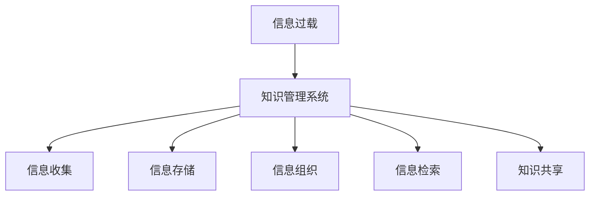

                 

# 信息过载与知识管理系统实施：有效组织和检索信息的指南

> 关键词：信息过载,知识管理系统,信息检索,信息组织,信息管理

## 1. 背景介绍

### 1.1 问题由来

在现代社会，信息量的爆炸式增长，尤其是互联网和数字技术的普及，使得我们面临前所未有的信息过载问题。信息过载（Information Overload）指的是人们接受到的信息量远远超过了他们处理能力的现象。过载的信息不仅占用了大量的时间和精力，还会造成决策困难、效率降低、注意力分散等一系列问题，严重制约了个人和组织的工作效率。如何有效组织和检索信息，成为一个亟待解决的难题。

### 1.2 问题核心关键点

为应对信息过载问题，需要构建一个有效的知识管理系统（Knowledge Management System, KMS）。知识管理系统旨在帮助组织和个人高效收集、存储、检索、共享和利用知识资源，以提高信息处理效率和决策支持能力。

具体而言，一个有效的知识管理系统需要具备以下核心功能：

- **信息收集**：从各种渠道收集相关信息，如文档、邮件、网页等。
- **信息存储**：通过结构化或非结构化的方式，将信息存储到系统之中。
- **信息组织**：利用分类、标签、元数据等手段，将信息进行有序整理，便于后续检索和利用。
- **信息检索**：提供高效的查询机制，支持用户快速定位所需信息。
- **知识共享**：支持用户之间的知识分享与协作，促进知识流动和创新。

一个成功实施的知识管理系统，能够显著提升信息处理效率和知识利用率，减少信息过载带来的困扰，是现代企业组织和个人知识管理不可或缺的工具。

## 2. 核心概念与联系

### 2.1 核心概念概述

以下是构建知识管理系统的几个核心概念：

- **信息过载**：指信息量超出了人们的信息处理能力，导致决策困难和工作效率下降。
- **知识管理系统**：一个用于高效收集、存储、组织和检索知识的平台。
- **信息检索**：通过一定的方式，快速定位和获取所需信息。
- **信息组织**：通过分类、标签、元数据等手段，将信息进行有序整理，便于后续检索和利用。
- **知识共享**：支持用户之间的知识分享与协作，促进知识流动和创新。

这些概念之间的关系可以通过以下Mermaid流程图来展示：



## 3. 核心算法原理 & 具体操作步骤

### 3.1 算法原理概述

一个有效的知识管理系统通常基于以下几个核心算法和原理：

- **自然语言处理（NLP）**：用于理解和处理文本信息，支持信息的检索和分类。
- **信息检索算法**：如倒排索引、向量空间模型等，用于快速定位和获取所需信息。
- **信息组织算法**：如标签云、分类树等，用于信息的分类和组织。
- **知识共享算法**：如协同过滤、社交网络等，用于促进知识的分享和协作。

这些算法共同构成了知识管理系统的核心技术架构，确保了系统的信息处理效率和知识共享能力。

### 3.2 算法步骤详解

一个典型的知识管理系统实施步骤包括：

**Step 1: 需求分析**
- 定义知识管理系统的目标和需求，如信息收集、存储、检索、共享等。
- 确定系统支持的业务场景和用户群体。

**Step 2: 系统设计**
- 设计系统的架构和技术栈，选择合适的前端和后端技术。
- 定义数据的存储和管理方式，如使用关系型数据库、文档数据库或搜索引擎。

**Step 3: 数据收集和整理**
- 收集和整理各类业务数据，如文档、邮件、网页等。
- 清洗和预处理数据，去除噪声和重复信息，确保数据质量。

**Step 4: 信息检索和分类**
- 利用NLP技术，提取文档的主题、关键词等信息，建立倒排索引或向量空间模型。
- 根据业务需求，设计分类和标签体系，对文档进行分类和组织。

**Step 5: 知识共享和协作**
- 实现知识共享功能，如文档上传、下载、评论等。
- 设计协作工具，如讨论区、论坛等，促进用户之间的知识交流和协作。

**Step 6: 系统测试和部署**
- 进行系统测试，确保各个功能模块稳定运行。
- 部署系统到生产环境，监控系统性能和稳定性。

**Step 7: 持续优化和维护**
- 根据用户反馈和业务需求，持续优化系统功能。
- 定期备份数据，确保系统安全稳定运行。

### 3.3 算法优缺点

知识管理系统的优点包括：

- 提升信息处理效率，减少信息过载的困扰。
- 促进知识共享和协作，加速组织创新。
- 系统化地组织和管理知识，便于后续检索和利用。

然而，知识管理系统也存在一些局限：

- 初始投资大，系统搭建和维护成本高。
- 系统设计复杂，需要技术团队的专业知识和技能。
- 数据质量和用户参与度直接影响系统效果。

## 4. 数学模型和公式 & 详细讲解 & 举例说明

### 4.1 数学模型构建

知识管理系统的核心在于信息检索和分类。信息检索通常使用倒排索引（Inverted Index）和向量空间模型（Vector Space Model, VSM）等技术。以下是倒排索引的数学模型构建：

**倒排索引模型**
假设我们有一篇文档 $d$，包含 $N$ 个单词，每个单词对应的词频为 $f_w$，文档长度为 $L$。

$N$ 个单词的倒排索引可以表示为一个字典，其中每个单词 $w$ 对应一个列表，列表中存储了所有包含该单词的文档的 ID 列表。

**向量空间模型**
向量空间模型将文档表示为一个高维向量，每个维度表示一个单词或词组，向量的值表示该单词在文档中的权重。

$N$ 个单词的文档向量可以表示为：

$$ \mathbf{v}_d = \left( \frac{f_{w_1}}{L}, \frac{f_{w_2}}{L}, ..., \frac{f_{w_N}}{L} \right) $$

其中，$w_i$ 表示第 $i$ 个单词，$L$ 表示文档长度。

### 4.2 公式推导过程

倒排索引和向量空间模型的核心在于如何计算单词权重和文档向量。常用的权重计算方法包括 TF-IDF（Term Frequency-Inverse Document Frequency）和 BM25 等。

**TF-IDF 权重计算公式**
TF-IDF 是一种常用的文本权重计算方法，其公式如下：

$$ tf(w) = \frac{\text{单词 } w \text{ 在文档中出现的次数}}{\text{文档长度}} $$

$$ idf(w) = \log\left(\frac{总文档数}{包含单词 }w \text{ 的文档数} + 1\right) $$

$$ \text{TF-IDF}(w) = tf(w) \times idf(w) $$

**BM25 权重计算公式**
BM25 是一种改进的权重计算方法，公式如下：

$$ k_1 = 1.2, k_2 = 1.5 $$

$$ \text{IDF}(w) = \log\left(\frac{N}{N_q + 1} \times (1 + k_1 \times (1 - b + b \times \frac{L}{\text{avg}L})\right) $$

$$ \text{TF}(w) = f(w) \times (1 - k_1 \times 1_{w \in D}) \times k_1 \times (1 + b \times (1 - b) \times \frac{L}{\text{avg}L}) $$

其中，$N$ 表示总文档数，$N_q$ 表示查询文档数，$L$ 表示文档平均长度，$avgL$ 表示文档平均长度。

### 4.3 案例分析与讲解

假设我们有一个包含若干篇文档的文档集合，每篇文档由若干单词组成。我们可以通过计算 TF-IDF 或 BM25 权重，构建文档向量，并将其存储到倒排索引中。

例如，假设我们有以下两篇文档：

**文档1**： "今天天气真好，适合出门游玩。"

**文档2**： "明天公司安排会议，不要迟到。"

我们可以通过以下步骤计算 TF-IDF 权重，并构建文档向量：

1. 计算单词权重
   - 对于单词 "今天"，文档1中出现了1次，文档2中未出现，因此其 TF-IDF 权重为 $\log(2) \times 2$。
   - 对于单词 "天气"，两篇文档均出现了1次，因此其 TF-IDF 权重为 $\log(2) \times 2$。
   - 对于单词 "好"，文档1中出现了1次，文档2中未出现，因此其 TF-IDF 权重为 $\log(2) \times 2$。
   - 对于单词 "适合"，文档1中出现了1次，文档2中未出现，因此其 TF-IDF 权重为 $\log(2) \times 2$。
   - 对于单词 "出门"，文档1中出现了1次，文档2中未出现，因此其 TF-IDF 权重为 $\log(2) \times 2$。
   - 对于单词 "游玩"，文档1中出现了1次，文档2中未出现，因此其 TF-IDF 权重为 $\log(2) \times 2$。

2. 构建文档向量
   - 对于文档1，其 TF-IDF 向量为 $(\log(2) \times 2, \log(2) \times 2, \log(2) \times 2, \log(2) \times 2, \log(2) \times 2, \log(2) \times 2)$。
   - 对于文档2，其 TF-IDF 向量为 $(0, 0, 0, 0, 0, 0)$。

3. 构建倒排索引
   - 对于单词 "今天"，将其对应的文档ID列表存储到倒排索引中。
   - 对于单词 "天气"，将其对应的文档ID列表存储到倒排索引中。
   - 对于单词 "好"，将其对应的文档ID列表存储到倒排索引中。
   - 对于单词 "适合"，将其对应的文档ID列表存储到倒排索引中。
   - 对于单词 "出门"，将其对应的文档ID列表存储到倒排索引中。
   - 对于单词 "游玩"，将其对应的文档ID列表存储到倒排索引中。

通过以上步骤，我们就建立了一个简单的倒排索引，并使用 TF-IDF 权重构建了文档向量。这样的知识管理系统，能够快速定位包含特定单词的文档，支持信息检索和分类功能。

## 5. 项目实践：代码实例和详细解释说明

### 5.1 开发环境搭建

要进行知识管理系统的开发，需要搭建一个适合的技术栈。以下是Python环境下知识管理系统开发的常见技术栈：

1. **Python**：作为后端开发的主要语言。
2. **Flask/Django**：作为Web框架，用于构建Web应用。
3. **Elasticsearch**：作为搜索引擎，用于构建倒排索引和支持信息检索。
4. **SQLite/PostgreSQL**：作为数据库，用于存储文档和元数据。
5. **NLTK/SpaCy**：作为NLP工具，用于文本处理和分析。

在Python环境中，可以使用pip安装上述依赖：

```bash
pip install flask elasticsearch sqlite3 nltk spacy
```

### 5.2 源代码详细实现

以下是一个简单的知识管理系统的代码实现，包括文档上传、检索和分类等功能：

```python
from flask import Flask, request, jsonify
from flask_sqlalchemy import SQLAlchemy
from flask_whoosh import Whoosh

app = Flask(__name__)

# 数据库配置
app.config['SQLALCHEMY_DATABASE_URI'] = 'sqlite:///example.db'
app.config['WHOOSH_INDEX'] = 'example'

# 初始化数据库和搜索引擎
db = SQLAlchemy(app)
index = Whoosh.index()

# 定义数据模型
class Document(db.Model):
    id = db.Column(db.Integer, primary_key=True)
    title = db.Column(db.String(256))
    content = db.Column(db.Text)

# 初始化搜索引擎
index = Whoosh.index.load(app.config['WHOOSH_INDEX'])
app.before_first_request(index.create_in(app.config['WHOOSH_INDEX'], Whoosh.create_in))
app.before_app teardown(index.delete)

# 添加文档
@app.route('/documents', methods=['POST'])
def add_document():
    data = request.json
    doc = Document(title=data['title'], content=data['content'])
    db.session.add(doc)
    db.session.commit()
    index.add_document(doc)
    return jsonify({'message': 'Document added successfully'})

# 检索文档
@app.route('/documents', methods=['GET'])
def search_documents():
    query = request.args.get('query')
    results = index.search(query)
    docs = []
    for result in results:
        doc = Document.query.filter_by(id=result['id']).first()
        docs.append({'id': doc.id, 'title': doc.title, 'content': doc.content})
    return jsonify(docs)

# 运行应用
if __name__ == '__main__':
    app.run(debug=True)
```

### 5.3 代码解读与分析

以上代码实现了一个简单的知识管理系统，包括文档上传和检索功能。以下是代码的关键解释：

**Flask 配置**
- 使用Flask框架搭建Web应用。
- 配置数据库为SQLite，用于存储文档信息。
- 配置Whoosh搜索引擎，用于构建倒排索引和支持信息检索。

**数据模型**
- 定义Document模型，包含文档的标题和内容字段。
- 使用SQLAlchemy库进行数据库操作，将文档信息存储到数据库中。

**文档上传**
- 定义`/add_document`接口，接收JSON格式的文档信息，创建Document对象并保存到数据库和搜索引擎中。

**文档检索**
- 定义`/search_documents`接口，接收查询参数，使用Whoosh搜索引擎进行文本检索，并返回符合查询结果的文档列表。

通过以上代码实现，我们构建了一个简单的知识管理系统，能够支持文档上传和基于文本查询的信息检索功能。

### 5.4 运行结果展示

在运行上述代码后，我们可以通过访问`/add_document`接口上传文档，并通过访问`/search_documents`接口进行文档检索。

例如，上传一篇文档：

```
POST /documents
Content-Type: application/json

{
  "title": "今天天气真好",
  "content": "适合出门游玩"
}
```

查询标题包含“天气”的文档：

```
GET /documents?query=天气
```

## 6. 实际应用场景

### 6.1 智能客服系统

智能客服系统通过构建知识管理系统，能够快速响应客户咨询，提供高效准确的解决方案。通过将常见问题文档存储到知识管理系统中，智能客服系统能够快速定位和回答客户的问题，提升客户满意度。

例如，在医疗领域，智能客服系统可以存储医生问答记录、常见疾病信息等文档，并根据用户提问快速检索相关信息，提供诊断建议和推荐医生。

### 6.2 企业知识库

企业知识库通过构建知识管理系统，能够系统化地管理企业内部知识资源，支持员工快速查找和使用相关文档。通过将企业文档、项目文档、培训资料等存储到知识管理系统中，员工能够快速检索所需信息，加速知识共享和协作。

例如，在软件开发领域，企业知识库可以存储项目需求文档、技术文档、测试文档等，支持开发人员快速定位所需信息，加速项目开发进程。

### 6.3 个人笔记系统

个人笔记系统通过构建知识管理系统，能够高效组织和管理个人笔记和文档。通过将笔记、文档、图片等存储到知识管理系统中，个人用户能够快速检索和分类信息，提升信息处理效率。

例如，在学术研究领域，个人笔记系统可以存储研究论文、笔记、代码等文档，支持研究人员快速定位所需信息，加速研究进程。

## 7. 工具和资源推荐

### 7.1 学习资源推荐

为了帮助开发者系统掌握知识管理系统的理论基础和实践技巧，以下是一些优质的学习资源：

1. **《信息检索基础》**：一本经典的NLP入门书籍，介绍了信息检索的基本原理和算法。
2. **《搜索引擎设计与实现》**：一本详细介绍搜索引擎设计和实现的书籍，涵盖倒排索引、TF-IDF、BM25等核心算法。
3. **《Python Web开发实战》**：一本Python Web开发实战书籍，介绍了Flask等Web框架的使用方法。
4. **《Whoosh搜索引擎开发》**：一本Whoosh搜索引擎开发的书籍，介绍了Whoosh搜索引擎的安装、配置和使用方法。

通过对这些资源的学习实践，相信你一定能够快速掌握知识管理系统的精髓，并用于解决实际的NLP问题。

### 7.2 开发工具推荐

高效的开发离不开优秀的工具支持。以下是几款用于知识管理系统开发的常用工具：

1. **Python**：作为后端开发的主要语言，Python具备简洁易读的特点，适合快速迭代研究。
2. **Flask/Django**：作为Web框架，提供了简单易用的开发接口和组件，支持RESTful API设计。
3. **Elasticsearch**：作为搜索引擎，支持高性能的文本检索和分析功能，适合大规模数据处理。
4. **SQLite/PostgreSQL**：作为数据库，支持关系型数据存储和管理，适合复杂数据结构处理。
5. **NLTK/SpaCy**：作为NLP工具，提供了丰富的文本处理和分析功能，适合NLP任务开发。

合理利用这些工具，可以显著提升知识管理系统的开发效率，加快创新迭代的步伐。

### 7.3 相关论文推荐

知识管理系统的发展源于学界的持续研究。以下是几篇奠基性的相关论文，推荐阅读：

1. **《信息检索算法综述》**：一篇综述文章，介绍了信息检索算法的发展历程和最新进展。
2. **《搜索引擎原理与技术》**：一本介绍搜索引擎原理和技术的书籍，涵盖了倒排索引、TF-IDF、BM25等核心算法。
3. **《知识管理系统的设计与实现》**：一篇学术论文，介绍了知识管理系统的设计和实现方法，适合作为项目参考。

这些论文代表了大语言模型微调技术的发展脉络。通过学习这些前沿成果，可以帮助研究者把握学科前进方向，激发更多的创新灵感。

## 8. 总结：未来发展趋势与挑战

### 8.1 研究成果总结

本文对知识管理系统实施的原理和实践进行了全面系统的介绍。首先阐述了信息过载问题以及知识管理系统的重要性。接着从原理到实践，详细讲解了知识管理系统的核心算法和具体操作步骤，给出了知识管理系统开发的完整代码实例。同时，本文还广泛探讨了知识管理系统在智能客服、企业知识库、个人笔记系统等实际应用场景中的应用前景，展示了知识管理系统的巨大潜力。最后，本文精选了知识管理系统的学习资源、开发工具和相关论文，力求为开发者提供全方位的技术指引。

### 8.2 未来发展趋势

展望未来，知识管理系统的技术将呈现以下几个发展趋势：

1. **多模态数据融合**：知识管理系统将支持多模态数据（如文本、图片、视频等）的融合处理，提升信息处理能力和知识共享效率。
2. **语义搜索和推荐**：通过语义分析和推荐算法，知识管理系统将能够提供更加精准和个性化的信息检索和推荐服务。
3. **实时数据处理**：知识管理系统将具备实时数据处理能力，支持动态更新和实时检索。
4. **自适应学习**：通过机器学习和自适应算法，知识管理系统将能够自动学习用户行为和偏好，提供更加智能的信息检索和分类服务。
5. **跨领域应用**：知识管理系统将扩展到更多领域，如医疗、金融、教育等，为不同领域的知识管理提供支持。

以上趋势凸显了知识管理系统的广阔前景。这些方向的探索发展，必将进一步提升信息处理效率和知识共享能力，为组织和个人提供更加智能和高效的知识管理服务。

### 8.3 面临的挑战

尽管知识管理系统已经取得了不小的进展，但在迈向更加智能化、普适化应用的过程中，它仍面临着诸多挑战：

1. **数据质量和标注成本**：知识管理系统需要大量的高质量标注数据进行训练和优化，获取数据成本高昂。
2. **系统复杂度和维护成本**：知识管理系统涉及多种技术和组件，系统设计和维护复杂度较高。
3. **用户参与度和协作问题**：知识管理系统的有效性很大程度上取决于用户参与度和协作机制。
4. **隐私和安全性问题**：知识管理系统涉及敏感信息存储和处理，隐私和安全问题需要特别注意。
5. **跨领域应用问题**：知识管理系统在特定领域应用时，可能面临数据分布差异、领域知识差异等问题。

这些挑战需要研究者和实践者共同应对，通过技术创新和实践优化，逐步克服这些难题，实现知识管理系统的广泛应用。

### 8.4 研究展望

面对知识管理系统面临的挑战，未来的研究需要在以下几个方面寻求新的突破：

1. **自动化数据标注**：通过自动标注技术，减少知识管理系统对人工标注数据的依赖，降低系统成本。
2. **跨领域知识迁移**：研究跨领域知识迁移方法，使得知识管理系统在不同领域间具备较好的适应性和迁移能力。
3. **用户行为建模**：通过用户行为建模，优化知识管理系统的推荐算法，提升信息检索和分类的准确性。
4. **隐私保护技术**：研究隐私保护技术，确保知识管理系统在数据存储和处理中的隐私和安全。
5. **多模态数据融合**：研究多模态数据融合技术，支持知识管理系统处理更多种类的信息，提升信息处理效率。

这些研究方向将为知识管理系统的发展提供新的动力，推动知识管理系统的普及和应用，为人类知识管理提供更加智能和高效的工具。总之，知识管理系统是一个涉及技术、数据、用户等多方面的复杂系统，需要不断探索和创新，才能充分发挥其潜力，为信息过载问题提供有效的解决方案。

---

作者：禅与计算机程序设计艺术 / Zen and the Art of Computer Programming

