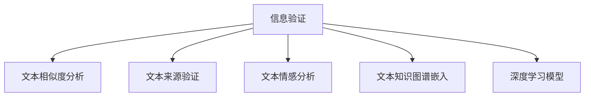

                 

# 信息验证和事实检查：在错误信息泛滥的时代导航

> 关键词：信息验证, 事实检查, 错误信息, 人工智能, 自然语言处理(NLP), 深度学习, 信息检索

## 1. 背景介绍

### 1.1 问题由来
随着互联网的普及和社交媒体的兴起，虚假信息、错误报道和假新闻的数量急剧增加，给社会公共秩序和公众认知带来严重挑战。这些错误信息不仅误导公众，影响决策，还可能对社会稳定和公共安全构成威胁。因此，如何在信息泛滥的时代，迅速准确地辨别真实与虚假，成为一个亟需解决的问题。

### 1.2 问题核心关键点
信息验证和事实检查的核心在于，通过自动化技术，快速且准确地判断文本信息的真实性。主要包括：

- 文本相似度分析：判断两个文本是否表达相似内容，辅助识别重复或篡改信息。
- 文本来源验证：基于已知的可信来源和可信度，判断文本是否来源于可靠渠道。
- 文本情感分析：识别文本的情感倾向，辅助判断信息的可信度。
- 文本知识图谱嵌入：将文本嵌入到知识图谱中，利用结构化知识辅助判断信息真实性。
- 深度学习模型：利用深度学习模型，如BERT、GPT等，进行文本分类、情感分析和实体链接等任务。

这些核心方法在大规模数据和复杂场景中，能够有效地辅助人工进行信息验证和事实检查。

## 2. 核心概念与联系

### 2.1 核心概念概述

为了更好地理解信息验证和事实检查技术，本节将介绍几个密切相关的核心概念：

- **信息验证**：通过技术手段，自动化地检查信息来源的真实性，识别虚假信息、错误报道和假新闻。
- **事实检查**：针对具体事实的准确性进行验证，确保信息的真实性。
- **自然语言处理(NLP)**：利用计算机技术处理和分析人类语言，是信息验证和事实检查的基础技术。
- **深度学习**：基于神经网络的学习方法，在信息验证和事实检查中，广泛用于文本分类、情感分析等任务。
- **知识图谱**：结构化知识库，包含实体和实体之间的关系，辅助信息验证。
- **错误信息**：指在新闻、社交媒体中广泛传播的虚假、错误或夸大的信息。

这些核心概念之间的逻辑关系可以通过以下Mermaid流程图来展示：



这个流程图展示出信息验证和事实检查技术的核心工作流程：

1. 利用文本相似度分析，识别重复或篡改信息。
2. 通过文本来源验证，判断文本是否来源于可靠渠道。
3. 使用文本情感分析，识别信息情感倾向，辅助判断可信度。
4. 嵌入文本到知识图谱，利用结构化知识辅助判断信息真实性。
5. 使用深度学习模型，进行文本分类、情感分析和实体链接等任务。

## 3. 核心算法原理 & 具体操作步骤

### 3.1 算法原理概述

信息验证和事实检查的核心算法基于自然语言处理(NLP)和深度学习。通过构建文本表示，使用深度学习模型进行分类、情感分析、实体识别等任务，辅助人工进行信息验证和事实检查。

### 3.2 算法步骤详解

信息验证和事实检查的典型流程包括以下几个关键步骤：

**Step 1: 数据预处理**

1. 数据收集：从社交媒体、新闻网站等渠道收集待验证信息。
2. 文本清洗：去除HTML标签、停用词、标点符号等噪音。
3. 文本标准化：将文本转换为小写，去除大小写、标点符号等差异。
4. 分词和词向量嵌入：使用NLP技术将文本转换为向量表示。

**Step 2: 特征提取**

1. 文本表示：使用TF-IDF、Word2Vec、BERT等方法，将文本转换为向量表示。
2. 实体识别：使用NER模型识别文本中的人名、地名、组织名等实体。
3. 文本相似度计算：使用余弦相似度、Jaccard相似度等方法，计算文本之间的相似度。

**Step 3: 模型训练和验证**

1. 构建模型：使用深度学习框架，构建文本分类、情感分析等模型。
2. 训练模型：使用标注数据训练模型，优化模型参数。
3. 模型评估：在验证集上评估模型性能，调整模型参数。

**Step 4: 事实验证**

1. 事实检索：根据识别出的实体，在可信数据库（如Wikipedia、FactCheck.org等）中检索相关信息。
2. 文本对比：将待验证文本与检索到的信息进行对比，判断其真实性。
3. 标注和反馈：将验证结果标注为真实或虚假，并记录错误的验证原因。

**Step 5: 持续学习**

1. 数据更新：定期更新待验证数据，增加新数据源。
2. 模型更新：使用新数据重新训练模型，提升模型精度。
3. 错误纠正：根据验证结果，纠正错误的验证标注，提高模型准确性。

### 3.3 算法优缺点

信息验证和事实检查技术的优点在于：

1. 高效性：通过自动化技术，能够快速处理大量文本信息，节省人工成本。
2. 精确性：利用深度学习模型，能够识别出复杂的文本信息，提高验证的准确性。
3. 可扩展性：能够处理不同类型和规模的数据，适应不同的应用场景。

缺点包括：

1. 依赖数据质量：模型训练和验证效果依赖于标注数据的准确性。
2. 过拟合风险：在大规模数据上训练的模型，可能对噪声数据敏感。
3. 模型偏见：模型可能学习到数据中的偏见，导致错误判断。
4. 冷启动问题：新出现的信息可能无法被现有模型有效识别。

### 3.4 算法应用领域

信息验证和事实检查技术在以下领域有广泛应用：

- **新闻媒体**：辅助新闻机构进行事实检查，确保新闻报道的准确性。
- **社交媒体**：监测社交媒体上的虚假信息和错误报道，保护公众认知。
- **金融市场**：实时监测金融市场信息，避免误导性报道和谣言传播。
- **政府机构**：辅助政府机构进行信息验证和政策决策，确保决策的准确性和公正性。
- **教育领域**：辅助教育机构进行信息筛选和内容验证，确保教育资源的质量。

## 4. 数学模型和公式 & 详细讲解

### 4.1 数学模型构建

信息验证和事实检查的主要数学模型包括：

1. 文本分类模型：利用深度学习模型，如BERT、CNN、RNN等，进行文本分类任务。
2. 情感分析模型：使用深度学习模型，进行情感极性分类。
3. 文本相似度模型：利用余弦相似度、Jaccard相似度等方法，计算文本相似度。

### 4.2 公式推导过程

以文本分类为例，假设模型输入为文本向量 $x$，标签为 $y \in \{0, 1\}$，模型预测输出为 $\hat{y}$。交叉熵损失函数为：

$$
\ell(x, y) = -\sum_{i=1}^n y_i \log \hat{y}_i
$$

其中 $n$ 为分类数量，$\hat{y}_i$ 为模型对第 $i$ 类别的预测概率。

使用Adam优化器进行模型参数更新，更新公式为：

$$
\theta \leftarrow \theta - \eta \nabla_{\theta} \ell(x, y) - \eta\lambda\theta
$$

其中 $\eta$ 为学习率，$\lambda$ 为正则化系数。

### 4.3 案例分析与讲解

以使用BERT进行新闻事实检查为例，步骤如下：

1. 收集新闻报道和相关的事实信息。
2. 对新闻报道进行文本清洗和标准化。
3. 使用BERT模型进行文本表示，计算文本相似度。
4. 在知识图谱中检索相关事实信息，计算信息匹配度。
5. 结合文本相似度和信息匹配度，判断新闻报道的真实性。

## 5. 项目实践：代码实例和详细解释说明

### 5.1 开发环境搭建

在进行信息验证和事实检查实践前，我们需要准备好开发环境。以下是使用Python进行TensorFlow开发的环境配置流程：

1. 安装Anaconda：从官网下载并安装Anaconda，用于创建独立的Python环境。
2. 创建并激活虚拟环境：
```bash
conda create -n tf-env python=3.8 
conda activate tf-env
```
3. 安装TensorFlow：根据CUDA版本，从官网获取对应的安装命令。例如：
```bash
conda install tensorflow tensorflow-cpu==2.6.0 -c conda-forge
```
4. 安装各类工具包：
```bash
pip install numpy pandas scikit-learn matplotlib tqdm jupyter notebook ipython
```

完成上述步骤后，即可在`tf-env`环境中开始信息验证和事实检查的实践。

### 5.2 源代码详细实现

这里我们以使用BERT进行新闻事实检查为例，给出使用TensorFlow进行代码实现。

首先，定义数据预处理函数：

```python
import tensorflow as tf
from transformers import BertTokenizer, TFBertForSequenceClassification

tokenizer = BertTokenizer.from_pretrained('bert-base-cased')
model = TFBertForSequenceClassification.from_pretrained('bert-base-cased', num_labels=2)

def preprocess_text(text):
    encoded_input = tokenizer.encode(text, return_tensors='tf')
    return encoded_input
```

然后，定义模型训练函数：

```python
def train_model(model, tokenizer, train_dataset, epochs, batch_size):
    dataset = tf.data.Dataset.from_tensor_slices((train_dataset.texts, train_dataset.labels))
    dataset = dataset.map(preprocess_text).batch(batch_size).shuffle(buffer_size=1000)
    model.compile(optimizer=tf.keras.optimizers.Adam(learning_rate=2e-5), loss=tf.keras.losses.BinaryCrossentropy(from_logits=True), metrics=['accuracy'])
    model.fit(dataset, epochs=epochs, validation_split=0.1)
```

接着，定义模型预测函数：

```python
def predict(model, text):
    encoded_input = tokenizer.encode(text, return_tensors='tf')
    return model.predict(encoded_input)[0]
```

最后，启动训练流程并在测试集上评估：

```python
train_dataset = ...
test_dataset = ...
train_model(model, tokenizer, train_dataset, epochs=5, batch_size=16)

# 使用模型进行预测
predict(model, 'This is a fake news article.')
```

以上就是使用TensorFlow对BERT进行新闻事实检查的完整代码实现。可以看到，TensorFlow配合BERT等预训练模型，使得新闻事实检查的代码实现变得简洁高效。

### 5.3 代码解读与分析

让我们再详细解读一下关键代码的实现细节：

**preprocess_text函数**：
- 将文本输入转换为BERT模型所需的token ids，并进行pad操作。
- 返回预处理后的token ids和attention mask。

**train_model函数**：
- 使用TFDataDataset对数据进行预处理和批次化加载。
- 使用Adam优化器训练模型，并设定二分类交叉熵损失函数和准确率评估指标。
- 在验证集上进行评估，每epoch输出验证集上的准确率。

**predict函数**：
- 对新文本进行预处理，并使用模型进行预测，返回预测结果。

这些代码展示了如何使用TensorFlow构建和使用BERT模型进行新闻事实检查的详细流程。TensorFlow提供了强大的深度学习框架，与BERT等预训练模型无缝集成，使得模型训练和预测过程变得简单高效。

当然，工业级的系统实现还需考虑更多因素，如模型的保存和部署、超参数的自动搜索、更灵活的任务适配层等。但核心的模型训练和预测逻辑基本与此类似。

## 6. 实际应用场景

### 6.1 新闻媒体

基于信息验证和事实检查技术，新闻机构可以构建实时监控系统，辅助记者进行事实检查，确保新闻报道的准确性。

在技术实现上，可以建立文本相似度、文本来源验证和情感分析等多个模块，用于辅助记者快速识别虚假信息、错误报道和假新闻。同时，新闻机构可以利用知识图谱技术，实时查询和验证相关事实信息，提高报道的真实性和可信度。

### 6.2 社交媒体

社交媒体平台可以通过信息验证和事实检查技术，监测和管理虚假信息和错误报道，保护公众认知。

具体而言，可以在社交媒体上部署实时监控系统，对用户发布的内容进行文本相似度分析和实体识别，标记可疑信息，提醒用户或管理人员进行进一步验证。同时，社交媒体平台可以使用知识图谱和深度学习模型，辅助平台管理员进行信息审核和违规内容处理。

### 6.3 金融市场

金融市场信息的不准确和误导性传播，可能导致市场波动和经济损失。通过信息验证和事实检查技术，金融机构可以实时监测金融信息，避免误导性报道和谣言传播。

在实践中，金融机构可以利用新闻媒体、社交媒体等多渠道数据，构建信息验证和事实检查系统，对实时新闻和社交媒体信息进行快速判断和处理。同时，金融机构可以利用深度学习模型和知识图谱技术，辅助信息验证和风险控制。

### 6.4 未来应用展望

随着信息验证和事实检查技术的不断发展，其在以下领域将得到更广泛的应用：

- **医疗健康**：辅助医院和医疗机构进行信息验证和事实检查，确保医疗信息的准确性和可信度。
- **公共安全**：实时监测和验证网络上的虚假信息和谣言，保护公共安全和稳定。
- **教育领域**：辅助教育机构进行信息筛选和内容验证，确保教育资源的质量和可信度。
- **政府机构**：辅助政府机构进行信息验证和政策决策，确保决策的准确性和公正性。

## 7. 工具和资源推荐

### 7.1 学习资源推荐

为了帮助开发者系统掌握信息验证和事实检查的理论基础和实践技巧，这里推荐一些优质的学习资源：

1. **《自然语言处理综述》**：由斯坦福大学开设的NLP课程，介绍了NLP的基础理论和经典模型。
2. **《TensorFlow官方文档》**：提供了完整的TensorFlow开发指南和示例代码，适合初学者和专业人士。
3. **《深度学习基础》**：由Coursera和DeepLearning.ai提供的深度学习课程，涵盖深度学习的基础知识和实践技能。
4. **《信息验证和事实检查》**：深度学习技术在信息验证和事实检查中的最新进展，适合研究者和开发者。
5. **《知识图谱构建与应用》**：介绍知识图谱的构建和应用方法，适合需要进行知识图谱嵌入的开发者。

通过对这些资源的学习实践，相信你一定能够快速掌握信息验证和事实检查的精髓，并用于解决实际的NLP问题。

### 7.2 开发工具推荐

高效的开发离不开优秀的工具支持。以下是几款用于信息验证和事实检查开发的常用工具：

1. **TensorFlow**：基于Python的开源深度学习框架，支持分布式训练和模型部署。
2. **PyTorch**：基于Python的开源深度学习框架，灵活性高，适合研究型开发。
3. **Scikit-learn**：Python的机器学习库，提供常用的分类、聚类、回归等算法。
4. **NLTK**：Python的自然语言处理库，提供分词、词性标注、命名实体识别等功能。
5. **Gensim**：Python的文本处理和建模库，提供文本相似度计算和主题建模等功能。

合理利用这些工具，可以显著提升信息验证和事实检查的开发效率，加快创新迭代的步伐。

### 7.3 相关论文推荐

信息验证和事实检查技术的发展源于学界的持续研究。以下是几篇奠基性的相关论文，推荐阅读：

1. **《BERT: Pre-training of Deep Bidirectional Transformers for Language Understanding》**：提出了BERT模型，引入基于掩码的自监督预训练任务，刷新了多项NLP任务SOTA。
2. **《A Survey on Fact-Checking via Natural Language Processing》**：综述了信息验证和事实检查技术的研究进展和应用场景。
3. **《Detecting Misinformation with Deep Learning》**：介绍了深度学习在虚假信息检测中的应用。
4. **《Knowledge-Graph Embeddings and Their Application to Information Retrieval》**：介绍了知识图谱嵌入技术及其在信息检索中的应用。

这些论文代表了大语言模型微调技术的发展脉络。通过学习这些前沿成果，可以帮助研究者把握学科前进方向，激发更多的创新灵感。

## 8. 总结：未来发展趋势与挑战

### 8.1 总结

本文对信息验证和事实检查技术进行了全面系统的介绍。首先阐述了信息验证和事实检查技术的研究背景和意义，明确了其在虚假信息泛滥时代的重要价值。其次，从原理到实践，详细讲解了信息验证和事实检查的数学原理和关键步骤，给出了信息验证和事实检查任务开发的完整代码实例。同时，本文还广泛探讨了信息验证和事实检查技术在新闻媒体、社交媒体、金融市场等多个行业领域的应用前景，展示了信息验证和事实检查技术的巨大潜力。此外，本文精选了信息验证和事实检查技术的各类学习资源，力求为读者提供全方位的技术指引。

通过本文的系统梳理，可以看到，信息验证和事实检查技术正在成为NLP领域的重要范式，极大地拓展了预训练语言模型的应用边界，催生了更多的落地场景。受益于大规模语料的预训练，信息验证和事实检查模型以更低的时间和标注成本，在小样本条件下也能取得不错的效果，有力推动了NLP技术的产业化进程。未来，伴随预训练语言模型和信息验证和事实检查方法的持续演进，相信NLP技术将在更广阔的应用领域大放异彩，深刻影响人类的生产生活方式。

### 8.2 未来发展趋势

展望未来，信息验证和事实检查技术将呈现以下几个发展趋势：

1. **模型规模持续增大**：随着算力成本的下降和数据规模的扩张，预训练语言模型的参数量还将持续增长。超大规模语言模型蕴含的丰富语言知识，有望支撑更加复杂多变的信息验证和事实检查任务。
2. **技术融合多样化**：除了传统的文本分类、情感分析等任务，未来会引入更多先进技术，如知识图谱、深度强化学习等，提升信息验证和事实检查的效果和效率。
3. **智能推理增强**：结合因果推理、逻辑推理等技术，提升模型的智能推理能力，提高信息验证和事实检查的准确性和鲁棒性。
4. **跨领域知识整合**：结合不同领域的知识图谱和语料库，进行跨领域知识整合，提升信息验证和事实检查的泛化性和普适性。
5. **自动化标注和验证**：利用深度学习模型进行自动化标注和验证，减少人工标注的耗时和成本。

以上趋势凸显了信息验证和事实检查技术的广阔前景。这些方向的探索发展，必将进一步提升信息验证和事实检查的性能和应用范围，为构建真实可信的网络环境铺平道路。

### 8.3 面临的挑战

尽管信息验证和事实检查技术已经取得了瞩目成就，但在迈向更加智能化、普适化应用的过程中，它仍面临着诸多挑战：

1. **数据获取难度**：高质量、多样化的数据是信息验证和事实检查的基础，但获取标注数据的过程繁琐且成本高昂。
2. **模型偏见**：信息验证和事实检查模型可能学习到数据中的偏见，导致错误的判断和验证。
3. **冷启动问题**：新出现的信息可能无法被现有模型有效识别，需要进行持续的模型更新和优化。
4. **计算资源需求**：信息验证和事实检查任务涉及大规模数据处理和深度学习模型训练，对计算资源有较高需求。
5. **实时性问题**：在实时性要求较高的应用场景，信息验证和事实检查模型需要高效且稳定。

这些挑战需要研究者和开发者共同应对，不断优化算法和模型，提升信息验证和事实检查的性能和应用效果。

### 8.4 研究展望

面对信息验证和事实检查技术所面临的挑战，未来的研究需要在以下几个方面寻求新的突破：

1. **自动化标注和验证**：探索更多自动化标注和验证技术，减少人工标注的耗时和成本。
2. **跨领域知识整合**：结合不同领域的知识图谱和语料库，进行跨领域知识整合，提升信息验证和事实检查的泛化性和普适性。
3. **模型偏见纠正**：利用因果推理、逻辑推理等技术，纠正模型偏见，提升信息验证和事实检查的公正性和可信度。
4. **跨模态信息整合**：结合视觉、语音等多模态信息，提升信息验证和事实检查的准确性和鲁棒性。
5. **智能推理增强**：结合因果推理、逻辑推理等技术，提升模型的智能推理能力，提高信息验证和事实检查的准确性和鲁棒性。

这些研究方向需要研究者和开发者共同努力，推动信息验证和事实检查技术迈向更高的台阶，为构建真实可信的网络环境提供坚实的技术支撑。

## 9. 附录：常见问题与解答

**Q1: 信息验证和事实检查技术的主要应用场景有哪些？**

A: 信息验证和事实检查技术主要应用于以下场景：

- 新闻媒体：辅助新闻机构进行事实检查，确保新闻报道的准确性。
- 社交媒体：监测和管理虚假信息和错误报道，保护公众认知。
- 金融市场：实时监测和验证金融信息，避免误导性报道和谣言传播。
- 公共安全：实时监测和验证网络上的虚假信息和谣言，保护公共安全和稳定。
- 教育领域：辅助教育机构进行信息筛选和内容验证，确保教育资源的质量。
- 政府机构：辅助政府机构进行信息验证和政策决策，确保决策的准确性和公正性。

**Q2: 信息验证和事实检查技术的主要技术手段有哪些？**

A: 信息验证和事实检查技术主要包括以下技术手段：

- 文本相似度分析：判断两个文本是否表达相似内容，辅助识别重复或篡改信息。
- 文本来源验证：基于已知的可信来源和可信度，判断文本是否来源于可靠渠道。
- 文本情感分析：识别文本的情感倾向，辅助判断信息的可信度。
- 文本知识图谱嵌入：将文本嵌入到知识图谱中，利用结构化知识辅助判断信息真实性。
- 深度学习模型：利用深度学习模型，如BERT、GPT等，进行文本分类、情感分析等任务。

**Q3: 信息验证和事实检查技术的优势和劣势有哪些？**

A: 信息验证和事实检查技术的优势包括：

- 高效性：通过自动化技术，能够快速处理大量文本信息，节省人工成本。
- 精确性：利用深度学习模型，能够识别出复杂的文本信息，提高验证的准确性。
- 可扩展性：能够处理不同类型和规模的数据，适应不同的应用场景。

劣势包括：

- 依赖数据质量：模型训练和验证效果依赖于标注数据的准确性。
- 过拟合风险：在大规模数据上训练的模型，可能对噪声数据敏感。
- 模型偏见：模型可能学习到数据中的偏见，导致错误判断。
- 冷启动问题：新出现的信息可能无法被现有模型有效识别。

**Q4: 信息验证和事实检查技术在实际应用中需要注意哪些问题？**

A: 信息验证和事实检查技术在实际应用中需要注意以下问题：

- 数据质量：高质量、多样化的数据是信息验证和事实检查的基础，但获取标注数据的过程繁琐且成本高昂。
- 模型偏见：信息验证和事实检查模型可能学习到数据中的偏见，导致错误的判断和验证。
- 冷启动问题：新出现的信息可能无法被现有模型有效识别，需要进行持续的模型更新和优化。
- 计算资源需求：信息验证和事实检查任务涉及大规模数据处理和深度学习模型训练，对计算资源有较高需求。
- 实时性问题：在实时性要求较高的应用场景，信息验证和事实检查模型需要高效且稳定。

这些问题是信息验证和事实检查技术在实际应用中需要注意的关键点，需要进行全面的考虑和优化。

**Q5: 信息验证和事实检查技术在未来将面临哪些挑战？**

A: 信息验证和事实检查技术在未来将面临以下挑战：

- 数据获取难度：高质量、多样化的数据是信息验证和事实检查的基础，但获取标注数据的过程繁琐且成本高昂。
- 模型偏见：信息验证和事实检查模型可能学习到数据中的偏见，导致错误的判断和验证。
- 冷启动问题：新出现的信息可能无法被现有模型有效识别，需要进行持续的模型更新和优化。
- 计算资源需求：信息验证和事实检查任务涉及大规模数据处理和深度学习模型训练，对计算资源有较高需求。
- 实时性问题：在实时性要求较高的应用场景，信息验证和事实检查模型需要高效且稳定。

这些挑战需要研究者和开发者共同应对，不断优化算法和模型，提升信息验证和事实检查的性能和应用效果。

---

作者：禅与计算机程序设计艺术 / Zen and the Art of Computer Programming

