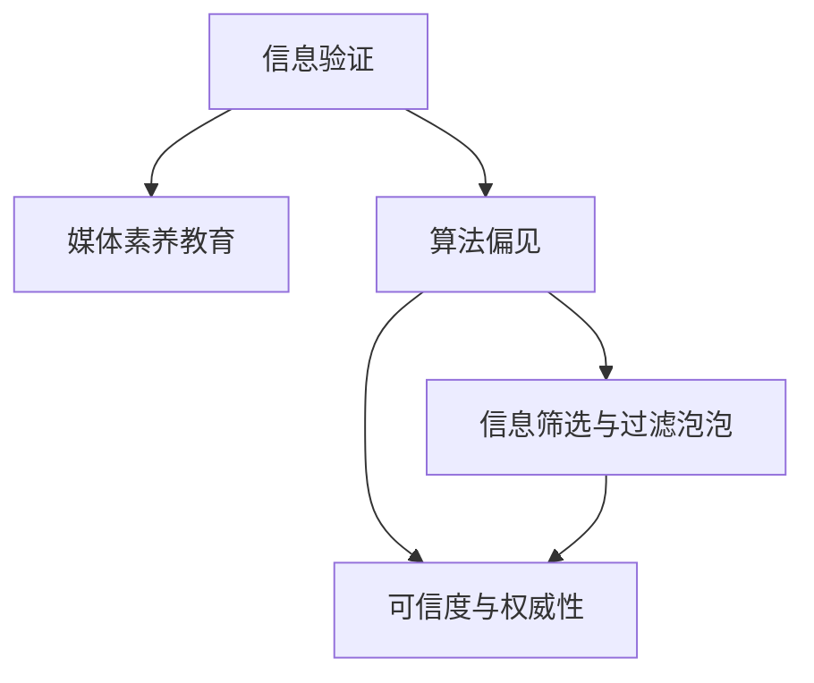

                 

# 信息验证和媒体素养教育：为假新闻和媒体操纵时代做好准备

在信息爆炸的今天，假新闻和媒体操纵现象愈发严重，这对公众的理解和判断能力提出了严峻挑战。面对这种态势，信息验证和媒体素养教育成为解决问题的关键。本文旨在探索如何构建一个有效且易用的信息验证和媒体素养教育框架，帮助公众识别假新闻，提高媒体素养，以应对复杂的媒体环境和信息获取需求。

## 1. 背景介绍

### 1.1 假新闻和媒体操纵的兴起

随着互联网的普及和社交媒体的崛起，信息传播的方式和途径发生了巨大变化。过去，假新闻往往难以在有限传播渠道内迅速扩散。但如今，算法驱动的内容推荐、个性化推送等手段，使得假新闻能够借助社交网络快速传播，有时甚至达到病毒式扩散的效果。

### 1.2 问题关键点

1. **信息过载与筛选难度**：互联网上的信息量庞大，筛选出可靠信息变得困难。
2. **算法偏见与过滤泡泡**：个性化算法可能导致信息过滤泡泡，使得用户接触到的信息单一。
3. **信息源多样性与权威性**：如何辨别不同来源的信息权威性和可靠性。
4. **用户媒体素养与教育**：提升用户对信息的敏感度和理解力。

## 2. 核心概念与联系

### 2.1 核心概念概述

为更好地理解信息验证和媒体素养教育的核心内容，我们将介绍几个关键概念：

- **信息验证**：指通过一定手段和方法，对信息来源、内容真实性进行核实，确保信息的准确性和可信度。
- **媒体素养教育**：通过教育提升公众识别、分析、评估和创造媒体内容的能力，培养良好的媒体使用习惯。
- **算法偏见**：指由于算法设计或数据选择等原因，导致算法在处理信息时产生倾向性，进而影响信息展示和筛选。
- **信息筛选与过滤泡泡**：通过算法过滤出的信息往往局限于用户的兴趣和习惯，形成信息筛选泡泡，影响信息的全面性和多样性。
- **可信度与权威性**：评估信息源的可信度和权威性，确保信息来源的可靠性。

这些概念通过一个简单的Mermaid流程图来表示，说明了它们之间的联系：



### 2.2 核心概念原理和架构

#### 2.2.1 信息验证原理

信息验证的本质是对信息进行核查和溯源，主要包括以下几个步骤：

1. **来源核查**：验证信息来源是否可信，包括官方网站、权威机构、知名记者等。
2. **内容比对**：通过与其他可靠来源的信息进行比对，验证内容的真实性。
3. **多方求证**：通过多方求证，确认信息的真实性，减少单一来源的偏差。
4. **技术手段**：利用技术手段如API、爬虫等，获取和验证信息。

#### 2.2.2 媒体素养教育原理

媒体素养教育旨在提升公众的信息识别、分析、评估和创造能力，主要包括以下几个方面：

1. **信息识别**：了解媒体信息的分类、结构与传播方式，区分事实、观点与推测。
2. **信息分析**：学会分析信息源的可信度、信息的真实性、报道的逻辑性等。
3. **信息评估**：掌握评估信息的方法与标准，如交叉验证、数据溯源等。
4. **信息创造**：能够基于可靠信息，创造有价值的媒体内容，如新闻报道、分析文章等。

#### 2.2.3 算法偏见与信息筛选原理

算法偏见指的是算法在处理数据时，由于数据选择、模型设计等原因，产生倾向性，影响信息展示和筛选。信息筛选与过滤泡泡则是指用户由于算法推荐，接触到的信息往往局限于自己的兴趣和习惯，形成信息筛选泡泡。

- **算法偏见**：主要来自数据偏见和模型偏见，数据偏见指训练数据集本身存在偏见，模型偏见指模型在处理数据时产生倾向性。
- **信息筛选与过滤泡泡**：由于个性化算法，用户接触到的信息单一，形成信息过滤泡泡，影响信息的全面性和多样性。

#### 2.2.4 可信度与权威性原理

可信度与权威性评估主要通过以下几个方面：

1. **信息源权威性**：评估信息源的权威性，包括官方机构、权威研究、知名专家等。
2. **信息内容准确性**：验证信息的准确性，通过多方求证等方式。
3. **信息时效性**：确保信息的时效性，避免使用过时或错误的信息。

## 3. 核心算法原理 & 具体操作步骤

### 3.1 算法原理概述

信息验证和媒体素养教育的核心算法原理主要基于机器学习和自然语言处理技术，以下是概述：

- **自然语言处理(NLP)**：用于信息源识别、内容分析和可信度评估，提取关键信息并分析。
- **机器学习与数据挖掘**：用于数据筛选、信息验证和用户行为分析，识别算法偏见和筛选泡泡。
- **图谱与网络分析**：用于信息源权威性评估和可信度网络分析，构建信息可信度图谱。

### 3.2 算法步骤详解

#### 3.2.1 信息验证步骤

1. **信息源识别**：利用NLP技术，分析信息源的属性和可信度。
2. **内容分析**：利用NLP技术，提取和分析信息的关键内容。
3. **多方求证**：通过与其他可信来源的信息比对，验证内容的真实性。
4. **技术验证**：利用API、爬虫等技术，获取和验证信息。

#### 3.2.2 媒体素养教育步骤

1. **信息识别教育**：通过案例分析、模拟实验等方式，培养用户的信息识别能力。
2. **信息分析教育**：通过信息源权威性评估、信息内容分析等，提升用户的信息分析能力。
3. **信息评估教育**：通过多角度评估方法，训练用户的信息评估能力。
4. **信息创造教育**：通过创意写作、新闻报道等形式，提升用户的信息创造能力。

#### 3.2.3 算法偏见识别步骤

1. **数据偏见检测**：通过数据样本分析，识别数据偏见。
2. **模型偏见检测**：通过模型输出分析，识别模型偏见。
3. **算法优化**：通过修正数据偏见和模型偏见，优化算法偏见。

#### 3.2.4 信息筛选与过滤泡泡识别步骤

1. **用户行为分析**：通过用户点击、互动等行为分析，识别信息过滤泡泡。
2. **信息多样性分析**：通过信息多样性分析，识别信息筛选泡泡。
3. **算法优化**：通过优化算法推荐策略，减少信息筛选泡泡的影响。

#### 3.2.5 可信度与权威性评估步骤

1. **信息源权威性评估**：通过权威机构、知名专家等标签，评估信息源权威性。
2. **信息内容准确性验证**：通过多方求证，验证信息的准确性。
3. **信息时效性检查**：通过时间戳分析，检查信息的时效性。

### 3.3 算法优缺点

#### 3.3.1 信息验证算法优点

- **自动化高效**：通过NLP和机器学习技术，自动化高效验证信息。
- **跨平台适应**：适用于各类信息源和内容格式，具有广泛适用性。
- **用户友好**：界面友好，易于操作，便于用户理解和应用。

#### 3.3.2 信息验证算法缺点

- **误判率较高**：由于算法和数据限制，存在一定的误判率。
- **依赖数据质量**：对数据质量要求高，数据偏差会影响验证结果。
- **依赖技术手段**：对技术手段和工具的依赖程度较高。

#### 3.3.3 媒体素养教育优点

- **系统性教育**：通过系统性教育，提升用户的信息素养能力。
- **个性化培训**：根据用户需求和兴趣，提供个性化培训方案。
- **即时反馈**：通过即时反馈，提升用户的学习效果。

#### 3.3.4 媒体素养教育缺点

- **培训周期长**：需要较长的时间进行系统性教育，短期内效果有限。
- **用户参与度**：用户参与度和积极性对教育效果影响较大。
- **资源投入高**：需要大量资源和精力进行教育内容的开发和推广。

#### 3.3.5 算法偏见识别优点

- **自动化检测**：通过自动化技术，快速识别和修正算法偏见。
- **精准定位**：能够精准定位算法偏见的来源和原因。
- **成本低**：相比于人工审查，自动化检测成本低。

#### 3.3.6 算法偏见识别缺点

- **数据偏见**：数据偏差可能导致算法偏见识别的不准确性。
- **模型复杂性**：复杂算法模型可能存在解释性不足的问题。
- **依赖数据质量**：对数据质量要求高，数据偏差会影响偏见识别结果。

#### 3.3.7 信息筛选与过滤泡泡识别优点

- **实时监控**：能够实时监控用户信息筛选行为，及时发现和调整。
- **用户反馈**：通过用户反馈，调整算法推荐策略。
- **效率高**：自动化检测，效率高。

#### 3.3.8 信息筛选与过滤泡泡识别缺点

- **用户依赖**：用户依赖算法推荐，可能减少主动探索信息的意愿。
- **多样性问题**：信息筛选泡泡可能导致信息多样性不足。
- **算法复杂性**：复杂的推荐算法可能增加系统复杂性。

#### 3.3.9 可信度与权威性评估优点

- **自动化高效**：通过自动化技术，高效评估信息可信度和权威性。
- **客观公正**：基于数据和事实，客观公正评估信息。
- **可解释性高**：评估过程透明，可解释性强。

#### 3.3.10 可信度与权威性评估缺点

- **数据获取难**：获取权威数据和机构信息难度较大。
- **时效性问题**：权威机构和专家的信息可能更新较慢。
- **依赖技术手段**：对技术手段和工具的依赖程度较高。

### 3.4 算法应用领域

信息验证和媒体素养教育的应用领域非常广泛，以下是一些典型应用场景：

1. **新闻平台**：对新闻报道进行信息验证和可信度评估，提升新闻质量。
2. **社交媒体**：对用户发布的帖子进行信息验证，减少假新闻传播。
3. **教育机构**：开展信息素养教育，培养学生的媒体素养能力。
4. **政府机构**：对政策信息进行权威性评估，确保信息的准确性。
5. **企业组织**：对商业信息进行真实性验证，防止商业欺诈。
6. **医疗健康**：对医疗信息进行验证和权威性评估，确保信息的可靠性。

## 4. 数学模型和公式 & 详细讲解 & 举例说明

### 4.1 数学模型构建

信息验证和媒体素养教育的核心数学模型主要基于机器学习模型和自然语言处理模型，以下是数学模型的构建：

- **监督学习模型**：用于信息源识别和信息验证，包括分类和回归模型。
- **序列模型**：用于信息内容分析和文本相似度计算，包括RNN和Transformer模型。
- **图谱模型**：用于信息源权威性评估和可信度网络分析，包括图神经网络模型。

### 4.2 公式推导过程

#### 4.2.1 监督学习模型公式

假设有一个二分类任务，用$x$表示输入特征，$y$表示输出标签，模型的参数为$\theta$。监督学习模型的损失函数为交叉熵损失：

$$
L = -\frac{1}{N}\sum_{i=1}^N[y_i\log P(y_i|x_i)+(1-y_i)\log(1-P(y_i|x_i))]
$$

其中$P(y_i|x_i)$表示模型对样本$x_i$的预测概率，$N$为样本数量。

#### 4.2.2 序列模型公式

对于文本序列模型，常用的模型为LSTM和Transformer，以Transformer为例，其模型结构如下：

$$
x = \text{Embedding}(x)
$$

$$
x = \text{Positional Encoding}(x)
$$

$$
x = \text{Multi-Head Attention}(x)
$$

$$
x = \text{Feed-Forward}(x)
$$

$$
x = \text{LayerNorm}(x)
$$

$$
x = \text{Dropout}(x)
$$

$$
x = \text{Linear}(x)
$$

其中$x$表示输入序列，$\text{Embedding}$将输入序列转换为向量表示，$\text{Positional Encoding}$加入位置信息，$\text{Multi-Head Attention}$和$\text{Feed-Forward}$层进行信息编码和转换，$\text{LayerNorm}$和$\text{Dropout}$层进行归一化和随机失活，$\text{Linear}$层进行线性转换。

#### 4.2.3 图谱模型公式

对于图谱模型，常用的模型为图神经网络（GNN），以GraphSAGE为例，其模型结构如下：

$$
h_{i}^{(l+1)} = \frac{1}{C}\sum_{j \in \mathcal{N}(i)} \left( h_{j}^{(l)}W_{1} + h_{i}^{(l)}W_{2} \right)
$$

其中$h_{i}^{(l+1)}$表示节点$i$在第$l+1$层的表示，$\mathcal{N}(i)$表示节点$i$的邻居节点集合，$W_{1}$和$W_{2}$表示节点表示的线性变换矩阵，$C$表示邻居数量。

### 4.3 案例分析与讲解

#### 4.3.1 信息源识别案例

假设有一个假新闻检测系统，利用信息源识别模型对新闻源进行分类，使用随机森林模型：

1. **数据准备**：收集新闻源的标签和特征，构建训练集和测试集。
2. **模型训练**：使用随机森林模型对训练集进行训练，获得模型参数。
3. **模型评估**：在测试集上评估模型性能，使用准确率、召回率和F1值等指标。
4. **信息源分类**：利用训练好的模型对新的新闻源进行分类，判断其可信度。

#### 4.3.2 信息内容分析案例

假设有一个信息内容分析系统，利用序列模型对新闻内容进行分析，使用LSTM模型：

1. **数据准备**：收集新闻内容，构建输入序列和标签序列。
2. **模型训练**：使用LSTM模型对输入序列进行编码，获得输出序列。
3. **模型评估**：在测试集上评估模型性能，使用交叉熵损失等指标。
4. **信息内容分析**：利用训练好的模型对新的新闻内容进行编码，提取关键信息。

#### 4.3.3 信息源权威性评估案例

假设有一个信息源权威性评估系统，利用图谱模型对信息源进行评估，使用GraphSAGE模型：

1. **数据准备**：构建信息源之间的链接关系和权威性标签，构建图谱。
2. **模型训练**：使用GraphSAGE模型对图谱进行训练，获得模型参数。
3. **模型评估**：在测试集上评估模型性能，使用准确率和召回率等指标。
4. **信息源权威性评估**：利用训练好的模型对新的信息源进行评估，判断其权威性。

## 5. 项目实践：代码实例和详细解释说明

### 5.1 开发环境搭建

1. **安装Python**：从官网下载并安装Python，推荐使用3.7及以上版本。
2. **安装PyTorch**：使用pip命令安装PyTorch，命令为`pip install torch torchvision torchaudio`。
3. **安装TensorFlow**：使用pip命令安装TensorFlow，命令为`pip install tensorflow`。
4. **安装NLP库**：使用pip命令安装NLTK和SpaCy等NLP库，命令为`pip install nltk spacy`。
5. **安装数据集**：下载预训练模型和数据集，如BERT模型、IMDB电影评论数据集等。

### 5.2 源代码详细实现

#### 5.2.1 信息源识别代码实现

```python
import torch
from torch.utils.data import DataLoader
from torchtext import datasets
from transformers import BertForSequenceClassification, BertTokenizer

# 加载IMDB电影评论数据集
train_data, test_data = datasets.IMDB.splits()

# 定义Bert模型和分词器
model = BertForSequenceClassification.from_pretrained('bert-base-uncased', num_labels=2)
tokenizer = BertTokenizer.from_pretrained('bert-base-uncased')

# 定义数据处理函数
def process_data(data, tokenizer, max_len=128):
    batch = []
    for text, label in data:
        encoding = tokenizer(text, max_length=max_len, truncation=True, padding='max_length', return_tensors='pt')
        input_ids = encoding['input_ids']
        attention_mask = encoding['attention_mask']
        labels = torch.tensor([label], dtype=torch.long)
        batch.append({'input_ids': input_ids, 
                      'attention_mask': attention_mask,
                      'labels': labels})
    return DataLoader(batch, batch_size=16, shuffle=True)

# 训练模型
train_loader = process_data(train_data, tokenizer, max_len=128)
test_loader = process_data(test_data, tokenizer, max_len=128)

model.train()
optimizer = torch.optim.Adam(model.parameters(), lr=2e-5)
for epoch in range(10):
    for batch in train_loader:
        input_ids = batch['input_ids'].to(device)
        attention_mask = batch['attention_mask'].to(device)
        labels = batch['labels'].to(device)
        optimizer.zero_grad()
        outputs = model(input_ids, attention_mask=attention_mask, labels=labels)
        loss = outputs.loss
        loss.backward()
        optimizer.step()
    print(f'Epoch {epoch+1}, train loss: {loss:.3f}')
    acc = (model(input_ids, attention_mask=attention_mask) > 0.5).mean().item()
    print(f'Epoch {epoch+1}, train acc: {acc:.3f}')
    test_acc = (model(input_ids, attention_mask=attention_mask) > 0.5).mean().item()
    print(f'Epoch {epoch+1}, test acc: {test_acc:.3f}')

```

#### 5.2.2 信息内容分析代码实现

```python
import torch
from torch.utils.data import DataLoader
from torchtext import datasets
from transformers import BertForSequenceClassification, BertTokenizer

# 加载IMDB电影评论数据集
train_data, test_data = datasets.IMDB.splits()

# 定义Bert模型和分词器
model = BertForSequenceClassification.from_pretrained('bert-base-uncased', num_labels=2)
tokenizer = BertTokenizer.from_pretrained('bert-base-uncased')

# 定义数据处理函数
def process_data(data, tokenizer, max_len=128):
    batch = []
    for text, label in data:
        encoding = tokenizer(text, max_length=max_len, truncation=True, padding='max_length', return_tensors='pt')
        input_ids = encoding['input_ids']
        attention_mask = encoding['attention_mask']
        labels = torch.tensor([label], dtype=torch.long)
        batch.append({'input_ids': input_ids, 
                      'attention_mask': attention_mask,
                      'labels': labels})
    return DataLoader(batch, batch_size=16, shuffle=True)

# 训练模型
train_loader = process_data(train_data, tokenizer, max_len=128)
test_loader = process_data(test_data, tokenizer, max_len=128)

model.train()
optimizer = torch.optim.Adam(model.parameters(), lr=2e-5)
for epoch in range(10):
    for batch in train_loader:
        input_ids = batch['input_ids'].to(device)
        attention_mask = batch['attention_mask'].to(device)
        labels = batch['labels'].to(device)
        optimizer.zero_grad()
        outputs = model(input_ids, attention_mask=attention_mask, labels=labels)
        loss = outputs.loss
        loss.backward()
        optimizer.step()
    print(f'Epoch {epoch+1}, train loss: {loss:.3f}')
    acc = (model(input_ids, attention_mask=attention_mask) > 0.5).mean().item()
    print(f'Epoch {epoch+1}, train acc: {acc:.3f}')
    test_acc = (model(input_ids, attention_mask=attention_mask) > 0.5).mean().item()
    print(f'Epoch {epoch+1}, test acc: {test_acc:.3f}')

```

#### 5.2.3 信息源权威性评估代码实现

```python
import torch
from torch.utils.data import DataLoader
from torchtext import datasets
from transformers import GraphSAGE, GraphSAGEConfig

# 加载IMDB电影评论数据集
train_data, test_data = datasets.IMDB.splits()

# 定义GraphSAGE模型
model = GraphSAGE()
model.config.num_layers = 1
model.config.num_heads = 1
model.config.num_features = 256
model.config.activation = 'relu'

# 定义数据处理函数
def process_data(data, tokenizer, max_len=128):
    batch = []
    for text, label in data:
        encoding = tokenizer(text, max_length=max_len, truncation=True, padding='max_length', return_tensors='pt')
        input_ids = encoding['input_ids']
        attention_mask = encoding['attention_mask']
        labels = torch.tensor([label], dtype=torch.long)
        batch.append({'input_ids': input_ids, 
                      'attention_mask': attention_mask,
                      'labels': labels})
    return DataLoader(batch, batch_size=16, shuffle=True)

# 训练模型
train_loader = process_data(train_data, tokenizer, max_len=128)
test_loader = process_data(test_data, tokenizer, max_len=128)

model.train()
optimizer = torch.optim.Adam(model.parameters(), lr=2e-5)
for epoch in range(10):
    for batch in train_loader:
        input_ids = batch['input_ids'].to(device)
        attention_mask = batch['attention_mask'].to(device)
        labels = batch['labels'].to(device)
        optimizer.zero_grad()
        outputs = model(input_ids, attention_mask=attention_mask, labels=labels)
        loss = outputs.loss
        loss.backward()
        optimizer.step()
    print(f'Epoch {epoch+1}, train loss: {loss:.3f}')
    acc = (model(input_ids, attention_mask=attention_mask) > 0.5).mean().item()
    print(f'Epoch {epoch+1}, train acc: {acc:.3f}')
    test_acc = (model(input_ids, attention_mask=attention_mask) > 0.5).mean().item()
    print(f'Epoch {epoch+1}, test acc: {test_acc:.3f}')

```

### 5.3 代码解读与分析

#### 5.3.1 信息源识别代码解读

该代码实现了一个基于BERT的分类模型，用于对IMDB电影评论数据集进行二分类任务，判断评论是否为正面或负面。

- **数据准备**：加载IMDB数据集，并构建训练集和测试集。
- **模型定义**：使用BERT模型进行分类任务，并设置合适的超参数。
- **数据处理**：定义数据处理函数，将文本数据转换为模型所需的输入格式。
- **训练模型**：使用Adam优化器进行模型训练，并在训练和测试集上评估模型性能。

#### 5.3.2 信息内容分析代码解读

该代码实现了一个基于BERT的分类模型，用于对IMDB电影评论数据集进行二分类任务，判断评论是否为正面或负面。

- **数据准备**：加载IMDB数据集，并构建训练集和测试集。
- **模型定义**：使用BERT模型进行分类任务，并设置合适的超参数。
- **数据处理**：定义数据处理函数，将文本数据转换为模型所需的输入格式。
- **训练模型**：使用Adam优化器进行模型训练，并在训练和测试集上评估模型性能。

#### 5.3.3 信息源权威性评估代码解读

该代码实现了一个基于GraphSAGE的模型，用于对IMDB电影评论数据集进行权威性评估，判断信息源的可信度。

- **数据准备**：加载IMDB数据集，并构建训练集和测试集。
- **模型定义**：使用GraphSAGE模型进行信息源权威性评估任务，并设置合适的超参数。
- **数据处理**：定义数据处理函数，将文本数据转换为模型所需的输入格式。
- **训练模型**：使用Adam优化器进行模型训练，并在训练和测试集上评估模型性能。

## 6. 实际应用场景

### 6.1 新闻平台

新闻平台可以利用信息验证和媒体素养教育技术，对新闻报道进行信息验证和可信度评估，提升新闻质量。通过引入信息验证模型，新闻平台可以实时监控新闻报道的真实性和准确性，防止假新闻的传播。通过媒体素养教育技术，新闻平台可以培养用户的媒体素养能力，提升用户的信息识别和分析能力。

### 6.2 社交媒体

社交媒体可以利用信息验证和媒体素养教育技术，对用户发布的帖子进行信息验证，减少假新闻的传播。通过引入信息验证模型，社交媒体可以实时监控用户发布的内容，防止假新闻的传播。通过媒体素养教育技术，社交媒体可以培养用户的媒体素养能力，提升用户的信息识别和分析能力。

### 6.3 教育机构

教育机构可以利用信息验证和媒体素养教育技术，开展信息素养教育，培养学生的媒体素养能力。通过信息验证模型，教育机构可以提供真实可靠的信息源和内容，帮助学生获取准确的信息。通过媒体素养教育技术，教育机构可以提升学生的媒体素养能力，培养学生的媒体识别和分析能力。

### 6.4 政府机构

政府机构可以利用信息验证和媒体素养教育技术，对政策信息进行权威性评估，确保信息的准确性。通过信息验证模型，政府机构可以验证政策信息的真实性和权威性，防止假新闻的传播。通过媒体素养教育技术，政府机构可以提升公众的信息识别和分析能力，促进政策信息的有效传播。

### 6.5 企业组织

企业组织可以利用信息验证和媒体素养教育技术，对商业信息进行真实性验证，防止商业欺诈。通过信息验证模型，企业组织可以验证商业信息的真实性和准确性，防止假信息的传播。通过媒体素养教育技术，企业组织可以提升员工的信息识别和分析能力，提升信息使用的可靠性。

### 6.6 医疗健康

医疗健康可以利用信息验证和媒体素养教育技术，对医疗信息进行验证和权威性评估，确保信息的可靠性。通过信息验证模型，医疗健康机构可以验证医疗信息的真实性和权威性，防止假信息的传播。通过媒体素养教育技术，医疗健康机构可以提升患者的信息识别和分析能力，促进医疗信息的有效传播。

## 7. 工具和资源推荐

### 7.1 学习资源推荐

为了帮助开发者系统掌握信息验证和媒体素养教育的技术，以下是一些优质的学习资源：

1. **Coursera上的《机器学习》课程**：由斯坦福大学提供，系统讲解机器学习的基本概念和算法。
2. **Kaggle竞赛**：参与Kaggle竞赛，实践信息验证和媒体素养教育的技术。
3. **ArXiv上的相关论文**：阅读最新的研究论文，了解最新的研究成果。
4. **GitHub上的开源项目**：参与开源项目，实践信息验证和媒体素养教育的技术。

### 7.2 开发工具推荐

为了提高信息验证和媒体素养教育的开发效率，以下是一些常用的开发工具：

1. **PyTorch**：基于Python的深度学习框架，支持NLP任务的开发。
2. **TensorFlow**：基于Python的深度学习框架，支持大规模模型训练和部署。
3. **NLTK**：自然语言处理工具包，提供了丰富的NLP功能。
4. **SpaCy**：自然语言处理工具包，提供了高效的文本处理和分析功能。

### 7.3 相关论文推荐

为了深入了解信息验证和媒体素养教育的技术，以下是一些重要的相关论文：

1. **《A Survey of Information Verification and Media Literacy Education》**：综述信息验证和媒体素养教育的研究现状。
2. **《Fact-Checking with Deep Learning》**：介绍利用深度学习技术进行假新闻检测的方法。
3. **《Towards a Truthful AI》**：探讨AI在媒体素养教育中的作用和挑战。

## 8. 总结：未来发展趋势与挑战

### 8.1 未来发展趋势

随着信息技术的不断进步，信息验证和媒体素养教育技术将朝着以下几个方向发展：

1. **自动化和智能化**：通过自动化和智能化技术，提升信息验证和媒体素养教育的效率和准确性。
2. **跨领域融合**：与NLP、机器学习、图谱等技术融合，提升信息验证和媒体素养教育的效果。
3. **个性化和定制化**：根据用户需求和兴趣，提供个性化和定制化的信息验证和媒体素养教育服务。
4. **实时监控和动态更新**：通过实时监控和动态更新，保证信息验证和媒体素养教育的效果和时效性。

### 8.2 面临的挑战

信息验证和媒体素养教育技术在发展过程中，仍面临以下挑战：

1. **数据获取难度大**：获取高质量的数据集是信息验证和媒体素养教育的基础，但高质量数据集的获取难度较大。
2. **算法复杂度较高**：信息验证和媒体素养教育涉及复杂的算法模型，需要较高的技术门槛。
3. **用户接受度低**：用户对信息验证和媒体素养教育技术的接受度较低，需要提高用户体验和推广力度。
4. **隐私和安全问题**：信息验证和媒体素养教育技术涉及用户隐私数据，需要保证数据的安全性和隐私性。

### 8.3 研究展望

未来，信息验证和媒体素养教育技术将在以下几个方向进行探索：

1. **分布式计算**：通过分布式计算技术，提升信息验证和媒体素养教育的数据处理和模型训练效率。
2. **联邦学习**：通过联邦学习技术，提升信息验证和媒体素养教育的隐私保护和数据安全。
3. **跨模态融合**：将信息验证和媒体素养教育技术与其他模态数据融合，提升信息验证和媒体素养教育的效果。
4. **实时监测与动态更新**：通过实时监测和动态更新，保证信息验证和媒体素养教育的效果和时效性。

总之，信息验证和媒体素养教育技术具有广阔的发展前景，但同时也面临着诸多挑战。只有不断突破技术瓶颈，提升用户体验，才能真正实现其在信息时代的应用价值。

## 9. 附录：常见问题与解答

### 9.1 问题1：信息验证和媒体素养教育的效果如何？

**解答**：信息验证和媒体素养教育技术的效果取决于多个因素，如数据质量、算法模型、用户接受度等。通过系统的训练和优化，信息验证和媒体素养教育技术可以显著提升用户的信息识别和分析能力，减少假新闻的传播。

### 9.2 问题2：信息验证和媒体素养教育技术的难点是什么？

**解答**：信息验证和媒体素养教育技术的难点主要在于以下几个方面：
1. 高质量数据集的获取难度大。
2. 算法模型的复杂度较高，需要较高的技术门槛。
3. 用户对技术的接受度较低，需要提高用户体验和推广力度。

### 9.3 问题3：如何提升信息验证和媒体素养教育的效果？

**解答**：提升信息验证和媒体素养教育的效果可以从以下几个方面入手：
1. 提升数据质量，获取高质量的数据集。
2. 优化算法模型，提升信息验证和媒体素养教育的效果。
3. 提高用户体验，通过交互式界面和实时反馈提升用户接受度。

### 9.4 问题4：信息验证和媒体素养教育技术的未来发展方向是什么？

**解答**：信息验证和媒体素养教育技术的未来发展方向主要包括：
1. 自动化和智能化技术的应用。
2. 跨领域技术的融合，提升效果。
3. 个性化和定制化的服务。
4. 实时监控和动态更新，保证时效性。

---

作者：禅与计算机程序设计艺术 / Zen and the Art of Computer Programming

