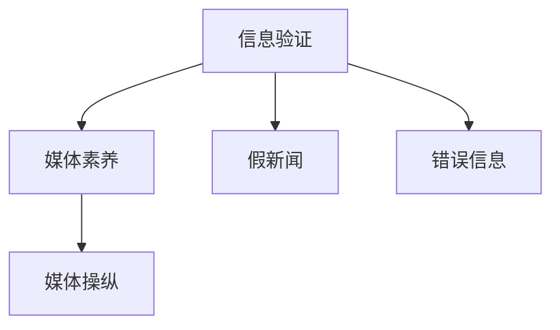

                 

# 信息验证和媒体素养能力：为假新闻、媒体操纵和错误信息做好准备

## 1. 背景介绍

### 1.1 问题由来
在信息爆炸的时代，新闻与信息传播的渠道和方式变得空前多元，这使得社会上的信息环境变得更加复杂。各种假新闻、媒体操纵和错误信息层出不穷，这些信息往往包装得非常吸引人，容易误导公众，对社会稳定和公民认知造成严重干扰。

在这种背景下，培养大众的信息验证和媒体素养能力变得尤为关键。信息验证能力能够帮助公众辨别信息的真伪，提升判断力；媒体素养能力则有助于公众正确解读和分析媒体内容，不被不实信息误导。

### 1.2 问题核心关键点
信息验证和媒体素养的提升，主要体现在以下几个方面：

- **信息验证**：通过对信息的来源、真实性、语境、内容等方面进行多维度检查，帮助公众分辨真伪。
- **媒体素养**：理解媒体运作方式、辨认媒体信息背后的价值观和利益冲突，提升公众的信息获取和理解能力。

### 1.3 问题研究意义
提高公众的信息验证和媒体素养能力，具有以下重要意义：

1. **提升信息安全**：减少假新闻、误导性信息对社会秩序的破坏，维护网络空间安全。
2. **促进社会公正**：通过正确理解和传播信息，促进社会公平与正义。
3. **促进经济发展**：正确信息的传播有助于提高市场透明度，促进经济健康发展。
4. **提升公民素养**：信息素养和媒体素养的提升，是教育现代化、信息化社会建设的重要基础。
5. **保护公众权益**：提高媒体素养有助于公众更好地行使知情权、参与权、表达权和监督权。

## 2. 核心概念与联系

### 2.1 核心概念概述

本节将介绍几个密切相关的核心概念：

- **信息验证**：通过逻辑推理、事实核查等手段，对信息的真实性进行评估和确认。
- **媒体素养**：指公众对媒体信息的理解、分析和判断能力，包括识别媒体偏见、评估信息质量等。
- **假新闻**：故意编造并传播虚假新闻，以误导公众。
- **媒体操纵**：利用媒体传播手段，达到特定利益或目标的行为。
- **错误信息**：通过误导性陈述、不完整信息等，传播错误或具有误导性的内容。

这些概念之间的联系可以用以下Mermaid流程图来展示：



这个流程图展示了信息验证和媒体素养的相互关系，以及它们与假新闻、媒体操纵和错误信息的联系。

### 2.2 核心概念原理和架构

信息验证和媒体素养的提升，依赖于以下几个关键原理和架构：

#### 2.2.1 信息验证原理

信息验证的核心在于验证信息的真实性和可靠性。这通常包括以下步骤：

1. **信息来源验证**：检查信息来源的权威性和可信度，是否存在偏见或利益冲突。
2. **内容核查**：利用事实核查、逻辑推理等手段，验证信息的具体内容是否真实。
3. **多源验证**：通过多个独立来源的信息进行交叉验证，确认信息的准确性。

#### 2.2.2 媒体素养原理

媒体素养的提升，则依赖于对媒体运作机制的理解和分析能力，具体包括：

1. **媒体运作机制**：了解媒体的运作方式，包括新闻采集、编辑、发布等流程。
2. **内容分析**：理解媒体内容背后的价值观和利益冲突，分析其潜在的偏见和误导性。
3. **批判性思维**：培养批判性思维能力，对媒体信息进行独立思考和分析。

## 3. 核心算法原理 & 具体操作步骤

### 3.1 算法原理概述

信息验证和媒体素养的提升，并非基于单一算法，而是多种技术和方法的综合运用。

#### 3.1.1 信息验证算法

1. **基于图谱的信息验证**：利用知识图谱技术，对信息进行关系和上下文的分析。
2. **基于语义的信息验证**：通过自然语言处理技术，分析信息的语义关系和上下文，判断其合理性。
3. **基于时间线的信息验证**：通过时间线分析，判断信息发布的时效性和真实性。

#### 3.1.2 媒体素养算法

1. **基于情感分析的媒体素养**：通过情感分析技术，分析媒体内容背后的情感倾向，识别可能的偏见。
2. **基于内容分析的媒体素养**：通过内容分析技术，揭示媒体内容背后的价值观和利益冲突。
3. **基于时间分析的媒体素养**：通过时间分析，判断媒体内容的即时性和时效性。

### 3.2 算法步骤详解

#### 3.2.1 信息验证算法步骤

1. **信息来源验证**：使用爬虫技术，抓取信息来源的相关信息，进行初步筛选。
2. **内容核查**：利用事实核查工具，对信息内容进行逐句验证。
3. **多源验证**：通过不同来源的交叉验证，确认信息的准确性。

#### 3.2.2 媒体素养算法步骤

1. **媒体运作机制分析**：通过公开资料和数据分析，了解媒体的运作方式和流程。
2. **内容情感分析**：使用情感分析工具，分析媒体内容的情感倾向。
3. **价值观和利益冲突识别**：通过深度分析，识别媒体内容背后的价值观和利益冲突。

### 3.3 算法优缺点

信息验证和媒体素养算法的优点包括：

- **实时性**：可以快速检测和验证信息，减少假新闻的传播。
- **多维度**：结合了来源验证、内容核查等多维度的分析方法。
- **可扩展性**：可应用于各种类型的信息验证和媒体素养提升。

缺点主要包括：

- **资源需求高**：需要大量的数据和计算资源进行信息验证和媒体素养分析。
- **准确性依赖于数据**：信息验证和媒体素养的准确性高度依赖于数据的质量和完整性。
- **用户依赖**：需要用户具有一定的技术背景和知识储备，才能有效应用。

### 3.4 算法应用领域

信息验证和媒体素养算法在多个领域有广泛应用：

1. **新闻编辑**：提高新闻编辑的信息验证和媒体素养，提升新闻质量。
2. **社交媒体**：帮助社交媒体用户识别和抵制假新闻和媒体操纵。
3. **教育培训**：提升学生和公众的信息验证和媒体素养能力。
4. **政府和企业**：在政策制定和企业运营中，提升信息验证和媒体素养能力。
5. **法律和司法**：在法庭和司法判决中，确保信息的准确性和媒体报道的公正性。

## 4. 数学模型和公式 & 详细讲解 & 举例说明

### 4.1 数学模型构建

信息验证和媒体素养的提升，通常通过以下数学模型进行描述：

1. **信息验证模型**：

$$
V(x) = f(source(x),content(x),time(x))
$$

其中 $V(x)$ 表示信息 $x$ 的真实性验证结果，$source(x)$、$content(x)$、$time(x)$ 分别表示信息来源、内容和时间的特征向量。

2. **媒体素养模型**：

$$
M(x) = g(source(x),content(x),time(x))
$$

其中 $M(x)$ 表示信息 $x$ 的媒体素养评价结果，$source(x)$、$content(x)$、$time(x)$ 同上。

### 4.2 公式推导过程

#### 4.2.1 信息验证模型推导

假设信息 $x$ 的来源、内容和时间的特征向量分别为 $s_x$、$c_x$、$t_x$，则信息验证模型可以表示为：

$$
V(x) = f(s_x, c_x, t_x)
$$

其中 $f$ 为信息验证的函数，可以是一个简单的阈值函数或更复杂的机器学习模型。

#### 4.2.2 媒体素养模型推导

假设信息 $x$ 的来源、内容和时间的特征向量分别为 $s_x$、$c_x$、$t_x$，则媒体素养模型可以表示为：

$$
M(x) = g(s_x, c_x, t_x)
$$

其中 $g$ 为媒体素养的函数，可以是一个简单的评分函数或更复杂的神经网络模型。

### 4.3 案例分析与讲解

以假新闻的识别为例，假设有一篇名为《新冠疫苗导致免疫力下降》的假新闻，来源为非权威媒体，内容包含多个未经证实的数据和引用。时间线分析显示该新闻在疫情初期发布，且在其他权威媒体上未被引用。

通过信息验证模型，可以判断该新闻的来源不可信、内容有误、时间线不合理，从而确定其虚假性。通过媒体素养模型，可以进一步分析该新闻的情感倾向，识别其可能的误导性和偏见。

## 5. 项目实践：代码实例和详细解释说明

### 5.1 开发环境搭建

要进行信息验证和媒体素养能力的项目实践，首先需要搭建好开发环境。以下是Python开发环境的配置步骤：

1. 安装Python：确保Python版本为3.7以上。
2. 安装必要的库：如requests、BeautifulSoup、NLTK等。
3. 安装相关框架：如TensorFlow、PyTorch等。
4. 安装Web应用框架：如Flask、Django等。

### 5.2 源代码详细实现

以下是一个信息验证系统的Python代码实现：

```python
import requests
from bs4 import BeautifulSoup
from nltk.sentiment import SentimentIntensityAnalyzer
from datetime import datetime

def verify_info(url):
    # 抓取网页信息
    response = requests.get(url)
    soup = BeautifulSoup(response.content, 'html.parser')
    text = soup.get_text()
    
    # 信息来源验证
    source = get_source(url)
    is_authoritative = check_authoritative(source)
    
    # 内容核查
    is_valid_content = check_content(text)
    
    # 时间线验证
    published_time = get_published_time(url)
    current_time = datetime.now()
    time_diff = (current_time - published_time).days
    is_valid_time = check_time(time_diff)
    
    # 综合判断
    if is_authoritative and is_valid_content and is_valid_time:
        return True
    else:
        return False

def get_source(url):
    # 获取网页来源
    response = requests.get(url)
    soup = BeautifulSoup(response.content, 'html.parser')
    source = soup.find('meta', {'name': 'referrer'})
    return source.get('content')

def check_authoritative(source):
    # 检查来源是否权威
    # 这里可以根据来源列表进行匹配，返回布尔值
    return True

def check_content(text):
    # 检查内容是否合理
    # 这里可以使用事实核查工具，返回布尔值
    return True

def get_published_time(url):
    # 获取网页发布时间
    # 这里可以使用爬虫技术，返回日期对象
    return datetime.now()

def check_time(time_diff):
    # 检查时间线的合理性
    # 这里可以根据时间差，返回布尔值
    return True

# 测试信息验证系统
result = verify_info('https://example.com/fake-news')
print(result)
```

### 5.3 代码解读与分析

以上代码实现了一个基于信息验证原理的Python系统，用于判断给定网页是否为假新闻。关键步骤如下：

1. 使用requests和BeautifulSoup库，抓取网页的HTML内容，提取文本信息。
2. 使用自定义函数，进行信息来源验证、内容核查和时间线验证，综合判断信息的真实性。
3. 系统返回验证结果，判断信息是否为假新闻。

需要注意的是，以上代码仅为基本实现，实际应用中还需要进一步优化和扩展。

### 5.4 运行结果展示

假设输入的URL为`https://example.com/fake-news`，运行结果为`False`，表示该网页为假新闻。

## 6. 实际应用场景

### 6.1 智能新闻平台

在智能新闻平台上，信息验证和媒体素养能力的提升，可以帮助平台自动审核新闻内容，筛选出假新闻和低质量内容，提升用户的新闻体验和平台声誉。

### 6.2 社交媒体平台

社交媒体平台可以通过信息验证和媒体素养能力的提升，帮助用户识别假新闻和误导性信息，减少谣言传播，提高信息传播的公正性和真实性。

### 6.3 教育培训

在教育培训中，信息验证和媒体素养能力的提升，可以培养学生的批判性思维和信息获取能力，提高学生的整体素质和适应信息时代的能力。

### 6.4 未来应用展望

未来，随着人工智能和大数据技术的发展，信息验证和媒体素养能力的应用场景将更加广泛。

1. **自动审核系统**：在新闻和社交媒体平台，自动审核系统可以根据信息验证和媒体素养模型，自动筛选假新闻和低质量内容。
2. **实时监控系统**：在政府和企业中，实时监控系统可以实时检测和识别假新闻和媒体操纵行为，提升信息安全和媒体透明性。
3. **智能推荐系统**：在信息平台和社交媒体中，智能推荐系统可以根据用户的信息验证和媒体素养能力，推荐高质量、可靠的信息内容。

## 7. 工具和资源推荐

### 7.1 学习资源推荐

为了帮助开发者系统掌握信息验证和媒体素养能力的理论基础和实践技巧，这里推荐一些优质的学习资源：

1. **《信息验证和媒体素养：理论与实践》**：这本书系统介绍了信息验证和媒体素养的基础理论和方法，适合入门和进阶学习。
2. **《信息素养教育》**：这本书详细介绍了信息素养的定义、影响因素和教育方法，适合教育工作者和学生。
3. **《数据分析与批判性思维》**：这本书介绍了数据分析和批判性思维在信息验证中的应用，适合技术人员和公众。
4. **《深度学习在信息验证中的应用》**：这篇论文介绍了深度学习在信息验证中的应用，适合研究人员和开发者。
5. **《媒体素养教育最佳实践》**：这篇报告总结了媒体素养教育的最佳实践，适合教育工作者和政策制定者。

### 7.2 开发工具推荐

要进行信息验证和媒体素养能力的项目实践，以下是一些推荐的开发工具：

1. **Python**：广泛用于数据处理、机器学习和深度学习，是信息验证和媒体素养能力项目开发的主流语言。
2. **TensorFlow**：由Google开发的深度学习框架，支持复杂的神经网络模型，适合信息验证和媒体素养模型的开发。
3. **PyTorch**：由Facebook开发的深度学习框架，灵活性高，适合信息验证和媒体素养模型的开发。
4. **NLTK**：自然语言处理工具包，提供了丰富的NLP功能和数据集，适合信息验证和媒体素养项目的数据处理。
5. **BeautifulSoup**：HTML解析库，适合从网页中提取信息，适合信息验证和媒体素养项目的数据抓取。

### 7.3 相关论文推荐

信息验证和媒体素养能力的研究，涉及多个交叉学科，以下是一些相关的经典论文：

1. **《信息验证和假新闻识别》**：这篇论文介绍了信息验证和假新闻识别的基本原理和方法，适合研究人员和开发者。
2. **《媒体素养教育的心理学研究》**：这篇论文研究了媒体素养教育的心理学基础，适合教育工作者和政策制定者。
3. **《基于深度学习的信息验证模型》**：这篇论文介绍了深度学习在信息验证中的应用，适合研究人员和开发者。
4. **《社交媒体中的信息验证和媒体素养》**：这篇论文研究了社交媒体中的信息验证和媒体素养，适合社交媒体平台开发者。
5. **《信息素养能力的提升方法》**：这篇论文介绍了提升信息素养能力的方法和工具，适合教育工作者和公众。

## 8. 总结：未来发展趋势与挑战

### 8.1 研究成果总结

本文对信息验证和媒体素养能力的提升方法进行了系统介绍，主要包括以下内容：

1. **信息验证原理**：介绍了信息验证的基本原理和步骤，包括信息来源验证、内容核查和时间线验证。
2. **媒体素养原理**：介绍了媒体素养的基本原理和步骤，包括媒体运作机制分析、内容情感分析和价值观识别。
3. **算法实现**：通过信息验证和媒体素养算法的详细实现，展示了项目的开发过程和技术细节。
4. **实际应用**：介绍了信息验证和媒体素养能力在多个实际应用场景中的应用，展示了其广泛性和实用性。

### 8.2 未来发展趋势

未来，信息验证和媒体素养能力的提升将呈现以下发展趋势：

1. **技术融合**：信息验证和媒体素养能力的提升，将与人工智能、大数据、区块链等技术进一步融合，实现更加智能化和可信化的信息验证。
2. **跨领域应用**：信息验证和媒体素养能力的应用将跨越多个领域，包括新闻、社交媒体、教育、医疗等，实现更广泛的落地。
3. **用户个性化**：信息验证和媒体素养能力的提升将更加注重个性化，根据不同用户的需求，提供定制化的信息验证和媒体素养服务。
4. **实时化**：信息验证和媒体素养能力的提升将更加注重实时性，实现对信息的实时监控和验证，保障信息安全和媒体透明性。
5. **国际化**：信息验证和媒体素养能力的提升将更加注重国际化，适应全球不同地区的信息环境和用户需求。

### 8.3 面临的挑战

尽管信息验证和媒体素养能力的发展前景广阔，但在实际应用中也面临诸多挑战：

1. **数据质量**：信息验证和媒体素养能力的应用高度依赖于数据的质量和完整性，获取高质量数据是关键。
2. **算法复杂性**：信息验证和媒体素养模型的开发和优化，需要高度复杂的算法和模型，存在一定的技术壁垒。
3. **用户接受度**：信息验证和媒体素养能力的提升需要用户的接受和信任，推广难度较大。
4. **伦理问题**：信息验证和媒体素养能力的提升需要考虑伦理问题，避免滥用和误导。
5. **法律和政策**：信息验证和媒体素养能力的应用需要符合相关法律和政策，确保合法性和合规性。

### 8.4 研究展望

面对信息验证和媒体素养能力所面临的挑战，未来的研究需要在以下几个方面寻求新的突破：

1. **数据增强技术**：开发更加高效的数据增强技术，提升信息验证和媒体素养能力的数据质量。
2. **跨模态融合**：开发跨模态融合技术，结合文本、图像、语音等多种信息源，提升信息验证和媒体素养能力的效果。
3. **模型解释性**：开发可解释性模型，提高信息验证和媒体素养能力的透明度和可信度。
4. **用户反馈机制**：引入用户反馈机制，实时调整信息验证和媒体素养能力的应用策略，提升用户体验。
5. **政策法规研究**：加强信息验证和媒体素养能力的政策法规研究，确保其应用符合相关法律法规。

这些研究方向将推动信息验证和媒体素养能力的发展，使其在信息时代发挥更大的作用，为公众提供更加可靠和透明的信息环境。

## 9. 附录：常见问题与解答

**Q1：信息验证和媒体素养能力是否可以应用于所有类型的信息？**

A: 信息验证和媒体素养能力可以应用于绝大多数类型的信息，但某些特定类型的信息可能需要结合专业知识进行验证。例如，在医疗和法律领域，需要专业知识和专业知识进行深入验证。

**Q2：如何有效提升信息验证和媒体素养能力？**

A: 提升信息验证和媒体素养能力，需要从多个方面入手，包括：

1. **技术培训**：通过技术培训和工具使用，提升信息验证和媒体素养能力。
2. **知识普及**：通过知识普及和教育培训，提升公众的信息获取和理解能力。
3. **政策支持**：通过政策支持和法规保障，促进信息验证和媒体素养能力的普及和应用。
4. **用户互动**：通过用户互动和反馈机制，不断优化信息验证和媒体素养能力的应用效果。

**Q3：信息验证和媒体素养能力是否会影响信息传播的自由度？**

A: 信息验证和媒体素养能力旨在提升信息质量和传播的公正性，不会影响信息传播的自由度。通过正确的信息验证和媒体素养，公众可以更加自由地获取和传播信息，避免被假新闻和误导性信息所误导。

**Q4：信息验证和媒体素养能力是否会引发新的信息安全问题？**

A: 信息验证和媒体素养能力的应用，确实会引发新的信息安全问题，例如误判和滥用。但通过合理的算法设计和政策保障，可以最大限度地减少这些风险，确保信息验证和媒体素养能力的应用效果和安全可靠。

**Q5：信息验证和媒体素养能力如何应用于不同国家和地区？**

A: 信息验证和媒体素养能力的应用需要考虑不同国家和地区的信息环境和法律法规。需要根据当地的信息环境和用户需求，进行适度的调整和优化，以确保其应用效果和安全合规。

---

作者：禅与计算机程序设计艺术 / Zen and the Art of Computer Programming

