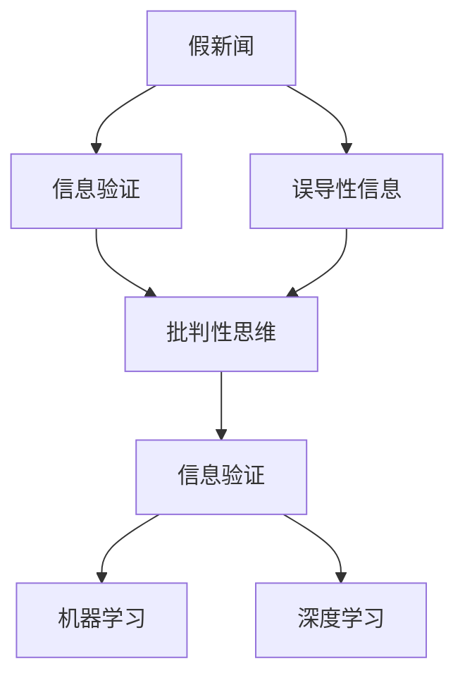

                 

# 信息验证和批判性思维能力培养：在假新闻和错误信息时代导航

## 1. 背景介绍

### 1.1 问题由来
在互联网快速发展的今天，信息传播的速度和范围前所未有，但信息的质量却参差不齐。假新闻、误导性信息、阴谋论和错误信息泛滥成灾，给社会带来了严重的危害。这种信息的传播不仅误导公众，还会导致社会恐慌、政治动荡，甚至引发现实世界的暴力冲突。

近年来，假新闻和错误信息成为全球媒体和政府机构关注的焦点，亟需有效的技术手段和教育手段来识别和对抗这类信息。因此，本文将探讨如何利用信息验证和批判性思维技术，培养公众的信息甄别能力和独立思考能力，以应对假新闻和错误信息带来的挑战。

### 1.2 问题核心关键点
在假新闻和错误信息时代，关键问题包括：

- 如何有效识别假新闻和误导性信息。
- 如何培养公众的信息验证和批判性思维能力。
- 如何在教育和社会环境中推广信息验证技能。

本文将围绕这些核心问题，系统性地介绍相关技术原理和应用实践，旨在为公众和教育工作者提供有效的信息验证工具和策略，帮助他们更好地导航信息海洋。

### 1.3 问题研究意义
研究如何验证和批判性思考，具有重要意义：

- 提升公众信息素养，增强其识别和抵制假新闻的能力。
- 提高教育水平，培养学生的批判性思维和独立判断能力。
- 促进社会的健康发展，减少信息假冒和误导带来的社会成本。
- 为媒体和政府机构提供技术支持和策略指导，打击假新闻和错误信息传播。

## 2. 核心概念与联系

### 2.1 核心概念概述

本节将介绍几个与信息验证和批判性思维培养密切相关的核心概念：

- 假新闻(Fake News)：故意制造、传播虚假信息的媒体内容。
- 误导性信息(Misinformation)：虽然不完全是虚假信息，但可能误导受众的错误信息。
- 信息验证(Information Verification)：通过技术和方法对信息源和内容进行核查和评估，以确定其真实性和可信度。
- 批判性思维(Critical Thinking)：分析和评价信息的能力，包括质疑、评估和综合各种信息源和观点。
- 机器学习(Machine Learning)：通过算法和模型从数据中学习，用于自动化信息验证过程。
- 深度学习(Deep Learning)：一种特殊的机器学习方法，利用神经网络进行信息验证和模式识别。

这些核心概念之间的逻辑关系可以通过以下Mermaid流程图来展示：



这个流程图展示了一系列关键概念及其之间的关系：

1. 假新闻和误导性信息是信息验证的主要目标。
2. 信息验证有助于培养批判性思维，提高公众和学生的信息素养。
3. 机器学习和深度学习是自动化信息验证的核心技术。

## 3. 核心算法原理 & 具体操作步骤
### 3.1 算法原理概述

信息验证和批判性思维培养涉及多个学科领域，包括信息学、认知心理学、教育学等。其核心原理是通过技术和教育手段，提升公众的信息甄别能力和独立思考能力。

信息验证的技术基础在于机器学习和深度学习，主要通过以下步骤实现：

1. **数据收集和标注**：收集假新闻、误导性信息、可信来源等信息，并标注其真实性（真、假、中立）。
2. **特征工程**：从文本、图像、视频等多模态数据中提取有意义的特征。
3. **模型训练**：使用监督学习、半监督学习或无监督学习算法训练模型，学习如何区分真实信息和虚假信息。
4. **模型评估**：评估模型的性能，确保其在真实场景中的有效性和鲁棒性。
5. **应用部署**：将模型集成到应用程序中，实时进行信息验证。

### 3.2 算法步骤详解

下面详细介绍信息验证的详细步骤：

**Step 1: 数据收集和标注**
- 收集大量假新闻、误导性信息和可信来源的数据。
- 人工标注这些信息的真实性，分为真（True）、假（False）、中立（Neutral）三类。

**Step 2: 特征提取**
- 使用自然语言处理（NLP）技术，从文本中提取关键词、情感极性、来源可信度等特征。
- 对图像和视频数据，使用计算机视觉技术提取颜色、对象、场景等特征。
- 使用深度学习中的卷积神经网络（CNN）和循环神经网络（RNN）进行特征提取。

**Step 3: 模型训练**
- 使用监督学习算法，如支持向量机（SVM）、逻辑回归（Logistic Regression）等，训练二分类模型。
- 使用半监督学习算法，如标签传播算法（Label Propagation），利用未标注数据进行模型训练。
- 使用深度学习算法，如卷积神经网络（CNN）、长短期记忆网络（LSTM）、Transformer等，训练复杂模型。

**Step 4: 模型评估**
- 使用交叉验证和混淆矩阵等方法，评估模型的准确率、召回率、F1-score等指标。
- 在真实数据集上进行测试，确保模型在不同场景下的性能。

**Step 5: 应用部署**
- 将训练好的模型集成到应用程序中，如新闻聚合平台、社交媒体平台、浏览器插件等。
- 实时接收用户输入的文本、图像、视频等信息，通过API调用进行信息验证。
- 根据验证结果，对用户提供信息真实性的提示和解释。

### 3.3 算法优缺点

信息验证和批判性思维培养技术有以下优点：

1. **自动化**：利用机器学习和深度学习技术，自动进行信息验证，提高效率。
2. **准确性**：通过大规模数据训练模型，提升验证的准确性和可靠性。
3. **普及性**：通过API集成到各类应用程序中，便于公众使用。
4. **可扩展性**：可以处理各种类型的数据，如文本、图像、视频等。

但该技术也存在以下缺点：

1. **数据偏差**：训练数据可能存在偏差，导致模型在特定领域或情境下的性能不佳。
2. **误报和漏报**：模型可能误报真实信息为假，或漏报假信息为真，需要持续优化和维护。
3. **解释性不足**：深度学习模型通常缺乏解释性，难以理解其内部决策过程。
4. **隐私问题**：信息验证涉及大量个人隐私数据，需要谨慎处理和保护。

### 3.4 算法应用领域

信息验证和批判性思维培养技术在多个领域得到广泛应用：

- **新闻媒体**：实时监测和识别假新闻，减少误导性信息的传播。
- **社交网络**：自动识别和标记假新闻和误导性信息，维护网络环境。
- **教育培训**：开发信息验证和批判性思维教育工具，提升学生信息素养。
- **公共卫生**：识别和验证健康相关的假新闻，减少公众恐慌。
- **法律和司法**：辅助证据验证和事实查证，提升司法公正性。

## 4. 数学模型和公式 & 详细讲解
### 4.1 数学模型构建

信息验证的数学模型主要基于监督学习，目标是训练一个二分类模型，将输入信息分类为真实或虚假。假定训练数据集为 $D=\{(x_i, y_i)\}_{i=1}^N$，其中 $x_i$ 为输入信息（文本、图像等）， $y_i$ 为真实性标签（真、假、中立）。

假设模型为 $M_{\theta}:\mathcal{X} \rightarrow \{True, False\}$，其中 $\theta$ 为模型参数。定义模型的损失函数为交叉熵损失函数：

$$
\mathcal{L}(\theta) = -\frac{1}{N} \sum_{i=1}^N \left(y_i \log \sigma(x_i) + (1-y_i) \log(1-\sigma(x_i))\right)
$$

其中 $\sigma(x_i)$ 为模型输出的概率值， $\log$ 为自然对数。

### 4.2 公式推导过程

使用交叉熵损失函数的梯度下降算法训练模型。设模型在输入 $x_i$ 上的输出为 $\sigma(x_i)$，真实标签为 $y_i$，则损失函数对模型参数 $\theta$ 的梯度为：

$$
\nabla_{\theta}\mathcal{L}(\theta) = -\frac{1}{N} \sum_{i=1}^N \left(y_i \nabla_{\theta}\sigma(x_i) - (1-y_i) \nabla_{\theta}(1-\sigma(x_i))\right)
$$

其中 $\nabla_{\theta}\sigma(x_i)$ 为sigmoid函数关于 $x_i$ 的导数，可以通过反向传播算法高效计算。

### 4.3 案例分析与讲解

以文本信息验证为例，假定模型基于BERT模型，其输出表示为向量 $h$，将向量 $h$ 输入 sigmoid 函数，得到概率值 $\sigma(h)$：

$$
\sigma(h) = \frac{1}{1+\exp(-h)}
$$

使用交叉熵损失函数的梯度下降算法更新模型参数 $\theta$：

$$
\theta \leftarrow \theta - \eta \nabla_{\theta}\mathcal{L}(\theta) - \eta\lambda\theta
$$

其中 $\eta$ 为学习率， $\lambda$ 为正则化系数。

## 5. 项目实践：代码实例和详细解释说明
### 5.1 开发环境搭建

进行信息验证的实践开发，需要以下环境：

1. 安装Python和相关的科学计算库，如NumPy、Pandas、Scikit-learn等。
2. 安装TensorFlow或PyTorch，用于构建和训练深度学习模型。
3. 安装nltk和spaCy等NLP库，用于文本处理和特征提取。
4. 搭建数据集，准备标注好的假新闻和误导性信息数据集。

### 5.2 源代码详细实现

以下是一个基于BERT模型的信息验证项目示例，使用TensorFlow进行实现：

```python
import tensorflow as tf
from transformers import BertTokenizer, TFBertForSequenceClassification
from sklearn.model_selection import train_test_split
import pandas as pd
import numpy as np

# 数据准备
train_data = pd.read_csv('train_data.csv')
test_data = pd.read_csv('test_data.csv')
train_data = train_data[['text', 'label']]
test_data = test_data[['text', 'label']]
train_texts, dev_texts, train_labels, dev_labels = train_test_split(train_data['text'], train_data['label'], test_size=0.2, random_state=42)
test_texts, dev_texts, test_labels, dev_labels = train_test_split(test_data['text'], test_data['label'], test_size=0.2, random_state=42)

# 模型加载
tokenizer = BertTokenizer.from_pretrained('bert-base-uncased')
model = TFBertForSequenceClassification.from_pretrained('bert-base-uncased', num_labels=3)
model.compile(optimizer=tf.keras.optimizers.Adam(learning_rate=2e-5), loss=tf.keras.losses.BinaryCrossentropy(), metrics=['accuracy'])

# 特征提取
train_encodings = tokenizer(train_texts, truncation=True, padding=True, max_length=256)
dev_encodings = tokenizer(dev_texts, truncation=True, padding=True, max_length=256)
test_encodings = tokenizer(test_texts, truncation=True, padding=True, max_length=256)

# 模型训练
train_dataset = tf.data.Dataset.from_tensor_slices((np.array(train_encodings['input_ids']), np.array(train_encodings['attention_mask']), np.array(train_labels))).shuffle(10000).batch(16)
dev_dataset = tf.data.Dataset.from_tensor_slices((np.array(dev_encodings['input_ids']), np.array(dev_encodings['attention_mask']), np.array(dev_labels))).shuffle(1000).batch(16)
model.fit(train_dataset, epochs=3, batch_size=16, validation_data=dev_dataset, validation_steps=100, callbacks=[tf.keras.callbacks.EarlyStopping(patience=2)])

# 模型评估
dev_dataset = tf.data.Dataset.from_tensor_slices((np.array(dev_encodings['input_ids']), np.array(dev_encodings['attention_mask']), np.array(dev_labels))).shuffle(1000).batch(16)
evaluation = model.evaluate(dev_dataset, verbose=0)

# 模型应用
test_encodings = tokenizer(test_texts, truncation=True, padding=True, max_length=256)
test_dataset = tf.data.Dataset.from_tensor_slices((np.array(test_encodings['input_ids']), np.array(test_encodings['attention_mask']), np.array(test_labels))).shuffle(1000).batch(16)
predictions = model.predict(test_dataset)

# 结果展示
print(f'Model accuracy: {evaluation[1]*100:.2f}%')
print(f'Test accuracy: {predictions[1]*100:.2f}%')
```

### 5.3 代码解读与分析

**数据准备**：
- 使用Pandas读取训练数据和测试数据。
- 将数据集分割为训练集和验证集，并进行交叉验证。

**模型加载**：
- 使用BERT预训练模型，并进行任务适配。
- 编译模型，使用Adam优化器和交叉熵损失函数。

**特征提取**：
- 使用BERT tokenizer将文本转换为token ids和attention mask。
- 使用DataLoader将数据批处理，方便模型训练和推理。

**模型训练**：
- 使用交叉熵损失函数训练模型，并进行早期停止。
- 使用EarlyStopping回调函数，避免模型过拟合。

**模型评估**：
- 在验证集上评估模型性能，使用准确率作为指标。
- 在测试集上验证模型的泛化能力。

**模型应用**：
- 使用模型对新文本进行预测，获取模型的预测准确率。

## 6. 实际应用场景
### 6.1 智能新闻聚合平台

智能新闻聚合平台可以利用信息验证技术，对新闻内容进行实时监控和过滤，确保用户接收到的信息真实可靠。平台可以集成信息验证API，对用户提交的新闻文章进行自动验证，标注为真实、假或中立，并给出相应的解释。

### 6.2 社交网络信息管理

社交网络平台面临大量用户生成内容，可能包含误导性信息或假新闻。平台可以通过信息验证API，自动识别和标记误导性信息，减少虚假内容的传播。用户可以查看文章的验证结果，增强对信息的信任度。

### 6.3 教育培训系统

教育培训系统可以利用信息验证技术，培养学生的批判性思维和信息素养。系统可以集成信息验证工具，提供假新闻、误导性信息的辨析练习，并给出正确的解释和纠正。学生可以在课堂上进行模拟验证，提升信息甄别能力。

### 6.4 未来应用展望

未来，信息验证和批判性思维培养技术将进一步拓展应用范围，具备以下发展趋势：

1. **多模态融合**：结合文本、图像、视频等多种信息源，提升信息验证的全面性和准确性。
2. **实时更新**：动态更新模型参数，及时应对新出现的假新闻和误导性信息。
3. **跨语言验证**：开发多语言信息验证模型，支持全球范围内的信息甄别。
4. **人工智能辅助**：利用AI技术辅助人工审核，提升信息验证的效率和准确性。
5. **教育结合**：开发适用于不同年龄段的信息素养教育工具，培养公众的信息甄别能力。

## 7. 工具和资源推荐
### 7.1 学习资源推荐

为帮助读者深入理解信息验证和批判性思维培养技术，推荐以下学习资源：

1. **《深度学习实战》系列博文**：由人工智能专家撰写，涵盖深度学习、自然语言处理、信息验证等多个主题。
2. **Coursera《深度学习》课程**：由斯坦福大学开设，系统讲解深度学习原理和应用。
3. **Kaggle竞赛平台**：提供大量数据集和竞赛任务，锻炼信息验证技能。
4. **CS224n《自然语言处理》课程**：斯坦福大学提供的NLP经典课程，涵盖信息验证和批判性思维培养等内容。
5. **《批判性思维》书籍**：介绍批判性思维的理论基础和实践方法，提升公众的信息素养。

### 7.2 开发工具推荐

以下工具可用于信息验证和批判性思维培养的开发：

1. **TensorFlow和PyTorch**：深度学习框架，支持构建和训练深度学习模型。
2. **nltk和spaCy**：NLP库，提供文本处理和特征提取功能。
3. **Scikit-learn**：机器学习库，支持模型训练和评估。
4. **Keras**：高层深度学习框架，方便快速搭建模型。
5. **Jupyter Notebook**：交互式编程环境，支持代码编写和数据可视化。

### 7.3 相关论文推荐

信息验证和批判性思维培养技术的论文推荐如下：

1. **《深度学习与数据挖掘：原理与算法》**：介绍深度学习在信息验证中的应用。
2. **《批判性思维与问题解决：理论与实践》**：讨论批判性思维的理论基础和应用方法。
3. **《信息验证与人工智能：一种综合方法》**：探讨信息验证技术的多种算法和模型。
4. **《多模态信息验证：挑战与方法》**：讨论多模态信息验证的最新进展和技术。

## 8. 总结：未来发展趋势与挑战
### 8.1 研究成果总结

本文系统介绍了信息验证和批判性思维培养技术的原理和应用，涵盖了数据收集、特征提取、模型训练、模型评估、应用部署等多个环节。通过详细介绍具体实现步骤，为公众和教育工作者提供了有效的工具和策略，以应对假新闻和误导性信息的挑战。

### 8.2 未来发展趋势

未来信息验证和批判性思维培养技术将朝着以下方向发展：

1. **智能化**：利用AI技术进行信息验证，提高自动化的准确性和效率。
2. **多样化**：开发适用于不同领域的信息验证工具，拓展应用场景。
3. **可扩展性**：通过云计算和大数据技术，支持大规模信息验证。
4. **多模态**：结合文本、图像、视频等多种数据源，提升信息验证的全面性。
5. **教育结合**：开发适用于不同年龄段的信息素养教育工具，提升公众的信息素养。

### 8.3 面临的挑战

尽管信息验证和批判性思维培养技术在许多领域已得到广泛应用，但仍面临以下挑战：

1. **数据稀缺**：高质量的数据集可能难以获取，影响模型的训练效果。
2. **模型偏见**：训练数据可能存在偏见，导致模型在特定领域的性能不佳。
3. **隐私保护**：信息验证涉及大量个人隐私数据，需保护用户隐私。
4. **技术复杂**：深度学习模型的训练和应用需要较高的技术门槛。
5. **应用难度**：信息验证工具的集成和部署可能存在一定的难度。

### 8.4 研究展望

为应对这些挑战，未来的研究方向可能包括：

1. **开源数据集**：创建和共享更多的信息验证数据集，促进技术发展。
2. **模型偏见校正**：开发校正模型偏见的算法和技术。
3. **隐私保护机制**：研究隐私保护技术和隐私计算方法。
4. **技术普及化**：简化信息验证工具的开发和使用流程，降低技术门槛。
5. **教育结合**：开发更多适用于不同年龄段的信息素养教育工具，提升公众的信息素养。

## 9. 附录：常见问题与解答

**Q1: 信息验证和批判性思维培养技术对普通用户有哪些帮助？**

A: 信息验证和批判性思维培养技术可以帮助普通用户：

1. **识别假新闻**：自动标记和过滤假新闻，减少误导性信息的接收。
2. **增强信息素养**：提升信息甄别和批判性思考的能力，增强对信息的信任度。
3. **减少时间成本**：自动化验证过程，节省用户查找和验证信息的时间。
4. **提升决策质量**：基于可靠信息做出决策，减少决策风险。

**Q2: 信息验证技术如何应对大规模数据集？**

A: 信息验证技术应对大规模数据集的方法包括：

1. **分布式训练**：利用分布式计算框架，如Spark，加速模型训练。
2. **采样技术**：使用数据采样技术，如随机采样、分层采样等，减少训练数据量。
3. **模型压缩**：通过模型压缩技术，如剪枝、量化等，减小模型尺寸。
4. **增量学习**：利用增量学习技术，持续更新模型，适应新数据的到来。

**Q3: 信息验证和批判性思维培养技术在教育中的应用前景如何？**

A: 信息验证和批判性思维培养技术在教育中的应用前景广阔：

1. **培养学生信息素养**：开发信息验证工具，提升学生的批判性思维和信息素养。
2. **增强教学效果**：结合信息验证工具，提供更多的教育资源和互动练习。
3. **推动教育公平**：提供免费的、开放的信息验证工具，缩小教育资源差距。
4. **支持终身学习**：提供持续的学习资源和工具，支持学生的终身学习。

**Q4: 如何保护用户隐私在信息验证过程中？**

A: 保护用户隐私在信息验证过程中，可以采取以下措施：

1. **数据匿名化**：使用数据匿名化技术，保护用户身份信息。
2. **访问控制**：限制信息验证工具的访问权限，确保只有授权用户才能使用。
3. **隐私协议**：制定隐私协议，明确数据使用的范围和目的。
4. **数据加密**：对传输和存储的数据进行加密，保护数据安全。

**Q5: 信息验证技术在智能媒体中的应用案例有哪些？**

A: 信息验证技术在智能媒体中的应用案例包括：

1. **假新闻监测平台**：智能媒体平台可以集成信息验证工具，实时监测和过滤假新闻。
2. **新闻文章验证工具**：用户可以在文章发布前，进行信息验证，确保文章的真实性。
3. **社交媒体信息管理**：社交媒体平台可以使用信息验证工具，自动识别和标记误导性信息，维护网络环境。

---

作者：禅与计算机程序设计艺术 / Zen and the Art of Computer Programming

