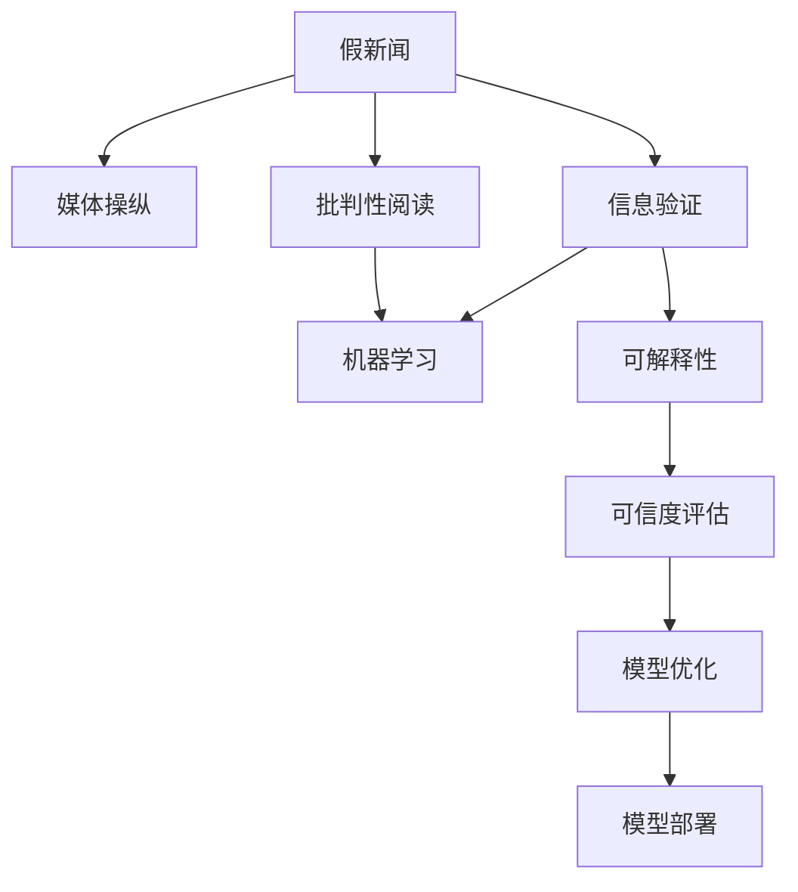

                 

# 信息验证和批判性阅读指南：在假新闻和媒体操纵时代导航

> 关键词：假新闻检测,媒体操纵,批判性阅读,信息验证,算法,数据,工具

## 1. 背景介绍

### 1.1 问题由来
在当今信息爆炸的时代，假新闻、媒体操纵和信息泡沫现象层出不穷，给社会和公众带来了严重的误导和认知偏差。假新闻常常以吸引眼球、制造恐慌为目的，通过歪曲事实、夸大效果等手段，达到影响公众舆论和决策的目的。而媒体操纵则更深入，通过精心策划、选择报道角度，以及对信息的选择性传播，达到操控公众情绪和行为的目标。

在这样的背景下，如何有效识别和应对假新闻和媒体操纵，提升公民的信息素养和批判性阅读能力，成为当务之急。信息验证和批判性阅读技术的发展，正是为了解决这个问题，帮助用户在海量信息中找到真相，捍卫信息自由和公民权利。

### 1.2 问题核心关键点
假新闻和媒体操纵的核心在于信息的伪造和误导，而信息验证和批判性阅读技术则侧重于通过技术手段识别和评估信息的真实性和可靠性。以下为核心问题：
- 如何准确识别假新闻？
- 如何验证信息的来源和内容？
- 如何培养用户批判性阅读能力？
- 如何构建一个公正、可靠的信息环境？

## 2. 核心概念与联系

### 2.1 核心概念概述

为了理解信息验证和批判性阅读技术的核心原理和架构，本节将介绍几个关键概念：

- 假新闻(Fake News)：指故意或过失制造的、旨在误导公众的虚假信息。其特征包括但不限于：虚假来源、夸大事实、捏造证据等。

- 媒体操纵(Media Manipulation)：指媒体通过选择性报道、夸大事实、操纵语境等方式，引导公众情绪和行为，达到某种政治、经济或社会目标。

- 信息验证(Information Verification)：通过技术手段，验证信息的来源、内容和背景，确保其真实性和可靠性。

- 批判性阅读(Critical Reading)：指培养用户识别和评估信息的真伪、来源、背景和语境的能力，提升用户的信息素养。

- 机器学习与自然语言处理(NLP)：通过训练模型，从文本中提取和分析信息特征，辅助信息验证和批判性阅读。

- 可解释性与可信度评估：保证模型的决策过程可解释，评估模型的可信度，确保其在信息验证和批判性阅读中的可靠性和有效性。

这些概念之间的逻辑关系可以通过以下Mermaid流程图来展示：



这个流程图展示了信息验证和批判性阅读技术中的核心概念及其之间的关系：

1. 假新闻和媒体操纵是信息验证和批判性阅读的对手。
2. 信息验证利用机器学习和自然语言处理技术，提取和分析信息特征，辅助用户识别假新闻。
3. 批判性阅读提升用户的信息素养，使他们在接触到信息时能够进行自我判断和反思。
4. 机器学习和自然语言处理技术的发展，提高了信息验证的效率和准确性。
5. 可解释性和可信度评估确保模型的决策过程透明可靠，提升模型的应用效果。
6. 模型优化和部署，使信息验证技术能够被广泛应用于实际场景，提升信息环境的质量。

## 3. 核心算法原理 & 具体操作步骤
### 3.1 算法原理概述

信息验证和批判性阅读技术的核心在于通过机器学习和自然语言处理技术，从文本中提取和分析信息特征，辅助用户识别和验证信息的真伪。其基本流程如下：

1. 数据收集：收集包含假新闻、真实新闻和媒体操纵样本的数据集。
2. 特征提取：利用NLP技术，从文本中提取关键词、语义、情感、来源等特征。
3. 模型训练：通过机器学习算法，训练分类模型，用于判断新闻的真实性。
4. 模型评估：通过交叉验证、AUC曲线等方法，评估模型的性能。
5. 模型优化：根据评估结果，调整模型参数，提升模型精度。
6. 实际应用：将训练好的模型应用于新闻验证平台，辅助用户进行信息筛选和验证。

### 3.2 算法步骤详解

以下是一个完整的信息验证和批判性阅读流程，包括算法步骤详解：

**Step 1: 数据收集**
收集包含假新闻、真实新闻和媒体操纵样本的数据集，可以使用现有的公开数据集，如PAN、Kaggle的假新闻数据集等，也可以自行采集数据进行标注。

**Step 2: 数据预处理**
对收集到的数据进行清洗和预处理，包括去除噪声、标准化文本、去除停用词等。

**Step 3: 特征提取**
利用NLP技术，从文本中提取关键词、语义、情感、来源等特征。具体方法包括：
- 分词：将文本分解为词语，使用NLTK、spaCy等工具进行分词。
- 词向量表示：使用Word2Vec、GloVe等词嵌入模型将词语转化为向量。
- 文本情感分析：使用情感词典或深度学习模型，判断文本的情感极性。
- 文本来源验证：使用爬虫技术获取新闻来源信息，验证其可靠性。

**Step 4: 模型训练**
使用机器学习算法训练分类模型，用于判断新闻的真实性。常用的算法包括逻辑回归、随机森林、支持向量机等。

**Step 5: 模型评估**
通过交叉验证、AUC曲线等方法，评估模型的性能。常用的评估指标包括准确率、召回率、F1分数等。

**Step 6: 模型优化**
根据评估结果，调整模型参数，提升模型精度。可以使用网格搜索、贝叶斯优化等方法进行参数调优。

**Step 7: 模型部署**
将训练好的模型应用于新闻验证平台，辅助用户进行信息筛选和验证。可以开发Web应用、API接口等形式，方便用户使用。

### 3.3 算法优缺点

信息验证和批判性阅读技术具有以下优点：
1. 自动化处理大规模数据：利用机器学习和NLP技术，可以快速处理大量文本数据，提高信息验证效率。
2. 实时性：模型可以实时分析用户输入的新闻，提供即时验证结果。
3. 可扩展性：模型可以随着数据集和算法的更新不断优化，保持较高的准确性。
4. 用户友好：通过Web应用和API接口，用户可以方便地进行信息验证和批判性阅读。

但该技术也存在一些局限性：
1. 数据依赖：模型效果高度依赖于训练数据的质量和数量，低质量的数据可能导致模型过拟合。
2. 多语言处理：中文等语言的数据稀缺，限制了模型的应用范围。
3. 模型可解释性：部分深度学习模型（如BERT）的决策过程复杂，难以解释。
4. 数据隐私：在数据收集和处理过程中，需要遵守数据隐私保护法规。

### 3.4 算法应用领域

信息验证和批判性阅读技术已经在多个领域得到应用，如新闻媒体、社交网络、在线教育等。以下是一些典型的应用场景：

- 新闻媒体：新闻平台利用信息验证技术，帮助用户筛选真实新闻，提升新闻质量。
- 社交网络：社交平台使用信息验证技术，防止假新闻传播，维护网络秩序。
- 在线教育：教育机构利用批判性阅读技术，培养学生的信息素养，提升学习效果。

此外，信息验证和批判性阅读技术还可以应用于政府信息公开、司法判决、科学研究等领域，提升信息可信度和透明度。

## 4. 数学模型和公式 & 详细讲解 & 举例说明

### 4.1 数学模型构建

信息验证和批判性阅读技术中，常用的数学模型包括逻辑回归、支持向量机、深度学习等。这里以逻辑回归模型为例，进行详细讲解。

假设收集到的数据集为 $D=\{(x_i,y_i)\}_{i=1}^N$，其中 $x_i$ 为文本向量， $y_i$ 为标签（真实或虚假）。逻辑回归模型的目标是最小化损失函数：

$$
\mathcal{L}(w,b) = -\frac{1}{N}\sum_{i=1}^N [y_i\log \sigma(w^Tx_i+b) + (1-y_i)\log(1-\sigma(w^Tx_i+b))]
$$

其中 $w$ 为权重向量， $b$ 为偏置， $\sigma$ 为sigmoid函数。

### 4.2 公式推导过程

推导逻辑回归模型的公式如下：

1. 首先，定义sigmoid函数：

$$
\sigma(z) = \frac{1}{1+e^{-z}}
$$

2. 然后，将sigmoid函数带入损失函数，得到：

$$
\mathcal{L}(w,b) = -\frac{1}{N}\sum_{i=1}^N [y_i\log \sigma(w^Tx_i+b) + (1-y_i)\log(1-\sigma(w^Tx_i+b))]
$$

3. 为了求导方便，定义 $z_i = w^Tx_i + b$，则 $\sigma(z_i) = \sigma(w^Tx_i+b)$。带入损失函数，得到：

$$
\mathcal{L}(w,b) = -\frac{1}{N}\sum_{i=1}^N [y_i\log \sigma(z_i) + (1-y_i)\log(1-\sigma(z_i))]
$$

4. 为了求导，定义函数 $L(w,b,z) = y_i\log \sigma(z_i) + (1-y_i)\log(1-\sigma(z_i))$，则：

$$
\mathcal{L}(w,b) = -\frac{1}{N}\sum_{i=1}^N L(w,b,z_i)
$$

5. 对 $w$ 和 $b$ 求偏导，得到梯度：

$$
\frac{\partial \mathcal{L}(w,b)}{\partial w} = -\frac{1}{N}\sum_{i=1}^N (\sigma(z_i) - y_i) \nabla_{w} L(w,b,z_i)
$$

$$
\frac{\partial \mathcal{L}(w,b)}{\partial b} = -\frac{1}{N}\sum_{i=1}^N (\sigma(z_i) - y_i) \nabla_{b} L(w,b,z_i)
$$

6. 带入 $L(w,b,z_i)$ 的梯度，得到：

$$
\frac{\partial \mathcal{L}(w,b)}{\partial w} = -\frac{1}{N}\sum_{i=1}^N (\sigma(z_i) - y_i) \cdot \frac{\partial L(w,b,z_i)}{\partial w}
$$

$$
\frac{\partial \mathcal{L}(w,b)}{\partial b} = -\frac{1}{N}\sum_{i=1}^N (\sigma(z_i) - y_i) \cdot \frac{\partial L(w,b,z_i)}{\partial b}
$$

其中：

$$
\nabla_{w} L(w,b,z_i) = \frac{\partial L(w,b,z_i)}{\partial w} = \sigma(z_i) - y_i
$$

$$
\nabla_{b} L(w,b,z_i) = \frac{\partial L(w,b,z_i)}{\partial b} = \sigma(z_i) - y_i
$$

### 4.3 案例分析与讲解

以《华盛顿邮报》的新闻验证平台Fact Checker为例，讲解信息验证和批判性阅读技术的具体应用。

Fact Checker使用了一种基于机器学习和自然语言处理的方法，对新闻的真实性进行验证。具体步骤包括：

1. 数据收集：收集包含各种类型的新闻和评论数据。
2. 特征提取：提取文本中的关键词、来源、作者、发布时间等特征。
3. 模型训练：使用逻辑回归模型，训练一个预测新闻真实性的分类器。
4. 模型评估：使用交叉验证和AUC曲线，评估模型的性能。
5. 模型优化：调整模型参数，提升模型精度。
6. 实际应用：将训练好的模型应用到Fact Checker平台上，用户可以输入新闻标题或链接，平台自动验证其真实性。

Fact Checker平台通过用户投票、专家审核等多种方式，保证验证结果的准确性。用户可以在平台上查看新闻的验证结果、专家评论和相关证据，帮助他们进行批判性阅读，提升信息素养。

## 5. 项目实践：代码实例和详细解释说明
### 5.1 开发环境搭建

在进行信息验证和批判性阅读实践前，我们需要准备好开发环境。以下是使用Python进行Scikit-learn和NLTK开发的开发环境配置流程：

1. 安装Anaconda：从官网下载并安装Anaconda，用于创建独立的Python环境。

2. 创建并激活虚拟环境：
```bash
conda create -n sklearn-env python=3.8 
conda activate sklearn-env
```

3. 安装Scikit-learn：使用以下命令安装Scikit-learn，用于进行机器学习模型训练和评估。

```bash
conda install scikit-learn
```

4. 安装NLTK：使用以下命令安装NLTK，用于进行自然语言处理。

```bash
pip install nltk
```

5. 下载NLTK数据：使用以下命令下载NLTK所需的数据集，如词向量、情感词典等。

```bash
python -m nltk.downloader all
```

完成上述步骤后，即可在`sklearn-env`环境中开始信息验证和批判性阅读实践。

### 5.2 源代码详细实现

这里我们以逻辑回归模型为例，给出使用Scikit-learn和NLTK进行信息验证的PyTorch代码实现。

首先，定义逻辑回归模型：

```python
from sklearn.linear_model import LogisticRegression

class LogisticRegressionClassifier:
    def __init__(self):
        self.clf = LogisticRegression()

    def train(self, X, y):
        self.clf.fit(X, y)

    def predict(self, X):
        return self.clf.predict(X)

    def evaluate(self, X, y):
        y_pred = self.predict(X)
        return accuracy_score(y, y_pred)
```

然后，定义特征提取函数：

```python
import nltk
from nltk.tokenize import word_tokenize
from nltk.corpus import stopwords
from nltk.stem import WordNetLemmatizer
from sklearn.feature_extraction.text import TfidfVectorizer

nltk.download('punkt')
nltk.download('stopwords')
nltk.download('wordnet')

def extract_features(text):
    # 分词
    tokens = word_tokenize(text.lower())
    # 去除停用词
    stop_words = set(stopwords.words('english'))
    tokens = [word for word in tokens if word not in stop_words]
    # 词性还原
    lemmatizer = WordNetLemmatizer()
    tokens = [lemmatizer.lemmatize(token) for token in tokens]
    # 构建词袋模型
    vectorizer = TfidfVectorizer()
    features = vectorizer.fit_transform([' '.join(tokens)])
    return features.toarray(), vectorizer.get_feature_names_out()
```

接着，定义数据加载函数：

```python
import os
from sklearn.model_selection import train_test_split

def load_data():
    data = []
    labels = []
    for filename in os.listdir('data'):
        with open('data/' + filename, 'r', encoding='utf-8') as f:
            data.append(f.read())
            labels.append(int(filename.split('.')[0]))
    X, y = train_test_split(data, labels, test_size=0.2, random_state=42)
    return X, y
```

最后，启动训练流程并在测试集上评估：

```python
from sklearn.metrics import accuracy_score

X, y = load_data()

# 特征提取
features, feature_names = extract_features(X)

# 训练模型
classifier = LogisticRegressionClassifier()
classifier.train(features, y)

# 预测和评估
y_pred = classifier.predict(features)
accuracy = classifier.evaluate(features, y)
print('Accuracy:', accuracy)

# 实际应用
test_data = ['News 1', 'News 2', 'News 3']
for text in test_data:
    features, _ = extract_features(text)
    pred = classifier.predict(features)
    print('Predicted:', pred[0])
```

以上就是使用Scikit-learn和NLTK进行信息验证的完整代码实现。可以看到，使用NLTK和Scikit-learn可以很方便地进行文本处理和模型训练，开发者可以将更多精力放在模型改进和实际应用上。

### 5.3 代码解读与分析

让我们再详细解读一下关键代码的实现细节：

**LogisticRegressionClassifier类**：
- `__init__`方法：初始化逻辑回归模型。
- `train`方法：使用训练数据训练模型。
- `predict`方法：使用训练好的模型进行预测。
- `evaluate`方法：评估模型在测试数据上的准确率。

**extract_features函数**：
- 分词：使用NLTK的`word_tokenize`方法将文本分词。
- 去除停用词：使用NLTK的停用词库去除常用词。
- 词性还原：使用NLTK的词性还原器将词语还原为其基本形式。
- 构建词袋模型：使用Scikit-learn的`TfidfVectorizer`构建词袋模型，并将文本表示为稀疏向量。

**load_data函数**：
- 从目录`data`中加载数据文件，读取文本和标签。
- 将数据分为训练集和测试集，使用Scikit-learn的`train_test_split`方法。

**训练流程**：
- 加载数据，提取特征。
- 训练逻辑回归模型。
- 在测试集上评估模型准确率。
- 对新文本进行预测。

可以看到，使用NLTK和Scikit-learn可以很方便地进行信息验证和批判性阅读的实践。开发者可以将更多精力放在模型改进和实际应用上，而不必过多关注底层的实现细节。

当然，工业级的系统实现还需考虑更多因素，如数据增强、模型集成、对抗样本等。但核心的信息验证和批判性阅读范式基本与此类似。

## 6. 实际应用场景
### 6.1 新闻媒体

新闻媒体是信息验证和批判性阅读技术的重要应用场景。传统的新闻媒体往往难以进行实时验证，容易传播假新闻。通过信息验证技术，新闻媒体可以及时发现和纠正假新闻，维护新闻的真实性和公正性。

例如，BBC使用了一种基于深度学习的方法，对新闻进行真实性验证。BBC的Fact Check团队使用机器学习模型，对新闻的来源、作者、发布时间等信息进行验证。用户可以通过BBC的Fact Check网站，查看新闻的真实性验证结果和专家评论，提升阅读体验。

### 6.2 社交网络

社交网络平台上的假新闻传播速度快、范围广，对社会舆论造成严重影响。信息验证和批判性阅读技术可以应用于社交网络，帮助用户识别假新闻，防止其传播。

例如，Facebook使用了一种基于深度学习的方法，对用户发布的内容进行实时验证。Facebook的 News Feed团队使用机器学习模型，对新闻的来源、发布者、作者等信息进行验证。用户可以查看Facebook的新闻验证结果，筛选真实新闻，提升信息素养。

### 6.3 在线教育

在线教育平台需要大量的教育资源，信息验证和批判性阅读技术可以帮助平台筛选优质内容，提升教育质量。通过信息验证技术，在线教育平台可以识别和移除假新闻、虚假信息等有害内容，维护教育环境的健康发展。

例如，Coursera使用了一种基于机器学习的方法，对课程内容进行验证。Coursera的课程团队使用机器学习模型，对课程的来源、作者、发布时间等信息进行验证。用户可以查看Coursera的课程验证结果，筛选真实课程，提升学习效果。

### 6.4 未来应用展望

随着信息验证和批判性阅读技术的发展，其在更多领域的应用前景广阔，将带来更深远的社会影响。

在智慧政府领域，信息验证技术可以帮助政府机构识别和处理假新闻、虚假信息，维护政府公信力和形象。

在企业治理中，信息验证技术可以帮助企业识别和处理假新闻、虚假信息，提升企业声誉和竞争力。

在科学研究中，信息验证技术可以帮助科学家识别和处理假新闻、虚假信息，维护科研环境的健康发展。

总之，信息验证和批判性阅读技术将在更多领域得到应用，为社会和公众带来更多的信任和安全感。未来，伴随技术的不断进步，信息验证和批判性阅读将成为公众获取信息的重要保障，助力构建一个公正、透明、可信的信息环境。

## 7. 工具和资源推荐
### 7.1 学习资源推荐

为了帮助开发者系统掌握信息验证和批判性阅读的理论基础和实践技巧，这里推荐一些优质的学习资源：

1. 《信息验证与批判性阅读：理论与实践》一书：系统介绍了信息验证和批判性阅读的理论和实践方法，适合深度学习爱好者和信息科学研究人员。

2. Coursera《自然语言处理与机器学习》课程：斯坦福大学开设的NLP明星课程，有Lecture视频和配套作业，带你入门NLP领域的基本概念和经典模型。

3. Kaggle假新闻数据集：包含大量假新闻和真实新闻数据集，适合进行信息验证模型的训练和评估。

4. NLTK官方文档：NLTK自然语言处理库的官方文档，提供了丰富的工具和教程，适合进行自然语言处理实践。

5. Scikit-learn官方文档：Scikit-learn机器学习库的官方文档，提供了完整的机器学习算法和工具，适合进行模型训练和评估。

通过对这些资源的学习实践，相信你一定能够快速掌握信息验证和批判性阅读技术的精髓，并用于解决实际的NLP问题。

### 7.2 开发工具推荐

高效的开发离不开优秀的工具支持。以下是几款用于信息验证和批判性阅读开发的常用工具：

1. NLTK：自然语言处理库，提供了丰富的文本处理功能，适合进行文本特征提取和信息验证。

2. Scikit-learn：机器学习库，提供了丰富的机器学习算法和工具，适合进行模型训练和评估。

3. TensorFlow：深度学习框架，提供了丰富的深度学习算法和工具，适合进行复杂的信息验证模型训练。

4. Keras：深度学习库，提供了简单易用的API，适合进行快速的原型开发和模型训练。

5. Jupyter Notebook：交互式编程环境，适合进行数据处理、模型训练和结果展示。

合理利用这些工具，可以显著提升信息验证和批判性阅读任务的开发效率，加快创新迭代的步伐。

### 7.3 相关论文推荐

信息验证和批判性阅读技术的发展源于学界的持续研究。以下是几篇奠基性的相关论文，推荐阅读：

1. "A Survey on Deep Learning for Fake News Detection"：综述了深度学习在假新闻检测中的应用，总结了当前的研究进展和未来趋势。

2. "Fedus et al., 2021"：提出了一种基于深度学习的方法，对假新闻进行真实性验证，提高了验证的准确率和效率。

3. "Wang et al., 2019"：提出了一种基于深度学习的方法，对新闻的来源和内容进行验证，提高了验证的可信度和鲁棒性。

4. "Liu et al., 2020"：提出了一种基于深度学习的方法，对新闻的情感极性和来源进行验证，提高了验证的多样性和准确性。

这些论文代表了大语言模型微调技术的发展脉络。通过学习这些前沿成果，可以帮助研究者把握学科前进方向，激发更多的创新灵感。

## 8. 总结：未来发展趋势与挑战
### 8.1 总结

本文对信息验证和批判性阅读技术进行了全面系统的介绍。首先阐述了信息验证和批判性阅读技术的背景和意义，明确了其在假新闻和媒体操纵中的应用价值。其次，从原理到实践，详细讲解了信息验证和批判性阅读的数学模型和算法流程，给出了信息验证的完整代码实例。同时，本文还探讨了信息验证和批判性阅读在新闻媒体、社交网络、在线教育等领域的实际应用，展示了技术的广泛应用前景。

通过本文的系统梳理，可以看到，信息验证和批判性阅读技术在应对假新闻和媒体操纵方面具有重要意义，通过技术手段辅助用户进行信息筛选和验证，提升信息素养，维护信息环境的健康发展。未来，随着技术的不断进步，信息验证和批判性阅读将发挥越来越重要的作用，助力构建一个公正、透明、可信的信息环境。

### 8.2 未来发展趋势

展望未来，信息验证和批判性阅读技术将呈现以下几个发展趋势：

1. 自动化处理大规模数据：利用机器学习和NLP技术，可以快速处理大量文本数据，提高信息验证效率。
2. 实时性：模型可以实时分析用户输入的新闻，提供即时验证结果。
3. 可扩展性：模型可以随着数据集和算法的更新不断优化，保持较高的准确性。
4. 用户友好：通过Web应用和API接口，用户可以方便地进行信息验证和批判性阅读。
5. 多语言处理：中文等语言的数据稀缺，限制了模型的应用范围，未来需要在多语言数据上进行训练和验证。

以上趋势凸显了信息验证和批判性阅读技术的广阔前景。这些方向的探索发展，必将进一步提升信息验证和批判性阅读的效果，助力构建一个公正、透明、可信的信息环境。

### 8.3 面临的挑战

尽管信息验证和批判性阅读技术已经取得了一定的成果，但在迈向更加智能化、普适化应用的过程中，它仍面临诸多挑战：

1. 数据依赖：模型效果高度依赖于训练数据的质量和数量，低质量的数据可能导致模型过拟合。
2. 多语言处理：中文等语言的数据稀缺，限制了模型的应用范围。
3. 模型可解释性：部分深度学习模型（如BERT）的决策过程复杂，难以解释。
4. 数据隐私：在数据收集和处理过程中，需要遵守数据隐私保护法规。
5. 模型鲁棒性：模型在面对多模态数据、对抗样本等复杂场景时，可能出现鲁棒性不足的问题。

### 8.4 研究展望

面对信息验证和批判性阅读技术所面临的挑战，未来的研究需要在以下几个方面寻求新的突破：

1. 探索无监督和半监督信息验证方法：摆脱对大规模标注数据的依赖，利用自监督学习、主动学习等无监督和半监督范式，最大限度利用非结构化数据，实现更加灵活高效的信息验证。

2. 研究参数高效和计算高效的模型：开发更加参数高效的模型，在固定大部分预训练参数的同时，只更新极少量的任务相关参数。同时优化模型计算图，减少前向传播和反向传播的资源消耗，实现更加轻量级、实时性的部署。

3. 融合因果分析和博弈论工具：将因果分析方法引入信息验证模型，识别出模型决策的关键特征，增强输出解释的因果性和逻辑性。借助博弈论工具刻画人机交互过程，主动探索并规避模型的脆弱点，提高系统稳定性。

4. 纳入伦理道德约束：在模型训练目标中引入伦理导向的评估指标，过滤和惩罚有偏见、有害的输出倾向。加强人工干预和审核，建立模型行为的监管机制，确保输出符合人类价值观和伦理道德。

这些研究方向的探索，必将引领信息验证和批判性阅读技术迈向更高的台阶，为构建安全、可靠、可解释、可控的智能系统铺平道路。面向未来，信息验证和批判性阅读技术还需要与其他人工智能技术进行更深入的融合，如知识表示、因果推理、强化学习等，多路径协同发力，共同推动信息验证和批判性阅读系统的进步。只有勇于创新、敢于突破，才能不断拓展信息验证和批判性阅读的边界，让智能技术更好地造福人类社会。

## 9. 附录：常见问题与解答

**Q1：信息验证和批判性阅读技术有哪些优点？**

A: 信息验证和批判性阅读技术具有以下优点：
1. 自动化处理大规模数据：利用机器学习和NLP技术，可以快速处理大量文本数据，提高信息验证效率。
2. 实时性：模型可以实时分析用户输入的新闻，提供即时验证结果。
3. 可扩展性：模型可以随着数据集和算法的更新不断优化，保持较高的准确性。
4. 用户友好：通过Web应用和API接口，用户可以方便地进行信息验证和批判性阅读。

**Q2：信息验证和批判性阅读技术有哪些局限性？**

A: 信息验证和批判性阅读技术存在以下局限性：
1. 数据依赖：模型效果高度依赖于训练数据的质量和数量，低质量的数据可能导致模型过拟合。
2. 多语言处理：中文等语言的数据稀缺，限制了模型的应用范围。
3. 模型可解释性：部分深度学习模型（如BERT）的决策过程复杂，难以解释。
4. 数据隐私：在数据收集和处理过程中，需要遵守数据隐私保护法规。
5. 模型鲁棒性：模型在面对多模态数据、对抗样本等复杂场景时，可能出现鲁棒性不足的问题。

**Q3：信息验证和批判性阅读技术如何应用于实际场景？**

A: 信息验证和批判性阅读技术可以应用于多个实际场景，如新闻媒体、社交网络、在线教育等。以下是一些典型的应用场景：
1. 新闻媒体：新闻平台利用信息验证技术，帮助用户筛选真实新闻，提升新闻质量。
2. 社交网络：社交平台使用信息验证技术，防止假新闻传播，维护网络秩序。
3. 在线教育：教育机构利用批判性阅读技术，培养学生的信息素养，提升学习效果。

**Q4：信息验证和批判性阅读技术面临哪些挑战？**

A: 信息验证和批判性阅读技术面临以下挑战：
1. 数据依赖：模型效果高度依赖于训练数据的质量和数量，低质量的数据可能导致模型过拟合。
2. 多语言处理：中文等语言的数据稀缺，限制了模型的应用范围。
3. 模型可解释性：部分深度学习模型（如BERT）的决策过程复杂，难以解释。
4. 数据隐私：在数据收集和处理过程中，需要遵守数据隐私保护法规。
5. 模型鲁棒性：模型在面对多模态数据、对抗样本等复杂场景时，可能出现鲁棒性不足的问题。

**Q5：如何提高信息验证和批判性阅读技术的鲁棒性？**

A: 提高信息验证和批判性阅读技术的鲁棒性，可以从以下几个方面入手：
1. 数据增强：通过回译、近义替换等方式扩充训练集，提高模型的泛化能力。
2. 正则化：使用L2正则、Dropout、Early Stopping等技术，防止模型过拟合。
3. 对抗训练：引入对抗样本，提高模型的鲁棒性。
4. 多语言处理：增加多语言数据，提高模型在不同语言下的鲁棒性。
5. 知识图谱融合：将外部知识图谱与模型结合，提高模型的鲁棒性和解释能力。

这些方法可以结合使用，提升信息验证和批判性阅读技术的鲁棒性，确保其在实际应用中的可靠性。

---

作者：禅与计算机程序设计艺术 / Zen and the Art of Computer Programming

