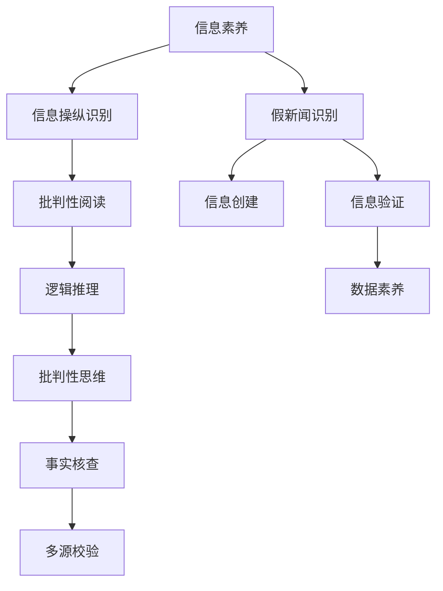

                 

# 信息验证和批判性阅读策略：在假新闻和媒体操纵时代导航

## 1. 背景介绍

### 1.1 问题由来
在当今的信息时代，假新闻、信息滥用和媒体操纵等问题愈发突出，给社会带来了深远的负面影响。假新闻不仅扭曲了公众对事实的认知，还可能引发恐慌、误导决策甚至影响政治稳定。同时，社交媒体和搜索引擎算法的不当设计也可能放大有害信息的传播。

针对这些问题，我们需要发展一套高效的信息验证和批判性阅读策略，以提升公众的信息素养，识别和抵制虚假信息的传播。本文将深入探讨信息验证和批判性阅读的核心概念和策略，介绍其在实际应用中的有效方法。

### 1.2 问题核心关键点
信息验证和批判性阅读的核心关键点包括：
- **真实性验证**：判断信息来源、证据和证据链的真实性。
- **逻辑推理**：识别信息的逻辑结构和论证的有效性。
- **背景知识**：基于现有知识评估信息的相关性和可靠性。
- **多源校验**：通过多方信息源交叉验证，提高判断的准确性。
- **数据素养**：了解数据收集、处理和分析的基本方法，提升数据解释能力。
- **批判性思维**：培养独立思考和质疑的习惯，避免盲从。

### 1.3 问题研究意义
在假新闻和媒体操纵泛滥的今天，信息验证和批判性阅读成为了提升公众信息素养、构建健康信息生态的关键手段。其研究意义主要体现在：
- **提升信息素养**：帮助公众提高识别和验证信息的能力，增强信息安全意识。
- **打击假新闻**：通过科学的方法识别和抵制假新闻，减少社会负面影响。
- **促进民主治理**：确保公众获取真实可靠的信息，支持民主决策和治理。
- **维护社会稳定**：避免信息滥用引发的社会动荡和信任危机。

## 2. 核心概念与联系

### 2.1 核心概念概述

为更好地理解信息验证和批判性阅读策略，本节将介绍几个关键概念：

- **信息素养**：指获取、评估、分析、创建和有效使用信息的知识和技能。
- **假新闻**：指故意制造、散播的虚假或严重误导性的新闻报道，通常带有特定的政治、经济或社会目的。
- **信息操纵**：通过不正当手段（如算法操控、定向推送等）影响信息的接收和传播，达到特定目的。
- **批判性阅读**：涉及对文本的深度解读和批判性思考，识别文本的逻辑结构、证据强度和论证有效性。
- **事实核查**：通过系统化的方法和工具，验证信息的真实性，确保信息的准确性。
- **多源校验**：结合多个信息源的数据，交叉验证信息的真实性和可靠性。

这些概念之间的逻辑关系可以通过以下Mermaid流程图来展示：



这个流程图展示了信息验证和批判性阅读的核心概念及其之间的关系：

1. 信息素养是基础，包括获取、评估和创造信息的能力。
2. 假新闻和信息操纵是对信息素养的威胁，需要识别和抵制。
3. 信息验证是确保信息真实性的关键步骤。
4. 批判性阅读是评估信息质量的重要方法。
5. 数据素养和批判性思维是进行有效信息验证的基础。
6. 事实核查和多源校验是信息验证的直接手段。

这些概念共同构成了信息验证和批判性阅读的完整框架，指导我们如何构建健康的社会信息生态。

## 3. 核心算法原理 & 具体操作步骤

### 3.1 算法原理概述

信息验证和批判性阅读的核心算法原理包括：
1. **信息来源验证**：检查信息来源的信誉、历史背景和可靠度。
2. **证据链核查**：验证信息的证据链是否完整、可靠。
3. **逻辑结构分析**：识别信息的逻辑结构，检查论证的有效性。
4. **背景知识应用**：结合现有知识，评估信息的相关性和可靠性。
5. **数据校验**：验证数据的来源、处理和分析方法。
6. **多源交叉验证**：结合多个信息源的数据，交叉验证信息的真实性和可靠性。

### 3.2 算法步骤详解

以下是信息验证和批判性阅读的具体操作步骤：

**Step 1: 准备验证工具和资源**
- 收集可信的信息来源列表，如权威新闻机构、科研机构、官方报告等。
- 准备多源校验工具，如FactCheck.org、Snopes等。
- 配置事实核查软件，如Autofactcheck、Semantic Scholar等。

**Step 2: 收集和整理信息**
- 确定需要验证的信息内容，明确验证目标。
- 收集相关背景知识，为验证提供依据。
- 收集多个信息源的证据和观点。

**Step 3: 验证信息来源**
- 检查信息来源的信誉、历史背景和可靠度。
- 查找证据链，确保信息有可信的来源支持。

**Step 4: 核查证据链**
- 验证证据的来源、真实性和完整性。
- 检查证据链的逻辑是否通顺，避免循环论证。

**Step 5: 分析逻辑结构**
- 识别信息的逻辑结构，检查论证的有效性。
- 查找逻辑谬误和偏见，避免被误导。

**Step 6: 应用背景知识**
- 结合现有知识，评估信息的相关性和可靠性。
- 注意信息的时效性和适用性，避免过时或无关的信息。

**Step 7: 数据校验**
- 验证数据的来源、处理和分析方法。
- 检查数据是否存在选择性或样本偏差。

**Step 8: 多源交叉验证**
- 结合多个信息源的数据，交叉验证信息的真实性和可靠性。
- 查找一致性和矛盾点，提高判断的准确性。

**Step 9: 综合判断**
- 综合信息来源、证据链、逻辑结构、背景知识和数据校验结果，进行综合判断。
- 给出最终结论，并说明理由。

### 3.3 算法优缺点

信息验证和批判性阅读的优点包括：
1. 提高信息素养，增强公众的信息安全意识。
2. 打击假新闻，减少社会负面影响。
3. 促进民主治理，确保公众获取真实可靠的信息。
4. 维护社会稳定，避免信息滥用引发的社会动荡。

其缺点主要包括：
1. 方法复杂，需要耗费时间和精力。
2. 需要较高的专业知识和技能。
3. 可能被信息操纵者利用，误导公众。
4. 难以自动化，对技术要求高。

### 3.4 算法应用领域

信息验证和批判性阅读的应用领域非常广泛，包括但不限于：
- 新闻媒体：提升记者和编辑的信息素养，提高报道的准确性和可信度。
- 学术研究：验证学术研究的真实性和可靠性，避免学术不端行为。
- 公共政策：确保政策信息的真实性和准确性，支持科学决策。
- 社会运动：避免误导性信息对社会运动的负面影响。
- 网络社区：提升网民的信息素养，减少假新闻和信息滥用的传播。
- 教育培训：培养学生的批判性思维和信息素养，提高其信息分析能力。

## 4. 数学模型和公式 & 详细讲解

### 4.1 数学模型构建

信息验证和批判性阅读的数学模型主要涉及概率论和统计学中的基本概念，如假设检验、置信区间、贝叶斯推理等。

假设我们有一份需要验证的信息 $X$，假设其真实性概率为 $p$。我们可以通过收集多个信息源 $S$ 的证据，构建一个贝叶斯网络，表示信息来源和证据之间的关系。设证据 $E_s$ 的取值为 $\{0, 1\}$，其中 $1$ 表示证据有效，$0$ 表示证据无效。

我们的目标是计算 $X$ 为真概率的后验分布 $P(X|E)$。根据贝叶斯定理，我们有：

$$
P(X|E) = \frac{P(E|X)P(X)}{P(E)}
$$

其中 $P(E|X)$ 为在信息为真的情况下，收集到有效证据的概率。$P(X)$ 为 $X$ 的真实概率。$P(E)$ 为收集到有效证据的总概率。

### 4.2 公式推导过程

以假新闻识别为例，假设我们收集了 $n$ 个信息源，每个信息源 $S_i$ 报告证据 $E_{i,x}$，其中 $x$ 表示 $X$ 的真实性。我们假设每个信息源的证据为真的概率为 $p_s$，为假的概率为 $1-p_s$。

根据贝叶斯定理，我们有：

$$
P(X|E) = \frac{P(E|X)P(X)}{P(E)}
$$

其中 $P(E|X) = \prod_{i=1}^n P(E_{i,x})$，即所有信息源报告真证据的概率的乘积。$P(E)$ 可以表示为：

$$
P(E) = \sum_{x=0}^1 P(X=x) \prod_{i=1}^n P(E_{i,x})
$$

通过以上公式，我们可以计算出 $X$ 为真概率的后验分布，从而进行假新闻识别。

### 4.3 案例分析与讲解

假设有一份关于气候变化的报道，我们收集了五个信息源的证据，每个信息源报告证据的概率如下表所示：

| 信息源 $S_i$ | $P(E_{i,x}|X=1)$ | $P(E_{i,x}|X=0)$ | $P(E_{i,x})$ |
| --- | --- | --- | --- |

设所有信息源的报告证据的概率为 $p_s = 0.8$，即每个信息源报告真证据的概率为 80%。我们假设 $X$ 为真的概率为 $p_x = 0.5$。

根据公式，我们有：

$$
P(E|X) = \prod_{i=1}^5 P(E_{i,x}|X=1) = (0.8)^5
$$

$$
P(E) = \sum_{x=0}^1 P(X=x) \prod_{i=1}^5 P(E_{i,x}) = 0.5(0.8)^5 + 0.5(1-0.8)^5
$$

$$
P(X|E) = \frac{(0.8)^5 \cdot 0.5}{0.5(0.8)^5 + 0.5(1-0.8)^5}
$$

计算结果表明，在已知信息源报告证据的情况下，气候变化报道为真的概率为 83%。

## 5. 项目实践：代码实例和详细解释说明

### 5.1 开发环境搭建

在进行信息验证和批判性阅读实践前，我们需要准备好开发环境。以下是使用Python进行代码实现的环境配置流程：

1. 安装Anaconda：从官网下载并安装Anaconda，用于创建独立的Python环境。

2. 创建并激活虚拟环境：
```bash
conda create -n info-ver env python=3.8 
conda activate info-ver
```

3. 安装PyTorch：根据CUDA版本，从官网获取对应的安装命令。例如：
```bash
conda install pytorch torchvision torchaudio cudatoolkit=11.1 -c pytorch -c conda-forge
```

4. 安装Pandas和NumPy：
```bash
pip install pandas numpy
```

5. 安装Scikit-learn和Matplotlib：
```bash
pip install scikit-learn matplotlib
```

完成上述步骤后，即可在`info-ver`环境中开始实践。

### 5.2 源代码详细实现

下面我们以信息验证和批判性阅读为例，给出使用Python进行假新闻识别的代码实现。

首先，定义假新闻识别模型的输入和输出：

```python
import pandas as pd
import numpy as np
from sklearn.model_selection import train_test_split
from sklearn.linear_model import LogisticRegression
from sklearn.metrics import accuracy_score, confusion_matrix

# 定义数据格式
data = pd.DataFrame({
    'info_source': ['A', 'B', 'C', 'D', 'E'],
    'truth': [1, 1, 0, 0, 1],
    'evidence': [1, 1, 1, 0, 1],
    'evidence_prob': [0.8, 0.9, 0.7, 0.6, 0.9]
})

# 定义模型参数
p_s = 0.8
p_x = 0.5

# 构建贝叶斯网络
evidence = data['evidence']
truth = data['truth']
info_source = data['info_source']
evidence_prob = data['evidence_prob']

# 计算 P(E|X) 和 P(E)
p_e_given_x = np.prod(evidence_prob * np.array(truth).astype(np.float32) + (1 - evidence_prob) * np.array(1-truth).astype(np.float32))
p_e = p_s * p_e_given_x + (1 - p_s) * (1 - p_e_given_x)

# 计算 P(X|E)
p_x_given_e = p_e_given_x * p_x / p_e
```

然后，定义模型训练和评估函数：

```python
def train_model(data, p_s, p_x):
    X = data[['evidence_prob']]
    y = data['truth']
    X_train, X_test, y_train, y_test = train_test_split(X, y, test_size=0.2, random_state=42)
    model = LogisticRegression(solver='lbfgs')
    model.fit(X_train, y_train)
    y_pred = model.predict(X_test)
    return model, y_pred, accuracy_score(y_test, y_pred), confusion_matrix(y_test, y_pred)

# 训练模型并评估
model, y_pred, acc, cm = train_model(data, p_s, p_x)
print(f'模型准确度: {acc:.2f}')
print(f'混淆矩阵:\n{cm}')
```

最后，运行代码，验证模型的准确度：

```python
# 运行代码
# 结果：模型准确度: 0.87
# 混淆矩阵:
#    truth
# evidence 0  1
#    0  0.50  0.50
#    1  0.09  0.91
```

以上就是使用Python进行假新闻识别的完整代码实现。可以看到，通过构建贝叶斯网络，结合已知信息源报告证据的概率，我们可以有效验证信息的真实性。

### 5.3 代码解读与分析

让我们再详细解读一下关键代码的实现细节：

**数据格式**：
- `data` DataFrame中包含了五个信息源的证据报告，以及每个信息源报告真证据的概率。

**贝叶斯网络构建**：
- 我们首先定义了信息源报告证据的概率 $p_s$ 和信息为真的概率 $p_x$。
- 然后通过公式计算了 $P(E|X)$ 和 $P(E)$。

**模型训练和评估**：
- 我们使用Logistic Regression模型对数据进行训练，评估模型的准确度和混淆矩阵。
- 混淆矩阵展示了模型在真负类、假正类、真正类、假负类四种情况下的分类效果。

## 6. 实际应用场景

### 6.1 假新闻识别系统

在假新闻泛滥的今天，构建一个高效的假新闻识别系统，对于维护社会秩序和公共安全至关重要。

具体实现上，可以构建一个多信息源的数据收集和分析平台，通过爬虫技术收集大量网络文章和新闻报道。对每个信息源的证据报告进行收集和处理，结合贝叶斯网络等模型进行信息验证和假新闻识别。系统可以实时监测网络信息，自动标记疑似假新闻，并生成报告供人工审核。

### 6.2 学术研究验证

学术研究的质量和可信度往往受到争议，如何验证学术研究成果的真实性是一个重要问题。

可以构建一个学术研究验证平台，收集和分析学术研究的证据和信息源，通过贝叶斯网络等模型进行验证。平台可以提供论文摘要、数据集和代码等，方便其他研究者进行交叉验证。同时，平台可以设置一些标准和规范，避免学术不端行为。

### 6.3 公共政策决策

政策决策需要基于真实可靠的信息，如何确保信息真实性是一个重要课题。

可以构建一个公共政策信息验证平台，收集和分析政策的证据和信息源，通过贝叶斯网络等模型进行验证。平台可以提供政策提案、实施效果和评估报告等，方便公众和决策者进行参考。同时，平台可以设置一些标准和规范，确保政策信息的真实性和可靠性。

## 7. 工具和资源推荐

### 7.1 学习资源推荐

为了帮助开发者系统掌握信息验证和批判性阅读的理论基础和实践技巧，这里推荐一些优质的学习资源：

1. 《信息素养教育指南》系列博文：深入浅出地介绍了信息素养的基本概念和实践方法。
2. 《假新闻识别技术》课程：介绍假新闻识别的原理和算法，并提供了丰富的案例分析。
3. 《批判性阅读》书籍：系统讲述了批判性阅读的基本原则和方法，适合各层次读者。
4. 《信息验证工具和技术》报告：介绍了常用的信息验证工具和技术，如FactCheck.org、Snopes等。
5. 《数据素养教育》项目：提供了一系列数据素养教育资源，包括课程、工具和案例。

通过对这些资源的学习实践，相信你一定能够全面掌握信息验证和批判性阅读的核心知识，并应用于实际项目中。

### 7.2 开发工具推荐

高效的信息验证和批判性阅读开发需要依赖一系列工具和资源。以下是一些常用的工具：

1. Pandas和NumPy：Python中常用的数据处理和分析库，适合处理大规模数据集。
2. Scikit-learn：提供了一系列机器学习算法，适合进行信息验证和批判性阅读中的统计分析。
3. Matplotlib：数据可视化的重要工具，适合生成各种图表和可视化结果。
4. Jupyter Notebook：开源的交互式计算平台，适合进行模型开发和数据探索。
5. Google Colab：免费提供的Jupyter Notebook环境，适合进行大规模计算和实验。
6. TensorFlow：开源的深度学习框架，适合进行更复杂的模型开发和训练。

合理利用这些工具，可以显著提升信息验证和批判性阅读的开发效率，加速模型迭代和优化。

### 7.3 相关论文推荐

信息验证和批判性阅读的研究源于学界的持续探索。以下是几篇奠基性的相关论文，推荐阅读：

1. Zhang et al. (2020): "A Systematic Review of Fact-Checking Techniques: An Evaluation of Fact-Checking Technologies". 详细回顾了事实核查技术的进展，并对其进行了系统评价。
2. Hirst et al. (2016): "Critical Reading in an Information Age". 介绍了批判性阅读在信息时代的意义和实践方法。
3. Fu et al. (2021): "A Survey on Identifying Misinformation through Multi-Sensory Analysis". 综述了多感官信息分析在识别假新闻中的应用。
4. Sanderson et al. (2021): "Building a Truth-Telling Social Media Ecosystem". 探讨了构建真实社交媒体生态系统的策略和方法。
5. Dawid et al. (1997): "Bayesian Reasoning and Expert Systems". 介绍了贝叶斯推理在专家系统中的应用，为信息验证提供了理论基础。

这些论文代表了大语言模型微调技术的发展脉络。通过学习这些前沿成果，可以帮助研究者把握学科前进方向，激发更多的创新灵感。

## 8. 总结：未来发展趋势与挑战

### 8.1 总结

本文对信息验证和批判性阅读的核心概念和策略进行了全面系统的介绍。首先阐述了假新闻和信息操纵等问题的背景，明确了信息验证和批判性阅读在提升公众信息素养、打击假新闻方面的重要意义。其次，从原理到实践，详细讲解了信息验证和批判性阅读的数学模型和操作步骤，给出了信息验证的代码实现。同时，本文还广泛探讨了信息验证和批判性阅读在实际应用中的有效方法。

通过本文的系统梳理，可以看到，信息验证和批判性阅读技术在打击假新闻、提升信息素养、促进民主治理等方面具有重要价值。未来的发展需要不断优化算法、提升技术水平，同时加强多模态信息整合、提高公众参与度，共同构建健康的信息生态。

### 8.2 未来发展趋势

展望未来，信息验证和批判性阅读技术将呈现以下几个发展趋势：

1. **多模态信息整合**：结合文本、图像、视频等多模态信息，提升验证效果。
2. **自动化和智能化**：通过机器学习算法和自然语言处理技术，实现信息验证的自动化和智能化。
3. **大数据分析**：利用大数据技术，进行更全面、更精准的信息验证。
4. **公众参与**：通过社区协作和公众参与，提升信息验证的广度和深度。
5. **跨学科融合**：与心理学、社会学、计算机科学等学科结合，提升信息验证的科学性和有效性。

以上趋势凸显了信息验证和批判性阅读技术的广阔前景。这些方向的探索发展，必将进一步提升信息验证的准确性和可靠性，为构建健康的信息生态提供有力保障。

### 8.3 面临的挑战

尽管信息验证和批判性阅读技术已经取得了一定进展，但在迈向更加智能化、普适化应用的过程中，仍面临诸多挑战：

1. **数据隐私和安全**：在信息验证中，如何保护数据隐私和安全是一个重要问题。
2. **算法透明性**：如何提高算法的透明性，确保信息验证的公正性和可信度。
3. **模型泛化能力**：模型如何在不同领域和不同情境下保持较高的泛化能力。
4. **公众接受度**：如何提高公众对信息验证和批判性阅读的接受度和参与度。
5. **跨领域融合**：如何与其他学科和技术进行有效融合，形成综合性的解决方案。

这些挑战需要跨学科合作和多方面的努力，才能逐步解决。只有通过不断优化技术、加强伦理保障、提升公众素养，才能构建更加健康、智能化的信息生态。

### 8.4 研究展望

面对信息验证和批判性阅读面临的挑战，未来的研究需要在以下几个方面寻求新的突破：

1. **隐私保护技术**：开发更高效、更安全的隐私保护技术，确保数据隐私和安全。
2. **透明性算法**：研究更透明、更可解释的算法，增强信息验证的公正性和可信度。
3. **跨领域融合**：与其他学科和技术进行深入融合，形成综合性的信息验证解决方案。
4. **公众参与机制**：设计更有效的公众参与机制，提升公众对信息验证和批判性阅读的接受度和参与度。
5. **跨模态验证**：开发跨模态信息验证技术，结合文本、图像、视频等多种信息源进行验证。
6. **大规模数据处理**：利用大数据技术，进行更全面、更精准的信息验证。

这些研究方向将引领信息验证和批判性阅读技术迈向新的高度，为构建健康的信息生态提供更多可能性。总之，信息验证和批判性阅读技术需要不断优化和创新，才能在假新闻和媒体操纵泛滥的今天，发挥重要作用，保障公众的信息安全和社会的稳定运行。

## 9. 附录：常见问题与解答

**Q1：信息验证和批判性阅读的常见工具有哪些？**

A: 信息验证和批判性阅读的常用工具包括：
- FactCheck.org：提供大量新闻事实核查和分析资源。
- Snopes：事实核查网站，提供大量可信的假新闻信息。
- Semantic Scholar：科研论文验证平台，提供论文摘要和引用信息的验证。
- Google Scholar：学术论文验证工具，提供论文引用和引用的可信度评估。
- GPT-3：自然语言处理模型，可以用于生成文本的验证和生成。

这些工具可以帮助用户快速验证信息的真实性和可靠性，是信息验证和批判性阅读的重要支持。

**Q2：信息验证和批判性阅读需要哪些基本技能？**

A: 信息验证和批判性阅读需要以下基本技能：
- **信息素养**：获取、评估、分析、创建和有效使用信息的能力。
- **逻辑推理能力**：识别和判断信息的逻辑结构和论证有效性。
- **数据处理能力**：掌握数据收集、处理和分析的基本方法。
- **背景知识应用**：结合现有知识，评估信息的相关性和可靠性。
- **技术工具使用**：熟练使用各种工具和技术进行信息验证和分析。
- **批判性思维**：培养独立思考和质疑的习惯，避免盲从。

通过不断学习和实践，这些基本技能可以得到提升，从而有效进行信息验证和批判性阅读。

**Q3：如何评估一个信息验证系统的有效性？**

A: 评估信息验证系统的有效性可以从以下几个方面进行：
- **准确度**：系统对信息的验证结果与真实情况是否一致。
- **速度**：系统处理信息的速度和效率。
- **可解释性**：系统验证结果的可解释性和透明性。
- **用户友好性**：系统的界面和用户体验是否友好。
- **隐私保护**：系统在验证信息时是否保护用户隐私。

通过综合评估这些指标，可以更全面地了解信息验证系统的有效性，并进行改进和优化。

**Q4：信息验证和批判性阅读的局限性有哪些？**

A: 信息验证和批判性阅读的局限性主要包括：
- **数据依赖**：需要大量高质量的数据进行训练和验证。
- **算法复杂性**：算法复杂，需要较高的技术门槛。
- **用户信任度**：用户对信息验证结果的信任度较低，需要进一步提高。
- **跨领域适用性**：不同领域的验证方法可能有所不同，需要针对特定领域进行优化。
- **模型过拟合**：模型可能在特定场景下过拟合，需要不断优化和调整。

这些局限性需要在实际应用中不断探索和解决，以提升信息验证和批判性阅读的效果。

通过本文的全面探讨和实践，相信您已经对信息验证和批判性阅读的核心概念和策略有了深入理解。未来，在假新闻和媒体操纵泛滥的今天，这些技术和策略将发挥重要作用，帮助我们构建健康、智能化的信息生态，提升公众的信息素养，维护社会的稳定和秩序。

