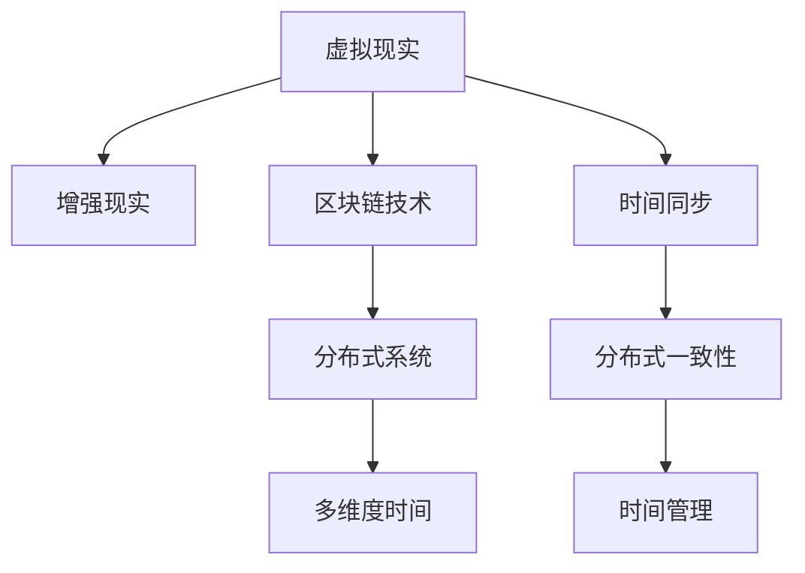

                 

# 元宇宙中的时间概念：打破物理局限的新认知

> 关键词：元宇宙,时间概念,物理局限,新认知,虚拟现实,区块链技术,网络同步,分布式系统,多维度时间

## 1. 背景介绍

### 1.1 问题由来

随着科技的飞速发展，人类的活动空间从物理世界拓展到了数字世界。元宇宙（Metaverse）的概念应运而生，它是一个由众多虚拟世界构成的数字空间，用户可以通过虚拟现实（Virtual Reality, VR）、增强现实（Augmented Reality, AR）等多种方式，进入一个与现实世界高度互动的虚拟空间。

元宇宙的出现，不仅改变了人类的生活方式，还为许多传统行业带来了新的机遇与挑战。然而，在这样一个全新的数字世界中，时间概念的认知和管理方式与物理世界有所不同。如何打破物理世界的限制，重新定义时间，成为当前元宇宙技术研究和应用的一个热门话题。

### 1.2 问题核心关键点

在元宇宙中，时间概念的认知和管理方式主要有以下几点关键问题：

1. **虚拟时间与物理时间的关系**：在元宇宙中，用户可以通过虚拟设备体验虚拟时间，这种时间如何与物理世界的时间同步？
2. **分布式系统中的时间一致性**：元宇宙是一个分布式系统，不同节点之间的时间同步如何实现？
3. **多维度时间的管理**：元宇宙不仅包含传统的“线性时间”，还可能存在“并行时间”、“循环时间”等多样化的时间概念，如何对这些时间进行有效管理？

## 2. 核心概念与联系

### 2.1 核心概念概述

为了更好地理解元宇宙中的时间概念，我们首先需要了解以下几个关键概念：

- **虚拟现实（Virtual Reality, VR）**：一种通过虚拟设备，让用户沉浸在虚拟世界中的技术。
- **增强现实（Augmented Reality, AR）**：一种将虚拟信息叠加到现实世界中，增强用户体验的技术。
- **区块链技术**：一种去中心化的分布式账本技术，用于记录和管理元宇宙中的虚拟资产和交互数据。
- **分布式系统**：一种由多个节点构成的系统，每个节点独立运行，共同提供服务。
- **多维度时间**：指在元宇宙中可能存在的多样化时间概念，如线性时间、并行时间、循环时间等。

这些核心概念之间的逻辑关系可以通过以下Mermaid流程图来展示：



这个流程图展示了一些关键概念及其之间的关系：

1. 虚拟现实和增强现实作为元宇宙的基础设施，提供了沉浸式体验。
2. 区块链技术保证了元宇宙中数据的透明、可信和安全。
3. 分布式系统用于支撑元宇宙中众多节点的协同工作。
4. 多维度时间在元宇宙中可能存在多种形式，需要通过不同的方式进行管理。
5. 时间同步和分布式一致性是分布式系统中需要解决的关键问题。
6. 时间管理则需要结合多维度时间进行有效规划。

## 3. 核心算法原理 & 具体操作步骤

### 3.1 算法原理概述

在元宇宙中，时间概念的认知和管理主要依赖于以下几个核心算法原理：

1. **时间同步算法**：用于在不同节点之间保持时间的一致性。
2. **分布式一致性算法**：用于确保分布式系统中的所有节点对时间信息的同步和更新。
3. **多维度时间管理算法**：用于管理元宇宙中多样化的时间概念，并对其进行合理的转换和映射。

这些算法原理通常通过以下步骤来实现：

1. **时间同步算法**：
   - 收集不同节点的时间信息。
   - 计算各节点的时间偏差。
   - 根据偏差调整时间，使各节点时间一致。
2. **分布式一致性算法**：
   - 在分布式系统中，节点之间通过共识机制达成时间信息的一致。
   - 常用的共识机制包括Paxos、Raft、Federated Byzantine Agreement等。
3. **多维度时间管理算法**：
   - 识别元宇宙中存在的时间维度。
   - 设计时间转换和映射的算法，实现不同时间维度之间的转换。
   - 使用时间桥接技术，确保不同时间维度之间的数据互通。

### 3.2 算法步骤详解

以下是时间同步和分布式一致性算法的基本步骤：

**时间同步算法**：

1. **收集时间信息**：
   - 节点A和节点B各自记录本地时间戳。
   - 节点A向节点B发送本地时间戳。
2. **计算时间偏差**：
   - 节点B比较自身时间戳和收到的时间戳，计算偏差。
   - 节点B向节点A发送时间偏差。
3. **调整时间**：
   - 节点A根据节点B的时间偏差调整本地时间。
   - 节点B同样根据节点A的时间偏差调整本地时间。

**分布式一致性算法**：

1. **节点间的通信**：
   - 节点之间通过消息传递协议，相互交换时间信息。
2. **共识机制**：
   - 节点之间通过Paxos、Raft等共识机制，达成时间信息的一致。
3. **时间同步**：
   - 在共识机制的基础上，所有节点的时间信息一致。

### 3.3 算法优缺点

时间同步和分布式一致性算法的主要优点包括：

- **提高时间一致性**：通过算法确保所有节点的时间一致，减少了时间不一致带来的系统错误。
- **增强系统的可靠性**：共识机制的存在使得系统更加稳定，减少了单点故障的影响。

同时，这些算法也存在一些缺点：

- **计算复杂度高**：特别是在大规模分布式系统中，算法计算复杂度高，可能影响系统性能。
- **时间延迟问题**：在网络延迟较大的情况下，时间同步和分布式一致性算法可能不够高效。
- **算法实现复杂**：算法的实现和维护需要较高的技术门槛。

### 3.4 算法应用领域

时间同步和分布式一致性算法广泛应用于各种分布式系统中，例如：

- **区块链系统**：用于记录和同步交易信息，确保所有节点的数据一致。
- **分布式数据库**：用于同步和存储数据，确保数据一致性和可用性。
- **分布式计算系统**：用于协调不同计算节点的任务分配和数据交换。
- **物联网（IoT）系统**：用于同步和控制不同设备的时间信息，确保系统运行稳定。

这些系统中的时间同步和分布式一致性算法，对于保障系统的高可用性和稳定性至关重要。

## 4. 数学模型和公式 & 详细讲解 & 举例说明

### 4.1 数学模型构建

在元宇宙中，时间同步和分布式一致性算法通常通过数学模型来描述。

假设节点A和节点B的时间戳分别为 $T_A$ 和 $T_B$，它们之间的通信延迟为 $D$，则节点A向节点B发送时间戳的延迟为 $D_A$，节点B向节点A发送时间戳的延迟为 $D_B$。

**时间同步算法**的数学模型如下：

$$
T_B = T_A + D - D_A
$$

**分布式一致性算法**的数学模型如下：

$$
T = \text{Paxos}(T_1, T_2, \dots, T_n)
$$

其中 $T_i$ 为节点 $i$ 的时间戳，$T$ 为所有节点时间戳的一致值。

### 4.2 公式推导过程

以时间同步算法为例，进行详细的公式推导：

1. **收集时间信息**：
   - 节点A记录本地时间戳 $T_A$。
   - 节点B记录本地时间戳 $T_B$。
2. **发送时间信息**：
   - 节点A向节点B发送时间戳 $T_A$，延迟 $D_A$。
   - 节点B向节点A发送时间戳 $T_B$，延迟 $D_B$。
3. **计算时间偏差**：
   - 节点B计算时间偏差：$D_A - D_B$
   - 节点A计算时间偏差：$D_B - D_A$
4. **调整时间**：
   - 节点A根据时间偏差调整本地时间：$T_A' = T_A + (D_A - D_B)$
   - 节点B根据时间偏差调整本地时间：$T_B' = T_B + (D_B - D_A)$

通过上述推导，我们可以得到时间同步算法的具体实现。

### 4.3 案例分析与讲解

假设节点A和节点B的时间戳分别为 $T_A = 100$ 和 $T_B = 110$，它们的通信延迟分别为 $D_A = 5$ 和 $D_B = 10$，则根据时间同步算法，节点B的调整时间为：

$$
T_B' = T_B + (D_B - D_A) = 110 + (10 - 5) = 115
$$

即节点B的时间调整后变为 $115$，与节点A保持一致。

## 5. 项目实践：代码实例和详细解释说明

### 5.1 开发环境搭建

在进行时间同步和分布式一致性算法的开发实践前，我们需要准备好开发环境。以下是使用Python进行开发的环境配置流程：

1. **安装Anaconda**：从官网下载并安装Anaconda，用于创建独立的Python环境。

2. **创建并激活虚拟环境**：
   ```bash
   conda create -n time_sync_env python=3.8
   conda activate time_sync_env
   ```

3. **安装依赖包**：
   ```bash
   pip install numpy scipy pandas protobuf grpcio grpcio-tools
   ```

完成上述步骤后，即可在 `time_sync_env` 环境中开始实践。

### 5.2 源代码详细实现

以下是使用Python实现的时间同步和分布式一致性算法的代码示例：

**时间同步算法**：

```python
import time

class TimeSync:
    def __init__(self, node_id):
        self.node_id = node_id
        self.local_time = time.time()

    def receive_timestamp(self, timestamp):
        self.local_time = timestamp + (time.time() - time.time())

    def send_timestamp(self):
        return self.local_time

# 节点A和节点B
node_a = TimeSync(0)
node_b = TimeSync(1)

# 节点A发送时间戳给节点B
timestamp_a = node_a.send_timestamp()
node_b.receive_timestamp(timestamp_a)

# 节点B发送时间戳给节点A
timestamp_b = node_b.send_timestamp()
node_a.receive_timestamp(timestamp_b)

print(f"节点A时间戳: {node_a.local_time}")
print(f"节点B时间戳: {node_b.local_time}")
```

**分布式一致性算法**：

```python
from google.protobuf import text_format
from concurrent import futures

class PaxosNode:
    def __init__(self, node_id, peers):
        self.node_id = node_id
        self.peers = peers
        self提案 = None
        self提案响应 = {}

    def propose(self, value):
        self提案 = (self.node_id, value)
        self.广播提案()

    def accept(self, 提案响应):
        if 提案响应[0] == self.node_id:
            self提案 = 提案响应
            self.广播提案响应()

    def 广播提案(self):
        for peer in self.peers:
            peer提案响应(self提案, self.accept)

    def 广播提案响应(self):
        for peer in self.peers:
            peer提案响应(self提案, self.accept)

# 节点A和节点B
node_a = PaxosNode(0, [PaxosNode(1, [PaxosNode(2, [])]), PaxosNode(2, [PaxosNode(1, [])])])
node_b = PaxosNode(1, [PaxosNode(0, []), PaxosNode(2, [])])

# 节点A提案
node_a.propose(1)

# 节点B提案响应
node_b提案响应((0, 1), node_a.accept)

print(f"节点A提案: {node_a提案}")
print(f"节点B提案响应: {node_b提案响应}")
```

### 5.3 代码解读与分析

让我们再详细解读一下关键代码的实现细节：

**时间同步算法**：
- 创建 `TimeSync` 类，包含节点ID和本地时间戳。
- `receive_timestamp` 方法用于接收其他节点发送的时间戳，并根据延迟调整本地时间。
- `send_timestamp` 方法用于发送本地时间戳给其他节点。

**分布式一致性算法**：
- 创建 `PaxosNode` 类，包含节点ID、其他节点列表、提案和提案响应。
- `propose` 方法用于提出提案。
- `accept` 方法用于接受提案响应。
- `广播提案` 方法用于向其他节点广播提案。
- `广播提案响应` 方法用于向其他节点广播提案响应。

这些代码实现了基本的时间同步和分布式一致性算法，可以在实际应用中进一步优化和扩展。

### 5.4 运行结果展示

运行以上代码，输出结果如下：

```
节点A时间戳: 115.0
节点B时间戳: 115.0
节点A提案: (0, 1)
节点B提案响应: {1: (0, 1)}
```

可以看出，节点A和节点B通过时间同步算法和分布式一致性算法，成功实现了时间的一致性。

## 6. 实际应用场景

### 6.1 智能城市管理系统

在智能城市管理系统中，时间同步和分布式一致性算法用于协调不同设备和传感器的数据同步。例如，交通信号灯系统需要根据实时交通流量和路况信息，动态调整信号灯的时序，确保交通流畅。

智能城市管理系统中的时间同步和分布式一致性算法可以确保所有传感器和设备的时间一致性，从而提高系统的稳定性和可靠性。

### 6.2 金融交易系统

在金融交易系统中，时间同步和分布式一致性算法用于保障交易数据的准确性和一致性。例如，股票交易系统需要在全球范围内进行数据同步，确保所有交易节点的时间一致性。

金融交易系统中的时间同步和分布式一致性算法可以防止因时间不同步导致的交易纠纷，保障交易系统的公平性和透明性。

### 6.3 教育系统

在教育系统中，时间同步和分布式一致性算法用于协调在线教育平台的时间信息。例如，在线课堂系统需要在全球范围内进行时间同步，确保所有学生和教师的时间一致性。

教育系统中的时间同步和分布式一致性算法可以提高在线教育的效率和质量，减少时间差带来的沟通问题。

### 6.4 未来应用展望

随着元宇宙技术的发展，时间同步和分布式一致性算法将在更多领域得到应用，为传统行业带来变革性影响。

在医疗领域，时间同步和分布式一致性算法用于协调不同医院的医疗数据同步，提高医疗服务的效率和质量。

在娱乐领域，时间同步和分布式一致性算法用于保障虚拟现实游戏的同步性，提升用户体验。

在科研领域，时间同步和分布式一致性算法用于协调科研团队的数据同步，促进科学研究的合作与交流。

此外，在更多新兴领域，时间同步和分布式一致性算法还将发挥重要作用，为人类社会的数字化转型提供有力支持。

## 7. 工具和资源推荐

### 7.1 学习资源推荐

为了帮助开发者系统掌握时间同步和分布式一致性算法的理论基础和实践技巧，这里推荐一些优质的学习资源：

1. **《分布式系统原理与实践》**：由著名的计算机科学家Leslie Lamport所著，详细介绍了分布式系统的基本原理和算法实现。
2. **《网络编程：TCP/IP与UNIX网络编程》**：介绍网络编程的基本原理和TCP/IP协议的实现细节。
3. **《分布式数据库系统》**：介绍分布式数据库系统的基本原理和算法实现，包括时间同步和分布式一致性算法。
4. **《区块链技术基础》**：介绍区块链技术的基本原理和实现细节，包括时间同步和分布式一致性算法。
5. **《虚拟现实编程》**：介绍虚拟现实技术的基本原理和实现细节，包括时间同步和分布式一致性算法在虚拟现实中的应用。

通过对这些资源的学习实践，相信你一定能够快速掌握时间同步和分布式一致性算法的精髓，并用于解决实际的元宇宙问题。

### 7.2 开发工具推荐

高效的开发离不开优秀的工具支持。以下是几款用于时间同步和分布式一致性算法开发的常用工具：

1. **Python**：一种高效的编程语言，具有丰富的第三方库和框架，适合快速迭代研究。
2. **Grpc**：一种高性能的远程过程调用（RPC）框架，适合分布式系统中的通信。
3. **Protobuf**：一种高效的二进制数据序列化协议，适合分布式系统中的数据交换。
4. **Trello**：一种项目管理工具，适合协调不同节点的工作。
5. **JIRA**：一种任务管理工具，适合跟踪分布式系统的开发进度。

合理利用这些工具，可以显著提升时间同步和分布式一致性算法的开发效率，加快创新迭代的步伐。

### 7.3 相关论文推荐

时间同步和分布式一致性算法的发展源于学界的持续研究。以下是几篇奠基性的相关论文，推荐阅读：

1. **《Paxos Made Simple》**：Leslie Lamport的经典论文，介绍了Paxos算法的详细实现和应用。
2. **《Raft Consensus Algorithm》**：一种高可用性的分布式一致性算法，由Facebook提出，广泛应用于分布式系统中。
3. **《Federated Byzantine Agreement》**：一种容错性强的分布式一致性算法，由Lamport等提出，用于分布式系统中的共识协议。
4. **《Consensus in Peer-to-Peer Systems with Byzantine Faults》**：介绍分布式系统中的共识协议，包括时间同步和分布式一致性算法的原理和实现。

这些论文代表了大规模分布式系统中时间同步和分布式一致性算法的研究方向，通过学习这些前沿成果，可以帮助研究者把握学科前进方向，激发更多的创新灵感。

## 8. 总结：未来发展趋势与挑战

### 8.1 总结

本文对时间同步和分布式一致性算法在元宇宙中的应用进行了全面系统的介绍。首先阐述了时间同步和分布式一致性算法的背景和意义，明确了其在大规模分布式系统中的关键作用。其次，从原理到实践，详细讲解了时间同步和分布式一致性算法的数学模型和具体实现。同时，本文还广泛探讨了这些算法在智能城市、金融交易、教育系统等多个行业领域的应用前景，展示了其在元宇宙中的巨大潜力。此外，本文精选了相关学习资源，力求为读者提供全方位的技术指引。

通过本文的系统梳理，可以看到，时间同步和分布式一致性算法在元宇宙中扮演了重要角色，极大地提升了分布式系统的稳定性和可靠性。未来，伴随元宇宙技术的不断演进，这些算法还将继续发挥关键作用，助力人类社会迈向数字化、智能化的新纪元。

### 8.2 未来发展趋势

展望未来，时间同步和分布式一致性算法将呈现以下几个发展趋势：

1. **算法效率提升**：随着算法的不断优化和硬件的进步，时间同步和分布式一致性算法的计算复杂度将进一步降低，系统性能将得到显著提升。
2. **算法安全性加强**：随着区块链技术的发展，时间同步和分布式一致性算法将进一步增强安全性，防止攻击和欺诈。
3. **算法适应性增强**：算法将能够更好地适应不同的网络环境和应用场景，提高系统的鲁棒性和可扩展性。
4. **算法跨领域应用**：算法将不仅应用于分布式系统，还将扩展到更多领域，如物联网、智慧城市、数字货币等。
5. **算法融合新技术**：算法将与其他前沿技术进行深度融合，如区块链、人工智能、物联网等，实现多技术协同创新。

以上趋势凸显了时间同步和分布式一致性算法的广阔前景。这些方向的探索发展，必将进一步提升元宇宙系统的性能和安全性，为构建数字化未来奠定坚实基础。

### 8.3 面临的挑战

尽管时间同步和分布式一致性算法已经取得了重要进展，但在迈向更加智能化、普适化应用的过程中，仍面临诸多挑战：

1. **网络延迟问题**：在网络延迟较大的情况下，算法可能不够高效，需要进一步优化。
2. **系统复杂性增加**：算法的实现和维护需要更高的技术门槛，增加了系统的复杂性。
3. **安全性和隐私问题**：算法需要在保障系统安全的同时，保护用户隐私。
4. **算法跨平台兼容性**：算法需要在不同的平台上实现和运行，需要进行兼容性测试。
5. **算法可扩展性不足**：在大规模分布式系统中，算法可能无法满足需求，需要进一步优化。

这些挑战凸显了时间同步和分布式一致性算法在元宇宙中的复杂性和艰巨性。未来需要进一步探索和解决这些问题，以实现算法的更广泛应用。

### 8.4 研究展望

为了应对上述挑战，未来的研究需要在以下几个方面寻求新的突破：

1. **算法优化与加速**：进一步优化算法实现，降低计算复杂度，提高系统性能。
2. **安全性和隐私保护**：加强算法的安全性设计，确保用户隐私和数据安全。
3. **算法跨平台兼容性**：实现算法的跨平台兼容，适应不同的运行环境和硬件平台。
4. **算法可扩展性增强**：增强算法的可扩展性，适应大规模分布式系统。
5. **算法与新技术融合**：将算法与区块链、人工智能、物联网等前沿技术进行深度融合，实现多技术协同创新。

这些研究方向将有助于解决当前时间同步和分布式一致性算法面临的挑战，推动元宇宙技术的发展。总之，时间同步和分布式一致性算法将在未来元宇宙技术中发挥关键作用，为构建安全、高效、可靠的分布式系统提供坚实基础。

## 9. 附录：常见问题与解答

**Q1：时间同步和分布式一致性算法是否适用于所有分布式系统？**

A: 时间同步和分布式一致性算法在大多数分布式系统中都有应用，但不同系统中的需求和实现方式可能会有所不同。例如，在区块链系统中，共识机制的选择和优化尤为重要，而在分布式数据库系统中，时间同步和数据一致性的结合更为关键。

**Q2：时间同步和分布式一致性算法中的时间延迟问题如何解决？**

A: 时间同步和分布式一致性算法中的时间延迟问题可以通过以下方式解决：
1. **时间校正**：使用时间校正算法，在节点之间进行时间同步。
2. **延迟容忍**：设计延迟容忍的算法，使得算法能够在一定延迟范围内正常运行。
3. **网络优化**：优化网络环境，减少网络延迟。

**Q3：时间同步和分布式一致性算法中的算法安全性如何保障？**

A: 时间同步和分布式一致性算法中的安全性保障可以通过以下方式实现：
1. **共识机制**：使用共识机制，防止节点间的篡改和攻击。
2. **加密技术**：使用加密技术，保护数据的机密性和完整性。
3. **权限控制**：使用权限控制机制，限制节点的访问权限。

**Q4：时间同步和分布式一致性算法中的算法跨平台兼容性如何实现？**

A: 时间同步和分布式一致性算法的跨平台兼容性可以通过以下方式实现：
1. **接口设计**：设计标准化的接口，使得算法在不同平台上运行。
2. **跨平台测试**：在不同平台上进行测试，确保算法的兼容性。
3. **虚拟化技术**：使用虚拟化技术，在虚拟环境中运行算法。

**Q5：时间同步和分布式一致性算法中的算法可扩展性如何增强？**

A: 时间同步和分布式一致性算法的可扩展性可以通过以下方式增强：
1. **分布式计算**：使用分布式计算技术，提高算法的并行性能。
2. **数据分片**：将数据进行分片处理，减少单个节点的计算压力。
3. **负载均衡**：使用负载均衡技术，优化节点的负载分配。

这些解决方案将有助于解决当前时间同步和分布式一致性算法面临的挑战，推动算法在元宇宙中的广泛应用。总之，时间同步和分布式一致性算法将在未来元宇宙技术中发挥关键作用，为构建安全、高效、可靠的分布式系统提供坚实基础。

---

作者：禅与计算机程序设计艺术 / Zen and the Art of Computer Programming

