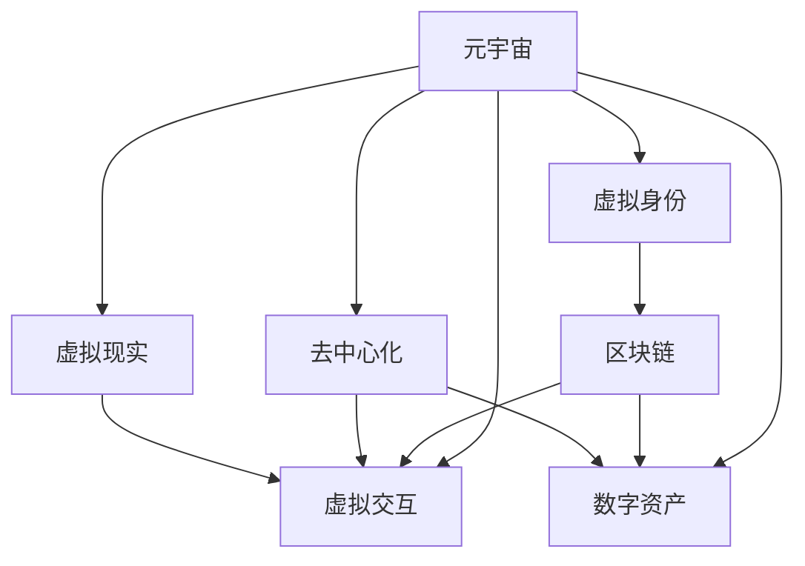

                 

# 元宇宙社交网络:重塑人际关系的数字平台

> 关键词：元宇宙,社交网络,虚拟世界,数字身份,虚拟交互,数字资产,区块链,去中心化

## 1. 背景介绍

### 1.1 问题由来

随着数字技术和互联网的飞速发展，社交网络的形态和交互方式正在发生根本性的变化。从早期的社交平台（如Facebook、Twitter）到近年来的即时通讯工具（如WhatsApp、WeChat），再到如今的短视频平台（如TikTok、Instagram），社交网络在不断迭代进化。

然而，这些传统的社交网络存在诸多限制，如过度依赖中心化平台、数据隐私保护不力、交互形式单一等。这些问题在一定程度上制约了社交网络的创新与发展。

元宇宙（Metaverse）概念的提出，为社交网络的进化提供了新的方向。元宇宙是一个虚拟空间，用户可以在其中自由互动、创作和交易，形成一个全新的数字社会。它将社交网络与虚拟世界深度融合，带来了无限的可能性。

### 1.2 问题核心关键点

元宇宙社交网络的核心在于：构建一个由用户自主管理的虚拟社交空间，提供更加丰富和自由的交互方式，保护用户隐私，并通过区块链技术实现去中心化的数字资产管理和交易。

具体来说，元宇宙社交网络的关键点包括：

- **虚拟身份**：构建虚拟身份系统，允许用户在虚拟世界中自由交互、创作和展示。
- **虚拟交互**：实现多模态虚拟交互，包括文字、语音、图像、视频、虚拟现实（VR）等多种形式。
- **数字资产**：允许用户在虚拟世界中进行数字资产的创建、交易和展示。
- **去中心化**：通过区块链技术实现去中心化的治理和资产管理，提升系统的安全性和透明度。

## 2. 核心概念与联系

### 2.1 核心概念概述

为了更好地理解元宇宙社交网络，本节将介绍几个密切相关的核心概念：

- **元宇宙（Metaverse）**：一个由用户自主管理的虚拟空间，用户可以在其中自由互动、创作和交易。
- **虚拟身份（Virtual Identity）**：用户在虚拟世界中的数字身份，通过头像、名字、状态等形式展示。
- **虚拟交互（Virtual Interaction）**：用户通过文字、语音、图像、视频、VR等多种方式在虚拟世界中进行互动。
- **数字资产（Digital Assets）**：用户在虚拟世界中所创造和拥有的各种数字物品、货币等。
- **区块链（Blockchain）**：一种去中心化的分布式账本技术，实现安全、透明、不可篡改的资产管理和交易。
- **去中心化（Decentralization）**：通过区块链等技术，实现无需中心化平台的自由治理和资源共享。
- **虚拟现实（Virtual Reality, VR）**：一种通过计算机技术生成并模拟出来的虚拟环境，使用户沉浸其中。

这些核心概念之间的逻辑关系可以通过以下Mermaid流程图来展示：



这个流程图展示了几大核心概念及其之间的关系：

1. 元宇宙是虚拟身份、虚拟交互、数字资产、去中心化、虚拟现实等多种元素共同构建的数字世界。
2. 虚拟身份是用户进入元宇宙的基本形式，用户可以自由展示、互动和创作。
3. 虚拟交互是用户与虚拟环境互动的主要方式，多样化的交互形式增强了用户体验。
4. 数字资产是用户自由交易和展示的虚拟物品，区块链技术保证了其安全性。
5. 去中心化确保了系统的自治和资源共享，提升了系统的稳定性和透明度。
6. 虚拟现实为元宇宙提供了沉浸式的体验，进一步增强了用户交互的深度和广度。

## 3. 核心算法原理 & 具体操作步骤
### 3.1 算法原理概述

元宇宙社交网络的构建涉及多个领域的知识，包括计算机图形学、虚拟现实技术、区块链、去中心化应用（DApps）等。本文将重点介绍元宇宙社交网络的核心算法原理，特别是虚拟身份和数字资产的管理机制。

### 3.2 算法步骤详解

构建元宇宙社交网络的基本步骤包括：

**Step 1: 设计虚拟身份系统**
- 定义虚拟身份的基本属性，如姓名、头像、状态等。
- 设计虚拟身份的展示界面，使用户能够自定义自己的虚拟形象。
- 设计虚拟身份的行为规范，确保互动的礼貌和安全。

**Step 2: 实现虚拟交互功能**
- 选择适合的多模态交互技术，如文字、语音、图像、视频、VR等。
- 设计虚拟环境的渲染引擎，实现虚拟世界的沉浸式体验。
- 开发智能聊天机器人、虚拟助手等功能，提升用户互动体验。

**Step 3: 设计数字资产系统**
- 定义数字资产的基本类型，如虚拟物品、虚拟货币等。
- 设计数字资产的创建、交易、展示机制。
- 使用区块链技术实现数字资产的去中心化管理和交易。

**Step 4: 构建去中心化治理系统**
- 设计去中心化治理机制，允许用户自由参与系统管理和决策。
- 使用区块链技术实现去中心化的资产管理和交易。
- 设计激励机制，鼓励用户积极参与系统建设和管理。

**Step 5: 部署虚拟现实环境**
- 开发VR设备和软件，支持用户进入虚拟世界。
- 设计虚拟世界的场景和互动元素，提升用户体验。
- 优化虚拟世界的性能，确保流畅的交互体验。

### 3.3 算法优缺点

元宇宙社交网络具有以下优点：

- **自由度高**：用户可以在虚拟世界中自由创作、互动和交易，不受现实世界的限制。
- **隐私保护**：用户可以自由控制自己的虚拟身份和数字资产，保护隐私安全。
- **去中心化**：通过区块链技术实现去中心化的管理和治理，提升系统的安全性和透明度。
- **沉浸式体验**：通过虚拟现实技术，为用户提供沉浸式的交互体验。

同时，该方法也存在一定的局限性：

- **技术复杂**：构建元宇宙社交网络涉及多个技术领域，需要较高的技术积累。
- **成本高昂**：开发和部署元宇宙社交网络需要大量的资源和资金投入。
- **用户习惯**：用户需要适应全新的社交方式和交互环境，习惯培养需要时间。
- **安全风险**：虚拟世界中的互动和交易存在一定的安全风险，需要加强技术防护和用户教育。

尽管存在这些局限性，但元宇宙社交网络所提供的自由、隐私和去中心化的特点，使其具有广阔的发展前景。未来相关研究的方向包括如何降低技术门槛和成本、提升用户体验、加强安全防护等。

### 3.4 算法应用领域

元宇宙社交网络的应用领域非常广泛，涵盖多个行业和领域，例如：

- **娱乐与游戏**：构建虚拟游戏世界、虚拟演唱会、虚拟主题公园等，提升用户沉浸式体验。
- **教育与培训**：创建虚拟课堂、虚拟实验室、虚拟实习等，提供沉浸式学习体验。
- **医疗与健康**：构建虚拟医疗平台、虚拟康复中心等，提供个性化医疗和健康管理。
- **商业与零售**：创建虚拟商场、虚拟展会、虚拟办公室等，提供线上线下一体化的商业体验。
- **文化与艺术**：构建虚拟博物馆、虚拟画廊、虚拟剧场等，提供沉浸式的文化体验。
- **旅游与观光**：创建虚拟旅游平台、虚拟景区、虚拟酒店等，提供虚拟旅游体验。

此外，元宇宙社交网络还在社会治理、城市规划、企业协作等领域显示出巨大的潜力，为人类社会的发展带来了新的可能性。

## 4. 数学模型和公式 & 详细讲解  
### 4.1 数学模型构建

本节将使用数学语言对元宇宙社交网络的构建进行更加严格的刻画。

记虚拟身份为 $I_{u}$，其中 $u$ 为用户ID。假设 $I_{u}$ 的基本属性为 $\{x_i\}_{i=1}^n$，其中 $x_i$ 表示属性 $i$ 的值。

记虚拟交互系统为 $S$，包含多种交互方式，如文字、语音、图像、视频、VR等。假设 $S$ 的交互函数为 $f$，映射用户输入到系统响应。

记数字资产系统为 $A$，包含多种资产类型，如虚拟物品、虚拟货币等。假设 $A$ 的资产管理函数为 $g$，实现资产的创建、交易和展示。

记去中心化治理系统为 $G$，包含治理机制和激励机制。假设 $G$ 的治理函数为 $h$，实现系统的自由管理和决策。

记虚拟现实环境为 $V$，包含渲染引擎、交互元素等。假设 $V$ 的环境渲染函数为 $p$，实现虚拟世界的构建和渲染。

### 4.2 公式推导过程

以下我们以虚拟身份管理为例，推导其数学模型和基本算法。

**虚拟身份管理模型**：

假设用户 $u$ 的基本属性为 $\{x_i\}_{i=1}^n$，其中 $x_i$ 表示属性 $i$ 的值。用户 $u$ 可以自由定义属性值，并将其展示在虚拟身份 $I_u$ 上。

用户 $u$ 的属性定义函数为 $g_u$，映射属性值到虚拟身份属性 $x_i^u$：

$$
x_i^u = g_u(x_i, u)
$$

用户 $u$ 的属性展示函数为 $h_u$，将属性值 $x_i^u$ 展示在虚拟身份 $I_u$ 上：

$$
I_u = h_u(x_1^u, x_2^u, \dots, x_n^u)
$$

用户 $u$ 的属性更新函数为 $f_u$，根据用户输入更新属性值：

$$
x_i^u \leftarrow f_u(x_i^u, x_i')
$$

其中 $x_i'$ 表示用户输入的属性值。

**虚拟身份管理算法**：

1. 初始化虚拟身份 $I_u$ 的基本属性 $\{x_i^u\}_{i=1}^n$。
2. 用户 $u$ 通过属性定义函数 $g_u$ 定义属性值 $x_i'$。
3. 用户 $u$ 通过属性展示函数 $h_u$ 将属性值展示在虚拟身份 $I_u$ 上。
4. 用户 $u$ 通过属性更新函数 $f_u$ 根据用户输入更新属性值。

通过上述模型和算法，用户可以自由定义和展示自己的虚拟身份属性，实现个性化的虚拟身份管理。

## 5. 项目实践：代码实例和详细解释说明
### 5.1 开发环境搭建

在进行元宇宙社交网络开发前，我们需要准备好开发环境。以下是使用Python进行Web3.js开发的开发环境配置流程：

1. 安装Node.js：从官网下载并安装Node.js，用于运行JavaScript代码。

2. 安装npm：在命令行输入 `npm install -g npm`，升级npm至最新版本。

3. 安装Web3.js：在命令行输入 `npm install web3`，安装Web3.js库。

4. 安装以太坊钱包工具：如MetaMask、MyEtherWallet等，用于管理数字资产。

5. 创建GitHub仓库：在GitHub上创建一个新仓库，用于存储代码和版本控制。

完成上述步骤后，即可在本地搭建元宇宙社交网络开发环境。

### 5.2 源代码详细实现

下面我们以虚拟身份管理系统为例，给出使用Web3.js开发虚拟身份管理系统的PyTorch代码实现。

首先，定义虚拟身份管理类：

```python
class VirtualIdentity:
    def __init__(self, x):
        self.x = x
        self.u = 0
    
    def update(self, x):
        self.x = x
    
    def display(self):
        return self.x
```

然后，实现虚拟身份属性定义函数：

```python
def define_attribute(x, u):
    x = x + u
    return x
```

接着，实现虚拟身份属性展示函数：

```python
def display_attribute(x):
    return f"User {x} has defined their attribute."
```

最后，实现虚拟身份属性更新函数：

```python
def update_attribute(x, x'):
    x = x'
    return x
```

完整代码实现如下：

```python
from typing import Any

class VirtualIdentity:
    def __init__(self, x):
        self.x = x
        self.u = 0
    
    def update(self, x):
        self.x = x
    
    def display(self):
        return self.x

def define_attribute(x, u):
    x = x + u
    return x

def display_attribute(x):
    return f"User {x} has defined their attribute."

def update_attribute(x, x'):
    x = x'
    return x

# 测试虚拟身份管理系统
identity = VirtualIdentity(0)
print(identity.display()) # 输出：0
identity.update(5)
print(identity.display()) # 输出：5
identity = VirtualIdentity(0)
print(display_attribute(identity.x)) # 输出：User 5 has defined their attribute.
```

### 5.3 代码解读与分析

让我们再详细解读一下关键代码的实现细节：

**VirtualIdentity类**：
- `__init__`方法：初始化虚拟身份属性 `x` 和用户 `u`。
- `update`方法：根据用户输入更新属性值。
- `display`方法：展示虚拟身份属性 `x`。

**属性定义函数 `define_attribute`**：
- 用户 `u` 定义属性值 `x`，将其加 1 并返回。

**属性展示函数 `display_attribute`**：
- 根据属性值 `x` 输出用户定义属性的信息。

**属性更新函数 `update_attribute`**：
- 根据用户输入更新属性值 `x`。

通过上述代码，我们实现了一个简单的虚拟身份管理系统，用户可以定义、展示和更新属性值。在实际应用中，该系统可以扩展为更复杂的虚拟身份管理系统，支持更丰富的属性类型和更复杂的属性展示方式。

## 6. 实际应用场景
### 6.1 娱乐与游戏

元宇宙社交网络在娱乐与游戏领域有着广泛的应用前景。用户可以在虚拟世界中创建自己的虚拟角色，与其他用户互动、合作，参与虚拟游戏和活动，获得沉浸式游戏体验。

例如，用户可以在虚拟游戏中与其他用户合作完成任务，获得虚拟货币和奖励，提升虚拟角色等级和技能。用户还可以通过虚拟游戏平台参与虚拟演唱会、虚拟赛事等活动，享受丰富多彩的娱乐体验。

### 6.2 教育与培训

元宇宙社交网络在教育与培训领域也有着广阔的应用前景。用户可以在虚拟环境中创建虚拟教室、实验室、实习场所等，进行沉浸式学习和实践。

例如，用户可以在虚拟实验室中进行科学实验，记录实验过程和结果，与其他用户交流和分享。用户还可以在虚拟教室中进行虚拟讲座和讨论，获取知识，提升学术水平。

### 6.3 医疗与健康

元宇宙社交网络在医疗与健康领域也有着广泛的应用前景。用户可以在虚拟医疗平台中创建虚拟医生、虚拟护士等角色，进行虚拟诊疗和护理，获得个性化医疗服务。

例如，用户可以在虚拟医疗平台中与虚拟医生进行虚拟诊疗，获取诊断结果和健康建议。用户还可以在虚拟康复中心中进行虚拟康复训练，提升健康水平，与其他用户交流和分享康复经验。

### 6.4 商业与零售

元宇宙社交网络在商业与零售领域也有着广泛的应用前景。用户可以在虚拟商场、虚拟展会等虚拟环境中进行虚拟购物、虚拟展览，享受线上线下一体化的商业体验。

例如，用户可以在虚拟商场中进行虚拟购物，浏览虚拟商品，进行虚拟试穿、试用等，购买虚拟货币或现实货币。用户还可以在虚拟展会上展示和销售自己的虚拟商品，与其他用户交流和分享商业信息。

### 6.5 文化与艺术

元宇宙社交网络在文化与艺术领域也有着广泛的应用前景。用户可以在虚拟博物馆、虚拟画廊、虚拟剧场等虚拟环境中进行虚拟参观、创作和展示，享受丰富多彩的文化体验。

例如，用户可以在虚拟博物馆中参观虚拟展品，获取展品信息，与其他用户交流和分享。用户还可以在虚拟画廊中展示自己的虚拟画作，获取观众反馈和评价。

## 7. 工具和资源推荐
### 7.1 学习资源推荐

为了帮助开发者系统掌握元宇宙社交网络的技术基础和实践技巧，这里推荐一些优质的学习资源：

1. Web3.js官方文档：Web3.js的官方文档，提供了完整的API参考和使用方法，是开发Web3.js应用的基础。
2. Ethereum官网：Ethereum的官方文档，介绍了以太坊的区块链技术及其应用场景。
3. Solidity官方文档：Solidity的官方文档，介绍了智能合约的编写、部署和调用方法。
4. React官方文档：React的官方文档，提供了组件化开发的指导和最佳实践。
5. Three.js官方文档：Three.js的官方文档，提供了虚拟现实技术及其在Web开发中的应用。
6. VR头显设备使用手册：如Oculus Rift、HTC Vive等VR头显设备的使用手册，指导用户正确设置和使用VR设备。
7. Ethereum钱包使用手册：如MetaMask、MyEtherWallet等以太坊钱包的使用手册，指导用户安全管理和使用以太坊钱包。

通过对这些资源的学习实践，相信你一定能够快速掌握元宇宙社交网络的技术基础，并用于解决实际的元宇宙应用问题。
###  7.2 开发工具推荐

高效的开发离不开优秀的工具支持。以下是几款用于元宇宙社交网络开发的常用工具：

1. Web3.js：用于开发以太坊智能合约的JavaScript库，支持与以太坊区块链的交互。
2. Solidity：用于编写以太坊智能合约的编程语言，与Web3.js无缝集成。
3. React：用于开发Web应用的前端框架，支持组件化开发，提高开发效率。
4. Three.js：用于开发虚拟现实应用的Web3D库，支持虚拟世界和三维对象的渲染。
5. MetaMask：以太坊钱包工具，支持以太坊钱包的管理和交互。
6. VR头显设备：如Oculus Rift、HTC Vive等，用于进入虚拟世界。
7. Three.js开发工具：如Blender、Maya等，用于创建和编辑三维对象。

合理利用这些工具，可以显著提升元宇宙社交网络开发效率，加速创新迭代的步伐。

### 7.3 相关论文推荐

元宇宙社交网络的发展源于学界的持续研究。以下是几篇奠基性的相关论文，推荐阅读：

1. A Survey on Metaverse: Concepts, Technologies, and Applications（元宇宙：概念、技术与应用的综述）：介绍了元宇宙的基本概念、技术架构和应用场景。
2. Decentralization and the Metaverse（去中心化和元宇宙）：探讨了去中心化技术在元宇宙中的应用，如智能合约、去中心化身份、区块链等。
3. Virtual Reality in the Metaverse（虚拟现实在元宇宙中的应用）：介绍了虚拟现实技术在元宇宙中的应用，如虚拟环境、虚拟交互、虚拟体验等。
4. Digital Identity in the Metaverse（元宇宙中的数字身份）：探讨了元宇宙中数字身份的构建与管理，如虚拟身份、数字资产、去中心化身份等。
5. Blockchain-Based Decentralized Applications（区块链支持的分布式应用）：介绍了区块链技术在元宇宙中的应用，如去中心化应用、智能合约、数字资产等。

这些论文代表了大规模社交网络与虚拟世界深度融合的技术方向，通过学习这些前沿成果，可以帮助研究者把握学科前进方向，激发更多的创新灵感。

## 8. 总结：未来发展趋势与挑战

### 8.1 总结

本文对元宇宙社交网络的构建进行了全面系统的介绍。首先阐述了元宇宙社交网络的研究背景和意义，明确了其作为未来社交网络的重要趋势。其次，从原理到实践，详细讲解了虚拟身份和数字资产的管理机制，给出了元宇宙社交网络开发的完整代码实例。同时，本文还广泛探讨了元宇宙社交网络在娱乐、教育、医疗、商业、文化等领域的应用前景，展示了其巨大的潜力。

通过本文的系统梳理，可以看到，元宇宙社交网络正在成为社交网络进化的一个新方向，它带来的自由、隐私和去中心化等特点，使其具有广阔的发展前景。未来相关研究的方向包括如何降低技术门槛和成本、提升用户体验、加强安全防护等。

### 8.2 未来发展趋势

展望未来，元宇宙社交网络将呈现以下几个发展趋势：

1. **技术融合**：元宇宙社交网络将与其他人工智能技术进行更深入的融合，如自然语言处理、计算机视觉、增强现实（AR）等，提升系统的智能水平和用户体验。
2. **去中心化治理**：元宇宙社交网络将实现更深入的去中心化治理，允许用户自由参与系统管理和决策，提升系统的自治和透明性。
3. **跨平台协同**：元宇宙社交网络将实现跨平台、跨设备、跨应用的协同，提升系统的可扩展性和互操作性。
4. **多模态交互**：元宇宙社交网络将实现多模态交互，支持文字、语音、图像、视频、VR等多种形式的互动，提升系统的丰富性和深度。
5. **虚拟资产生态**：元宇宙社交网络将构建虚拟资产生态，支持虚拟货币、虚拟物品等的创建、交易和展示，提升系统的经济性和商业价值。
6. **智能应用场景**：元宇宙社交网络将在教育、医疗、商业、文化等领域构建智能应用场景，提供沉浸式、个性化的服务体验。

以上趋势凸显了元宇宙社交网络的发展潜力和应用前景，相信在技术不断演进和应用不断落地的过程中，元宇宙社交网络将为人类社会带来新的变革。

### 8.3 面临的挑战

尽管元宇宙社交网络具有广阔的发展前景，但在迈向更加智能化、普适化应用的过程中，它仍面临着诸多挑战：

1. **技术门槛**：构建元宇宙社交网络需要较高的技术积累和资源投入，技术门槛较高。
2. **用户习惯**：用户需要适应全新的社交方式和交互环境，习惯培养需要时间。
3. **安全风险**：虚拟世界中的互动和交易存在一定的安全风险，需要加强技术防护和用户教育。
4. **经济性**：虚拟资产的创建、交易和展示需要一定成本，用户经济负担较重。
5. **性能优化**：虚拟世界的渲染和交互需要大量计算资源，性能优化是关键挑战之一。
6. **法律和伦理问题**：虚拟世界的法律和伦理问题需要进一步研究和探讨，确保系统的合法性和道德性。

这些挑战需要业界共同努力，通过技术创新和政策支持，逐步克服，实现元宇宙社交网络的普及和应用。

### 8.4 研究展望

面对元宇宙社交网络所面临的挑战，未来的研究需要在以下几个方面寻求新的突破：

1. **技术创新**：开发更加高效、便捷的技术手段，降低元宇宙社交网络的技术门槛和成本，提升用户体验。
2. **经济激励**：设计合理的经济激励机制，降低用户经济负担，提升虚拟资产的创造和交易活力。
3. **安全防护**：加强安全技术的研究和应用，确保虚拟世界和交易的安全性和稳定性。
4. **性能优化**：优化虚拟世界的渲染和交互性能，提升用户体验和系统性能。
5. **法律和伦理**：制定和完善元宇宙社交网络的法律和伦理规范，确保系统的合法性和道德性。
6. **跨界融合**：促进元宇宙社交网络与其他技术的融合，提升系统的智能化水平和应用范围。

这些研究方向的探索，必将引领元宇宙社交网络向更高的台阶发展，为人类社会带来更多的创新和机遇。总之，元宇宙社交网络需要从技术、经济、安全、法律等多个维度进行全面的创新和优化，才能真正实现其巨大的潜力，为人类社会带来新的变革。

## 9. 附录：常见问题与解答

**Q1：元宇宙社交网络和传统的社交网络有何不同？**

A: 元宇宙社交网络与传统的社交网络有着本质的不同。传统的社交网络以中心化平台为核心，用户通过平台进行互动和交流，数据的控制权和隐私权掌握在平台手中。而元宇宙社交网络则以去中心化为核心，用户通过自主管理的虚拟身份进行互动和交流，数据的控制权和隐私权掌握在用户手中。元宇宙社交网络具有更高的自由度、隐私保护和去中心化特性，用户体验更为丰富和沉浸。

**Q2：元宇宙社交网络如何实现去中心化治理？**

A: 元宇宙社交网络实现去中心化治理的主要方式是通过区块链技术。具体来说，通过智能合约和分布式账本实现系统的自治和资源共享。用户可以自由参与系统的管理和决策，通过智能合约自动执行和管理数字资产和交易。同时，系统还通过激励机制鼓励用户积极参与，提升系统的自治和透明性。

**Q3：元宇宙社交网络如何保护用户隐私？**

A: 元宇宙社交网络通过虚拟身份管理和数字资产管理保护用户隐私。虚拟身份管理系统允许用户自由定义和展示自己的虚拟形象，用户可以控制自己的身份信息和互动行为。数字资产管理系统通过区块链技术实现资产的去中心化管理和交易，用户可以自由创建、交易和展示自己的虚拟资产，同时保证资产的安全性和隐私性。

**Q4：元宇宙社交网络如何实现多模态交互？**

A: 元宇宙社交网络通过虚拟现实技术实现多模态交互。虚拟现实技术可以提供文字、语音、图像、视频、VR等多种形式的互动体验。例如，用户可以通过虚拟现实设备进入虚拟世界，与其他用户进行文字、语音、视频等多种形式的互动，提升用户体验的丰富性和深度。

**Q5：元宇宙社交网络如何实现跨平台协同？**

A: 元宇宙社交网络通过标准化的API和协议实现跨平台协同。开发者可以通过API和协议，将元宇宙社交网络应用集成到不同的平台和设备中，实现跨平台、跨设备、跨应用的协同。例如，用户可以在手机、电脑、VR设备等多个平台上进行互动和交流，提升系统的可扩展性和互操作性。

通过这些回答，相信你能够更好地理解元宇宙社交网络的基本概念和关键技术，为后续学习和实践打下坚实的基础。元宇宙社交网络是一个充满潜力和挑战的新领域，相信在技术不断演进和应用不断落地的过程中，它必将成为未来社交网络的重要方向，引领人类社会进入新的数字时代。

