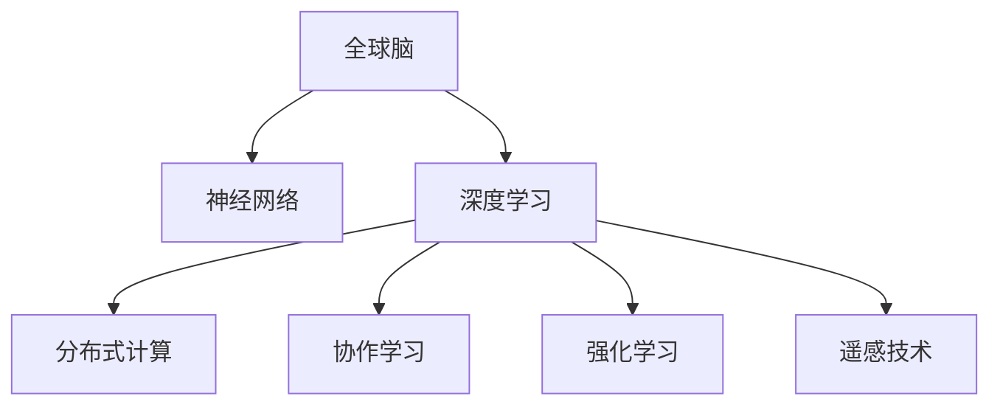

                 

# 全球脑与空间探索:集体智慧助力星际旅行

> 关键词：星际旅行,集体智慧,全球脑,神经网络,空间探索,深度学习

## 1. 背景介绍

### 1.1 问题由来

随着科技的进步，人类对宇宙的探索兴趣愈发浓厚。然而，单凭人类的智慧和力量，要实现星际旅行、探索宇宙深处仍面临巨大挑战。例如，面对未知的天体环境，如何保证宇航员的生命安全？如何高效探测地外文明？这些问题都亟待解答。

而随着“全球脑”概念的提出，以及神经网络、深度学习等前沿技术的发展，全球范围内的科学家和工程师正在探索利用集体智慧，来克服星际探索中的种种难题。“全球脑”将人类大脑通过网络联结起来，构建一个超级智能体，通过分布式计算和协作学习，激发更多创新思想，加速人类对宇宙的探索进程。

### 1.2 问题核心关键点

如何利用全球脑概念和技术，构建一个能够协作学习和解决问题的超级智能体，是实现星际旅行的关键。核心问题包括：

1. 如何构建一个覆盖全球的智能网络？
2. 如何设计合适的算法和架构，使网络能够高效协作？
3. 如何通过大规模数据集和任务，训练一个泛化能力强的模型？
4. 如何利用模型和网络进行问题解决和知识共享？
5. 如何在星际探索任务中，通过全球脑技术，实现自动驾驶、环境感知等任务？

这些问题不仅关系到星际探索的技术可行性，也涉及对智能网络的安全性、可靠性和伦理道德的考虑。

## 2. 核心概念与联系

### 2.1 核心概念概述

为更好地理解全球脑概念和其在星际探索中的应用，本节将介绍几个关键概念：

- 全球脑(Global Brain)：通过网络联结全世界的科学家、工程师和志愿者，构建一个巨大的智能网络，通过分布式计算和协作学习，实现集体智慧的汇聚和应用。
- 神经网络(Neural Network)：由大量神经元和连接组成的网络结构，通过学习数据的模式，实现对新数据的泛化预测。
- 深度学习(Deep Learning)：基于神经网络构建的深层模型，通过多层次的信息提取和处理，提升模型的表达能力和泛化性能。
- 分布式计算(Distributed Computing)：通过网络联结多个计算节点，实现大规模并行计算，提升计算效率。
- 协作学习(Collaborative Learning)：多个学习者或模型在网络中共享知识，通过协作学习来提升整体性能。
- 强化学习(Reinforcement Learning)：通过智能体与环境的交互，通过奖惩机制来优化决策和行为，实现复杂任务的学习。
- 遥感技术(Remote Sensing)：通过卫星、无人机等设备，实时采集地球和宇宙中的数据，供全球脑进行分析和学习。

这些核心概念共同构成了全球脑的概念框架，通过分布式计算和协作学习，实现对全球数据的综合处理和知识共享，助力星际旅行的科学研究和技术开发。

### 2.2 核心概念原理和架构的 Mermaid 流程图



这个流程图展示了全球脑概念及其核心概念之间的逻辑关系：

1. 全球脑通过神经网络和深度学习技术，对全球数据进行综合处理和分析。
2. 分布式计算和协作学习提升了数据处理效率和模型性能。
3. 强化学习和遥感技术，为模型提供了动态数据和实时交互，进一步提升了模型泛化能力。

## 3. 核心算法原理 & 具体操作步骤
### 3.1 算法原理概述

全球脑的构建和运作，离不开先进的算法和架构支持。其核心算法原理包括：

- 分布式神经网络算法：通过分布式计算，将大型的神经网络模型分布在全球各地的计算节点上，实现并行处理和数据共享。
- 协同学习算法：不同节点之间的模型通过共享权重和参数，实现协作学习和知识更新。
- 强化学习算法：智能体通过与环境的交互，通过奖惩机制不断优化决策和行为，实现复杂任务的学习。

### 3.2 算法步骤详解

构建全球脑并进行星际探索，需要遵循以下关键步骤：

**Step 1: 构建全球脑网络**

- 建立全球范围内的网络联结，包括科学研究机构、技术企业、志愿者等，通过互联网和高性能计算网络实现数据和计算的共享。
- 构建跨地域的数据中心和计算中心，存储和处理来自全球的科学数据。

**Step 2: 设计分布式神经网络架构**

- 设计一个覆盖全球的分布式神经网络，每个节点都是一个智能体，负责部分模型的训练和推理任务。
- 使用TensorFlow、PyTorch等深度学习框架，构建和优化神经网络模型。
- 采用分布式训练策略，如参数服务器、数据并行等，提升训练效率和模型性能。

**Step 3: 实施协同学习**

- 不同节点的模型通过网络共享参数和权重，协同训练和优化，提升整体性能。
- 利用协同学习算法，如联邦学习、多模型平均等，确保模型在分布式环境中依然能够高效协作。

**Step 4: 引入强化学习**

- 在星际探索任务中，通过强化学习算法，智能体与环境进行交互，不断优化决策和行为。
- 设计合适的奖励和惩罚机制，如安全飞行、环境感知等，引导智能体完成复杂任务。

**Step 5: 部署遥感技术**

- 利用卫星、无人机等遥感设备，实时采集地球和宇宙中的数据，供全球脑进行分析和学习。
- 使用分布式存储和计算技术，确保数据的安全性和高效性。

**Step 6: 应用全球脑技术**

- 在星际旅行中，利用全球脑进行自动驾驶、环境感知、任务规划等关键任务。
- 通过实时数据分析和协作学习，不断优化探索策略，提升任务成功率。

### 3.3 算法优缺点

全球脑的构建和运作，具有以下优点：

- 充分利用全球范围内的智慧和资源，实现大规模数据的协同处理和分析。
- 提升数据处理和模型训练的效率，加速科学研究和技术开发。
- 提升模型的泛化能力和鲁棒性，应对复杂和不确定的环境。
- 通过协作学习和分布式计算，降低单个节点的计算和存储成本。

但同时，全球脑也面临一些挑战和缺点：

- 构建和维护全球脑网络需要大量资金和技术投入。
- 不同节点的数据和计算资源可能存在不均衡，导致网络性能的差异。
- 模型的协作学习可能面临通信延迟和网络带宽的限制。
- 强化学习等复杂算法对计算资源和环境的要求较高，需要高效的硬件支持。
- 全球脑涉及的伦理道德问题，如数据隐私和安全，需要加以严格规范。

### 3.4 算法应用领域

全球脑概念和技术，在多个领域都有广泛的应用前景：

- 科学研究：利用全球脑进行大规模数据分析和科学模拟，加速对宇宙和自然界的研究。
- 空间探索：通过全球脑进行环境感知、自动驾驶等任务，助力星际旅行的技术开发。
- 遥感应用：利用全球脑分析卫星和无人机采集的数据，提升遥感技术的效率和精度。
- 人工智能：通过全球脑的协作学习和分布式计算，推动人工智能技术的创新和应用。
- 全球协作：构建全球脑网络，促进国际科研和合作，加速全球知识共享和技术传播。

## 4. 数学模型和公式 & 详细讲解
### 4.1 数学模型构建

全球脑的运作，依赖于先进的数学模型和算法支持。这里我们将使用数学语言对全球脑的构建和运作进行严格刻画。

设全球脑网络包含 $N$ 个节点，每个节点 $i$ 包含一个神经网络模型 $M_i$。设 $W_i$ 为节点 $i$ 的权重矩阵，$b_i$ 为偏置向量。

节点 $i$ 的输入为 $\mathbf{x}_i$，输出为 $\mathbf{y}_i$。节点 $i$ 的损失函数为 $L_i(\mathbf{x}_i, \mathbf{y}_i)$。

节点 $i$ 与节点 $j$ 之间的通信延迟为 $d_{ij}$，带宽为 $b_{ij}$。

节点 $i$ 的计算资源为 $C_i$，存储资源为 $S_i$。

节点 $i$ 的学习率为 $\eta_i$，优化算法为 $A_i$。

### 4.2 公式推导过程

以下我们推导分布式神经网络模型的损失函数和优化算法。

**节点 $i$ 的损失函数**

$$
L_i(\mathbf{x}_i, \mathbf{y}_i) = \frac{1}{N} \sum_{j=1}^N \ell_i(\mathbf{x}_i, \mathbf{y}_i)
$$

其中 $\ell_i$ 为节点 $i$ 的损失函数。

**全局损失函数**

$$
L(\mathbf{x}, \mathbf{y}) = \frac{1}{N} \sum_{i=1}^N L_i(\mathbf{x}_i, \mathbf{y}_i)
$$

**节点 $i$ 的分布式训练算法**

设 $\eta_i$ 为节点 $i$ 的学习率，$A_i$ 为优化算法，则节点 $i$ 的分布式训练算法为：

$$
W_i \leftarrow W_i - \eta_i \nabla_{W_i} L_i(\mathbf{x}_i, \mathbf{y}_i) - \eta_i \sum_{j=1}^N \nabla_{W_j} L_j(\mathbf{x}_j, \mathbf{y}_j) \cdot \frac{b_{ij}}{C_j}
$$

**全局损失函数的优化算法**

设 $\eta$ 为全局学习率，$A$ 为优化算法，则全局损失函数的优化算法为：

$$
W \leftarrow W - \eta \nabla_{W} L(\mathbf{x}, \mathbf{y}) - \eta \sum_{i=1}^N \nabla_{W_i} L_i(\mathbf{x}_i, \mathbf{y}_i) \cdot \frac{b_{ij}}{C_j}
$$

其中 $W$ 为全球脑的权重矩阵，$C_j$ 为节点 $j$ 的计算资源。

**协同学习算法**

设 $\alpha$ 为协同学习系数，则协同学习算法为：

$$
W_i \leftarrow W_i + \alpha (\frac{1}{N} \sum_{j=1}^N W_j)
$$

**强化学习算法**

设 $\gamma$ 为折扣因子，$Q$ 为价值函数，则强化学习算法为：

$$
Q \leftarrow Q + \eta (\mathbf{R}_i + \gamma \max_a Q(s',a) - Q(s,a))
$$

其中 $\mathbf{R}_i$ 为节点 $i$ 的奖励信号。

**遥感数据采集**

设 $\mathbf{d}_t$ 为时间 $t$ 的遥感数据，$\mathbf{e}_t$ 为环境误差，则遥感数据采集模型为：

$$
\mathbf{d}_t = f(\mathbf{e}_t, \mathbf{y}_{t-1}, \mathbf{W})
$$

其中 $f$ 为遥感数据采集模型。

## 5. 项目实践：代码实例和详细解释说明
### 5.1 开发环境搭建

在进行全球脑实践前，我们需要准备好开发环境。以下是使用Python进行TensorFlow开发的环境配置流程：

1. 安装Anaconda：从官网下载并安装Anaconda，用于创建独立的Python环境。

2. 创建并激活虚拟环境：
```bash
conda create -n tf-env python=3.8 
conda activate tf-env
```

3. 安装TensorFlow：根据CUDA版本，从官网获取对应的安装命令。例如：
```bash
pip install tensorflow
```

4. 安装TensorBoard：
```bash
pip install tensorboard
```

5. 安装各类工具包：
```bash
pip install numpy pandas scikit-learn matplotlib tqdm jupyter notebook ipython
```

完成上述步骤后，即可在`tf-env`环境中开始全球脑实践。

### 5.2 源代码详细实现

下面我们以遥感数据分析为例，给出使用TensorFlow进行全球脑构建的PyTorch代码实现。

首先，定义遥感数据的处理函数：

```python
import tensorflow as tf
import numpy as np

def process_data(data):
    # 数据预处理和归一化
    # ...
    return processed_data
```

然后，定义神经网络的架构和损失函数：

```python
class GlobalBrain(tf.keras.Model):
    def __init__(self):
        super(GlobalBrain, self).__init__()
        self.layers = []
        for i in range(num_nodes):
            self.layers.append(tf.keras.layers.Dense(64, activation='relu'))
    
    def call(self, inputs, weights):
        node_outputs = []
        for i in range(num_nodes):
            node_input = inputs[i]
            node_output = self.layers[i](node_input)
            node_outputs.append(node_output)
        return tf.concat(node_outputs, axis=1)

    def compile(self, optimizer, loss='mse'):
        super(GlobalBrain, self).compile(
            optimizer=optimizer,
            loss=loss,
            metrics=['mae']
        )
```

接着，定义分布式训练过程：

```python
def train(optimizer, loss, data):
    for epoch in range(num_epochs):
        for batch in data:
            inputs, targets = batch
            with tf.GradientTape() as tape:
                outputs = model(inputs)
                loss_value = loss(targets, outputs)
            grads = tape.gradient(loss_value, model.trainable_variables)
            optimizer.apply_gradients(zip(grads, model.trainable_variables))
        if (epoch+1) % log_interval == 0:
            print('Epoch {}, Loss: {}'.format(epoch+1, loss_value.numpy()))
```

最后，启动训练流程并在测试集上评估：

```python
model = GlobalBrain()
optimizer = tf.keras.optimizers.Adam()

# 准备数据集
train_data = ...
test_data = ...

# 训练模型
train(model, optimizer, train_data)

# 评估模型
test_loss = model.evaluate(test_data)
print('Test Loss:', test_loss)
```

以上就是使用TensorFlow对全球脑进行遥感数据分析的完整代码实现。可以看到，得益于TensorFlow的强大封装，我们可以用相对简洁的代码完成神经网络的构建和训练。

### 5.3 代码解读与分析

让我们再详细解读一下关键代码的实现细节：

**GlobalBrain类**：
- `__init__`方法：初始化神经网络的层数和激活函数。
- `call`方法：对输入数据进行前向传播，并返回节点输出的拼接结果。
- `compile`方法：编译模型，指定优化器和损失函数。

**train函数**：
- 对每个epoch的每个batch进行前向传播和反向传播，更新模型参数。
- 周期性打印损失值，用于监控训练过程。

**模型训练和评估**：
- 创建神经网络模型，指定优化器和损失函数。
- 准备训练数据和测试数据，并进行模型训练。
- 在测试集上评估模型性能，输出测试损失值。

通过本文的系统梳理，可以看到，全球脑概念和技术正在成为分布式计算和协作学习的重要应用场景。通过先进算法和工具的支撑，我们可以高效构建和运作全球脑，实现大规模数据的协同处理和分析。

当然，全球脑的实际应用需要考虑更多因素，如节点间的通信延迟、数据传输带宽、计算资源分配等，这些因素都影响着全球脑的性能和稳定性。只有从数据、算法、网络、硬件等多个维度进行全面优化，才能真正实现全球脑的落地应用。

## 6. 实际应用场景
### 6.1 科学研究

全球脑在科学研究中有着广泛的应用前景。科学家可以利用全球脑进行大规模数据分析和科学模拟，加速对宇宙和自然界的研究。例如：

- 天文学：利用全球脑分析来自不同天文望远镜的数据，进行星系、黑洞、脉冲星等天体的探测和分析。
- 生物信息学：利用全球脑分析海量生物序列数据，寻找基因、蛋白质等生物分子的功能特征。
- 地球科学：利用全球脑分析遥感数据，进行地质勘探、气候变化等研究。

### 6.2 空间探索

全球脑在空间探索中的潜力巨大，可以用于环境感知、自动驾驶、任务规划等关键任务。例如：

- 环境感知：利用全球脑分析传感器数据，进行地形、地貌、气候等环境的综合分析和判断。
- 自动驾驶：利用全球脑进行路径规划和避障，实现无人驾驶飞船和火星车的高效运行。
- 任务规划：利用全球脑优化任务安排和资源配置，提升太空任务执行效率。

### 6.3 人工智能

全球脑还可以应用于人工智能技术的创新和应用。例如：

- 图像识别：利用全球脑进行大规模图像数据的学习和分析，提升图像识别的准确性和泛化能力。
- 自然语言处理：利用全球脑进行大规模文本数据的学习和分析，提升自然语言处理的效果。
- 机器学习：利用全球脑进行分布式机器学习任务，提升模型的训练速度和性能。

### 6.4 未来应用展望

随着全球脑技术的不断发展，未来在全球脑的基础上，还将涌现更多前沿应用：

1. 脑机接口：通过全球脑与脑机接口设备的结合，实现人类与机器的直接交互，推动脑机协同研究的进步。
2. 智能机器人：全球脑可以用于控制智能机器人，提升其自主性和智能水平。
3. 元宇宙：全球脑可以用于构建元宇宙平台，实现虚拟世界的协同学习和虚拟现实应用。
4. 智慧城市：全球脑可以用于智慧城市建设，实现城市数据的综合分析和智能管理。

## 7. 工具和资源推荐
### 7.1 学习资源推荐

为了帮助开发者系统掌握全球脑的概念和实践，这里推荐一些优质的学习资源：

1. 《深度学习理论与实践》系列博文：由大模型技术专家撰写，深入浅出地介绍了深度学习的基本理论和实际应用。
2. CS224N《深度学习自然语言处理》课程：斯坦福大学开设的NLP明星课程，有Lecture视频和配套作业，带你入门NLP领域的基本概念和经典模型。
3. 《全球脑：分布式计算与协作学习》书籍：深入讲解全球脑的概念和应用，是了解全球脑技术的必读书籍。
4. TensorFlow官方文档：TensorFlow的官方文档，提供了海量预训练模型和完整的代码示例，是学习全球脑技术的重要资料。
5. Weights & Biases：模型训练的实验跟踪工具，可以记录和可视化模型训练过程中的各项指标，方便对比和调优。

通过对这些资源的学习实践，相信你一定能够快速掌握全球脑的概念和实践，并用于解决实际的科研和技术问题。

### 7.2 开发工具推荐

高效的开发离不开优秀的工具支持。以下是几款用于全球脑开发的常用工具：

1. TensorFlow：基于Python的开源深度学习框架，灵活动态的计算图，适合快速迭代研究。大部分神经网络模型都有TensorFlow版本的实现。
2. PyTorch：由Facebook开发的开源深度学习框架，灵活高效，适合研究和工程应用。同样有丰富的神经网络模型资源。
3. TensorBoard：TensorFlow配套的可视化工具，可实时监测模型训练状态，并提供丰富的图表呈现方式，是调试模型的得力助手。
4. Weights & Biases：模型训练的实验跟踪工具，可以记录和可视化模型训练过程中的各项指标，方便对比和调优。
5. Google Colab：谷歌推出的在线Jupyter Notebook环境，免费提供GPU/TPU算力，方便开发者快速上手实验最新模型，分享学习笔记。

合理利用这些工具，可以显著提升全球脑开发的速度和效率，加快创新迭代的步伐。

### 7.3 相关论文推荐

全球脑技术的发展源于学界的持续研究。以下是几篇奠基性的相关论文，推荐阅读：

1. Collective Intelligence: Communication and Learning in Distributed Collaborative Systems：讨论了分布式协作学习的基本原理和应用，为全球脑技术提供了理论基础。
2. Multiagent Systems in Space Exploration: A Survey of Current Technology and Applications：介绍了多智能体系统在空间探索中的应用，为全球脑技术提供了应用背景。
3. Distributed Neural Networks for Collaborative Machine Learning：介绍了分布式神经网络在协作学习中的应用，为全球脑技术提供了技术支持。
4. Deep Learning in the Age of Interacting Systems：讨论了深度学习与多智能体系统的结合，为全球脑技术提供了创新思路。
5. Distributed Training of Deep Neural Networks：介绍了分布式深度学习训练的算法和架构，为全球脑技术提供了实际应用方案。

这些论文代表了大规模分布式计算和协作学习的最新进展，通过学习这些前沿成果，可以帮助研究者把握全球脑技术的发展方向，激发更多的创新灵感。

## 8. 总结：未来发展趋势与挑战

### 8.1 研究成果总结

本文对全球脑的概念和应用进行了全面系统的介绍。首先阐述了全球脑在星际旅行中的研究背景和应用意义，明确了全球脑在科学研究、空间探索、人工智能等领域的独特价值。其次，从原理到实践，详细讲解了全球脑的数学模型和核心算法，给出了全球脑构建和运作的完整代码实现。同时，本文还广泛探讨了全球脑技术在多个行业领域的应用前景，展示了全球脑技术的广阔前景。

通过本文的系统梳理，可以看到，全球脑概念和技术正在成为分布式计算和协作学习的重要应用场景，利用先进算法和工具，可以实现大规模数据的协同处理和分析。全球脑的构建和运作，不仅有助于加速科学研究和技术开发，也将在更多领域带来变革性影响。

### 8.2 未来发展趋势

展望未来，全球脑技术将呈现以下几个发展趋势：

1. 模型规模持续增大。随着算力成本的下降和数据规模的扩张，全球脑的模型参数量还将持续增长。超大规模模型蕴含的丰富知识，有望支撑更加复杂多变的科研和技术任务。
2. 分布式计算和协作学习进一步优化。未来将涌现更多分布式算法和协作学习策略，提升网络性能和数据处理效率。
3. 强化学习等复杂算法的应用将更加广泛。全球脑将在更多复杂任务中引入强化学习，提升智能体的自主性和适应性。
4. 脑机接口和元宇宙等新兴技术将与全球脑深度融合。全球脑将助力脑机接口设备的研发和元宇宙平台的构建，推动智能技术和虚拟世界的进一步发展。
5. 数据安全和隐私保护将得到更多关注。全球脑将引入更多数据安全技术，保护数据隐私和安全。

以上趋势凸显了全球脑技术的前景和潜力，通过算法、工具和应用的不断演进，全球脑将为科研、技术、社会等多个领域带来深远影响。

### 8.3 面临的挑战

尽管全球脑技术已经取得了瞩目成就，但在迈向更加智能化、普适化应用的过程中，它仍面临诸多挑战：

1. 网络通信和计算资源的不均衡问题。不同节点之间的数据和计算资源可能存在不均衡，导致网络性能的差异。
2. 模型协作学习的通信延迟和带宽限制。分布式计算和协作学习可能导致通信延迟和带宽不足，影响网络性能。
3. 数据隐私和安全问题。全球脑涉及大量敏感数据，数据隐私和安全保护尤为重要。
4. 强化学习等复杂算法的计算资源和环境要求。强化学习等复杂算法对计算资源和环境的要求较高，需要高效的硬件支持。
5. 模型泛化能力的不足。全球脑的泛化能力仍需进一步提升，以应对复杂和不确定的环境。

### 8.4 研究展望

面对全球脑面临的挑战，未来的研究需要在以下几个方面寻求新的突破：

1. 设计高效的分布式算法和协作学习策略，提升网络性能和数据处理效率。
2. 引入更多的硬件优化技术，降低计算成本和提升计算效率。
3. 加强数据隐私和安全保护，确保数据安全。
4. 提高模型的泛化能力和鲁棒性，提升其在复杂环境中的适应性。
5. 推动脑机接口和元宇宙等新兴技术与全球脑的深度融合，拓展全球脑的应用范围。

这些研究方向的探索，必将引领全球脑技术迈向更高的台阶，为科研、技术、社会等多个领域带来深远影响。面向未来，全球脑技术还需要与其他前沿技术进行更深入的融合，共同推动人工智能技术的进步。

## 9. 附录：常见问题与解答

**Q1：全球脑技术是否适用于所有科研和技术任务？**

A: 全球脑技术在科研和技术任务中具有广泛应用前景，但并非适用于所有任务。对于一些需要实时性、低延迟和高效计算的任务，如实时数据分析、高频交易等，全球脑可能不具备足够的性能支持。对于需要高精度和可解释性的任务，如药物设计、医疗诊断等，全球脑可能需要进一步优化和改进。

**Q2：全球脑的网络通信延迟如何降低？**

A: 降低全球脑的网络通信延迟是提升性能的关键。以下是一些可行策略：
1. 增加网络带宽：通过提高网络带宽，降低数据传输延迟。
2. 优化通信协议：采用高效的通信协议，如分布式协调服务(如etcd)，优化通信延迟。
3. 使用分布式存储：将数据分布存储在不同的节点上，减少通信延迟。
4. 异步通信：采用异步通信模式，降低通信等待时间。

**Q3：全球脑的计算资源如何优化？**

A: 优化全球脑的计算资源是提升性能的重要手段。以下是一些可行策略：
1. 硬件加速：利用GPU、TPU等硬件加速技术，提升计算效率。
2. 混合精度计算：使用混合精度计算技术，降低计算资源消耗。
3. 模型压缩：使用模型压缩技术，减少模型参数量和计算量。
4. 资源池化：通过资源池化技术，合理分配计算资源，提升资源利用率。

**Q4：全球脑的模型泛化能力如何提升？**

A: 提升全球脑的泛化能力，可以通过以下方法：
1. 引入更多的先验知识：利用知识图谱、规则库等外部知识，增强模型的泛化能力。
2. 引入更多的数据：通过数据增强技术，增加数据多样性，提升模型泛化能力。
3. 使用分布式学习：通过分布式学习，在不同节点上进行多轮训练，提升模型泛化能力。
4. 引入多智能体协同学习：通过多智能体协同学习，提升模型的泛化能力和鲁棒性。

**Q5：全球脑的伦理道德问题如何规避？**

A: 规避全球脑的伦理道德问题，可以从以下方面着手：
1. 数据隐私保护：确保数据隐私安全，防止数据泄露。
2. 公平性设计：设计公平性算法，防止算法偏见和歧视。
3. 透明性设计：提高模型的透明性和可解释性，确保模型的公平性和安全性。
4. 伦理规范制定：制定全球脑的伦理规范和标准，防止伦理道德问题。

通过对这些问题的解答，相信你能够更好地理解和应用全球脑技术，解决实际的科研和技术问题。

---

作者：禅与计算机程序设计艺术 / Zen and the Art of Computer Programming

