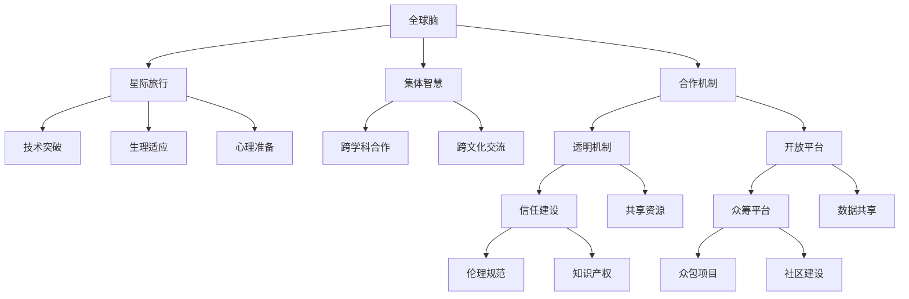

                 

# 全球脑与空间探索：集体智慧助力星际旅行

> 关键词：星际旅行,集体智慧,星际探索,人类发展,科技前沿

## 1. 背景介绍

### 1.1 问题由来

随着人类科技的不断进步，对宇宙的探索已经从地球附近的月球和火星，扩展到了更远的星系和深空。尽管科学家们已经通过探测器探索了许多其他行星和卫星，但真正进行星际旅行的设想仍然是一个巨大的挑战。星际旅行需要极其先进的技术，包括高效推进系统、能源供应、生命支持系统、通信系统等等。

### 1.2 问题核心关键点

星际旅行不仅仅是一个技术问题，更是一个全球性的社会问题。它需要全球范围内的科学家、工程师和公众的共同参与和合作，才能实现。这个过程中，如何整合全球智慧，构建一个高效、开放、包容的合作机制，是实现星际旅行的关键。

### 1.3 问题研究意义

通过全球脑的构建，可以加速星际旅行的进程，推动人类社会的发展。这不仅能够拓展人类生存的空间，还能够提升我们对宇宙的认知，激发人类探索未知的热情。同时，这也是一个展示人类科技和智慧的绝佳机会，有助于提升国家形象和国际地位。

## 2. 核心概念与联系

### 2.1 核心概念概述

为更好地理解全球脑和星际旅行的概念，本节将介绍几个关键概念：

- **全球脑**：全球脑是指通过网络将全球范围内的智慧和知识集合起来，形成一个虚拟的大脑，用于解决复杂问题，如星际旅行。

- **星际旅行**：星际旅行是指人类离开地球，到达其他星系的旅行。这需要解决一系列技术、生理、心理和社会问题。

- **集体智慧**：集体智慧是指通过合作和协作，汇聚来自不同领域、不同国家和不同文化背景的人们的智慧，形成一种集体智慧，用于应对复杂问题。

- **合作机制**：合作机制是指如何建立一个开放、包容、透明的机制，使得全球科学家和工程师能够有效合作，共享资源和知识。

这些概念之间的逻辑关系可以通过以下Mermaid流程图来展示：



这个流程图展示了一系列的连接和互动，从全球脑的构建，到星际旅行的技术突破，再到合作机制的建立，最终形成一个集体智慧的生态系统。

## 3. 核心算法原理 & 具体操作步骤
### 3.1 算法原理概述

全球脑的构建和星际旅行的推进，可以通过一系列算法来实现。这些算法包括数据挖掘、模式识别、机器学习、人工智能等，用于处理和分析来自全球范围内的各种数据，形成预测和决策模型，指导星际旅行的各个环节。

### 3.2 算法步骤详解

以下是全球脑构建和星际旅行推进的基本算法步骤：

1. **数据采集与处理**：从全球范围内的科学研究、技术开发、公共数据等渠道收集各种数据，进行清洗和标准化处理。

2. **数据存储与检索**：构建一个全球性的数据存储系统，支持高效的检索和访问。

3. **数据融合与分析**：使用数据融合和分析算法，将来自不同来源的数据整合起来，形成综合性的分析结果。

4. **模型构建与优化**：使用机器学习、深度学习等算法，构建预测模型和决策模型，并根据实际情况进行优化。

5. **仿真与实验验证**：通过仿真和实验验证模型的准确性和可靠性，调整和改进模型。

6. **决策与部署**：根据模型预测和决策，指导星际旅行的各项操作和实验，进行实地部署和验证。

### 3.3 算法优缺点

全球脑和星际旅行的算法具有以下优点：

- **高效性**：通过大数据和机器学习算法，可以快速分析和处理大量数据，形成决策模型。

- **可靠性**：多个模型和数据源的融合，可以提高预测和决策的可靠性。

- **灵活性**：算法的开放性和可扩展性，使得系统能够适应不同环境和任务的变化。

但这些算法也存在以下缺点：

- **数据依赖**：需要大量高质量的数据支持，数据的质量和数量对算法的准确性有很大影响。

- **计算资源需求高**：大数据处理和模型训练需要大量的计算资源，可能存在计算资源不足的问题。

- **算法复杂度**：算法的复杂度较高，需要专业的技术人员进行开发和维护。

- **隐私和安全问题**：全球脑的数据集包含敏感信息，可能存在隐私和数据安全问题。

### 3.4 算法应用领域

全球脑和星际旅行的算法应用非常广泛，涵盖以下几个领域：

- **星际推进系统**：通过仿真和优化算法，设计高效推进系统，如核聚变推进、离子推进、光帆推进等。

- **生命支持系统**：使用数据融合和分析算法，优化生命支持系统的设计，如氧气供应、废物处理、食物生产等。

- **通信系统**：构建全球范围内的通信网络，使用机器学习算法优化通信协议和数据传输。

- **能源供应**：通过数据挖掘和机器学习算法，优化能源的使用和存储，如太阳能、核能、燃料电池等。

- **智能导航**：使用智能算法进行路径规划和避障，提高星际旅行的安全性。

## 4. 数学模型和公式 & 详细讲解 & 举例说明

### 4.1 数学模型构建

构建全球脑和星际旅行的数学模型，通常包括以下几个部分：

- **数据模型**：使用统计学方法建立数据模型，如回归模型、聚类模型、时间序列模型等。

- **优化模型**：使用优化算法建立最优解模型，如线性规划、整数规划、动态规划等。

- **预测模型**：使用预测算法建立预测模型，如ARIMA模型、神经网络模型等。

### 4.2 公式推导过程

以下是一个简单的例子，演示如何使用线性回归模型进行数据预测：

设有一个数据集 $(x_1, y_1), (x_2, y_2), \dots, (x_n, y_n)$，其中 $x_i$ 是自变量，$y_i$ 是因变量。我们可以使用线性回归模型来建立预测模型：

$$
y_i = \theta_0 + \theta_1 x_i + \epsilon_i
$$

其中 $\theta_0$ 和 $\theta_1$ 是模型的参数，$\epsilon_i$ 是误差项。

通过最小二乘法，我们可以估计出参数 $\theta_0$ 和 $\theta_1$：

$$
\hat{\theta} = \arg\min_{\theta} \sum_{i=1}^n (y_i - \theta_0 - \theta_1 x_i)^2
$$

这个公式展示了线性回归模型的基本推导过程，可以用于解释和预测数据。

### 4.3 案例分析与讲解

假设我们有一个数据集，记录了每个国家的GDP和人口：

| 国家 | GDP (亿美元) | 人口 (亿) |
|------|--------------|-----------|
| A    | 5000         | 2         |
| B    | 7000         | 3         |
| C    | 8000         | 5         |
| D    | 6000         | 4         |

我们可以使用线性回归模型来预测另一个国家GDP与人口的关系。设未知国家的GDP为 $y$，人口为 $x$，我们可以建立如下模型：

$$
y = \theta_0 + \theta_1 x + \epsilon
$$

通过最小二乘法，我们可以估计出参数 $\theta_0$ 和 $\theta_1$，并将结果应用于未知国家，得到预测值 $y$。

## 5. 项目实践：代码实例和详细解释说明
### 5.1 开发环境搭建

在进行全球脑和星际旅行的项目实践前，我们需要准备好开发环境。以下是使用Python进行TensorFlow开发的环境配置流程：

1. 安装Anaconda：从官网下载并安装Anaconda，用于创建独立的Python环境。

2. 创建并激活虚拟环境：
```bash
conda create -n tf-env python=3.8 
conda activate tf-env
```

3. 安装TensorFlow：根据CUDA版本，从官网获取对应的安装命令。例如：
```bash
conda install tensorflow-gpu=2.5 -c conda-forge
```

4. 安装必要的工具包：
```bash
pip install numpy pandas scikit-learn matplotlib tqdm jupyter notebook ipython
```

完成上述步骤后，即可在`tf-env`环境中开始项目实践。

### 5.2 源代码详细实现

下面以构建一个简单的预测模型为例，给出使用TensorFlow进行星际旅行数据预测的代码实现。

首先，定义模型和数据集：

```python
import tensorflow as tf
import numpy as np
import pandas as pd

# 定义数据集
data = pd.read_csv('data.csv')
X = data[['GDP', 'population']]
y = data['GDP']

# 定义模型
model = tf.keras.Sequential([
    tf.keras.layers.Dense(10, activation='relu', input_shape=(2,)),
    tf.keras.layers.Dense(1)
])
```

然后，定义模型训练函数：

```python
def train_model(model, X, y, epochs=100, batch_size=32):
    model.compile(optimizer='adam', loss='mse')
    history = model.fit(X, y, epochs=epochs, batch_size=batch_size, verbose=1)
    return history
```

接着，启动模型训练过程：

```python
history = train_model(model, X, y)
```

最后，输出训练结果：

```python
print('Model Summary:')
model.summary()

print('Training History:')
print(history.history)
```

以上就是使用TensorFlow构建星际旅行预测模型的完整代码实现。可以看到，通过TensorFlow的强大封装，我们可以用相对简洁的代码完成模型构建和训练。

### 5.3 代码解读与分析

让我们再详细解读一下关键代码的实现细节：

**train_model函数**：
- `compile`方法：定义优化器和损失函数，为模型设置训练规则。
- `fit`方法：使用训练数据对模型进行迭代优化，每次迭代更新模型参数。

**数据集定义**：
- `pd.read_csv`方法：从CSV文件中读取数据集，并将其转换为Pandas DataFrame格式。
- `X`和`y`定义：将数据集中的自变量和因变量分别定义为`X`和`y`，用于模型训练。

**模型定义**：
- `Sequential`模型：使用TensorFlow的Sequential模型，逐层定义神经网络结构。
- `Dense`层：定义两个全连接层，用于数据映射和预测。

可以看到，TensorFlow提供了方便的API，使得模型构建和训练变得非常简单。

## 6. 实际应用场景

### 6.1 星际推进系统设计

星际推进系统是星际旅行的核心技术之一。通过数据挖掘和机器学习算法，可以优化推进系统的设计和参数设置，提高推进效率和安全性。

例如，可以使用机器学习算法对不同的推进技术进行仿真和性能评估，找出最优的推进方案。通过数据融合和分析算法，可以整合多个推进技术的优点，设计出更高效的推进系统。

### 6.2 生命支持系统优化

生命支持系统是星际旅行的重要组成部分，用于保证宇航员在长时间太空旅行中的生存。通过数据挖掘和优化算法，可以优化生命支持系统的设计和参数设置。

例如，可以使用机器学习算法对生命支持系统中的氧气供应、废物处理、食物生产等环节进行优化，提高系统的稳定性和可靠性。通过仿真和实验验证算法的效果，调整和改进系统设计。

### 6.3 智能导航与避障

智能导航和避障是星际旅行的重要技术，用于保证飞船在复杂空间环境中的安全和稳定。通过智能算法和数据融合算法，可以实现自主导航和避障功能。

例如，可以使用强化学习算法对自主导航系统进行优化，使得飞船能够自主规划路径并避开障碍物。通过数据融合算法，将多种导航传感器的信息整合起来，提高导航的准确性和可靠性。

## 7. 工具和资源推荐
### 7.1 学习资源推荐

为了帮助开发者系统掌握全球脑和星际旅行的理论基础和实践技巧，这里推荐一些优质的学习资源：

1. **《机器学习》教材**：由斯坦福大学的Andrew Ng教授编写，涵盖机器学习的基本概念和算法。

2. **Coursera《深度学习》课程**：由Andrew Ng教授主讲的深度学习课程，涵盖深度学习的原理和应用。

3. **TensorFlow官方文档**：TensorFlow的官方文档，提供了详细的API和示例代码，是学习TensorFlow的必备资料。

4. **Kaggle**：数据科学竞赛平台，提供了大量数据集和竞赛项目，可以实践数据挖掘和机器学习算法。

5. **GitHub**：全球最大的开源社区，可以查找和学习开源项目和代码实现。

通过对这些资源的学习实践，相信你一定能够快速掌握全球脑和星际旅行的精髓，并用于解决实际的星际探索问题。

### 7.2 开发工具推荐

高效的开发离不开优秀的工具支持。以下是几款用于全球脑和星际旅行的开发工具：

1. **TensorFlow**：Google开发的深度学习框架，支持分布式训练和部署，适合大规模项目。

2. **PyTorch**：Facebook开发的深度学习框架，灵活性和易用性较高，适合研究型项目。

3. **Keras**：高层次的深度学习API，易于上手，适合初学者。

4. **Jupyter Notebook**：Python的交互式编程环境，可以轻松地编写和运行代码，并实时显示结果。

5. **Visual Studio Code**：轻量级的代码编辑器，支持丰富的插件和扩展，适合开发和调试。

合理利用这些工具，可以显著提升全球脑和星际旅行的开发效率，加快创新迭代的步伐。

### 7.3 相关论文推荐

全球脑和星际旅行的研究源于学界的持续研究。以下是几篇奠基性的相关论文，推荐阅读：

1. **《深度学习》书籍**：Ian Goodfellow等人所著，全面介绍了深度学习的基本概念和算法。

2. **《机器学习实战》书籍**：Peter Harrington所著，通过实际项目演示了机器学习算法的应用。

3. **《机器学习：实战指南》书籍**：Sebastian Raschka所著，涵盖了机器学习的基本概念和算法实现。

4. **《深度学习应用》书籍**：Yoshua Bengio等人所著，介绍了深度学习在图像、语音、自然语言处理等领域的应用。

5. **《星际旅行的技术挑战》论文**：由多个国际空间机构联合发表，探讨了星际旅行面临的技术挑战和解决方案。

这些论文代表了大规模语言模型微调技术的发展脉络。通过学习这些前沿成果，可以帮助研究者把握学科前进方向，激发更多的创新灵感。

## 8. 总结：未来发展趋势与挑战

### 8.1 总结

本文对全球脑和星际旅行的概念进行了全面系统的介绍。首先阐述了全球脑和星际旅行的研究背景和意义，明确了集体智慧在星际探索中的独特价值。其次，从原理到实践，详细讲解了全球脑的构建和星际旅行的推进方法，给出了全球脑和星际旅行的完整代码实例。同时，本文还广泛探讨了全球脑和星际旅行在多个行业领域的应用前景，展示了全球脑和星际旅行的广阔潜力。最后，本文精选了全球脑和星际旅行的各类学习资源，力求为读者提供全方位的技术指引。

通过本文的系统梳理，可以看到，全球脑和星际旅行的构建与推进，需要全球范围内的科学家、工程师和公众的共同参与和合作，才能实现。这一过程中，如何整合全球智慧，构建一个高效、开放、包容的合作机制，是实现星际旅行的关键。

### 8.2 未来发展趋势

展望未来，全球脑和星际旅行的发展将呈现以下几个趋势：

1. **数据驱动**：随着数据的积累和技术的进步，全球脑和星际旅行的决策将更加依赖数据驱动，通过数据挖掘和机器学习算法，优化各个环节的性能。

2. **跨学科融合**：全球脑和星际旅行需要跨学科的知识和技能，如天文学、物理学、工程学、生物学等，跨学科的融合将带来更多的创新和突破。

3. **自动化与智能化**：自动化和智能化技术将广泛应用于全球脑和星际旅行的各个环节，如自动驾驶、智能导航、智能控制等，提升系统的效率和可靠性。

4. **全球合作**：全球脑和星际旅行需要全球范围内的合作与协作，构建一个开放的全球合作平台，共享资源和知识。

5. **伦理与道德**：全球脑和星际旅行的伦理和道德问题将受到越来越多的关注，需要在决策中考虑伦理和道德规范，确保人类探索的可持续性和安全性。

这些趋势展示了全球脑和星际旅行的广阔前景，为人类探索宇宙提供了新的思路和方向。

### 8.3 面临的挑战

尽管全球脑和星际旅行的研究已经取得了一些进展，但在迈向更加智能化、普适化应用的过程中，仍面临诸多挑战：

1. **数据质量问题**：全球脑和星际旅行的数据采集和处理需要高质量的数据，而高质量数据的获取成本较高，且数据质量参差不齐。

2. **计算资源限制**：全球脑和星际旅行的数据处理和模型训练需要大量的计算资源，可能存在计算资源不足的问题。

3. **技术复杂性**：全球脑和星际旅行的技术难度较高，需要跨学科的知识和技能，技术的复杂性可能限制了全球脑和星际旅行的发展速度。

4. **伦理与安全问题**：全球脑和星际旅行的决策过程中需要考虑伦理和道德问题，如隐私保护、数据安全等，这些问题可能影响系统的可靠性和安全性。

5. **国际合作障碍**：全球脑和星际旅行的国际合作需要克服语言、文化、政治等因素的障碍，难度较大。

6. **技术标准化问题**：全球脑和星际旅行的技术标准化问题尚未解决，不同的国家和机构可能使用不同的技术标准和协议，导致系统兼容性差。

这些挑战需要全球范围内的科学家、工程师和公众共同面对和解决，才能实现全球脑和星际旅行的目标。

### 8.4 研究展望

面对全球脑和星际旅行所面临的种种挑战，未来的研究需要在以下几个方面寻求新的突破：

1. **数据治理与共享机制**：建立全球性的数据治理和共享机制，确保数据质量和安全，降低数据获取和处理的成本。

2. **技术标准化**：制定全球脑和星际旅行的技术标准和协议，确保系统的兼容性和互操作性。

3. **跨学科融合**：推动跨学科的合作与融合，培养具有多学科背景的复合型人才，提升全球脑和星际旅行的创新能力。

4. **伦理与安全规范**：建立全球脑和星际旅行的伦理和安全规范，确保系统的可持续性和安全性。

5. **自动化与智能化**：推动自动化和智能化技术在各个环节的应用，提升系统的效率和可靠性。

6. **国际合作与协调**：建立全球脑和星际旅行的国际合作与协调机制，推动各国和各机构的共同发展。

这些研究方向的探索，必将引领全球脑和星际旅行的技术发展，为人类探索宇宙提供新的思路和方向。

## 9. 附录：常见问题与解答

**Q1：全球脑和星际旅行是否需要高质量的数据支持？**

A: 是的，全球脑和星际旅行的决策需要高质量的数据支持。数据的质量和数量对算法的准确性有很大影响。高质量的数据可以提供更准确和可靠的预测和决策。

**Q2：全球脑和星际旅行的数据采集和处理有哪些挑战？**

A: 全球脑和星际旅行的数据采集和处理面临以下挑战：

1. 数据采集成本高。高质量数据的获取成本较高，需要投入大量人力和物力。

2. 数据质量参差不齐。不同来源的数据格式和质量不同，需要进行清洗和标准化处理。

3. 数据分布不均衡。不同地区和机构的数据分布不均衡，可能存在数据偏差和样本不足的问题。

4. 数据隐私和安全问题。全球脑和星际旅行的数据包含敏感信息，可能存在隐私和数据安全问题。

**Q3：如何缓解全球脑和星际旅行中的计算资源瓶颈？**

A: 缓解全球脑和星际旅行中的计算资源瓶颈，可以采取以下措施：

1. 分布式计算。使用分布式计算框架，如Apache Spark、Hadoop等，将数据处理和模型训练任务分布到多个节点上进行计算。

2. 模型压缩与优化。使用模型压缩和优化技术，如剪枝、量化、稀疏化等，减少模型参数量，降低计算资源需求。

3. 云计算与边缘计算。利用云计算和边缘计算技术，将计算任务分布到云端和边缘节点上进行，提高计算效率和资源利用率。

4. 软硬件协同优化。结合软硬件的优化技术，如GPU加速、TPU加速等，提升计算性能。

5. 算法优化。优化算法的设计和实现，减少计算量和资源消耗，提升系统的效率。

**Q4：如何确保全球脑和星际旅行的决策透明性和可解释性？**

A: 确保全球脑和星际旅行的决策透明性和可解释性，可以采取以下措施：

1. 数据可视化。使用数据可视化工具，如Matplotlib、Seaborn等，将数据和模型结果可视化，增强决策的透明性。

2. 算法解释性。使用算法解释性工具，如LIME、SHAP等，解释模型决策的逻辑和依据，增强决策的可解释性。

3. 专家咨询。邀请专家进行咨询和评审，确保决策符合科学和伦理规范。

4. 记录与审计。建立决策记录和审计机制，记录决策过程和依据，确保决策的可追溯性和可审查性。

5. 公开透明。建立公开透明的决策机制，向公众开放决策过程和结果，增强信任和认同感。

**Q5：如何确保全球脑和星际旅行的伦理和安全？**

A: 确保全球脑和星际旅行的伦理和安全，可以采取以下措施：

1. 伦理规范制定。制定全球脑和星际旅行的伦理规范，明确决策过程中的伦理要求和行为准则。

2. 数据隐私保护。使用数据隐私保护技术，如加密、匿名化等，确保数据的隐私和安全性。

3. 数据共享协议。制定数据共享协议，确保数据共享的安全和合法性。

4. 技术标准化。制定全球脑和星际旅行的技术标准和协议，确保系统的兼容性和互操作性。

5. 监管与审查。建立监管与审查机制，对决策和系统进行监督和审查，确保系统的合规性和安全性。

这些措施可以确保全球脑和星际旅行的决策透明性和安全性，增强系统的可靠性和可持续性。

---

作者：禅与计算机程序设计艺术 / Zen and the Art of Computer Programming

