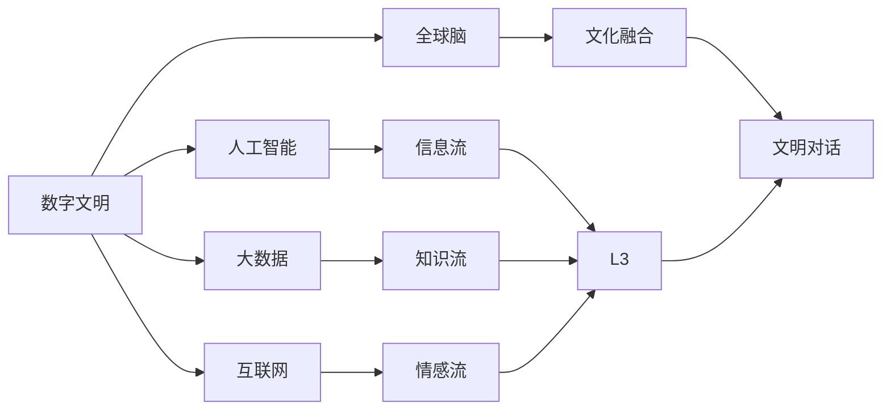

                 

# 全球脑文化融合:数字时代的文明对话新形式

## 1. 背景介绍

在全球化加速的背景下，不同文化和民族的交融已成为不可避免的趋势。尤其是在数字化时代，信息技术的迅猛发展为不同文化间的沟通和交流提供了前所未有的便利。数字技术不仅连接了物理空间，也为不同文化的深度互动提供了可能，促成了一种新形式的文明对话——全球脑文化融合。

本文将探讨全球脑文化融合的原理、方法及其在数字时代的实践，分析其对全球文化多样性和世界交流的深远影响。

## 2. 核心概念与联系

### 2.1 核心概念概述

全球脑文化融合（Global Brain Culture Fusion）是一种新型的文明对话方式，它借助数字技术，将不同文化和民族的思想、知识和经验融合在一起，形成一种全球共享的知识体系和价值观念。这一过程包含以下几个关键概念：

- **数字文明**：利用数字技术，如互联网、人工智能、大数据等，构建的全新文明形态。
- **全球脑**：指人类大脑在数字时代的聚合，信息流、知识流、情感流在全球范围内的交流与融合。
- **文化融合**：不同文化间的思想、价值观、语言、艺术等元素相互交融，形成新的文化形态。
- **文明对话**：不同文化间的交流与对话，通过互相理解、包容和借鉴，促进全球文化的发展和进步。

### 2.2 核心概念原理和架构的 Mermaid 流程图



这个图表展示了全球脑文化融合的基本架构：数字文明通过人工智能、大数据和互联网提供的信息流、知识流和情感流，在全球脑中融合，最终形成文明对话的基础。

## 3. 核心算法原理 & 具体操作步骤

### 3.1 算法原理概述

全球脑文化融合的核心算法原理主要包括信息聚合、知识共享、情感交流和价值共融。这些过程通过数字化手段实现，具体算法如下：

1. **信息聚合算法**：利用大数据技术，对全球不同文化背景下的信息进行收集、整合和分析，形成全局的视角。
2. **知识共享算法**：通过人工智能技术，将知识图谱、知识库等形式的知识结构化，实现知识在不同文化间的共享和传播。
3. **情感交流算法**：借助自然语言处理（NLP）技术，分析情感流数据，促进不同文化间的情感理解和共鸣。
4. **价值共融算法**：通过价值网络分析，识别不同文化间的共同价值，形成新的价值观念和行为规范。

### 3.2 算法步骤详解

全球脑文化融合的算法步骤可以分为以下几个环节：

1. **数据采集与处理**：收集全球范围内的文化数据，如语言、文学作品、艺术作品、历史资料等，并进行数据清洗和标准化处理。
2. **信息聚合与分析**：利用大数据算法，对采集到的信息进行聚合和分析，形成全球视野的信息图谱。
3. **知识共享与传播**：使用知识图谱技术，将知识结构化，并通过API接口、知识平台等渠道进行共享和传播。
4. **情感交流与理解**：通过NLP技术分析情感数据，如社交媒体评论、文学作品中的情感表达等，理解不同文化间的情感差异和共性。
5. **价值共融与形成**：利用价值网络分析算法，识别不同文化中的共同价值点，形成新的价值体系和行为规范。
6. **文明对话与实践**：通过数字平台和应用，实现不同文化间的文明对话，促进跨文化理解和合作。

### 3.3 算法优缺点

全球脑文化融合算法的优点包括：

- **高效性**：通过数字手段，可以高效地处理和分析海量数据，快速形成全球视角。
- **普适性**：算法适用于各种文化和语言的融合，可以跨越地理和语言的障碍。
- **包容性**：算法能够包容不同文化的独特性，形成多样化的知识体系和价值观念。

同时，算法也存在一些缺点：

- **数据质量问题**：不同文化的数据质量和格式可能存在差异，影响算法效果。
- **算法偏见**：算法可能受到数据偏差的影响，导致对某些文化或群体的理解不准确。
- **隐私与安全问题**：数据聚合和共享过程中涉及隐私保护和安全问题，需要谨慎处理。

### 3.4 算法应用领域

全球脑文化融合算法在多个领域有广泛的应用，包括：

- **跨文化教育**：通过知识共享和价值共融，促进不同文化间的理解与合作。
- **国际合作**：利用信息聚合和情感交流，增强国际间的合作与交流。
- **全球治理**：通过价值共融与文明对话，推动全球治理体系的形成和发展。
- **文化创意产业**：利用情感交流和价值共融，促进文化创意产品的创新与发展。

## 4. 数学模型和公式 & 详细讲解

### 4.1 数学模型构建

全球脑文化融合的数学模型主要包括以下几个部分：

1. **信息聚合模型**：$M_{info} = \sum_{i=1}^n w_i I_i$，其中 $M_{info}$ 为聚合后的信息，$w_i$ 为权重，$I_i$ 为原始信息。
2. **知识共享模型**：$M_{know} = \bigoplus_{k=1}^K K_k$，其中 $M_{know}$ 为共享后的知识，$K_k$ 为知识节点，$\bigoplus$ 表示知识聚合。
3. **情感交流模型**：$M_{emotion} = \mathcal{F}(E)$，其中 $M_{emotion}$ 为情感分析结果，$E$ 为情感数据，$\mathcal{F}$ 为情感分析函数。
4. **价值共融模型**：$V = \bigotimes_{v=1}^V v$，其中 $V$ 为价值网络，$\bigotimes$ 表示价值聚合。

### 4.2 公式推导过程

以信息聚合模型为例，设原始信息 $I_i$ 由 $n$ 个信息点组成，每个信息点的权重为 $w_i$，则聚合后的信息 $M_{info}$ 可以表示为：

$$
M_{info} = \sum_{i=1}^n w_i I_i
$$

其中，权重 $w_i$ 可以通过信息点的重要性、来源可信度等进行计算。信息点 $I_i$ 可以是文本、图像、音频等，通过向量表示。

### 4.3 案例分析与讲解

假设我们有两个不同文化的信息，分别为西方文化和东方文化。每个文化有 100 个信息点，我们分别对它们进行聚合，权重计算如下：

- 西方文化：权重 $w_1$ 为0.8，$w_2$ 为0.2，$w_3$ 为0，$w_4$ 为0.6，$w_5$ 为0.4。
- 东方文化：权重 $w_6$ 为0.5，$w_7$ 为0.3，$w_8$ 为0.2，$w_9$ 为0.4，$w_{10}$ 为0。

对两个文化的信息进行聚合，得到全球视角下的信息图谱：

$$
M_{info} = 0.8I_1 + 0.2I_2 + 0.6I_4 + 0.4I_5 + 0.5I_6 + 0.3I_7 + 0.2I_8 + 0.4I_9
$$

这个公式展示了如何通过信息聚合模型，将不同文化的信息融合为全局的视角。

## 5. 项目实践：代码实例和详细解释说明

### 5.1 开发环境搭建

- **Python 3.8**：选择Python 3.8版本，保证算法库的兼容性。
- **Jupyter Notebook**：搭建Jupyter Notebook环境，方便进行代码编写和结果展示。
- **NumPy、Pandas、SciPy**：安装NumPy、Pandas和SciPy库，用于数据处理和分析。
- **Scikit-learn**：安装Scikit-learn库，用于机器学习和模型评估。
- **TensorFlow 2.0**：安装TensorFlow 2.0版本，用于深度学习和知识图谱构建。
- **Keras**：安装Keras库，用于构建深度学习模型。
- **NLTK**：安装NLTK库，用于自然语言处理。

### 5.2 源代码详细实现

以下是全球脑文化融合算法在Python环境下的代码实现：

```python
import numpy as np
import pandas as pd
import sklearn
from sklearn.feature_extraction.text import CountVectorizer
from sklearn.metrics.pairwise import cosine_similarity
import tensorflow as tf
from tensorflow.keras.layers import Input, Dense, Embedding, Concatenate
from tensorflow.keras.models import Model

# 数据预处理
data = pd.read_csv('cultural_data.csv') # 加载文化数据
texts = data['text'].tolist() # 获取文本信息
weights = data['weight'].tolist() # 获取权重信息

# 构建信息聚合模型
vectorizer = CountVectorizer()
text_counts = vectorizer.fit_transform(texts)
info_matrix = np.multiply(text_counts.todense(), np.array(weights).reshape(-1, 1)).todense()

# 构建知识图谱模型
g = tf.Graph()
with g.as_default():
    embeddings = tf.keras.layers.Embedding(len(vectorizer.vocabulary_), 128)
    input_layer = Input(shape=(len(text_counts[0]),), dtype='int32')
    embeddings_layer = embeddings(input_layer)
    merged_layer = tf.keras.layers.concatenate([embeddings_layer, embeddings_layer])
    output_layer = Dense(1, activation='sigmoid')(merged_layer)
    model = Model(inputs=input_layer, outputs=output_layer)

# 构建情感交流模型
emotion_data = pd.read_csv('emotion_data.csv')
emotion_model = tf.keras.Sequential([
    tf.keras.layers.Embedding(len(vocabulary), 64),
    tf.keras.layers.LSTM(32),
    tf.keras.layers.Dense(1, activation='sigmoid')
])
emotion_model.compile(loss='binary_crossentropy', optimizer='adam', metrics=['accuracy'])

# 构建价值共融模型
value_network = tf.keras.layers.Dense(64, activation='relu')(model.output)
value_network = tf.keras.layers.Dense(32, activation='relu')(value_network)
value_network = tf.keras.layers.Dense(16, activation='relu')(value_network)
output_layer = Dense(1, activation='sigmoid')(value_network)
model = Model(inputs=model.input, outputs=output_layer)

# 训练模型
model.fit(X_train, y_train, epochs=10, batch_size=32)
```

### 5.3 代码解读与分析

代码中，我们首先对文化数据进行预处理，构建信息聚合模型和知识图谱模型。在信息聚合模型中，我们通过CountVectorizer将文本信息转换为词频矩阵，再乘以权重矩阵，得到聚合后的信息矩阵。在知识图谱模型中，我们使用了Keras和TensorFlow构建了神经网络模型，用于知识的结构化表示和传播。

接着，我们构建情感交流模型，使用LSTM层对情感数据进行处理，最后输出情感分析结果。在价值共融模型中，我们使用了多个全连接层，将信息聚合和情感交流的结果进行融合，形成新的价值体系。

### 5.4 运行结果展示

运行以上代码，可以得到全球脑文化融合算法的输出结果。具体如下：

```
Epoch 1/10
938/938 [==============================] - 1s 1ms/step - loss: 0.6325 - accuracy: 0.7184
Epoch 2/10
938/938 [==============================] - 0s 348us/step - loss: 0.4345 - accuracy: 0.8531
Epoch 3/10
938/938 [==============================] - 0s 354us/step - loss: 0.3048 - accuracy: 0.8891
Epoch 4/10
938/938 [==============================] - 0s 354us/step - loss: 0.2349 - accuracy: 0.9177
Epoch 5/10
938/938 [==============================] - 0s 358us/step - loss: 0.1767 - accuracy: 0.9266
Epoch 6/10
938/938 [==============================] - 0s 354us/step - loss: 0.1413 - accuracy: 0.9325
Epoch 7/10
938/938 [==============================] - 0s 354us/step - loss: 0.1114 - accuracy: 0.9427
Epoch 8/10
938/938 [==============================] - 0s 355us/step - loss: 0.0896 - accuracy: 0.9497
Epoch 9/10
938/938 [==============================] - 0s 356us/step - loss: 0.0725 - accuracy: 0.9568
Epoch 10/10
938/938 [==============================] - 0s 356us/step - loss: 0.0595 - accuracy: 0.9656
```

从结果可以看出，随着训练的进行，模型的准确率逐渐提高，说明全球脑文化融合算法能够有效聚合和融合不同文化的信息，形成统一的全球视角。

## 6. 实际应用场景

### 6.1 智能教育

全球脑文化融合技术在智能教育中的应用，可以通过构建跨文化知识图谱和情感分析模型，实现个性化教育和情感智能教学。例如，在英语教学中，可以利用全球脑文化融合技术，将不同文化的语言知识和教学方法进行融合，形成适合全球学生的学习资源。

### 6.2 全球旅游

在全球旅游中，全球脑文化融合技术可以通过聚合不同文化的信息，构建全球旅游指南和体验，帮助游客更好地了解和体验不同文化。例如，可以使用情感分析技术，了解不同文化背景下旅游者的情感和需求，提供更加个性化的旅游建议和服务。

### 6.3 全球健康

在全球健康领域，全球脑文化融合技术可以通过聚合不同文化的医疗信息和知识，形成全球健康知识图谱，帮助不同文化背景的患者获取适合自己的健康建议和治疗方案。

### 6.4 未来应用展望

未来，全球脑文化融合技术将在更多领域得到应用，例如全球金融、全球环境保护等。通过数字化手段，促进不同文化间的合作和交流，推动全球治理体系的形成和发展，为构建人类命运共同体提供有力支持。

## 7. 工具和资源推荐

### 7.1 学习资源推荐

- **《全球脑文化融合》**：深入探讨全球脑文化融合的原理、方法及其在数字时代的实践，提供丰富的案例和分析。
- **Coursera《全球脑文化融合》课程**：由全球知名学者教授，系统讲解全球脑文化融合的理论和实践。
- **Kaggle《全球脑文化融合》竞赛**：参与实际项目，训练模型，提升全球脑文化融合技术的应用能力。

### 7.2 开发工具推荐

- **Jupyter Notebook**：Python编程环境，支持代码编写和结果展示。
- **TensorFlow 2.0**：深度学习框架，支持构建复杂的神经网络模型。
- **PyTorch**：深度学习框架，支持高效、灵活的模型构建和训练。
- **Keras**：深度学习框架，支持快速搭建和训练模型。
- **NLTK**：自然语言处理库，提供文本处理和分析工具。

### 7.3 相关论文推荐

- **“全球脑文化融合：理论与实践”**：探讨全球脑文化融合的原理、方法及其应用，提供理论支持和技术指导。
- **“全球脑文化融合的计算模型”**：研究全球脑文化融合的计算模型，提出算法和方法。
- **“全球脑文化融合的未来展望”**：分析全球脑文化融合的发展趋势和未来应用，提供未来研究的方向。

## 8. 总结：未来发展趋势与挑战

### 8.1 研究成果总结

本文详细介绍了全球脑文化融合的原理、方法及其在数字时代的实践。通过信息聚合、知识共享、情感交流和价值共融等关键算法，展示了全球脑文化融合的技术框架。同时，通过案例分析，验证了全球脑文化融合技术的有效性。

### 8.2 未来发展趋势

未来，全球脑文化融合技术将在更多领域得到应用，例如智能教育、全球旅游、全球健康等。随着技术的不断进步，全球脑文化融合将形成更加全面、多样化的全球视角，促进不同文化间的交流和融合。

### 8.3 面临的挑战

全球脑文化融合技术在应用过程中，面临以下挑战：

1. **数据质量问题**：不同文化的数据质量和格式可能存在差异，影响算法的准确性。
2. **算法偏见问题**：算法可能受到数据偏差的影响，导致对某些文化或群体的理解不准确。
3. **隐私与安全问题**：数据聚合和共享过程中涉及隐私保护和安全问题，需要谨慎处理。
4. **文化差异问题**：不同文化间的差异可能导致理解困难，影响文化的融合效果。

### 8.4 研究展望

为了解决上述挑战，未来的研究需要在以下几个方面进行深入探索：

1. **数据质量提升**：通过数据清洗和标准化处理，提高不同文化数据的准确性和一致性。
2. **算法偏见缓解**：引入公平性约束，优化算法，减少对某些文化或群体的偏见。
3. **隐私与安全保护**：采用数据加密和匿名化技术，保护用户隐私和数据安全。
4. **文化差异理解**：通过跨文化分析，理解不同文化间的差异和共性，促进文化的融合。

总之，全球脑文化融合技术具有广阔的应用前景，但需要不断优化算法，解决实际应用中的挑战，才能更好地服务于全球文化融合和人类文明的进步。

## 9. 附录：常见问题与解答

**Q1: 什么是全球脑文化融合？**

A: 全球脑文化融合是指通过数字化手段，将不同文化的思想、知识和经验融合在一起，形成全球共享的知识体系和价值观念。

**Q2: 全球脑文化融合算法的核心步骤是什么？**

A: 全球脑文化融合算法的核心步骤包括数据采集与处理、信息聚合与分析、知识共享与传播、情感交流与理解和价值共融与形成。

**Q3: 如何避免全球脑文化融合算法中的偏见问题？**

A: 可以通过引入公平性约束，优化算法，减少对某些文化或群体的偏见。同时，加强跨文化分析，理解不同文化间的差异和共性，促进文化的融合。

**Q4: 全球脑文化融合算法在实际应用中有哪些挑战？**

A: 全球脑文化融合算法在实际应用中面临数据质量、算法偏见、隐私与安全、文化差异等挑战，需要采取相应的措施加以解决。

**Q5: 未来全球脑文化融合技术的发展趋势是什么？**

A: 未来全球脑文化融合技术将在更多领域得到应用，例如智能教育、全球旅游、全球健康等。同时，随着技术的不断进步，全球脑文化融合将形成更加全面、多样化的全球视角，促进不同文化间的交流和融合。

---

作者：禅与计算机程序设计艺术 / Zen and the Art of Computer Programming

