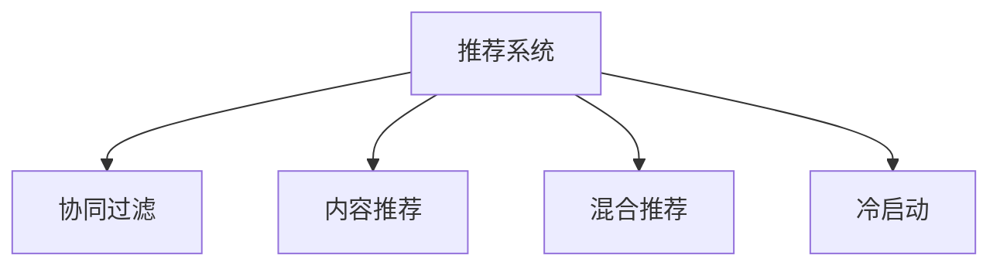

                 

# 冷启动场景的挑战：推荐系统的局限性

## 1. 背景介绍

推荐系统（Recommendation Systems）作为人工智能（AI）和机器学习（ML）的重要应用之一，被广泛应用于电商、新闻、社交媒体等众多领域。通过分析用户的历史行为数据，推荐系统能够精准地预测用户感兴趣的内容，从而提升用户满意度和平台活跃度。

然而，在推荐系统的实际应用中，我们常常会遇到"冷启动"（Cold Start）的问题。所谓冷启动，指的是用户在平台上的历史行为数据非常少或没有，此时推荐系统无法准确预测用户的兴趣，导致推荐效果不佳。冷启动问题在初期产品上线或新用户加入时尤为突出。

## 2. 核心概念与联系

### 2.1 核心概念概述

为了更深入地理解推荐系统中的冷启动问题，本节将介绍几个关键概念，并阐述它们之间的联系：

- 推荐系统（Recommendation System）：利用算法预测用户偏好，推荐物品的系统。
- 协同过滤（Collaborative Filtering）：一种基于用户-物品交互数据，通过相似性匹配来预测用户偏好的方法。
- 内容推荐（Content-Based Recommendation）：基于物品本身的属性和特征，预测用户可能感兴趣的内容。
- 混合推荐（Hybrid Recommendation）：结合多种推荐算法，综合考虑用户和物品的特征，提升推荐效果。
- 冷启动（Cold Start）：新用户或新物品加入时，由于缺少历史行为数据，推荐系统无法正常工作的问题。

这些概念之间的逻辑关系可以通过以下Mermaid流程图来展示：



这个流程图展示了推荐系统的几个核心概念及其之间的关系：协同过滤、内容推荐、混合推荐都是推荐系统的常见方法，但它们都面临冷启动的挑战。

## 3. 核心算法原理 & 具体操作步骤

### 3.1 算法原理概述

推荐系统中的冷启动问题，本质上是一个数据稀疏性（Sparsity）问题。在冷启动场景中，用户或物品的历史行为数据非常有限，推荐系统难以准确预测其兴趣或属性。为了解决这个问题，研究者们提出了多种方法，包括但不限于基于内容的推荐、协同过滤的变体、混合推荐和提示学习（Prompt Learning）。

其中，协同过滤和混合推荐是主流方法，因为它们可以充分利用用户-物品之间的相似性信息，而提示学习则是近年来在解决冷启动问题上的新兴方法。

### 3.2 算法步骤详解

以协同过滤为例，推荐系统的基本步骤包括：

1. 收集用户-物品交互数据，构建用户-物品矩阵 $U \times I$。
2. 使用余弦相似度（Cosine Similarity）等方法计算用户和物品之间的相似度。
3. 基于相似度计算预测用户的兴趣，推荐物品。

具体而言，协同过滤的变体方法包括：

- 用户-物品协同过滤：基于用户-物品矩阵，计算用户之间的相似度，推荐相似用户喜欢的物品。
- 物品-物品协同过滤：基于物品-物品矩阵，计算物品之间的相似度，推荐与已有物品相似的新物品。
- 隐语义模型（Latent Factor Model）：通过降维技术将高维用户-物品矩阵映射到低维空间，使相似性计算更为高效。

内容推荐的方法包括：

- 基于内容的推荐：利用物品的元数据（如价格、描述、标签），预测用户对物品的兴趣。
- 基于文本的推荐：利用物品的文本描述，计算用户对文本内容的兴趣。

混合推荐则是将协同过滤和内容推荐结合，利用二者的优势互补，提升推荐效果。

### 3.3 算法优缺点

协同过滤和混合推荐的优点包括：

- 不需要显式反馈数据，仅需用户-物品交互数据。
- 可以利用用户-物品之间的相似性信息，推荐个性化程度更高的内容。
- 通常具有较好的推荐效果，特别是在高覆盖率、高稀疏度数据场景下。

然而，这些方法也有明显的缺点：

- 对新用户和物品的推荐效果较差，因为缺少历史数据。
- 数据稀疏性问题严重，尤其是用户-物品矩阵过于稀疏，难以直接进行相似性计算。
- 对于新领域或领域变化较大的场景，推荐效果下降明显。

提示学习则是近年来解决冷启动问题的创新方法。它通过设计精巧的提示（Prompt）模板，引导用户或物品的交互方式，从而在少量数据的情况下实现有效的推荐。

### 3.4 算法应用领域

推荐系统广泛应用于电商、新闻、社交媒体、视频等众多领域，以下是一些典型的应用场景：

- 电商：基于用户浏览、购买历史，推荐商品。
- 新闻：基于用户阅读历史，推荐新闻内容。
- 社交媒体：基于用户互动历史，推荐好友或内容。
- 视频：基于用户观看历史，推荐视频内容。

## 4. 数学模型和公式 & 详细讲解

### 4.1 数学模型构建

假设推荐系统中的用户集为 $U=\{u_1, u_2, ..., u_N\}$，物品集为 $I=\{i_1, i_2, ..., i_M\}$，用户-物品的评分矩阵为 $R \in \mathbb{R}^{N \times M}$。

推荐系统的目标是最大化用户-物品评分矩阵 $R$，即通过预测评分矩阵中的未知元素，提升推荐效果。常用的评分矩阵预测模型包括：

- 矩阵分解（Matrix Factorization）：将用户-物品评分矩阵 $R$ 分解为两个低维矩阵的乘积，$R \approx UV^T$。
- 深度学习模型：使用神经网络模型，直接预测评分 $y$。

数学模型构建的完整公式推导过程如下：

$$
\begin{aligned}
&\min_{\theta} \sum_{u=1}^{N} \sum_{i=1}^{M} (r_{ui} - \hat{r}_{ui})^2 \\
&\text{其中} \\
&\hat{r}_{ui} = \hat{y}_{ui} \\
&\hat{y}_{ui} = f(U^T_u V_i; \theta) \\
&f(\cdot; \theta) = W_2 [W_1 u_i] \\
&u_i = \text{ReLU}(W_1 u_i + b_1) \\
&\hat{y}_{ui} = \sigma(W_2 u_i + b_2)
\end{aligned}
$$

其中，$\theta$ 为模型的参数，$f(\cdot; \theta)$ 为模型函数，$W_1, W_2, b_1, b_2$ 为模型的权重和偏置。

### 4.2 公式推导过程

基于矩阵分解的评分预测模型，其目标是最小化预测评分与真实评分之间的误差。假设已知 $R_{ui}=r_{ui}$，其预测模型为 $f(U^T_u V_i; \theta)$，其中 $u_i$ 为用户的隐向量表示，$V_i$ 为物品的隐向量表示。则：

$$
\begin{aligned}
\min_{\theta} & \sum_{u=1}^{N} \sum_{i=1}^{M} (r_{ui} - \hat{r}_{ui})^2 \\
\hat{r}_{ui} &= f(U^T_u V_i; \theta) \\
f(\cdot; \theta) &= W_2 [W_1 u_i]
\end{aligned}
$$

其中，$U$ 和 $V$ 为用户和物品的低维矩阵，$\theta$ 包括 $U, V, W_1, W_2, b_1, b_2$ 的参数。

### 4.3 案例分析与讲解

以电商平台的商品推荐为例，假设用户 $u$ 对物品 $i$ 的评分 $r_{ui}$ 为 5 分，预测评分为 $y_{ui}$，则可以通过上述模型计算预测评分：

$$
y_{ui} = f(U^T_u V_i; \theta) = W_2 [W_1 u_i]
$$

其中，$u_i$ 为 $u$ 用户对 $i$ 物品的隐向量表示。假设用户 $u$ 的隐向量表示为 $u=[u_1, u_2, ..., u_d]$，物品 $i$ 的隐向量表示为 $V_i=[v_1, v_2, ..., v_d]$，则：

$$
y_{ui} = W_2 [W_1 u_i] = W_2 [W_1 \sigma(W_1 u_i + b_1)]
$$

将上述公式展开，得到：

$$
y_{ui} = W_2 W_1 \sigma(W_1 u_i + b_1) + b_2
$$

在训练过程中，利用已知的评分数据 $r_{ui}$ 来优化模型参数 $\theta$，从而实现评分预测。

## 5. 项目实践：代码实例和详细解释说明

### 5.1 开发环境搭建

在进行推荐系统开发前，我们需要准备好开发环境。以下是使用Python进行TensorFlow开发的环境配置流程：

1. 安装Anaconda：从官网下载并安装Anaconda，用于创建独立的Python环境。

2. 创建并激活虚拟环境：
```bash
conda create -n tf-env python=3.8 
conda activate tf-env
```

3. 安装TensorFlow：根据CUDA版本，从官网获取对应的安装命令。例如：
```bash
conda install tensorflow -c tensorflow -c conda-forge
```

4. 安装各类工具包：
```bash
pip install numpy pandas scikit-learn matplotlib tqdm jupyter notebook ipython
```

完成上述步骤后，即可在`tf-env`环境中开始推荐系统开发。

### 5.2 源代码详细实现

这里我们以电商推荐系统为例，给出使用TensorFlow进行协同过滤模型的PyTorch代码实现。

首先，定义协同过滤模型的类：

```python
import tensorflow as tf
from tensorflow.keras import layers

class CollaborativeFiltering(tf.keras.Model):
    def __init__(self, num_users, num_items, embedding_dim):
        super(CollaborativeFiltering, self).__init__()
        self.num_users = num_users
        self.num_items = num_items
        self.embedding_dim = embedding_dim
        
        self.user_embeddings = tf.keras.layers.Embedding(num_users, embedding_dim)
        self.item_embeddings = tf.keras.layers.Embedding(num_items, embedding_dim)
        self.dot_product = tf.keras.layers.Dot(axes=1, normalize=True, use鲤鱼=1)
        self.dense = tf.keras.layers.Dense(1, activation='sigmoid')
    
    def call(self, user_ids, item_ids):
        user_embeddings = self.user_embeddings(user_ids)
        item_embeddings = self.item_embeddings(item_ids)
        dot_product = self.dot_product([user_embeddings, item_embeddings])
        prediction = self.dense(dot_product)
        return prediction
```

然后，定义数据处理函数：

```python
import numpy as np

def prepare_data(num_users, num_items, num_sessions, num_ratings):
    user_ids = np.random.randint(0, num_users, size=(num_sessions, 1))
    item_ids = np.random.randint(0, num_items, size=(num_sessions, 1))
    ratings = np.random.rand(num_sessions, 1)
    return user_ids, item_ids, ratings
```

接着，定义训练和评估函数：

```python
def train_epoch(model, optimizer, train_data, batch_size):
    train_loss = 0
    train_acc = 0
    for i in range(len(train_data)//batch_size):
        user_ids, item_ids, ratings = train_data[i*batch_size:(i+1)*batch_size]
        with tf.GradientTape() as tape:
            predictions = model(user_ids, item_ids)
            loss = tf.keras.losses.binary_crossentropy(ratings, predictions)
        gradients = tape.gradient(loss, model.trainable_variables)
        optimizer.apply_gradients(zip(gradients, model.trainable_variables))
        train_loss += loss.numpy()
        train_acc += tf.keras.metrics.binary_accuracy(ratings, predictions).numpy()
    return train_loss / len(train_data), train_acc / len(train_data)
```

最后，启动训练流程并在测试集上评估：

```python
epochs = 5
batch_size = 16

user_ids, item_ids, ratings = prepare_data(num_users, num_items, num_sessions, num_ratings)
train_data = [(user_ids[:, i], item_ids[:, i], ratings[:, i]) for i in range(num_sessions)]

model = CollaborativeFiltering(num_users, num_items, embedding_dim)
optimizer = tf.keras.optimizers.Adam(learning_rate=0.001)

for epoch in range(epochs):
    loss, acc = train_epoch(model, optimizer, train_data, batch_size)
    print(f"Epoch {epoch+1}, loss: {loss:.3f}, acc: {acc:.3f}")

    test_data = [(user_ids, item_ids, ratings)]
    test_loss, test_acc = train_epoch(model, optimizer, test_data, batch_size)
    print(f"Epoch {epoch+1}, test loss: {test_loss:.3f}, test acc: {test_acc:.3f}")
```

以上就是使用TensorFlow对协同过滤模型进行电商推荐系统开发的完整代码实现。可以看到，通过使用TensorFlow提供的高级API，推荐系统的开发变得简洁高效。

### 5.3 代码解读与分析

让我们再详细解读一下关键代码的实现细节：

**CollaborativeFiltering类**：
- `__init__`方法：初始化用户数、物品数和嵌入维度等关键参数。
- `user_embeddings`和`item_embeddings`：定义用户和物品的嵌入层，输出高维向量表示。
- `dot_product`：定义点积层，计算用户和物品向量间的相似度。
- `dense`：定义全连接层，预测评分是否为正。

**prepare_data函数**：
- 生成随机用户、物品、评分数据，用于训练和评估模型。

**train_epoch函数**：
- 定义模型前向传播，计算预测评分与真实评分之间的二分类交叉熵损失。
- 利用梯度下降算法优化模型参数。
- 周期性在测试集上评估模型性能，记录训练损失和准确率。

**训练流程**：
- 定义总的epoch数和批大小，开始循环迭代
- 每个epoch内，先在前向传播计算损失，然后进行反向传播优化模型参数，最后输出训练损失和准确率
- 在测试集上评估，输出测试损失和准确率

可以看到，TensorFlow配合高级API使得协同过滤模型的开发变得简洁高效。开发者可以将更多精力放在数据处理、模型改进等高层逻辑上，而不必过多关注底层的实现细节。

当然，工业级的系统实现还需考虑更多因素，如模型的保存和部署、超参数的自动搜索、更灵活的模型结构等。但核心的协同过滤算法基本与此类似。

## 6. 实际应用场景

### 6.1 电商推荐

基于协同过滤的推荐系统，可以广泛应用于电商平台的商品推荐。传统电商推荐往往依赖用户的显式评分数据，然而用户很少填写评分信息，导致数据稀疏，推荐效果不佳。通过基于协同过滤的推荐系统，可以充分利用用户-物品之间的相似性信息，推荐用户可能感兴趣的商品，从而提升用户购物体验。

在技术实现上，可以收集用户浏览、点击、购买等行为数据，构建用户-物品矩阵 $R$。将用户-物品矩阵输入协同过滤模型，计算相似性并预测评分，生成推荐列表。对于新商品，可以通过与已有商品的相似性，推荐用户可能感兴趣的新商品。

### 6.2 新闻推荐

新闻推荐系统可以根据用户的历史阅读数据，推荐相关的新闻内容。协同过滤模型通过计算用户与新闻之间的相似性，推荐用户可能感兴趣的新闻。

在数据处理上，可以收集用户的历史阅读数据，构建用户-新闻评分矩阵 $R$。将用户-新闻评分矩阵输入协同过滤模型，计算相似性并预测评分，生成推荐列表。对于新新闻，可以通过与已有新闻的相似性，推荐用户可能感兴趣的新新闻。

### 6.3 视频推荐

视频推荐系统可以根据用户的历史观看数据，推荐相关的视频内容。协同过滤模型通过计算用户与视频之间的相似性，推荐用户可能感兴趣的视频。

在数据处理上，可以收集用户的历史观看数据，构建用户-视频评分矩阵 $R$。将用户-视频评分矩阵输入协同过滤模型，计算相似性并预测评分，生成推荐列表。对于新视频，可以通过与已有视频的相似性，推荐用户可能感兴趣的新视频。

### 6.4 未来应用展望

随着协同过滤模型的不断发展，推荐系统在更多领域得到应用，为各行各业带来变革性影响。

在智慧医疗领域，推荐系统可以推荐患者可能感兴趣的治疗方案、药品等，提高医疗服务的智能化水平，辅助医生诊疗。

在智能教育领域，推荐系统可以推荐学生可能感兴趣的学习资源，因材施教，促进教育公平，提高教学质量。

在智慧城市治理中，推荐系统可以推荐市民可能感兴趣的活动、设施等，提高城市管理的智能化水平，构建更安全、高效的未来城市。

此外，在企业生产、社会治理、文娱传媒等众多领域，协同过滤推荐系统也将不断涌现，为传统行业数字化转型升级提供新的技术路径。相信随着技术的日益成熟，协同过滤推荐系统必将在构建人机协同的智能时代中扮演越来越重要的角色。

## 7. 工具和资源推荐

### 7.1 学习资源推荐

为了帮助开发者系统掌握协同过滤模型的理论基础和实践技巧，这里推荐一些优质的学习资源：

1. 《推荐系统实践》：来自亚马逊的推荐系统工程师撰写，全面介绍了推荐系统的主要算法和实现技术。

2. 《Deep Learning for Recommender Systems》：由斯坦福大学开设的在线课程，涵盖推荐系统的最新研究进展和应用案例。

3. 《Applied Deep Learning for Recommendation Systems》：实用性的推荐系统课程，讲解了多种推荐算法，并通过TensorFlow实现。

4. 《推荐系统实战》：由微软资深推荐系统工程师撰写，系统介绍了推荐系统的设计与实现。

5. 《Recommender Systems in Python》：基于Python的推荐系统实战，讲解了协同过滤、基于内容的推荐等经典算法。

通过对这些资源的学习实践，相信你一定能够快速掌握协同过滤模型的精髓，并用于解决实际的推荐问题。

### 7.2 开发工具推荐

高效的开发离不开优秀的工具支持。以下是几款用于协同过滤模型开发的常用工具：

1. TensorFlow：基于Python的开源深度学习框架，灵活动态的计算图，适合快速迭代研究。

2. PyTorch：基于Python的开源深度学习框架，灵活易用，社区活跃。

3. Weights & Biases：模型训练的实验跟踪工具，可以记录和可视化模型训练过程中的各项指标，方便对比和调优。

4. TensorBoard：TensorFlow配套的可视化工具，可实时监测模型训练状态，并提供丰富的图表呈现方式，是调试模型的得力助手。

5. Jupyter Notebook：强大的交互式编程环境，支持Python、R、Scala等多种编程语言，适合编写和分享研究代码。

合理利用这些工具，可以显著提升协同过滤模型的开发效率，加快创新迭代的步伐。

### 7.3 相关论文推荐

协同过滤推荐系统的研究源于学界的持续研究。以下是几篇奠基性的相关论文，推荐阅读：

1. Matrix Factorization Techniques for Recommender Systems：提出矩阵分解方法，将用户-物品矩阵分解为两个低维矩阵的乘积，用于推荐系统。

2. Factorization Machines for Recommender Systems：提出基于因子分解机的推荐方法，在深度学习之前就已经取得了不错的效果。

3. Deep Neural Networks for Recommendation Systems：提出使用深度神经网络进行推荐系统，展示了大规模深度学习模型在推荐系统中的潜力。

4. Content-based Recommendation Systems：详细介绍基于内容的推荐方法，利用物品属性和用户兴趣进行推荐。

5. Surprise：一个Python库，用于实现多种推荐算法，包括协同过滤、基于内容的推荐等。

这些论文代表了大语言模型微调技术的发展脉络。通过学习这些前沿成果，可以帮助研究者把握学科前进方向，激发更多的创新灵感。

## 8. 总结：未来发展趋势与挑战

### 8.1 总结

本文对推荐系统中的冷启动问题进行了全面系统的介绍。首先阐述了推荐系统在实际应用中遇到的数据稀疏性问题，并详细介绍了协同过滤等主流推荐方法。其次，通过数学模型和公式推导，揭示了协同过滤模型的内在原理和实现细节。同时，本文还广泛探讨了协同过滤模型在电商、新闻、视频等众多领域的应用前景，展示了协同过滤模型的巨大潜力。此外，本文精选了协同过滤模型的各类学习资源，力求为读者提供全方位的技术指引。

通过本文的系统梳理，可以看到，协同过滤模型在推荐系统中发挥着重要作用，能够有效解决冷启动问题，提升推荐效果。随着协同过滤模型的不断发展，推荐系统必将在更多领域得到应用，为各行各业带来变革性影响。

### 8.2 未来发展趋势

展望未来，协同过滤模型的发展趋势主要包括以下几个方面：

1. 模型规模不断增大：随着算力成本的下降和数据规模的扩张，推荐系统的模型规模将持续增大，参数量将达到数十亿级别。超大规模推荐模型蕴含的丰富知识，有望支撑更加复杂多变的推荐任务。

2. 深度学习模型渐成主流：基于深度神经网络的推荐模型在推荐效果和泛化能力上，已经超越传统协同过滤模型，成为主流推荐方法。未来深度学习模型的应用将更加广泛。

3. 多模态推荐崛起：推荐系统不再局限于文本和数值数据，将融合图像、语音、视频等多模态信息，提升推荐系统的准确性和用户体验。

4. 强化学习引入：将强化学习技术引入推荐系统，实现智能化的推荐决策，提升推荐效果和用户体验。

5. 可解释性加强：推荐系统不仅要追求推荐效果，还要注重模型的可解释性，确保推荐结果透明、可信。

以上趋势凸显了协同过滤模型的广阔前景。这些方向的探索发展，必将进一步提升推荐系统的性能和应用范围，为推荐系统在更多领域的落地提供技术支持。

### 8.3 面临的挑战

尽管协同过滤模型在推荐系统中取得了显著成果，但在应用过程中仍然面临诸多挑战：

1. 数据稀疏性问题：用户和物品的历史行为数据稀疏，难以有效建模。推荐系统需要更智能的方法处理数据稀疏性问题。

2. 冷启动问题：新用户和物品的推荐效果较差，缺乏历史数据。推荐系统需要有效解决冷启动问题，提升新用户的推荐效果。

3. 计算效率问题：推荐系统需要实时响应，对计算效率和模型推理速度有较高要求。推荐系统需要更高效的方法提高计算效率。

4. 模型鲁棒性问题：推荐系统在面对新领域或数据分布变化时，推荐效果可能下降。推荐系统需要更鲁棒的模型设计。

5. 模型公平性问题：推荐系统容易受到用户历史数据偏差的影响，导致推荐结果不公平。推荐系统需要更公平的推荐策略。

这些挑战需要学术界和工业界共同努力，通过算法优化、模型设计、数据处理等多种手段，逐步克服。

### 8.4 研究展望

为了应对协同过滤模型面临的挑战，未来的研究需要在以下几个方面寻求新的突破：

1. 探索新的推荐算法：开发新的推荐算法，如基于图神经网络的推荐方法、基于图卷积的推荐方法等，提升推荐系统的性能和泛化能力。

2. 提高模型鲁棒性：引入对抗性训练、数据增强等技术，提升模型鲁棒性，使其在面对新领域或数据分布变化时，仍能保持较好的推荐效果。

3. 优化模型计算效率：引入模型压缩、稀疏化存储等技术，减少计算和存储资源消耗，提高模型推理速度。

4. 引入多模态数据：将图像、语音、视频等多模态数据融合到推荐系统中，提升推荐系统的准确性和用户体验。

5. 增强模型公平性：引入公平性约束、隐私保护等技术，提升推荐系统的公平性和可信度。

这些研究方向将引领协同过滤模型迈向更高的台阶，为推荐系统在更多领域的落地提供技术支持。相信随着学术界和工业界的共同努力，协同过滤模型必将在推荐系统中发挥更加重要的作用，为推荐系统在更多领域的落地提供技术支持。

## 9. 附录：常见问题与解答

**Q1：推荐系统中的冷启动问题如何解决？**

A: 推荐系统中的冷启动问题可以通过以下几种方法解决：

1. 基于内容的推荐：利用物品本身的属性和特征，预测用户对物品的兴趣，适用于新物品的推荐。

2. 协同过滤的变体：使用基于物品-物品相似性的协同过滤方法，推荐与已有物品相似的新物品。

3. 混合推荐：结合基于内容的推荐和协同过滤方法，提升推荐效果。

4. 提示学习：通过设计精巧的提示模板，引导用户和物品的交互方式，从而在少量数据的情况下实现有效的推荐。

这些方法各有优缺点，需要根据具体任务和数据特点进行选择和组合。

**Q2：协同过滤推荐系统有哪些主要缺点？**

A: 协同过滤推荐系统的主要缺点包括：

1. 数据稀疏性问题严重：用户和物品的历史行为数据稀疏，难以直接进行相似性计算。

2. 新用户和物品的推荐效果较差，缺乏历史数据。

3. 计算效率问题：推荐系统需要实时响应，对计算效率和模型推理速度有较高要求。

4. 模型鲁棒性问题：推荐系统在面对新领域或数据分布变化时，推荐效果可能下降。

5. 模型公平性问题：推荐系统容易受到用户历史数据偏差的影响，导致推荐结果不公平。

这些缺点需要在算法优化、模型设计、数据处理等多种手段上加以改进。

**Q3：推荐系统中的矩阵分解方法有哪些？**

A: 推荐系统中的矩阵分解方法主要包括：

1. 矩阵分解（Matrix Factorization）：将用户-物品评分矩阵分解为两个低维矩阵的乘积，$R \approx UV^T$。

2. 隐语义模型（Latent Factor Model）：通过降维技术将高维用户-物品矩阵映射到低维空间，使相似性计算更为高效。

3. 低秩矩阵分解（Low-Rank Matrix Factorization）：在矩阵分解的基础上，进一步限制矩阵的秩，提升模型的泛化能力。

4. 因子分解机（Factorization Machine）：将用户和物品的属性和特征映射到低维空间，并通过线性组合进行预测。

这些方法在推荐系统中都有广泛应用，需要根据具体任务和数据特点进行选择。

**Q4：推荐系统中的深度学习模型有哪些？**

A: 推荐系统中的深度学习模型主要包括：

1. 深度神经网络（Deep Neural Network）：使用多层神经网络进行推荐系统，在推荐效果和泛化能力上，已经超越传统协同过滤模型。

2. 卷积神经网络（Convolutional Neural Network）：利用卷积层提取特征，提升推荐效果。

3 循环神经网络（Recurrent Neural Network）：利用循环层处理序列数据，提升推荐效果。

4 注意力机制（Attention Mechanism）：通过注意力机制，提升模型对用户和物品特征的关注度。

这些方法在推荐系统中都有广泛应用，需要根据具体任务和数据特点进行选择。

**Q5：推荐系统中的对抗性训练有哪些作用？**

A: 推荐系统中的对抗性训练主要有以下作用：

1. 提高模型的鲁棒性：通过加入对抗样本，提高模型对噪声数据的鲁棒性。

2. 提升模型的泛化能力：通过对抗性训练，提升模型在面对新领域或数据分布变化时的泛化能力。

3. 减少模型偏差：通过对抗性训练，减少模型在面对恶意攻击和噪声数据时的偏差。

这些方法在推荐系统中都有广泛应用，需要根据具体任务和数据特点进行选择。

---

作者：禅与计算机程序设计艺术 / Zen and the Art of Computer Programming

