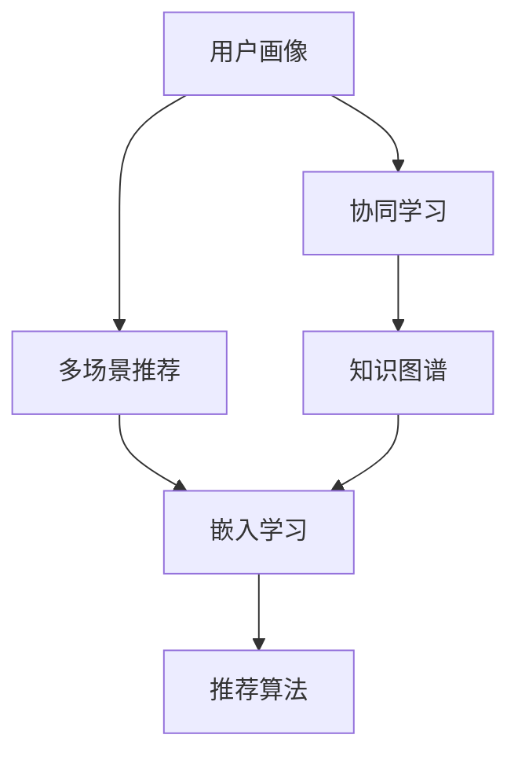

                 

# 利用LLM优化推荐系统的多场景协同学习

> 关键词：大语言模型,协同学习,推荐系统,自然语言处理(NLP),多场景,知识图谱,嵌入学习,推荐算法

## 1. 背景介绍

在数字时代，推荐系统已成为互联网产品不可或缺的重要组成部分，为用户定制个性化内容、提高用户满意度、驱动商业价值增长发挥着关键作用。然而，传统的推荐系统往往基于用户历史行为数据进行模型训练，难以充分捕捉用户深层次的兴趣和偏好。伴随人工智能技术的兴起，利用大语言模型(LLM)进行推荐系统的优化，成为当前研究的热点。

近年来，大语言模型在自然语言处理(NLP)领域取得了突破性进展，其强大的语言理解和生成能力，使其在推荐系统中的应用潜力巨大。LLM能够捕捉文本语义信息，通过语言与推荐任务间的协同学习，显著提升推荐效果。具体而言，LLM在用户画像、多场景协同、自然语言推荐、知识图谱嵌入等方面，都能发挥其独特的优势。

本文聚焦于利用大语言模型优化推荐系统的方法，通过协同学习和知识图谱嵌入等技术，构建跨多场景的推荐系统。首先，介绍大语言模型在推荐系统中的协同学习过程；其次，详细讲解多场景协同推荐的数学模型和具体实现；接着，展示基于知识图谱嵌入的推荐方法；最后，总结LLM在推荐系统中的应用趋势和面临的挑战，提出未来研究展望。

## 2. 核心概念与联系

### 2.1 核心概念概述

在推荐系统中，LLM的协同学习可以分为两个层面：一是在用户画像层面进行协同，通过LLM捕捉用户真实兴趣；二是在多场景推荐层面进行协同，通过LLM捕捉用户在不同场景下的行为模式。此外，LLM还可以与知识图谱、嵌入学习等技术结合，进一步优化推荐效果。

以下是涉及的核心概念及其联系的Mermaid流程图：



该流程图展示了LLM在推荐系统中的应用脉络：

1. 用户画像：通过LLM捕捉用户兴趣和行为模式。
2. 协同学习：利用LLM的跨领域能力，在不同用户间或不同场景间进行协同。
3. 知识图谱：通过LLM学习知识图谱，提升推荐模型对领域知识的理解。
4. 嵌入学习：利用LLM进行词嵌入学习，提升推荐算法的表达能力。
5. 推荐算法：集成LLM和传统推荐算法，构建跨多场景的推荐系统。

### 2.2 核心概念原理和架构

- **大语言模型(LLM)**：基于深度学习的大型预训练模型，能够理解自然语言，生成流畅的文本，捕捉语义信息。
- **协同学习(Co-learning)**：多个模型共同训练，通过共享知识和参数，提升整体性能。
- **推荐算法(Recommendation Algorithm)**：用于生成推荐结果的算法，如基于内容的推荐、协同过滤、混合推荐等。
- **知识图谱(Knowledge Graph)**：由实体、关系和属性构成的图结构，用于表示领域知识。
- **嵌入学习(Embedding Learning)**：将文本、实体等数据编码为向量，用于机器学习和推荐系统。

## 3. 核心算法原理 & 具体操作步骤

### 3.1 算法原理概述

基于LLM的推荐系统，通过协同学习和知识图谱嵌入等技术，提升推荐效果。其核心思想是：利用LLM强大的语言理解能力，对用户画像和推荐场景进行多维度建模，捕捉用户深层次的兴趣和偏好，同时利用知识图谱和嵌入学习，提升推荐模型的泛化能力和表达能力。

### 3.2 算法步骤详解

基于LLM的推荐系统，主要包括以下关键步骤：

**Step 1: 数据准备**
- 收集用户行为数据、商品信息、文本描述等，作为推荐系统的输入数据。
- 构建知识图谱，包含实体、关系、属性等信息，用于提升推荐系统的领域知识理解。

**Step 2: 用户画像构建**
- 利用LLM对用户文本描述进行处理，学习用户的兴趣和行为模式。
- 对用户画像进行编码，生成用户嵌入向量。

**Step 3: 多场景协同**
- 根据用户在不同场景下的行为数据，构建多个推荐场景。
- 利用LLM在不同推荐场景间进行协同，捕捉用户在不同场景下的偏好。
- 对不同场景下的推荐结果进行融合，提升推荐效果。

**Step 4: 知识图谱嵌入**
- 利用LLM对知识图谱中的实体和关系进行学习，生成知识嵌入向量。
- 将知识嵌入向量与用户嵌入向量进行融合，提升推荐模型的领域知识理解能力。

**Step 5: 推荐算法集成**
- 将用户嵌入向量、知识嵌入向量、商品嵌入向量等输入推荐算法。
- 基于推荐算法生成推荐结果，并输出给用户。

### 3.3 算法优缺点

基于LLM的推荐系统具有以下优点：
1. 捕捉用户深层次兴趣：LLM能够理解自然语言，从文本描述中捕捉用户的真实兴趣和偏好。
2. 提升推荐泛化能力：利用知识图谱和嵌入学习，提升推荐模型的泛化能力。
3. 增强推荐多样性：LLM能够处理多种文本数据，提升推荐结果的多样性。
4. 模型解释性增强：LLM生成的推荐结果具有较强的解释性，便于用户理解。

同时，该方法也存在一定的局限性：
1. 数据依赖性强：LLM的性能依赖于大量高质量的数据。
2. 计算资源需求高：大规模LLM模型的训练和推理需要高计算资源。
3. 模型复杂度高：LLM模型复杂，难以进行快速迭代和优化。
4. 可解释性问题：LLM模型较复杂，生成的推荐结果难以解释。

### 3.4 算法应用领域

基于LLM的推荐系统，已经在电商、社交、新闻推荐等多个领域得到应用，展示了其在推荐系统中的巨大潜力。

- **电商推荐**：通过分析用户评论、商品描述等文本数据，利用LLM捕捉用户兴趣和商品特点，提升推荐效果。
- **社交推荐**：利用LLM处理用户动态、社交关系等文本数据，捕捉用户社交偏好和行为模式。
- **新闻推荐**：利用LLM处理新闻标题、摘要等文本数据，捕捉用户对新闻的兴趣和阅读习惯。
- **视频推荐**：利用LLM处理视频描述、用户评论等文本数据，提升视频推荐效果。
- **音乐推荐**：利用LLM处理歌曲歌词、用户评论等文本数据，提升音乐推荐效果。

## 4. 数学模型和公式 & 详细讲解 & 举例说明

### 4.1 数学模型构建

假设用户画像为 $u$，推荐场景为 $s$，商品为 $i$，知识图谱为 $G$。利用LLM构建用户嵌入向量 $\vec{u}$，推荐场景嵌入向量 $\vec{s}$，商品嵌入向量 $\vec{i}$，以及知识图谱嵌入向量 $\vec{g}$。

其中，用户嵌入向量 $\vec{u}$ 的计算公式为：
$$
\vec{u} = \text{LLM}(u)
$$
推荐场景嵌入向量 $\vec{s}$ 的计算公式为：
$$
\vec{s} = \text{LLM}(s)
$$
商品嵌入向量 $\vec{i}$ 的计算公式为：
$$
\vec{i} = \text{LLM}(i)
$$
知识图谱嵌入向量 $\vec{g}$ 的计算公式为：
$$
\vec{g} = \text{LLM}(G)
$$

### 4.2 公式推导过程

在推荐系统构建的过程中，用户嵌入向量、推荐场景嵌入向量、商品嵌入向量、知识图谱嵌入向量分别用于不同的推荐算法。这里以基于内容的推荐算法为例，推导推荐结果的计算公式。

假设商品 $i$ 与用户 $u$ 的相似度为 $sim(u, i)$，则推荐结果 $r$ 的计算公式为：
$$
r = \vec{u} \cdot (\vec{s} \cdot \vec{i})
$$
其中，$\cdot$ 表示向量内积操作。

进一步推导，可以得到：
$$
r = \vec{u}^T \vec{s} \vec{i}
$$

### 4.3 案例分析与讲解

假设用户 $u$ 对商品 $i_1, i_2, i_3$ 感兴趣，而推荐场景 $s_1, s_2$ 分别为电商和社交平台。

首先，利用LLM对用户 $u$ 的兴趣描述进行处理，得到用户嵌入向量 $\vec{u}$。然后，利用LLM对电商和社交平台进行建模，得到推荐场景嵌入向量 $\vec{s_1}, \vec{s_2}$。

接着，利用LLM处理商品 $i_1, i_2, i_3$ 的描述，得到商品嵌入向量 $\vec{i_1}, \vec{i_2}, \vec{i_3}$。

最后，将用户嵌入向量 $\vec{u}$ 与推荐场景嵌入向量 $\vec{s_1}, \vec{s_2}$ 进行融合，生成多场景协同向量 $\vec{s}$。将推荐场景向量 $\vec{s}$ 与商品嵌入向量 $\vec{i_1}, \vec{i_2}, \vec{i_3}$ 进行内积计算，得到推荐结果 $r$。

## 5. 项目实践：代码实例和详细解释说明

### 5.1 开发环境搭建

在进行项目实践前，需要搭建开发环境，包括数据预处理、模型训练、模型部署等环节。

**Step 1: 环境搭建**
- 安装Python、PyTorch等深度学习框架。
- 安装LLM模型，如GPT-3、BERT等。
- 搭建数据预处理和模型训练的开发环境。

**Step 2: 数据处理**
- 收集用户行为数据、商品信息、文本描述等，构建数据集。
- 构建知识图谱，包含实体、关系、属性等信息。
- 对数据进行预处理，包括清洗、编码等操作。

### 5.2 源代码详细实现

以下是使用PyTorch和LLM构建基于协同学习推荐系统的代码实现：

```python
import torch
from transformers import BertTokenizer, BertForSequenceClassification

# 数据预处理
def preprocess_data(text):
    tokenizer = BertTokenizer.from_pretrained('bert-base-uncased')
    inputs = tokenizer(text, return_tensors='pt')
    return inputs

# 模型训练
def train_model(model, optimizer, criterion, train_loader, device):
    model.train()
    for batch in train_loader:
        inputs = batch['input_ids'].to(device)
        labels = batch['labels'].to(device)
        optimizer.zero_grad()
        outputs = model(inputs)
        loss = criterion(outputs, labels)
        loss.backward()
        optimizer.step()
    return loss.item()

# 模型评估
def evaluate_model(model, test_loader, device):
    model.eval()
    correct = 0
    total = 0
    with torch.no_grad():
        for batch in test_loader:
            inputs = batch['input_ids'].to(device)
            labels = batch['labels'].to(device)
            outputs = model(inputs)
            _, preds = torch.max(outputs, dim=1)
            total += labels.size(0)
            correct += (preds == labels).sum().item()
    accuracy = correct / total
    return accuracy

# 构建推荐系统
def build_recommendation_system(train_data, test_data, num_epochs, batch_size):
    # 构建训练和测试数据集
    train_dataset = ...
    test_dataset = ...
    # 构建模型
    model = ...
    # 构建优化器
    optimizer = ...
    # 构建损失函数
    criterion = ...
    # 训练模型
    losses = []
    for epoch in range(num_epochs):
        loss = train_model(model, optimizer, criterion, train_loader, device)
        losses.append(loss)
        # 评估模型
        accuracy = evaluate_model(model, test_loader, device)
        print(f'Epoch {epoch+1}, loss: {loss:.3f}, accuracy: {accuracy:.2f}')
    return model
```

### 5.3 代码解读与分析

该代码实现包括数据预处理、模型训练和模型评估等关键环节：

- **数据预处理**：通过`preprocess_data`函数，利用LLM模型对文本数据进行编码，生成模型输入。
- **模型训练**：在`train_model`函数中，利用PyTorch框架进行模型训练，计算损失并更新模型参数。
- **模型评估**：在`evaluate_model`函数中，对模型进行评估，计算准确率等指标。
- **推荐系统构建**：在`build_recommendation_system`函数中，根据训练数据和测试数据，构建推荐系统模型，并进行训练和评估。

## 6. 实际应用场景

### 6.1 电商推荐

在电商推荐场景中，用户浏览和购买行为的数据量大且多变。利用LLM捕捉用户评论、商品描述等文本数据，结合用户画像和商品推荐向量，能够实现跨场景的个性化推荐。

具体实现上，可以构建用户评论和商品描述的语义向量，利用LLM对用户画像和推荐场景进行建模，生成用户嵌入向量 $\vec{u}$ 和推荐场景嵌入向量 $\vec{s}$。将用户嵌入向量与商品嵌入向量进行内积计算，得到推荐结果 $r$。

### 6.2 社交推荐

在社交推荐场景中，用户之间的社交关系和互动数据相对固定。利用LLM处理用户动态、社交关系等文本数据，捕捉用户在不同社交场景下的偏好，生成推荐结果。

具体实现上，可以构建用户动态和社交关系的语义向量，利用LLM对用户画像和推荐场景进行建模，生成用户嵌入向量 $\vec{u}$ 和推荐场景嵌入向量 $\vec{s}$。将用户嵌入向量与商品嵌入向量进行内积计算，得到推荐结果 $r$。

### 6.3 新闻推荐

在新闻推荐场景中，用户对不同类型的新闻内容感兴趣。利用LLM处理新闻标题、摘要等文本数据，捕捉用户对新闻的兴趣和阅读习惯，生成推荐结果。

具体实现上，可以构建新闻标题和摘要的语义向量，利用LLM对用户画像和推荐场景进行建模，生成用户嵌入向量 $\vec{u}$ 和推荐场景嵌入向量 $\vec{s}$。将用户嵌入向量与商品嵌入向量进行内积计算，得到推荐结果 $r$。

### 6.4 未来应用展望

随着LLM和协同学习技术的发展，推荐系统将能够涵盖更多场景和数据类型，提升推荐效果。

未来，LLM将在推荐系统中发挥更大作用，特别是在跨模态数据处理和多场景协同推荐等方面。通过利用知识图谱和嵌入学习，LLM能够更好地捕捉领域知识和用户行为模式，提升推荐模型的泛化能力和表达能力。

此外，LLM的融合应用也将推动推荐系统向智能化、个性化、实时化方向发展，为用户带来更优质的体验。

## 7. 工具和资源推荐

### 7.1 学习资源推荐

为了帮助开发者系统掌握LLM在推荐系统中的应用，这里推荐一些优质的学习资源：

1. 《深度学习推荐系统：原理与实践》系列博文：由大模型技术专家撰写，深入浅出地介绍了推荐系统的基本原理和经典算法。

2. CS234《深度学习与推荐系统》课程：斯坦福大学开设的推荐系统明星课程，有Lecture视频和配套作业，带你入门推荐系统领域的基本概念和经典模型。

3. 《推荐系统实战》书籍：详细介绍了推荐系统构建的各个环节，包括数据预处理、模型训练、模型评估等。

4. DeepRec推荐系统开源项目：提供了完整的推荐系统实现，包括基于协同过滤、矩阵分解、深度学习等多种推荐算法。

5. PyTorch深度学习框架：提供了丰富的预训练模型和高效的深度学习库，方便开发者进行推荐系统的研究和实践。

通过对这些资源的学习实践，相信你一定能够快速掌握LLM在推荐系统中的应用，并用于解决实际的推荐问题。

### 7.2 开发工具推荐

高效的开发离不开优秀的工具支持。以下是几款用于推荐系统开发的常用工具：

1. PyTorch：基于Python的开源深度学习框架，灵活动态的计算图，适合快速迭代研究。

2. TensorFlow：由Google主导开发的开源深度学习框架，生产部署方便，适合大规模工程应用。

3. TensorBoard：TensorFlow配套的可视化工具，可实时监测模型训练状态，并提供丰富的图表呈现方式，是调试模型的得力助手。

4. Weights & Biases：模型训练的实验跟踪工具，可以记录和可视化模型训练过程中的各项指标，方便对比和调优。

5. Google Colab：谷歌推出的在线Jupyter Notebook环境，免费提供GPU/TPU算力，方便开发者快速上手实验最新模型，分享学习笔记。

合理利用这些工具，可以显著提升推荐系统的开发效率，加快创新迭代的步伐。

### 7.3 相关论文推荐

LLM在推荐系统中的应用源于学界的持续研究。以下是几篇奠基性的相关论文，推荐阅读：

1. Attention is All You Need：提出Transformer结构，开启了NLP领域的预训练大模型时代。

2. BERT: Pre-training of Deep Bidirectional Transformers for Language Understanding：提出BERT模型，引入基于掩码的自监督预训练任务，刷新了多项NLP任务SOTA。

3. Transformer-XL: Attentive Language Models：提出Transformer-XL模型，引入相对位置编码，进一步提升了长序列模型的性能。

4. Natural Language Processing with Transformers：介绍Transformer模型在NLP中的应用，包括预训练、微调、知识图谱嵌入等。

5. Knowledge Graphs for Recommendation Systems：总结了知识图谱在推荐系统中的应用，展示了其提升推荐效果的能力。

这些论文代表了大语言模型在推荐系统中的研究脉络。通过学习这些前沿成果，可以帮助研究者把握学科前进方向，激发更多的创新灵感。

## 8. 总结：未来发展趋势与挑战

### 8.1 研究成果总结

本文对基于LLM的推荐系统进行了全面系统的介绍，通过协同学习和知识图谱嵌入等技术，构建了跨多场景的推荐系统。首先，介绍了LLM在推荐系统中的协同学习过程；其次，详细讲解了多场景协同推荐的数学模型和具体实现；接着，展示了基于知识图谱嵌入的推荐方法；最后，总结LLM在推荐系统中的应用趋势和面临的挑战，提出未来研究展望。

通过本文的系统梳理，可以看到，基于LLM的推荐系统正在成为推荐系统的重要范式，极大地拓展了推荐系统的应用边界，提升了推荐效果。未来，伴随LLM和协同学习方法的持续演进，推荐系统必将在更多领域得到应用，为用户的个性化推荐体验提供新的突破。

### 8.2 未来发展趋势

展望未来，LLM在推荐系统中的应用将呈现以下几个发展趋势：

1. 多场景协同推荐：LLM能够处理多种文本数据，提升跨场景推荐的效果。未来推荐系统将涵盖更多场景和数据类型，提升推荐效果。

2. 知识图谱嵌入：知识图谱能够提升推荐模型的泛化能力和表达能力，未来推荐系统将更多地利用知识图谱进行推荐。

3. 跨模态推荐：LLM能够处理多种数据类型，如文本、图像、视频等，未来推荐系统将涵盖跨模态数据，提升推荐效果。

4. 实时推荐：LLM能够实时处理用户输入，生成推荐结果，未来推荐系统将更注重实时性。

5. 个性化推荐：LLM能够捕捉用户深层次兴趣和偏好，未来推荐系统将更注重个性化推荐。

6. 小样本推荐：LLM能够通过少量样本快速学习用户兴趣，未来推荐系统将更注重小样本推荐。

以上趋势凸显了LLM在推荐系统中的巨大潜力，这些方向的探索发展，必将进一步提升推荐系统的性能和应用范围，为用户的个性化推荐体验提供新的突破。

### 8.3 面临的挑战

尽管基于LLM的推荐系统已经取得了瞩目成就，但在迈向更加智能化、普适化应用的过程中，它仍面临着诸多挑战：

1. 数据依赖性强：LLM的性能依赖于大量高质量的数据，数据采集和处理成本高。

2. 计算资源需求高：大规模LLM模型的训练和推理需要高计算资源，硬件成本高。

3. 模型复杂度高：LLM模型复杂，难以进行快速迭代和优化，需要更高效的模型压缩和优化技术。

4. 可解释性问题：LLM生成的推荐结果难以解释，难以满足用户对推荐结果的解释性需求。

5. 偏见问题：LLM可能会学习到有偏见的数据，导致推荐结果存在偏见。

6. 鲁棒性问题：LLM面对异常输入时，可能会产生不稳定输出，影响推荐效果。

7. 冷启动问题：LLM在处理新用户或新物品时，可能无法快速学习其兴趣和特点，影响推荐效果。

8. 隐私问题：LLM在处理用户隐私数据时，需要保证数据安全，避免隐私泄露。

以上挑战凸显了LLM在推荐系统中的实际应用难度，需要在数据、模型、算法、工程等方面进行全面优化，方能实现高质量的推荐系统。

### 8.4 研究展望

面对LLM在推荐系统中的各种挑战，未来的研究需要在以下几个方面寻求新的突破：

1. 多场景协同推荐：利用LLM处理多种文本数据，提升跨场景推荐的效果。

2. 知识图谱嵌入：通过知识图谱提升推荐模型的泛化能力和表达能力。

3. 跨模态推荐：利用LLM处理多种数据类型，提升推荐效果。

4. 实时推荐：实现实时推荐，提升推荐系统的实时性。

5. 个性化推荐：利用LLM捕捉用户深层次兴趣和偏好，提升个性化推荐效果。

6. 小样本推荐：利用LLM通过少量样本快速学习用户兴趣，提升小样本推荐效果。

7. 模型压缩与优化：对大规模LLM模型进行压缩和优化，降低计算资源需求。

8. 可解释性增强：提升LLM生成的推荐结果的可解释性，满足用户对推荐结果的解释性需求。

9. 偏见与鲁棒性：通过算法设计，消除模型中的偏见，提升模型的鲁棒性。

10. 隐私保护：设计隐私保护机制，保证用户隐私数据的安全。

这些研究方向的探索，必将引领LLM在推荐系统中的应用向更加智能化、普适化和实时化的方向发展，为用户提供更加个性化、可靠和安全的推荐体验。面向未来，LLM和协同学习技术还将进一步融合，与推荐系统进行更深入的协同创新，为智能推荐系统带来新的突破。

## 9. 附录：常见问题与解答

**Q1：LLM在推荐系统中如何处理冷启动问题？**

A: 对于新用户或新物品，由于缺少历史数据，LLM无法直接学习其兴趣和特点。一种解决方法是利用LLM进行迁移学习，在现有用户或物品数据上进行预训练，然后将预训练模型应用于新用户或物品。另一种方法是利用用户行为数据、商品属性等信息，构建基于规则的推荐策略，辅助LLM进行推荐。

**Q2：LLM在推荐系统中的数据依赖性强，如何解决？**

A: 为了解决数据依赖性问题，可以采用以下方法：
1. 数据增强：通过生成式对抗网络等技术，生成更多训练样本。
2. 数据预处理：清洗、归一化、嵌入等操作，提升数据质量。
3. 多源数据融合：利用多种数据源，如社交网络、搜索行为等，提升数据多样性。

**Q3：LLM生成的推荐结果难以解释，如何解决？**

A: 为了提升LLM生成的推荐结果的可解释性，可以采用以下方法：
1. 特征可视化：将推荐结果可视化，展示推荐过程中关键的特征。
2. 原因解释：通过因果推断、逻辑回归等技术，解释推荐结果的原因。
3. 用户反馈：利用用户反馈数据，训练解释模型，提升推荐结果的可解释性。

**Q4：LLM在推荐系统中如何处理多场景协同问题？**

A: 多场景协同推荐可以通过以下方法实现：
1. 用户画像构建：利用LLM对用户画像进行建模，捕捉用户深层次兴趣和偏好。
2. 推荐场景建模：利用LLM对推荐场景进行建模，捕捉用户在不同场景下的偏好。
3. 协同训练：将用户画像和推荐场景嵌入向量进行融合，生成多场景协同向量。
4. 推荐融合：将多场景推荐结果进行融合，生成最终的推荐结果。

通过以上方法，LLM可以更好地处理多场景协同推荐问题，提升推荐效果。

**Q5：LLM在推荐系统中如何处理计算资源需求高的问题？**

A: 为了降低LLM的计算资源需求，可以采用以下方法：
1. 模型压缩：通过剪枝、量化等技术，减小模型尺寸。
2. 模型并行：利用分布式训练技术，提升模型训练和推理效率。
3. 硬件加速：利用GPU/TPU等硬件加速，提升计算效率。

通过以上方法，可以有效降低LLM的计算资源需求，提升推荐系统的效率和可扩展性。

这些常见问题的解答，有助于开发者更好地理解和应用LLM在推荐系统中的技术，克服实际应用中的难点和挑战，推动智能推荐系统的发展。

---

作者：禅与计算机程序设计艺术 / Zen and the Art of Computer Programming

