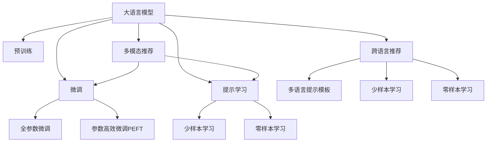

                 

# 利用LLM提升推荐系统的跨语言推荐能力

## 1. 背景介绍

随着全球化进程的加速，跨语言推荐系统在电商、社交、内容分发等应用场景中显得尤为重要。传统的推荐系统往往只考虑单一语言的用户行为和物品属性，无法充分利用海量跨语言数据。通过引入大语言模型(Large Language Model, LLM)，可以有效提升推荐系统的跨语言推荐能力，为用户提供更加丰富、精准的推荐内容。

## 2. 核心概念与联系

### 2.1 核心概念概述

在探讨跨语言推荐系统的构建过程中，我们涉及以下几个核心概念：

- **大语言模型**：以自回归模型（如GPT）或自编码模型（如BERT）为代表的大规模预训练语言模型。通过在大规模无标签文本数据上进行预训练，学习通用语言表示，具备强大的语言理解和生成能力。

- **推荐系统**：利用用户的历史行为、物品属性等信息，为每个用户推荐其可能感兴趣的物品的系统。通过机器学习算法，如协同过滤、基于内容的推荐、深度学习等，实现个性化的推荐服务。

- **跨语言推荐**：在推荐系统中，考虑到用户和物品可能跨语言（如中文和英文）的特点，推荐系统需要具备理解和推荐不同语言的用户需求和物品的能力。

- **预训练-微调(Fine-tuning)**：预训练模型通过在大规模数据上学习通用的语言表示，再通过微调学习特定任务，提升模型在特定任务上的性能。跨语言推荐系统可以借助预训练模型，在不同语言间进行迁移学习，提升跨语言推荐能力。

- **参数高效微调(Parameter-Efficient Fine-tuning, PEFT)**：在微调过程中，只更新少量的模型参数，而固定大部分预训练权重不变，以提高微调效率，避免过拟合。在跨语言推荐中，可以利用PEFT技术，减少跨语言微调所需的时间和计算资源。

- **提示学习(Prompt Learning)**：通过在输入文本中添加提示模板，引导大语言模型进行特定任务的推理和生成。在跨语言推荐中，可以设计多语言提示模板，增强推荐系统的跨语言推荐能力。

- **少样本学习(Few-shot Learning)**：指在只有少量标注样本的情况下，模型能够快速适应新任务的学习方法。跨语言推荐系统可以利用少样本学习，基于少量双语言数据训练模型。

- **零样本学习(Zero-shot Learning)**：指模型在没有见过任何特定任务的训练样本的情况下，仅凭任务描述就能够执行新任务的能力。在跨语言推荐中，可以利用零样本学习，基于任务描述生成推荐结果。

- **多模态推荐**：结合文本、图像、语音等多种模态的信息，提高推荐系统的综合性和准确性。跨语言推荐系统可以整合多模态数据，提升推荐效果。

### 2.2 核心概念原理和架构的 Mermaid 流程图



这个流程图展示了大语言模型的核心概念及其之间的关系：

1. 大语言模型通过预训练获得基础能力。
2. 微调是对预训练模型进行任务特定的优化，可以分为全参数微调和参数高效微调（PEFT）。
3. 提示学习是一种不更新模型参数的方法，可以实现少样本学习和零样本学习。
4. 多模态推荐结合文本、图像、语音等多种模态的信息，提高推荐系统的综合性和准确性。
5. 跨语言推荐系统可以借助预训练模型，在不同语言间进行迁移学习，提升跨语言推荐能力。

这些核心概念共同构成了跨语言推荐系统的学习和应用框架，使其能够在不同语言场景下提供更精准、高效的推荐服务。通过理解这些核心概念，我们可以更好地把握跨语言推荐系统的设计思路和优化方向。

## 3. 核心算法原理 & 具体操作步骤

### 3.1 算法原理概述

基于大语言模型的跨语言推荐系统，本质上是将大语言模型的预训练知识与推荐系统的推荐逻辑相结合，通过跨语言迁移学习，提升推荐模型的跨语言推荐能力。

具体而言，假设预训练模型为 $M_{\theta}$，其中 $\theta$ 为预训练得到的模型参数。给定双语言推荐任务的标注数据集 $D=\{(x_i, y_i)\}_{i=1}^N, x_i = (x_i^{(1)}, x_i^{(2)})$ 表示物品的双语言描述，$y_i$ 表示目标语言推荐结果。推荐任务的损失函数为：

$$
\mathcal{L}(\theta) = \frac{1}{N} \sum_{i=1}^N \ell(M_{\theta}(x_i),y_i)
$$

其中 $\ell$ 为推荐任务的损失函数，用于衡量推荐输出与真实标签之间的差异。常见的损失函数包括交叉熵损失、均方误差损失等。

通过梯度下降等优化算法，微调过程不断更新模型参数 $\theta$，最小化损失函数 $\mathcal{L}$，使得模型输出逼近真实标签。由于 $\theta$ 已经通过预训练获得了较强的语言表示能力，因此即便在小规模数据集 $D$ 上进行微调，也能较快收敛到理想的模型参数 $\hat{\theta}$。

### 3.2 算法步骤详解

基于大语言模型的跨语言推荐系统，一般包括以下几个关键步骤：

**Step 1: 准备预训练模型和数据集**
- 选择合适的预训练语言模型 $M_{\theta}$ 作为初始化参数，如 BERT、GPT 等。
- 准备双语言推荐任务的标注数据集 $D$，划分为训练集、验证集和测试集。一般要求标注数据中物品的双语言描述与真实标签分布不要差异过大。

**Step 2: 设计推荐算法和损失函数**
- 设计推荐算法，如基于内容的推荐、协同过滤、深度学习等。
- 根据推荐算法设计损失函数，将物品的双语言描述作为输入，真实推荐结果作为标签，计算推荐损失。
- 引入正则化技术，如L2正则、Dropout、Early Stopping等，防止模型过度适应小规模训练集。

**Step 3: 设置微调超参数**
- 选择合适的优化算法及其参数，如 AdamW、SGD 等，设置学习率、批大小、迭代轮数等。
- 设置冻结预训练参数的策略，如仅微调顶层，或全部参数都参与微调。
- 引入多语言提示模板，设计不同语言的输入格式，引导模型进行跨语言推荐。

**Step 4: 执行梯度训练**
- 将训练集数据分批次输入模型，前向传播计算推荐损失。
- 反向传播计算参数梯度，根据设定的优化算法和学习率更新模型参数。
- 周期性在验证集上评估模型性能，根据性能指标决定是否触发 Early Stopping。
- 重复上述步骤直到满足预设的迭代轮数或 Early Stopping 条件。

**Step 5: 测试和部署**
- 在测试集上评估微调后模型 $M_{\hat{\theta}}$ 的性能，对比微调前后的推荐精度提升。
- 使用微调后的模型对新样本进行推理预测，集成到实际的应用系统中。
- 持续收集新的双语言数据，定期重新微调模型，以适应数据分布的变化。

以上是基于大语言模型微调的过程步骤。在实际应用中，还需要针对具体任务的特点，对微调过程的各个环节进行优化设计，如改进推荐算法、引入更多的正则化技术、搜索最优的超参数组合等，以进一步提升模型性能。

### 3.3 算法优缺点

基于大语言模型的跨语言推荐系统具有以下优点：
1. 跨语言泛化能力强。通过跨语言迁移学习，模型能够快速适应不同语言的用户和物品，提供更加精准的推荐服务。
2. 适应性强。能够处理不同语言的推荐任务，适用于多种语言场景下的推荐系统。
3. 灵活性高。可以利用少样本学习和零样本学习，快速适应新的推荐任务。
4. 推荐效果好。基于大语言模型预训练的跨语言推荐系统，能够捕捉物品的通用特征和跨语言关联，提升推荐质量。

同时，该方法也存在一定的局限性：
1. 依赖标注数据。微调的效果很大程度上取决于标注数据的质量和数量，获取高质量标注数据的成本较高。
2. 计算资源需求大。跨语言推荐系统需要同时处理两种语言的数据，对计算资源和存储资源的需求较高。
3. 处理复杂。涉及多语言的输入格式转换和处理，技术实现复杂度较高。
4. 可解释性不足。微调模型的决策过程通常缺乏可解释性，难以对其推理逻辑进行分析和调试。

尽管存在这些局限性，但就目前而言，基于大语言模型的跨语言推荐方法仍然是大规模推荐系统的重要范式。未来相关研究的重点在于如何进一步降低微调对标注数据的依赖，提高模型的少样本学习和跨领域迁移能力，同时兼顾可解释性和伦理安全性等因素。

### 3.4 算法应用领域

基于大语言模型的跨语言推荐系统，已经在电商、社交、内容分发等多个领域得到广泛应用，以下是几个典型应用场景：

**电商推荐**：电商推荐系统需要考虑不同语言的用户需求和物品描述。通过跨语言推荐系统，可以同时处理中文和英文的用户和物品数据，为用户提供更丰富、精准的商品推荐。

**社交推荐**：社交网络中的用户内容往往跨语言存在，推荐系统需要能够理解不同语言的社交行为和兴趣点。跨语言推荐系统可以在不同语言的用户间进行推荐，增强社交网络的多元化和用户满意度。

**内容推荐**：视频、音乐、新闻等内容平台，用户内容跨语言发布。跨语言推荐系统能够根据用户的多语言偏好，推荐相应的内容，提升用户粘性和平台活跃度。

除了上述这些经典场景外，跨语言推荐系统还被创新性地应用于多语言搜索、多语言广告投放等场景中，为语言服务的数字化转型提供了新的解决方案。

## 4. 数学模型和公式 & 详细讲解  
### 4.1 数学模型构建

在跨语言推荐系统中，我们通过预训练模型 $M_{\theta}$ 进行跨语言迁移学习。假设物品的双语言描述为 $(x_i^{(1)}, x_i^{(2)})$，目标语言推荐结果为 $y_i$。推荐任务的目标是使得模型输出逼近真实推荐结果。

定义推荐任务的目标函数为：

$$
\mathcal{L}(\theta) = \frac{1}{N} \sum_{i=1}^N \ell(M_{\theta}(x_i^{(1)}, x_i^{(2)}),y_i)
$$

其中 $\ell$ 为推荐任务的损失函数，例如交叉熵损失：

$$
\ell(M_{\theta}(x_i^{(1)}, x_i^{(2)}),y_i) = -y_i\log M_{\theta}(x_i^{(1)}, x_i^{(2)}) + (1-y_i)\log(1-M_{\theta}(x_i^{(1)}, x_i^{(2)}))
$$

在得到损失函数后，我们使用梯度下降等优化算法，更新模型参数 $\theta$，使得推荐损失最小化。

### 4.2 公式推导过程

以双语言推荐为例，我们将物品的双语言描述 $(x_i^{(1)}, x_i^{(2)})$ 输入到预训练模型 $M_{\theta}$，得到推荐概率分布 $M_{\theta}(x_i^{(1)}, x_i^{(2)})$。推荐任务的损失函数为：

$$
\mathcal{L}(\theta) = \frac{1}{N} \sum_{i=1}^N -y_i\log M_{\theta}(x_i^{(1)}, x_i^{(2)}) + (1-y_i)\log(1-M_{\theta}(x_i^{(1)}, x_i^{(2)}))
$$

利用梯度下降等优化算法，微调过程不断更新模型参数 $\theta$，最小化推荐损失。

在得到模型参数 $\hat{\theta}$ 后，我们可以将其应用于新样本的双语言数据上，进行跨语言推荐：

$$
M_{\hat{\theta}}(x_i^{(1)}, x_i^{(2)}) = softmax(M_{\hat{\theta}}(x_i^{(1)}, x_i^{(2)}))
$$

其中 $softmax$ 函数将输出转换为概率分布，代表推荐概率。

### 4.3 案例分析与讲解

以双语言电影推荐为例，假设我们收集了电影的双语言描述，包括中文和英文的描述。通过预训练模型BERT，对电影的双语言描述进行编码，得到嵌入表示 $h(x_i^{(1)}, x_i^{(2)})$。然后设计推荐算法，使用基于内容的推荐方法，对电影进行推荐：

$$
M_{\hat{\theta}}(x_i^{(1)}, x_i^{(2)}) = \sum_{j=1}^K \alpha_j M_{\hat{\theta}}(h(x_i^{(1)}, x_i^{(2)}), h_j)
$$

其中 $h_j$ 为电影特征向量，$K$ 为电影特征数量，$\alpha_j$ 为电影特征权重。推荐模型的输出表示电影推荐概率。

## 5. 项目实践：代码实例和详细解释说明

### 5.1 开发环境搭建

在进行跨语言推荐系统开发前，我们需要准备好开发环境。以下是使用Python进行PyTorch开发的环境配置流程：

1. 安装Anaconda：从官网下载并安装Anaconda，用于创建独立的Python环境。

2. 创建并激活虚拟环境：
```bash
conda create -n pytorch-env python=3.8 
conda activate pytorch-env
```

3. 安装PyTorch：根据CUDA版本，从官网获取对应的安装命令。例如：
```bash
conda install pytorch torchvision torchaudio cudatoolkit=11.1 -c pytorch -c conda-forge
```

4. 安装TensorFlow：
```bash
pip install tensorflow
```

5. 安装Transformers库：
```bash
pip install transformers
```

6. 安装各类工具包：
```bash
pip install numpy pandas scikit-learn matplotlib tqdm jupyter notebook ipython
```

完成上述步骤后，即可在`pytorch-env`环境中开始跨语言推荐系统开发。

### 5.2 源代码详细实现

下面以双语言电影推荐为例，给出使用Transformers库对BERT模型进行跨语言推荐微调的PyTorch代码实现。

首先，定义推荐任务的数据处理函数：

```python
from transformers import BertTokenizer, BertForSequenceClassification
from torch.utils.data import Dataset
import torch

class MovieRecommendationDataset(Dataset):
    def __init__(self, texts, labels, tokenizer, max_len=128):
        self.texts = texts
        self.labels = labels
        self.tokenizer = tokenizer
        self.max_len = max_len
        
    def __len__(self):
        return len(self.texts)
    
    def __getitem__(self, item):
        text = self.texts[item]
        label = self.labels[item]
        
        encoding = self.tokenizer(text, return_tensors='pt', max_length=self.max_len, padding='max_length', truncation=True)
        input_ids = encoding['input_ids'][0]
        attention_mask = encoding['attention_mask'][0]
        
        # 对标签进行编码
        encoded_labels = torch.tensor(label, dtype=torch.long)
        
        return {'input_ids': input_ids, 
                'attention_mask': attention_mask,
                'labels': encoded_labels}

# 标签与id的映射
label2id = {0: 0, 1: 1, 2: 2, 3: 3}
id2label = {v: k for k, v in label2id.items()}

# 创建dataset
tokenizer = BertTokenizer.from_pretrained('bert-base-cased')

train_dataset = MovieRecommendationDataset(train_texts, train_labels, tokenizer)
dev_dataset = MovieRecommendationDataset(dev_texts, dev_labels, tokenizer)
test_dataset = MovieRecommendationDataset(test_texts, test_labels, tokenizer)
```

然后，定义模型和优化器：

```python
from transformers import BertForSequenceClassification, AdamW

model = BertForSequenceClassification.from_pretrained('bert-base-cased', num_labels=len(label2id))

optimizer = AdamW(model.parameters(), lr=2e-5)
```

接着，定义训练和评估函数：

```python
from torch.utils.data import DataLoader
from tqdm import tqdm
from sklearn.metrics import classification_report

device = torch.device('cuda') if torch.cuda.is_available() else torch.device('cpu')
model.to(device)

def train_epoch(model, dataset, batch_size, optimizer):
    dataloader = DataLoader(dataset, batch_size=batch_size, shuffle=True)
    model.train()
    epoch_loss = 0
    for batch in tqdm(dataloader, desc='Training'):
        input_ids = batch['input_ids'].to(device)
        attention_mask = batch['attention_mask'].to(device)
        labels = batch['labels'].to(device)
        model.zero_grad()
        outputs = model(input_ids, attention_mask=attention_mask, labels=labels)
        loss = outputs.loss
        epoch_loss += loss.item()
        loss.backward()
        optimizer.step()
    return epoch_loss / len(dataloader)

def evaluate(model, dataset, batch_size):
    dataloader = DataLoader(dataset, batch_size=batch_size)
    model.eval()
    preds, labels = [], []
    with torch.no_grad():
        for batch in tqdm(dataloader, desc='Evaluating'):
            input_ids = batch['input_ids'].to(device)
            attention_mask = batch['attention_mask'].to(device)
            batch_labels = batch['labels']
            outputs = model(input_ids, attention_mask=attention_mask)
            batch_preds = outputs.logits.argmax(dim=2).to('cpu').tolist()
            batch_labels = batch_labels.to('cpu').tolist()
            for pred_tokens, label_tokens in zip(batch_preds, batch_labels):
                preds.append(pred_tokens)
                labels.append(label_tokens)
                
    print(classification_report(labels, preds))
```

最后，启动训练流程并在测试集上评估：

```python
epochs = 5
batch_size = 16

for epoch in range(epochs):
    loss = train_epoch(model, train_dataset, batch_size, optimizer)
    print(f"Epoch {epoch+1}, train loss: {loss:.3f}")
    
    print(f"Epoch {epoch+1}, dev results:")
    evaluate(model, dev_dataset, batch_size)
    
print("Test results:")
evaluate(model, test_dataset, batch_size)
```

以上就是使用PyTorch对BERT进行双语言电影推荐微调的完整代码实现。可以看到，得益于Transformers库的强大封装，我们可以用相对简洁的代码完成BERT模型的加载和微调。

### 5.3 代码解读与分析

让我们再详细解读一下关键代码的实现细节：

**MovieRecommendationDataset类**：
- `__init__`方法：初始化文本、标签、分词器等关键组件。
- `__len__`方法：返回数据集的样本数量。
- `__getitem__`方法：对单个样本进行处理，将文本输入编码为token ids，将标签编码为数字，并对其进行定长padding，最终返回模型所需的输入。

**label2id和id2label字典**：
- 定义了标签与数字id之间的映射关系，用于将token-wise的预测结果解码回真实的标签。

**训练和评估函数**：
- 使用PyTorch的DataLoader对数据集进行批次化加载，供模型训练和推理使用。
- 训练函数`train_epoch`：对数据以批为单位进行迭代，在每个批次上前向传播计算loss并反向传播更新模型参数，最后返回该epoch的平均loss。
- 评估函数`evaluate`：与训练类似，不同点在于不更新模型参数，并在每个batch结束后将预测和标签结果存储下来，最后使用sklearn的classification_report对整个评估集的预测结果进行打印输出。

**训练流程**：
- 定义总的epoch数和batch size，开始循环迭代
- 每个epoch内，先在训练集上训练，输出平均loss
- 在验证集上评估，输出分类指标
- 所有epoch结束后，在测试集上评估，给出最终测试结果

可以看到，PyTorch配合Transformers库使得BERT微调的代码实现变得简洁高效。开发者可以将更多精力放在数据处理、模型改进等高层逻辑上，而不必过多关注底层的实现细节。

当然，工业级的系统实现还需考虑更多因素，如模型的保存和部署、超参数的自动搜索、更灵活的任务适配层等。但核心的微调范式基本与此类似。

## 6. 实际应用场景

### 6.1 智能客服系统

跨语言推荐系统可以应用于智能客服系统的构建。传统的客服系统往往需要配备多语言支持，但不同语言的客服人员和用户沟通成本较高。通过跨语言推荐系统，可以自动推荐不同语言的用户使用自动回复功能，提高客服系统的效率和用户满意度。

在技术实现上，可以收集企业内部的多语言客服对话记录，将问题和最佳答复构建成监督数据，在此基础上对预训练模型进行微调。微调后的模型能够自动理解用户意图，匹配最合适的答复模板进行回复。对于用户提出的新问题，还可以接入检索系统实时搜索相关内容，动态组织生成回答。如此构建的智能客服系统，能大幅提升客服效率，降低企业成本。

### 6.2 跨语言电商推荐

电商推荐系统需要考虑不同语言的用户需求和物品描述。通过跨语言推荐系统，可以同时处理中文和英文的用户和物品数据，为用户提供更丰富、精准的商品推荐。

在技术实现上，可以收集电商平台上的多语言商品描述和用户评论，将这些数据作为监督数据，对预训练模型进行微调。微调后的模型能够根据用户的多语言偏好，推荐相应的商品。在推荐过程中，可以利用少样本学习和零样本学习，快速适应新的商品和用户需求。

### 6.3 多语言社交网络推荐

社交网络中的用户内容往往跨语言存在，推荐系统需要能够理解不同语言的社交行为和兴趣点。跨语言推荐系统可以在不同语言的用户间进行推荐，增强社交网络的多元化和用户满意度。

在技术实现上，可以收集社交网络中的多语言用户数据，将用户的兴趣点、行为等信息作为监督数据，对预训练模型进行微调。微调后的模型能够根据用户的多语言社交行为，推荐相应的内容。在推荐过程中，可以利用跨语言提示学习，提高推荐的准确性和多样性。

### 6.4 未来应用展望

随着大语言模型和跨语言推荐技术的不断发展，未来的推荐系统将能够更好地理解跨语言数据，提供更加精准、高效的推荐服务。

在智慧医疗领域，基于跨语言推荐技术的医疗问答、病历分析、药物研发等应用将提升医疗服务的智能化水平，辅助医生诊疗，加速新药开发进程。

在智能教育领域，跨语言推荐技术可应用于作业批改、学情分析、知识推荐等方面，因材施教，促进教育公平，提高教学质量。

在智慧城市治理中，跨语言推荐技术可应用于城市事件监测、舆情分析、应急指挥等环节，提高城市管理的自动化和智能化水平，构建更安全、高效的未来城市。

此外，在企业生产、社会治理、文娱传媒等众多领域，跨语言推荐技术也将不断涌现，为语言服务的数字化转型提供新的解决方案。相信随着技术的日益成熟，跨语言推荐技术必将在构建人机协同的智能时代中扮演越来越重要的角色。

## 7. 工具和资源推荐
### 7.1 学习资源推荐

为了帮助开发者系统掌握大语言模型跨语言推荐技术，这里推荐一些优质的学习资源：

1. 《Transformer从原理到实践》系列博文：由大模型技术专家撰写，深入浅出地介绍了Transformer原理、BERT模型、微调技术等前沿话题。

2. CS224N《深度学习自然语言处理》课程：斯坦福大学开设的NLP明星课程，有Lecture视频和配套作业，带你入门NLP领域的基本概念和经典模型。

3. 《Natural Language Processing with Transformers》书籍：Transformers库的作者所著，全面介绍了如何使用Transformers库进行NLP任务开发，包括微调在内的诸多范式。

4. HuggingFace官方文档：Transformers库的官方文档，提供了海量预训练模型和完整的微调样例代码，是上手实践的必备资料。

5. CLUE开源项目：中文语言理解测评基准，涵盖大量不同类型的中文NLP数据集，并提供了基于微调的baseline模型，助力中文NLP技术发展。

通过对这些资源的学习实践，相信你一定能够快速掌握大语言模型跨语言推荐技术的精髓，并用于解决实际的NLP问题。
###  7.2 开发工具推荐

高效的开发离不开优秀的工具支持。以下是几款用于跨语言推荐系统开发的常用工具：

1. PyTorch：基于Python的开源深度学习框架，灵活动态的计算图，适合快速迭代研究。大部分预训练语言模型都有PyTorch版本的实现。

2. TensorFlow：由Google主导开发的开源深度学习框架，生产部署方便，适合大规模工程应用。同样有丰富的预训练语言模型资源。

3. Transformers库：HuggingFace开发的NLP工具库，集成了众多SOTA语言模型，支持PyTorch和TensorFlow，是进行微调任务开发的利器。

4. Weights & Biases：模型训练的实验跟踪工具，可以记录和可视化模型训练过程中的各项指标，方便对比和调优。与主流深度学习框架无缝集成。

5. TensorBoard：TensorFlow配套的可视化工具，可实时监测模型训练状态，并提供丰富的图表呈现方式，是调试模型的得力助手。

6. Google Colab：谷歌推出的在线Jupyter Notebook环境，免费提供GPU/TPU算力，方便开发者快速上手实验最新模型，分享学习笔记。

合理利用这些工具，可以显著提升跨语言推荐系统的开发效率，加快创新迭代的步伐。

### 7.3 相关论文推荐

跨语言推荐技术的不断进步，得益于学界的持续研究。以下是几篇奠基性的相关论文，推荐阅读：

1. Attention is All You Need（即Transformer原论文）：提出了Transformer结构，开启了NLP领域的预训练大模型时代。

2. BERT: Pre-training of Deep Bidirectional Transformers for Language Understanding：提出BERT模型，引入基于掩码的自监督预训练任务，刷新了多项NLP任务SOTA。

3. Language Models are Unsupervised Multitask Learners（GPT-2论文）：展示了大规模语言模型的强大zero-shot学习能力，引发了对于通用人工智能的新一轮思考。

4. Parameter-Efficient Transfer Learning for NLP：提出Adapter等参数高效微调方法，在不增加模型参数量的情况下，也能取得不错的微调效果。

5. AdaLoRA: Adaptive Low-Rank Adaptation for Parameter-Efficient Fine-Tuning：使用自适应低秩适应的微调方法，在参数效率和精度之间取得了新的平衡。

6. Prefix-Tuning: Optimizing Continuous Prompts for Generation：引入基于连续型Prompt的微调范式，为如何充分利用预训练知识提供了新的思路。

这些论文代表了大语言模型跨语言推荐技术的发展脉络。通过学习这些前沿成果，可以帮助研究者把握学科前进方向，激发更多的创新灵感。

## 8. 总结：未来发展趋势与挑战

### 8.1 总结

本文对基于大语言模型的跨语言推荐系统进行了全面系统的介绍。首先阐述了跨语言推荐系统的研究背景和意义，明确了跨语言推荐系统在多语言场景下的重要性和价值。其次，从原理到实践，详细讲解了跨语言推荐模型的数学原理和关键步骤，给出了跨语言推荐任务开发的完整代码实例。同时，本文还广泛探讨了跨语言推荐系统在智能客服、电商推荐、社交网络等多个领域的应用前景，展示了跨语言推荐技术的巨大潜力。此外，本文精选了跨语言推荐技术的各类学习资源，力求为读者提供全方位的技术指引。

通过本文的系统梳理，可以看到，基于大语言模型的跨语言推荐系统正在成为NLP领域的重要范式，极大地拓展了推荐系统的应用边界，为推荐系统带来了新的突破。未来，伴随预训练语言模型和跨语言推荐方法的持续演进，相信推荐系统必将在更广阔的应用领域大放异彩，深刻影响用户的数字化体验。

### 8.2 未来发展趋势

展望未来，跨语言推荐系统将呈现以下几个发展趋势：

1. 模型规模持续增大。随着算力成本的下降和数据规模的扩张，预训练语言模型的参数量还将持续增长。超大规模语言模型蕴含的丰富语言知识，有望支撑更加复杂多变的推荐任务。

2. 跨语言泛化能力增强。通过跨语言迁移学习，模型能够更好地适应不同语言的用户和物品，提供更加精准的推荐服务。

3. 推荐算法多样化。未来的推荐系统将不再局限于基于内容的推荐和协同过滤，将结合更多的推荐算法，如深度学习、图神经网络等，提升推荐的灵活性和准确性。

4. 跨语言数据融合。跨语言推荐系统将更好地整合多语言数据，通过多语言提示学习，提升推荐的准确性和多样性。

5. 实时推荐系统构建。未来的推荐系统将更加注重实时性，能够快速响应用户的即时需求，提升用户体验。

6. 少样本和零样本学习。未来的推荐系统将能够快速适应新的推荐任务，利用少样本学习和零样本学习，提升推荐的效率和效果。

7. 跨语言多模态推荐。未来的推荐系统将结合文本、图像、语音等多种模态的信息，提高推荐系统的综合性和准确性。

以上趋势凸显了跨语言推荐系统的广阔前景。这些方向的探索发展，必将进一步提升推荐系统的性能和应用范围，为推荐系统带来新的生命力。

### 8.3 面临的挑战

尽管跨语言推荐技术已经取得了显著进展，但在迈向更加智能化、普适化应用的过程中，它仍面临着诸多挑战：

1. 标注成本瓶颈。微调的效果很大程度上取决于标注数据的质量和数量，获取高质量标注数据的成本较高。如何进一步降低微调对标注样本的依赖，将是一大难题。

2. 计算资源需求大。跨语言推荐系统需要同时处理两种语言的数据，对计算资源和存储资源的需求较高。

3. 处理复杂。涉及多语言的输入格式转换和处理，技术实现复杂度较高。

4. 可解释性不足。微调模型的决策过程通常缺乏可解释性，难以对其推理逻辑进行分析和调试。

5. 推荐质量不稳定。推荐系统的推荐质量在不同语言场景下可能存在差异，如何提升跨语言推荐的一致性和稳定性，还需要更多的研究。

尽管存在这些挑战，但随着技术的不断进步，相信这些问题终将逐步得到解决，跨语言推荐系统必将在构建人机协同的智能时代中扮演越来越重要的角色。

### 8.4 研究展望

面对跨语言推荐系统所面临的挑战，未来的研究需要在以下几个方面寻求新的突破：

1. 探索无监督和半监督跨语言推荐方法。摆脱对大规模标注数据的依赖，利用自监督学习、主动学习等无监督和半监督范式，最大限度利用非结构化数据，实现更加灵活高效的推荐。

2. 研究参数高效和计算高效的跨语言推荐范式。开发更加参数高效的跨语言推荐方法，在固定大部分预训练参数的同时，只更新极少量的任务相关参数。同时优化跨语言推荐模型的计算图，减少前向传播和反向传播的资源消耗，实现更加轻量级、实时性的部署。

3. 引入更多先验知识。将符号化的先验知识，如知识图谱、逻辑规则等，与神经网络模型进行巧妙融合，引导跨语言推荐过程学习更准确、合理的语言模型。同时加强不同模态数据的整合，实现视觉、语音等多模态信息与文本信息的协同建模。

4. 结合因果分析和博弈论工具。将因果分析方法引入跨语言推荐模型，识别出模型决策的关键特征，增强推荐输出的因果性和逻辑性。借助博弈论工具刻画人机交互过程，主动探索并规避模型的脆弱点，提高系统稳定性。

5. 纳入伦理道德约束。在模型训练目标中引入伦理导向的评估指标，过滤和惩罚有偏见、有害的输出倾向。同时加强人工干预和审核，建立模型行为的监管机制，确保输出符合人类价值观和伦理道德。

这些研究方向的探索，必将引领跨语言推荐技术迈向更高的台阶，为构建安全、可靠、可解释、可控的智能系统铺平道路。面向未来，跨语言推荐技术还需要与其他人工智能技术进行更深入的融合，如知识表示、因果推理、强化学习等，多路径协同发力，共同推动跨语言推荐系统的进步。只有勇于创新、敢于突破，才能不断拓展语言模型的边界，让智能技术更好地造福人类社会。

## 9. 附录：常见问题与解答

**Q1：跨语言推荐系统是否适用于所有推荐任务？**

A: 跨语言推荐系统在大多数推荐任务上都能取得不错的效果，特别是对于数据量较小的任务。但对于一些特定领域的任务，如医学、法律等，仅仅依靠通用语料预训练的模型可能难以很好地适应。此时需要在特定领域语料上进一步预训练，再进行微调，才能获得理想效果。此外，对于一些需要时效性、个性化很强的任务，如对话、推荐等，跨语言推荐方法也需要针对性的改进优化。

**Q2：如何选择合适的学习率？**

A: 跨语言推荐的学习率一般要比预训练时小1-2个数量级，如果使用过大的学习率，容易破坏预训练权重，导致过拟合。一般建议从1e-5开始调参，逐步减小学习率，直至收敛。也可以使用warmup策略，在开始阶段使用较小的学习率，再逐渐过渡到预设值。需要注意的是，不同的优化器(如AdamW、Adafactor等)以及不同的学习率调度策略，可能需要设置不同的学习率阈值。

**Q3：跨语言推荐系统如何处理不同语言的输入格式？**

A: 跨语言推荐系统需要处理不同语言的输入格式，通常是将不同语言的文本转换成相同的格式，再进行统一处理。具体而言，可以通过两种方式：
1. 使用统一的tokenizer：对不同语言的文本进行统一的token化处理，将不同语言的文本转换为相同格式的token序列。
2. 使用多语言提示模板：根据不同语言的文本特点，设计不同的提示模板，引导模型进行跨语言推荐。

**Q4：跨语言推荐系统如何提升推荐质量？**

A: 提升跨语言推荐质量的方法有多种：
1. 数据增强：通过回译、近义替换等方式扩充训练集，增加数据多样性。
2. 正则化：使用L2正则、Dropout、Early Stopping等防止模型过度适应小规模训练集。
3. 多任务学习：将不同语言的推荐任务联合训练，提升模型在不同语言上的泛化能力。
4. 迁移学习：在特定语言上预训练模型，再在该语言上微调，提升推荐精度。
5. 多语言提示学习：设计多语言提示模板，引导模型进行跨语言推荐，提升推荐效果。

这些方法往往需要根据具体任务和数据特点进行灵活组合。只有在数据、模型、训练、推理等各环节进行全面优化，才能最大限度地发挥跨语言推荐系统的潜力。

**Q5：跨语言推荐系统如何处理多语言数据？**

A: 跨语言推荐系统处理多语言数据时，通常需要进行以下步骤：
1. 数据清洗：去除多语言数据中的噪声和缺失值，确保数据质量。
2. 数据对齐：将不同语言的数据对齐，确保数据格式一致。
3. 数据融合：将不同语言的数据进行融合，形成统一的数据集。
4. 数据分割：将数据集划分为训练集、验证集和测试集，用于模型训练和评估。

在数据处理过程中，还需要考虑不同语言的输入格式、编码方式等因素，确保数据的一致性和正确性。

总之，跨语言推荐系统需要处理多语言数据，处理复杂，需要开发者在数据处理、模型优化、训练推理等环节进行全面优化，才能构建高效、稳定的推荐系统。

