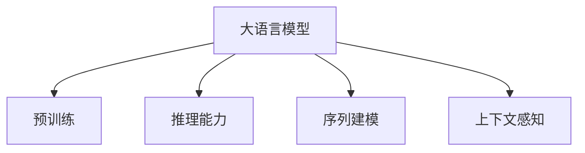

                 

# 利用LLM知识和推理能力理解用户行为

## 1. 背景介绍

### 1.1 问题由来

随着互联网技术的快速发展，线上应用场景日益丰富，用户行为数据分析也成为各个行业的重要任务。如何从海量数据中提取有价值的信息，理解用户的行为动机，提升用户体验，成为了企业和研究者的共同挑战。传统的文本分析、情感分析等方法，在用户行为理解方面存在诸多局限，难以刻画更深层次的用户意图。

近年来，大语言模型（Large Language Models, LLMs）在自然语言处理（Natural Language Processing, NLP）领域取得了巨大的突破。这些大语言模型，如GPT-3、BERT等，通过大规模无标签文本数据的预训练，学习了丰富的语言知识和语义表示。这些模型不仅能够理解文本，还能生成与人类媲美的自然语言，具备强大的逻辑推理和常识理解能力。基于这些优势，利用大语言模型来理解用户行为，成为近年来研究的热点。

### 1.2 问题核心关键点

利用大语言模型理解用户行为的核心在于：
- 通过大语言模型强大的语义理解能力，从用户生成文本中提取情感、意图、兴趣等信息。
- 利用模型的推理能力，结合上下文信息，推断用户的行为动机和后续可能的行为。
- 结合用户行为数据，不断更新和训练模型，实现持续改进。

大语言模型在用户行为分析中的应用，有助于企业快速洞察用户需求，制定精准的市场策略，提升用户体验。例如，在电商、金融、社交媒体等场景中，通过分析用户评论、留言、交易记录等数据，可以发现用户对产品的真实态度、偏好和需求，从而优化产品设计，提升销售业绩。在客服领域，利用大语言模型分析用户的咨询内容，可以迅速找到用户的问题所在，提供及时准确的解决方案，提升客户满意度。

### 1.3 问题研究意义

利用大语言模型理解用户行为，对于提升用户体验、优化产品设计、增加用户黏性等方面具有重要意义：
- 提升个性化推荐：基于用户的行为数据和兴趣标签，利用大语言模型生成个性化推荐内容，提升用户对推荐结果的满意度。
- 优化客户服务：通过分析用户咨询内容，快速定位用户需求，提供精准的解决方案，提升客户满意度。
- 驱动决策分析：利用用户反馈和行为数据，辅助企业决策分析，发现潜在机会，优化产品和服务。
- 增强营销策略：通过用户行为分析，制定更加精准的营销策略，提升广告投放效果。
- 提升用户体验：结合用户行为数据，不断优化用户体验，提升用户留存率和活跃度。

## 2. 核心概念与联系

### 2.1 核心概念概述

为了更好地理解利用大语言模型理解用户行为，我们首先介绍几个关键概念：

- 大语言模型（Large Language Models, LLMs）：指基于深度学习框架（如Transformers）构建的大型预训练语言模型。通过在海量无标签文本数据上预训练，模型学习了通用的语言表示，具备强大的语义理解和生成能力。
- 预训练（Pre-training）：指在大量无标签文本数据上，通过自监督学习任务训练语言模型，学习通用的语言知识和语义表示。常见的预训练任务包括掩码语言模型、下一句预测等。
- 推理能力（Inference）：指利用模型已有的知识，结合上下文信息，推断未知事实的能力。大语言模型在预训练过程中，学习了丰富的常识知识，能够在多种任务中进行有效的推理。
- 序列建模（Sequence Modeling）：指利用模型处理序列数据的结构，如时间序列、文本序列等，通过捕捉序列间的依赖关系，进行更复杂的任务处理。
- 上下文感知（Context-Aware）：指模型在处理序列数据时，能够考虑上下文信息，从而更准确地理解和生成文本。

这些概念之间的逻辑关系可以通过以下Mermaid流程图来展示：



这个流程图展示了大语言模型的核心概念及其之间的关系：

1. 大语言模型通过预训练获得基础能力。
2. 推理能力基于模型的语义理解，结合上下文信息，进行推理。
3. 序列建模使得模型能够处理序列数据，捕捉序列间的依赖关系。
4. 上下文感知使模型在处理序列数据时，能够考虑上下文信息。

## 3. 核心算法原理 & 具体操作步骤

### 3.1 算法原理概述

利用大语言模型理解用户行为，本质上是通过模型进行自然语言理解和推理的过程。其核心思想是：将用户生成的文本作为输入，通过预训练模型提取文本中的语义特征，结合上下文信息，推断用户的行为动机和后续可能的行为。

具体而言，可以将用户行为数据（如评论、留言、交易记录等）作为文本输入，送入预训练模型进行前向传播，得到文本的语义表示。然后，利用推理算法，结合上下文信息，对用户行为进行解释和推断。最终的推断结果可以用于用户画像构建、个性化推荐、客户服务优化等多种应用场景。

### 3.2 算法步骤详解

利用大语言模型理解用户行为的步骤如下：

**Step 1: 数据预处理**
- 收集用户行为数据，如评论、留言、交易记录等。
- 清洗和标准化数据，去除噪音和无用信息。
- 将文本数据分成训练集和测试集，划分为合适的批次大小。

**Step 2: 模型选择与适配**
- 选择合适的预训练模型（如BERT、GPT等）。
- 根据任务需求，设计适当的模型结构，如添加分类器或回归器等。
- 使用少量标注数据对模型进行微调，优化模型的推理能力。

**Step 3: 推理与解释**
- 将用户行为数据输入模型，得到文本的语义表示。
- 结合上下文信息，使用推理算法对用户行为进行解释和推断。
- 将推断结果与实际行为数据进行对比，评估模型的性能。

**Step 4: 应用与迭代**
- 将推断结果应用于个性化推荐、客户服务优化等实际应用中。
- 收集新的用户行为数据，结合已有的推断结果，进行持续迭代和优化。

### 3.3 算法优缺点

利用大语言模型理解用户行为具有以下优点：
1. 强大的语义理解能力：大语言模型能够理解复杂的自然语言，提取文本中的语义信息。
2. 丰富的常识知识：通过预训练，大语言模型具备了大量的常识知识，可以更好地推断用户行为。
3. 灵活性高：大语言模型能够处理多种类型的用户行为数据，适应性较强。
4. 可解释性强：模型推理过程和结果具有较强的可解释性，便于理解和调试。

同时，该方法也存在一些局限性：
1. 依赖标注数据：微调过程需要少量标注数据，标注成本较高。
2. 推理计算复杂：推理过程需要耗费大量计算资源，尤其是在大规模数据集上。
3. 泛化能力有限：大语言模型在某些特定领域可能表现不佳，需要进行领域适应的微调。
4. 偏见与歧视：模型可能学习到数据中的偏见和歧视，需要特别注意。

尽管存在这些局限性，但大语言模型在理解用户行为方面仍然具有巨大的潜力和应用前景。

### 3.4 算法应用领域

利用大语言模型理解用户行为的方法，已经在电商、金融、社交媒体、客服等多个领域得到了广泛应用，具体包括：

1. 电商个性化推荐：分析用户评论和购物行为，生成个性化的推荐商品，提升用户购物体验。
2. 金融客户服务：通过分析用户咨询记录，识别用户需求，提供精准的金融服务解决方案。
3. 社交媒体情感分析：分析用户评论和留言，了解用户对产品的真实态度，优化产品设计。
4. 客户行为分析：结合用户行为数据和模型推断结果，优化客户服务流程，提升客户满意度。
5. 用户画像构建：利用用户行为数据和模型推断结果，构建详细的用户画像，为营销和决策提供支持。

## 4. 数学模型和公式 & 详细讲解 & 举例说明

### 4.1 数学模型构建

在本节中，我们将使用数学语言对利用大语言模型理解用户行为的模型进行更加严格的刻画。

记用户行为数据为 $X$，模型为 $M_{\theta}$，其中 $\theta$ 为模型的可训练参数。模型的推理过程可以表示为：

$$
y = M_{\theta}(x)
$$

其中 $y$ 表示模型的推理结果，$x$ 表示用户行为数据。

在推理过程中，模型首先需要对用户行为数据进行编码，得到文本的语义表示 $z$：

$$
z = M_{\theta}(x)
$$

然后，结合上下文信息 $c$，使用推理算法对 $z$ 进行解释和推断，得到最终的推理结果 $y$：

$$
y = R(z, c)
$$

其中 $R$ 为推理算法，如基于规则的推理、神经网络推理等。

### 4.2 公式推导过程

以基于规则的推理算法为例，其推理过程可以表示为：

$$
y = f_1 \circ f_2 \circ \ldots \circ f_n(z, c)
$$

其中 $f_i$ 表示推理过程的第 $i$ 步，$n$ 表示推理步骤。

对于每个推理步骤 $f_i$，可以使用以下公式进行推导：

$$
f_i(z, c) = M_i(z, c) \circ R_i(z, c)
$$

其中 $M_i$ 表示模型对输入 $z$ 和上下文 $c$ 进行编码，$R_i$ 表示推理器对编码后的结果进行处理，得到推理结果。

对于最终推理结果 $y$，可以表示为：

$$
y = f_1 \circ f_2 \circ \ldots \circ f_n(z, c)
$$

### 4.3 案例分析与讲解

以电商个性化推荐为例，我们分析用户评论和购物行为，生成个性化的推荐商品。

假设用户评论为 $x_1 = "这款手机非常好用，性价比高"，购物记录为 $x_2 = ["手机", "相机", "配件"]$。

首先，将评论 $x_1$ 和购物记录 $x_2$ 输入模型进行编码，得到语义表示 $z_1$ 和 $z_2$：

$$
z_1 = M_{\theta}(x_1)
$$
$$
z_2 = M_{\theta}(x_2)
$$

然后，结合上下文信息，使用推理算法对 $z_1$ 和 $z_2$ 进行解释和推断，得到推荐商品的推理结果 $y$：

$$
y = R(z_1, z_2) = "可能对配件也有兴趣"
$$

最终，将推理结果 $y$ 作为个性化推荐依据，向用户推荐相关商品。

## 5. 项目实践：代码实例和详细解释说明

### 5.1 开发环境搭建

在进行利用大语言模型理解用户行为的实践前，我们需要准备好开发环境。以下是使用Python进行PyTorch开发的环境配置流程：

1. 安装Anaconda：从官网下载并安装Anaconda，用于创建独立的Python环境。

2. 创建并激活虚拟环境：
```bash
conda create -n pytorch-env python=3.8 
conda activate pytorch-env
```

3. 安装PyTorch：根据CUDA版本，从官网获取对应的安装命令。例如：
```bash
conda install pytorch torchvision torchaudio cudatoolkit=11.1 -c pytorch -c conda-forge
```

4. 安装Transformers库：
```bash
pip install transformers
```

5. 安装各类工具包：
```bash
pip install numpy pandas scikit-learn matplotlib tqdm jupyter notebook ipython
```

完成上述步骤后，即可在`pytorch-env`环境中开始实践。

### 5.2 源代码详细实现

下面我们以电商个性化推荐为例，给出使用Transformers库对BERT模型进行个性化推荐微调的PyTorch代码实现。

首先，定义个性化推荐任务的数据处理函数：

```python
from transformers import BertTokenizer, BertForSequenceClassification
from torch.utils.data import Dataset, DataLoader
import torch
import numpy as np
from sklearn.metrics import roc_auc_score

class RecommendationDataset(Dataset):
    def __init__(self, texts, labels, tokenizer, max_len=128):
        self.texts = texts
        self.labels = labels
        self.tokenizer = tokenizer
        self.max_len = max_len
        
    def __len__(self):
        return len(self.texts)
    
    def __getitem__(self, item):
        text = self.texts[item]
        label = self.labels[item]
        
        encoding = self.tokenizer(text, return_tensors='pt', max_length=self.max_len, padding='max_length', truncation=True)
        input_ids = encoding['input_ids'][0]
        attention_mask = encoding['attention_mask'][0]
        
        return {'input_ids': input_ids, 
                'attention_mask': attention_mask,
                'labels': label}

# 标签与id的映射
tag2id = {'1': 1, '0': 0}
id2tag = {v: k for k, v in tag2id.items()}

# 创建dataset
tokenizer = BertTokenizer.from_pretrained('bert-base-cased')

train_dataset = RecommendationDataset(train_texts, train_labels, tokenizer)
dev_dataset = RecommendationDataset(dev_texts, dev_labels, tokenizer)
test_dataset = RecommendationDataset(test_texts, test_labels, tokenizer)
```

然后，定义模型和优化器：

```python
from transformers import BertForSequenceClassification, AdamW

model = BertForSequenceClassification.from_pretrained('bert-base-cased', num_labels=2)

optimizer = AdamW(model.parameters(), lr=2e-5)
```

接着，定义训练和评估函数：

```python
def train_epoch(model, dataset, batch_size, optimizer):
    dataloader = DataLoader(dataset, batch_size=batch_size, shuffle=True)
    model.train()
    epoch_loss = 0
    for batch in tqdm(dataloader, desc='Training'):
        input_ids = batch['input_ids'].to(device)
        attention_mask = batch['attention_mask'].to(device)
        labels = batch['labels'].to(device)
        model.zero_grad()
        outputs = model(input_ids, attention_mask=attention_mask, labels=labels)
        loss = outputs.loss
        epoch_loss += loss.item()
        loss.backward()
        optimizer.step()
    return epoch_loss / len(dataloader)

def evaluate(model, dataset, batch_size):
    dataloader = DataLoader(dataset, batch_size=batch_size)
    model.eval()
    preds, labels = [], []
    with torch.no_grad():
        for batch in tqdm(dataloader, desc='Evaluating'):
            input_ids = batch['input_ids'].to(device)
            attention_mask = batch['attention_mask'].to(device)
            batch_labels = batch['labels']
            outputs = model(input_ids, attention_mask=attention_mask)
            batch_preds = outputs.logits.argmax(dim=2).to('cpu').tolist()
            batch_labels = batch_labels.to('cpu').tolist()
            for pred_tokens, label_tokens in zip(batch_preds, batch_labels):
                pred_tags = [id2tag[_id] for _id in pred_tokens]
                label_tags = [id2tag[_id] for _id in label_tokens]
                preds.append(pred_tags)
                labels.append(label_tags)
                
    auc = roc_auc_score(labels, preds)
    print(f"AUC: {auc:.3f}")
    return auc
```

最后，启动训练流程并在测试集上评估：

```python
epochs = 5
batch_size = 16

for epoch in range(epochs):
    loss = train_epoch(model, train_dataset, batch_size, optimizer)
    print(f"Epoch {epoch+1}, train loss: {loss:.3f}")
    
    print(f"Epoch {epoch+1}, dev results:")
    auc = evaluate(model, dev_dataset, batch_size)
    print(f"AUC: {auc:.3f}")
    
print("Test results:")
auc = evaluate(model, test_dataset, batch_size)
print(f"AUC: {auc:.3f}")
```

以上就是使用PyTorch对BERT进行个性化推荐微调的完整代码实现。可以看到，得益于Transformers库的强大封装，我们可以用相对简洁的代码完成BERT模型的加载和微调。

### 5.3 代码解读与分析

让我们再详细解读一下关键代码的实现细节：

**RecommendationDataset类**：
- `__init__`方法：初始化文本、标签、分词器等关键组件。
- `__len__`方法：返回数据集的样本数量。
- `__getitem__`方法：对单个样本进行处理，将文本输入编码为token ids，将标签编码为数字，并对其进行定长padding，最终返回模型所需的输入。

**tag2id和id2tag字典**：
- 定义了标签与数字id之间的映射关系，用于将token-wise的预测结果解码回真实的标签。

**训练和评估函数**：
- 使用PyTorch的DataLoader对数据集进行批次化加载，供模型训练和推理使用。
- 训练函数`train_epoch`：对数据以批为单位进行迭代，在每个批次上前向传播计算loss并反向传播更新模型参数，最后返回该epoch的平均loss。
- 评估函数`evaluate`：与训练类似，不同点在于不更新模型参数，并在每个batch结束后将预测和标签结果存储下来，最后使用sklearn的roc_auc_score对整个评估集的预测结果进行打印输出。

**训练流程**：
- 定义总的epoch数和batch size，开始循环迭代
- 每个epoch内，先在训练集上训练，输出平均loss
- 在验证集上评估，输出AUC
- 所有epoch结束后，在测试集上评估，给出最终的AUC结果

可以看到，PyTorch配合Transformers库使得BERT微调的代码实现变得简洁高效。开发者可以将更多精力放在数据处理、模型改进等高层逻辑上，而不必过多关注底层的实现细节。

当然，工业级的系统实现还需考虑更多因素，如模型的保存和部署、超参数的自动搜索、更灵活的任务适配层等。但核心的微调范式基本与此类似。

## 6. 实际应用场景

### 6.1 智能客服系统

基于大语言模型理解用户行为的对话技术，可以广泛应用于智能客服系统的构建。传统客服往往需要配备大量人力，高峰期响应缓慢，且一致性和专业性难以保证。而使用大语言模型理解用户行为，可以7x24小时不间断服务，快速响应客户咨询，用自然流畅的语言解答各类常见问题。

在技术实现上，可以收集企业内部的历史客服对话记录，将问题和最佳答复构建成监督数据，在此基础上对预训练对话模型进行微调。微调后的对话模型能够自动理解用户意图，匹配最合适的答案模板进行回复。对于客户提出的新问题，还可以接入检索系统实时搜索相关内容，动态组织生成回答。如此构建的智能客服系统，能大幅提升客户咨询体验和问题解决效率。

### 6.2 金融舆情监测

金融机构需要实时监测市场舆论动向，以便及时应对负面信息传播，规避金融风险。传统的人工监测方式成本高、效率低，难以应对网络时代海量信息爆发的挑战。基于大语言模型理解用户行为的文本分析方法，为金融舆情监测提供了新的解决方案。

具体而言，可以收集金融领域相关的新闻、报道、评论等文本数据，并对其进行情感标注。在此基础上对预训练语言模型进行微调，使其能够自动判断文本情感倾向，识别负面信息。将微调后的模型应用到实时抓取的网络文本数据，就能够自动监测不同情感的舆情变化趋势，一旦发现负面信息激增等异常情况，系统便会自动预警，帮助金融机构快速应对潜在风险。

### 6.3 个性化推荐系统

当前的推荐系统往往只依赖用户的历史行为数据进行物品推荐，无法深入理解用户的真实兴趣偏好。基于大语言模型理解用户行为的个性化推荐方法，可以更好地挖掘用户的行为动机和兴趣点。

在实践中，可以收集用户浏览、点击、评论、分享等行为数据，提取和用户交互的物品标题、描述、标签等文本内容。将文本内容作为模型输入，用户的后续行为（如是否点击、购买等）作为监督信号，在此基础上微调预训练语言模型。微调后的模型能够从文本内容中准确把握用户的兴趣点。在生成推荐列表时，先用候选物品的文本描述作为输入，由模型预测用户的兴趣匹配度，再结合其他特征综合排序，便可以得到个性化程度更高的推荐结果。

### 6.4 未来应用展望

随着大语言模型和理解用户行为的微调方法的发展，未来将在更多领域得到应用，为各个行业带来变革性影响：

在智慧医疗领域，基于大语言模型的理解用户行为方法，可以用于患者咨询分析、医生诊断辅助、医疗知识检索等，提升医疗服务的智能化水平。

在智能教育领域，微调方法可应用于学生学习行为分析、个性化教学内容生成、自动作业批改等方面，因材施教，促进教育公平，提高教学质量。

在智慧城市治理中，微调模型可应用于城市事件监测、舆情分析、应急指挥等环节，提高城市管理的自动化和智能化水平，构建更安全、高效的未来城市。

此外，在企业生产、社会治理、文娱传媒等众多领域，基于大语言模型理解用户行为的微调技术也将不断涌现，为NLP技术带来新的突破。相信随着技术的日益成熟，利用大语言模型理解用户行为的方法将进一步提升人工智能系统在实际应用中的性能和效果。

## 7. 工具和资源推荐
### 7.1 学习资源推荐

为了帮助开发者系统掌握大语言模型理解用户行为的理论基础和实践技巧，这里推荐一些优质的学习资源：

1. 《Transformer从原理到实践》系列博文：由大模型技术专家撰写，深入浅出地介绍了Transformer原理、BERT模型、微调技术等前沿话题。

2. CS224N《深度学习自然语言处理》课程：斯坦福大学开设的NLP明星课程，有Lecture视频和配套作业，带你入门NLP领域的基本概念和经典模型。

3. 《Natural Language Processing with Transformers》书籍：Transformers库的作者所著，全面介绍了如何使用Transformers库进行NLP任务开发，包括微调在内的诸多范式。

4. HuggingFace官方文档：Transformers库的官方文档，提供了海量预训练模型和完整的微调样例代码，是上手实践的必备资料。

5. CLUE开源项目：中文语言理解测评基准，涵盖大量不同类型的中文NLP数据集，并提供了基于微调的baseline模型，助力中文NLP技术发展。

通过对这些资源的学习实践，相信你一定能够快速掌握大语言模型理解用户行为的精髓，并用于解决实际的NLP问题。
###  7.2 开发工具推荐

高效的开发离不开优秀的工具支持。以下是几款用于大语言模型理解用户行为开发的常用工具：

1. PyTorch：基于Python的开源深度学习框架，灵活动态的计算图，适合快速迭代研究。大部分预训练语言模型都有PyTorch版本的实现。

2. TensorFlow：由Google主导开发的开源深度学习框架，生产部署方便，适合大规模工程应用。同样有丰富的预训练语言模型资源。

3. Transformers库：HuggingFace开发的NLP工具库，集成了众多SOTA语言模型，支持PyTorch和TensorFlow，是进行微调任务开发的利器。

4. Weights & Biases：模型训练的实验跟踪工具，可以记录和可视化模型训练过程中的各项指标，方便对比和调优。与主流深度学习框架无缝集成。

5. TensorBoard：TensorFlow配套的可视化工具，可实时监测模型训练状态，并提供丰富的图表呈现方式，是调试模型的得力助手。

6. Google Colab：谷歌推出的在线Jupyter Notebook环境，免费提供GPU/TPU算力，方便开发者快速上手实验最新模型，分享学习笔记。

合理利用这些工具，可以显著提升大语言模型理解用户行为的开发效率，加快创新迭代的步伐。

### 7.3 相关论文推荐

大语言模型和理解用户行为的微调技术的发展源于学界的持续研究。以下是几篇奠基性的相关论文，推荐阅读：

1. Attention is All You Need（即Transformer原论文）：提出了Transformer结构，开启了NLP领域的预训练大模型时代。

2. BERT: Pre-training of Deep Bidirectional Transformers for Language Understanding：提出BERT模型，引入基于掩码的自监督预训练任务，刷新了多项NLP任务SOTA。

3. Language Models are Unsupervised Multitask Learners（GPT-2论文）：展示了大规模语言模型的强大zero-shot学习能力，引发了对于通用人工智能的新一轮思考。

4. Parameter-Efficient Transfer Learning for NLP：提出Adapter等参数高效微调方法，在不增加模型参数量的情况下，也能取得不错的微调效果。

5. Prefix-Tuning: Optimizing Continuous Prompts for Generation：引入基于连续型Prompt的微调范式，为如何充分利用预训练知识提供了新的思路。

6. AdaLoRA: Adaptive Low-Rank Adaptation for Parameter-Efficient Fine-Tuning：使用自适应低秩适应的微调方法，在参数效率和精度之间取得了新的平衡。

这些论文代表了大语言模型理解用户行为的发展脉络。通过学习这些前沿成果，可以帮助研究者把握学科前进方向，激发更多的创新灵感。

## 8. 总结：未来发展趋势与挑战

### 8.1 总结

本文对利用大语言模型理解用户行为的实践进行了全面系统的介绍。首先阐述了用户行为分析的背景和意义，明确了基于大语言模型的方法在理解和推断用户行为方面的独特价值。其次，从原理到实践，详细讲解了推理过程的数学原理和关键步骤，给出了微调任务开发的完整代码实例。同时，本文还广泛探讨了微调方法在多个行业领域的应用前景，展示了其巨大潜力。

通过本文的系统梳理，可以看到，基于大语言模型的推理能力，理解用户行为的方法正在成为NLP领域的重要范式，极大地拓展了语言模型的应用边界，推动了NLP技术的产业化进程。未来，伴随预训练语言模型和微调方法的持续演进，相信NLP技术将在更广阔的应用领域大放异彩，深刻影响人类的生产生活方式。

### 8.2 未来发展趋势

展望未来，利用大语言模型理解用户行为的技术将呈现以下几个发展趋势：

1. 模型规模持续增大。随着算力成本的下降和数据规模的扩张，预训练语言模型的参数量还将持续增长。超大规模语言模型蕴含的丰富语言知识，有望支撑更加复杂多变的用户行为推理。

2. 推理能力增强。未来的大语言模型将具备更强的逻辑推理和常识理解能力，能够更好地进行用户行为解释和推断。

3. 跨模态融合。除了文本数据，用户行为数据可能包含图像、视频、语音等多模态信息。未来的大语言模型将能够跨模态融合，提升对多模态数据的理解和推理能力。

4. 个性化推荐优化。基于用户行为数据和模型推断结果，可以不断优化个性化推荐模型，提升推荐效果。

5. 社会行为分析。大语言模型能够理解社会行为背后的动机和情感，未来有望在社会行为分析、舆情监测等领域得到广泛应用。

6. 道德伦理约束。随着模型的应用范围扩大，如何在推理过程中引入伦理道德约束，避免偏见和歧视，将成为一个重要的研究方向。

以上趋势凸显了利用大语言模型理解用户行为技术的广阔前景。这些方向的探索发展，必将进一步提升NLP系统的性能和应用范围，为人类认知智能的进化带来深远影响。

### 8.3 面临的挑战

尽管利用大语言模型理解用户行为技术在多个领域已经展现出巨大的潜力，但在迈向更加智能化、普适化应用的过程中，它仍面临着诸多挑战：

1. 标注成本瓶颈。微调过程需要少量标注数据，标注成本较高。如何进一步降低微调对标注样本的依赖，将是一大难题。

2. 推理计算复杂。推理过程需要耗费大量计算资源，尤其是在大规模数据集上。如何提高推理效率，降低计算成本，是一个亟需解决的问题。

3. 偏见与歧视。模型可能学习到数据中的偏见和歧视，需要特别注意。如何在推理过程中避免偏见和歧视，保障模型公平性，将是重要的研究课题。

4. 可解释性不足。当前模型的推理过程和结果具有较强的可解释性，便于理解和调试。如何提高模型的可解释性，增强用户信任，将是亟待攻克的难题。

5. 安全性有待保障。预训练语言模型难免会学习到有害信息，如何从数据和算法层面消除模型偏见，避免恶意用途，确保输出的安全性，也将是重要的研究课题。

6. 知识整合能力不足。现有的微调模型往往局限于任务内数据，难以灵活吸收和运用更广泛的先验知识。如何让微调过程更好地与外部知识库、规则库等专家知识结合，形成更加全面、准确的信息整合能力，还有很大的想象空间。

正视利用大语言模型理解用户行为面临的这些挑战，积极应对并寻求突破，将是大语言模型微调技术迈向成熟的必由之路。相信随着学界和产业界的共同努力，这些挑战终将一一被克服，利用大语言模型理解用户行为的方法将在构建智能交互系统、推动NLP技术应用等方面发挥更大的作用。

### 8.4 研究展望

面对利用大语言模型理解用户行为所面临的种种挑战，未来的研究需要在以下几个方面寻求新的突破：

1. 探索无监督和半监督微调方法。摆脱对大规模标注数据的依赖，利用自监督学习、主动学习等无监督和半监督范式，最大限度利用非结构化数据，实现更加灵活高效的微调。

2. 研究参数高效和计算高效的微调范式。开发更加参数高效的微调方法，在固定大部分预训练参数的同时，只更新极少量的任务相关参数。同时优化微调模型的计算图，减少前向传播和反向传播的资源消耗，实现更加轻量级、实时性的部署。

3. 融合因果和对比学习范式。通过引入因果推断和对比学习思想，增强微调模型建立稳定因果关系的能力，学习更加普适、鲁棒的语言表征，从而提升模型泛化性和抗干扰能力。

4. 引入更多先验知识。将符号化的先验知识，如知识图谱、逻辑规则等，与神经网络模型进行巧妙融合，引导微调过程学习更准确、合理的语言模型。同时加强不同模态数据的整合，实现视觉、语音等多模态信息与文本信息的协同建模。

5. 结合因果分析和博弈论工具。将因果分析方法引入微调模型，识别出模型决策的关键特征，增强输出解释的因果性和逻辑性。借助博弈论工具刻画人机交互过程，主动探索并规避模型的脆弱点，提高系统稳定性。

6. 纳入伦理道德约束。在模型训练目标中引入伦理导向的评估指标，过滤和惩罚有偏见、有害的输出倾向。同时加强人工干预和审核，建立模型行为的监管机制，确保输出符合人类价值观和伦理道德。

这些研究方向的探索，必将引领利用大语言模型理解用户行为技术的进一步发展，为构建安全、可靠、可解释、可控的智能系统铺平道路。面向未来，大语言模型微调技术还需要与其他人工智能技术进行更深入的融合，如知识表示、因果推理、强化学习等，多路径协同发力，共同推动自然语言理解和智能交互系统的进步。只有勇于创新、敢于突破，才能不断拓展语言模型的边界，让智能技术更好地造福人类社会。

## 9. 附录：常见问题与解答

**Q1：利用大语言模型理解用户行为是否适用于所有用户行为数据？**

A: 利用大语言模型理解用户行为的方法，适用于多种类型的用户行为数据，如评论、留言、交易记录等。但需要注意的是，对于某些特定领域的数据，如医疗、法律等，可能需要结合领域知识进行预训练和微调，才能获得较好的效果。

**Q2：微调过程中如何选择合适的学习率？**

A: 微调的学习率一般要比预训练时小1-2个数量级，如果使用过大的学习率，容易破坏预训练权重，导致过拟合。一般建议从1e-5开始调参，逐步减小学习率，直至收敛。也可以使用warmup策略，在开始阶段使用较小的学习率，再逐渐过渡到预设值。需要注意的是，不同的优化器(如AdamW、Adafactor等)以及不同的学习率调度策略，可能需要设置不同的学习率阈值。

**Q3：如何缓解微调过程中的过拟合问题？**

A: 过拟合是微调面临的主要挑战，尤其是在标注数据不足的情况下。常见的缓解策略包括：
1. 数据增强：通过回译、近义替换等方式扩充训练集
2. 正则化：使用L2正则、Dropout、Early Stopping等避免过拟合
3. 对抗训练：引入对抗样本，提高模型鲁棒性
4. 参数高效微调：只调整少量参数(如Adapter、Prefix等)，减小过拟合风险
5. 多模型集成：训练多个微调模型，取平均输出，抑制过拟合

这些策略往往需要根据具体任务和数据特点进行灵活组合。只有在数据、模型、训练、推理等各环节进行全面优化，才能最大限度地发挥大语言模型理解用户行为的潜力。

**Q4：利用大语言模型理解用户行为在落地部署时需要注意哪些问题？**

A: 将大语言模型理解用户行为的模型转化为实际应用，还需要考虑以下因素：
1. 模型裁剪：去除不必要的层和参数，减小模型尺寸，加快推理速度
2. 量化加速：将浮点模型转为定点模型，压缩存储空间，提高计算效率
3. 服务化封装：将模型封装为标准化服务接口，便于集成调用
4. 弹性伸缩：根据请求流量动态调整资源配置，平衡服务质量和成本
5. 监控告警：实时采集系统指标，设置异常告警阈值，确保服务稳定性
6. 安全防护：采用访问鉴权、数据脱敏等措施，保障数据和模型安全

大语言模型理解用户行为的方法，可以在多个领域得到应用，但将其落地部署时，还需要进行系统化和工程化的优化。只有在技术和业务各层面进行协同发力，才能真正实现大语言模型在实际场景中的价值。

