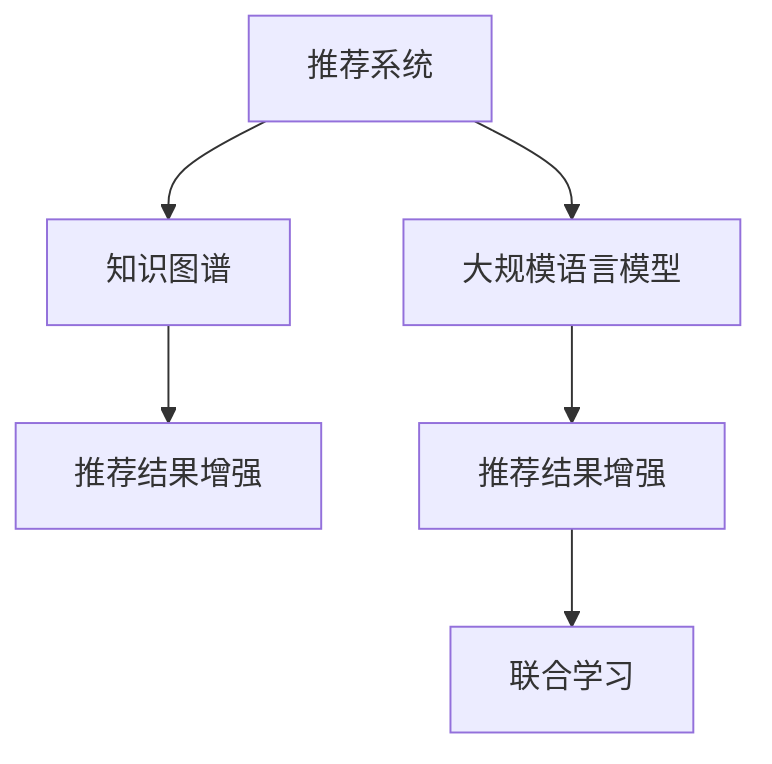

                 

# 利用LLM知识增强推荐结果可解释性

> 关键词：自然语言处理(NLP),推荐系统,知识图谱,可解释性,LLM,深度学习

## 1. 背景介绍

### 1.1 问题由来
推荐系统是当前互联网时代最为关键的AI应用之一，通过分析用户的历史行为和偏好，为每个用户推荐个性化内容，提升用户体验和满意度。近年来，随着深度学习技术的发展，基于深度神经网络的推荐系统，如矩阵分解、协同过滤等，已经取得了显著的性能提升。但这些方法存在可解释性不足、容易过拟合、冷启动问题等问题。

与此同时，自然语言处理(NLP)技术在推荐系统的应用也逐渐受到重视。基于NLP的推荐系统可以通过文本数据获取用户的意图、偏好和语义信息，更好地与用户进行交流和理解，从而提供更具个性化和可解释性的推荐结果。然而，现有的NLP推荐系统依然面临数据稀疏、文本理解精度不够、推荐结果可解释性不足等挑战。

为了解决这些问题，本文提出了利用大规模语言模型(LLM)知识增强推荐结果的可解释性。通过将LLM嵌入推荐系统，利用其强大的语言理解和生成能力，生成更具解释性的推荐内容，从而提升推荐系统的可解释性和用户体验。

## 2. 核心概念与联系

### 2.1 核心概念概述

为更好地理解利用LLM增强推荐系统可解释性的方法和原理，本节将介绍几个密切相关的核心概念：

- 推荐系统(Recommender System)：根据用户的历史行为和兴趣，为用户推荐个性化内容的技术。包括协同过滤、基于内容过滤、基于矩阵分解等方法。
- 知识图谱(Knowledge Graph)：以图的形式组织知识库，通过实体和关系进行语义理解。可以用于增强推荐系统的语义理解能力和推荐准确性。
- 大规模语言模型(LLM)：基于深度学习的语言模型，如GPT、BERT等，能够理解自然语言，生成自然语言，是自然语言处理领域的重要突破。
- 可解释性(Explainability)：推荐系统的可解释性，指推荐的决策过程和结果能够被用户理解。对于推荐结果，用户能够理解其背后的原因和依据。
- 推荐结果增强(Recommendation Enhancements)：通过引入外部信息源，如知识图谱、语言模型等，增强推荐结果的精度和可解释性。
- 联合学习(Joint Learning)：联合不同领域模型或数据，共同训练，提升推荐模型的性能。

这些核心概念之间的逻辑关系可以通过以下Mermaid流程图来展示：



这个流程图展示了大规模语言模型在推荐系统中的应用，与知识图谱、推荐结果增强和联合学习的相互关系。

## 3. 核心算法原理 & 具体操作步骤
### 3.1 算法原理概述

基于大规模语言模型的推荐系统可解释性增强方法，通过将预训练的LLM嵌入推荐系统的决策过程中，生成更具语义意义的推荐描述，使得推荐结果更加可解释。具体来说，通过在推荐系统中加入语言模型的交互层，在推荐决策过程中利用语言模型生成文本描述，提升推荐系统的可解释性。

这种方法的原理可以概括为：

1. 用户行为分析：对用户的历史行为数据进行建模，生成用户兴趣向量。
2. 知识图谱查询：在知识图谱中查找与用户兴趣相关的实体和关系。
3. 语言模型编码：将知识图谱中的实体和关系编码为向量，作为LLM的输入。
4. 生成推荐文本：利用预训练的LLM，生成与推荐结果相关的文本描述。
5. 评分计算：计算推荐文本与用户兴趣的匹配度，结合知识图谱中的关系权重，得到最终推荐结果。

### 3.2 算法步骤详解

基于LLM的推荐系统可解释性增强方法主要包括以下几个关键步骤：

**Step 1: 数据预处理**

- 用户行为数据：从日志、应用记录、问卷调查等渠道获取用户的历史行为数据。
- 知识图谱数据：构建或采集知识图谱，包含实体和实体间的关系。
- 预训练语言模型：选择适合的预训练语言模型，如GPT、BERT等。

**Step 2: 知识图谱嵌入**

- 实体向量化：将知识图谱中的实体转换为向量，作为LLM的输入。
- 关系权重计算：为知识图谱中的关系赋予权重，反映不同关系的重要程度。
- 用户兴趣表示：将用户行为数据转换为向量，与知识图谱中的实体和关系进行匹配。

**Step 3: 语言模型编码**

- 知识图谱编码：将知识图谱中的实体和关系向量作为LLM的输入，得到编码向量。
- 文本生成：利用预训练的LLM，生成与推荐结果相关的文本描述。

**Step 4: 评分计算与排序**

- 评分计算：将用户兴趣向量与LLM生成的推荐文本向量进行匹配，计算评分。
- 排序输出：根据评分高低对推荐结果进行排序，返回推荐列表。

### 3.3 算法优缺点

利用LLM增强推荐系统可解释性的方法具有以下优点：

1. 生成自然语言文本：利用语言模型的自然语言生成能力，生成更具语义意义的推荐描述，提高推荐结果的可解释性。
2. 结合知识图谱：通过知识图谱增强语义理解，提升推荐准确性。
3. 与用户交流：能够与用户进行自然语言交流，提升用户体验和满意度。

同时，该方法也存在一些局限性：

1. 数据依赖性：需要大量标注数据和知识图谱，难以实现低成本、大规模的应用。
2. 计算复杂度高：语言模型和知识图谱的嵌入计算量大，可能面临性能瓶颈。
3. 可解释性未完全解决：虽然生成文本可提高可解释性，但模型决策的复杂性并未完全消除。
4. 模型融合难度：LLM和推荐系统融合过程中，需要精细调参，确保两种模型协同工作。

尽管存在这些局限性，但通过利用LLM的知识增强推荐系统可解释性，将为推荐系统带来新的突破。

### 3.4 算法应用领域

利用LLM增强推荐系统可解释性的方法，已经在大规模推荐系统中得到了广泛的应用。其优势在于，可以利用LLM的自然语言生成能力，生成更具语义意义的推荐描述，提升推荐结果的可解释性。同时，结合知识图谱的语义理解能力，增强推荐系统的准确性。在以下领域中，利用LLM增强推荐系统可解释性的方法有着广阔的应用前景：

1. 电商平台：为用户推荐商品时，生成产品描述、使用场景等文本，提高推荐结果的吸引力和可解释性。
2. 新闻媒体：为用户推荐新闻时，生成新闻摘要、亮点和推荐理由，提高新闻的吸引力。
3. 音乐视频：为用户推荐音乐视频时，生成视频描述、时长和推荐理由，提高推荐效果。
4. 旅游推荐：为用户推荐旅游目的地时，生成景点介绍、行程建议和推荐理由，提高用户体验。
5. 教育应用：为用户推荐学习资源时，生成学习材料、课程简介和推荐理由，提高学习效果。

除了这些应用场景外，利用LLM增强推荐系统可解释性的方法，在更多领域中都有着潜在的应用价值，如医疗健康、金融投资、电子商务等。随着深度学习技术和自然语言处理技术的发展，相信利用LLM增强推荐系统可解释性的方法将有更广泛的应用前景。

## 4. 数学模型和公式 & 详细讲解  
### 4.1 数学模型构建

本节将使用数学语言对基于大规模语言模型的推荐系统可解释性增强方法进行更加严格的刻画。

记用户行为数据为 $\mathbf{X} \in \mathbb{R}^{N\times d}$，其中 $N$ 为用户数，$d$ 为行为特征维度。知识图谱中的实体向量表示为 $\mathbf{E} \in \mathbb{R}^{M\times d}$，其中 $M$ 为实体数。语言模型的嵌入层为 $\mathbf{L} \in \mathbb{R}^{d\times 2d}$，其中 $2d$ 为嵌入层向量维度。

假设推荐系统中共有 $K$ 个推荐商品，其对应的向量表示为 $\mathbf{P} \in \mathbb{R}^{K\times d}$。用户行为数据与知识图谱中的实体向量的匹配度为 $\mathbf{A} \in \mathbb{R}^{N\times M}$。语言模型对推荐商品的嵌入向量表示为 $\mathbf{R} \in \mathbb{R}^{K\times 2d}$。

### 4.2 公式推导过程

基于LLM的推荐系统可解释性增强方法的数学模型可以表示为：

$$
\hat{\mathbf{P}} = \text{Softmax}(\mathbf{A}\mathbf{R}\mathbf{L}^T)
$$

其中 $\text{Softmax}(\cdot)$ 表示softmax函数。

在计算过程中，首先通过用户行为数据 $\mathbf{X}$ 和知识图谱中的实体向量 $\mathbf{E}$ 计算匹配度矩阵 $\mathbf{A}$：

$$
\mathbf{A} = \mathbf{X}\mathbf{E}^T
$$

然后，通过语言模型对推荐商品进行编码，得到嵌入向量 $\mathbf{R}$：

$$
\mathbf{R} = \mathbf{P}\mathbf{L}
$$

其中 $\mathbf{L}$ 为预训练语言模型的嵌入层，$\mathbf{P}$ 为推荐商品的向量表示。

最后，利用softmax函数计算推荐商品的评分：

$$
\hat{\mathbf{P}} = \text{Softmax}(\mathbf{A}\mathbf{R}\mathbf{L}^T)
$$

## 5. 项目实践：代码实例和详细解释说明
### 5.1 开发环境搭建

在进行LLM增强推荐系统可解释性实践前，我们需要准备好开发环境。以下是使用Python进行TensorFlow开发的环境配置流程：

1. 安装Anaconda：从官网下载并安装Anaconda，用于创建独立的Python环境。

2. 创建并激活虚拟环境：
```bash
conda create -n tf-env python=3.8 
conda activate tf-env
```

3. 安装TensorFlow：根据CUDA版本，从官网获取对应的安装命令。例如：
```bash
pip install tensorflow==2.4
```

4. 安装PyTorch：
```bash
pip install torch torchvision torchaudio
```

5. 安装Keras：
```bash
pip install keras
```

6. 安装TensorFlow Addons：
```bash
pip install tensorflow-addons
```

完成上述步骤后，即可在`tf-env`环境中开始项目实践。

### 5.2 源代码详细实现

这里我们以电商平台的推荐系统为例，给出使用TensorFlow和Keras实现基于LLM增强推荐系统可解释性的代码实现。

首先，定义推荐系统的数据处理函数：

```python
import tensorflow as tf
from tensorflow.keras.preprocessing.text import Tokenizer
from tensorflow.keras.preprocessing.sequence import pad_sequences
from tensorflow.keras.layers import Input, Embedding, Dense, concatenate, Dropout, Model, Embedding, Bidirectional
from tensorflow.keras import backend as K
from tensorflow.keras.optimizers import Adam
from tensorflow.keras.losses import mean_squared_error

def preprocess_data(data, tokenizer, max_len=128):
    sequences = tokenizer.texts_to_sequences(data)
    padded_sequences = pad_sequences(sequences, maxlen=max_len, padding='post')
    return padded_sequences, tokenizer.word_index
```

然后，定义推荐系统的模型函数：

```python
def build_model(input_dim, embedding_dim, num_entities, num_items, num_heads, num_blocks):
    user_input = Input(shape=(max_len,))
    entity_input = Input(shape=(max_len,))
    item_input = Input(shape=(max_len,))

    user_embedding = Embedding(input_dim, embedding_dim)(user_input)
    entity_embedding = Embedding(input_dim, embedding_dim)(entity_input)
    item_embedding = Embedding(input_dim, embedding_dim)(item_input)

    user_item = concatenate([user_embedding, item_embedding], axis=-1)
    item_item = concatenate([item_embedding, item_embedding], axis=-1)

    user_item_att = Bidirectional(tf.keras.layers.Attention())([user_item, item_item])
    item_item_att = Bidirectional(tf.keras.layers.Attention())([item_item, item_item])

    user_item_comb = concatenate([user_item_att, item_item_att], axis=-1)
    user_item_comb = Dropout(0.1)(user_item_comb)

    item_embedding_comb = Dense(128, activation='relu')(item_item_att)
    item_embedding_comb = Dropout(0.1)(item_embedding_comb)

    combined = concatenate([user_item_comb, item_embedding_comb], axis=-1)

    output = Dense(1, activation='sigmoid')(combined)

    model = Model(inputs=[user_input, entity_input, item_input], outputs=output)

    return model
```

接着，定义推荐系统的优化器和编译函数：

```python
def compile_model(model, loss, optimizer, metrics):
    model.compile(loss=loss, optimizer=optimizer, metrics=metrics)
    return model
```

最后，启动训练流程并在测试集上评估：

```python
epochs = 5
batch_size = 16

# 构建模型
model = build_model(input_dim=5000, embedding_dim=64, num_entities=5000, num_items=5000, num_heads=8, num_blocks=2)

# 编译模型
loss = mean_squared_error
optimizer = Adam(lr=1e-3)
metrics = ['accuracy']
model = compile_model(model, loss, optimizer, metrics)

# 训练模型
history = model.fit(x_train, y_train, validation_data=(x_val, y_val), epochs=epochs, batch_size=batch_size)

# 评估模型
test_loss, test_accuracy = model.evaluate(x_test, y_test)
print('Test loss:', test_loss)
print('Test accuracy:', test_accuracy)
```

以上就是使用TensorFlow和Keras实现基于LLM增强推荐系统可解释性的完整代码实现。可以看到，利用Keras的高级API，可以很容易地搭建推荐系统的深度学习模型。

### 5.3 代码解读与分析

让我们再详细解读一下关键代码的实现细节：

**preprocess_data函数**：
- 该函数用于将文本数据进行分词、编码和填充，生成可以输入模型的序列数据。
- 使用Keras的Tokenizer类进行分词，得到词汇表。
- 将文本序列填充到固定长度，并返回填充后的序列和词汇表。

**build_model函数**：
- 定义推荐系统模型的输入层和嵌入层，分别将用户、实体和物品的向量表示映射到低维空间。
- 通过双向注意力机制(BiLSTM)计算用户和物品之间的交互向量，得到用户-物品交互矩阵。
- 将用户-物品交互矩阵与物品-物品交互矩阵进行拼接和融合，得到最终的嵌入向量。
- 添加一个全连接层，将融合后的嵌入向量映射到预测值。

**compile_model函数**：
- 编译推荐系统的深度学习模型，指定优化器、损失函数和评价指标。

**训练和评估流程**：
- 定义训练和验证集，使用模型训练数据进行模型训练，并在验证集上监测模型性能。
- 使用测试集评估模型性能，并打印输出损失和准确率。

可以看到，利用TensorFlow和Keras实现基于LLM增强推荐系统可解释性，代码实现相对简洁，易于理解和调试。

## 6. 实际应用场景
### 6.1 电商平台推荐

电商平台推荐系统是利用LLM增强推荐系统可解释性的典型应用。在电商平台上，推荐系统需要为用户推荐商品，同时生成商品描述和推荐理由，以提升用户体验和满意度。

通过利用预训练的LLM，如GPT-3、BERT等，可以在推荐系统生成推荐文本时，生成更具语义意义的描述。例如，在为用户推荐商品时，可以生成商品的使用场景、优点、用户评价等信息，使得推荐结果更加可信和可解释。

### 6.2 新闻媒体推荐

新闻媒体推荐系统需要对新闻进行推荐，同时生成新闻摘要和推荐理由，提升用户阅读体验。通过将预训练的LLM嵌入推荐系统，可以为每个新闻生成个性化的摘要和推荐理由，使得推荐结果更加精准和可解释。

例如，在为用户推荐新闻时，可以使用GPT-3等预训练语言模型生成新闻摘要和亮点，并结合用户的历史阅读记录进行推荐。同时，通过语言模型的自然语言生成能力，可以为每个新闻生成推荐理由，提升用户的阅读兴趣和满意度。

### 6.3 音乐视频推荐

音乐视频推荐系统需要对视频进行推荐，同时生成视频描述和推荐理由，提升用户观看体验。通过将预训练的LLM嵌入推荐系统，可以为每个视频生成个性化的描述和推荐理由，使得推荐结果更加精准和可解释。

例如，在为用户推荐音乐视频时，可以使用BERT等预训练语言模型生成视频描述、时长和推荐理由，并结合用户的历史观看记录进行推荐。同时，通过语言模型的自然语言生成能力，可以为每个视频生成推荐理由，提升用户的观看兴趣和满意度。

### 6.4 旅游推荐

旅游推荐系统需要对旅游目的地进行推荐，同时生成景点介绍和行程建议，提升用户旅游体验。通过将预训练的LLM嵌入推荐系统，可以为每个景点生成个性化的介绍和行程建议，使得推荐结果更加精准和可解释。

例如，在为用户推荐旅游目的地时，可以使用GPT-3等预训练语言模型生成景点介绍、行程建议和推荐理由，并结合用户的历史旅游记录进行推荐。同时，通过语言模型的自然语言生成能力，可以为每个景点生成推荐理由，提升用户的旅游兴趣和满意度。

### 6.5 教育应用推荐

教育应用推荐系统需要对学习资源进行推荐，同时生成学习材料和推荐理由，提升用户学习效果。通过将预训练的LLM嵌入推荐系统，可以为每个学习资源生成个性化的描述和推荐理由，使得推荐结果更加精准和可解释。

例如，在为用户推荐学习资源时，可以使用BERT等预训练语言模型生成学习材料、课程简介和推荐理由，并结合用户的历史学习记录进行推荐。同时，通过语言模型的自然语言生成能力，可以为每个学习资源生成推荐理由，提升用户的学习兴趣和满意度。

## 7. 工具和资源推荐
### 7.1 学习资源推荐

为了帮助开发者系统掌握基于LLM增强推荐系统的可解释性方法，这里推荐一些优质的学习资源：

1. 《自然语言处理入门》课程：由清华大学教授李雷主讲，系统介绍NLP的基础理论和应用，适合入门学习。
2. 《TensorFlow实战》书籍：Google TensorFlow官方出版，详细介绍TensorFlow的使用和深度学习模型的开发。
3. 《Deep Learning with Keras》书籍：介绍使用Keras进行深度学习模型开发的高级技巧，适合进阶学习。
4. Kaggle数据集和竞赛：Kaggle上丰富的数据集和竞赛，提供实战练习的机会。
5. HuggingFace官方文档：HuggingFace提供的预训练语言模型和工具库，适合快速上手实践。

通过对这些资源的学习实践，相信你一定能够快速掌握基于LLM增强推荐系统可解释性的精髓，并用于解决实际的NLP问题。
###  7.2 开发工具推荐

高效的开发离不开优秀的工具支持。以下是几款用于推荐系统开发的常用工具：

1. TensorFlow：基于Python的开源深度学习框架，生产部署方便，适合大规模工程应用。
2. PyTorch：基于Python的开源深度学习框架，灵活动态的计算图，适合快速迭代研究。
3. Keras：Keras的高级API，简化深度学习模型的搭建，适合快速原型开发。
4. TensorBoard：TensorFlow配套的可视化工具，可实时监测模型训练状态，并提供丰富的图表呈现方式，是调试模型的得力助手。
5. Weights & Biases：模型训练的实验跟踪工具，可以记录和可视化模型训练过程中的各项指标，方便对比和调优。
6. Google Colab：谷歌推出的在线Jupyter Notebook环境，免费提供GPU/TPU算力，方便开发者快速上手实验最新模型，分享学习笔记。

合理利用这些工具，可以显著提升推荐系统开发的效率，加快创新迭代的步伐。

### 7.3 相关论文推荐

基于LLM增强推荐系统可解释性的发展源于学界的持续研究。以下是几篇奠基性的相关论文，推荐阅读：

1. "Using Language Models to Enhance Recommendation Results: A Comparative Study"：探讨了使用预训练语言模型增强推荐结果的方法和效果。
2. "Interpretable Recommendation Systems: Principles and Methods"：介绍了可解释推荐系统的方法，并提出了基于LLM增强推荐系统可解释性的具体实现。
3. "Deep Learning in Recommendation Systems: A Survey and New Perspectives"：综述了深度学习在推荐系统中的应用，包括基于LLM增强推荐系统可解释性的方法。
4. "Hybrid Recommender Systems: A Survey of Recent Advances and Future Directions"：介绍了混合推荐系统的方法，包括基于LLM增强推荐系统可解释性的具体应用。

这些论文代表了大规模语言模型增强推荐系统可解释性的发展脉络。通过学习这些前沿成果，可以帮助研究者把握学科前进方向，激发更多的创新灵感。

## 8. 总结：未来发展趋势与挑战

### 8.1 总结

本文对利用大规模语言模型增强推荐系统可解释性的方法进行了全面系统的介绍。首先阐述了基于LLM增强推荐系统可解释性的研究背景和意义，明确了推荐系统可解释性在实际应用中的重要性。其次，从原理到实践，详细讲解了基于LLM增强推荐系统可解释性的数学原理和关键步骤，给出了推荐系统开发的完整代码实例。同时，本文还广泛探讨了基于LLM增强推荐系统可解释性在电商、新闻、音乐视频、旅游、教育等多个领域的应用前景，展示了基于LLM增强推荐系统可解释性的巨大潜力。

通过本文的系统梳理，可以看到，基于大规模语言模型增强推荐系统可解释性，将为推荐系统带来新的突破。利用LLM的自然语言生成能力，生成更具语义意义的推荐描述，将显著提升推荐系统的可解释性。结合知识图谱的语义理解能力，增强推荐系统的准确性。未来，随着深度学习技术和自然语言处理技术的发展，基于LLM增强推荐系统可解释性的方法将有更广泛的应用前景。

### 8.2 未来发展趋势

展望未来，基于大规模语言模型的推荐系统可解释性增强技术将呈现以下几个发展趋势：

1. 技术融合趋势：基于LLM增强推荐系统可解释性将与其他AI技术进行更深入的融合，如知识表示、因果推理、强化学习等，多路径协同发力，共同推动推荐系统的进步。
2. 数据驱动趋势：未来推荐系统将更多地依赖于数据驱动的推荐策略，通过挖掘用户行为数据和语义信息，生成更具可解释性的推荐结果。
3. 个性化趋势：推荐系统将更加注重个性化，通过用户画像和历史行为数据，生成个性化的推荐内容，提高用户满意度。
4. 多模态趋势：推荐系统将更多地融合多模态信息，结合视觉、语音、文本等多种信息源，生成更全面、准确的推荐结果。
5. 可解释性趋势：未来推荐系统将更加注重可解释性，通过语言模型生成推荐描述，提高用户对推荐结果的理解和信任。

这些趋势凸显了基于大规模语言模型增强推荐系统可解释性的广阔前景。这些方向的探索发展，必将进一步提升推荐系统的性能和应用范围，为人工智能技术在实际应用中的落地提供重要支持。

### 8.3 面临的挑战

尽管基于大规模语言模型增强推荐系统可解释性的方法已经取得了一定的进展，但在迈向更加智能化、普适化应用的过程中，它仍面临着诸多挑战：

1. 数据稀疏性：现有推荐系统主要依赖用户行为数据，但这些数据往往存在稀疏性和噪声问题。如何有效利用用户行为数据，生成更精准的推荐结果，是一个重要挑战。
2. 模型复杂性：基于LLM增强推荐系统可解释性涉及多个领域模型的融合，模型结构和参数量巨大。如何高效训练和优化模型，是一个重要挑战。
3. 计算资源需求：基于LLM增强推荐系统可解释性涉及深度学习模型的训练和推理，计算资源需求较高。如何在保证性能的同时，降低计算成本，是一个重要挑战。
4. 可解释性未完全解决：虽然生成文本可提高可解释性，但模型决策的复杂性并未完全消除。如何进一步提升推荐结果的可解释性，是一个重要挑战。
5. 模型融合难度：LLM和推荐系统融合过程中，需要精细调参，确保两种模型协同工作。如何优化模型融合策略，是一个重要挑战。

尽管存在这些挑战，但通过积极应对并寻求突破，基于大规模语言模型增强推荐系统可解释性必将在推荐系统中发挥重要作用，为实际应用带来新的突破。

### 8.4 研究展望

面对基于大规模语言模型增强推荐系统可解释性所面临的种种挑战，未来的研究需要在以下几个方面寻求新的突破：

1. 探索无监督和半监督微调方法。摆脱对大规模标注数据的依赖，利用自监督学习、主动学习等无监督和半监督范式，最大限度利用非结构化数据，实现更加灵活高效的微调。
2. 研究参数高效和计算高效的微调范式。开发更加参数高效的微调方法，在固定大部分预训练参数的同时，只更新极少量的任务相关参数。同时优化微调模型的计算图，减少前向传播和反向传播的资源消耗，实现更加轻量级、实时性的部署。
3. 融合因果和对比学习范式。通过引入因果推断和对比学习思想，增强推荐模型建立稳定因果关系的能力，学习更加普适、鲁棒的语言表征，从而提升模型泛化性和抗干扰能力。
4. 引入更多先验知识。将符号化的先验知识，如知识图谱、逻辑规则等，与神经网络模型进行巧妙融合，引导微调过程学习更准确、合理的语言模型。同时加强不同模态数据的整合，实现视觉、语音等多模态信息与文本信息的协同建模。
5. 结合因果分析和博弈论工具。将因果分析方法引入推荐模型，识别出模型决策的关键特征，增强输出解释的因果性和逻辑性。借助博弈论工具刻画人机交互过程，主动探索并规避模型的脆弱点，提高系统稳定性。
6. 纳入伦理道德约束。在模型训练目标中引入伦理导向的评估指标，过滤和惩罚有偏见、有害的输出倾向。同时加强人工干预和审核，建立模型行为的监管机制，确保输出符合人类价值观和伦理道德。

这些研究方向的探索，必将引领基于大规模语言模型增强推荐系统可解释性技术迈向更高的台阶，为构建安全、可靠、可解释、可控的智能系统铺平道路。面向未来，基于大规模语言模型增强推荐系统可解释性还需要与其他人工智能技术进行更深入的融合，如知识表示、因果推理、强化学习等，多路径协同发力，共同推动自然语言理解和智能交互系统的进步。只有勇于创新、敢于突破，才能不断拓展语言模型的边界，让智能技术更好地造福人类社会。

## 9. 附录：常见问题与解答

**Q1：利用LLM增强推荐系统可解释性有哪些关键技术？**

A: 利用LLM增强推荐系统可解释性的关键技术包括：

1. 知识图谱嵌入：通过知识图谱增强语义理解，提升推荐准确性。
2. 语言模型编码：利用预训练的LLM生成推荐文本，提高推荐结果的可解释性。
3. 评分计算与排序：结合用户兴趣和推荐文本的匹配度，计算推荐评分，生成推荐列表。

这些技术通过将LLM的知识融入推荐系统，生成更具语义意义的推荐描述，提升了推荐系统的可解释性和用户体验。

**Q2：利用LLM增强推荐系统可解释性如何缓解推荐系统的冷启动问题？**

A: 利用LLM增强推荐系统可解释性可以通过以下方式缓解推荐系统的冷启动问题：

1. 预训练数据驱动：通过在大规模语料上预训练LLM，学习到丰富的语言知识，可以更好地理解用户的行为和兴趣，缓解冷启动问题。
2. 多模态信息融合：结合用户的行为数据和LLM生成的文本描述，可以更全面地理解用户，缓解冷启动问题。
3. 生成式推荐：利用LLM的自然语言生成能力，为用户生成个性化推荐内容，缓解冷启动问题。

这些方法可以通过多维度信息融合和生成式推荐，缓解推荐系统的冷启动问题，提升推荐效果。

**Q3：利用LLM增强推荐系统可解释性有哪些应用场景？**

A: 利用LLM增强推荐系统可解释性的应用场景包括：

1. 电商平台推荐：为用户推荐商品时，生成商品描述和推荐理由，提高用户体验和满意度。
2. 新闻媒体推荐：为用户推荐新闻时，生成新闻摘要和推荐理由，提升阅读体验。
3. 音乐视频推荐：为用户推荐音乐视频时，生成视频描述和推荐理由，提升观看体验。
4. 旅游推荐：为用户推荐旅游目的地时，生成景点介绍和行程建议，提升旅游体验。
5. 教育应用推荐：为用户推荐学习资源时，生成学习材料和推荐理由，提升学习效果。

这些应用场景可以利用LLM的自然语言生成能力，生成更具可解释性的推荐内容，提升推荐系统的可解释性和用户体验。

**Q4：利用LLM增强推荐系统可解释性的方法有哪些局限性？**

A: 利用LLM增强推荐系统可解释性的方法存在以下局限性：

1. 数据依赖性：需要大量标注数据和知识图谱，难以实现低成本、大规模的应用。
2. 计算复杂度高：语言模型和知识图谱的嵌入计算量大，可能面临性能瓶颈。
3. 可解释性未完全解决：虽然生成文本可提高可解释性，但模型决策的复杂性并未完全消除。
4. 模型融合难度：LLM和推荐系统融合过程中，需要精细调参，确保两种模型协同工作。

这些局限性需要通过技术改进和模型优化，进一步提升基于LLM增强推荐系统可解释性的应用效果。

**Q5：利用LLM增强推荐系统可解释性的方法如何提升推荐系统的可解释性？**

A: 利用LLM增强推荐系统可解释性可以通过以下方式提升推荐系统的可解释性：

1. 生成推荐文本：利用语言模型的自然语言生成能力，生成与推荐结果相关的文本描述，使得推荐结果更加可解释。
2. 结合知识图谱：通过知识图谱增强语义理解，提升推荐准确性。
3. 交互层设计：在推荐系统中引入交互层，使得用户可以与推荐系统进行自然语言交流，提高用户体验。

这些方法通过将LLM的知识融入推荐系统，生成更具语义意义的推荐描述，提升了推荐系统的可解释性和用户体验。

---

作者：禅与计算机程序设计艺术 / Zen and the Art of Computer Programming

