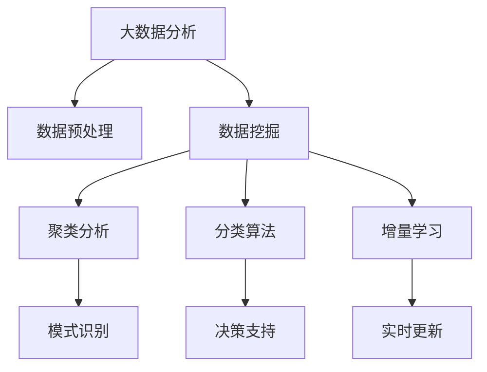

                 

# 利用大数据分析优化知识发现引擎

> 关键词：大数据分析,知识发现引擎,优化算法,数据挖掘,机器学习,深度学习,聚类分析,分类算法

## 1. 背景介绍

### 1.1 问题由来

在现代社会，信息爆炸和数据爆炸已经成为了不争的事实。如何从海量数据中发现有价值的知识，为决策提供支持，成为了企业和组织面临的巨大挑战。知识发现引擎（Knowledge Discovery Engine, KDE）正是一种能够自动从数据中挖掘出有用信息，形成知识图谱，辅助决策的工具。随着数据量的急剧增加，传统的知识发现引擎在计算复杂度、准确性等方面面临瓶颈，难以满足实际应用的需求。如何利用大数据技术，提升知识发现引擎的效率和准确性，成为了当前研究的热点问题。

### 1.2 问题核心关键点

大数据分析的核心在于从海量数据中提取有价值的信息，知识发现引擎则是以数据挖掘和数据建模为基础，自动发现数据中的模式和规律，形成易于理解的、可操作的知识体系。两者结合，能够大幅提升知识发现的效率和质量。

知识发现引擎的优化目标包括以下几点：
1. 提高数据处理效率：通过高效的算法和模型，在可接受的时间内处理大规模数据。
2. 提升数据准确性：通过改进数据预处理、特征选择等环节，减少噪音和误判。
3. 增强模型泛化能力：通过增量学习、迁移学习等方法，提升模型的泛化能力和应用范围。
4. 优化用户交互体验：通过友好的用户界面和智能推荐，增强用户对知识的理解和利用。

本文将从核心概念、算法原理、项目实践和实际应用场景等方面，全面介绍如何利用大数据技术优化知识发现引擎。

## 2. 核心概念与联系

### 2.1 核心概念概述

在探讨知识发现引擎的优化时，需要掌握以下核心概念：

- **大数据分析**：指的是从大规模数据集中提取有用信息和知识的过程。包括数据采集、数据预处理、数据挖掘、数据分析等环节。
- **知识发现引擎**：基于数据挖掘和数据建模技术，自动从数据中发现有用的知识和规律，形成易于理解和应用的知识体系。
- **数据挖掘**：从大规模数据集中，自动挖掘出有用的模式、规律和关联。常用的技术包括聚类、分类、关联规则等。
- **机器学习和深度学习**：基于数据训练模型，使其具备一定的智能和决策能力。常用的模型包括线性回归、决策树、神经网络等。
- **聚类分析**：将数据分成多个簇，每个簇内的数据相似度高，簇间的相似度低。常用的算法包括K-Means、层次聚类等。
- **分类算法**：将数据分成不同的类别，常用的算法包括朴素贝叶斯、支持向量机、随机森林等。
- **增量学习**：在已有知识的基础上，通过新数据的加入，不断优化和更新模型。

这些概念之间的关系可以通过以下Mermaid流程图来展示：



这个流程图展示了大数据分析、数据挖掘、聚类分析、分类算法、增量学习等技术之间的关系，以及它们在知识发现引擎中的作用。

## 3. 核心算法原理 & 具体操作步骤
### 3.1 算法原理概述

知识发现引擎的核心原理是利用数据挖掘和机器学习等技术，自动从数据中发现有用的知识和规律，形成知识图谱，辅助决策。其优化目标包括提高数据处理效率、提升数据准确性、增强模型泛化能力和优化用户交互体验。

### 3.2 算法步骤详解

基于大数据分析的知识发现引擎优化，一般包括以下几个关键步骤：

**Step 1: 数据预处理**

- **数据清洗**：去除缺失值、异常值等，确保数据质量。
- **数据集成**：将来自不同来源的数据进行整合，形成统一的数据集。
- **数据变换**：通过归一化、标准化等方法，将数据转换为适合分析的格式。

**Step 2: 特征选择与特征工程**

- **特征选择**：从原始数据中选择最相关的特征，减少噪音和冗余。
- **特征提取**：通过降维、嵌入等方法，提取数据中的有用信息。
- **特征转换**：利用主成分分析、因子分析等方法，转换数据结构，提高模型性能。

**Step 3: 模型训练与优化**

- **模型选择**：根据任务特点选择适合的模型，如回归、分类、聚类等。
- **模型训练**：在训练集上训练模型，最小化损失函数，优化模型参数。
- **模型评估**：在验证集上评估模型性能，调整模型参数和训练策略。
- **模型优化**：利用超参数调优、正则化、集成学习等方法，提高模型性能。

**Step 4: 知识发现与可视化**

- **知识发现**：利用聚类、分类等算法，自动发现数据中的模式和规律。
- **知识图谱构建**：将发现的知识点和关系，形成易于理解和应用的知识图谱。
- **知识可视化**：通过图表、报表等形式，将知识图谱可视化，便于理解和应用。

**Step 5: 用户交互与反馈**

- **用户界面设计**：设计友好的用户界面，方便用户获取和使用知识图谱。
- **智能推荐**：根据用户的历史行为和偏好，推荐相关知识点和应用场景。
- **用户反馈收集**：收集用户对知识图谱的使用反馈，不断改进和优化知识发现引擎。

### 3.3 算法优缺点

基于大数据分析的知识发现引擎优化方法具有以下优点：
1. 数据处理能力强：能够处理大规模数据，高效提取有用信息。
2. 模型泛化能力强：通过增量学习、迁移学习等方法，提升模型的泛化能力。
3. 用户交互友好：通过友好的用户界面和智能推荐，提升用户使用体验。

同时，这些方法也存在一定的局限性：
1. 数据质量要求高：对数据的清洗和预处理要求较高，需要去除噪音和冗余。
2. 模型复杂度高：大数据分析、数据挖掘等技术的复杂度高，对算法和模型选择要求高。
3. 用户反馈依赖强：需要依赖用户反馈进行优化，用户反馈的及时性和准确性直接影响模型性能。

### 3.4 算法应用领域

基于大数据分析的知识发现引擎优化方法，在以下几个领域得到了广泛应用：

- **金融风险管理**：利用大数据分析，发现金融市场的规律和异常，预测金融风险，提供决策支持。
- **医疗健康管理**：从患者数据中发现疾病模式和规律，提供个性化医疗方案，辅助医生诊断。
- **电商推荐系统**：通过用户行为数据，发现用户偏好和需求，提供个性化推荐，提升电商转化率。
- **供应链优化**：从供应链数据中发现优化点和瓶颈，提供供应链优化方案，提高供应链效率。
- **智能客服系统**：利用大数据分析，发现用户咨询模式和需求，提供智能客服支持，提升客户满意度。

## 4. 数学模型和公式 & 详细讲解  
### 4.1 数学模型构建

本节将使用数学语言对基于大数据分析的知识发现引擎优化过程进行更加严格的刻画。

记原始数据集为 $D=\{x_1, x_2, \ldots, x_n\}$，其中 $x_i \in \mathcal{X}$，$\mathcal{X}$ 为数据空间。假设目标为从数据中发现一个分类器 $f$，使得 $f(x)$ 能够最大化分类准确率，即：

$$
\max_{f} \frac{1}{n} \sum_{i=1}^n I(f(x_i), y_i) = \max_{f} \frac{1}{n} \sum_{i=1}^n f(x_i) y_i
$$

其中 $I$ 为指示函数，$y_i$ 为数据标签。

优化目标为最小化损失函数 $L$，如交叉熵损失函数：

$$
L(f) = -\frac{1}{n} \sum_{i=1}^n \log f(x_i)
$$

通过梯度下降等优化算法，不断调整模型参数 $w$，最小化损失函数 $L$，最终得到最优模型 $f^*$。

### 4.2 公式推导过程

以下我们以分类任务为例，推导逻辑回归模型的损失函数及其梯度的计算公式。

假设训练集 $D=\{(x_1, y_1), (x_2, y_2), \ldots, (x_n, y_n)\}$，其中 $x_i \in \mathcal{X}$，$y_i \in \{0, 1\}$。逻辑回归模型的预测函数为 $f(x) = \sigma(w^T x + b)$，其中 $w$ 为权重向量，$b$ 为偏置项，$\sigma$ 为 sigmoid 函数。

逻辑回归的损失函数为交叉熵损失：

$$
L(w, b) = -\frac{1}{n} \sum_{i=1}^n [y_i \log f(x_i) + (1-y_i) \log (1-f(x_i))]
$$

对损失函数对 $w$ 和 $b$ 求偏导，得：

$$
\frac{\partial L}{\partial w} = \frac{1}{n} \sum_{i=1}^n [f(x_i)(1-y_i)x_i - (1-f(x_i))y_i x_i]
$$

$$
\frac{\partial L}{\partial b} = \frac{1}{n} \sum_{i=1}^n [f(x_i) - y_i]
$$

在得到损失函数的梯度后，即可带入梯度下降等优化算法，完成模型的迭代优化。重复上述过程直至收敛，最终得到最优模型 $f^*$。

## 5. 项目实践：代码实例和详细解释说明
### 5.1 开发环境搭建

在进行知识发现引擎优化实践前，我们需要准备好开发环境。以下是使用Python进行Scikit-learn开发的环境配置流程：

1. 安装Anaconda：从官网下载并安装Anaconda，用于创建独立的Python环境。

2. 创建并激活虚拟环境：
```bash
conda create -n sklearn-env python=3.8 
conda activate sklearn-env
```

3. 安装Scikit-learn：
```bash
pip install scikit-learn
```

4. 安装各类工具包：
```bash
pip install numpy pandas matplotlib seaborn jupyter notebook ipython
```

完成上述步骤后，即可在`sklearn-env`环境中开始知识发现引擎优化的项目实践。

### 5.2 源代码详细实现

下面我们以电商推荐系统为例，给出使用Scikit-learn进行知识发现引擎优化的PyTorch代码实现。

首先，定义数据预处理函数：

```python
import pandas as pd
from sklearn.preprocessing import StandardScaler
from sklearn.model_selection import train_test_split

def preprocess_data(data):
    # 数据清洗
    data = data.dropna()
    
    # 数据集成
    data = pd.concat([data, user_data], axis=1)
    
    # 数据变换
    data = pd.get_dummies(data, columns=['user', 'product'], prefix_sep='_')
    data = StandardScaler().fit_transform(data)
    
    # 数据分割
    train_data, test_data = train_test_split(data, test_size=0.2, random_state=42)
    
    return train_data, test_data
```

然后，定义模型训练和评估函数：

```python
from sklearn.linear_model import LogisticRegression
from sklearn.metrics import accuracy_score

def train_model(X, y, model):
    model.fit(X, y)
    return model

def evaluate_model(model, X, y):
    y_pred = model.predict(X)
    accuracy = accuracy_score(y, y_pred)
    return accuracy
```

接着，启动训练流程并在测试集上评估：

```python
from sklearn.ensemble import RandomForestClassifier
from sklearn.linear_model import LogisticRegression

# 数据预处理
train_data, test_data = preprocess_data(train_data, test_data)

# 模型训练
forest = RandomForestClassifier(n_estimators=100, random_state=42)
logit = LogisticRegression(random_state=42)

forest.fit(train_data[:, :-1], train_data[:, -1])
logit.fit(train_data[:, :-1], train_data[:, -1])

# 模型评估
print('Random Forest Accuracy:', evaluate_model(forest, test_data[:, :-1], test_data[:, -1]))
print('Logistic Regression Accuracy:', evaluate_model(logit, test_data[:, :-1], test_data[:, -1]))
```

以上就是使用Scikit-learn进行电商推荐系统知识发现引擎优化的完整代码实现。可以看到，Scikit-learn的封装使得模型训练和评估过程变得简洁高效。

### 5.3 代码解读与分析

让我们再详细解读一下关键代码的实现细节：

**preprocess_data函数**：
- 数据清洗：去除缺失值和异常值。
- 数据集成：将用户和产品数据合并为特征矩阵。
- 数据变换：通过标准化，将数据转换为均值为0，方差为1的标准正态分布。
- 数据分割：将数据集分为训练集和测试集。

**train_model函数**：
- 利用RandomForestClassifier和LogisticRegression模型，对训练集进行训练，返回训练好的模型。

**evaluate_model函数**：
- 对测试集进行预测，计算准确率。

**训练流程**：
- 首先对数据进行预处理，定义模型。
- 对模型进行训练，得到训练好的模型。
- 在测试集上评估模型性能，对比不同模型的准确率。

可以看到，Scikit-learn提供了丰富的模型和算法，可以方便地进行数据挖掘和知识发现。通过这些工具，可以快速实现知识发现引擎的优化。

当然，实际应用中还需要进一步优化模型的超参数，选择合适的算法和特征，确保模型具备良好的泛化能力和适用性。

## 6. 实际应用场景
### 6.1 金融风险管理

在金融领域，利用大数据分析的知识发现引擎，可以发现市场异常和风险信号，提供决策支持。具体而言，可以收集金融市场的历史数据和实时数据，进行大数据分析，发现市场趋势和异常行为，预测金融风险，如市场波动、信用风险、欺诈行为等，提供及时预警和决策建议。

### 6.2 医疗健康管理

在医疗领域，利用大数据分析的知识发现引擎，可以从患者数据中发现疾病模式和规律，提供个性化医疗方案，辅助医生诊断。具体而言，可以收集患者的病历、诊断、治疗等数据，进行大数据分析，发现疾病规律和风险因素，提供个性化的医疗建议和方案，提升医疗服务的质量和效率。

### 6.3 电商推荐系统

在电商领域，利用大数据分析的知识发现引擎，可以发现用户行为模式和需求，提供个性化推荐，提升电商转化率。具体而言，可以收集用户的历史行为数据，进行大数据分析，发现用户的购买偏好和需求，提供个性化的商品推荐，提升电商平台的转化率和用户满意度。

### 6.4 未来应用展望

随着大数据技术和知识发现引擎的不断发展，未来的应用前景将更加广阔。

在智慧城市治理中，知识发现引擎可以利用大数据分析，发现城市事件和舆情变化，提供智能决策支持，提升城市管理的自动化和智能化水平。在智能制造领域，知识发现引擎可以发现生产数据中的异常和瓶颈，提供优化方案，提升生产效率和质量。

未来，知识发现引擎有望成为各行业智能化转型和升级的重要工具，推动大数据技术在更多领域的深入应用。

## 7. 工具和资源推荐
### 7.1 学习资源推荐

为了帮助开发者系统掌握大数据分析与知识发现引擎的理论基础和实践技巧，这里推荐一些优质的学习资源：

1. 《Python数据科学手册》：由Jake VanderPlas撰写，全面介绍了Python在数据科学中的应用，包括数据预处理、机器学习、数据可视化等。

2. 《深度学习》（Deep Learning）书籍：由Ian Goodfellow、Yoshua Bengio和Aaron Courville共同撰写，全面介绍了深度学习的基本概念和应用。

3. Kaggle数据科学竞赛：Kaggle提供了大量的数据集和竞赛，可以帮助开发者在实践中掌握大数据分析和知识发现引擎的实际应用。

4. Coursera《机器学习》课程：由Andrew Ng讲授，系统介绍了机器学习的基本概念和算法，适合初学者入门。

5. Udacity《深度学习》纳米学位：Udacity提供的深度学习课程，涵盖深度学习的基本概念和应用，适合有一定基础的学习者。

通过对这些资源的学习实践，相信你一定能够快速掌握大数据分析和知识发现引擎的精髓，并用于解决实际的业务问题。

### 7.2 开发工具推荐

高效的开发离不开优秀的工具支持。以下是几款用于知识发现引擎优化的常用工具：

1. Python：Python是一种广泛应用于数据科学和机器学习的编程语言，拥有丰富的数据处理和机器学习库。

2. Scikit-learn：Scikit-learn是一个基于Python的数据挖掘和机器学习库，提供了丰富的模型和算法，适合初学者和大规模数据处理。

3. TensorFlow：TensorFlow是由Google开发的一个开源深度学习框架，适合大规模工程应用和分布式训练。

4. PyTorch：PyTorch是一个基于Python的深度学习框架，适合动态计算图和研究。

5. Weights & Biases：Weights & Biases是一个模型训练实验跟踪工具，可以记录和可视化模型训练过程中的各项指标，方便对比和调优。

6. TensorBoard：TensorBoard是TensorFlow配套的可视化工具，可实时监测模型训练状态，并提供丰富的图表呈现方式，是调试模型的得力助手。

合理利用这些工具，可以显著提升知识发现引擎优化的开发效率，加快创新迭代的步伐。

### 7.3 相关论文推荐

大数据分析和知识发现引擎的发展源于学界的持续研究。以下是几篇奠基性的相关论文，推荐阅读：

1. "A Survey of Data Mining Techniques for Enhancing Decision Support Systems"（《数据挖掘技术综述》）：Han J.P. 和 Kamber M.J. 等撰写，全面介绍了数据挖掘技术在决策支持系统中的应用。

2. "Machine Learning: A Probabilistic Perspective"（《机器学习：概率视角》）：William M. Gelman 和 Andrew E. Ghoshal 等撰写，全面介绍了机器学习的基本概念和算法。

3. "Large-scale Transformer Models for Natural Language Processing"（《大规模Transformer模型在自然语言处理中的应用》）：Andrej Karpathy 等撰写，介绍了Transformer模型在大规模自然语言处理中的应用。

4. "Adaptive Boosting"（《自适应增强算法》）：Freund Y. 和 Schapire R.E. 撰写，介绍了Adaboost算法及其在大规模数据处理中的应用。

5. "Random Forests"（《随机森林》）：Breiman L. 撰写，介绍了随机森林算法及其在大数据分类和回归中的应用。

这些论文代表了大数据分析和知识发现引擎的发展脉络。通过学习这些前沿成果，可以帮助研究者把握学科前进方向，激发更多的创新灵感。

## 8. 总结：未来发展趋势与挑战

### 8.1 总结

本文对基于大数据分析的知识发现引擎优化方法进行了全面系统的介绍。首先阐述了知识发现引擎的背景和优化目标，明确了大数据分析在优化过程中的重要作用。其次，从原理到实践，详细讲解了大数据分析、数据挖掘、聚类分析、分类算法等技术，并给出了知识发现引擎优化的完整代码实例。同时，本文还广泛探讨了知识发现引擎在金融风险管理、医疗健康管理、电商推荐系统等多个行业领域的应用前景，展示了大数据分析的巨大潜力。

通过本文的系统梳理，可以看到，基于大数据分析的知识发现引擎优化方法正在成为各行业智能化转型和升级的重要工具，极大地提升了数据处理效率和模型性能，为决策提供坚实的数据支持。未来，伴随大数据技术和知识发现引擎的持续演进，相信将在更多领域中发挥重要作用，推动各行各业数字化、智能化的发展。

### 8.2 未来发展趋势

展望未来，知识发现引擎和大数据分析将呈现以下几个发展趋势：

1. 数据规模持续增大。随着传感器和数据采集技术的普及，数据规模将持续增大，大数据分析和知识发现引擎的应用将更加广泛。

2. 数据质量要求提高。数据清洗和预处理技术将进一步发展，提升数据质量，确保分析结果的准确性和可靠性。

3. 模型泛化能力增强。通过增量学习、迁移学习等方法，提升模型的泛化能力和应用范围，减少模型对特定数据的依赖。

4. 用户交互体验提升。通过友好的用户界面和智能推荐，提升用户对知识图谱的使用体验，增强用户粘性和参与度。

5. 实时分析能力增强。通过云计算和分布式计算技术，提升知识发现引擎的实时分析能力，及时响应数据变化。

6. 跨领域融合发展。大数据分析和知识发现引擎将与其他人工智能技术进行更深入的融合，如自然语言处理、计算机视觉等，形成更加全面、准确的信息整合能力。

以上趋势凸显了知识发现引擎和大数据分析技术的广阔前景。这些方向的探索发展，将进一步提升知识发现的效率和质量，为各行业的智能化转型和升级提供坚实的数据支撑。

### 8.3 面临的挑战

尽管知识发现引擎和大数据分析技术已经取得了显著进展，但在迈向更加智能化、普适化应用的过程中，仍面临诸多挑战：

1. 数据隐私和安全问题。大数据分析涉及大量敏感数据，数据隐私和安全问题亟待解决。

2. 数据质量和一致性问题。数据来源多样，数据格式和质量差异较大，数据整合和一致性处理复杂。

3. 数据存储和处理成本高。大规模数据的存储和处理需要高性能计算设备和海量存储资源，成本较高。

4. 模型复杂度高，难以解释。知识发现引擎和大数据分析模型复杂度高，难以解释其内部工作机制和决策逻辑。

5. 用户交互体验差。现有的知识发现引擎和大数据分析工具界面复杂，使用门槛高，难以满足用户的个性化需求。

6. 数据源多样化，标准不统一。不同领域、不同来源的数据源，数据格式和标准各异，数据整合和分析难度大。

正视知识发现引擎和大数据分析面临的这些挑战，积极应对并寻求突破，将是大数据技术和知识发现引擎走向成熟的必由之路。相信随着学界和产业界的共同努力，这些挑战终将一一被克服，知识发现引擎和大数据分析必将在构建智能系统和提供数据支撑方面发挥更大的作用。

### 8.4 研究展望

面对知识发现引擎和大数据分析所面临的种种挑战，未来的研究需要在以下几个方面寻求新的突破：

1. 数据隐私保护技术。研究如何在保护数据隐私的前提下，进行大数据分析和知识发现。

2. 数据一致性和标准化技术。研究如何通过数据标准化和一致性处理，提升数据质量和整合效率。

3. 低成本数据存储和处理技术。研究如何利用云计算和大数据技术，降低数据存储和处理的成本。

4. 可解释的机器学习技术。研究如何通过可解释的机器学习技术，提升知识发现引擎和大数据分析模型的可解释性和可信度。

5. 用户友好型交互界面。研究如何通过友好的用户界面设计，提升用户对知识图谱的使用体验。

6. 跨领域数据融合技术。研究如何通过跨领域数据融合技术，提升知识发现引擎和大数据分析的全面性和准确性。

这些研究方向的探索，将引领知识发现引擎和大数据分析技术迈向更高的台阶，为各行业的智能化转型和升级提供更加全面、准确的数据支撑。面向未来，知识发现引擎和大数据分析技术还需与其他人工智能技术进行更深入的融合，共同推动自然语言处理、计算机视觉等技术的进步，构建更加全面、智能的决策支持系统。

## 9. 附录：常见问题与解答

**Q1：知识发现引擎和大数据分析的区别是什么？**

A: 知识发现引擎和大数据分析虽然都涉及从大规模数据中提取有用信息，但侧重点不同。大数据分析侧重于数据的处理、清洗和挖掘，目标是发现数据中的模式和规律；而知识发现引擎则在此基础上，进一步形成易于理解和应用的知识图谱，辅助决策。

**Q2：知识发现引擎和大数据分析的优化方法有哪些？**

A: 知识发现引擎和大数据分析的优化方法包括数据预处理、特征选择、模型训练、模型评估等。具体而言，可以通过数据清洗、数据集成、数据变换等方法进行数据预处理，通过特征选择和特征工程提升数据质量，通过选择合适的模型和算法进行模型训练和优化，通过评估指标如准确率、召回率等评估模型性能。

**Q3：知识发现引擎和大数据分析在金融风险管理中的应用是什么？**

A: 在金融风险管理中，知识发现引擎和大数据分析可以通过分析历史数据和实时数据，发现市场趋势和异常行为，预测金融风险，如市场波动、信用风险、欺诈行为等，提供及时预警和决策建议，帮助金融机构降低风险。

**Q4：知识发现引擎和大数据分析在电商推荐系统中的应用是什么？**

A: 在电商推荐系统中，知识发现引擎和大数据分析可以通过分析用户行为数据，发现用户的购买偏好和需求，提供个性化的商品推荐，提升电商平台的转化率和用户满意度，帮助电商平台增加收入。

**Q5：知识发现引擎和大数据分析的局限性有哪些？**

A: 知识发现引擎和大数据分析的局限性包括数据隐私和安全问题、数据质量和一致性问题、数据存储和处理成本高、模型复杂度和可解释性问题、用户交互体验差、数据源多样化等。

正视这些局限性，积极应对并寻求突破，将是大数据技术和知识发现引擎走向成熟的必由之路。相信随着学界和产业界的共同努力，这些挑战终将一一被克服，知识发现引擎和大数据分析必将在构建智能系统和提供数据支撑方面发挥更大的作用。

