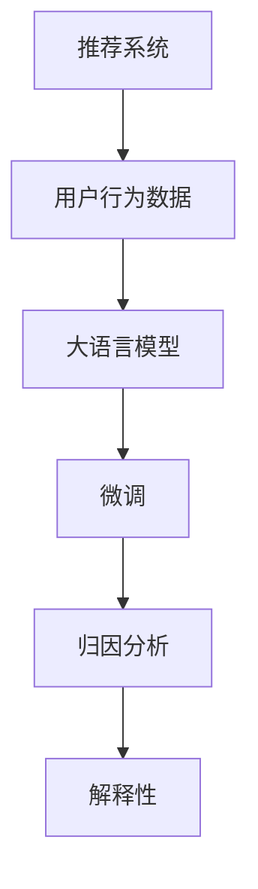

                 

# 利用大模型进行推荐场景的用户行为归因与解释

## 1. 背景介绍

### 1.1 问题由来
推荐系统是互联网和电子商务领域的重要技术，旨在根据用户的历史行为和兴趣，提供个性化的商品或内容推荐。传统的推荐系统基于用户行为数据进行训练，学习用户-物品之间的关联，并根据用户的历史行为进行相似性匹配，从而推荐用户可能感兴趣的物品。然而，随着数据规模的不断扩大，推荐系统的复杂度也随之增加，如何高效地解释推荐结果、提升用户满意度，成为推荐系统研究的难点和热点问题。

近年来，随着深度学习和大语言模型的发展，推荐系统逐渐引入大模型进行推荐，利用大模型强大的语言理解和生成能力，提升推荐系统的表现和解释能力。大模型在推荐系统中的应用，不仅提升了推荐的准确性，还能提供对推荐结果的详细解释，帮助用户理解推荐逻辑，提升用户体验。

### 1.2 问题核心关键点
基于大模型的推荐系统，通常使用预训练语言模型（如BERT、GPT等）作为特征提取器，结合用户历史行为数据进行微调，学习用户-物品关联的复杂表示。在推荐场景中，大模型的目标在于预测用户对每个物品的评分或点击概率，并通过归因分析，理解推荐结果的生成原因。

具体而言，推荐系统的主要挑战包括：
1. 如何高效利用大模型提升推荐性能。
2. 如何解释推荐结果，让用户理解推荐逻辑。
3. 如何根据用户行为归因，进行推荐策略优化。

## 2. 核心概念与联系

### 2.1 核心概念概述

为更好地理解利用大模型进行推荐系统中的用户行为归因与解释，本节将介绍几个关键概念：

- 推荐系统：基于用户历史行为数据，预测用户可能感兴趣的物品，并给出推荐列表的系统。常见的推荐算法包括基于协同过滤、内容推荐、混合推荐等。
- 用户行为数据：用户在不同时间点与系统的交互行为数据，包括浏览、点击、购买、评分等。
- 大语言模型：以自回归或自编码模型为代表的大规模预训练语言模型，通过在大规模无标签文本数据上进行预训练，学习语言的通用表示，具备强大的语言理解和生成能力。
- 微调(Fine-tuning)：指在预训练模型的基础上，使用下游任务的少量标注数据，通过有监督地训练优化模型在该任务上的性能。
- 归因分析(Attribution Analysis)：通过对用户行为进行分析，理解推荐结果的生成原因，从而优化推荐策略。
- 解释性(Explainability)：指模型的决策过程能够被用户理解和信任，提升用户对推荐系统的信任度。

这些概念之间的逻辑关系可以通过以下Mermaid流程图来展示：



这个流程图展示了推荐系统中的关键概念及其之间的关系：

1. 推荐系统基于用户行为数据，使用大语言模型进行特征提取。
2. 大语言模型在用户行为数据上微调，学习用户-物品关联的复杂表示。
3. 通过归因分析，理解推荐结果的生成原因。
4. 通过解释性，提升用户对推荐系统的信任度。

## 3. 核心算法原理 & 具体操作步骤
### 3.1 算法原理概述

基于大模型的推荐系统，利用预训练语言模型作为特征提取器，结合用户行为数据进行微调，学习用户-物品关联的复杂表示。微调过程通常包括两个步骤：

1. 特征提取：将用户行为数据（如浏览记录、点击行为、评分等）作为输入，通过大语言模型提取用户和物品的特征表示。
2. 评分预测：在特征提取的基础上，使用微调后的语言模型对用户对每个物品的评分或点击概率进行预测。

微调过程中，通常通过交叉熵损失等有监督学习方法，最小化预测值与真实标签之间的差异。通过迭代优化，使得模型能够较好地拟合用户行为数据，从而提升推荐的准确性。

### 3.2 算法步骤详解

基于大模型的推荐系统，主要包括以下几个关键步骤：

**Step 1: 准备数据集和预训练模型**
- 收集用户的历史行为数据，包括浏览记录、点击行为、评分等。
- 选择合适的预训练语言模型（如BERT、GPT等）作为特征提取器。

**Step 2: 数据预处理和特征提取**
- 对用户行为数据进行预处理，如去除噪声、处理缺失值等。
- 使用预训练语言模型（如BERT）对用户和物品进行特征提取，得到用户和物品的表示向量。

**Step 3: 微调模型**
- 使用用户行为数据和预训练语言模型提取的特征向量，对模型进行微调。
- 选择适当的优化器（如AdamW）和超参数，如学习率、批大小、迭代轮数等。
- 应用正则化技术，如L2正则、Dropout等，防止模型过拟合。

**Step 4: 评分预测和归因分析**
- 在微调后的模型上，对用户对每个物品的评分或点击概率进行预测。
- 通过分析用户行为数据和预测结果，进行归因分析，理解推荐结果的生成原因。

**Step 5: 结果解释**
- 对推荐结果进行解释，通过文本生成等方式，向用户展示推荐逻辑。

### 3.3 算法优缺点

基于大模型的推荐系统，具有以下优点：
1. 利用大语言模型的强大语言理解能力，提升推荐的准确性和丰富性。
2. 通过归因分析，理解推荐结果的生成原因，提供用户对推荐结果的信任度。
3. 模型的解释性提升，用户能够理解推荐逻辑，提高用户体验。

同时，该方法也存在一定的局限性：
1. 对标注数据的依赖较大，需要大量高质量的用户行为数据。
2. 大模型的复杂性可能导致计算成本较高。
3. 对数据质量和处理效果要求较高，需要预处理步骤精细设计。

尽管存在这些局限性，但就目前而言，基于大模型的推荐系统仍是大模型应用的最主流范式。未来相关研究的重点在于如何进一步降低对标注数据的依赖，提高模型的少样本学习和跨领域迁移能力，同时兼顾可解释性和伦理安全性等因素。

### 3.4 算法应用领域

基于大模型的推荐系统，广泛应用于电商、社交媒体、视频平台等多个领域，提供个性化的商品或内容推荐，提升用户体验。

1. 电商推荐：根据用户浏览记录和点击行为，推荐用户可能感兴趣的商品。
2. 视频推荐：根据用户的观看历史和评分，推荐用户可能喜欢的视频内容。
3. 社交媒体推荐：根据用户的点赞、评论和分享行为，推荐用户可能感兴趣的内容或用户。
4. 金融推荐：根据用户的投资历史和财务数据，推荐用户可能感兴趣的投资产品。

除了这些经典应用外，大模型的推荐系统还被创新性地应用于更多场景中，如健康医疗、教育、旅游等，为这些领域的个性化推荐提供新的解决方案。

## 4. 数学模型和公式 & 详细讲解 & 举例说明
### 4.1 数学模型构建

本节将使用数学语言对基于大模型的推荐系统进行更加严格的刻画。

记用户行为数据集为 $D=\{(x_i, y_i)\}_{i=1}^N$，其中 $x_i$ 为用户的输入数据（如浏览记录），$y_i$ 为用户的输出数据（如评分）。使用预训练语言模型 $M_{\theta}$ 作为特征提取器，对用户行为数据进行编码，得到用户和物品的表示向量 $u$ 和 $v$。模型的目标是最小化预测值与真实标签之间的交叉熵损失：

$$
\min_{\theta} \sum_{i=1}^N \ell(\hat{y}_i, y_i) = \sum_{i=1}^N [-y_i\log \hat{y}_i - (1-y_i)\log (1-\hat{y}_i)]
$$

其中 $\hat{y}_i = M_{\theta}(x_i) \in [0,1]$，表示模型对用户对物品 $i$ 的评分预测。

### 4.2 公式推导过程

以二分类任务为例，推导交叉熵损失函数及其梯度的计算公式。

假设模型 $M_{\theta}$ 在输入 $x_i$ 上的输出为 $\hat{y}_i=M_{\theta}(x_i) \in [0,1]$，表示用户对物品 $i$ 的评分预测。真实标签 $y_i \in \{0,1\}$。则二分类交叉熵损失函数定义为：

$$
\ell(M_{\theta}(x_i),y_i) = -[y_i\log \hat{y}_i + (1-y_i)\log (1-\hat{y}_i)]
$$

将其代入经验风险公式，得：

$$
\mathcal{L}(\theta) = -\frac{1}{N}\sum_{i=1}^N [y_i\log \hat{y}_i+(1-y_i)\log(1-\hat{y}_i)]
$$

根据链式法则，损失函数对参数 $\theta$ 的梯度为：

$$
\frac{\partial \mathcal{L}(\theta)}{\partial \theta} = -\frac{1}{N}\sum_{i=1}^N (\frac{y_i}{\hat{y}_i}-\frac{1-y_i}{1-\hat{y}_i}) \frac{\partial M_{\theta}(x_i)}{\partial \theta}
$$

其中 $\frac{\partial M_{\theta}(x_i)}{\partial \theta}$ 可进一步递归展开，利用自动微分技术完成计算。

在得到损失函数的梯度后，即可带入参数更新公式，完成模型的迭代优化。重复上述过程直至收敛，最终得到适应推荐任务的最优模型参数 $\theta^*$。

### 4.3 案例分析与讲解

以电商推荐系统为例，说明基于大模型的推荐系统的具体实现。

**数据集准备**
假设电商平台的推荐系统收集到用户浏览记录 $x_i$ 和对应的评分 $y_i$，数据集 $D=\{(x_i, y_i)\}_{i=1}^N$。将用户浏览记录作为模型输入，评分作为模型标签，构建推荐模型。

**特征提取**
使用预训练的BERT模型对用户浏览记录 $x_i$ 进行编码，得到用户表示向量 $u_i$。同样，对商品进行编码，得到商品表示向量 $v_i$。

**微调模型**
使用用户行为数据和预训练语言模型提取的特征向量，对模型进行微调。模型结构如图：

```
Encoder: BERT
Linear: [num_users * num_items]

```

其中，BERT作为Encoder，用于提取用户和商品的表示向量。Linear层用于预测用户对每个物品的评分，输出维度为1，表示预测评分。

**评分预测和归因分析**
在微调后的模型上，对用户对每个物品的评分进行预测。具体而言，通过编码器BERT得到用户和物品的表示向量 $u$ 和 $v$，然后通过线性层计算用户对物品 $i$ 的评分预测 $\hat{y}_i$。

```
\hat{y}_i = \sigma(\theta^T [u_i; v_i])
```

其中 $\sigma$ 为激活函数，$\theta$ 为微调后的模型参数。

**结果解释**
对推荐结果进行解释，通过文本生成等方式，向用户展示推荐逻辑。例如，对于用户对商品1的评分预测 $\hat{y}_1$，可以生成如下文本：

```
根据您的浏览记录，我们推荐您购买商品1。经过分析，发现商品1的评分预测为0.8，这意味着您可能对该商品有较高的兴趣。进一步分析，我们发现商品1具有如下特点：价格便宜、好评率高等。因此，我们认为商品1符合您的购买需求。
```

## 5. 项目实践：代码实例和详细解释说明
### 5.1 开发环境搭建

在进行推荐系统实践前，我们需要准备好开发环境。以下是使用Python进行PyTorch开发的环境配置流程：

1. 安装Anaconda：从官网下载并安装Anaconda，用于创建独立的Python环境。

2. 创建并激活虚拟环境：
```bash
conda create -n pytorch-env python=3.8 
conda activate pytorch-env
```

3. 安装PyTorch：根据CUDA版本，从官网获取对应的安装命令。例如：
```bash
conda install pytorch torchvision torchaudio cudatoolkit=11.1 -c pytorch -c conda-forge
```

4. 安装Transformers库：
```bash
pip install transformers
```

5. 安装各类工具包：
```bash
pip install numpy pandas scikit-learn matplotlib tqdm jupyter notebook ipython
```

完成上述步骤后，即可在`pytorch-env`环境中开始推荐系统实践。

### 5.2 源代码详细实现

下面我们以电商推荐系统为例，给出使用Transformers库进行推荐系统开发的PyTorch代码实现。

首先，定义推荐系统的数据处理函数：

```python
from transformers import BertTokenizer
from torch.utils.data import Dataset
import torch

class RecommendationDataset(Dataset):
    def __init__(self, user_items, tokenizer, max_len=128):
        self.user_items = user_items
        self.tokenizer = tokenizer
        self.max_len = max_len
        
    def __len__(self):
        return len(self.user_items)
    
    def __getitem__(self, item):
        user_item = self.user_items[item]
        user_id, item_id = user_item
        
        encoding = self.tokenizer(user_id, item_id, return_tensors='pt', max_length=self.max_len, padding='max_length', truncation=True)
        input_ids = encoding['input_ids'][0]
        attention_mask = encoding['attention_mask'][0]
        
        return {'user_id': user_id, 
                'item_id': item_id,
                'input_ids': input_ids, 
                'attention_mask': attention_mask}
```

然后，定义模型和优化器：

```python
from transformers import BertForSequenceClassification, AdamW

model = BertForSequenceClassification.from_pretrained('bert-base-cased', num_labels=1)

optimizer = AdamW(model.parameters(), lr=2e-5)
```

接着，定义训练和评估函数：

```python
from torch.utils.data import DataLoader
from tqdm import tqdm
from sklearn.metrics import roc_auc_score

device = torch.device('cuda') if torch.cuda.is_available() else torch.device('cpu')
model.to(device)

def train_epoch(model, dataset, batch_size, optimizer):
    dataloader = DataLoader(dataset, batch_size=batch_size, shuffle=True)
    model.train()
    epoch_loss = 0
    for batch in tqdm(dataloader, desc='Training'):
        user_id, item_id, input_ids, attention_mask = batch['user_id'], batch['item_id'], batch['input_ids'], batch['attention_mask']
        
        model.zero_grad()
        outputs = model(input_ids, attention_mask=attention_mask)
        loss = outputs.loss
        epoch_loss += loss.item()
        loss.backward()
        optimizer.step()
    return epoch_loss / len(dataloader)

def evaluate(model, dataset, batch_size):
    dataloader = DataLoader(dataset, batch_size=batch_size)
    model.eval()
    preds, labels = [], []
    with torch.no_grad():
        for batch in tqdm(dataloader, desc='Evaluating'):
            user_id, item_id, input_ids, attention_mask = batch['user_id'], batch['item_id'], batch['input_ids'], batch['attention_mask']
            batch_labels = labels = torch.tensor([1.0] * len(input_ids))
            outputs = model(input_ids, attention_mask=attention_mask)
            batch_preds = outputs.logits.argmax(dim=2).to('cpu').tolist()
            batch_labels = batch_labels.to('cpu').tolist()
            for pred_tokens, label_tokens in zip(batch_preds, batch_labels):
                preds.append(pred_tokens)
                labels.append(label_tokens)
                
    return roc_auc_score(labels, preds)
```

最后，启动训练流程并在测试集上评估：

```python
epochs = 5
batch_size = 16

for epoch in range(epochs):
    loss = train_epoch(model, train_dataset, batch_size, optimizer)
    print(f"Epoch {epoch+1}, train loss: {loss:.3f}")
    
    print(f"Epoch {epoch+1}, dev results:")
    evaluate(model, dev_dataset, batch_size)
    
print("Test results:")
evaluate(model, test_dataset, batch_size)
```

以上就是使用PyTorch对BERT进行电商推荐系统开发的完整代码实现。可以看到，得益于Transformers库的强大封装，我们可以用相对简洁的代码完成BERT模型的加载和推荐系统的构建。

### 5.3 代码解读与分析

让我们再详细解读一下关键代码的实现细节：

**RecommendationDataset类**：
- `__init__`方法：初始化用户行为数据集和分词器。
- `__len__`方法：返回数据集的样本数量。
- `__getitem__`方法：对单个样本进行处理，将用户行为数据编码成token ids，返回模型所需的输入。

**训练和评估函数**：
- 使用PyTorch的DataLoader对数据集进行批次化加载，供模型训练和推理使用。
- 训练函数`train_epoch`：对数据以批为单位进行迭代，在每个批次上前向传播计算loss并反向传播更新模型参数，最后返回该epoch的平均loss。
- 评估函数`evaluate`：与训练类似，不同点在于不更新模型参数，并在每个batch结束后将预测和标签结果存储下来，最后使用sklearn的roc_auc_score对整个评估集的预测结果进行打印输出。

**训练流程**：
- 定义总的epoch数和batch size，开始循环迭代
- 每个epoch内，先在训练集上训练，输出平均loss
- 在验证集上评估，输出AUC-ROC分数
- 所有epoch结束后，在测试集上评估，给出最终测试结果

可以看到，PyTorch配合Transformers库使得BERT微调的代码实现变得简洁高效。开发者可以将更多精力放在数据处理、模型改进等高层逻辑上，而不必过多关注底层的实现细节。

当然，工业级的系统实现还需考虑更多因素，如模型的保存和部署、超参数的自动搜索、更灵活的任务适配层等。但核心的推荐范式基本与此类似。

## 6. 实际应用场景
### 6.1 智能客服系统

基于大模型的推荐系统，可以应用于智能客服系统的构建。传统客服往往需要配备大量人力，高峰期响应缓慢，且一致性和专业性难以保证。而使用基于大模型的推荐系统，可以7x24小时不间断服务，快速响应客户咨询，用自然流畅的语言解答各类常见问题。

在技术实现上，可以收集企业内部的历史客服对话记录，将问题和最佳答复构建成监督数据，在此基础上对预训练推荐模型进行微调。微调后的推荐系统能够自动理解用户意图，匹配最合适的答复模板进行回复。对于客户提出的新问题，还可以接入检索系统实时搜索相关内容，动态组织生成回答。如此构建的智能客服系统，能大幅提升客户咨询体验和问题解决效率。

### 6.2 金融舆情监测

金融机构需要实时监测市场舆论动向，以便及时应对负面信息传播，规避金融风险。传统的人工监测方式成本高、效率低，难以应对网络时代海量信息爆发的挑战。基于大模型的推荐系统，可以应用于金融舆情监测，实时获取市场舆情，帮助金融机构及时识别风险点，做出应对策略。

具体而言，可以收集金融领域相关的新闻、报道、评论等文本数据，并对其进行情感标注。在此基础上对预训练语言模型进行微调，使其能够自动判断文本的情感倾向，实时监测市场舆情，一旦发现负面信息激增等异常情况，系统便会自动预警，帮助金融机构快速应对潜在风险。

### 6.3 个性化推荐系统

当前的推荐系统往往只依赖用户的历史行为数据进行物品推荐，无法深入理解用户的真实兴趣偏好。基于大模型的推荐系统，可以更好地挖掘用户行为背后的语义信息，从而提供更精准、多样的推荐内容。

在实践中，可以收集用户浏览、点击、评论、分享等行为数据，提取和用户交互的物品标题、描述、标签等文本内容。将文本内容作为模型输入，用户的后续行为（如是否点击、购买等）作为监督信号，在此基础上微调预训练语言模型。微调后的模型能够从文本内容中准确把握用户的兴趣点。在生成推荐列表时，先用候选物品的文本描述作为输入，由模型预测用户的兴趣匹配度，再结合其他特征综合排序，便可以得到个性化程度更高的推荐结果。

### 6.4 未来应用展望

随着大模型和推荐系统的不断发展，基于大模型的推荐系统将在更多领域得到应用，为传统行业带来变革性影响。

在智慧医疗领域，基于大模型的推荐系统可以用于病历分析、药物推荐等，帮助医生快速找到合适的治疗方案。在智能教育领域，推荐系统可以用于作业批改、知识推荐、智能辅导等，因材施教，促进教育公平，提高教学质量。

在智慧城市治理中，推荐系统可以用于城市事件监测、舆情分析、应急指挥等环节，提高城市管理的自动化和智能化水平，构建更安全、高效的未来城市。

此外，在企业生产、社会治理、文娱传媒等众多领域，基于大模型的推荐系统也将不断涌现，为这些领域的个性化推荐提供新的解决方案，推动相关行业的数字化转型升级。

## 7. 工具和资源推荐
### 7.1 学习资源推荐

为了帮助开发者系统掌握大模型在推荐系统中的应用，这里推荐一些优质的学习资源：

1. 《深度学习推荐系统》课程：斯坦福大学开设的深度学习课程，涵盖了推荐系统中的经典模型和算法，适合初学者和进阶者学习。

2. CS246《机器学习系统》课程：斯坦福大学开设的机器学习系统课程，介绍了推荐系统的基础和前沿方法，适合深度学习从业者参考。

3. 《推荐系统实践》书籍：详细介绍了推荐系统的原理、算法和应用实践，适合工程师和技术架构师参考。

4. HuggingFace官方文档：提供了大量预训练模型和推荐系统的应用示例，是学习推荐系统的好帮手。

5. Kaggle推荐系统竞赛：通过实际数据集竞赛，锻炼推荐系统设计、模型优化和调优的能力。

通过对这些资源的学习实践，相信你一定能够快速掌握大模型在推荐系统中的应用，并用于解决实际的推荐问题。
###  7.2 开发工具推荐

高效的开发离不开优秀的工具支持。以下是几款用于大模型推荐系统开发的常用工具：

1. PyTorch：基于Python的开源深度学习框架，灵活动态的计算图，适合快速迭代研究。大部分预训练语言模型都有PyTorch版本的实现。

2. TensorFlow：由Google主导开发的开源深度学习框架，生产部署方便，适合大规模工程应用。同样有丰富的预训练语言模型资源。

3. Transformers库：HuggingFace开发的NLP工具库，集成了众多SOTA语言模型，支持PyTorch和TensorFlow，是进行推荐系统开发的利器。

4. Weights & Biases：模型训练的实验跟踪工具，可以记录和可视化模型训练过程中的各项指标，方便对比和调优。与主流深度学习框架无缝集成。

5. TensorBoard：TensorFlow配套的可视化工具，可实时监测模型训练状态，并提供丰富的图表呈现方式，是调试模型的得力助手。

6. Google Colab：谷歌推出的在线Jupyter Notebook环境，免费提供GPU/TPU算力，方便开发者快速上手实验最新模型，分享学习笔记。

合理利用这些工具，可以显著提升大模型推荐系统的开发效率，加快创新迭代的步伐。

### 7.3 相关论文推荐

大模型和推荐系统的研究源于学界的持续研究。以下是几篇奠基性的相关论文，推荐阅读：

1. Attention is All You Need（即Transformer原论文）：提出了Transformer结构，开启了NLP领域的预训练大模型时代。

2. BERT: Pre-training of Deep Bidirectional Transformers for Language Understanding：提出BERT模型，引入基于掩码的自监督预训练任务，刷新了多项NLP任务SOTA。

3. Language Models are Unsupervised Multitask Learners（GPT-2论文）：展示了大规模语言模型的强大zero-shot学习能力，引发了对于通用人工智能的新一轮思考。

4. Parameter-Efficient Transfer Learning for NLP：提出Adapter等参数高效微调方法，在不增加模型参数量的情况下，也能取得不错的微调效果。

5. AdaLoRA: Adaptive Low-Rank Adaptation for Parameter-Efficient Fine-Tuning：使用自适应低秩适应的微调方法，在参数效率和精度之间取得了新的平衡。

这些论文代表了大模型推荐系统的研究脉络。通过学习这些前沿成果，可以帮助研究者把握学科前进方向，激发更多的创新灵感。

## 8. 总结：未来发展趋势与挑战
### 8.1 总结

本文对基于大模型的推荐系统进行了全面系统的介绍。首先阐述了推荐系统的背景和目标，明确了推荐系统在用户体验、业务价值等方面的独特价值。其次，从原理到实践，详细讲解了基于大模型的推荐系统的核心算法和操作步骤，给出了推荐系统开发的完整代码实例。同时，本文还广泛探讨了推荐系统在电商、金融、教育等多个领域的应用前景，展示了推荐系统技术的广阔前景。

通过本文的系统梳理，可以看到，基于大模型的推荐系统利用其强大的语言理解和生成能力，提升了推荐的准确性和解释性，为推荐系统带来了新的发展方向。未来，伴随大语言模型和推荐系统的不断进步，基于大模型的推荐系统必将在更多领域得到应用，为推荐系统技术带来更大的创新和突破。

### 8.2 未来发展趋势

展望未来，基于大模型的推荐系统将呈现以下几个发展趋势：

1. 模型规模持续增大。随着算力成本的下降和数据规模的扩张，预训练语言模型的参数量还将持续增长。超大规模语言模型蕴含的丰富语言知识，有望支撑更加复杂多变的推荐场景。

2. 推荐算法日趋多样化。除了传统的基于协同过滤、内容推荐的算法外，未来会涌现更多基于深度学习、大模型的推荐算法，提升推荐的个性化和多样性。

3. 推荐结果的解释性增强。随着用户对推荐结果可解释性的需求提升，未来推荐系统将更加注重结果的解释性，通过自然语言生成等方式，提升用户对推荐结果的理解和信任度。

4. 推荐系统的跨领域应用拓展。未来推荐系统将更加关注跨领域推荐，如跨领域兴趣点挖掘、跨领域推荐模型训练等，提升推荐系统的泛化性和鲁棒性。

5. 推荐系统的实时性提升。未来推荐系统将更加注重实时性，通过分布式计算、混合精度训练等技术，提升推荐系统对实时数据的处理能力。

6. 推荐系统的可解释性和安全性提升。未来推荐系统将更加注重结果的可解释性和安全性，通过引入更多先验知识、加强模型约束等手段，提升推荐系统的透明度和可靠性。

以上趋势凸显了大模型推荐系统的广阔前景。这些方向的探索发展，必将进一步提升推荐系统的性能和应用范围，为人工智能技术在更多领域带来新的突破。

### 8.3 面临的挑战

尽管基于大模型的推荐系统已经取得了瞩目成就，但在迈向更加智能化、普适化应用的过程中，它仍面临着诸多挑战：

1. 标注成本瓶颈。虽然推荐系统能够利用少样本数据进行微调，但获取高质量的标注数据仍需要大量人力和时间。如何降低标注成本，成为推荐系统发展的重要挑战。

2. 数据隐私保护。在推荐系统中，用户行为数据往往包含大量敏感信息。如何在推荐过程中保护用户隐私，避免数据泄露，是推荐系统面临的重要伦理问题。

3. 模型泛化性不足。当前推荐系统在特定领域和数据分布下的表现较好，但泛化到其他领域和数据分布时，效果往往难以保证。如何提升推荐系统的泛化性和鲁棒性，成为重要的研究方向。

4. 计算资源消耗大。大模型的复杂性导致推荐系统在计算资源上的消耗较大。如何在保持推荐效果的前提下，降低计算资源消耗，提升推荐系统的运行效率，是推荐系统优化的一个重要方向。

5. 解释性不足。虽然大模型推荐系统在结果解释性上有所提升，但仍然难以满足用户对推荐结果的全面理解和信任。如何进一步提升推荐结果的解释性，增强用户对推荐系统的信任度，是推荐系统发展的重要方向。

6. 跨领域推荐难度大。由于不同领域的用户行为数据和推荐任务差异较大，跨领域推荐在算法设计和技术实现上都面临挑战。如何构建跨领域推荐模型，提升推荐系统的泛化性和鲁棒性，成为推荐系统的重要研究方向。

这些挑战凸显了大模型推荐系统的复杂性和难度，但通过持续的技术创新和应用实践，相信这些问题终将一一被克服，大模型推荐系统必将在更多的应用领域带来新的突破。

### 8.4 研究展望

面对大模型推荐系统所面临的种种挑战，未来的研究需要在以下几个方面寻求新的突破：

1. 探索无监督和半监督推荐方法。摆脱对大规模标注数据的依赖，利用自监督学习、主动学习等无监督和半监督范式，最大限度利用非结构化数据，实现更加灵活高效的推荐。

2. 研究参数高效和计算高效的推荐算法。开发更加参数高效的推荐算法，如基于连续型Prompt的推荐方法，在固定大部分预训练参数的同时，只更新极少量的任务相关参数。同时优化推荐模型的计算图，减少前向传播和反向传播的资源消耗，实现更加轻量级、实时性的部署。

3. 融合因果和对比学习范式。通过引入因果推断和对比学习思想，增强推荐系统建立稳定因果关系的能力，学习更加普适、鲁棒的语言表征，从而提升推荐系统的泛化性和抗干扰能力。

4. 引入更多先验知识。将符号化的先验知识，如知识图谱、逻辑规则等，与神经网络模型进行巧妙融合，引导推荐过程学习更准确、合理的语言模型。同时加强不同模态数据的整合，实现视觉、语音等多模态信息与文本信息的协同建模。

5. 结合因果分析和博弈论工具。将因果分析方法引入推荐系统，识别出推荐决策的关键特征，增强推荐结果的因果性和逻辑性。借助博弈论工具刻画人机交互过程，主动探索并规避推荐系统的脆弱点，提高系统稳定性。

6. 纳入伦理道德约束。在推荐系统训练目标中引入伦理导向的评估指标，过滤和惩罚有偏见、有害的输出倾向。同时加强人工干预和审核，建立推荐系统的监管机制，确保推荐结果符合人类价值观和伦理道德。

这些研究方向的探索，必将引领大模型推荐系统技术迈向更高的台阶，为推荐系统技术的未来发展带来新的突破。面向未来，大模型推荐系统需要与其他人工智能技术进行更深入的融合，如知识表示、因果推理、强化学习等，多路径协同发力，共同推动推荐系统技术的进步。只有勇于创新、敢于突破，才能不断拓展推荐系统的边界，让推荐技术更好地造福人类社会。

## 9. 附录：常见问题与解答
**Q1：推荐系统是否适用于所有NLP任务？**

A: 推荐系统基于用户历史行为数据进行预测，适用于具有明确评分或行为反馈的任务。对于一些无明确反馈的任务，如对话系统、文本生成等，推荐系统难以适用。此时需要采用其他NLP技术，如对话系统、文本生成模型等。

**Q2：如何选择合适的学习率？**

A: 推荐系统的学习率通常比预训练语言模型的学习率要小，以避免破坏预训练权重。一般建议从1e-5开始调参，逐步减小学习率，直至收敛。也可以使用warmup策略，在开始阶段使用较小的学习率，再逐渐过渡到预设值。需要注意的是，不同的优化器(如AdamW、Adafactor等)可能需要设置不同的学习率阈值。

**Q3：推荐系统对标注数据的依赖较大，如何缓解？**

A: 推荐系统对标注数据的依赖较大，可以通过以下方式缓解：
1. 数据增强：通过回译、近义替换等方式扩充训练集。
2. 无监督学习：利用协同过滤、基于用户兴趣的推荐等无监督方法，减小对标注数据的依赖。
3. 多任务学习：在推荐任务上加入其他语言任务，如文本分类、情感分析等，利用多任务学习提升推荐系统的效果。

**Q4：推荐系统的计算资源消耗大，如何优化？**

A: 推荐系统在计算资源上的消耗较大，可以通过以下方式优化：
1. 模型裁剪：去除不必要的层和参数，减小模型尺寸，加快推理速度。
2. 量化加速：将浮点模型转为定点模型，压缩存储空间，提高计算效率。
3. 混合精度训练：利用混合精度训练，减少浮点运算量，提升计算效率。
4. 分布式计算：利用分布式计算，加速推荐系统的训练和推理过程。

**Q5：推荐系统的解释性不足，如何增强？**

A: 推荐系统的解释性不足，可以通过以下方式增强：
1. 引入因果分析：通过因果分析方法，识别出推荐决策的关键特征，增强推荐结果的因果性和逻辑性。
2. 引入博弈论工具：利用博弈论工具刻画人机交互过程，主动探索并规避推荐系统的脆弱点，提高系统稳定性。
3. 利用自然语言生成：通过自然语言生成技术，向用户解释推荐结果，提升用户对推荐系统的理解。

这些优化方法可以帮助推荐系统更好地理解推荐结果，提升用户对推荐系统的信任度，促进推荐系统技术的进一步发展。

---

作者：禅与计算机程序设计艺术 / Zen and the Art of Computer Programming

