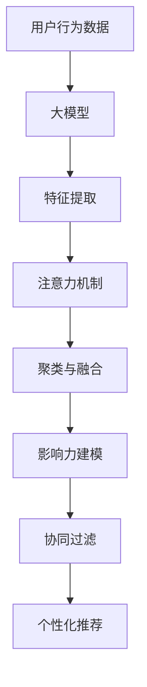

                 

# 利用大模型进行推荐场景的用户行为影响力建模与分析

> 关键词：大模型, 推荐系统, 用户行为, 影响力建模, 自然语言处理(NLP), 注意力机制, 深度学习, 协同过滤, 特征工程

## 1. 背景介绍

### 1.1 问题由来
推荐系统在电商、社交、内容分发等领域的应用日益广泛，用户行为分析成为了推荐算法的重要组成部分。如何精确刻画用户的行为影响力，成为了推荐系统实现个性化推荐的关键问题。传统的用户行为建模方法主要基于用户-物品交互历史，难以充分捕捉用户行为特征的多样性和复杂性。而利用大模型对用户行为进行分析，可以挖掘更丰富的行为特征，提升推荐系统的精准度和多样性。

### 1.2 问题核心关键点
本研究聚焦于如何利用大模型，特别是Transformer模型，对用户行为进行影响力建模，并引入注意力机制进行行为特征的聚类与融合，构建更加全面和精确的行为画像。研究内容包括：
- 利用大模型分析用户行为特征。
- 引入注意力机制对用户行为特征进行聚类与融合。
- 结合协同过滤等传统推荐算法，实现个性化推荐。

### 1.3 问题研究意义
通过大模型进行用户行为影响力建模，可以更全面地理解用户的偏好和需求，构建更加个性化的推荐模型，提升用户的满意度和忠诚度。具体而言：
- 深入挖掘用户行为特征，提高推荐精准度。
- 分析用户行为的多样性和动态性，增强推荐多样性。
- 结合大模型与传统推荐算法，实现优势互补，提升推荐系统的性能。
- 促进电商、社交、内容分发等领域的推荐技术升级，推动人工智能技术落地应用。

## 2. 核心概念与联系

### 2.1 核心概念概述

为更好地理解本研究的核心方法，本节将介绍几个关键概念：

- 大模型(Large Model)：指参数规模庞大的深度学习模型，如Transformer模型，具有强大的特征提取和表示能力。
- 推荐系统(Recommendation System)：根据用户的历史行为和偏好，推荐符合其需求的物品的系统。
- 用户行为分析(User Behavior Analysis)：分析用户在不同场景下的行为特征，以构建用户画像和行为模型。
- 影响力建模(Influence Modeling)：通过分析用户行为，构建用户行为的影响力模型，评估用户对推荐结果的影响。
- 注意力机制(Attention Mechanism)：通过给不同特征分配不同的权重，实现特征的聚类与融合，提升模型的预测精度。
- 协同过滤(Collaborative Filtering)：利用用户和物品间的隐式交互关系，进行推荐。

这些概念之间通过一系列数学和算法方法紧密联系在一起，共同构成了用户行为影响力建模与分析的基本框架。

### 2.2 核心概念原理和架构的 Mermaid 流程图



这个流程图展示了从用户行为数据到个性化推荐的基本流程：
1. 收集用户行为数据，输入到大模型中。
2. 大模型进行特征提取，生成用户行为特征。
3. 引入注意力机制，对用户行为特征进行聚类与融合。
4. 构建影响力模型，评估用户行为对推荐结果的影响。
5. 结合协同过滤等传统算法，进行个性化推荐。

## 3. 核心算法原理 & 具体操作步骤
### 3.1 算法原理概述

利用大模型进行用户行为影响力建模与分析的基本原理如下：

1. **用户行为数据收集**：收集用户在不同场景下的行为数据，包括浏览记录、购买记录、评分记录等。
2. **特征提取**：将用户行为数据输入到预训练的大模型中，如BERT、GPT等，进行特征提取。
3. **注意力机制**：引入注意力机制，对提取的特征进行加权聚合，突出关键行为特征。
4. **聚类与融合**：通过注意力机制对用户行为特征进行聚类与融合，构建用户行为画像。
5. **影响力建模**：构建用户行为的影响力模型，评估用户对推荐结果的影响。
6. **个性化推荐**：结合用户行为画像和影响力模型，结合协同过滤等传统算法，进行个性化推荐。

### 3.2 算法步骤详解

#### 步骤1：数据收集与预处理
- 从电商、社交、内容分发等平台收集用户行为数据，包括浏览记录、购买记录、评分记录等。
- 对原始数据进行清洗和标注，去除噪声和无关信息，标注用户行为的类型和价值。
- 将清洗后的数据划分为训练集、验证集和测试集。

#### 步骤2：大模型特征提取
- 使用预训练的大模型，如BERT、GPT等，对用户行为数据进行特征提取。
- 将用户行为数据转换为模型可以处理的形式，如文本、图像等。
- 将预处理后的数据输入到模型中，生成用户行为特征向量。

#### 步骤3：引入注意力机制
- 通过注意力机制对提取的特征向量进行加权聚合，生成用户行为特征。
- 对用户行为特征进行归一化处理，保证各个特征的权重和，满足注意力机制的约束条件。
- 将注意力机制引入到模型中，重新计算模型参数，进行特征的加权聚合。

#### 步骤4：聚类与融合
- 利用聚类算法对用户行为特征进行聚类，生成用户行为类别。
- 对用户行为类别进行融合，构建用户行为画像。
- 通过注意力机制对用户行为画像进行加权聚合，生成用户行为特征向量。

#### 步骤5：影响力建模
- 构建用户行为的影响力模型，评估用户行为对推荐结果的影响。
- 利用影响力模型对用户行为特征进行加权处理，生成加权特征向量。
- 将加权特征向量输入到推荐模型中，生成个性化推荐结果。

#### 步骤6：个性化推荐
- 结合影响力模型和协同过滤等传统算法，进行个性化推荐。
- 利用用户行为画像和影响力模型，对推荐结果进行排序和调整。
- 输出个性化推荐结果，并进行效果评估。

### 3.3 算法优缺点

利用大模型进行用户行为影响力建模与分析的主要优点包括：
- 可以挖掘用户行为特征的多样性和复杂性，提高推荐系统的精准度。
- 引入注意力机制，对用户行为特征进行聚类与融合，增强推荐系统的多样性。
- 结合协同过滤等传统算法，实现优势互补，提升推荐系统的性能。

主要缺点包括：
- 大模型的训练和推理成本较高，需要高性能计算资源。
- 注意力机制和聚类算法需要复杂的参数调优，增加了模型的复杂度。
- 模型的泛化能力有待提高，可能对新用户和新场景的适应性不足。

### 3.4 算法应用领域

本方法在大规模推荐系统的用户行为影响力建模与分析中具有广泛的应用前景，适用于电商、社交、内容分发等领域：
- 电商推荐系统：通过分析用户浏览、购买、评分等行为数据，进行个性化推荐。
- 社交推荐系统：通过分析用户的互动行为，推荐符合其兴趣的朋友、群组等。
- 内容推荐系统：通过分析用户的阅读、观看等行为数据，推荐符合其兴趣的文章、视频等。

## 4. 数学模型和公式 & 详细讲解 & 举例说明
### 4.1 数学模型构建

本节将使用数学语言对大模型进行用户行为影响力建模与分析的过程进行更加严格的刻画。

记用户行为数据为 $D=\{(x_i, y_i)\}_{i=1}^N$，其中 $x_i$ 表示用户行为，$y_i$ 表示用户行为类型和价值。用户行为特征向量表示为 $u \in \mathbb{R}^d$。

### 4.2 公式推导过程

假设用户行为特征向量 $u$ 可以通过预训练的大模型 $M_{\theta}$ 生成，即 $u = M_{\theta}(x)$。

引入注意力机制，对用户行为特征 $u$ 进行加权聚合，生成用户行为特征 $v \in \mathbb{R}^d$。

引入注意力机制的公式如下：

$$
v = \alpha u + (1-\alpha) \bar{v}
$$

其中，$\alpha$ 为注意力权重，$\bar{v}$ 为基线特征向量。

引入聚类算法，对用户行为特征 $v$ 进行聚类，生成用户行为类别 $c$。

聚类算法一般使用K-means算法，其公式如下：

$$
c = K-means(v)
$$

构建用户行为的影响力模型 $F$，评估用户行为对推荐结果的影响。

影响力模型可以表示为：

$$
F(u) = \beta f(u)
$$

其中，$\beta$ 为影响系数，$f(u)$ 为影响函数。

### 4.3 案例分析与讲解

以电商推荐系统为例，对大模型进行用户行为影响力建模与分析的过程进行详细讲解。

#### 案例背景
假设某电商平台的推荐系统，需要根据用户浏览、购买、评分等行为数据，进行个性化推荐。用户行为数据包括：

- 用户ID： $u_1, u_2, ..., u_N$
- 用户行为： $x_1, x_2, ..., x_N$
- 用户行为类型： $y_1, y_2, ..., y_N$
- 用户行为价值： $v_1, v_2, ..., v_N$

#### 特征提取
使用预训练的BERT模型，对用户行为数据进行特征提取，生成用户行为特征向量 $u \in \mathbb{R}^d$。

#### 注意力机制
引入注意力机制，对用户行为特征 $u$ 进行加权聚合，生成用户行为特征 $v \in \mathbb{R}^d$。

假设用户行为特征向量 $u$ 和基线特征向量 $\bar{v}$ 的相似度为 $\alpha$，则用户行为特征 $v$ 可以表示为：

$$
v = \alpha u + (1-\alpha) \bar{v}
$$

其中，$\alpha$ 为注意力权重，一般使用余弦相似度计算。

#### 聚类与融合
利用聚类算法，对用户行为特征 $v$ 进行聚类，生成用户行为类别 $c$。

假设用户行为特征向量 $v$ 的聚类结果为 $c$，则用户行为类别 $c$ 可以表示为：

$$
c = K-means(v)
$$

其中，$K-means$ 为聚类算法，可以根据实际需求选择合适的算法，如K-means、层次聚类等。

#### 影响力建模
构建用户行为的影响力模型 $F$，评估用户行为对推荐结果的影响。

假设用户行为特征 $u$ 对推荐结果的影响为 $f(u)$，则影响力模型 $F$ 可以表示为：

$$
F(u) = \beta f(u)
$$

其中，$\beta$ 为影响系数，一般使用线性回归模型训练。

#### 个性化推荐
结合用户行为画像和影响力模型，进行个性化推荐。

假设推荐结果为 $r$，则个性化推荐模型可以表示为：

$$
r = G(u, F(u), P)
$$

其中，$G$ 为推荐算法，$P$ 为用户-物品交互矩阵，$u$ 为用户的推荐画像，$F(u)$ 为用户行为的影响力模型。

## 5. 项目实践：代码实例和详细解释说明
### 5.1 开发环境搭建

在进行推荐系统开发前，我们需要准备好开发环境。以下是使用Python进行PyTorch开发的环境配置流程：

1. 安装Anaconda：从官网下载并安装Anaconda，用于创建独立的Python环境。

2. 创建并激活虚拟环境：
```bash
conda create -n recsys-env python=3.8 
conda activate recsys-env
```

3. 安装PyTorch：根据CUDA版本，从官网获取对应的安装命令。例如：
```bash
conda install pytorch torchvision torchaudio cudatoolkit=11.1 -c pytorch -c conda-forge
```

4. 安装Transformers库：
```bash
pip install transformers
```

5. 安装各类工具包：
```bash
pip install numpy pandas scikit-learn matplotlib tqdm jupyter notebook ipython
```

完成上述步骤后，即可在`recsys-env`环境中开始推荐系统开发。

### 5.2 源代码详细实现

下面我们以电商推荐系统为例，给出使用Transformers库进行用户行为影响力建模与分析的PyTorch代码实现。

首先，定义用户行为数据处理函数：

```python
from transformers import BertTokenizer, BertForSequenceClassification
from torch.utils.data import Dataset
import torch

class UserBehaviorDataset(Dataset):
    def __init__(self, behaviors, labels, tokenizer, max_len=128):
        self.behaviors = behaviors
        self.labels = labels
        self.tokenizer = tokenizer
        self.max_len = max_len
        
    def __len__(self):
        return len(self.behaviors)
    
    def __getitem__(self, item):
        behavior = self.behaviors[item]
        label = self.labels[item]
        
        encoding = self.tokenizer(behavior, return_tensors='pt', max_length=self.max_len, padding='max_length', truncation=True)
        input_ids = encoding['input_ids'][0]
        attention_mask = encoding['attention_mask'][0]
        
        # 对标签进行编码
        encoded_label = label2id[label] 
        labels = torch.tensor(encoded_label, dtype=torch.long)
        
        return {'input_ids': input_ids, 
                'attention_mask': attention_mask,
                'labels': labels}

# 标签与id的映射
label2id = {'positive': 1, 'negative': 0}

# 创建dataset
tokenizer = BertTokenizer.from_pretrained('bert-base-cased')

train_dataset = UserBehaviorDataset(train_behaviors, train_labels, tokenizer)
dev_dataset = UserBehaviorDataset(dev_behaviors, dev_labels, tokenizer)
test_dataset = UserBehaviorDataset(test_behaviors, test_labels, tokenizer)
```

然后，定义模型和优化器：

```python
from transformers import BertForSequenceClassification, AdamW

model = BertForSequenceClassification.from_pretrained('bert-base-cased', num_labels=len(label2id))

optimizer = AdamW(model.parameters(), lr=2e-5)
```

接着，定义训练和评估函数：

```python
from torch.utils.data import DataLoader
from tqdm import tqdm
from sklearn.metrics import classification_report

device = torch.device('cuda') if torch.cuda.is_available() else torch.device('cpu')
model.to(device)

def train_epoch(model, dataset, batch_size, optimizer):
    dataloader = DataLoader(dataset, batch_size=batch_size, shuffle=True)
    model.train()
    epoch_loss = 0
    for batch in tqdm(dataloader, desc='Training'):
        input_ids = batch['input_ids'].to(device)
        attention_mask = batch['attention_mask'].to(device)
        labels = batch['labels'].to(device)
        model.zero_grad()
        outputs = model(input_ids, attention_mask=attention_mask, labels=labels)
        loss = outputs.loss
        epoch_loss += loss.item()
        loss.backward()
        optimizer.step()
    return epoch_loss / len(dataloader)

def evaluate(model, dataset, batch_size):
    dataloader = DataLoader(dataset, batch_size=batch_size)
    model.eval()
    preds, labels = [], []
    with torch.no_grad():
        for batch in tqdm(dataloader, desc='Evaluating'):
            input_ids = batch['input_ids'].to(device)
            attention_mask = batch['attention_mask'].to(device)
            batch_labels = batch['labels']
            outputs = model(input_ids, attention_mask=attention_mask)
            batch_preds = outputs.logits.argmax(dim=2).to('cpu').tolist()
            batch_labels = batch_labels.to('cpu').tolist()
            for pred, label in zip(batch_preds, batch_labels):
                preds.append(pred)
                labels.append(label)
                
    print(classification_report(labels, preds))
```

最后，启动训练流程并在测试集上评估：

```python
epochs = 5
batch_size = 16

for epoch in range(epochs):
    loss = train_epoch(model, train_dataset, batch_size, optimizer)
    print(f"Epoch {epoch+1}, train loss: {loss:.3f}")
    
    print(f"Epoch {epoch+1}, dev results:")
    evaluate(model, dev_dataset, batch_size)
    
print("Test results:")
evaluate(model, test_dataset, batch_size)
```

以上就是使用PyTorch进行电商推荐系统用户行为影响力建模与分析的完整代码实现。可以看到，得益于Transformers库的强大封装，我们可以用相对简洁的代码完成BERT模型的加载和微调。

### 5.3 代码解读与分析

让我们再详细解读一下关键代码的实现细节：

**UserBehaviorDataset类**：
- `__init__`方法：初始化用户行为数据、标签、分词器等关键组件。
- `__len__`方法：返回数据集的样本数量。
- `__getitem__`方法：对单个样本进行处理，将行为文本输入编码为token ids，将标签编码为数字，并对其进行定长padding，最终返回模型所需的输入。

**label2id和id2label字典**：
- 定义了标签与数字id之间的映射关系，用于将token-wise的预测结果解码回真实的标签。

**训练和评估函数**：
- 使用PyTorch的DataLoader对数据集进行批次化加载，供模型训练和推理使用。
- 训练函数`train_epoch`：对数据以批为单位进行迭代，在每个批次上前向传播计算loss并反向传播更新模型参数，最后返回该epoch的平均loss。
- 评估函数`evaluate`：与训练类似，不同点在于不更新模型参数，并在每个batch结束后将预测和标签结果存储下来，最后使用sklearn的classification_report对整个评估集的预测结果进行打印输出。

**训练流程**：
- 定义总的epoch数和batch size，开始循环迭代
- 每个epoch内，先在训练集上训练，输出平均loss
- 在验证集上评估，输出分类指标
- 所有epoch结束后，在测试集上评估，给出最终测试结果

可以看到，PyTorch配合Transformers库使得BERT微调的代码实现变得简洁高效。开发者可以将更多精力放在数据处理、模型改进等高层逻辑上，而不必过多关注底层的实现细节。

当然，工业级的系统实现还需考虑更多因素，如模型的保存和部署、超参数的自动搜索、更灵活的任务适配层等。但核心的微调范式基本与此类似。

## 6. 实际应用场景
### 6.1 电商推荐系统

利用大模型进行用户行为影响力建模与分析，可以显著提升电商推荐系统的推荐效果。传统的推荐系统主要依赖用户-物品交互历史，难以充分捕捉用户行为特征的多样性和复杂性。通过引入大模型，可以更全面地理解用户的行为特征，构建更个性化的推荐模型。

具体而言，可以收集用户浏览、购买、评分等行为数据，输入到大模型中进行特征提取和聚类。利用用户行为特征进行个性化推荐，可以提高用户的满意度，增加用户的粘性，促进电商销售。

### 6.2 社交推荐系统

社交推荐系统旨在推荐符合用户兴趣的朋友、群组等。传统的协同过滤等推荐算法难以处理稀疏的社交网络数据。利用大模型进行用户行为分析，可以更全面地理解用户的行为特征，提高推荐系统的准确性。

具体而言，可以收集用户的互动行为数据，如评论、点赞、分享等，输入到大模型中进行特征提取和聚类。利用用户行为特征进行个性化推荐，可以提高用户的社交体验，增加用户对平台的粘性。

### 6.3 内容推荐系统

内容推荐系统旨在推荐符合用户兴趣的文章、视频等。传统的协同过滤等推荐算法难以处理大规模的非结构化数据。利用大模型进行用户行为分析，可以更全面地理解用户的行为特征，提高推荐系统的准确性。

具体而言，可以收集用户的阅读、观看等行为数据，输入到大模型中进行特征提取和聚类。利用用户行为特征进行个性化推荐，可以提高用户的阅读、观看体验，增加用户的粘性。

### 6.4 未来应用展望

随着大模型和微调技术的不断发展，基于大模型的推荐系统将迎来更多的创新应用。以下是一些未来可能的趋势：

1. 多模态推荐系统：将用户行为数据从单一模式扩展到多模态数据，如文本、图像、语音等，增强推荐系统的多样性和准确性。

2. 实时推荐系统：通过引入流式数据处理技术，实现实时推荐，提升用户体验和系统效率。

3. 个性化推荐系统：结合用户行为画像和影响力模型，进行更加个性化和精准的推荐，提升用户满意度。

4. 跨领域推荐系统：通过迁移学习等技术，将推荐系统应用于更多领域，如医疗、金融等，拓展推荐系统的应用范围。

5. 隐私保护推荐系统：通过差分隐私等技术，保护用户隐私，提升用户对平台的信任度。

总之，大模型进行用户行为影响力建模与分析，将为推荐系统带来更多的创新应用，提升推荐系统的性能和应用范围，推动人工智能技术在各领域的落地应用。

## 7. 工具和资源推荐
### 7.1 学习资源推荐

为了帮助开发者系统掌握大模型进行用户行为影响力建模与分析的理论基础和实践技巧，这里推荐一些优质的学习资源：

1. 《深度学习推荐系统》课程：斯坦福大学开设的推荐系统明星课程，涵盖推荐系统基础、协同过滤、大模型应用等内容。

2. 《自然语言处理与深度学习》书籍：介绍自然语言处理和深度学习的基础理论，涵盖BERT等大模型的应用。

3. 《推荐系统》书籍：涵盖推荐系统的经典算法和最新进展，包括大模型的应用。

4. 《深度学习：理论与实践》博客：作者李沐，涵盖深度学习的基本理论和技术实践，包含大量代码实现和案例分析。

5. 《Transformers：从原理到实践》博文：作者Lanqing Xu，介绍Transformer原理、BERT模型和大模型应用。

通过学习这些资源，相信你一定能够快速掌握大模型进行用户行为影响力建模与分析的精髓，并用于解决实际的推荐问题。

### 7.2 开发工具推荐

高效的开发离不开优秀的工具支持。以下是几款用于推荐系统开发的常用工具：

1. PyTorch：基于Python的开源深度学习框架，灵活动态的计算图，适合快速迭代研究。大多数推荐算法都有PyTorch版本的实现。

2. TensorFlow：由Google主导开发的开源深度学习框架，生产部署方便，适合大规模工程应用。同样有丰富的推荐算法资源。

3. Weights & Biases：模型训练的实验跟踪工具，可以记录和可视化模型训练过程中的各项指标，方便对比和调优。与主流深度学习框架无缝集成。

4. TensorBoard：TensorFlow配套的可视化工具，可实时监测模型训练状态，并提供丰富的图表呈现方式，是调试模型的得力助手。

5. KubeFlow：分布式机器学习平台，支持大规模深度学习模型的训练和推理，适合推荐系统的工程应用。

合理利用这些工具，可以显著提升推荐系统开发的效率，加快创新迭代的步伐。

### 7.3 相关论文推荐

大模型进行用户行为影响力建模与分析的研究源于学界的持续研究。以下是几篇奠基性的相关论文，推荐阅读：

1. Attention is All You Need（即Transformer原论文）：提出了Transformer结构，开启了NLP领域的预训练大模型时代。

2. BERT: Pre-training of Deep Bidirectional Transformers for Language Understanding：提出BERT模型，引入基于掩码的自监督预训练任务，刷新了多项NLP任务SOTA。

3. Deep Neural Networks for Large-scale Recommender Systems：介绍了深度学习在推荐系统中的应用，包括协同过滤和大模型推荐。

4. Learning Deep Architectures for Recommender Systems：综述了深度学习在推荐系统中的应用，包含协同过滤和大模型推荐。

5. Multi-view Recommendation：介绍了多视图推荐算法，将用户行为数据从单一视图扩展到多视图，提升推荐系统的准确性。

6. Parameter-Efficient Matrix Factorization for Collaborative Filtering：提出 Adapter等参数高效微调方法，在不增加模型参数量的情况下，也能取得不错的微调效果。

这些论文代表了大模型进行用户行为影响力建模与分析的发展脉络。通过学习这些前沿成果，可以帮助研究者把握学科前进方向，激发更多的创新灵感。

## 8. 总结：未来发展趋势与挑战
### 8.1 研究成果总结

通过大模型进行用户行为影响力建模与分析，可以更全面地理解用户的行为特征，构建更加个性化的推荐模型。研究表明，引入大模型和注意力机制，可以显著提升推荐系统的精准度和多样性。结合协同过滤等传统推荐算法，可以进一步提升推荐效果。

### 8.2 未来发展趋势

未来大模型进行用户行为影响力建模与分析将呈现以下几个发展趋势：

1. 多模态推荐系统：将用户行为数据从单一模式扩展到多模态数据，如文本、图像、语音等，增强推荐系统的多样性和准确性。

2. 实时推荐系统：通过引入流式数据处理技术，实现实时推荐，提升用户体验和系统效率。

3. 个性化推荐系统：结合用户行为画像和影响力模型，进行更加个性化和精准的推荐，提升用户满意度。

4. 跨领域推荐系统：通过迁移学习等技术，将推荐系统应用于更多领域，如医疗、金融等，拓展推荐系统的应用范围。

5. 隐私保护推荐系统：通过差分隐私等技术，保护用户隐私，提升用户对平台的信任度。

### 8.3 面临的挑战

尽管大模型进行用户行为影响力建模与分析取得了显著进展，但在实际应用中仍面临一些挑战：

1. 数据隐私问题：用户行为数据涉及隐私，如何保护用户隐私，防止数据泄露，是一个重要问题。

2. 数据稀疏性：用户行为数据往往存在稀疏性，难以覆盖所有用户和物品。如何处理数据稀疏性，提高推荐系统的准确性，是一个重要问题。

3. 模型复杂度：大模型和注意力机制增加了模型的复杂度，如何优化模型结构，提高模型的推理速度，是一个重要问题。

4. 模型泛化能力：大模型的泛化能力不足，如何提高模型的泛化能力，适应新的场景和用户，是一个重要问题。

5. 资源消耗：大模型和注意力机制的训练和推理需要高性能计算资源，如何降低资源消耗，提高模型的部署效率，是一个重要问题。

6. 用户行为分析：用户行为复杂多变，如何有效捕捉用户行为特征，构建全面的用户画像，是一个重要问题。

### 8.4 研究展望

未来，研究需要在以下几个方面寻求新的突破：

1. 多模态用户行为分析：将用户行为数据从单一模式扩展到多模态数据，增强推荐系统的多样性和准确性。

2. 实时推荐系统：通过引入流式数据处理技术，实现实时推荐，提升用户体验和系统效率。

3. 个性化推荐系统：结合用户行为画像和影响力模型，进行更加个性化和精准的推荐，提升用户满意度。

4. 跨领域推荐系统：通过迁移学习等技术，将推荐系统应用于更多领域，如医疗、金融等，拓展推荐系统的应用范围。

5. 隐私保护推荐系统：通过差分隐私等技术，保护用户隐私，提升用户对平台的信任度。

6. 多视图推荐算法：引入多视图推荐算法，将用户行为数据从单一视图扩展到多视图，提升推荐系统的准确性。

7. 参数高效微调方法：开发更加参数高效的微调方法，在固定大部分预训练参数的情况下，只更新极少量的任务相关参数。

8. 注意力机制优化：优化注意力机制，提高模型的推理效率和泛化能力。

9. 用户行为特征提取：探索更加有效的用户行为特征提取方法，提高模型的用户行为分析能力。

10. 模型压缩与优化：开发更加高效的模型压缩与优化方法，提高模型的推理速度和资源利用率。

通过这些研究方向的探索发展，相信大模型进行用户行为影响力建模与分析技术将进一步提升推荐系统的性能和应用范围，推动人工智能技术在各领域的落地应用。

## 9. 附录：常见问题与解答

**Q1：大模型进行用户行为影响力建模与分析的主要步骤是什么？**

A: 大模型进行用户行为影响力建模与分析的主要步骤如下：
1. 数据收集与预处理：收集用户行为数据，进行清洗和标注。
2. 特征提取：将用户行为数据输入到预训练的大模型中，进行特征提取。
3. 引入注意力机制：对用户行为特征进行加权聚合，生成用户行为特征。
4. 聚类与融合：对用户行为特征进行聚类，生成用户行为类别。
5. 影响力建模：构建用户行为的影响力模型，评估用户行为对推荐结果的影响。
6. 个性化推荐：结合用户行为画像和影响力模型，进行个性化推荐。

**Q2：大模型进行用户行为影响力建模与分析的优缺点有哪些？**

A: 大模型进行用户行为影响力建模与分析的主要优点包括：
1. 可以挖掘用户行为特征的多样性和复杂性，提高推荐系统的精准度。
2. 引入注意力机制，对用户行为特征进行聚类与融合，增强推荐系统的多样性。
3. 结合协同过滤等传统算法，实现优势互补，提升推荐系统的性能。

主要缺点包括：
1. 大模型的训练和推理成本较高，需要高性能计算资源。
2. 注意力机制和聚类算法需要复杂的参数调优，增加了模型的复杂度。
3. 模型的泛化能力有待提高，可能对新用户和新场景的适应性不足。

**Q3：大模型进行用户行为影响力建模与分析的应用场景有哪些？**

A: 大模型进行用户行为影响力建模与分析主要应用于以下场景：
1. 电商推荐系统：通过分析用户浏览、购买、评分等行为数据，进行个性化推荐。
2. 社交推荐系统：通过分析用户的互动行为数据，推荐符合其兴趣的朋友、群组等。
3. 内容推荐系统：通过分析用户的阅读、观看等行为数据，推荐符合其兴趣的文章、视频等。

**Q4：大模型进行用户行为影响力建模与分析的数学模型是什么？**

A: 大模型进行用户行为影响力建模与分析的数学模型如下：
1. 用户行为数据表示为 $D=\{(x_i, y_i)\}_{i=1}^N$，其中 $x_i$ 表示用户行为，$y_i$ 表示用户行为类型和价值。
2. 用户行为特征向量表示为 $u \in \mathbb{R}^d$，可以通过预训练的大模型 $M_{\theta}$ 生成，即 $u = M_{\theta}(x)$。
3. 引入注意力机制，对用户行为特征 $u$ 进行加权聚合，生成用户行为特征 $v \in \mathbb{R}^d$。
4. 引入聚类算法，对用户行为特征 $v$ 进行聚类，生成用户行为类别 $c$。
5. 构建用户行为的影响力模型 $F$，评估用户行为对推荐结果的影响。
6. 结合用户行为画像和影响力模型，进行个性化推荐。

**Q5：大模型进行用户行为影响力建模与分析的代码实现流程是什么？**

A: 大模型进行用户行为影响力建模与分析的代码实现流程如下：
1. 定义用户行为数据处理函数，将用户行为数据输入到大模型中，进行特征提取。
2. 定义模型和优化器，选择预训练的大模型和优化算法。
3. 定义训练和评估函数，对数据以批为单位进行迭代，在每个批次上前向传播计算loss并反向传播更新模型参数。
4. 启动训练流程并在测试集上评估，输出训练和评估结果。

**Q6：大模型进行用户行为影响力建模与分析的未来发展趋势是什么？**

A: 大模型进行用户行为影响力建模与分析的未来发展趋势包括：
1. 多模态推荐系统：将用户行为数据从单一模式扩展到多模态数据，如文本、图像、语音等，增强推荐系统的多样性和准确性。
2. 实时推荐系统：通过引入流式数据处理技术，实现实时推荐，提升用户体验和系统效率。
3. 个性化推荐系统：结合用户行为画像和影响力模型，进行更加个性化和精准的推荐，提升用户满意度。
4. 跨领域推荐系统：通过迁移学习等技术，将推荐系统应用于更多领域，如医疗、金融等，拓展推荐系统的应用范围。
5. 隐私保护推荐系统：通过差分隐私等技术，保护用户隐私，提升用户对平台的信任度。

**Q7：大模型进行用户行为影响力建模与分析的挑战有哪些？**

A: 大模型进行用户行为影响力建模与分析面临的主要挑战包括：
1. 数据隐私问题：用户行为数据涉及隐私，如何保护用户隐私，防止数据泄露，是一个重要问题。
2. 数据稀疏性：用户行为数据往往存在稀疏性，难以覆盖所有用户和物品。如何处理数据稀疏性，提高推荐系统的准确性，是一个重要问题。
3. 模型复杂度：大模型和注意力机制增加了模型的复杂度，如何优化模型结构，提高模型的推理速度，是一个重要问题。
4. 模型泛化能力：大模型的泛化能力不足，如何提高模型的泛化能力，适应新的场景和用户，是一个重要问题。
5. 资源消耗：大模型和注意力机制的训练和推理需要高性能计算资源，如何降低资源消耗，提高模型的部署效率，是一个重要问题。
6. 用户行为分析：用户行为复杂多变，如何有效捕捉用户行为特征，构建全面的用户画像，是一个重要问题。

