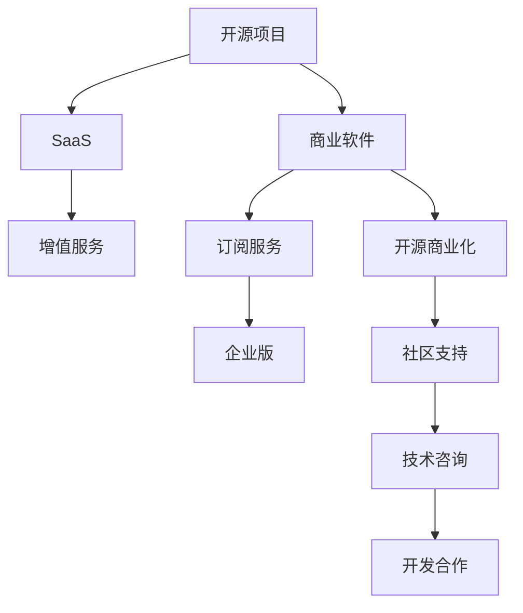

                 

# 利用开源项目创造收入流

## 1. 背景介绍

在软件行业的今天，开源项目已经成为推动技术创新和普及的重要力量。通过利用开源项目的资源，不仅可以加速产品开发，提高开发效率，还能降低开发成本，快速响应市场变化。然而，开源项目的价值远不止于此，它还可以通过商业模式创新，创造出新的收入流。本文将深入探讨如何利用开源项目创造收入流，帮助企业获得可持续的发展动力。

## 2. 核心概念与联系

### 2.1 核心概念概述

为了更好地理解如何利用开源项目创造收入流，我们首先需要明确几个关键概念：

- **开源项目**：指在特定协议下，允许用户自由获取、修改和分发的软件项目，如Apache、MIT等许可证下的项目。

- **商业软件**：指通过收费授权获得使用的商业软件，如Microsoft Office、SAP等。

- **软件即服务(SaaS)**：指通过互联网提供软件服务，如Salesforce、Zoom等。

- **开源商业化**：指在开源项目的基础上，通过商业授权、付费支持等方式获得收入，同时保留开源属性。

- **开源商业化模型**：指利用开源项目的代码、技术、社区资源等，设计并实施的商业模式。

### 2.2 核心概念之间的联系

下图展示了开源项目与商业软件、SaaS之间的联系和转化关系：



- **开源项目到商业软件**：通过对开源项目进行商业包装和定制化，将其转化为商业软件。
- **开源项目到SaaS**：将开源项目部署到云平台，提供按需服务。
- **开源项目到增值服务**：在SaaS和商业软件基础上，提供高级功能和服务。
- **开源项目到订阅服务**：通过收取订阅费用，获得稳定收入流。
- **开源项目到开源商业化**：在开源项目上设计开源商业化模型，获取商业价值。

开源商业化模型的核心在于如何平衡开源精神和商业利益，既要利用开源项目的优势，又要保证商业模式的盈利能力。

## 3. 核心算法原理 & 具体操作步骤

### 3.1 算法原理概述

开源商业化模型的核心原理是：利用开源项目的广泛社区资源和灵活开源许可证，吸引开发者和企业用户参与，通过商业服务和增值服务实现收入。以下是开源商业化模型的一般流程：

1. **开源项目选择**：选择合适的开源项目，评估其潜在的商业价值和社区活跃度。
2. **商业模式设计**：根据开源项目的特性和市场需求，设计商业化和收费策略。
3. **增值服务开发**：在开源项目基础上，开发商业功能、增值服务和支持服务。
4. **市场推广和销售**：通过社区渠道、合作伙伴和直接销售等方式，推广和销售商业产品。
5. **用户支持和反馈**：提供优质的用户支持和社区反馈，维护和提升用户满意度。

### 3.2 算法步骤详解

以下是开源商业化模型的详细步骤：

**Step 1: 选择和评估开源项目**

- 评估开源项目的社区活跃度、代码质量、功能特性、许可证类型等，确定潜在商业价值。
- 选择社区活跃、功能完备、许可证灵活的开源项目进行商业化尝试。

**Step 2: 设计商业模型**

- 确定商业化的目标和策略，如产品定位、收费模式、用户群体等。
- 设计商业授权方式，如开源许可证、企业版授权、订阅服务等。

**Step 3: 开发增值服务**

- 在开源项目基础上，开发商业功能和增值服务，如定制化、插件、集成服务等。
- 根据市场需求和用户反馈，不断优化和丰富增值服务内容。

**Step 4: 推广和销售**

- 利用开源社区、技术博客、会议讲座等渠道，推广商业产品。
- 通过直接销售、合作伙伴、在线商店等渠道，获取用户和收入。

**Step 5: 用户支持和反馈**

- 提供用户支持和技术咨询，帮助用户解决使用问题。
- 收集用户反馈，不断优化产品和服务，提升用户满意度。

### 3.3 算法优缺点

开源商业化模型具有以下优点：

- **成本低廉**：利用开源项目和社区资源，减少了研发和市场推广成本。
- **灵活开放**：开源许可证提供了高度的灵活性，便于商业化过程中进行调整和优化。
- **市场敏捷**：通过开源社区和开发者支持，快速响应市场需求变化。

但同时，该模型也存在以下缺点：

- **盈利能力有限**：开源项目的商业价值可能不如商业软件，难以获得高额利润。
- **知识产权风险**：开源项目的多样化贡献，可能存在知识产权风险，需仔细评估和管理。
- **用户期望管理**：开源社区对商业化的期望较高，需合理管理用户和社区的期望。

### 3.4 算法应用领域

开源商业化模型在多个领域得到了广泛应用，包括但不限于：

- **软件即服务(SaaS)**：如OpenCart、Laravel、Joomla等开源项目，通过SaaS模式提供云端解决方案。
- **开源商业软件**：如Jenkins、Fiddler、FileZilla等开源项目，通过企业版授权和增值服务获得收入。
- **开源平台和框架**：如Kubernetes、Apache Kafka、Elasticsearch等，通过云服务和企业支持实现商业化。

这些应用领域展示了开源商业化模型在不同场景下的成功实践，为更多企业提供了可借鉴的经验。

## 4. 数学模型和公式 & 详细讲解 & 举例说明

### 4.1 数学模型构建

我们以OpenCart为例，展示如何利用开源商业化模型进行商业化。

假设OpenCart的社区活跃度为$P$，代码质量和功能特性为$Q$，许可证类型为$L$。我们设计了如下商业模型：

- 提供基础版免费使用，订阅高级版获得更多功能。
- 企业版通过收费授权，获得定制化和高级服务。
- 增值服务包括插件、主题、集成等，通过付费提供。

数学模型可以表示为：

$$
R = aP + bQ + cL
$$

其中，$R$为收入，$a$、$b$、$c$为模型参数，表示对各个因素的权重。

### 4.2 公式推导过程

根据市场需求和反馈，我们可以通过回归分析等方法，对模型参数进行优化，确保商业模型能够最大化收入。

假设我们收集了10个开放源码社区、代码质量和许可证类型的数据，构建了如下回归模型：

$$
\hat{R} = \beta_0 + \beta_1 P + \beta_2 Q + \beta_3 L
$$

通过最小二乘法求解$\beta_1$、$\beta_2$、$\beta_3$，得到最优的商业模型。

### 4.3 案例分析与讲解

我们以Salesforce为例，展示其成功的开源商业化实践。

Salesforce通过以下步骤实现开源商业化：

1. 选择基于开源Apache许可证的CruiseControl项目，进行商业化。
2. 设计CruiseControl的商业授权方式，提供免费基础版和付费高级版。
3. 开发和发布增值服务，如插件、集成、支持服务等。
4. 通过社区渠道、会议、在线商店推广商业产品。
5. 提供优质的用户支持和反馈机制，提升用户满意度。

Salesforce通过开源商业化模型，不仅获得了稳定的收入流，还提升了品牌知名度和市场竞争力。

## 5. 项目实践：代码实例和详细解释说明

### 5.1 开发环境搭建

为了进行开源商业化实践，我们需要搭建一个开发环境。以下是具体步骤：

1. 安装Python、Node.js、Java等开发环境。
2. 配置OpenCart、Jenkins、Apache Kafka等开源项目，安装必要的依赖和插件。
3. 搭建云平台，如AWS、Azure、Google Cloud等，准备SaaS部署环境。

### 5.2 源代码详细实现

以OpenCart为例，展示如何实现商业化：

1. 修改OpenCart许可证文件，添加企业版授权和增值服务内容。
2. 开发增值服务，如插件、主题、集成等。
3. 实现订阅服务，提供基础版免费使用和企业版收费授权。
4. 部署到云平台，提供SaaS解决方案。

### 5.3 代码解读与分析

**修改许可证文件**

```python
# 修改OpenCart许可证文件
open('OpenCart许可证', 'w').write('Apache 2.0 License\n')
open('OpenCart许可证', 'a').write('此许可证允许企业版授权，以及增值服务的开发和使用。')
```

**开发增值服务**

```javascript
# 开发插件服务
const pluginModule = require('./plugin.js');
pluginModule.loadPlugins();

# 开发主题服务
const themeModule = require('./theme.js');
themeModule.loadThemes();
```

**实现订阅服务**

```python
# 实现基础版免费使用
class BaseVersion:
    def __init__(self):
        self.account = User()
    
    def use(self):
        return self.account
    
# 实现企业版收费授权
class EnterpriseVersion:
    def __init__(self, account):
        self.account = account
    
    def authorize(self):
        return self.account
    
    def pay(self):
        return True
```

**部署到云平台**

```python
# 部署到AWS云平台
aws CLI deploy
```

## 6. 实际应用场景

开源商业化模型已经在多个实际应用场景中得到了成功的实践。以下是几个典型的应用案例：

### 6.1 企业级商业软件

**Apache Kafka**

Apache Kafka是一个分布式流处理平台，通过开源商业化模型，提供了企业版授权和增值服务。企业版包括安全、监控、高可用等功能，以及基于Kafka的商业解决方案，如实时数据处理、流式分析等。

### 6.2 开源SaaS平台

**OpenCart**

OpenCart是一个开源电子商务平台，通过开源商业化模型，提供了免费基础版和付费高级版。高级版包括更多功能和插件，以及企业版授权，提供定制化开发和支持服务。

### 6.3 开源商业框架

**Laravel**

Laravel是一个开源Web框架，通过开源商业化模型，提供了免费基础版和付费企业版。企业版包括更多功能和插件，以及技术支持和开发合作，帮助企业快速构建Web应用。

## 7. 工具和资源推荐

### 7.1 学习资源推荐

为了深入理解开源商业化模型，我们推荐以下几个学习资源：

1. **开源商业化模型概述**：《开源商业化模型：原理与实践》书籍，详细介绍了开源商业化模型的原理、案例和实践。
2. **开源社区管理**：《开源社区管理：实践指南》书籍，提供开源项目管理和商业化的最佳实践。
3. **开源许可证**：《开源许可证：详细解读与实践》书籍，解析开源许可证的类型和商业化的限制。
4. **开源商业化案例**：OpenCart、Apache Kafka等开源项目的商业化案例，提供详细的商业化实践经验。

### 7.2 开发工具推荐

为了更好地进行开源商业化实践，以下是一些推荐的开发工具：

1. **云平台**：AWS、Azure、Google Cloud等，提供稳定的SaaS和云服务环境。
2. **开发环境**：Visual Studio Code、Eclipse、IntelliJ IDEA等，支持开源项目和商业化开发。
3. **项目管理**：JIRA、GitLab、GitHub等，提供项目管理和版本控制功能。

### 7.3 相关论文推荐

为了深入了解开源商业化模型，以下是一些推荐的相关论文：

1. **开源商业化模型研究**：《开源商业化模型：现状与挑战》，探讨开源商业化的应用和挑战。
2. **开源商业化策略**：《开源商业化策略：案例分析》，分析开源商业化的成功案例和策略。
3. **开源商业化技术**：《开源商业化技术：实践经验》，分享开源商业化的技术实现和经验。

## 8. 总结：未来发展趋势与挑战

### 8.1 总结

本文详细介绍了如何利用开源项目创造收入流，揭示了开源商业化模型的原理、步骤和优缺点。通过开源商业化模型，企业可以利用开源项目的技术和社区资源，设计并实施商业化策略，获得持续的收入流。

### 8.2 未来发展趋势

展望未来，开源商业化模型将呈现以下几个发展趋势：

1. **开源商业化工具成熟**：开源商业化工具和平台将更加成熟，提供一站式的商业化解决方案。
2. **开源商业化领域扩大**：开源商业化模型将应用于更多领域，如IoT、AI、大数据等。
3. **开源商业化模式多样化**：开源商业化模型将更加多样化，包括订阅模式、企业授权、增值服务等。

### 8.3 面临的挑战

开源商业化模型在推广和实施过程中，仍面临以下挑战：

1. **用户期望管理**：开源社区对商业化的期望较高，需合理管理用户和社区的期望。
2. **知识产权风险**：开源项目的知识产权问题，需仔细评估和管理。
3. **盈利能力提升**：开源商业化模型的盈利能力有限，需找到有效的商业化策略。

### 8.4 研究展望

未来，开源商业化模型的研究将集中在以下几个方向：

1. **开源商业化工具和平台**：开发更加易用、高效的开源商业化工具和平台，帮助更多企业实现商业化。
2. **开源商业化策略**：研究更加灵活、多样化的开源商业化策略，提高商业化效果。
3. **开源商业化生态**：建立开源商业化的生态系统，促进开源社区和商业化的良性互动。

## 9. 附录：常见问题与解答

**Q1：如何选择开源项目进行商业化？**

A: 选择开源项目进行商业化，需要评估其社区活跃度、代码质量、功能特性和许可证类型等。优先选择社区活跃、功能完备、许可证灵活的开源项目进行商业化尝试。

**Q2：如何设计开源商业化模型？**

A: 设计开源商业化模型，需要明确商业目标和策略，如产品定位、收费模式、用户群体等。设计灵活的授权方式，如开源许可证、企业版授权、订阅服务等。

**Q3：如何提升开源商业化模型的盈利能力？**

A: 提升开源商业化模型的盈利能力，需要合理管理用户和社区的期望，灵活设计增值服务，提高用户满意度和忠诚度。同时，优化商业授权方式，增加订阅用户和高级服务收入。

**Q4：如何应对开源商业化模型的挑战？**

A: 应对开源商业化模型的挑战，需要仔细评估和管理知识产权风险，提升商业化工具和平台，以及研究多样化的商业化策略。

**Q5：未来开源商业化模型的发展方向是什么？**

A: 未来开源商业化模型的发展方向，包括开源商业化工具和平台的成熟、开源商业化领域的扩大、开源商业化模式的多样化等。

通过本文的详细阐述，我们深入理解了如何利用开源项目创造收入流，揭示了开源商业化模型的原理、步骤和优缺点。开源商业化模型为企业的商业化提供了全新的思路和方法，通过灵活应用，能够实现可持续的收入流，促进企业的长期发展。希望本文能为更多企业提供实用的指导和借鉴。

---

作者：禅与计算机程序设计艺术 / Zen and the Art of Computer Programming

