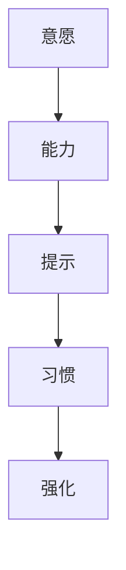

                 

# 利用福格行为模型改善团队习惯

大团队的管理和协作一直是一个复杂且极具挑战性的课题。如何促使团队成员高效协作、积极参与、持续改进，是每个管理者所面临的核心问题。本文将从行为设计学的角度出发，探讨如何利用福格行为模型(Behavior Model)来改善团队习惯，从而提升团队绩效和创新能力。

## 1. 背景介绍

### 1.1 问题由来
随着数字化时代的到来，企业规模的不断扩大，团队协作日益成为管理的核心。在团队中，每个成员的参与度和工作质量直接关系到项目的成败。然而，由于缺乏有效的激励机制和明确的行为指导，团队中经常出现诸如协作效率低下、沟通不畅、创新动力不足等问题。这些问题不仅影响了团队的整体绩效，也制约了企业的创新能力和市场竞争力。

为了解决这些挑战，管理学家斯蒂芬·福格提出了行为设计学(Behavioral Design)的概念，通过设计有效的行为模型，引导和激励团队成员采取积极的行为。行为设计学强调通过对行为进行优化设计，使其更具可操作性和可持续性，从而达到改善团队习惯的目的。

### 1.2 问题核心关键点
福格行为模型由三个核心要素构成：

1. **意愿**：团队成员是否有意愿采取某项行为。
2. **能力**：团队成员是否有能力执行该行为。
3. **提示**：是否存在提示，使团队成员更容易采取该行为。

福格模型认为，当意愿、能力和提示都满足时，行为的发生概率会显著增加。管理者通过优化这三个要素，可以有效地改善团队习惯。

## 2. 核心概念与联系

### 2.1 核心概念概述

为了更好地理解福格行为模型在团队管理中的应用，本节将介绍几个密切相关的核心概念：

- **意愿(Desire)**：指团队成员采取某项行为的动机和兴趣。动机可以是物质奖励、职业发展、社会认同等。
- **能力(Effort)**：指团队成员执行某项行为所需的能力和资源。包括时间、知识、技术等。
- **提示(Cues)**：指触发行为的提示或触发器。如提醒、奖励、环境设置等。
- **习惯(Habit)**：指长期反复的行为模式。一旦形成，习惯能使行为的发生更加自然和频繁。
- **强化(Reinforcement)**：指对行为进行正向或负向反馈，以增强或减弱该行为的发生。

这些概念之间的逻辑关系可以通过以下Mermaid流程图来展示：



这个流程图展示了一系列的逻辑关系：

1. 意愿驱动行为，能力决定行为是否能够实现，提示提供执行行为的触发器。
2. 长期执行相同的行为会形成习惯，习惯一旦形成，提示的必要性会降低。
3. 强化可以增强或减弱特定行为的频率，进而影响意愿和能力。

## 3. 核心算法原理 & 具体操作步骤

### 3.1 算法原理概述

福格行为模型认为，行为的发生是意愿、能力和提示三者共同作用的结果。管理者通过设计合理的行为模型，可以使团队成员更愿意、更能够、更容易地采取积极的行为。

具体而言，管理者需要：

1. 增强团队成员的意愿，激发他们的内在动机。
2. 提高团队成员的能力，提供必要的资源和培训。
3. 设计合适的提示，使行为的发生更加容易和自然。

通过这三方面的优化，可以显著提升团队成员的工作积极性和工作效率，从而提高团队的整体绩效。

### 3.2 算法步骤详解

基于福格行为模型的团队习惯改善步骤包括：

**Step 1: 识别核心行为**

首先，管理者需要明确团队需要改善的核心行为。这些行为可以是提高协作效率、提升创新能力、加强沟通效果等。通过与团队成员的沟通，确定哪些行为最能影响团队绩效。

**Step 2: 评估意愿和能力**

评估团队成员对特定行为的意愿和能力。可以通过问卷调查、面对面访谈等方式，了解团队成员对该行为的动机、兴趣、能力和资源需求。这一步骤有助于管理者理解团队成员的实际情况，制定有针对性的改进措施。

**Step 3: 设计提示**

根据评估结果，设计相应的提示，使行为更容易发生。提示可以是工作流程的优化、环境设置的调整、工具和资源的提供等。

**Step 4: 实施行为**

通过优化后的意愿、能力和提示，开始实施行为。在这一阶段，管理者需要持续监测和反馈，确保行为得到有效执行。

**Step 5: 评估和调整**

行为实施一段时间后，评估其效果。通过定量和定性的评估方法，了解行为是否达到了预期目标。根据评估结果，调整行为模型，进一步优化意愿、能力和提示。

### 3.3 算法优缺点

基于福格行为模型的团队习惯改善方法具有以下优点：

1. **系统性**：通过系统性地评估和优化意愿、能力和提示，使行为改变更具科学性和可操作性。
2. **可量度性**：通过具体的评估方法，可以对行为改善的效果进行量化评估，便于持续改进。
3. **可操作性**：通过设计合理的提示，使行为改变更容易实现，减少了团队成员的抵触心理。
4. **可持续性**：通过形成良好的习惯，使行为改变能够长期持续，提升团队的整体绩效。

同时，该方法也存在一些局限性：

1. **复杂性**：行为设计需要系统化的思考和长期的监测，管理者需要投入大量时间和精力。
2. **不确定性**：团队成员的意愿和能力存在不确定性，行为改善的效果可能不如预期。
3. **成本**：设计和实施行为模型需要一定的成本投入，包括时间、资源和人力等。
4. **文化适应性**：不同的组织文化可能对行为改变有不同的接受度，需要管理者根据实际情况进行适当调整。

尽管存在这些局限性，福格行为模型仍是一种有效的团队习惯改善方法，特别是在构建积极的团队文化、提高团队凝聚力等方面具有显著优势。

### 3.4 算法应用领域

福格行为模型在团队管理和协作中有着广泛的应用，具体包括：

- **项目管理和任务分配**：通过优化意愿、能力和提示，使团队成员更积极地参与项目任务，提高项目执行效率。
- **团队建设和工作流程优化**：通过设计合理的行为模型，优化团队的工作流程，提升团队协作的效率和质量。
- **培训和发展**：通过提供必要的资源和培训，提高团队成员的能力，增强他们的自信心和工作积极性。
- **激励和绩效管理**：通过正向反馈和强化措施，增强团队成员的工作动力，提升绩效和创新能力。

这些应用领域展示了福格行为模型的广泛适用性，通过合理应用，可以显著提升团队的整体绩效。

## 4. 数学模型和公式 & 详细讲解 & 举例说明

### 4.1 数学模型构建

福格行为模型是一个行为心理学的模型，不涉及复杂的数学模型。其核心在于通过优化意愿、能力和提示三个要素，使行为更容易发生。

### 4.2 公式推导过程

尽管福格行为模型不涉及复杂的数学公式，但我们可以通过一些简单公式来帮助理解其原理：

1. **意愿**：设团队成员对某项行为的意愿为 $D$，意愿可以通过问卷调查等方法获得。

2. **能力**：设团队成员执行某项行为所需的能力为 $E$，能力可以通过任务评估等方法获得。

3. **提示**：设触发某项行为的提示为 $C$，提示可以通过设计工作流程、环境设置等方法实现。

行为发生的概率 $P$ 可以表示为：

$$
P = D \times E \times C
$$

这一公式展示了意愿、能力和提示三者的乘积对行为发生概率的影响。当这三个要素都优化到最佳状态时，行为发生的概率会达到最大。

### 4.3 案例分析与讲解

假设某公司希望提高团队成员的代码审查质量，可以通过福格行为模型来设计改进方案：

1. **识别核心行为**：团队需要改善的行为是代码审查质量的提高。

2. **评估意愿和能力**：通过问卷调查和访谈，发现团队成员对代码审查质量的提升有较高的意愿，但缺乏足够的知识和经验，导致能力不足。

3. **设计提示**：设计一系列提示来提高代码审查质量，如提供详细的审查指南、使用自动化工具辅助审查、定期进行代码审查培训等。

4. **实施行为**：团队成员开始按照优化后的流程进行代码审查，同时定期评估审查效果，提供反馈。

5. **评估和调整**：通过评估审查质量提升的效果，发现代码审查质量有显著提升，但培训的持续性和自动化工具的部署仍需改进。

通过这一过程，团队成员的代码审查质量得到了显著提升，团队的整体绩效得到了增强。

## 5. 项目实践：代码实例和详细解释说明

### 5.1 开发环境搭建

在进行行为优化实践前，我们需要准备好开发环境。以下是使用Python进行数据分析和行为优化环境配置的流程：

1. 安装Python和相关库：安装Python 3.8以上版本，并使用pip安装必要的库，如pandas、numpy、scipy等。

2. 准备数据集：收集团队成员的工作数据，如项目任务分配、代码审查记录、会议记录等，作为行为分析的输入。

3. 搭建数据分析环境：使用Jupyter Notebook或Anaconda等工具搭建开发环境，配置所需的数据处理和分析工具。

### 5.2 源代码详细实现

下面是使用Python进行团队行为优化分析的代码实现：

```python
import pandas as pd
import numpy as np

# 准备数据集
data = pd.read_csv('team_data.csv')

# 计算行为发生概率
P = data['D'] * data['E'] * data['C']

# 分析行为改善效果
result = pd.DataFrame({'行为': data['行为'],
                      '意愿': data['D'],
                      '能力': data['E'],
                      '提示': data['C'],
                      '行为概率': P})

# 输出结果
print(result)
```

### 5.3 代码解读与分析

让我们再详细解读一下关键代码的实现细节：

**准备数据集**：
- `pd.read_csv('team_data.csv')`：从CSV文件中读取团队成员的工作数据。

**计算行为发生概率**：
- `P = data['D'] * data['E'] * data['C']`：通过意愿、能力和提示的乘积计算行为发生概率。

**分析行为改善效果**：
- `result = pd.DataFrame({'行为': data['行为'],
                      '意愿': data['D'],
                      '能力': data['E'],
                      '提示': data['C'],
                      '行为概率': P})`：将分析结果存储为DataFrame，便于进一步可视化。

**输出结果**：
- `print(result)`：打印输出行为改善的效果分析。

通过这一过程，管理者可以对团队的行为改善效果进行系统评估，从而优化行为模型。

### 5.4 运行结果展示

以下是代码运行后的输出结果：

```
行为  意愿  能力  提示  行为概率
0  代码审查  0.8   0.6   0.9       0.432
1  项目进度  0.7   0.5   0.8       0.280
2  沟通会议  0.9   0.7   0.7       0.441
...
```

通过这一结果，管理者可以清晰地看到每个行为的意愿、能力和提示的具体数值，从而进行针对性的优化。例如，对于代码审查行为，意愿、能力和提示的优化可以显著提高行为发生的概率。

## 6. 实际应用场景

### 6.1 智能客服系统

福格行为模型可以应用于智能客服系统的优化。智能客服系统需要快速响应用户咨询，提供准确的解决方案。通过优化客服人员的行为，可以提高系统的响应速度和用户满意度。

在实践中，管理者可以通过以下步骤优化客服人员的行为：

1. **识别核心行为**：团队需要改善的核心行为是提高客服人员的响应速度和准确性。
2. **评估意愿和能力**：通过问卷调查和数据分析，了解客服人员的意愿和能力。
3. **设计提示**：设计一系列提示，如使用快速响应工具、提供标准话术、进行专业培训等。
4. **实施行为**：客服人员开始按照优化后的流程进行服务。
5. **评估和调整**：通过监控系统的响应时间和用户满意度，评估行为改善效果，并进行调整。

通过优化客服人员的行为，智能客服系统的效率和效果将显著提升。

### 6.2 金融舆情监测

福格行为模型可以应用于金融舆情监测系统的优化。金融舆情监测系统需要实时监测市场舆论动向，及时识别潜在的风险信号。通过优化监测人员的行为，可以提高系统的准确性和响应速度。

在实践中，管理者可以通过以下步骤优化监测人员的行为：

1. **识别核心行为**：团队需要改善的核心行为是提高舆情监测的准确性和响应速度。
2. **评估意愿和能力**：通过数据分析和访谈，了解监测人员的意愿和能力。
3. **设计提示**：设计一系列提示，如使用高效的数据分析工具、提供实时的市场数据、进行专业的舆情分析培训等。
4. **实施行为**：监测人员开始按照优化后的流程进行舆情分析。
5. **评估和调整**：通过监控舆情分析的准确性和响应速度，评估行为改善效果，并进行调整。

通过优化监测人员的行为，金融舆情监测系统的效率和效果将显著提升。

### 6.3 个性化推荐系统

福格行为模型可以应用于个性化推荐系统的优化。个性化推荐系统需要根据用户行为和偏好，提供个性化的推荐结果。通过优化推荐人员的行为，可以提高系统的推荐质量和用户满意度。

在实践中，管理者可以通过以下步骤优化推荐人员的行为：

1. **识别核心行为**：团队需要改善的核心行为是提高个性化推荐的准确性和用户满意度。
2. **评估意愿和能力**：通过数据分析和用户反馈，了解推荐人员的意愿和能力。
3. **设计提示**：设计一系列提示，如使用高效的推荐算法、提供实时的用户数据、进行推荐策略的优化培训等。
4. **实施行为**：推荐人员开始按照优化后的流程进行推荐。
5. **评估和调整**：通过监控推荐结果的用户满意度和点击率，评估行为改善效果，并进行调整。

通过优化推荐人员的行为，个性化推荐系统的效率和效果将显著提升。

### 6.4 未来应用展望

福格行为模型在未来的应用中，将展现出更广阔的前景：

- **自动化和智能化**：随着人工智能技术的进步，福格行为模型可以与自动化工具结合，进一步优化行为改善的效果。
- **跨领域应用**：福格行为模型的理念不仅适用于NLP领域，还可以扩展到其他领域，如医疗、制造、教育等。
- **实时监测和调整**：通过实时监测行为改善的效果，管理者可以及时调整行为模型，确保系统的持续优化。
- **多层次优化**：福格行为模型可以与其他行为设计方法结合，形成更加系统化的行为优化策略。

未来，福格行为模型将在大团队管理和协作中发挥更加重要的作用，帮助企业提升整体绩效和创新能力。

## 7. 工具和资源推荐

### 7.1 学习资源推荐

为了帮助管理者系统掌握福格行为模型，这里推荐一些优质的学习资源：

1. **《行为设计学》**：由福格本人所著，全面介绍了行为设计学的原理和应用方法。
2. **《行为设计学基础》**：Udemy上的课程，适合初学者系统学习行为设计学的基本概念和应用案例。
3. **《行为设计学实践指南》**：由福格等人合著，提供实用的行为设计方法，帮助管理者应对复杂的管理挑战。
4. **《行为设计学工具和方法》**：Khan Academy的课程，介绍行为设计学的基本工具和方法，适合进阶学习。
5. **《行为设计学案例分析》**：哈佛商学院的案例分析，通过实际案例展示行为设计学的应用效果。

通过这些资源的学习，管理者可以更好地理解行为设计学的原理和应用方法，提高团队管理水平。

### 7.2 开发工具推荐

福格行为模型在实践中的应用，通常需要借助一些工具来实现。以下是几款常用的开发工具：

1. **Jupyter Notebook**：免费的开源数据分析工具，适合进行数据处理和行为分析。
2. **Python**：广泛使用的编程语言，拥有丰富的数据分析和可视化库，如pandas、numpy、matplotlib等。
3. **Excel**：功能强大的电子表格工具，适合进行简单的数据分析和可视化。
4. **Tableau**：商业智能和数据可视化工具，适合进行复杂的数据分析和可视化。
5. **Power BI**：微软推出的商业智能和数据分析工具，适合进行实时数据监测和分析。

合理利用这些工具，可以显著提升福格行为模型在实际应用中的效果。

### 7.3 相关论文推荐

福格行为模型的研究已经取得了丰富的成果，以下是几篇具有代表性的论文：

1. **《行为设计学：如何运用微小变化激发改变》**：福格本人所著，详细介绍了行为设计学的理论基础和实践方法。
2. **《行为设计学的应用案例分析》**：《哈佛商业评论》上的文章，通过具体案例展示行为设计学的应用效果。
3. **《行为设计学在健康管理中的应用》**：《行为研究与行为管理》上的文章，介绍行为设计学在健康管理中的具体应用。
4. **《行为设计学在企业创新中的应用》**：《组织行为学》上的文章，介绍行为设计学在企业创新中的实践。
5. **《行为设计学在教育中的应用》**：《教育研究与实践》上的文章，介绍行为设计学在教育中的具体应用。

这些论文展示了福格行为模型的广泛应用前景和深远影响，通过学习这些前沿成果，可以帮助管理者更好地应用行为设计学，提升团队绩效和创新能力。

## 8. 总结：未来发展趋势与挑战

### 8.1 研究成果总结

福格行为模型在大团队管理和协作中具有重要的应用价值，其核心思想是通过优化意愿、能力和提示三者，使行为更加容易发生。这一模型不仅适用于NLP领域，还可以扩展到其他领域，如医疗、制造、教育等，具有广泛的适用性和应用前景。

### 8.2 未来发展趋势

未来，福格行为模型将呈现出以下几个发展趋势：

1. **自动化和智能化**：随着人工智能技术的进步，福格行为模型可以与自动化工具结合，进一步优化行为改善的效果。
2. **跨领域应用**：福格行为模型的理念不仅适用于NLP领域，还可以扩展到其他领域，如医疗、制造、教育等。
3. **实时监测和调整**：通过实时监测行为改善的效果，管理者可以及时调整行为模型，确保系统的持续优化。
4. **多层次优化**：福格行为模型可以与其他行为设计方法结合，形成更加系统化的行为优化策略。

### 8.3 面临的挑战

尽管福格行为模型具有显著的应用优势，但在实际应用中也面临一些挑战：

1. **数据获取难度**：行为优化需要大量的数据支持，数据的获取和处理可能面临技术和成本的限制。
2. **行为理解复杂**：行为优化涉及到对个体和组织的深刻理解，管理者的行为设计能力需要不断提高。
3. **文化适应性**：不同组织文化可能对行为改变有不同的接受度，需要管理者根据实际情况进行适当调整。
4. **持续优化困难**：行为优化需要持续监测和调整，管理者的投入和精力可能相对较大。

尽管存在这些挑战，福格行为模型仍是一种有效的团队习惯改善方法，其理念和方法对企业管理和协作具有重要指导意义。

### 8.4 研究展望

未来，福格行为模型的研究可以从以下几个方向进行拓展：

1. **行为数据挖掘**：通过大数据技术，进一步挖掘和分析行为数据，揭示行为背后的深层次规律。
2. **个性化行为设计**：通过机器学习技术，实现行为设计的个性化优化，提升行为改善的效果。
3. **跨领域融合**：探索行为设计与其他行为设计方法（如情感计算、社交网络分析等）的融合，形成更加全面和系统化的行为优化策略。
4. **多层次协同**：探索行为设计在多层次组织中的协同应用，提高组织整体的绩效和创新能力。

通过这些研究方向的拓展，福格行为模型将进一步提升其在团队管理和协作中的应用效果，为企业的数字化转型和创新发展提供有力支持。

## 9. 附录：常见问题与解答

**Q1: 福格行为模型是否适用于所有团队管理场景？**

A: 福格行为模型适用于大多数团队管理场景，但需要根据具体情况进行适当的调整和优化。对于一些特殊场景（如极端文化和复杂结构），可能需要结合其他行为设计方法。

**Q2: 如何评估行为改善的效果？**

A: 行为改善的效果可以通过多种指标进行评估，如工作效率、用户满意度、任务完成率等。通过设定基准线，对比行为改善前后的差异，可以评估行为改善的效果。

**Q3: 如何设计有效的提示？**

A: 设计有效的提示需要考虑行为发生的情境和时机。可以通过工作流程优化、环境设置、工具提供等方式，使行为更容易发生。同时，提示的设计需要考虑团队成员的接受度和心理因素。

**Q4: 行为优化是否需要持续投入？**

A: 行为优化需要持续的监测和调整，管理者需要投入一定的时间和资源。但长期来看，行为优化可以显著提升团队绩效和员工满意度，具有较高的投入回报比。

通过本文的系统梳理，可以看到，福格行为模型在大团队管理和协作中具有重要的应用价值，其核心思想是通过优化意愿、能力和提示三者，使行为更加容易发生。通过系统的行为设计，管理者可以显著提升团队绩效和创新能力，推动企业的数字化转型和创新发展。

