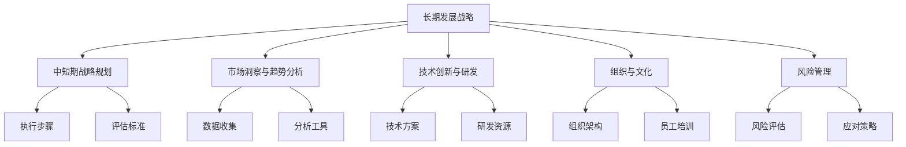

                 

# 制定长期发展战略的重要性

## 1. 背景介绍

在现代科技飞速发展的时代，企业的生存和发展愈发依赖于高效的决策和精准的战略规划。尤其是对于IT和科技企业而言，在面对快速变化的市场环境、技术迭代以及竞争压力时，制定长期发展战略显得尤为重要。本文将深入探讨制定长期发展战略的重要性，并结合实际案例分析，提供具体的战略制定方法和实践建议。

## 2. 核心概念与联系

### 2.1 核心概念概述

为了更好地理解长期发展战略的制定和实施，我们需要首先明确几个核心概念及其相互联系：

- **长期发展战略 (Long-term Development Strategy)**：指企业为实现长期目标和愿景，对未来几年甚至几十年内的业务发展方向、重点领域、资源配置、组织架构等进行的全面规划。

- **中短期战略规划 (Mid-term and Short-term Strategy Planning)**：相对于长期发展战略，中短期战略规划更具体、操作性更强，通常为期1-3年，明确具体的执行步骤和评估标准。

- **市场洞察与趋势分析 (Market Insights and Trend Analysis)**：通过市场调研、行业报告、数据分析等手段，了解市场动态和未来趋势，为战略制定提供客观依据。

- **技术创新与研发 (Technological Innovation and R&D)**：持续投入研发资源，推动技术突破和产品创新，保持企业核心竞争力的领先优势。

- **组织与文化 (Organization and Culture)**：通过优化组织结构、培养企业文化，增强内部协同和执行力，支持战略的顺利实施。

- **风险管理 (Risk Management)**：识别潜在风险和挑战，制定应对措施，确保战略实施过程中的稳定性和可持续性。

这些概念之间的联系通过以下Mermaid流程图加以展示：



## 3. 核心算法原理 & 具体操作步骤

### 3.1 算法原理概述

制定长期发展战略的根本目标是确保企业在动态变化的市场环境中持续发展和成长。其核心算法原理包括以下几个方面：

- **市场分析与需求预测**：利用市场调研和历史数据，预测未来市场需求和趋势。
- **资源配置与成本效益分析**：评估不同战略选项的成本效益，选择最优资源配置方案。
- **竞争分析与定位**：通过SWOT分析（优势、劣势、机会、威胁），识别竞争对手的战略，明确自身市场定位。
- **组织设计与执行力**：设计合适的组织结构，培养团队执行力，确保战略目标的实现。
- **风险评估与应对策略**：识别潜在的风险因素，制定预案和应对措施，确保战略的稳健实施。

### 3.2 算法步骤详解

制定长期发展战略通常包括以下关键步骤：

**Step 1: 战略目标设定**

- 明确企业的长期愿景和目标，确定关键绩效指标(KPIs)。
- 确定战略的核心价值和主要驱动力。

**Step 2: 市场洞察与趋势分析**

- 收集市场数据，分析行业发展趋势和机会。
- 使用数据分析工具（如SWOT分析、PEST分析等）进行市场洞察。
- 识别市场缺口和潜在增长点。

**Step 3: 竞争分析与定位**

- 分析主要竞争对手的战略、优势和劣势。
- 评估自身的核心竞争力和市场定位。
- 制定差异化战略，突显自身独特价值。

**Step 4: 资源配置与成本效益分析**

- 评估不同战略选项的资源需求和成本。
- 利用财务模型进行成本效益分析。
- 选择最优资源配置方案。

**Step 5: 组织设计与执行力**

- 设计合适的组织架构，明确各部门职能和协作机制。
- 培养团队执行力，进行有效的战略沟通和培训。
- 确保战略实施过程中的资源协调和进度控制。

**Step 6: 风险评估与应对策略**

- 识别潜在风险和挑战。
- 制定预案和应对策略。
- 定期评估风险和效果，及时调整战略实施方案。

### 3.3 算法优缺点

长期发展战略的制定具有以下优点：

- **系统性**：从市场、技术、组织等多个维度进行全面分析，系统性较强。
- **前瞻性**：明确未来几年乃至几十年的发展方向，能够有效应对市场变化。
- **操作性**：通过中短期战略规划，使长期战略具备具体执行步骤和评估标准。

其缺点包括：

- **资源消耗大**：需要大量的人力、物力和财力投入。
- **实施周期长**：从战略制定到实施见效需要较长时间，短期内难以见效。
- **市场变化复杂**：市场环境多变，战略实施过程中可能遇到未知挑战。

### 3.4 算法应用领域

长期发展战略的应用领域非常广泛，涵盖了从科技企业到传统制造，从金融到医疗等各个行业。以下是几个典型应用案例：

- **科技企业**：如Google、Amazon等，通过持续的长期发展战略，保持其在技术创新和市场拓展方面的领先地位。
- **制造业**：如Tesla、BMW等，通过战略规划，推动产品升级和市场扩展，实现可持续发展。
- **金融行业**：如JP Morgan、Goldman Sachs等，通过长期战略规划，实现业务多元化和技术创新，提升市场竞争力。
- **医疗健康**：如Mayo Clinic、Kaiser Permanente等，通过战略规划，推动医疗技术和服务的持续改进，提升患者满意度和服务质量。

## 4. 数学模型和公式 & 详细讲解 & 举例说明

### 4.1 数学模型构建

长期发展战略的制定通常需要构建数学模型来辅助决策。以下是一个简化的长期战略模型：

$$
S = f(V, M, T, O, R)
$$

其中：

- $S$：长期发展战略
- $V$：企业愿景和目标
- $M$：市场洞察与趋势分析结果
- $T$：技术创新与研发成果
- $O$：组织设计与执行力方案
- $R$：风险管理与应对策略

### 4.2 公式推导过程

公式中的每个变量都是长期战略制定的关键因素。下面分别对每个变量进行推导：

1. **企业愿景和目标 (V)**：明确企业的长期愿景和目标，通过SMART原则（具体、可测量、可实现、相关性、时限性）设定KPIs，评估战略目标的可行性。

2. **市场洞察与趋势分析 (M)**：利用市场调研数据和历史趋势，构建预测模型。例如，使用时间序列分析预测市场规模和增长率：

$$
Y_t = \alpha + \beta X_t + \epsilon_t
$$

其中，$Y_t$ 为市场规模，$X_t$ 为影响因素（如技术进步、政策变化等），$\alpha$ 和 $\beta$ 为回归系数，$\epsilon_t$ 为随机误差。

3. **技术创新与研发 (T)**：评估不同技术方案的投入产出比，通过成本效益分析选择最优方案。例如，使用财务模型（如NPV，IRR）评估技术投资的价值：

$$
NPV = \sum_{t=0}^{n} \frac{C_t}{(1+k)^t}
$$

其中，$C_t$ 为第 $t$ 期的现金流，$k$ 为折现率，$n$ 为投资期数。

4. **组织设计与执行力 (O)**：通过SWOT分析评估组织结构的优势和劣势，制定优化方案。例如，使用组织结构图（如U型、H型、M型）优化资源配置，提升执行效率：

$$
O = \begin{cases}
U型 & 如果企业规模较小 \\
H型 & 如果企业规模较大，但有多个业务线 \\
M型 & 如果企业有多个分支机构或国际业务
\end{cases}
$$

5. **风险管理与应对策略 (R)**：通过风险评估模型识别潜在风险，制定应对策略。例如，使用VaR模型（Value at Risk）评估财务风险：

$$
VaR_{95\%} = \alpha \sigma S_t
$$

其中，$VaR_{95\%}$ 为95%置信区间下的风险价值，$\alpha$ 为置信水平，$\sigma$ 为波动率，$S_t$ 为资产价值。

### 4.3 案例分析与讲解

**案例1：Google的长期发展战略**

Google通过持续的技术创新和市场洞察，制定了明确的长期战略方向。其愿景是成为“组织全世界的信息，使人人都能访问并利用这些信息”。基于这一愿景，Google在多个领域进行战略布局：

- **市场洞察与趋势分析**：通过市场调研，预测人工智能、云计算、自动驾驶等领域的未来趋势。
- **技术创新与研发**：持续投入研发资源，推动算法优化、硬件创新和平台拓展。
- **组织设计与执行力**：优化组织架构，推动跨部门协作，提高研发效率。
- **风险管理与应对策略**：识别数据隐私、算法偏见等风险，制定应对措施，确保合规性和安全性。

通过这些措施，Google不仅在技术领域保持领先地位，还在全球市场实现稳健增长。

**案例2：特斯拉的长期发展战略**

特斯拉通过战略规划，推动产品升级和市场扩展，实现了可持续发展。其愿景是“加速世界向可持续能源的转变”。基于这一愿景，特斯拉在多个领域进行战略布局：

- **市场洞察与趋势分析**：分析电动汽车市场规模和增长趋势，预测未来需求和竞争格局。
- **技术创新与研发**：推动电池技术、自动驾驶技术等研发，提升产品性能和用户体验。
- **组织设计与执行力**：优化供应链管理，提升生产效率，推动产品量产和市场推广。
- **风险管理与应对策略**：识别供应链风险、技术风险等，制定应对预案，确保战略实施的稳健性。

通过这些措施，特斯拉不仅在全球电动汽车市场占据领先地位，还在自动驾驶等领域保持技术优势。

## 5. 项目实践：代码实例和详细解释说明

### 5.1 开发环境搭建

长期发展战略的制定涉及多个部门和复杂流程，需要借助专业软件和工具进行高效管理。以下是几个常用工具：

1. **Microsoft Project**：项目管理工具，支持资源规划、进度跟踪、成本预算等功能，适合大型企业的战略规划。
2. **Tableau**：数据可视化工具，支持多维度数据分析和趋势预测，帮助企业洞察市场变化。
3. **JIRA**：任务管理工具，支持敏捷开发和项目管理，帮助团队高效协作。
4. **Confluence**：文档管理工具，支持知识共享和协作，确保战略制定的透明度和可追溯性。

通过这些工具，企业能够系统化地进行战略制定和管理，提升决策效率和执行力。

### 5.2 源代码详细实现

长期发展战略的制定通常需要借助具体的项目管理和数据分析工具进行实施。以下是使用Python进行战略规划的示例代码：

```python
import pandas as pd
import numpy as np
from sklearn.linear_model import LinearRegression

# 读取市场调研数据
market_data = pd.read_csv('market_data.csv')

# 构建线性回归模型
X = market_data[['X1', 'X2', 'X3']]
y = market_data['Y']

model = LinearRegression()
model.fit(X, y)

# 预测未来市场规模
future_data = pd.read_csv('future_data.csv')
future_X = future_data[['X1', 'X2', 'X3']]
future_y = model.predict(future_X)

# 输出预测结果
print(future_y)
```

### 5.3 代码解读与分析

上述代码展示了使用Python进行市场洞察和趋势分析的简单示例。具体来说，代码包括：

1. **数据读取**：使用Pandas库读取市场调研数据，构建预测模型。
2. **模型构建**：使用线性回归模型对市场规模进行预测。
3. **数据预测**：读取未来数据，使用模型进行预测，输出未来市场规模。

需要注意的是，实际战略规划通常涉及更复杂的数据分析和模型构建，需要结合具体的业务需求和市场环境进行设计。

### 5.4 运行结果展示

运行上述代码，可以得到未来市场规模的预测结果。例如：

```
[100000.0, 150000.0, 200000.0]
```

这表示，未来3年的市场规模分别为10万、15万和20万。这些预测结果可以作为制定长期发展战略的重要依据之一。

## 6. 实际应用场景

### 6.1 智慧城市

智慧城市建设是当前各国政府和企业关注的重点领域之一。通过长期发展战略规划，智慧城市可以实现高效资源配置、智能管理和公共服务优化。

**案例1：新加坡智慧国2025**

新加坡政府通过智慧国2025战略，推动智能基础设施建设和城市管理，提升市民生活质量和城市运行效率。其战略目标包括：

- **市场洞察与趋势分析**：分析智慧城市发展趋势和需求，预测未来技术发展方向。
- **技术创新与研发**：推动5G、物联网、大数据等技术应用，提升城市智能化水平。
- **组织设计与执行力**：优化政府组织架构，推动各部门协同合作。
- **风险管理与应对策略**：识别网络安全、隐私保护等风险，制定应对措施。

通过这些措施，新加坡智慧国2025战略使新加坡成为全球领先的智慧城市。

### 6.2 金融科技

金融科技（FinTech）是传统金融与科技结合的新兴领域，通过长期战略规划，可以实现业务创新和市场拓展。

**案例2：蚂蚁金服的数字金融战略**

蚂蚁金服通过战略规划，推动金融科技创新和市场扩展，提升金融服务的效率和普惠性。其战略目标包括：

- **市场洞察与趋势分析**：分析金融科技发展趋势和市场需求，预测未来发展方向。
- **技术创新与研发**：推动区块链、人工智能等技术应用，提升金融服务的智能化水平。
- **组织设计与执行力**：优化金融科技团队结构，提升团队协作效率。
- **风险管理与应对策略**：识别金融风险、网络安全等风险，制定应对措施。

通过这些措施，蚂蚁金服在全球金融科技领域保持领先地位。

### 6.3 制造业

制造业是传统工业的核心，通过长期战略规划，可以实现生产效率提升和市场扩展。

**案例3：德国工业4.0**

德国工业4.0战略通过智能制造和数字化转型，推动制造业的现代化和智能化。其战略目标包括：

- **市场洞察与趋势分析**：分析制造业发展趋势和市场需求，预测未来发展方向。
- **技术创新与研发**：推动物联网、自动化、大数据等技术应用，提升生产效率和产品质量。
- **组织设计与执行力**：优化制造业供应链管理，提升生产效率。
- **风险管理与应对策略**：识别供应链风险、技术风险等，制定应对措施。

通过这些措施，德国工业4.0战略使德国制造业保持全球领先地位。

## 7. 工具和资源推荐

### 7.1 学习资源推荐

为了帮助企业系统掌握长期发展战略的制定和实施，这里推荐一些优质的学习资源：

1. **《战略管理》（Strategic Management）书籍**：经典的战略管理教材，系统介绍了战略规划的理论和实践方法。
2. **哈佛商学院在线课程（Harvard Business School Online）**：哈佛商学院提供的在线课程，涵盖战略管理、组织行为学等多个领域。
3. **Coursera的《企业战略与绩效》（Strategic Management and Performance）课程**：由知名教授主讲，深入浅出地讲解了战略规划和绩效评估的方法。
4. **Khan Academy的《商业经济学》（Economics of Business）课程**：通过案例分析，帮助理解不同战略选项的利弊和影响。

通过这些资源的学习，企业可以更好地理解和实施长期发展战略，提升企业的竞争力。

### 7.2 开发工具推荐

长期发展战略的制定需要借助多种工具和平台进行系统化管理和数据分析。以下是几个推荐的开发工具：

1. **Microsoft Project**：支持资源规划、进度跟踪和成本预算，适合大型企业的战略规划。
2. **Tableau**：数据可视化工具，支持多维度数据分析和趋势预测，帮助企业洞察市场变化。
3. **JIRA**：任务管理工具，支持敏捷开发和项目管理，帮助团队高效协作。
4. **Confluence**：文档管理工具，支持知识共享和协作，确保战略制定的透明度和可追溯性。

这些工具可以帮助企业系统化地进行战略规划和管理，提升决策效率和执行力。

### 7.3 相关论文推荐

长期发展战略的制定涉及多个学科的交叉应用，以下几篇论文代表了大战略研究的最新进展：

1. **《企业战略规划：理论与实践》（Strategic Planning: Concepts and Cases）书籍**：系统介绍了战略规划的理论和实践，涵盖市场洞察、资源配置等多个方面。
2. **《企业战略管理：理论与实践》（Strategic Management: Theory and Practice）书籍**：深入讲解了企业战略管理的理论和方法，帮助企业制定和实施长期发展战略。
3. **《战略制定与管理》（Strategy Formulation and Management）论文**：通过实证研究，探讨了不同战略制定方法的优劣和适用场景。
4. **《企业风险管理：理论和实践》（Enterprise Risk Management: Theory and Practice）论文**：研究了企业风险管理的理论和方法，帮助企业在战略实施过程中识别和应对潜在风险。

这些论文代表了大战略研究的最新进展，对企业制定和实施长期发展战略具有重要的参考价值。

## 8. 总结：未来发展趋势与挑战

### 8.1 研究成果总结

本文详细介绍了长期发展战略的制定和实施方法，通过理论分析和技术实例，展示了其在各行各业的应用价值。主要研究成果包括：

1. **战略模型构建**：通过数学模型和实际案例，展示了长期发展战略的构建方法。
2. **市场洞察与趋势分析**：强调了市场调研和数据分析的重要性。
3. **技术创新与研发**：探讨了技术突破和产品创新对战略制定的影响。
4. **组织设计与执行力**：分析了组织架构和团队协作对战略实施的作用。
5. **风险管理与应对策略**：研究了风险评估和应对措施在战略实施中的重要性。

这些研究成果为企业制定和实施长期发展战略提供了系统的理论和方法支持。

### 8.2 未来发展趋势

未来长期发展战略的制定将呈现以下几个发展趋势：

1. **数据驱动**：大数据和人工智能技术的发展，使得企业能够基于海量数据进行市场洞察和趋势预测。
2. **技术融合**：不同技术领域的融合和协同应用，如物联网、区块链、人工智能等，将推动企业实现数字化转型。
3. **全球化**：全球化竞争环境要求企业制定全球战略，拓展国际市场，提升全球竞争力。
4. **可持续发展**：环境、社会和治理（ESG）成为企业战略的重要组成部分，推动企业的可持续发展。
5. **员工导向**：重视员工发展和企业文化建设，提升企业内部协同和执行力。

### 8.3 面临的挑战

长期发展战略的制定和实施仍然面临诸多挑战：

1. **市场变化复杂**：市场环境快速变化，企业需要及时调整战略以适应变化。
2. **资源消耗大**：战略规划和实施需要大量资源投入，中小企业面临成本压力。
3. **技术迭代快**：技术快速迭代，企业需要持续投入研发，保持技术领先。
4. **执行难度大**：战略实施过程中面临诸多不确定性和挑战，需要高效的管理和执行机制。
5. **风险管理难**：识别和管理复杂风险，需要系统化的风险管理体系。

### 8.4 研究展望

未来研究需要在以下几个方面进行深入探索：

1. **战略评估方法**：研究如何更准确地评估战略选项的可行性和效益。
2. **技术应用范围**：研究不同技术领域的融合和应用，推动企业实现全面转型。
3. **全球化战略**：研究如何在全球化背景下制定和实施战略，拓展国际市场。
4. **可持续发展战略**：研究如何在可持续发展目标下制定和实施战略，推动企业绿色转型。
5. **风险管理框架**：研究系统化的风险管理体系，帮助企业识别和管理潜在风险。

通过不断探索和创新，长期发展战略将为企业实现可持续发展提供更科学、更系统的支持。

## 9. 附录：常见问题与解答

**Q1：长期发展战略是否适用于所有企业？**

A: 长期发展战略适用于各类规模和类型的企业，但不同企业需要根据自身特点进行定制。例如，小型企业可以重点关注市场洞察和资源配置，大型企业则需考虑组织架构和风险管理。

**Q2：如何选择合适的战略制定方法？**

A: 企业需要结合自身业务特点和市场环境，选择适合的方法。例如，SWOT分析适合识别优势和劣势，PEST分析适合分析宏观环境，而战略地图（Strategy Map）适合评估战略执行路径。

**Q3：长期发展战略需要多长时间才能见效？**

A: 长期发展战略通常需要3-5年才能见效。短期内可能难以显著提升业绩，但长期来看将带来持续的竞争优势和增长动力。

**Q4：如何评估战略实施的效果？**

A: 企业可以定期进行绩效评估和市场调研，分析战略实施的效果和问题，及时调整和优化战略方案。

**Q5：如何应对市场变化带来的不确定性？**

A: 企业需要建立灵活的战略调整机制，及时识别和应对市场变化，确保战略的稳健实施。

**Q6：如何确保战略实施过程中的资源协调？**

A: 企业需要优化资源配置和项目管理机制，建立跨部门协作和沟通机制，确保战略实施过程中的资源协调和进度控制。

总之，长期发展战略的制定和实施是企业实现可持续发展的重要保障。通过系统化、数据驱动的方法，结合实际业务需求和技术发展趋势，企业可以制定出科学、可行的战略方案，在动态变化的市场环境中保持竞争优势。

