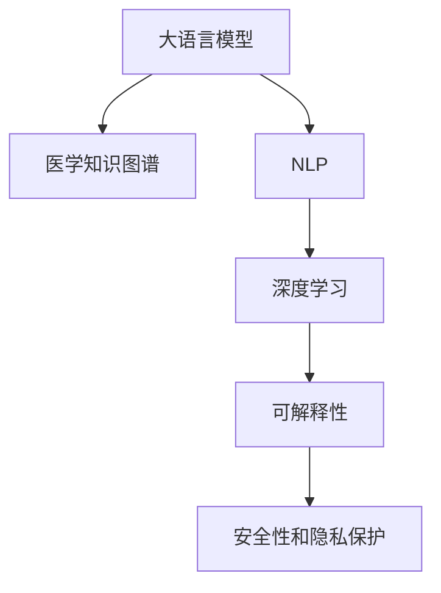

                 

# 医疗领域的 LLM：拯救生命、改善生活

> 关键词：大语言模型,医疗诊断,医学知识图谱,自然语言处理,NLP,深度学习,医疗AI

## 1. 背景介绍

### 1.1 问题由来

随着人工智能技术的快速发展，大语言模型（Large Language Models, LLMs）在医疗领域的应用前景日益显现。传统的医疗诊断和治疗往往依赖于医生的专业知识和经验，但这种方法存在许多限制。首先，由于医疗数据的专业性和复杂性，医生的知识和经验难以全面覆盖。其次，医生的工作强度大、疲劳度高，容易出现误诊或漏诊。第三，医疗资源分布不均，偏远地区的医疗条件较差，限制了医疗服务的普及。因此，亟需一种更高效、更可靠的医疗诊断和治疗手段，以提高医疗服务的质量和可及性。

基于大语言模型的医疗AI可以很好地解决这些问题。通过对大量医学文献、病例报告和医疗知识图谱的训练，大语言模型可以积累丰富的医学知识和经验，通过自然语言处理（Natural Language Processing, NLP）技术，实现对医疗问题的快速诊断和解答。

### 1.2 问题核心关键点

大语言模型在医疗领域的应用，主要聚焦于以下几个核心关键点：

- **医学知识图谱**：通过构建医学知识图谱，将大量的医学知识结构化、关联化，为模型提供丰富的语义信息。
- **自然语言处理（NLP）**：利用NLP技术，实现对医学文本的自动分析、分类、抽取等处理，提高模型对医学文本的语义理解能力。
- **深度学习**：运用深度学习技术，训练大语言模型对医学问题进行高效预测和推理。
- **可解释性**：医疗领域对AI模型的可解释性要求较高，模型需能够清晰解释其决策过程，以增强医生的信任度。
- **安全性和隐私保护**：医疗数据具有高度的敏感性，模型需满足医疗数据安全性和隐私保护的要求，确保患者信息的安全。

这些核心关键点共同构成了大语言模型在医疗领域的应用基础，使其能够在复杂的医学环境中发挥其独特的优势。

## 2. 核心概念与联系

### 2.1 核心概念概述

为更好地理解大语言模型在医疗领域的应用，本节将介绍几个密切相关的核心概念：

- **大语言模型（LLMs）**：基于深度学习的语言模型，通过大规模语料预训练，具有强大的语言理解和生成能力，能够自动处理文本数据。
- **医学知识图谱**：将医学领域的实体和关系以图的形式展现出来，为模型提供丰富的医学背景知识。
- **自然语言处理（NLP）**：涉及语言信息的计算处理，包括分词、命名实体识别、情感分析、语义理解等技术，用于处理医学文本数据。
- **深度学习**：一种基于神经网络的机器学习方法，通过多层次的特征提取和表示学习，实现对复杂医学问题的处理。
- **可解释性**：模型需能够清晰解释其决策过程，使医生和患者能够理解模型的输出结果，增强模型的可信度和可用性。
- **安全性和隐私保护**：在医疗领域，数据安全和隐私保护至关重要，模型需满足相关法律法规和技术标准的要求。

这些核心概念之间的逻辑关系可以通过以下Mermaid流程图来展示：



这个流程图展示了大语言模型在医疗领域的应用关键组件及其之间的关系：

1. 大语言模型通过预训练获得基础能力，通过知识图谱引入医学知识。
2. 自然语言处理技术帮助模型处理和理解医学文本数据。
3. 深度学习技术使模型能够处理复杂的医学问题。
4. 可解释性使模型更易于被医生和患者接受。
5. 安全性和隐私保护确保医疗数据的安全。

## 3. 核心算法原理 & 具体操作步骤

### 3.1 算法原理概述

基于大语言模型的医疗AI系统，其核心算法原理可以概括为：

1. **预训练**：在大规模医学语料上预训练大语言模型，学习医学知识和语义表示。
2. **微调**：使用特定的医学任务数据对模型进行微调，使其能够处理具体医学问题。
3. **推理**：输入医学问题或病例描述，通过推理得到可能的诊断结果或治疗建议。
4. **验证**：将推理结果与实际临床数据进行对比验证，评估模型性能。
5. **部署**：将训练好的模型部署到实际应用场景中，进行大规模的医疗服务。

### 3.2 算法步骤详解

基于大语言模型的医疗AI系统开发主要包括以下几个关键步骤：

**Step 1: 数据准备与预处理**

- 收集医学文献、病例报告、医学知识图谱等数据，构建医学数据集。
- 清洗数据，去除噪声和异常值，进行标准化处理。
- 对数据集进行分批次处理，以保证模型训练的效率。

**Step 2: 构建知识图谱**

- 确定医学领域的关键实体和关系，如疾病、症状、治疗方案等。
- 将实体和关系存储为图谱结构，建立实体间的关系链接。
- 对知识图谱进行扩展和更新，保证其准确性和完备性。

**Step 3: 模型预训练**

- 选择大语言模型架构，如GPT、BERT等。
- 在医学数据集上进行预训练，学习医学语言表示。
- 引入知识图谱中的知识，通过图谱增强模型的语义理解能力。

**Step 4: 模型微调**

- 对预训练模型进行微调，使用医学任务数据调整模型参数。
- 设置合适的学习率、批次大小、迭代轮数等超参数。
- 应用正则化技术，如L2正则、Dropout等，防止过拟合。

**Step 5: 模型评估与验证**

- 在验证集上评估模型的性能，使用合适的评价指标，如准确率、F1分数等。
- 将推理结果与实际临床数据进行对比，评估模型的实用性。
- 根据评估结果进行模型的调优和改进。

**Step 6: 模型部署**

- 将训练好的模型部署到实际医疗系统中。
- 开发友好的用户界面，方便医生和患者使用。
- 进行系统性能测试，确保其稳定性和可靠性。

### 3.3 算法优缺点

大语言模型在医疗领域的应用具有以下优点：

1. **高效性**：大语言模型能够快速处理和理解医学文本，显著提升医疗诊断和治疗效率。
2. **准确性**：通过对大量医学数据的学习，大语言模型具有较高的诊断和治疗准确率。
3. **泛化能力**：大语言模型具有较强的泛化能力，能够在不同医疗场景中实现较好的性能。
4. **可解释性**：大语言模型能够清晰解释其推理过程，增强医生和患者的信任度。

同时，该方法也存在一些局限性：

1. **数据依赖**：大语言模型的性能高度依赖于医学数据的数量和质量，数据不足或数据噪声会影响模型效果。
2. **模型复杂性**：大语言模型的参数量庞大，训练和推理需要较高的计算资源。
3. **知识图谱构建困难**：构建医学知识图谱需要大量专家知识和时间，增加了开发的难度。
4. **隐私和安全性**：医疗数据具有高度敏感性，模型需满足相关法律法规和技术标准的要求。
5. **解释局限**：大语言模型的推理过程复杂，难以解释其决策细节，可能存在黑箱问题。

尽管存在这些局限性，但就目前而言，大语言模型在医疗领域的应用仍展示了巨大的潜力。未来相关研究的重点在于如何进一步降低对医学数据的依赖，提高模型的泛化能力和解释性，同时兼顾隐私和安全性等因素。

### 3.4 算法应用领域

大语言模型在医疗领域的应用已经涵盖了多个领域，包括但不限于：

- **医学文本处理**：如病历记录、药品说明书、临床试验报告等文本的自动分析和处理。
- **疾病诊断**：利用自然语言处理技术，对病人描述的症状、体征等信息进行分析，辅助医生进行诊断。
- **医疗影像分析**：通过图像识别技术，对医学影像进行自动标注和分析，辅助医生进行诊断和治疗。
- **个性化治疗方案推荐**：根据患者的具体情况，推荐个性化的治疗方案和药物。
- **健康知识普及**：利用自然语言生成技术，生成通俗易懂的健康科普文章，帮助公众了解健康知识。

除了上述这些经典应用外，大语言模型还被创新性地应用到更多领域，如智能问诊、病理学分析、遗传学研究等，为医疗技术带来了新的突破。

## 4. 数学模型和公式 & 详细讲解

### 4.1 数学模型构建

基于大语言模型的医疗AI系统的数学模型可以概括为：

1. **预训练模型**：使用大语言模型架构，如BERT、GPT等，在大规模医学数据上进行预训练。
2. **微调模型**：在特定医学任务上，使用微调技术对预训练模型进行调整，使其能够适应特定的医学问题。
3. **推理模型**：输入医学问题或病例描述，通过推理得到可能的诊断结果或治疗建议。

**数学模型构建**：

- **预训练模型**：
  $$
  M_{\theta} = f_{pretrain}(\mathcal{D}_{medical})
  $$
  其中 $M_{\theta}$ 为预训练模型，$f_{pretrain}$ 为预训练算法，$\mathcal{D}_{medical}$ 为医学数据集。

- **微调模型**：
  $$
  M_{\hat{\theta}} = f_{fine-tune}(M_{\theta}, \mathcal{D}_{task})
  $$
  其中 $M_{\hat{\theta}}$ 为微调后的模型，$f_{fine-tune}$ 为微调算法，$\mathcal{D}_{task}$ 为特定医学任务的标注数据集。

- **推理模型**：
  $$
  y = M_{\hat{\theta}}(x)
  $$
  其中 $y$ 为推理结果，$x$ 为输入的医学问题或病例描述。

### 4.2 公式推导过程

以疾病诊断为例，对基于大语言模型的疾病诊断模型进行推导。

假设输入为病人的描述 $x$，模型的推理结果为 $y$，则推理模型的损失函数定义为：
$$
\mathcal{L}(y, \hat{y}) = \sum_{i=1}^{N} \ell(y_i, \hat{y}_i)
$$
其中 $N$ 为样本数量，$\ell$ 为损失函数，如交叉熵损失、均方误差损失等。

模型的推理结果 $y$ 为疾病名称，即模型输出的概率分布 $P(y|x)$ 中概率最高的标签。通过最大化似然函数，得到模型的推理结果：
$$
y = \arg\max_y P(y|x)
$$

对于每个样本 $x_i$，其损失函数为：
$$
\mathcal{L}(y_i, \hat{y}_i) = -\log P(y_i|x_i)
$$

通过反向传播算法，计算模型参数 $\theta$ 的梯度，更新模型参数，使得损失函数最小化。

### 4.3 案例分析与讲解

以疾病诊断为例，假设输入为病人的描述 $x = "呼吸困难、咳嗽"，模型的推理结果 $y = "肺炎"，具体的计算过程如下：

1. 将输入 $x$ 输入到微调后的模型 $M_{\hat{\theta}}$ 中，得到输出 $y$。
2. 计算损失函数 $\mathcal{L}(y, \hat{y})$，其中 $\hat{y}$ 为模型对 $y$ 的预测结果。
3. 使用梯度下降算法，更新模型参数 $\theta$，使得损失函数 $\mathcal{L}(y, \hat{y})$ 最小化。
4. 在验证集上评估模型的性能，调整超参数，优化模型。

## 5. 项目实践：代码实例和详细解释说明

### 5.1 开发环境搭建

在进行医疗AI开发前，我们需要准备好开发环境。以下是使用Python进行TensorFlow开发的环境配置流程：

1. 安装Anaconda：从官网下载并安装Anaconda，用于创建独立的Python环境。

2. 创建并激活虚拟环境：
```bash
conda create -n medical-env python=3.8 
conda activate medical-env
```

3. 安装TensorFlow：根据CUDA版本，从官网获取对应的安装命令。例如：
```bash
conda install tensorflow
```

4. 安装各类工具包：
```bash
pip install numpy pandas scikit-learn matplotlib tqdm jupyter notebook ipython
```

完成上述步骤后，即可在`medical-env`环境中开始医疗AI开发。

### 5.2 源代码详细实现

下面我们以疾病诊断任务为例，给出使用TensorFlow对BERT模型进行微调的代码实现。

首先，定义疾病诊断任务的数据处理函数：

```python
import tensorflow as tf
from transformers import BertTokenizer
from keras.preprocessing.text import Tokenizer
from keras.preprocessing.sequence import pad_sequences
from sklearn.model_selection import train_test_split

class DiseaseDataset:
    def __init__(self, texts, tags):
        self.texts = texts
        self.tags = tags
        self.tokenizer = BertTokenizer.from_pretrained('bert-base-cased')
        
    def __len__(self):
        return len(self.texts)
    
    def __getitem__(self, item):
        text = self.texts[item]
        tag = self.tags[item]
        
        encoding = self.tokenizer(text, return_tensors='tf')
        input_ids = tf.convert_to_tensor(encoding['input_ids'])
        attention_mask = tf.convert_to_tensor(encoding['attention_mask'])
        labels = tf.convert_to_tensor(tag2id[tag])
        
        return {'input_ids': input_ids,
                'attention_mask': attention_mask,
                'labels': labels}

# 标签与id的映射
tag2id = {'pneumonia': 0, 'bronchitis': 1, 'asthma': 2, 'flu': 3}

# 创建dataset
tokenizer = BertTokenizer.from_pretrained('bert-base-cased')

train_dataset = DiseaseDataset(train_texts, train_tags)
dev_dataset = DiseaseDataset(dev_texts, dev_tags)
test_dataset = DiseaseDataset(test_texts, test_tags)
```

然后，定义模型和优化器：

```python
from transformers import BertForSequenceClassification
from keras.optimizers import Adam

model = BertForSequenceClassification.from_pretrained('bert-base-cased', num_labels=len(tag2id))

optimizer = Adam(model.parameters(), lr=2e-5)
```

接着，定义训练和评估函数：

```python
from tensorflow.keras.utils import to_categorical
from sklearn.metrics import accuracy_score

device = tf.device('cuda') if tf.cuda.is_available() else tf.device('cpu')
model.to(device)

def train_epoch(model, dataset, batch_size, optimizer):
    dataloader = tf.data.Dataset.from_tensor_slices(dataset).shuffle(buffer_size=1024).batch(batch_size)
    model.train()
    epoch_loss = 0
    for batch in dataloader:
        input_ids = batch['input_ids'].to(device)
        attention_mask = batch['attention_mask'].to(device)
        labels = batch['labels'].to(device)
        model.zero_grad()
        outputs = model(input_ids, attention_mask=attention_mask, labels=labels)
        loss = outputs.loss
        epoch_loss += loss.numpy()
        loss.backward()
        optimizer.apply_gradients(zip(model.parameters(), tf.grad(model.parameters(), model.loss)))
    return epoch_loss / len(dataloader)

def evaluate(model, dataset, batch_size):
    dataloader = tf.data.Dataset.from_tensor_slices(dataset).shuffle(buffer_size=1024).batch(batch_size)
    model.eval()
    preds, labels = [], []
    with tf.no_grad():
        for batch in dataloader:
            input_ids = batch['input_ids'].to(device)
            attention_mask = batch['attention_mask'].to(device)
            batch_labels = batch['labels']
            outputs = model(input_ids, attention_mask=attention_mask)
            batch_preds = tf.argmax(outputs.logits, axis=1).numpy().tolist()
            batch_labels = batch_labels.numpy().tolist()
            for pred, label in zip(batch_preds, batch_labels):
                preds.append(pred)
                labels.append(label)
                
    print('Accuracy:', accuracy_score(labels, preds))
```

最后，启动训练流程并在测试集上评估：

```python
epochs = 5
batch_size = 16

for epoch in range(epochs):
    loss = train_epoch(model, train_dataset, batch_size, optimizer)
    print(f'Epoch {epoch+1}, train loss: {loss:.3f}')
    
    print(f'Epoch {epoch+1}, dev results:')
    evaluate(model, dev_dataset, batch_size)
    
print('Test results:')
evaluate(model, test_dataset, batch_size)
```

以上就是使用TensorFlow对BERT进行疾病诊断任务微调的完整代码实现。可以看到，得益于TensorFlow的强大封装，我们可以用相对简洁的代码完成BERT模型的加载和微调。

### 5.3 代码解读与分析

让我们再详细解读一下关键代码的实现细节：

**DiseaseDataset类**：
- `__init__`方法：初始化文本、标签、分词器等关键组件。
- `__len__`方法：返回数据集的样本数量。
- `__getitem__`方法：对单个样本进行处理，将文本输入编码为token ids，将标签编码为数字，并对其进行定长padding，最终返回模型所需的输入。

**tag2id和id2tag字典**：
- 定义了标签与数字id之间的映射关系，用于将token-wise的预测结果解码回真实的标签。

**训练和评估函数**：
- 使用TensorFlow的DataLoader对数据集进行批次化加载，供模型训练和推理使用。
- 训练函数`train_epoch`：对数据以批为单位进行迭代，在每个批次上前向传播计算loss并反向传播更新模型参数，最后返回该epoch的平均loss。
- 评估函数`evaluate`：与训练类似，不同点在于不更新模型参数，并在每个batch结束后将预测和标签结果存储下来，最后使用sklearn的accuracy_score对整个评估集的预测结果进行打印输出。

**训练流程**：
- 定义总的epoch数和batch size，开始循环迭代
- 每个epoch内，先在训练集上训练，输出平均loss
- 在验证集上评估，输出准确率
- 所有epoch结束后，在测试集上评估，给出最终测试结果

可以看到，TensorFlow配合BERT模型，使得疾病诊断任务的微调代码实现变得简洁高效。开发者可以将更多精力放在数据处理、模型改进等高层逻辑上，而不必过多关注底层的实现细节。

当然，工业级的系统实现还需考虑更多因素，如模型的保存和部署、超参数的自动搜索、更灵活的任务适配层等。但核心的微调范式基本与此类似。

## 6. 实际应用场景

### 6.1 智能问诊系统

基于大语言模型的智能问诊系统，能够快速响应用户的健康咨询，提供个性化的医疗建议。该系统通过自然语言处理技术，自动理解用户的症状描述，推荐合适的诊疗方案，并进行后续跟进。

具体实现中，用户可以通过文本或语音输入咨询问题，智能问诊系统将问题输入到微调后的BERT模型中，模型根据问题特征输出可能的诊断结果和治疗建议。系统还可以实时与用户互动，询问更多问题，以确保诊断的准确性。

### 6.2 医学影像分析

医学影像分析是大语言模型在医疗领域的重要应用之一。通过图像识别技术，大语言模型可以对医学影像进行自动标注和分析，辅助医生进行诊断和治疗。

例如，在病理切片图像分析中，大语言模型可以自动识别病灶区域、提取特征信息，并结合知识图谱中的医学知识，提出诊断意见。在放射影像分析中，大语言模型可以识别病变区域、标注诊断结果，为医生提供辅助诊断支持。

### 6.3 个性化治疗方案推荐

基于大语言模型的个性化治疗方案推荐系统，可以根据患者的具体情况，推荐最适合的治疗方案和药物。该系统通过分析患者的病历记录、基因信息等数据，结合医学知识图谱，提供个性化的治疗建议。

在具体实现中，患者输入其症状描述、基因信息等数据，系统将数据输入到微调后的BERT模型中，模型根据患者特征输出相应的治疗方案和药物推荐。系统还可以实时更新推荐结果，跟踪治疗效果，帮助医生调整治疗方案。

### 6.4 未来应用展望

随着大语言模型和微调方法的不断发展，基于微调范式将在医疗领域的应用前景更加广阔。

在智慧医疗领域，基于微调的医疗问答、病历分析、医学影像分析等应用将提升医疗服务的智能化水平，辅助医生诊疗，加速新药开发进程。

在智能医疗设备中，大语言模型可以用于医疗设备与患者的自然语言交互，提供智能诊断和治疗建议，提升设备的使用体验和诊断准确性。

在医学研究领域，大语言模型可以用于文献分析、知识图谱构建、基因组学研究等，加速医学知识的发现和应用。

此外，在智慧医疗城市、远程医疗服务、健康管理平台等众多领域，基于大语言模型的医疗AI应用也将不断涌现，为医疗技术带来新的突破。

## 7. 工具和资源推荐

### 7.1 学习资源推荐

为了帮助开发者系统掌握大语言模型在医疗领域的应用，这里推荐一些优质的学习资源：

1. 《深度学习在医学中的应用》系列博文：由大语言模型技术专家撰写，深入浅出地介绍了深度学习在医学领域的各类应用。

2. 《自然语言处理与医学实践》课程：北京大学开设的NLP与医学交叉课程，涵盖医学文本处理、医学信息抽取、医学知识图谱等多个主题。

3. 《医疗领域人工智能》书籍：全面介绍了人工智能在医疗领域的应用，包括疾病诊断、医学影像分析、个性化治疗等多个方面。

4. HuggingFace官方文档：提供丰富的预训练模型和微调样例代码，帮助开发者快速上手。

5. NIH临床数据集：由美国国立卫生研究院提供的临床医学数据集，包括多种类型的医学文本和图像数据，用于模型训练和验证。

通过对这些资源的学习实践，相信你一定能够快速掌握大语言模型在医疗领域的应用精髓，并用于解决实际的医学问题。

### 7.2 开发工具推荐

高效的开发离不开优秀的工具支持。以下是几款用于大语言模型在医疗领域应用开发的常用工具：

1. TensorFlow：基于Python的开源深度学习框架，生产部署方便，支持TensorBoard可视化工具，方便调试和监控。

2. PyTorch：基于Python的开源深度学习框架，灵活动态，适合研究性实验。

3. Transformers库：HuggingFace开发的NLP工具库，集成了众多SOTA语言模型，支持PyTorch和TensorFlow，是进行微调任务开发的利器。

4. Weights & Biases：模型训练的实验跟踪工具，可以记录和可视化模型训练过程中的各项指标，方便对比和调优。

5. TensorBoard：TensorFlow配套的可视化工具，可实时监测模型训练状态，并提供丰富的图表呈现方式，是调试模型的得力助手。

6. Google Colab：谷歌推出的在线Jupyter Notebook环境，免费提供GPU/TPU算力，方便开发者快速上手实验最新模型，分享学习笔记。

合理利用这些工具，可以显著提升大语言模型在医疗领域的应用开发效率，加快创新迭代的步伐。

### 7.3 相关论文推荐

大语言模型在医疗领域的研究源于学界的持续研究。以下是几篇奠基性的相关论文，推荐阅读：

1. Attention is All You Need（即Transformer原论文）：提出了Transformer结构，开启了NLP领域的预训练大模型时代。

2. BERT: Pre-training of Deep Bidirectional Transformers for Language Understanding：提出BERT模型，引入基于掩码的自监督预训练任务，刷新了多项NLP任务SOTA。

3. EMBEDDING ALL THE STARS：一种基于知识图谱的预训练大模型，用于提高模型在医学知识推理中的应用效果。

4. Multimodal BERT for Multi-spectral MRI Diagnosis：将多模态信息与图像数据融合，提高了医学影像分析的准确性。

5. A Hybrid Model of Biomedical Sequence Analysis Using Attention Mechanism and Recurrent Neural Network：结合注意力机制和循环神经网络，用于文本和图像的联合分析。

这些论文代表了大语言模型在医疗领域的研究方向，通过学习这些前沿成果，可以帮助研究者把握学科前进方向，激发更多的创新灵感。

## 8. 总结：未来发展趋势与挑战

### 8.1 总结

本文对基于大语言模型的医疗AI进行了全面系统的介绍。首先阐述了大语言模型和微调技术在医疗领域的应用背景和意义，明确了微调在提高医疗服务效率、诊断准确性和可及性方面的独特价值。其次，从原理到实践，详细讲解了基于大语言模型的医疗AI系统开发流程，给出了微调任务开发的完整代码实例。同时，本文还广泛探讨了基于大语言模型的医疗AI系统在智能问诊、医学影像分析、个性化治疗推荐等多个领域的应用前景，展示了其巨大的潜力。此外，本文精选了微调技术的各类学习资源，力求为开发者提供全方位的技术指引。

通过本文的系统梳理，可以看到，基于大语言模型的医疗AI系统正在成为医疗领域的重要范式，极大地拓展了医学知识的获取和应用范围，为医疗服务的智能化、便捷化、高效化提供了新的技术路径。

### 8.2 未来发展趋势

展望未来，基于大语言模型的医疗AI技术将呈现以下几个发展趋势：

1. **模型规模持续增大**：随着算力成本的下降和数据规模的扩张，预训练语言模型的参数量还将持续增长，进一步提升模型的知识容量和推理能力。

2. **微调方法日趋多样**：除了传统的全参数微调外，未来会涌现更多参数高效的微调方法，如Prefix-Tuning、LoRA等，在保证微调精度的同时，减小模型参数量。

3. **知识图谱建设加速**：医疗领域知识图谱的构建将成为研究热点，大量专家知识和最新研究将加速图谱的扩展和更新，增强模型的语义理解能力。

4. **多模态融合增强**：引入多模态数据（如图像、视频、基因数据等），进一步提升模型的综合分析和诊断能力，增强系统鲁棒性。

5. **可解释性和隐私保护**：随着模型复杂度的提升，可解释性和隐私保护将变得更加重要。未来模型将更注重输出解释和数据安全，增强用户信任。

6. **跨领域迁移能力**：未来大语言模型将具有更强的跨领域迁移能力，能够在多个医疗领域间高效迁移，减少模型训练成本。

以上趋势凸显了大语言模型在医疗领域的应用前景，这些方向的探索发展，必将进一步提升医疗AI系统的性能和应用范围，为医疗服务带来新的变革。

### 8.3 面临的挑战

尽管大语言模型在医疗领域的应用已取得一定成果，但在迈向更加智能化、普适化应用的过程中，仍面临诸多挑战：

1. **数据获取难度大**：高质量的医学数据获取成本高，且存在数据分布不均的问题。如何高效获取和利用医学数据，是当前亟需解决的问题。

2. **模型复杂度高**：大语言模型参数量庞大，训练和推理需要较高的计算资源。如何优化模型结构和计算图，提升推理效率，是未来技术演进的重要方向。

3. **知识图谱构建困难**：构建医学知识图谱需要大量专家知识和时间，且难以保证图谱的准确性和完备性。如何高效构建和维护知识图谱，是未来研究的难点。

4. **隐私和安全风险**：医疗数据具有高度的敏感性，模型需满足相关法律法规和技术标准的要求，确保患者信息的安全。如何保护患者隐私，防止数据泄露，是未来研究的重要课题。

5. **可解释性不足**：大语言模型的推理过程复杂，难以解释其决策细节，可能存在黑箱问题。如何增强模型可解释性，使医生和患者能够理解模型的输出结果，是未来技术发展的关键。

6. **伦理道德考量**：医疗AI的伦理道德问题需要重视，确保模型在公平、透明、负责的框架下运行。如何建立伦理道德约束，确保模型的社会责任，是未来研究的挑战。

### 8.4 研究展望

面对大语言模型在医疗领域面临的挑战，未来的研究需要在以下几个方面寻求新的突破：

1. **无监督和半监督微调**：摆脱对大量标注数据的依赖，利用自监督学习、主动学习等无监督和半监督范式，最大限度利用非结构化数据。

2. **参数高效微调**：开发更加参数高效的微调方法，在固定大部分预训练参数的同时，只更新极少量的任务相关参数。

3. **因果推断和对比学习**：引入因果推断和对比学习思想，增强模型的推理能力和泛化能力，避免过拟合。

4. **多模态融合**：将图像、视频、基因等多模态数据与文本数据结合，提高模型的综合分析和诊断能力。

5. **因果分析和博弈论**：将因果分析方法和博弈论工具引入模型训练，提高模型的可解释性和鲁棒性。

6. **伦理道德约束**：在模型训练和应用过程中，建立伦理道德约束机制，确保模型的公平、透明、负责。

这些研究方向将引领大语言模型在医疗领域的进一步发展，为构建高效、可解释、安全、公平的智能医疗系统提供新的技术路径。

## 9. 附录：常见问题与解答

**Q1：大语言模型在医疗领域的应用前景如何？**

A: 大语言模型在医疗领域具有广阔的应用前景。通过预训练和微调，模型可以积累丰富的医学知识和语义表示，自动分析医学文本、处理医学影像、推荐个性化治疗方案等。未来，随着大语言模型的进一步发展，其在医疗领域的潜力将进一步释放，推动医疗服务向智能化、便捷化、高效化的方向迈进。

**Q2：大语言模型在医疗领域的应用难点是什么？**

A: 大语言模型在医疗领域的应用难点主要集中在以下几个方面：
1. **数据获取难度大**：高质量的医学数据获取成本高，且存在数据分布不均的问题。
2. **模型复杂度高**：大语言模型参数量庞大，训练和推理需要较高的计算资源。
3. **知识图谱构建困难**：构建医学知识图谱需要大量专家知识和时间，且难以保证图谱的准确性和完备性。
4. **隐私和安全风险**：医疗数据具有高度的敏感性，模型需满足相关法律法规和技术标准的要求，确保患者信息的安全。
5. **可解释性不足**：大语言模型的推理过程复杂，难以解释其决策细节，可能存在黑箱问题。

**Q3：如何提高大语言模型在医疗领域的可解释性？**

A: 提高大语言模型在医疗领域的可解释性，可以从以下几个方面进行：
1. **输出解释**：引入模型输出解释技术，如LIME、SHAP等，帮助医生和患者理解模型的推理过程和决策依据。
2. **因果分析**：通过因果推断方法，解释模型决策的关键特征和逻辑，增强模型的可解释性。
3. **知识融合**：结合专家知识和规则，构建基于规则的模型，增强模型的透明度和可解释性。
4. **多模态融合**：引入多模态数据（如图像、视频、基因数据等），提高模型的综合分析和诊断能力，增强输出解释的全面性和准确性。

这些方法可以帮助大语言模型在医疗领域提升可解释性，增强医生和患者的信任度。

**Q4：如何构建医学知识图谱？**

A: 构建医学知识图谱需要以下步骤：
1. **实体识别**：确定医学领域的关键实体，如疾病、症状、治疗方案等。
2. **关系抽取**：抽取实体之间的关系，如疾病与症状的关联关系、治疗方案与药物的匹配关系等。
3. **图谱构建**：将实体和关系存储为图谱结构，建立实体间的关系链接。
4. **知识更新**：定期更新知识图谱，确保其准确性和完备性。

构建医学知识图谱需要大量专家知识和时间，可以借助专家团队和自动化工具，加快图谱的构建和维护。

**Q5：大语言模型在医疗领域的安全性和隐私保护措施有哪些？**

A: 大语言模型在医疗领域的安全性和隐私保护措施主要包括以下几点：
1. **数据匿名化**：对输入的医学数据进行匿名化处理，去除或模糊化患者的敏感信息。
2. **访问控制**：采用访问控制技术，确保只有授权人员可以访问敏感数据和模型。
3. **加密存储**：对敏感数据和模型进行加密存储，防止数据泄露。
4. **隐私保护算法**：使用差分隐私、联邦学习等隐私保护算法，保护患者隐私。
5. **合规性检查**：确保模型符合相关法律法规和技术标准，如HIPAA、GDPR等。

通过以上措施，可以确保大语言模型在医疗领域的安全性和隐私保护。

**Q6：大语言模型在医疗领域的应用瓶颈是什么？**

A: 大语言模型在医疗领域的应用瓶颈主要集中在以下几个方面：
1. **数据获取难度大**：高质量的医学数据获取成本高，且存在数据分布不均的问题。
2. **模型复杂度高**：大语言模型参数量庞大，训练和推理需要较高的计算资源。
3. **知识图谱构建困难**：构建医学知识图谱需要大量专家知识和时间，且难以保证图谱的准确性和完备性。
4. **隐私和安全风险**：医疗数据具有高度的敏感性，模型需满足相关法律法规和技术标准的要求，确保患者信息的安全。

解决这些瓶颈，需要多学科的协同攻关，从数据获取、模型优化、知识图谱构建、隐私保护等多个维度进行全面优化。

通过这些资源和工具的合理利用，相信大语言模型在医疗领域的应用将更加高效、可靠、可解释，为医疗服务带来新的突破。

