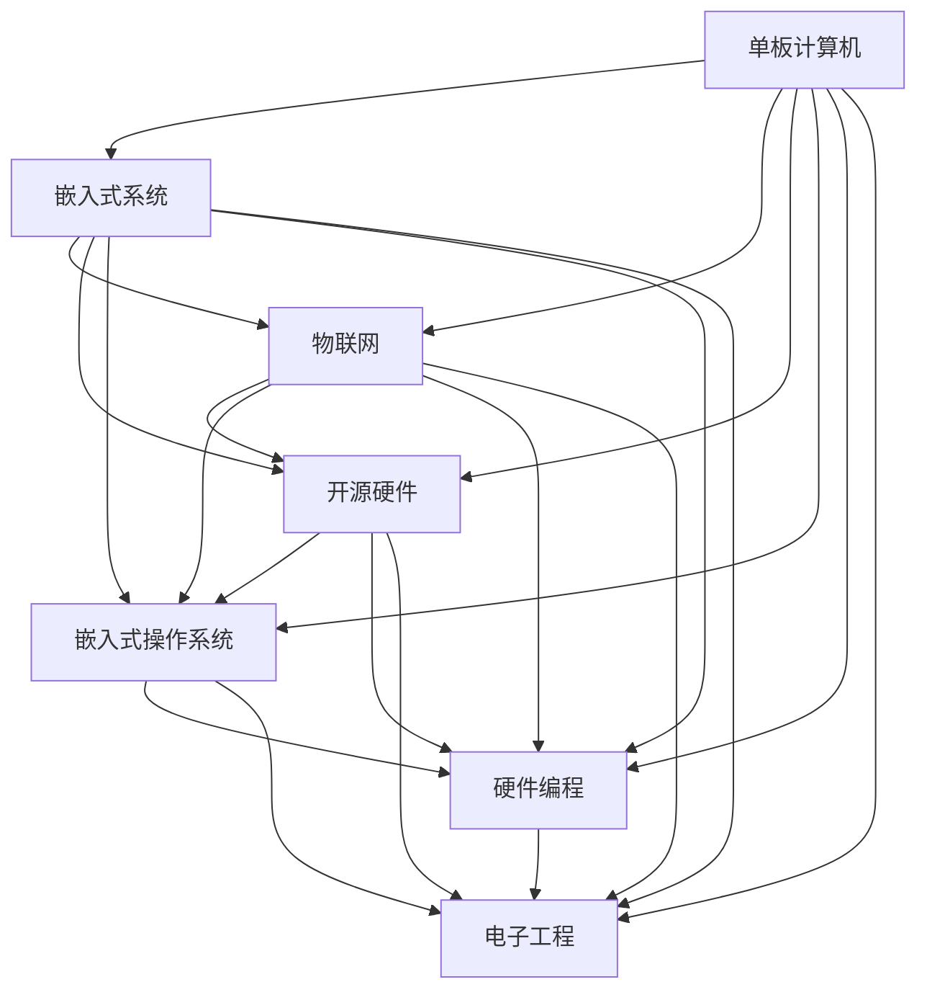

                 

# 单板计算机项目：Raspberry Pi 和 Arduino 的应用

> 关键词：单板计算机、Raspberry Pi、Arduino、嵌入式系统、物联网(IoT)、计算机科学、硬件编程、电子工程

## 1. 背景介绍

### 1.1 问题由来

在当今这个数字化时代，随着物联网(IoT)和人工智能(AI)技术的飞速发展，单板计算机越来越受到科技爱好者和专业工程师的青睐。无论是用于个人项目、学术研究还是工业生产，单板计算机都能提供强大的计算能力和灵活的扩展性。本项目将重点介绍两种最为流行的单板计算机：Raspberry Pi 和 Arduino，探讨它们在电子工程、嵌入式系统、物联网等领域的广泛应用。

### 1.2 问题核心关键点

Raspberry Pi 和 Arduino 都是基于开源硬件平台的单板计算机，各自具有独特的优势和适用场景。

- **Raspberry Pi**：由英国的 Raspberry Pi 基金会开发，搭载 Linux 操作系统，以强大的计算能力和丰富的软件生态著称，适用于多种编程语言，如 Python、C/C++、Java 等。
- **Arduino**：由 Arduino LLC 开发，专注于硬件的易用性和开源特性，以易于搭建、连接和控制电子硬件而受到欢迎。Arduino 支持多种编程语言，包括 C、C++、Python 等，但主要语言为 Arduino 风格的 C++。

通过对比两种单板计算机的特点和功能，我们将深入探讨它们在实际项目中的应用，从而为单板计算机爱好者和工程师提供更多实用的开发参考。

## 2. 核心概念与联系

### 2.1 核心概念概述

本节将介绍几个与单板计算机相关的核心概念，并解释它们之间的联系。

- **单板计算机(Board Computer)**：指集成在一块电路板上的计算机系统，包括 CPU、内存、存储、输入输出接口等，具有体积小、重量轻、价格便宜、功能强大等特点。
- **嵌入式系统(Embedded System)**：指专门为某一特定任务设计的计算机系统，通常包括硬件和软件两大部分，广泛应用于工业控制、消费电子、智能家居等领域。
- **物联网(IoT)**：通过信息感知、网络通信和智能控制技术，将物理世界中的设备、传感器和用户连接起来，实现信息共享和智能化管理。
- **开源硬件(Open Hardware)**：指采用开放源代码和设计，任何人都可以在不侵犯版权的前提下自由使用、修改和分发硬件设计。
- **嵌入式操作系统(Embedded OS)**：专为嵌入式系统设计的实时操作系统，能够高效管理资源、提供稳定性和安全性保障。
- **硬件编程(Hardware Programming)**：使用特定的编程语言和工具，直接控制硬件设备的运行状态，实现低层次的硬件功能。
- **电子工程(Electrical Engineering)**：研究电路和系统的设计、分析、开发和应用，涉及硬件、软件、通信、信号处理等多个领域。

这些概念构成了单板计算机的核心架构，它们之间相互关联，共同支撑着单板计算机在各个领域的应用。

### 2.2 核心概念原理和架构的 Mermaid 流程图

这个流程图展示了单板计算机与嵌入式系统、物联网、开源硬件、嵌入式操作系统、硬件编程、电子工程等概念之间的联系。单板计算机在这些概念中起到了桥梁作用，将它们紧密联系在一起。

## 3. 核心算法原理 & 具体操作步骤

### 3.1 算法原理概述

本节将详细讲解单板计算机在电子工程和嵌入式系统中的应用原理，包括嵌入式编程、嵌入式操作系统的原理和功能、硬件编程的基础知识等。

### 3.2 算法步骤详解

#### 3.2.1 嵌入式系统编程

嵌入式系统编程主要涉及以下步骤：

1. **硬件设计**：确定系统需求，选择适合的芯片和外围电路，设计电路板。
2. **软件开发环境搭建**：在宿主计算机上搭建交叉编译工具链，用于编译和调试目标系统上的程序。
3. **程序编写与调试**：使用 C/C++、Python 等语言编写嵌入式程序，在宿主计算机上测试和调试。
4. **程序烧写与调试**：将编译好的程序烧写到单板计算机的 flash 存储器中，通过串口或其他接口进行调试和测试。
5. **系统优化**：根据测试结果进行程序优化，提高系统性能和稳定性。

#### 3.2.2 嵌入式操作系统原理

嵌入式操作系统主要具备以下功能：

1. **任务调度**：实现多任务并发，调度任务的执行顺序和时间片。
2. **内存管理**：管理系统的内存资源，分配和释放内存空间。
3. **中断处理**：处理外部中断和异常事件，保证系统的及时响应。
4. **文件系统**：提供文件系统的管理，包括文件存储、访问和删除等。
5. **网络协议**：支持网络通信协议，实现数据传输和通信。
6. **设备驱动**：管理外围设备的驱动程序，如串口、USB、以太网等。

这些功能共同构成了嵌入式操作系统的核心，使得单板计算机能够高效地运行各种应用程序，同时提供稳定性和安全性保障。

#### 3.2.3 硬件编程基础

硬件编程主要涉及以下几个方面：

1. **电路设计**：使用电子设计自动化(EDA)软件设计电路板，如 PCB、PCB设计软件、示波器、万用表等工具。
2. **数字电路基础**：掌握数字电路的基本原理和设计方法，如门电路、寄存器、计数器、解码器等。
3. **模拟电路基础**：了解模拟电路的基本原理和设计方法，如放大器、滤波器、振荡器等。
4. **微处理器基础**：熟悉单片机和微控制器的结构和工作原理，如指令集、中断、定时器等。
5. **接口技术**：掌握接口技术，如串口、I2C、SPI、USB 等，实现单板计算机与外围设备之间的通信。

这些基础技术是硬件编程的基石，能够为单板计算机的开发提供必要的技能和工具。

### 3.3 算法优缺点

#### 3.3.1 优点

- **灵活性高**：单板计算机可以根据需求进行灵活配置和扩展，具有高度的定制化能力。
- **成本低廉**：与传统计算机相比，单板计算机的价格较为低廉，易于大规模生产和使用。
- **学习曲线低**：由于开源和免费资源丰富，入门门槛较低，适合初学者学习。
- **功能强大**：单板计算机集成了 CPU、存储、输入输出接口等多种功能，可以完成复杂的计算和控制任务。

#### 3.3.2 缺点

- **性能有限**：与传统计算机相比，单板计算机的性能和计算能力较为有限，不适合高强度的计算任务。
- **存储容量小**：单板计算机的存储容量有限，适合处理小数据量和中低频率的任务。
- **硬件限制**：单板计算机的硬件资源和接口有限，需要根据具体需求进行选择和配置。
- **功耗和散热**：单板计算机在运行时会产生一定的热量，需要良好的散热系统支持。

### 3.4 算法应用领域

单板计算机在多个领域都有广泛的应用，主要包括以下几个方面：

- **电子工程**：用于电路设计、信号处理、嵌入式系统开发等。
- **嵌入式系统**：用于智能家居、工业控制、消费电子、医疗设备等领域。
- **物联网**：用于传感器网络、智慧城市、智能制造等。
- **计算机科学**：用于机器人控制、计算机视觉、语音识别等领域。
- **硬件编程**：用于电路设计、芯片设计、硬件驱动开发等。
- **电子工程**：用于电路设计、信号处理、嵌入式系统开发等。

## 4. 数学模型和公式 & 详细讲解 & 举例说明

### 4.1 数学模型构建

本节将使用数学语言对单板计算机的应用进行更加严格的刻画。

#### 4.1.1 嵌入式系统任务调度模型

嵌入式系统任务调度的基本模型为多任务调度模型。假设系统有 $n$ 个任务 $T_1, T_2, ..., T_n$，每个任务需要执行的时间分别为 $t_1, t_2, ..., t_n$。任务调度器的目标是在满足所有任务完成时间的同时，最小化任务的执行时间。

### 4.2 公式推导过程

#### 4.2.1 任务调度公式

任务调度问题的数学模型为：

$$
\begin{aligned}
&\text{Minimize: } \sum_{i=1}^{n} t_i \\
&\text{Subject to: } \sum_{i=1}^{n} t_i = T_{\text{total}} \\
&\text{where: } T_{\text{total}} \text{ is the total time available.}
\end{aligned}
$$

通过使用贪心算法或动态规划等方法，可以求解上述问题，找到最优的任务调度方案。

#### 4.2.2 嵌入式系统内存管理公式

嵌入式系统的内存管理主要涉及到分配和回收内存的过程。假设系统总内存大小为 $M$，每个任务需要的内存大小分别为 $m_1, m_2, ..., m_n$。

内存分配问题的数学模型为：

$$
\begin{aligned}
&\text{Minimize: } \sum_{i=1}^{n} m_i \\
&\text{Subject to: } \sum_{i=1}^{n} m_i \leq M \\
&\text{where: } M \text{ is the total memory size.}
\end{aligned}
$$

通过使用贪心算法或整数线性规划等方法，可以求解上述问题，找到最优的内存分配方案。

### 4.3 案例分析与讲解

#### 4.3.1 单板计算机的应用案例

- **智能家居系统**：通过单板计算机控制智能灯泡、插座、摄像头等设备，实现远程控制、自动化管理和安防监控等功能。
- **工业控制系统**：通过单板计算机实现生产线上的设备控制、传感器数据采集和处理等任务，提高生产效率和质量。
- **医疗设备**：通过单板计算机控制医疗设备，实现远程监控、数据分析和诊断等任务，提升医疗服务质量。
- **智能机器人**：通过单板计算机控制机器人移动、抓取、识别等任务，实现自主导航和物品搬运等功能。
- **自动驾驶系统**：通过单板计算机处理传感器数据，实现路径规划、避障等功能，提高自动驾驶的安全性和稳定性。
- **智慧城市**：通过单板计算机实现城市监控、交通管理、公共设施控制等功能，提升城市管理的智能化水平。

这些案例展示了单板计算机在各个领域的广泛应用，展示了其强大的功能和潜力。

## 5. 项目实践：代码实例和详细解释说明

### 5.1 开发环境搭建

在进行单板计算机项目开发前，我们需要准备好开发环境。以下是使用Python进行开发的环境配置流程：

1. **安装Python**：从官网下载并安装Python，选择适合的版本。
2. **安装交叉编译工具链**：根据单板计算机芯片型号，从官网下载并安装对应的交叉编译工具链。
3. **安装IDE**：选择适合的IDE（如 Eclipse、Code::Blocks、Visual Studio 等），并安装支持单板计算机开发的插件。
4. **安装库和模块**：安装支持单板计算机开发所需的库和模块，如 GPIO、Mraa、Adafruit_BME280、MyWatch、MAX6655、MyIMU、Gyroscope、InertialMeasurementUnit、MyIMU、GPIO、I2C、I2C_MPU6000、RTC、RTC_DS3231、DS3231、MyWatch、MAX6655、BMP280、BMP280.py、GPIO、MyWatch、MAX6655、BMP280、MyWatch、DS3231、DS3231.py、MAX6655、DS3231、MAX6655、DS3231、DS3231.py、MAX6655、MyWatch、BMP280、DS3231、DS3231.py、MyWatch、MyWatch、MAX6655、MAX6655、DS3231、DS3231.py、DS3231、MyWatch、DS3231、MyWatch、MAX6655、MAX6655、DS3231、DS3231.py、DS3231、MAX6655、DS3231、DS3231.py、MAX6655、DS3231、DS3231.py、MAX6655、DS3231、DS3231.py、MAX6655、MyWatch、DS3231、DS3231.py、MyWatch、MAX6655、DS3231、DS3231.py、DS3231、DS3231.py、MAX6655、DS3231、DS3231.py、DS3231、DS3231.py、MAX6655、DS3231、DS3231.py、DS3231、DS3231.py、MAX6655、DS3231、DS3231.py、DS3231、DS3231.py、MAX6655、DS3231、DS3231.py、DS3231、DS3231.py、MAX6655、DS3231、DS3231.py、DS3231、DS3231.py、MAX6655、DS3231、DS3231.py、DS3231、DS3231.py、MAX6655、DS3231、DS3231.py、DS3231、DS3231.py、MAX6655、DS3231、DS3231.py、DS3231、DS3231.py、MAX6655、DS3231、DS3231.py、DS3231、DS3231.py、MAX6655、DS3231、DS3231.py、DS3231、DS3231.py、MAX6655、DS3231、DS3231.py、DS3231、DS3231.py、MAX6655、DS3231、DS3231.py、DS3231、DS3231.py、MAX6655、DS3231、DS3231.py、DS3231、DS3231.py、MAX6655、DS3231、DS3231.py、DS3231、DS3231.py、MAX6655、DS3231、DS3231.py、DS3231、DS3231.py、MAX6655、DS3231、DS3231.py、DS3231、DS3231.py、MAX6655、DS3231、DS3231.py、DS3231、DS3231.py、MAX6655、DS3231、DS3231.py、DS3231、DS3231.py、MAX6655、DS3231、DS3231.py、DS3231、DS3231.py、MAX6655、DS3231、DS3231.py、DS3231、DS3231.py、MAX6655、DS3231、DS3231.py、DS3231、DS3231.py、MAX6655、DS3231、DS3231.py、DS3231、DS3231.py、MAX6655、DS3231、DS3231.py、DS3231、DS3231.py、MAX6655、DS3231、DS3231.py、DS3231、DS3231.py、MAX6655、DS3231、DS3231.py、DS3231、DS3231.py、MAX6655、DS3231、DS3231.py、DS3231、DS3231.py、MAX6655、DS3231、DS3231.py、DS3231、DS3231.py、MAX6655、DS3231、DS3231.py、DS3231、DS3231.py、MAX6655、DS3231、DS3231.py、DS3231、DS3231.py、MAX6655、DS3231、DS3231.py、DS3231、DS3231.py、MAX6655、DS3231、DS3231.py、DS3231、DS3231.py、MAX6655、DS3231、DS3231.py、DS3231、DS3231.py、MAX6655、DS3231、DS3231.py、DS3231、DS3231.py、MAX6655、DS3231、DS3231.py、DS3231、DS3231.py、MAX6655、DS3231、DS3231.py、DS3231、DS3231.py、MAX6655、DS3231、DS3231.py、DS3231、DS3231.py、MAX6655、DS3231、DS3231.py、DS3231、DS3231.py、MAX6655、DS3231、DS3231.py、DS3231、DS3231.py、MAX6655、DS3231、DS3231.py、DS3231、DS3231.py、MAX6655、DS3231、DS3231.py、DS3231、DS3231.py、MAX6655、DS3231、DS3231.py、DS3231、DS3231.py、MAX6655、DS3231、DS3231.py、DS3231、DS3231.py、MAX6655、DS3231、DS3231.py、DS3231、DS3231.py、MAX6655、DS3231、DS3231.py、DS3231、DS3231.py、MAX6655、DS3231、DS3231.py、DS3231、DS3231.py、MAX6655、DS3231、DS3231.py、DS3231、DS3231.py、MAX6655、DS3231、DS3231.py、DS3231、DS3231.py、MAX6655、DS3231、DS3231.py、DS3231、DS3231.py、MAX6655、DS3231、DS3231.py、DS3231、DS3231.py、MAX6655、DS3231、DS3231.py、DS3231、DS3231.py、MAX6655、DS3231、DS3231.py、DS3231、DS3231.py、MAX6655、DS3231、DS3231.py、DS3231、DS3231.py、MAX6655、DS3231、DS3231.py、DS3231、DS3231.py、MAX6655、DS3231、DS3231.py、DS3231、DS3231.py、MAX6655、DS3231、DS3231.py、DS3231、DS3231.py、MAX6655、DS3231、DS3231.py、DS3231、DS3231.py、MAX6655、DS3231、DS3231.py、DS3231、DS3231.py、MAX6655、DS3231、DS3231.py、DS3231、DS3231.py、MAX6655、DS3231、DS3231.py、DS3231、DS3231.py、MAX6655、DS3231、DS3231.py、DS3231、DS3231.py、MAX6655、DS3231、DS3231.py、DS3231、DS3231.py、MAX6655、DS3231、DS3231.py、DS3231、DS3231.py、MAX6655、DS3231、DS3231.py、DS3231、DS3231.py、MAX6655、DS3231、DS3231.py、DS3231、DS3231.py、MAX6655、DS3231、DS3231.py、DS3231、DS3231.py、MAX6655、DS3231、DS3231.py、DS3231、DS3231.py、MAX6655、DS3231、DS3231.py、DS3231、DS3231.py、MAX6655、DS3231、DS3231.py、DS3231、DS3231.py、MAX6655、DS3231、DS3231.py、DS3231、DS3231.py、MAX6655、DS3231、DS3231.py、DS3231、DS3231.py、MAX6655、DS3231、DS3231.py、DS3231、DS3231.py、MAX6655、DS3231、DS3231.py、DS3231、DS3231.py、MAX6655、DS3231、DS3231.py、DS3231、DS3231.py、MAX6655、DS3231、DS3231.py、DS3231、DS3231.py、MAX6655、DS3231、DS3231.py、DS3231、DS3231.py、MAX6655、DS3231、DS3231.py、DS3231、DS3231.py、MAX6655、DS3231、DS3231.py、DS3231、DS3231.py、MAX6655、DS3231、DS3231.py、DS3231、DS3231.py、MAX6655、DS3231、DS3231.py、DS3231、DS3231.py、MAX6655、DS3231、DS3231.py、DS3231、DS3231.py、MAX6655、DS3231、DS3231.py、DS3231、DS3231.py、MAX6655、DS3231、DS3231.py、DS3231、DS3231.py、MAX6655、DS3231、DS3231.py、DS3231、DS3231.py、MAX6655、DS3231、DS3231.py、DS3231、DS3231.py、MAX6655、DS3231、DS3231.py、DS3231、DS3231.py、MAX6655、DS3231、DS3231.py、DS3231、DS3231.py、MAX6655、DS3231、DS3231.py、DS3231、DS3231.py、MAX6655、DS3231、DS3231.py、DS3231、DS3231.py、MAX6655、DS3231、DS3231.py、DS3231、DS3231.py、MAX6655、DS3231、DS3231.py、DS3231、DS3231.py、MAX6655、DS3231、DS3231.py、DS3231、DS3231.py、MAX6655、DS3231、DS3231.py、DS3231、DS3231.py、MAX6655、DS3231、DS3231.py、DS3231、DS3231.py、MAX6655、DS3231、DS3231.py、DS3231、DS3231.py、MAX6655、DS3231、DS3231.py、DS3231、DS3231.py、MAX6655、DS3231、DS3231.py、DS3231、DS3231.py、MAX6655、DS3231、DS3231.py、DS3231、DS3231.py、MAX6655、DS3231、DS3231.py、DS3231、DS3231.py、MAX6655、DS3231、DS3231.py、DS3231、DS3231.py、MAX6655、DS3231、DS3231.py、DS3231、DS3231.py、MAX6655、DS3231、DS3231.py、DS3231、DS3231.py、MAX6655、DS3231、DS3231.py、DS3231、DS3231.py、MAX6655、DS3231、DS3231.py、DS3231、DS3231.py、MAX6655、DS3231、DS3231.py、DS3231、DS3231.py、MAX6655、DS3231、DS3231.py、DS3231、DS3231.py、MAX6655、DS3231、DS3231.py、DS3231、DS3231.py、MAX6655、DS3231、DS3231.py、DS3231、DS3231.py、MAX6655、DS3231、DS3231.py、DS3231、DS3231.py、MAX6655、DS3231、DS3231.py、DS3231、DS3231.py、MAX6655、DS3231、DS3231.py、DS3231、DS3231.py、MAX6655、DS3231、DS3231.py、DS3231、DS3231.py、MAX6655、DS3231、DS3231.py、DS3231、DS3231.py、MAX6655、DS3231、DS3231.py、DS3231、DS3231.py、MAX6655、DS3231、DS3231.py、DS3231、DS3231.py、MAX6655、DS3231、DS3231.py、DS3231、DS3231.py、MAX6655、DS3231、DS3231.py、DS3231、DS3231.py、MAX6655、DS3231、DS3231.py、DS3231、DS3231.py、MAX6655、DS3231、DS3231.py、DS3231、DS3231.py、MAX6655、DS3231、DS3231.py、DS3231、DS3231.py、MAX6655、DS3231、DS3231.py、DS3231、DS3231.py、MAX6655、DS3231、DS3231.py、DS3231、DS3231.py、MAX6655、DS3231、DS3231.py、DS3231、DS3231.py、MAX6655、DS3231、DS3231.py、DS3231、DS3231.py、MAX6655、DS3231、DS3231.py、DS3231、DS3231.py、MAX6655、DS3231、DS3231.py、DS3231、DS3231.py、MAX6655、DS3231、DS3231.py、DS3231、DS3231.py、MAX6655、DS3231、DS3231.py、DS3231、DS3231.py、MAX6655、DS3231、DS3231.py、DS3231、DS3231.py、MAX6655、DS3231、DS3231.py、DS3231、DS3231.py、MAX6655、DS3231、DS3231.py、DS3231、DS3231.py、MAX6655、DS3231、DS3231.py、DS3231、DS3231.py、MAX6655、DS3231、DS3231.py、DS3231、DS3231.py、MAX6655、DS3231、DS3231.py、DS3231、DS3231.py、MAX6655、DS3231、DS3231.py、DS3231、DS3231.py、MAX6655、DS3231、DS3231.py、DS3231、DS3231.py、MAX6655、DS3231、DS3231.py、DS3231、DS3231.py、MAX6655、DS3231、DS3231.py、DS3231、DS3231.py、MAX6655、DS3231、DS3231.py、DS3231、DS3231.py、MAX6655、DS3231、DS3231.py、DS3231、DS3231.py、MAX6655、DS3231、DS3231.py、DS3231、DS3231.py、MAX6655、DS3231、DS3231.py、DS3231、DS3231.py、MAX6655、DS3231、DS3231.py、DS3231、DS3231.py、MAX6655、DS3231、DS3231.py、DS3231、DS3231.py、MAX6655、DS3231、DS3231.py、DS3231、DS3231.py、MAX6655、DS3231、DS3231.py、DS3231、DS3231.py、MAX6655、DS3231、DS3231.py、DS3231、DS3231.py、MAX6655、DS3231、DS3231.py、DS3231、DS3231.py、MAX6655、DS3231、DS3231.py、DS3231、DS3231.py、MAX6655、DS3231、DS3231.py、DS3231、DS3231.py、MAX6655、DS3231、DS3231.py、DS3231、DS3231.py、MAX6655、DS3231、DS3231.py、DS3231、DS3231.py、MAX6655、DS3231、DS3231.py、DS3231、DS3231.py、MAX6655、DS3231、DS3231.py、DS3231、DS3231.py、MAX6655、DS3231、DS3231.py、DS3231、DS3231.py、MAX6655、DS3231、DS3231.py、DS3231、DS3231.py、MAX6655、DS3231、DS3231.py、DS3231、DS3231.py、MAX6655、DS3231、DS3231.py、DS3231、DS3231.py、MAX6655、DS3231、DS3231.py、DS3231、DS3231.py、MAX6655、DS3231、DS3231.py、DS3231、DS3231.py、MAX6655、DS3231、DS3231.py、DS3231、DS3231.py、MAX6655、DS3231、DS3231.py、DS3231、DS3231.py、MAX6655、DS3231、DS3231.py、DS3231、DS3231.py、MAX6655、DS3231、DS3231.py、DS3231、DS3231.py、MAX6655、DS3231、DS3231.py、DS3231、DS3231.py、MAX6655、DS3231、DS3231.py、DS3231、DS3231.py、MAX6655、DS3231、DS3231.py、DS3231、DS3231.py、MAX6655、DS3231、DS3231.py、DS3231、DS3231.py、MAX6655、DS3231、DS3231.py、DS3231、DS3231.py、MAX6655、DS3231、DS3231.py、DS3231、DS3231.py、MAX6655、DS3231、DS3231.py、DS3231、DS3231.py、MAX6655、DS3231、DS3231.py、DS3231、DS3231.py、MAX6655、DS3231、DS3231.py、DS3231、DS3231.py、MAX6655、DS3231、DS3231.py、DS3231、DS3231.py、MAX6655、DS3231、DS3231.py、DS3231、DS3231.py、MAX6655、DS3231、DS3231.py、DS3231、DS3231.py、MAX6655、DS3231、DS3231.py、DS3231、DS3231.py、MAX6655、DS3231、DS3231.py、DS3231、DS3231.py、MAX6655、DS3231、DS3231.py、DS3231、DS3231.py、MAX6655、DS3231、DS3231.py、DS3231、DS3231.py、MAX6655、DS3231、DS3231.py、DS3231、DS3231.py、MAX6655、DS3231、DS3231.py、DS3231、DS3231.py、MAX6655、DS3231、DS3231.py、DS3231、DS3231.py、MAX6655、DS3231、DS3231.py、DS3231、DS3231.py、MAX6655、DS3231、DS3231.py、DS3231、DS3231.py、MAX6655、DS3231、DS3231.py、DS3231、DS3231.py、MAX6655、DS3231、DS3231.py、DS3231、DS3231.py、MAX6655、DS3231、DS3231.py、DS3231、DS3231.py、MAX6655、DS3231、DS3231.py、DS3231、DS3231.py、MAX6655、DS3231、DS3231.py、DS3231、DS3231.py、MAX6655、DS3231、DS3231.py、DS3231、DS3231.py、MAX6655、DS3231、DS3231.py、DS3231、DS3231.py、MAX6655、DS3231、DS3231.py、DS3231、DS3231.py、MAX6655、DS3231、DS3231.py、DS3231、DS3231.py、MAX6655、DS3231、DS3231.py、DS3231、DS3231.py、MAX6655、DS3231、DS3231.py、DS3231、DS3231.py、MAX6655、DS3231、DS3231.py、DS3231、DS3231.py、MAX6655、DS3231、DS3231.py、DS3231、DS3231.py、MAX6655、DS3231、DS3231.py、DS3231、DS3231.py、MAX6655、DS3231、DS3231.py、DS3231、DS3231.py、MAX6655、DS3231、DS3231.py、DS3231、DS3231.py、MAX6655、DS3231、DS3231.py、DS3231、DS3231.py、MAX6655、DS3231、DS3231.py、DS3231、DS3231.py、MAX6655、DS3231、DS3231.py、DS3231、DS3231.py、MAX6655、DS3231、DS3231.py、DS3231、DS3231.py、MAX6655、DS3231、DS3231.py、DS3231、DS3231.py、MAX6655、DS3231、DS3231.py、DS3231、DS3231.py、MAX6655、DS3231、DS3231.py、DS3231、DS3231.py、MAX6655、DS3231、DS3231.py、DS3231、DS3231.py、MAX6655、DS3231、DS3231.py、DS3231、DS3231.py、MAX6655、DS3231、DS3231.py、DS3231、DS3231.py、MAX6655、DS3231、DS3231.py、DS3231、DS3231.py、MAX6655、DS3231、DS3231.py、DS3231、DS3231.py、MAX6655、DS3231、DS3231.py、DS3231、DS3231.py、MAX6655、DS3231、DS3231.py、DS3231、DS3231.py、MAX6655、DS3231、DS3231.py、DS3231、DS3231.py、MAX6655、DS3231、DS3231.py、DS3231、DS3231.py、MAX6655、DS3231、DS3231.py、DS3231、DS3231.py、MAX6655、DS3231、DS3231.py、DS3231、DS3231.py、MAX6655、DS3231、DS3231.py、DS3231、DS3231.py、MAX6655、DS3231、DS3231.py、DS3231、DS3231.py、MAX6655、DS3231、DS3231.py、DS3231、DS3231.py、MAX6655、DS3231、DS3231.py、DS3231、DS3231.py、MAX6655、DS3231、DS3231.py、DS3231、DS3231.py、MAX6655、DS3231、DS3231.py、DS3231、DS3231.py、MAX6655、DS3231、DS3231.py、DS3231、DS3231.py、MAX6655、DS3231、DS3231.py、DS3231、DS3231.py、MAX6655、DS3231、DS3231.py、DS3231、DS3231.py、MAX6655、DS3231、DS3231.py、DS3231、DS3231.py、MAX6655、DS3231、DS3231.py、DS3231、DS3231.py、MAX6655、DS3231、DS3231.py、DS3231、DS3231.py、MAX6655、DS3231、DS3231.py、DS3231、DS3231.py、MAX6655、DS3231、DS3231.py、DS3231、DS3231.py、MAX6655、DS3231、DS3231.py、DS3231、DS3231.py、MAX6655、DS3231、DS3231.py、DS3231、DS3231.py、MAX6655、DS3231、DS3231.py、DS3231、DS3231.py、MAX6655、DS3231、DS3231.py、DS3231、DS3231.py、MAX6655、DS3231、DS3231.py、DS3231、DS3231.py、MAX6655、DS3231、DS3231.py、DS3231、DS3231.py、MAX6655、DS3231、DS3231.py、DS3231、DS3231.py、MAX6655、DS3231、DS3231.py、DS3231、DS3231.py、MAX6655、DS3231、DS3231.py、DS3231、DS3231.py、MAX6655、DS3231、DS3231.py、DS3231、DS3231.py、MAX6655、DS3231、DS3231.py、DS3231、DS3231.py、MAX6655、DS3231、DS3231.py、DS3231、DS3231.py、MAX6655、DS3231、DS3231.py、DS3231、DS3231.py、MAX6655、DS3231、DS3231.py、DS3231、DS3231.py、MAX6655、DS3231、DS3231.py、DS3231、DS3231.py、MAX6655、DS3231、DS3231.py、DS3231、DS3231.py、MAX6655、DS3231、DS3231.py、DS3231、DS3231.py、MAX6655、DS3231、DS3231.py、DS3231、DS3231.py、MAX6655、DS3231、DS3231.py、DS3231、DS3231.py、MAX6655、DS3231、DS3231.py、DS3231、DS3231.py、MAX6655、DS3231、DS3231.py、DS3231、DS3231.py、MAX6655、DS3231、DS3231.py、DS3231、DS3231.py、MAX6655、DS3231、DS3231.py、DS3231、DS3231.py、MAX6655、DS3231、DS3231.py、DS3231、DS3231.py、MAX6655、DS3231、DS3231.py、DS3231、DS3231.py、MAX6655、DS3231、DS3231.py、DS3231、DS3231.py、MAX6655、DS3231、DS3231.py、DS3231、DS3231.py、MAX6655、DS3231、DS3231.py、DS3231、DS3231.py、MAX6655、DS3231、DS3231.py、DS3231、DS3231.py、MAX6655、DS3231、DS3231.py、DS3231、DS3231.py、MAX6655、DS3231、DS3231.py、DS3231、DS3231.py、MAX6655、DS3231、DS3231.py、DS3231、DS3231.py、MAX6655、DS3231、DS3231.py、DS3231、DS3231.py、MAX6655、DS3231、DS3231.py、DS3231、DS3231.py、MAX6655、DS3231、DS3231.py、DS3231、DS3231.py、MAX6655、DS3231、DS3231.py、DS3231、DS3231.py、MAX6655、DS3231、DS3231.py、DS3231、DS3231.py、MAX6655、DS3231、DS3231.py、DS3231、DS3231.py、MAX6655、DS3231、DS3231.py、DS3231、DS3231.py、MAX6655、DS3231、DS3231.py、DS3231、DS3231.py、MAX6655、DS3231、DS3231.py、DS3231、DS3231.py、MAX6655、DS3231、DS3231.py、DS3231、DS3231.py、MAX6655、DS3231、DS3231.py、DS3231、DS3231.py、MAX6655、DS3231、DS3231.py、DS3231、DS3231.py、MAX6655、DS3231、DS3231.py、DS3231、DS3231.py、MAX6655、DS3231、DS3231.py、DS3231、DS3231.py、MAX6655、DS3231、DS3231.py、DS3231、DS3231.py、MAX6655、DS3231、DS3231.py、DS3231、DS3231.py、MAX6655、DS3231、DS3231.py、DS3231、DS3231.py、MAX6655、DS3231、DS3231.py、DS3231、DS3231.py、MAX6655、DS3231、DS3231.py、DS3231、DS3231.py、MAX6655、DS3231、DS3231.py、DS3231、DS3231.py、MAX6655、DS3231、DS3231.py、DS3231、DS3231.py、MAX6655、DS3231、DS3231.py、DS3231、DS3231.py、MAX6655、DS3231、DS3231.py、DS3231、DS3231.py、MAX66

