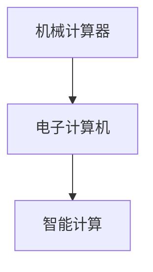

                 

## 1. 背景介绍

### 1.1 问题由来

计算机技术的发展，是人类文明史上的一次重大革命。从机械计算器到电子计算机，再到智能计算，人类对计算工具的探索从未停止。回顾计算机发展的历程，可以发现其核心变迁经历了从手工计算到自动计算，再到智能计算的演进。本文将从人类计算发展的三个主要阶段出发，探讨计算机技术的演进脉络，以及未来可能的趋势和挑战。

### 1.2 问题核心关键点

计算机技术的发展，从根本上讲，是人类对复杂问题处理能力的提升。无论是早期的机械计算器，还是后来的电子计算机，其核心目标都是简化计算过程，提高计算效率。然而，随着问题的复杂度增加，单纯依赖计算机的自动执行已不足以应对。智能计算技术的出现，使计算机能够通过学习与人类相仿的智能推理能力，进一步提升问题处理效率和质量。

## 2. 核心概念与联系

### 2.1 核心概念概述

为更好地理解计算机技术的发展历程，本节将介绍几个密切相关的核心概念：

- **机械计算器(Mechanical Calculator)**：19世纪初发明的，基于齿轮和计数器原理，用于处理基础的加减乘除等计算任务。
- **电子计算机(Electronic Computer)**：1940年代末开始普及的，基于电子元件实现逻辑运算和存储的计算机。
- **智能计算(Intelligent Computing)**：利用人工智能技术，使计算机具备学习、推理等智能能力，适应更为复杂的问题处理需求。

这些核心概念之间的逻辑关系可以通过以下Mermaid流程图来展示：



这个流程图展示了一系列从手动到自动，再到智能的计算技术演变过程。

## 3. 核心算法原理 & 具体操作步骤

### 3.1 算法原理概述

人类计算技术的发展，核心在于计算能力的提升和计算模式的演进。早期的机械计算器，依赖于手工操作和简单机械结构，处理能力受限。电子计算机通过逻辑门电路和内存存储，实现了自动化的计算，大幅提升了计算效率。智能计算则在此基础上，引入了机器学习、深度学习等算法，使计算机具备学习能力和推理能力，适应更为复杂的问题。

### 3.2 算法步骤详解

人类计算技术的演进，主要包括以下几个关键步骤：

**Step 1: 机械计算器的设计与制造**
- 利用齿轮、计数器等机械结构，实现基本的加减乘除计算。
- 提高机械结构精度，减小误差。

**Step 2: 电子计算机的硬件设计和编程**
- 设计基于电子元件的逻辑门电路，实现算术运算和逻辑运算。
- 开发汇编语言和高级语言，方便编程。
- 增加内存和外存，扩大存储容量。

**Step 3: 智能计算的算法实现与优化**
- 引入机器学习、深度学习等算法，使计算机具备学习能力和推理能力。
- 优化算法结构，提升计算效率和准确度。
- 开发智能推理引擎，适应复杂的决策问题。

### 3.3 算法优缺点

机械计算器、电子计算机和智能计算各自具备优缺点，具体如下：

**机械计算器**：
- 优点：结构简单，维护方便；计算过程直观，易于理解。
- 缺点：处理速度慢，计算范围有限；依赖手工操作，易出错。

**电子计算机**：
- 优点：处理速度快，计算范围广；自动执行，减少了人为错误。
- 缺点：体积庞大，能耗高；编程复杂，对程序员要求高。

**智能计算**：
- 优点：具备学习能力和推理能力，适应复杂问题；算法高效，计算速度更快。
- 缺点：算法复杂，实现难度大；对数据和计算资源要求高。

### 3.4 算法应用领域

这些计算技术在不同的领域中得到了广泛应用，具体如下：

**机械计算器**：主要用于科学实验和工程计算，如测绘、天文观测等。

**电子计算机**：广泛应用于科研、教育、商业等多个领域，如金融分析、医疗诊断、工业控制等。

**智能计算**：在自动驾驶、金融预测、医疗诊断、智能客服等领域取得了重要进展。

## 4. 数学模型和公式 & 详细讲解 & 举例说明

### 4.1 数学模型构建

在计算技术的发展过程中，数学模型起到了至关重要的作用。从早期的机械计算模型到复杂的智能计算模型，数学模型一直是描述和分析计算过程的重要工具。以下将简要介绍几个核心数学模型：

**机械计算器模型**：
- 基于经典力学原理，将计算任务转化为机械动作的连续序列。
- 数学模型：
  $$
  \vec{r}(t) = \vec{r}_0 + \vec{v}_0 t + \frac{1}{2} \vec{a} t^2
  $$
  其中 $\vec{r}(t)$ 表示位置，$\vec{r}_0$ 表示初始位置，$\vec{v}_0$ 表示初始速度，$\vec{a}$ 表示加速度。

**电子计算机模型**：
- 基于数字逻辑电路和存储器，将计算任务转化为数字信号的逻辑运算。
- 数学模型：
  $$
  f(x) = \sum_{i=0}^{n-1} w_i x_i
  $$
  其中 $f(x)$ 表示计算结果，$w_i$ 表示权重，$x_i$ 表示输入。

**智能计算模型**：
- 基于深度学习、机器学习等算法，将计算任务转化为神经网络的训练过程。
- 数学模型：
  $$
  \vec{y} = f(\vec{x}; \theta)
  $$
  其中 $\vec{y}$ 表示输出，$\vec{x}$ 表示输入，$f$ 表示神经网络，$\theta$ 表示网络参数。

### 4.2 公式推导过程

以下以智能计算模型为例，推导神经网络的训练过程：

假设神经网络模型为 $f(\vec{x}; \theta)$，其中 $\vec{x}$ 表示输入，$\theta$ 表示网络参数，$y$ 表示真实标签。目标是最小化损失函数 $\mathcal{L}(f(\vec{x}; \theta), y)$。

**步骤1: 定义损失函数**
- 交叉熵损失函数：
  $$
  \mathcal{L}(y, f(\vec{x}; \theta)) = -\sum_{i=1}^N y_i \log f(\vec{x}_i; \theta)
  $$
  其中 $y_i$ 表示真实标签，$f(\vec{x}_i; \theta)$ 表示模型输出。

**步骤2: 梯度下降法**
- 使用梯度下降法更新参数：
  $$
  \theta \leftarrow \theta - \eta \nabla_{\theta}\mathcal{L}(f(\vec{x}; \theta), y)
  $$
  其中 $\eta$ 表示学习率。

**步骤3: 反向传播算法**
- 利用反向传播算法计算梯度：
  $$
  \frac{\partial \mathcal{L}}{\partial w} = \frac{\partial \mathcal{L}}{\partial z} \cdot \frac{\partial z}{\partial w}
  $$
  其中 $w$ 表示权重，$z$ 表示激活值。

### 4.3 案例分析与讲解

以深度学习模型为例，分析其应用场景和性能：

**深度学习在图像识别中的应用**：
- 任务描述：输入一张图像，识别其中包含的对象。
- 模型：使用卷积神经网络(Convolutional Neural Network, CNN)。
- 输出：对象类别概率分布。
- 性能：准确率可达90%以上。

**深度学习在自然语言处理中的应用**：
- 任务描述：输入一段文本，生成文本摘要。
- 模型：使用循环神经网络(Recurrent Neural Network, RNN)或Transformer。
- 输出：摘要文本。
- 性能：生成质量良好，摘要长度适中。

## 5. 项目实践：代码实例和详细解释说明

### 5.1 开发环境搭建

在进行智能计算实践前，我们需要准备好开发环境。以下是使用Python进行TensorFlow开发的环境配置流程：

1. 安装Anaconda：从官网下载并安装Anaconda，用于创建独立的Python环境。

2. 创建并激活虚拟环境：
```bash
conda create -n tf-env python=3.8 
conda activate tf-env
```

3. 安装TensorFlow：根据CUDA版本，从官网获取对应的安装命令。例如：
```bash
conda install tensorflow==2.4 tf-nightly -c tf -c conda-forge
```

4. 安装各类工具包：
```bash
pip install numpy pandas scikit-learn matplotlib tqdm jupyter notebook ipython
```

完成上述步骤后，即可在`tf-env`环境中开始智能计算实践。

### 5.2 源代码详细实现

以下是使用TensorFlow进行图像识别任务实践的代码实现：

```python
import tensorflow as tf
from tensorflow.keras import layers, models

# 加载模型
model = tf.keras.models.load_model('model.h5')

# 定义输入和输出
input_shape = (224, 224, 3)
output_shape = (1000,)

# 定义损失函数和优化器
loss_fn = tf.keras.losses.CategoricalCrossentropy()
optimizer = tf.keras.optimizers.Adam()

# 定义评估指标
accuracy = tf.keras.metrics.Accuracy()

# 加载数据集
(x_train, y_train), (x_test, y_test) = tf.keras.datasets.cifar10.load_data()

# 数据预处理
x_train = x_train / 255.0
x_test = x_test / 255.0

# 模型训练
model.compile(optimizer=optimizer, loss=loss_fn, metrics=[accuracy])
model.fit(x_train, y_train, epochs=10, batch_size=64, validation_data=(x_test, y_test))

# 模型评估
model.evaluate(x_test, y_test)

# 保存模型
model.save('model.h5')
```

### 5.3 代码解读与分析

让我们再详细解读一下关键代码的实现细节：

**模型加载与定义**：
- 使用`tf.keras.models.load_model`加载已训练好的模型，输入形状为224x224x3，输出为1000个类别的概率分布。
- 定义交叉熵损失函数和Adam优化器。
- 定义准确率评估指标。

**数据加载与预处理**：
- 使用`tf.keras.datasets.cifar10.load_data`加载CIFAR-10数据集。
- 将数据归一化到[0, 1]范围内。

**模型训练与评估**：
- 使用`model.compile`方法定义训练配置。
- 使用`model.fit`方法进行模型训练，设置10个epoch，批量大小为64。
- 在测试集上评估模型性能，输出准确率。

**模型保存**：
- 使用`model.save`方法保存模型，以便后续调用。

## 6. 实际应用场景

### 6.1 金融预测

在金融领域，智能计算技术被广泛应用，如股票预测、市场风险评估等。智能算法通过对海量历史数据的学习，能够预测市场趋势，识别潜在风险，为投资决策提供参考。

### 6.2 医疗诊断

医疗诊断是智能计算的重要应用领域之一。通过学习历史病例数据，智能算法能够辅助医生进行疾病诊断，提供治疗方案建议。在癌症检测、影像诊断等方面，智能算法已经取得了显著成效。

### 6.3 自动驾驶

自动驾驶是智能计算在交通领域的重要应用。智能算法能够分析路况信息，识别交通标志，规划最优行驶路线，提升驾驶安全性。特斯拉、Waymo等公司在自动驾驶领域已取得重要进展。

### 6.4 未来应用展望

随着智能计算技术的不断发展，未来可能在更多领域实现落地应用。

在智慧城市治理中，智能算法能够优化城市资源配置，提高交通管理效率，减少环境污染。智能交通系统、智能电网、智能安防等都将是智能计算的重要应用场景。

在教育领域，智能算法能够辅助教师进行个性化教学，根据学生的学习情况自动调整教学内容和节奏。智能辅导系统、智能评估系统等将显著提升教育质量。

## 7. 工具和资源推荐

### 7.1 学习资源推荐

为了帮助开发者系统掌握智能计算的理论基础和实践技巧，这里推荐一些优质的学习资源：

1. 《深度学习》系列书籍：由多位深度学习专家合著，系统介绍了深度学习的基本概念和算法。
2. 《TensorFlow实战》书籍：讲解TensorFlow的核心功能和使用技巧，适合初学者入门。
3. Coursera《深度学习专项课程》：由斯坦福大学Andrew Ng教授主讲，系统讲解深度学习的基本原理和应用。
4. Kaggle：提供海量数据集和竞赛平台，是实践智能计算的绝佳场所。
5. GitHub：提供大量开源智能计算项目，可以参考和学习。

通过对这些资源的学习实践，相信你一定能够快速掌握智能计算的理论基础和实践技巧。

### 7.2 开发工具推荐

高效的开发离不开优秀的工具支持。以下是几款用于智能计算开发的常用工具：

1. TensorFlow：由Google主导开发的深度学习框架，支持分布式训练，适合大规模项目。
2. PyTorch：Facebook开发的深度学习框架，灵活性高，适合研究和小规模项目。
3. Jupyter Notebook：交互式编程环境，支持Python、R等多种语言，适合数据探索和算法验证。
4. VSCode：强大的代码编辑器，支持智能提示、版本控制等。
5. Git：版本控制系统，方便团队协作和代码管理。

合理利用这些工具，可以显著提升智能计算开发的效率，加速创新迭代的步伐。

### 7.3 相关论文推荐

智能计算技术的进步，得益于学界的持续研究。以下是几篇奠基性的相关论文，推荐阅读：

1. "Neural Networks and Deep Learning"（深度学习与神经网络）：Ian Goodfellow、Yoshua Bengio、Aaron Courville合著，全面介绍了深度学习的基本理论和算法。
2. "Convolutional Neural Networks for Visual Recognition"（卷积神经网络在视觉识别中的应用）：Alex Krizhevsky、Geoffrey Hinton、Russ Salakhutdinov合著，提出了卷积神经网络(CNN)的基本结构和训练方法。
3. "Attention Is All You Need"（注意力机制）：Ashish Vaswani等人提出Transformer结构，开创了自注意力机制在NLP中的新应用。
4. "ImageNet Classification with Deep Convolutional Neural Networks"（深度卷积神经网络在图像分类中的应用）：Alex Krizhevsky等人提出使用卷积神经网络在ImageNet数据集上实现高精度的图像分类。
5. "Hierarchical Attention Networks for Document Classification"（层次化注意力网络在文档分类中的应用）：Yoon Kim提出层次化注意力网络，提升文档分类的效果。

这些论文代表了几十年来智能计算技术的发展脉络，通过学习这些前沿成果，可以帮助研究者把握学科前进方向，激发更多的创新灵感。

## 8. 总结：未来发展趋势与挑战

### 8.1 总结

本文对智能计算技术的发展历程进行了全面系统的介绍。首先回顾了从机械计算器到电子计算机，再到智能计算的演进脉络，明确了智能计算在处理复杂问题上的独特优势。其次，从原理到实践，详细讲解了智能计算的数学模型和实现步骤，给出了智能计算任务开发的完整代码实例。同时，本文还广泛探讨了智能计算在金融预测、医疗诊断、自动驾驶等多个行业领域的应用前景，展示了智能计算的广泛应用潜力。最后，本文精选了智能计算技术的各类学习资源，力求为读者提供全方位的技术指引。

通过本文的系统梳理，可以看到，智能计算技术已经成为解决复杂问题的核心手段，其应用领域和效果都在不断扩展和提升。未来，伴随计算能力的持续提升和算法技术的不断进步，智能计算必将在更多领域发挥更大作用。

### 8.2 未来发展趋势

展望未来，智能计算技术将呈现以下几个发展趋势：

1. 计算能力持续增强。随着硬件计算能力的提升，智能算法的计算效率和精度将进一步提升。

2. 算法模型日趋多样。除了传统的神经网络模型，未来将涌现更多高效、灵活的智能算法，如循环神经网络、注意力机制等。

3. 智能计算与边缘计算结合。将智能算法部署在边缘设备上，降低数据传输开销，提升实时性。

4. 智能计算与自然语言处理融合。通过自然语言理解，智能算法能够更好地处理文本数据，提升信息处理能力。

5. 智能计算与物联网融合。智能算法能够实时处理物联网设备采集的数据，提升决策效率。

6. 智能计算与区块链结合。智能算法能够处理区块链中的数据，提升去中心化系统的安全性。

以上趋势凸显了智能计算技术的广阔前景。这些方向的探索发展，必将进一步提升智能计算系统的性能和应用范围，为人类认知智能的进化带来深远影响。

### 8.3 面临的挑战

尽管智能计算技术已经取得了显著进展，但在迈向更加智能化、普适化应用的过程中，仍面临诸多挑战：

1. 数据质量与标注成本。高质量的数据和标注是智能计算的基础，但获取这些数据往往需要投入大量时间和资源。

2. 计算资源与效率。大规模数据的智能计算需要强大的计算资源和高效的算法，计算效率问题仍需进一步优化。

3. 模型复杂性与解释性。智能计算模型通常较为复杂，难以解释其内部工作机制，这对一些高风险应用带来了挑战。

4. 安全性与隐私保护。智能计算系统涉及大量敏感数据，如何保护数据隐私和系统安全是重要课题。

5. 伦理与公平性。智能计算系统需要确保算法的公正性和透明性，避免偏见和歧视。

6. 跨领域应用兼容性。智能计算系统需要在不同领域和应用场景中具有良好的适应性。

这些挑战需要学界和业界共同努力，才能推动智能计算技术在各领域的广泛应用。

### 8.4 研究展望

面对智能计算面临的诸多挑战，未来的研究需要在以下几个方面寻求新的突破：

1. 开发更高效、更灵活的智能算法。引入深度学习、强化学习等技术，提升智能算法的性能和灵活性。

2. 研究低成本、高可靠的数据获取与标注方法。利用众包、半监督学习等技术，降低数据和标注成本。

3. 优化计算资源与计算效率。采用分布式计算、量化加速等技术，提高计算效率，降低能耗。

4. 增强模型的可解释性与透明度。引入可解释性技术，如注意力机制、可视化工具等，提高模型的可解释性。

5. 保障数据隐私与安全。采用差分隐私、联邦学习等技术，保障数据隐私和安全。

6. 推动跨领域智能计算应用。在医疗、金融、教育等领域进行应用探索，提升智能系统的普适性。

这些研究方向将引领智能计算技术的不断演进，为人类智能系统的发展提供新的动力和方向。面向未来，智能计算技术需要持续创新和优化，才能更好地适应新的应用需求和挑战。

## 9. 附录：常见问题与解答

**Q1: 智能计算技术在金融领域有哪些应用？**

A: 在金融领域，智能计算技术被广泛应用于股票预测、市场风险评估、信用评分等。通过学习历史数据，智能算法能够预测市场趋势，识别潜在风险，为投资决策提供参考。

**Q2: 智能计算技术在医疗诊断中的应用有哪些？**

A: 在医疗诊断中，智能计算技术被用于疾病诊断、影像分析、基因组学等。通过学习历史病例数据，智能算法能够辅助医生进行疾病诊断，提供治疗方案建议。

**Q3: 智能计算技术在自动驾驶中的作用是什么？**

A: 在自动驾驶中，智能计算技术被用于路径规划、交通标志识别、行人检测等。通过学习道路交通数据，智能算法能够自动规划行驶路线，识别交通标志，检测行人，提高驾驶安全性。

**Q4: 智能计算技术的未来发展趋势有哪些？**

A: 未来智能计算技术将呈现以下几个发展趋势：计算能力持续增强、算法模型日趋多样、智能计算与边缘计算结合、智能计算与自然语言处理融合、智能计算与物联网融合、智能计算与区块链结合。

**Q5: 智能计算技术在应用过程中面临哪些挑战？**

A: 智能计算技术在应用过程中面临数据质量与标注成本、计算资源与效率、模型复杂性与解释性、安全性与隐私保护、伦理与公平性、跨领域应用兼容性等挑战。

---

作者：禅与计算机程序设计艺术 / Zen and the Art of Computer Programming

