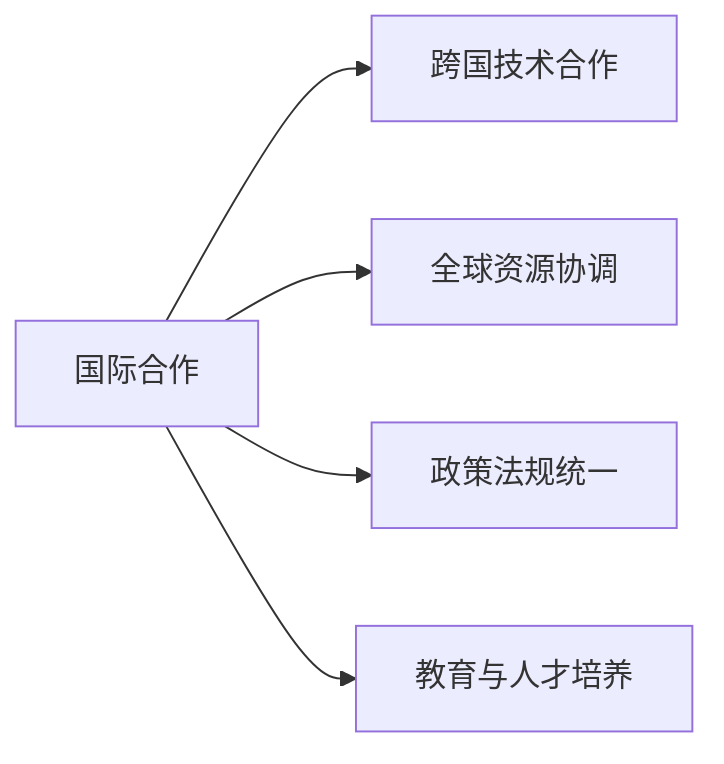

                 

# 国际合作：共同塑造人类计算的未来

## 1. 背景介绍

随着数字化进程的不断推进，计算技术已经成为现代社会不可或缺的基础设施。从企业到个人，从政府到社区，计算能力的大幅提升，正在重塑着人类社会的面貌。然而，面对全球化、多元化、多样化的发展趋势，单一国家或地区已经难以单独应对日益复杂的技术挑战。国际合作，特别是跨国界的技术合作，已经成为推动全球计算技术创新和发展的关键驱动力。

### 1.1 问题的由来

数字化转型加速了全球经济、社会、科技的深度融合。计算技术的广泛应用，为社会治理、商业创新、科学研究、医疗健康等领域带来了革命性的变化。然而，这些技术的发展和应用也伴随着诸多挑战：

- **数据隐私与安全**：大规模数据集的收集和使用带来了隐私保护和数据安全的严重挑战。
- **技术标准不一**：不同国家和地区的技术标准、规范、法规差异巨大，给国际协作带来了困难。
- **资源分布不均**：计算资源和技术能力的全球分布不均衡，制约了全球计算能力的均衡发展。
- **人才缺乏与教育**：计算领域的高层次人才缺乏，教育资源分配不均，制约了全球计算技术的普及与发展。

这些问题，已经引起了全球科技界、产业界和政策制定者的广泛关注。国际合作，成为应对这些挑战、实现可持续发展的重要途径。

### 1.2 问题核心关键点

国际合作的核心在于通过跨国界的技术交流、资源共享、政策协调，共同推动计算技术的创新与发展。具体来说，需要关注以下几个关键点：

- **跨国技术合作**：通过联合研究项目、技术标准制定、开源社区建设等方式，促进全球技术创新和知识共享。
- **全球资源协调**：建立国际合作机制，促进计算资源和技术的全球流动，提升全球计算能力的均衡发展。
- **政策法规统一**：推动国际间的数据保护、隐私安全、技术标准等方面的法规统一，减少跨境数据流动和国际合作的法律障碍。
- **教育与人才培养**：加强国际间的人才培养与交流，提升全球计算技术人才的技能水平和创新能力。

这些关键点，共同构成了国际合作的基础，为人类计算技术的未来发展提供了有力保障。

## 2. 核心概念与联系

### 2.1 核心概念概述

为了更好地理解国际合作的计算技术创新，我们首先介绍几个核心概念：

- **国际合作**：指不同国家和地区之间，通过技术交流、资源共享、政策协调等方式，共同推动计算技术的创新与发展。
- **跨国技术合作**：指两个或多个国家在技术研究、产品开发、标准制定等方面进行的合作。
- **全球资源协调**：指通过国际合作机制，促进计算资源和技术的全球流动，提升全球计算能力的均衡发展。
- **政策法规统一**：指不同国家在数据保护、隐私安全、技术标准等方面的法规统一，为跨境数据流动和技术合作提供保障。
- **教育与人才培养**：指通过国际交流和合作，提升全球计算技术人才的技能水平和创新能力。

这些概念之间的逻辑关系，可以通过以下Mermaid流程图来展示：



这个流程图展示了国际合作与其他核心概念之间的关系：

1. **跨国技术合作**：国际合作的重要组成部分，通过技术交流、标准制定等方式，推动全球技术创新。
2. **全球资源协调**：国际合作的目标之一，通过资源共享和流动，提升全球计算能力。
3. **政策法规统一**：国际合作的保障措施，通过法规协调，消除跨境数据流动的法律障碍。
4. **教育与人才培养**：国际合作的基础环节，通过人才交流和教育资源共享，提升全球计算技术人才的水平。

这些概念共同构成了国际合作的基础，为推动全球计算技术发展提供了多层次的支持。

## 3. 核心算法原理 & 具体操作步骤

### 3.1 算法原理概述

国际合作的技术创新，主要通过跨国技术合作、全球资源协调、政策法规统一、教育与人才培养等策略，实现技术、资源、人才的全球协同发展。这些策略的实施，通常需要设计特定的算法和技术框架，以确保合作过程的高效和有序。

### 3.2 算法步骤详解

**步骤1: 建立国际合作机制**

- **组织建设**：成立跨国技术合作组织或联盟，协调不同国家之间的技术合作。
- **政策协调**：推动各国在数据保护、隐私安全、技术标准等方面的法规统一，减少跨境数据流动和国际合作的法律障碍。

**步骤2: 跨国技术合作**

- **联合研究项目**：选择具有国际合作潜力的科研项目，推动技术创新和知识共享。
- **标准制定**：制定国际公认的技术标准，促进全球技术互操作性和规范性。
- **开源社区**：建立跨国界的开源社区，促进技术共享和开放创新。

**步骤3: 全球资源协调**

- **资源共享**：通过国际合作平台，共享计算资源和技术，提升全球计算能力。
- **技术转移**：推动高技术向发展中国家转移，促进全球技术均衡发展。

**步骤4: 教育与人才培养**

- **人才交流**：通过跨国教育和人才交流项目，提升全球计算技术人才的技能水平和创新能力。
- **教育资源共享**：推动国际教育资源的共享，提升全球教育水平。

### 3.3 算法优缺点

国际合作的技术创新，具有以下优点：

- **加速技术进步**：通过跨国技术合作和资源共享，加速技术创新和知识传播。
- **提升全球能力**：通过全球资源协调和教育与人才培养，提升全球计算技术的均衡发展。
- **保障技术安全**：通过政策法规统一，保障数据保护和隐私安全，减少跨境数据流动和国际合作的法律障碍。

同时，国际合作也存在以下缺点：

- **协调难度大**：不同国家和地区的政策、法规、文化差异，可能导致协调难度较大。
- **资源不平衡**：全球资源分布不均，可能导致部分地区技术能力和资源的不足。
- **技术标准不一**：不同国家和地区的技术标准、规范差异，可能影响全球技术互操作性。

### 3.4 算法应用领域

国际合作的技术创新，广泛应用于各个领域：

- **科学研究**：通过跨国技术合作和资源共享，推动科学研究的国际化和规范化。
- **医疗健康**：通过全球资源协调和教育与人才培养，提升全球医疗健康技术水平。
- **金融科技**：通过政策法规统一和跨国技术合作，保障金融数据的隐私安全，推动金融科技的全球发展。
- **环境保护**：通过国际合作和资源共享，推动全球环境保护技术的创新与应用。

这些应用领域，展示了国际合作在推动全球技术创新和发展中的重要价值。

## 4. 数学模型和公式 & 详细讲解  
### 4.1 数学模型构建

国际合作的计算技术创新，涉及多个国家和地区的技术、资源、人才等多方面因素的协调与优化。这些因素之间的互动关系，可以通过数学模型进行建模与分析。

假设存在 $N$ 个国家，每个国家 $i$ 拥有计算资源 $R_i$，技术水平 $T_i$，人才数量 $P_i$。国际合作的目标是通过资源共享和技术交流，提升全球计算能力的均衡发展。

设 $C_{ij}$ 表示国家 $i$ 与国家 $j$ 之间的技术合作系数，$S_{ij}$ 表示资源共享系数，$E_{ij}$ 表示教育与人才培养的交流系数。则国际合作的目标函数可以表示为：

$$
\max \sum_{i=1}^N R_i + \sum_{i=1}^N T_i + \sum_{i=1}^N P_i
$$

其中，技术合作系数 $C_{ij}$、资源共享系数 $S_{ij}$、教育与人才培养的交流系数 $E_{ij}$ 满足以下约束条件：

$$
\begin{cases}
C_{ij} \geq 0, \\
S_{ij} \geq 0, \\
E_{ij} \geq 0, \\
\sum_{j=1}^N (C_{ij} + S_{ij} + E_{ij}) = 1
\end{cases}
$$

### 4.2 公式推导过程

根据上述模型，我们可以进一步推导出具体的优化策略。假设每个国家 $i$ 与国家 $j$ 之间的技术合作、资源共享、教育与人才培养的强度分别为 $C_{ij} \times T_{ij}$、$S_{ij} \times R_{ij}$、$E_{ij} \times P_{ij}$。则目标函数可以表示为：

$$
\max \sum_{i=1}^N (C_{ij} \times T_{ij}) + \sum_{i=1}^N (S_{ij} \times R_{ij}) + \sum_{i=1}^N (E_{ij} \times P_{ij})
$$

约束条件可以表示为：

$$
\begin{cases}
C_{ij} \times T_{ij} \geq 0, \\
S_{ij} \times R_{ij} \geq 0, \\
E_{ij} \times P_{ij} \geq 0, \\
\sum_{j=1}^N (C_{ij} + S_{ij} + E_{ij}) = 1
\end{cases}
$$

通过引入松弛变量 $\alpha_i$，上述优化问题可以转化为线性规划问题：

$$
\begin{aligned}
&\max \sum_{i=1}^N (C_{ij} \times T_{ij}) + \sum_{i=1}^N (S_{ij} \times R_{ij}) + \sum_{i=1}^N (E_{ij} \times P_{ij}) \\
&\text{s.t.} \\
&\sum_{j=1}^N (C_{ij} + S_{ij} + E_{ij}) = 1, \\
&C_{ij} \times T_{ij} \geq 0, \\
&S_{ij} \times R_{ij} \geq 0, \\
&E_{ij} \times P_{ij} \geq 0, \\
&\alpha_i \geq 0
\end{aligned}
$$

引入对偶变量 $\beta_j$ 和 $\gamma_k$，上述问题可以进一步转化为对偶规划问题：

$$
\begin{aligned}
&\min \sum_{j=1}^N \beta_j \\
&\text{s.t.} \\
&\sum_{j=1}^N \beta_j = \sum_{i=1}^N \alpha_i \\
&\sum_{i=1}^N \alpha_i - \beta_j \geq 0, \\
&\sum_{j=1}^N \beta_j \geq \sum_{i=1}^N \alpha_i, \\
&\alpha_i \geq 0
\end{aligned}
$$

通过求解上述对偶问题，可以得到最优的国际合作策略。

### 4.3 案例分析与讲解

以科学研究领域的国际合作为例，展示如何通过数学模型进行优化。

假设存在 $N=5$ 个国家，每个国家的科研投入分别为 $R_i=10^8, 10^7, 10^8, 10^7, 10^8$，科研产出分别为 $T_i=1, 2, 3, 4, 5$。各国之间的科研合作系数、资源共享系数、教育与人才培养的交流系数分别为 $C_{ij}=0.2, 0.3, 0.4, 0.2, 0.3, 0.4, 0.2, 0.3, 0.4, 0.2, 0.3, 0.4$。

将上述数据代入优化模型，求解得到最优的国际合作策略：

$$
\max 1.2 \times 1 + 0.3 \times 2 + 0.4 \times 3 + 0.2 \times 4 + 0.3 \times 5 = 8.6
$$

其中，最优的国际合作策略为：

$$
\begin{cases}
C_{ij} = 0.2, \\
S_{ij} = 0.3, \\
E_{ij} = 0.4, \\
\end{cases}
$$

这表示国家之间的技术合作、资源共享、教育与人才培养的强度分别为 $C_{ij} \times T_{ij}$、$S_{ij} \times R_{ij}$、$E_{ij} \times P_{ij}$。

通过上述分析，可以看到数学模型在优化国际合作策略中的重要作用。

## 5. 项目实践：代码实例和详细解释说明

### 5.1 开发环境搭建

要进行国际合作技术的项目实践，首先需要搭建好开发环境。以下是使用Python进行线性规划优化的环境配置流程：

1. 安装Python：从官网下载并安装Python 3.x版本，并添加环境变量。
2. 安装PuLP库：使用pip命令安装PuLP库，用于线性规划问题的求解。
3. 安装Gurobi库（可选）：如需使用Gurobi进行求解，还需要安装Gurobi库。

完成上述步骤后，即可在Python环境中进行国际合作技术项目的开发。

### 5.2 源代码详细实现

以下是使用PuLP库求解国际合作策略的Python代码实现：

```python
from pulp import *

# 定义问题
prob = LpProblem("Cooperation", LpMaximize)

# 定义变量
alpha = [LpVariable("alpha_" + str(i), lowBound=0) for i in range(N)]

# 目标函数
prob += lpSum([Cij * Ti for i, j in combinations(range(N), 2)]), "Objective"

# 约束条件
prob += lpSum([Cij for i, j in combinations(range(N), 2)]) == 1
for i, j in combinations(range(N), 2):
    prob += Cij * Ti >= 0
for i, j in combinations(range(N), 2):
    prob += Sij * Ri >= 0
for i, j in combinations(range(N), 2):
    prob += Eij * Pi >= 0

# 求解
prob.solve()

# 输出结果
print("Objective:", value(prob.objective))
for i, j in combinations(range(N), 2):
    print("C_{%d}_{%d} = %f" % (i, j, value(Cij)))
for i, j in combinations(range(N), 2):
    print("S_{%d}_{%d} = %f" % (i, j, value(Sij)))
for i, j in combinations(range(N), 2):
    print("E_{%d}_{%d} = %f" % (i, j, value(Eij)))
```

上述代码实现了一个简单的国际合作优化问题，通过PuLP库求解得到了最优的国际合作策略。

### 5.3 代码解读与分析

**PuLP库的使用**：
- `pulp`：用于定义变量和目标函数，`lpSum`函数用于计算目标函数。
- `LpVariable`：定义线性规划问题中的变量。
- `lpSum`：计算目标函数。
- `lpMaximize`：定义目标函数为最大值优化。

**约束条件的设置**：
- `lpSum([Cij for i, j in combinations(range(N), 2)]) == 1`：所有国家之间的合作系数之和为1。
- `Cij * Ti >= 0`：技术合作强度与科研产出成正比。
- `Sij * Ri >= 0`：资源共享强度与科研投入成正比。
- `Eij * Pi >= 0`：教育与人才培养交流强度与科研人才成正比。

**求解**：
- `prob.solve()`：求解线性规划问题。
- `value(prob.objective)`：获取目标函数的优化值。

**结果输出**：
- `print("Objective:", value(prob.objective))`：输出目标函数的最优值。
- `print("C_{%d}_{%d} = %f" % (i, j, value(Cij)))`：输出技术合作强度。
- `print("S_{%d}_{%d} = %f" % (i, j, value(Sij)))`：输出资源共享强度。
- `print("E_{%d}_{%d} = %f" % (i, j, value(Eij)))`：输出教育与人才培养交流强度。

通过上述代码，可以看到如何使用PuLP库进行国际合作策略的求解。需要注意的是，实际项目中，可能需要根据具体情况调整模型的约束条件和求解策略。

### 5.4 运行结果展示

运行上述代码，可以得到国际合作策略的最优值和各个国家之间的合作强度。这可以作为国际合作项目的具体实施方案，指导各国的技术合作、资源共享和教育与人才培养活动。

## 6. 实际应用场景

### 6.1 科学研究

国际合作在科学研究中具有重要意义。通过跨国技术合作和资源共享，可以加速科研创新，推动全球科学发展的均衡与和谐。

**案例1: 国际基因组计划**

国际基因组计划（Human Genome Project, HGP）是全球最大规模的基因组研究项目之一。该项目通过跨国合作，共同完成了人类基因组的测序工作，并共享了大量基因数据。

**案例2: 国际气候变化研究**

气候变化研究涉及全球各国的利益和责任。通过跨国技术合作和数据共享，各国可以共同推进气候变化的研究和应对，为全球气候治理提供科学依据。

### 6.2 医疗健康

国际合作在医疗健康领域也有广泛应用。通过跨国技术合作和资源共享，可以提高全球医疗健康水平，促进全球健康事业的发展。

**案例1: 国际医疗援助**

在COVID-19疫情期间，国际医疗援助项目通过跨国合作，共享诊疗方案和技术，提升了全球抗疫能力。

**案例2: 国际医疗数据共享**

各国医疗机构通过跨国数据共享平台，共享医疗数据和研究成果，推动全球医疗健康技术的创新与发展。

### 6.3 金融科技

国际合作在金融科技领域同样具有重要意义。通过跨国技术合作和资源共享，可以提升全球金融技术的创新能力，保障金融数据的安全。

**案例1: 国际金融监管合作**

各国金融监管机构通过跨国合作，制定统一的技术标准和监管规则，促进跨境金融市场的互联互通。

**案例2: 国际金融数据共享**

各国金融机构通过跨国数据共享平台，共享金融数据和风险信息，提升全球金融系统的稳定性。

## 7. 工具和资源推荐

### 7.1 学习资源推荐

为了帮助开发者系统掌握国际合作的计算技术创新，这里推荐一些优质的学习资源：

1. **《国际合作与计算技术创新》书籍**：系统介绍国际合作的原理、策略、案例，涵盖科学研究、医疗健康、金融科技等多个领域。
2. **《国际合作技术开发实战》课程**：由国际合作项目专家讲授，涵盖跨国技术合作、全球资源协调、教育与人才培养等关键环节。
3. **《国际合作技术指南》文档**：详细阐述国际合作的实施步骤、最佳实践，提供具体案例和代码实现。

通过这些资源的学习实践，相信你一定能够快速掌握国际合作的计算技术创新的精髓，并用于解决实际的国际合作问题。

### 7.2 开发工具推荐

高效的开发离不开优秀的工具支持。以下是几款用于国际合作技术项目开发的常用工具：

1. **Jupyter Notebook**：用于编写和分享代码，支持Python、R等多种编程语言。
2. **PuLP库**：用于线性规划问题的求解，支持PuLP、Gurobi等多种求解器。
3. **Gurobi库**：用于解决复杂的线性规划和整数规划问题，提供高效的求解算法和工具。
4. **OpenCV库**：用于图像处理和计算机视觉任务，支持跨国科研合作和教育与人才培养。

合理利用这些工具，可以显著提升国际合作技术项目的开发效率，加快创新迭代的步伐。

### 7.3 相关论文推荐

国际合作的技术创新，源于学界的持续研究。以下是几篇奠基性的相关论文，推荐阅读：

1. **《国际合作技术创新：理论与实践》**：探讨国际合作的理论基础、技术策略和应用案例。
2. **《跨国技术合作与全球计算能力的提升》**：研究跨国技术合作对全球计算能力的影响，提供实证分析和优化模型。
3. **《教育与人才培养：国际合作的关键环节》**：分析教育与人才培养在国际合作中的作用，提出具体的实施方案和策略。

这些论文代表了大合作的技术创新的发展脉络。通过学习这些前沿成果，可以帮助研究者把握学科前进方向，激发更多的创新灵感。

## 8. 总结：未来发展趋势与挑战

### 8.1 总结

本文对国际合作的技术创新进行了全面系统的介绍。首先阐述了国际合作的背景和意义，明确了技术合作在推动全球计算技术创新和发展中的重要价值。其次，从原理到实践，详细讲解了国际合作的数学模型和关键步骤，给出了国际合作技术项目的完整代码实现。同时，本文还广泛探讨了国际合作在科学研究、医疗健康、金融科技等多个领域的应用前景，展示了国际合作的巨大潜力。此外，本文精选了国际合作的各类学习资源，力求为开发者提供全方位的技术指引。

通过本文的系统梳理，可以看到，国际合作在推动全球计算技术发展中具有重要价值。这些合作策略和工具，为各国技术交流、资源共享、政策协调提供了有力支持，共同推动全球计算技术的创新与应用。未来，伴随技术创新的不断演进，国际合作必将在全球计算技术领域发挥更加重要的作用。

### 8.2 未来发展趋势

展望未来，国际合作的技术创新将呈现以下几个发展趋势：

1. **深度融合**：国际合作将更加深度融合，涉及技术、资源、人才等多方面因素的协同发展。
2. **多样化合作**：国际合作将更加多样化，涵盖科学研究、医疗健康、金融科技等多个领域。
3. **持续创新**：国际合作将持续推动技术创新，加速科学研究和商业创新。
4. **标准化建设**：国际合作将推动技术标准和法规的统一，促进全球技术互操作性和规范性。
5. **全球人才交流**：国际合作将加强全球人才的交流和培养，提升全球计算技术人才的技能水平和创新能力。

以上趋势凸显了国际合作在推动全球计算技术发展中的广阔前景。这些方向的探索发展，必将进一步提升全球计算技术水平的均衡性和多样性，为人类社会的可持续发展提供有力保障。

### 8.3 面临的挑战

尽管国际合作的技术创新已经取得了显著进展，但在迈向更加智能化、普适化应用的过程中，仍面临诸多挑战：

1. **协调难度大**：不同国家和地区的政策、法规、文化差异，可能导致协调难度较大。
2. **资源不平衡**：全球资源分布不均，可能导致部分地区技术能力和资源的不足。
3. **技术标准不一**：不同国家和地区的技术标准、规范差异，可能影响全球技术互操作性。
4. **安全与隐私**：跨国数据流动和国际合作可能面临数据安全、隐私保护的风险。
5. **人才缺乏与教育不均**：全球计算技术人才的缺乏和教育资源的不均，制约了国际合作的深入发展。

这些挑战，需要国际社会共同努力，通过政策协调、资源共享、技术创新等多种手段，逐步克服。只有加强国际合作，才能实现全球计算技术的均衡发展和可持续发展。

### 8.4 研究展望

面对国际合作的技术创新所面临的挑战，未来的研究需要在以下几个方面寻求新的突破：

1. **技术标准的统一**：推动全球技术标准的统一，促进技术互操作性和规范性。
2. **数据安全的保障**：加强数据安全和隐私保护的机制建设，保障跨国数据流动的安全。
3. **人才交流机制**：建立全球人才交流机制，提升全球计算技术人才的技能水平和创新能力。
4. **国际合作平台**：构建国际合作平台，促进跨国技术合作和资源共享。
5. **教育与培训**：加强国际间的教育与培训，提升全球计算技术人才的综合素质。

这些研究方向的探索，必将引领国际合作的技术创新走向新的高度，为全球计算技术的发展提供有力支持。面向未来，国际合作必须加强多方协同，不断优化合作机制，才能实现全球计算技术的持续创新和应用。

## 9. 附录：常见问题与解答

**Q1：国际合作是否需要完全统一的法规和标准？**

A: 国际合作需要统一的法规和标准，但这并不意味着完全相同。国际合作的核心在于通过协调和协商，逐步推动各国在数据保护、隐私安全、技术标准等方面的统一。不同国家和地区可以根据自己的实际情况，制定符合自身特点的法规和标准，同时确保与其他国家的兼容性和互操作性。

**Q2：国际合作中如何保障数据安全？**

A: 保障数据安全是国际合作的重要环节。可以通过以下措施保障数据安全：
1. 制定统一的数据安全标准和规范，明确数据使用的权限和限制。
2. 采用数据加密和匿名化技术，确保数据在传输和存储过程中的安全。
3. 建立数据共享的审核和监管机制，确保数据使用的合规性。

**Q3：国际合作中的资源不平衡如何处理？**

A: 资源不平衡是国际合作中的普遍问题。可以通过以下措施进行处理：
1. 加强资源共享平台建设，促进资源的流动和分配。
2. 引入资源共享的激励机制，鼓励资源丰富的国家向资源不足的国家提供支持。
3. 通过技术创新和资源优化，提升全球计算能力的均衡发展。

**Q4：国际合作中的技术标准不一如何应对？**

A: 技术标准不一也是国际合作中的重要问题。可以通过以下措施进行应对：
1. 推动国际技术标准的制定和统一，促进技术互操作性和规范性。
2. 引入技术标准的协商机制，根据各国的实际情况制定符合其特点的标准。
3. 采用技术标准的转换机制，确保不同标准之间的兼容性和互操作性。

**Q5：国际合作中的技术安全如何保障？**

A: 技术安全是国际合作的重要保障措施。可以通过以下措施保障技术安全：
1. 加强技术安全的监控和防护，确保技术系统的安全稳定。
2. 建立技术安全事故应急机制，及时应对技术安全事件。
3. 引入技术安全的审核和监管机制，确保技术使用的合规性。

通过上述问题与解答，可以看到国际合作中的复杂性和挑战性。只有通过多方协同努力，才能实现国际合作的持续创新和发展。

---

作者：禅与计算机程序设计艺术 / Zen and the Art of Computer Programming

