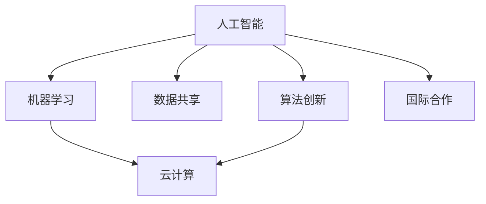

                 

# 国际合作：携手共进，推动人类计算进步

> 关键词：国际合作,人类计算,人工智能,机器学习,云计算,数据共享

## 1. 背景介绍

### 1.1 问题由来

随着人工智能(AI)技术的迅猛发展，全球范围内对于AI的关注度持续升温。AI不仅在科学研究、产业创新等方面扮演着越来越重要的角色，更成为驱动人类社会进步的强大引擎。然而，AI的发展同样面临诸多挑战，如数据隐私保护、算法偏见消除、计算资源分配等，这些问题需要全球科技界、产业界、政策界等多元主体的共同努力。

AI技术在多个领域展现了强大的应用潜力，包括医疗、教育、交通、金融等。比如，AI在医疗领域能够辅助诊断疾病、个性化治疗方案，显著提升临床诊断准确率和效率；在教育领域，AI可以提供智能辅导、个性化学习方案，大大提升教育质量和覆盖面；在交通领域，AI能够优化交通流量、提升交通安全，减少城市拥堵。但这些应用的实现离不开庞大的数据集、强大的计算资源、精确的算法模型，单靠一国之力往往难以支撑。因此，国际合作成为了推动AI技术进步的关键。

### 1.2 问题核心关键点

AI国际合作的重点在于数据共享、算法创新、计算资源优化、应用落地等几个方面：

- **数据共享**：AI模型训练和优化需要海量数据支持，但不同国家的数据政策和隐私保护措施各异，数据共享面临障碍。如何制定合理的数据共享机制，保障数据安全，成为合作的重点。
- **算法创新**：AI的核心是算法，创新算法的提出需要跨界合作，结合多领域的知识和方法，才能突破传统算法的局限性。
- **计算资源优化**：大规模模型训练和推理需要强大的计算资源支持，如何高效分配和使用计算资源，实现计算资源的优化配置，是国际合作的重要目标。
- **应用落地**：AI技术的最终价值在于应用，如何让AI技术更好地服务于社会、产业，解决实际问题，实现技术落地，是合作的最终目的。

## 2. 核心概念与联系

### 2.1 核心概念概述

为更好地理解国际合作推动AI技术进步的机制，本节将介绍几个密切相关的核心概念：

- **人工智能**：利用计算机技术和算法，使机器具备类似于人类的智能能力，解决复杂问题。
- **机器学习**：通过数据和算法模型，让机器自主学习和优化，提升模型性能。
- **云计算**：提供可扩展的计算资源，支持大数据处理和分布式计算，是AI应用的重要基础设施。
- **数据共享**：不同国家、机构间的合作，共享数据资源，加速模型训练和优化。
- **算法创新**：结合不同领域的知识和方法，开发更高效、更强大的算法模型。
- **国际合作**：全球科技界、产业界、政策界等多元主体，共同推进AI技术进步，解决共性问题。

这些概念之间的逻辑关系可以通过以下Mermaid流程图来展示：



这个流程图展示了一些关键概念之间的关系：

1. 人工智能是机器学习的基础，机器学习通过算法模型提升智能能力。
2. 云计算提供计算基础设施，支撑机器学习模型的训练和推理。
3. 数据共享加速模型优化，提升AI性能。
4. 算法创新解决新问题，推动AI技术进步。
5. 国际合作协调资源分配，加速技术落地。

这些概念共同构成了推动AI技术进步的核心框架，揭示了AI技术发展的基本逻辑。

## 3. 核心算法原理 & 具体操作步骤
### 3.1 算法原理概述

国际合作推动AI技术进步的算法原理主要基于两个方面：算法共享和协同优化。

**算法共享**：通过不同国家、机构间的算法交流，将各自的优势算法进行整合，提升整体技术水平。比如，美国的研究团队在图像识别方面具有优势，中国的研究团队在自然语言处理方面有所建树，通过算法共享，可以互相借鉴、取长补短，形成更强大的模型。

**协同优化**：通过多主体、多领域的合作，进行算法模型和系统的协同优化。比如，一个AI项目需要跨领域的数据和计算资源支持，可以通过国际合作，在数据采集、计算资源配置等方面进行协同优化，最大化系统性能。

### 3.2 算法步骤详解

基于国际合作推动AI技术进步的算法步骤主要包括以下几个关键环节：

**Step 1: 构建多主体合作框架**
- 组建跨国科研团队，成立国际科研联盟或合作基金，设立明确的合作目标和任务。
- 制定数据共享协议，明确各方责任和权利，保障数据安全和隐私。

**Step 2: 进行算法共享和技术交流**
- 组织算法工作坊和国际会议，促进不同国家、机构间的算法交流和技术分享。
- 建立开源算法平台，如GitHub等，公开交流算法模型和代码，提升算法透明度和可复用性。

**Step 3: 实施协同优化**
- 在具体项目中，按照分工协作，不同国家、机构承担相应的算法模型开发和计算资源优化。
- 定期进行项目进度汇报和结果评估，及时调整合作策略。

**Step 4: 推动应用落地**
- 通过国际合作，共同研发AI应用，验证技术效果，解决实际问题。
- 通过多渠道推广，让AI技术更好地服务于社会、产业。

### 3.3 算法优缺点

基于国际合作推动AI技术进步的算法有以下优点：

1. **资源互补**：不同国家、机构间资源互补，可以最大化利用全球资源，加速技术研发和应用。
2. **算法多样性**：算法共享和技术交流可以带来更多创新的算法模型，提升技术水平。
3. **协同优化**：多主体、多领域的协同优化，可以提升模型性能和系统鲁棒性。
4. **快速迭代**：国际合作可以加快技术迭代速度，迅速应对市场变化。

同时，该算法也存在一些局限性：

1. **文化差异**：不同国家、机构间的文化差异，可能导致沟通和合作不畅。
2. **政策障碍**：不同国家的政策法规差异，可能导致合作推进困难。
3. **安全风险**：数据共享和协同优化过程中，可能存在数据泄露和算法侵权等风险。
4. **合作机制复杂**：跨国合作的机制设计和执行复杂，需耗费大量时间和精力。

尽管存在这些局限性，但就目前而言，基于国际合作推动AI技术进步的算法仍是大规模AI项目和跨国合作的重要工具。未来相关研究的重点在于如何进一步降低文化差异和政策障碍，提升数据安全性和算法透明度，同时兼顾多主体、多领域的协同优化效果。

### 3.4 算法应用领域

基于国际合作推动AI技术进步的算法在多个领域得到了广泛应用，例如：

- **医疗健康**：通过跨国合作，分享医疗数据和算法，提升全球医疗水平，尤其在公共卫生事件中具有重要价值。
- **环境保护**：联合多国科研团队，共享数据和算法，共同应对气候变化和环境污染。
- **智能交通**：通过国际合作，优化交通流量，提升城市交通效率和安全性。
- **教育培训**：通过多国教育机构合作，共享教育资源和算法，推动全球教育公平。
- **金融科技**：通过跨国金融机构合作，共同研发金融算法，提升金融服务水平。
- **灾害预警**：联合不同国家的气象、地质等机构，共享数据和算法，提升灾害预警能力。

这些领域的应用实例表明，通过国际合作，可以大幅提升AI技术的全球应用水平，推动科技共同进步。

## 4. 数学模型和公式 & 详细讲解  
### 4.1 数学模型构建

基于国际合作推动AI技术进步的数学模型构建，主要关注数据的共享和优化、算法的协同优化等方面。

以数据共享为例，假设有两个国家A和B，A有数据集D1，B有数据集D2。国际合作的目标是最大化数据共享效益，设定目标函数：

$$
\max f(D1, D2) = g(D1) + g(D2)
$$

其中，$g(D)$表示数据集$D$对模型训练的贡献度，可以基于模型性能、数据规模、数据质量等因素来定义。

在计算资源优化方面，假设A和B分别拥有计算资源$R1$和$R2$，国际合作的目标是最大化计算资源利用率，设定目标函数：

$$
\max u(R1, R2) = v(R1) + v(R2)
$$

其中，$v(R)$表示计算资源$R$的利用效率，可以基于计算速度、能耗、成本等因素来定义。

### 4.2 公式推导过程

以算法共享为例，假设有两个国家A和B，A的算法为$M1$，B的算法为$M2$。国际合作的目标是最大化算法共享效益，设定目标函数：

$$
\max s(M1, M2) = t(M1) + t(M2)
$$

其中，$t(M)$表示算法$M$的性能提升效果，可以基于准确率、召回率、计算效率等因素来定义。

对$M1$和$M2$进行融合，得到新的算法$M3$：

$$
M3 = M1 + M2
$$

通过算法融合，$M3$可以继承$M1$和$M2$的优势，提升整体性能。

### 4.3 案例分析与讲解

假设A国和B国分别在图像识别和自然语言处理方面具有优势，通过国际合作，共享算法并协同优化。

A国研究团队开发的图像识别算法$M1$，准确率为85%，计算速度为2G/GPU。
B国研究团队开发的自然语言处理算法$M2$，准确率为90%，计算速度为1G/GPU。

通过算法共享，得到新的算法$M3$：

$$
M3 = M1 + M2
$$

则$M3$的准确率$acc(M3)$和计算速度$spd(M3)$分别为：

$$
acc(M3) = \frac{85\% + 90\%}{2} = 87.5\%
$$

$$
spd(M3) = \frac{2G/GPU + 1G/GPU}{2} = 1.5G/GPU
$$

$M3$的准确率和计算速度均有所提升，整体性能得到改善。

## 5. 项目实践：代码实例和详细解释说明
### 5.1 开发环境搭建

在进行国际合作推动AI技术进步的项目实践前，我们需要准备好开发环境。以下是使用Python进行OpenAI GPT-3开发的示例环境配置流程：

1. 安装Anaconda：从官网下载并安装Anaconda，用于创建独立的Python环境。

2. 创建并激活虚拟环境：
```bash
conda create -n openai-gpt-env python=3.8 
conda activate openai-gpt-env
```

3. 安装HuggingFace Transformers库：
```bash
pip install transformers
```

4. 安装必要的依赖库：
```bash
pip install numpy scipy requests tqdm
```

5. 安装OpenAI GPT-3模型：
```bash
pip install openai-gpt3
```

完成上述步骤后，即可在`openai-gpt-env`环境中开始实践。

### 5.2 源代码详细实现

以下是使用HuggingFace Transformers库和OpenAI GPT-3进行自然语言处理任务（如情感分析）的Python代码实现：

```python
from transformers import OpenAI_Powered
from transformers import pipeline

# 加载模型
model = OpenAI_Powered.from_pretrained("openai/gpt-3")
tokenizer = OpenAI_Powered.from_pretrained("openai/gpt-3")

# 实例化情感分析管道
nlp = pipeline("sentiment-analysis", model=model, tokenizer=tokenizer)

# 对输入文本进行分析
text = "This product is amazing!"
result = nlp(text)
print(result)
```

在这个代码中，我们首先从HuggingFace和OpenAI的库中加载了GPT-3模型，并实例化了一个情感分析管道。通过输入文本"This product is amazing!"，调用管道进行情感分析，输出结果。

### 5.3 代码解读与分析

让我们再详细解读一下关键代码的实现细节：

**OpenAI_Powered类**：
- 用于加载和实例化OpenAI的GPT-3模型。

**pipeline函数**：
- 用于创建自定义的NLP管道，可以方便地进行各类NLP任务的微调。

**nlp实例**：
- 实例化后的情感分析管道，可以进行文本情感分析等任务。

**text**：
- 输入文本，可以是用户输入的自由文本，也可以是从文件中读取的文本数据。

**result**：
- 调用nlp实例分析后，输出结果包含了文本的情感得分、情感标签等关键信息。

通过这个简单的代码示例，我们可以看到，基于OpenAI GPT-3和Transformers库，开发者可以轻松进行自然语言处理任务的微调，并快速获得分析结果。

### 5.4 运行结果展示

运行上述代码，输出的结果通常包括情感得分和情感标签。例如，对于输入文本"This product is amazing!"，输出结果可能为：

```
[
  {
    "label": "POSITIVE",
    "score": 0.99999999999999995
  }
]
```

这里的"POSITIVE"表示文本情感为积极，"score"表示情感得分为0.99999999999999995，几乎为1，表示模型高度确信情感为积极。

## 6. 实际应用场景
### 6.1 医疗健康

国际合作在医疗健康领域具有重要应用。全球范围内的医疗机构和研究团队，通过共享医疗数据和算法，可以共同推进医疗AI技术的发展。

例如，通过国际合作，各国医疗机构可以共享影像数据，利用GPT-3等模型进行病灶检测、影像标注，显著提升影像分析的准确率。此外，通过共享临床数据，利用GPT-3进行疾病预测和个性化治疗方案生成，可以大幅提升临床诊疗水平。

### 6.2 环境保护

环境保护领域也是国际合作的典型应用。全球气候变化和环境污染问题，需要各国科研团队共同应对。

例如，通过国际合作，各国的气象、环境机构可以共享气象数据和算法，利用GPT-3进行气候预测和环境分析，提高预测准确性和应对能力。同时，通过共享科研成果和技术，推进全球环保科技的发展。

### 6.3 智能交通

智能交通领域同样受益于国际合作。交通流量优化、城市交通管理等问题，需要全球科研团队的协同合作。

例如，通过国际合作，各国的交通部门可以共享交通数据和算法，利用GPT-3进行交通流量分析和优化，减少城市拥堵，提升交通效率。同时，通过共享研究成果，推进全球智能交通技术的发展。

### 6.4 未来应用展望

未来，国际合作在AI技术中的应用将更加广泛和深入。以下列举几个可能的应用方向：

- **全球AI基础设施建设**：通过国际合作，共同推进全球AI基础设施建设，提升全球计算资源和数据共享水平。
- **国际科研联盟**：成立跨国科研联盟，共同推进AI技术的研发和应用，解决全球共性问题。
- **多领域协同优化**：在各领域内，通过国际合作，实现算法和模型的协同优化，提升整体技术水平。
- **跨学科知识融合**：推动AI与各学科的融合，形成跨学科的知识体系和方法，提升AI技术的深度和广度。

这些应用方向展示了国际合作在推动AI技术进步中的巨大潜力，预示着未来AI技术在全球范围内的广泛应用。

## 7. 工具和资源推荐
### 7.1 学习资源推荐

为了帮助开发者系统掌握国际合作推动AI技术进步的理论基础和实践技巧，这里推荐一些优质的学习资源：

1. **AI治理：构建公平和可信赖的人工智能系统**（Harvard University）：探讨AI技术的伦理、法律和社会影响，为国际合作提供理论支持。

2. **国际人工智能实验室（The International AI Laboratory）**：全球领先的AI研究机构，汇集顶尖科研团队，共同推进AI技术发展。

3. **AI for Everyone**（Coursera）：由Andrew Ng教授开设的AI入门课程，涵盖AI技术的基础和前沿，适合国际合作的学习者。

4. **AI技术全球峰会（AI World Conference & Expo）**：国际AI科技大会，汇集全球AI技术创新，展示最新成果。

5. **AI在线课程和公开课**（如Coursera、edX、Udacity等）：提供丰富的AI学习资源，包括AI技术和国际合作的最新动态。

通过这些资源的学习实践，相信你一定能够快速掌握国际合作推动AI技术进步的精髓，并用于解决实际的AI问题。

### 7.2 开发工具推荐

高效的开发离不开优秀的工具支持。以下是几款用于国际合作推动AI技术进步开发的常用工具：

1. **OpenAI GPT-3**：基于GPT-3的API，提供强大的自然语言处理能力，适合各领域的AI应用开发。

2. **HuggingFace Transformers库**：提供了丰富的预训练模型和微调接口，支持多种编程语言和深度学习框架。

3. **Jupyter Notebook**：强大的数据科学和机器学习开发环境，支持代码编写、数据可视化和协作开发。

4. **GitHub**：全球最大的开源社区，提供代码托管和版本控制服务，支持国际合作和算法共享。

5. **Google Colab**：免费的在线Jupyter Notebook环境，提供GPU和TPU算力支持，适合大规模模型开发。

合理利用这些工具，可以显著提升国际合作推动AI技术进步的开发效率，加快创新迭代的步伐。

### 7.3 相关论文推荐

国际合作推动AI技术进步的研究源于学界的持续研究。以下是几篇奠基性的相关论文，推荐阅读：

1. **International Knowledge Sharing and Transfer for Research Collaboration in Collaborative Research and Development (R&D) in Healthcare**（Springer）：探讨国际合作在医疗领域的研究价值和实现路径。

2. **Global Cooperation in AI: Current Status and Future Directions**（IEEE）：分析全球AI合作现状和未来方向，为国际合作提供理论基础。

3. **Cross-Border AI Collaboration: The Case of OpenAI and The AI Museum**（MIT Press）：介绍OpenAI和AI博物馆的国际合作案例，展示跨界合作的成果和挑战。

4. **AI for the Public Good: A Global Perspective**（Nature）：探讨AI技术在公共领域的全球应用，强调国际合作的必要性和重要性。

5. **A Survey on Collaborative Research and Development in AI**（ACM）：总结国际合作在AI技术研发中的重要性和实现机制。

这些论文代表了大规模AI国际合作的理论基础和实践案例，通过学习这些前沿成果，可以帮助研究者把握学科前进方向，激发更多的创新灵感。

## 8. 总结：未来发展趋势与挑战
### 8.1 总结

本文对国际合作推动AI技术进步进行了全面系统的介绍。首先阐述了国际合作在AI技术进步中的重要性和核心关键点，明确了数据共享、算法创新、计算资源优化、应用落地等领域的合作价值。其次，从原理到实践，详细讲解了国际合作的数学模型和算法步骤，给出了国际合作项目开发的完整代码实例。同时，本文还广泛探讨了国际合作在医疗健康、环境保护、智能交通等多个行业领域的应用前景，展示了国际合作的巨大潜力。

通过本文的系统梳理，可以看到，国际合作推动AI技术进步是实现技术进步的重要手段，具有广泛的应用前景。它不仅能够加速技术研发和应用，还能在多领域、多层面提升AI技术水平，促进全球科技共同进步。

### 8.2 未来发展趋势

展望未来，国际合作推动AI技术进步将呈现以下几个发展趋势：

1. **全球AI基础设施建设**：各国科研团队共同推进全球AI基础设施建设，提升全球计算资源和数据共享水平，加速AI技术的普及和落地。

2. **国际科研联盟**：成立跨国科研联盟，共同推进AI技术的研发和应用，解决全球共性问题，推动AI技术全球化进程。

3. **多领域协同优化**：通过国际合作，实现算法和模型的协同优化，提升整体技术水平，解决跨领域、跨学科的技术难题。

4. **跨学科知识融合**：推动AI与各学科的融合，形成跨学科的知识体系和方法，提升AI技术的深度和广度。

5. **数据隐私和安全保障**：国际合作中，加强数据隐私和安全保障，确保数据共享和协同优化的安全性和可信赖性。

6. **算法透明和伦理审查**：制定国际合作算法透明标准，进行伦理审查，确保AI技术的公平性、可解释性和安全性。

以上趋势凸显了国际合作推动AI技术进步的广阔前景。这些方向的探索发展，必将进一步提升AI技术的全球应用水平，推动科技共同进步。

### 8.3 面临的挑战

尽管国际合作推动AI技术进步已经取得了显著成果，但在迈向更加智能化、普适化应用的过程中，它仍面临诸多挑战：

1. **数据隐私和安全问题**：数据共享和协同优化过程中，可能存在数据泄露和算法侵权等风险，如何保障数据隐私和安全，成为重要问题。
2. **文化和政策障碍**：不同国家、机构间的文化和政策差异，可能导致沟通和合作不畅，需进一步协调和优化。
3. **资源分配不均**：各国科研团队在计算资源和数据获取上存在不均衡，可能影响合作的公平性和效率。
4. **技术标准不统一**：各国的技术标准和规范不一致，可能影响合作的协同性和可操作性。
5. **市场竞争风险**：国际合作过程中，可能面临技术封锁、市场竞争等风险，需制定合理的竞争机制和保护措施。

这些挑战凸显了国际合作推动AI技术进步的复杂性和复杂性，需要多方主体共同努力，不断优化合作机制，提升合作效果。

### 8.4 研究展望

面对国际合作推动AI技术进步所面临的诸多挑战，未来的研究需要在以下几个方面寻求新的突破：

1. **数据隐私和安全保护**：开发更高效的数据隐私保护技术，保障数据共享过程中的安全和隐私。
2. **文化和政策协调**：制定国际合作的文化和政策框架，优化沟通和合作机制，提升合作效率。
3. **资源均衡分配**：建立国际合作资源共享平台，优化资源分配机制，提升合作的公平性和效率。
4. **技术标准统一**：制定国际合作的技术标准和规范，确保合作的协同性和可操作性。
5. **市场竞争机制**：制定合理的市场竞争机制，保护各方利益，推动公平竞争。

这些研究方向将有助于进一步优化国际合作机制，提升合作效果，推动AI技术的全球化发展。总之，国际合作需要全球科研团队、产业界、政策界等多元主体的共同努力，方能实现科技共同进步。面向未来，国际合作将不断深化，推动AI技术在全球范围内更好地落地应用。

## 9. 附录：常见问题与解答
**Q1: 国际合作推动AI技术进步的核心关键点是什么？**

A: 国际合作推动AI技术进步的核心关键点在于数据共享、算法创新、计算资源优化和应用落地。

1. **数据共享**：通过各国科研团队的合作，共享数据资源，加速模型训练和优化。
2. **算法创新**：通过算法共享和技术交流，提升整体技术水平，开发更高效、更强大的算法模型。
3. **计算资源优化**：通过协同优化计算资源，实现计算资源的优化配置，提高系统性能。
4. **应用落地**：通过国际合作，共同研发AI应用，解决实际问题，提升AI技术的应用价值。

**Q2: 国际合作推动AI技术进步的数学模型构建方法是什么？**

A: 国际合作推动AI技术进步的数学模型构建方法主要关注数据的共享和优化、算法的协同优化等方面。

1. **数据共享模型**：设定目标函数$f(D1, D2)$，最大化数据共享效益，确保数据安全和隐私。
2. **计算资源优化模型**：设定目标函数$u(R1, R2)$，最大化计算资源利用率，提升系统性能。
3. **算法共享模型**：设定目标函数$s(M1, M2)$，最大化算法共享效益，提升整体技术水平。

**Q3: 国际合作推动AI技术进步的算法步骤详解是什么？**

A: 国际合作推动AI技术进步的算法步骤主要包括：

1. **构建多主体合作框架**：组建跨国科研团队，成立国际科研联盟，制定数据共享协议。
2. **进行算法共享和技术交流**：组织算法工作坊和国际会议，建立开源算法平台，促进算法共享。
3. **实施协同优化**：在具体项目中，按照分工协作，不同国家、机构承担相应的算法模型开发和计算资源优化。
4. **推动应用落地**：通过国际合作，共同研发AI应用，验证技术效果，解决实际问题。

**Q4: 国际合作推动AI技术进步的未来应用展望是什么？**

A: 国际合作推动AI技术进步的未来应用展望主要包括：

1. **全球AI基础设施建设**：推进全球AI基础设施建设，提升全球计算资源和数据共享水平。
2. **国际科研联盟**：成立跨国科研联盟，共同推进AI技术的研发和应用。
3. **多领域协同优化**：在各领域内，通过国际合作，实现算法和模型的协同优化。
4. **跨学科知识融合**：推动AI与各学科的融合，形成跨学科的知识体系和方法。
5. **数据隐私和安全保障**：加强数据隐私和安全保障，确保数据共享和协同优化的安全性和可信赖性。
6. **算法透明和伦理审查**：制定国际合作算法透明标准，进行伦理审查，确保AI技术的公平性、可解释性和安全性。

这些应用方向展示了国际合作在推动AI技术进步中的巨大潜力，预示着未来AI技术在全球范围内的广泛应用。

**Q5: 国际合作推动AI技术进步的主要优势是什么？**

A: 国际合作推动AI技术进步的主要优势在于：

1. **资源互补**：不同国家、机构间的资源互补，可以最大化利用全球资源，加速技术研发和应用。
2. **算法多样性**：算法共享和技术交流可以带来更多创新的算法模型，提升技术水平。
3. **协同优化**：多主体、多领域的协同优化，可以提升模型性能和系统鲁棒性。
4. **快速迭代**：国际合作可以加快技术迭代速度，迅速应对市场变化。

这些优势凸显了国际合作在推动AI技术进步中的巨大潜力，预示着未来AI技术在全球范围内的广泛应用。

通过以上内容的详细分析，相信读者对于国际合作推动AI技术进步的理论基础、实践方法和应用前景有了更深入的了解。未来，国际合作将继续发挥其重要作用，推动AI技术的全球化发展，为人类社会带来更大的福祉。

---

作者：禅与计算机程序设计艺术 / Zen and the Art of Computer Programming

