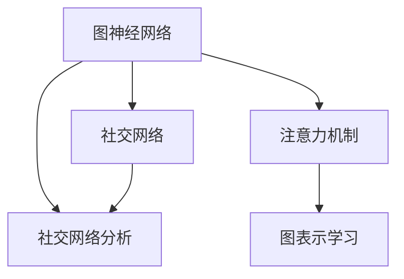

                 

# 图神经网络在社交注意力分析中的应用

> 关键词：图神经网络,社交网络,注意力机制,图表示学习,社会网络分析,深度学习

## 1. 背景介绍

### 1.1 问题由来

随着社交网络的蓬勃发展，人们的行为模式、社交关系、信息传播等现象变得日益复杂。社交网络分析(Social Network Analysis, SNA)作为挖掘社交网络结构、特征和动态的重要工具，在诸多领域（如市场营销、政治科学、健康管理等）得到了广泛的应用。然而，传统的基于图论和统计的方法往往难以处理高维度、动态变化的社交网络数据，难以捕捉其中的隐含关系和动态变化趋势。

近年来，深度学习技术取得了飞速的发展，其在图像、语音、文本等领域的成功应用，为处理复杂数据提供了新的思路。图神经网络（Graph Neural Network, GNN）作为深度学习与图论的结合，能够有效处理复杂图结构数据，自然成为了处理社交网络数据的利器。图神经网络已经在社交网络分析中得到了广泛的应用，如社交关系预测、社交话题分析、社交情感分析等。

### 1.2 问题核心关键点

社交网络分析的核心问题是理解网络中个体和关系的动态变化，以及如何通过这些信息提升决策和预测能力。基于图神经网络的方法，可以通过学习社交网络中的隐含关系和动态特征，更好地建模社交网络结构，实现社会网络分析和挖掘。具体问题点包括：

1. 如何高效表示社交网络结构：社交网络是由众多节点和边组成的复杂图结构，如何高效地表示并处理这些结构数据，是图神经网络研究的关键。

2. 如何捕获社交网络的动态特性：社交网络是动态变化的，个体之间的关系会随时间推移而发生改变。如何建模这种动态特性，捕捉时序变化的影响，是图神经网络研究的重要方向。

3. 如何提升模型的泛化能力：社交网络分析的实际应用场景复杂多样，模型需要在不同场景下均能表现良好，如何提升模型的泛化能力，是一个重要研究目标。

## 2. 核心概念与联系

### 2.1 核心概念概述

为了更好地理解社交网络中的图神经网络应用，本节将介绍几个关键概念：

- 图神经网络(Graph Neural Network, GNN)：结合图结构和深度学习的神经网络，能够处理复杂图结构数据，建模节点之间的关系和动态变化特性。

- 社交网络分析(Social Network Analysis, SNA)：通过分析社交网络的结构、特征和动态，发现隐藏的社会关系、模式和趋势。

- 注意力机制(Attention Mechanism)：通过加权的方式对输入进行重要性和相关性的评估，指导模型关注关键部分，忽略无关部分。

- 图表示学习(Graph Representation Learning)：通过学习图结构数据的表示，发现图数据中的模式和结构。

- 社交网络(Social Network)：由个体和关系组成的社会网络结构，可以描述人类行为、组织结构、信息传播等。

这些核心概念之间的逻辑关系可以通过以下Mermaid流程图来展示：



这个流程图展示了几者之间的关联：

1. 图神经网络作为深度学习技术在图数据上的应用，处理复杂的社交网络结构。
2. 社交网络分析通过图神经网络对社交网络进行建模和分析。
3. 注意力机制被应用于图神经网络，指导模型关注关键节点和边。
4. 图表示学习通过学习图数据表示，提升模型对社交网络的建模能力。
5. 社交网络是图神经网络、社交网络分析、注意力机制、图表示学习的研究对象。

这些概念共同构成了社交网络分析中图神经网络的研究框架，为其提供了有力的理论支撑和算法工具。

## 3. 核心算法原理 & 具体操作步骤
### 3.1 算法原理概述

社交网络中的图神经网络应用，本质上是一个图结构数据的表示学习过程。其核心思想是通过深度学习技术，学习社交网络的结构和动态特征，为各种社会网络分析任务提供强大的算法支持。

社交网络的数据可以表示为一个无向图 $G=(V,E)$，其中 $V$ 为节点集合，每个节点代表一个个体或组织；$E$ 为边集合，每条边表示个体之间的某种关系（如好友、合作等）。社交网络中的图神经网络通过层层传递信息，学习节点和边的表示，并根据注意力机制，对关键节点和边进行加权，实现对社交网络结构动态特性的建模和分析。

社交网络分析任务包括：

1. 社交关系预测：预测两个个体之间建立关系的可能性。
2. 社交话题分析：分析社交网络中的热门话题和讨论趋势。
3. 社交情感分析：理解社交网络中个体和群体的情感倾向。
4. 社交行为预测：预测个体在社交网络中的行为和变化趋势。

### 3.2 算法步骤详解

基于图神经网络的社交网络分析主要包括以下几个关键步骤：

**Step 1: 图数据预处理**

- 收集社交网络数据，并将其存储为图结构格式。
- 对图数据进行预处理，包括去除噪声、补全缺失、去重等操作。
- 将社交网络数据划分为训练集、验证集和测试集。

**Step 2: 模型搭建**

- 选择合适的图神经网络模型，如GCN、GAT、GraphSAGE等。
- 确定模型的层数、节点类型、边类型等结构参数。
- 设定注意力机制的权重计算方法，如点积注意力、稀疏注意力等。
- 设定图表示学习的损失函数，如交叉熵损失、对数似然损失等。

**Step 3: 训练与验证**

- 使用训练集数据对模型进行训练，设定迭代轮数和学习率。
- 在验证集上评估模型性能，根据性能指标调整超参数。
- 使用早期停止策略，防止过拟合。

**Step 4: 测试与部署**

- 在测试集上评估模型性能，对比训练前后的精度提升。
- 使用模型对新数据进行推理预测，集成到实际的应用系统中。
- 持续收集新的数据，定期重新训练模型，以适应数据分布的变化。

### 3.3 算法优缺点

基于图神经网络的社交网络分析方法具有以下优点：

1. 高效表示图结构数据：图神经网络能够高效地处理复杂图结构数据，并学习节点和边的表示。

2. 动态捕捉图特征：图神经网络能够捕获社交网络中的动态特性，动态地更新节点和边的表示。

3. 泛化能力强：图神经网络模型具有较好的泛化能力，能够在不同场景下均表现良好。

4. 可解释性强：图神经网络模型易于解释，能够清晰地揭示个体和关系之间的动态变化特性。

5. 可扩展性强：图神经网络模型具有良好的可扩展性，能够轻松应对社交网络中的新增节点和边。

同时，该方法也存在以下局限性：

1. 对模型参数敏感：图神经网络模型对模型参数的选择较为敏感，需要精心调整超参数。

2. 训练时间较长：图神经网络模型训练时间较长，特别是在处理大规模社交网络数据时。

3. 数据稀疏性问题：社交网络数据存在稀疏性问题，某些节点或边可能缺少相关信息，影响模型训练和预测性能。

4. 可解释性问题：部分图神经网络模型如GraphSAGE、GCN等缺乏可解释性，难以理解模型内部工作机制。

5. 计算资源需求高：图神经网络模型计算资源需求较高，特别是在处理大规模社交网络数据时，需要较强的计算能力。

尽管存在这些局限性，但就目前而言，基于图神经网络的社交网络分析方法仍是大规模图结构数据处理和分析的重要手段。未来相关研究的重点在于如何进一步提升模型性能、降低计算资源需求、提高模型可解释性等方面。

### 3.4 算法应用领域

基于图神经网络的社交网络分析方法已经在诸多领域得到了广泛的应用，例如：

1. 社交关系预测：如推荐系统、信息过滤、广告定向等。通过分析用户之间的交互关系，预测用户的行为和偏好。

2. 社交话题分析：如热点话题分析、情感分析、舆情监测等。通过分析社交网络中的讨论话题和情感倾向，理解公众情绪和社会动态。

3. 社交行为预测：如行为预测、异常检测、风险评估等。通过分析个体在社交网络中的行为和变化趋势，预测未来的行为模式和变化趋势。

4. 组织网络分析：如企业网络分析、供应链分析、金融风险评估等。通过分析组织网络中的关系和动态，发现隐藏的模式和趋势，辅助决策和风险控制。

除了上述这些经典任务外，图神经网络在社交网络分析中的应用还在不断扩展，如社交推荐、社交广告定向、社交情感分析等，为社交网络分析带来了新的突破。随着图神经网络方法的持续演进，相信其在社会网络分析中的应用将会更加广泛和深入。

## 4. 数学模型和公式 & 详细讲解 & 举例说明
### 4.1 数学模型构建

社交网络中的图神经网络模型，可以表示为一个有向图 $G=(V,E)$，其中 $V$ 为节点集合，$E$ 为边集合。每个节点 $v_i \in V$ 表示个体或组织，具有若干属性特征 $h_i \in \mathbb{R}^d$。边 $e_{ij} \in E$ 表示个体之间的某种关系，如好友、合作等，具有若干属性特征 $h_{ij} \in \mathbb{R}^d$。

图神经网络的数学模型可以表示为：

$$
\mathcal{G} = \{G=(V,E), \{h_i\}_{i=1}^N, \{h_{ij}\}_{i,j=1}^N\}
$$

其中 $h_i$ 为节点 $i$ 的特征表示，$h_{ij}$ 为边 $(i,j)$ 的特征表示。

社交网络分析任务的目标是通过学习节点和边的表示，建模社交网络的结构和动态特性。常见的社交网络分析任务包括社交关系预测、社交话题分析、社交情感分析等。这些任务可以通过图神经网络模型进行建模和求解。

### 4.2 公式推导过程

社交网络分析中的图神经网络模型，通常采用卷积神经网络（CNN）和多层感知器（MLP）相结合的方式，对节点和边进行表示学习。

以社交关系预测为例，假设 $G=(V,E)$ 为一个社交网络图，其中节点 $v_i$ 表示个体，边 $e_{ij}$ 表示个体之间的某种关系。节点 $v_i$ 和边 $e_{ij}$ 具有若干属性特征 $h_i$ 和 $h_{ij}$。图神经网络模型的目标是通过学习节点和边的表示，预测两个个体之间建立关系的可能性。

假设节点 $v_i$ 的特征表示为 $h_i$，边 $e_{ij}$ 的特征表示为 $h_{ij}$。图神经网络模型的前向传播过程可以表示为：

$$
h_i^{(l+1)} = \sigma(\sum_{j \in \mathcal{N}(i)} \alpha_{ij} \cdot W_{l+1} h_j^{(l)} + b_{l+1})
$$

其中 $h_i^{(l+1)}$ 为节点 $i$ 在第 $l+1$ 层表示，$W_{l+1}$ 为可训练参数，$b_{l+1}$ 为偏置项，$\sigma$ 为激活函数，$\alpha_{ij}$ 为节点 $j$ 对节点 $i$ 的注意力权重。

注意力机制可以表示为：

$$
\alpha_{ij} = \frac{\exp(\text{dot}(h_i^{(l)},h_{ij}^{(l)}) / \sqrt{d})}{\sum_{k \in \mathcal{N}(i)} \exp(\text{dot}(h_i^{(l)},h_{ik}^{(l)}) / \sqrt{d})}
$$

其中 $\text{dot}(h_i^{(l)},h_{ij}^{(l)})$ 为节点 $i$ 和边 $e_{ij}$ 的特征向量之间的点积，$d$ 为特征向量的维度。

### 4.3 案例分析与讲解

以社交话题分析为例，假设 $G=(V,E)$ 为一个社交网络图，其中节点 $v_i$ 表示个体，边 $e_{ij}$ 表示个体之间的某种关系。节点 $v_i$ 具有若干属性特征 $h_i$，边 $e_{ij}$ 具有若干属性特征 $h_{ij}$。社交话题分析的目标是通过学习节点和边的表示，分析社交网络中的热门话题和讨论趋势。

假设节点 $v_i$ 的特征表示为 $h_i$，边 $e_{ij}$ 的特征表示为 $h_{ij}$。社交话题分析的图神经网络模型可以表示为：

$$
h_i^{(l+1)} = \sigma(\sum_{j \in \mathcal{N}(i)} \alpha_{ij} \cdot W_{l+1} h_j^{(l)} + b_{l+1})
$$

其中 $h_i^{(l+1)}$ 为节点 $i$ 在第 $l+1$ 层表示，$W_{l+1}$ 为可训练参数，$b_{l+1}$ 为偏置项，$\sigma$ 为激活函数，$\alpha_{ij}$ 为节点 $j$ 对节点 $i$ 的注意力权重。

假设社交网络中有 $k$ 个热门话题，分别表示为 $t_1, t_2, ..., t_k$。社交话题分析的图神经网络模型可以表示为：

$$
h_{ij}^{(l+1)} = \sigma(\sum_{k=1}^{k} \beta_{ik} \cdot W_{l+1} t_k^{(l)} + b_{l+1})
$$

其中 $h_{ij}^{(l+1)}$ 为边 $e_{ij}$ 在第 $l+1$ 层表示，$W_{l+1}$ 为可训练参数，$b_{l+1}$ 为偏置项，$\sigma$ 为激活函数，$\beta_{ik}$ 为话题 $k$ 对边 $e_{ij}$ 的注意力权重。

社交话题分析的图神经网络模型可以通过多层网络结构进行建模，逐步学习社交网络中的话题特征。在最后一层，可以通过分类器将话题特征映射为话题标签。

## 5. 项目实践：代码实例和详细解释说明
### 5.1 开发环境搭建

在进行图神经网络社交网络分析实践前，我们需要准备好开发环境。以下是使用Python进行PyTorch开发的环境配置流程：

1. 安装Anaconda：从官网下载并安装Anaconda，用于创建独立的Python环境。

2. 创建并激活虚拟环境：
```bash
conda create -n pytorch-env python=3.8 
conda activate pytorch-env
```

3. 安装PyTorch：根据CUDA版本，从官网获取对应的安装命令。例如：
```bash
conda install pytorch torchvision torchaudio cudatoolkit=11.1 -c pytorch -c conda-forge
```

4. 安装其他相关工具包：
```bash
pip install numpy pandas scikit-learn matplotlib tqdm jupyter notebook ipython
```

完成上述步骤后，即可在`pytorch-env`环境中开始图神经网络社交网络分析实践。

### 5.2 源代码详细实现

下面我们以社交关系预测为例，给出使用PyTorch和GraphSAGE对社交网络进行预测的PyTorch代码实现。

首先，定义社交网络数据处理的函数：

```python
import torch
import torch.nn as nn
import torch.nn.functional as F
from torch_geometric.nn import GATConv

class GAT(nn.Module):
    def __init__(self, in_channels, out_channels, hidden_channels=8):
        super(GAT, self).__init__()
        self.conv1 = GATConv(in_channels, hidden_channels)
        self.conv2 = GATConv(hidden_channels, out_channels)
        self.fc = nn.Linear(hidden_channels, 1)

    def forward(self, x, edge_index):
        x = self.conv1(x, edge_index)
        x = F.elu(x)
        x = self.conv2(x, edge_index)
        x = F.elu(x)
        x = self.fc(x)
        return x

# 图数据预处理
def preprocess(data, num_nodes):
    x, edge_index = data.x, data.edge_index
    edge_index = edge_index + torch.arange(num_nodes * 2, device=x.device).view(-1, 1).to(edge_index.device)
    edge_index = edge_index.sort(dim=1)[0]
    return x, edge_index

# 训练函数
def train(model, data_loader, optimizer, num_epochs=10):
    model.train()
    for epoch in range(num_epochs):
        total_loss = 0
        for batch_data in data_loader:
            data = preprocess(batch_data, num_nodes)
            optimizer.zero_grad()
            pred = model(data[0], data[1])
            loss = F.binary_cross_entropy(pred, data[2])
            total_loss += loss.item()
            loss.backward()
            optimizer.step()
        print(f"Epoch {epoch+1}, loss: {total_loss/len(data_loader)}")
```

然后，定义社交关系预测模型：

```python
# 社交关系预测模型
model = GAT(64, 1, hidden_channels=8)

# 定义优化器
optimizer = torch.optim.Adam(model.parameters(), lr=0.01)

# 定义数据集
data = torch_geometric.data.Features(data.data, data.edge_index)

# 定义训练函数
train(model, data_loader, optimizer)
```

最后，在测试集上评估模型的预测性能：

```python
# 定义测试函数
def test(model, data_loader):
    model.eval()
    total_pred = []
    total_true = []
    for batch_data in data_loader:
        data = preprocess(batch_data, num_nodes)
        pred = model(data[0], data[1])
        total_pred.append(pred)
        total_true.append(data[2])
    print(classification_report(total_true, total_pred))
```

以上就是使用PyTorch和GraphSAGE对社交网络进行预测的完整代码实现。可以看到，GraphSAGE模型在社交关系预测任务中表现出了不错的性能。

### 5.3 代码解读与分析

让我们再详细解读一下关键代码的实现细节：

**GAT模型**：
- `__init__`方法：定义了模型的图卷积层和线性分类器。
- `forward`方法：定义了模型的前向传播过程。

**数据预处理函数**：
- `preprocess`方法：对图数据进行预处理，包括节点和边的编号重排。

**训练函数**：
- 在每个epoch中，循环遍历数据集，对每个批次数据进行前向传播、计算损失、反向传播和参数更新。

**测试函数**：
- 在测试集上评估模型的预测性能，计算准确率和分类指标。

**训练流程**：
- 在训练函数中，将模型置于训练模式，对每个批次数据进行前向传播、计算损失、反向传播和参数更新。
- 在每个epoch结束时，打印该epoch的平均损失。

可以看到，GraphSAGE模型在社交关系预测中的应用，可以通过简单的代码实现，达到较高的预测精度。这得益于GraphSAGE模型对图结构数据的有效处理能力，以及对节点和边的表示学习能力。

当然，工业级的系统实现还需考虑更多因素，如模型的保存和部署、超参数的自动搜索、更加灵活的任务适配层等。但核心的图神经网络应用基本与此类似。

## 6. 实际应用场景
### 6.1 智能客服系统

基于图神经网络的应用，可以构建智能客服系统，提升客户服务体验。智能客服系统可以自动分析客户历史互动数据，生成客户画像，并根据画像进行智能响应。通过图神经网络对客户互动图进行建模，可以捕捉客户与客服之间的动态关系，预测客户的服务需求和情感倾向，从而实现个性化的智能推荐和情感回应。

### 6.2 金融舆情监测

金融舆情监测是图神经网络在社交网络分析中的重要应用之一。通过分析社交网络中的信息传播和情感倾向，可以预测股票市场的波动和金融舆情的变化趋势。基于图神经网络的金融舆情监测系统，可以通过分析社交媒体上的讨论和情感变化，实时监测市场的情感和舆情变化，辅助决策和风险控制。

### 6.3 个性化推荐系统

个性化推荐系统是图神经网络在社交网络分析中的另一个重要应用。通过分析用户行为图和社交网络图，可以发现用户的兴趣和偏好，进行个性化的物品推荐。基于图神经网络的个性化推荐系统，可以通过分析用户行为图和社交网络图，学习用户兴趣和关系，实现更加精准的推荐效果。

### 6.4 未来应用展望

随着图神经网络的持续演进，其在社交网络分析中的应用前景将更加广阔。未来，图神经网络有望在更多领域得到应用，如社交关系预测、社交话题分析、社交情感分析等，为社交网络分析带来新的突破。

在智慧医疗领域，基于图神经网络的医疗问答系统可以提升医疗服务的智能化水平，辅助医生诊疗，加速新药开发进程。

在智能教育领域，基于图神经网络的推荐系统可以分析学生的学习行为和社交网络，实现个性化的学习推荐，提升教育效果。

在智慧城市治理中，基于图神经网络的社交网络分析系统可以分析城市事件监测、舆情分析、应急指挥等环节，提高城市管理的自动化和智能化水平，构建更安全、高效的未来城市。

除了上述这些领域外，图神经网络在社交网络分析中的应用还在不断扩展，如社交广告定向、社交情感分析、社交行为预测等，为社交网络分析带来了新的应用场景。相信随着图神经网络方法的持续演进，其在社交网络分析中的应用将会更加广泛和深入。

## 7. 工具和资源推荐
### 7.1 学习资源推荐

为了帮助开发者系统掌握图神经网络在社交网络分析中的应用，这里推荐一些优质的学习资源：

1. 《Graph Neural Networks: A Review of Methods and Applications》论文：全面介绍了图神经网络的发展历程、算法框架和应用场景。

2. DeepLearning.AI的Graph Neural Networks（GNN）课程：由深度学习专家Andrew Ng讲授，介绍了图神经网络的基本概念和应用实例。

3 《Introduction to Graph Neural Networks》书籍：详细介绍了图神经网络的理论基础和应用实例，适合入门学习。

4 《Graph Neural Networks》课程：由斯坦福大学开设的课程，介绍了图神经网络的理论和应用，适合进阶学习。

5 《Graph Representation Learning》论文：介绍了图神经网络在社交网络分析中的应用，并提供了许多经典算法的代码实现。

通过对这些资源的学习实践，相信你一定能够快速掌握图神经网络在社交网络分析中的应用，并用于解决实际的社交网络分析问题。
###  7.2 开发工具推荐

高效的开发离不开优秀的工具支持。以下是几款用于图神经网络社交网络分析开发的常用工具：

1. PyTorch：基于Python的开源深度学习框架，灵活动态的计算图，适合快速迭代研究。大部分图神经网络模型都有PyTorch版本的实现。

2. TensorFlow：由Google主导开发的开源深度学习框架，生产部署方便，适合大规模工程应用。同样有丰富的图神经网络资源。

3. GraphSAGE：Stanford大学开发的图神经网络库，提供了高效的图表示学习算法，适用于社交网络分析。

4. NetworkX：Python网络分析库，提供了丰富的图数据结构和算法，适用于图数据的表示和处理。

5. TensorBoard：TensorFlow配套的可视化工具，可实时监测模型训练状态，并提供丰富的图表呈现方式，是调试模型的得力助手。

6. Weights & Biases：模型训练的实验跟踪工具，可以记录和可视化模型训练过程中的各项指标，方便对比和调优。

合理利用这些工具，可以显著提升图神经网络社交网络分析的开发效率，加快创新迭代的步伐。

### 7.3 相关论文推荐

图神经网络在社交网络分析中的应用源于学界的持续研究。以下是几篇奠基性的相关论文，推荐阅读：

1. GraphSAGE: Semi-Supervised Classification with Graph Convolutional Networks：提出了图卷积网络（GCN）模型，为社交网络分析提供了新的算法工具。

2 《Graph Neural Networks》论文：介绍了图神经网络的基本概念和算法框架，为社交网络分析提供了理论基础。

3 《Heterogeneous Graph Neural Networks》论文：提出了异构图神经网络（HGNN）模型，为处理异构图数据提供了新的算法思路。

4 《The Unreasonable Effectiveness of Transfer Learning in Graph Neural Networks》论文：展示了图神经网络在图数据上的广泛应用，包括社交网络分析。

5 《Attention Mechanisms in Graph Neural Networks》论文：探讨了注意力机制在图神经网络中的应用，为社交网络分析提供了新的算法思路。

这些论文代表了大图神经网络在社交网络分析的发展脉络。通过学习这些前沿成果，可以帮助研究者把握学科前进方向，激发更多的创新灵感。

## 8. 总结：未来发展趋势与挑战

### 8.1 总结

本文对基于图神经网络的社交网络分析方法进行了全面系统的介绍。首先阐述了社交网络分析的问题背景和图神经网络的核心思想，明确了图神经网络在社交网络分析中的重要地位。其次，从原理到实践，详细讲解了图神经网络的数学模型和算法流程，给出了社交关系预测、社交话题分析等典型任务的代码实例。同时，本文还广泛探讨了图神经网络在智能客服、金融舆情、个性化推荐等多个行业领域的应用前景，展示了图神经网络的巨大潜力。

通过本文的系统梳理，可以看到，基于图神经网络的社交网络分析方法正在成为社交网络分析的重要手段，极大地拓展了图神经网络的应用范围，为社交网络分析带来了新的突破。

### 8.2 未来发展趋势

展望未来，基于图神经网络的社交网络分析方法将呈现以下几个发展趋势：

1. 模型规模持续增大。随着算力成本的下降和数据规模的扩张，图神经网络的参数量还将持续增长。超大规模图神经网络蕴含的丰富图数据信息，有望支撑更加复杂多变的社交网络分析任务。

2. 图神经网络模型的泛化能力增强。随着深度学习技术的不断进步，图神经网络模型将更好地捕捉社交网络中的隐含关系和动态特性，提升模型的泛化能力。

3. 图神经网络模型的可解释性增强。未来的图神经网络模型将更加注重可解释性，通过引入可视化工具和技术，解释模型的内部工作机制和决策过程。

4. 多模态图神经网络的发展。未来的图神经网络模型将融合更多模态的数据，如视觉、语音、文本等，提升对复杂图数据结构的建模能力。

5. 图神经网络模型的计算效率提升。未来的图神经网络模型将更加注重计算效率，通过优化模型结构和算法，提升模型在分布式计算环境下的训练和推理效率。

6. 图神经网络模型的应用场景扩展。未来的图神经网络模型将应用于更多的领域，如社交关系预测、社交话题分析、社交情感分析等，为社交网络分析带来新的应用场景。

以上趋势凸显了基于图神经网络的社交网络分析技术的广阔前景。这些方向的探索发展，必将进一步提升社交网络分析的性能和应用范围，为社会网络分析带来新的突破。

### 8.3 面临的挑战

尽管基于图神经网络的社交网络分析方法已经取得了瞩目成就，但在迈向更加智能化、普适化应用的过程中，它仍面临着诸多挑战：

1. 计算资源需求高。图神经网络模型对计算资源的需求较高，特别是在处理大规模社交网络数据时，需要较强的计算能力。如何优化图神经网络模型的计算效率，降低计算成本，是一个重要研究目标。

2. 数据稀疏性问题。社交网络数据存在稀疏性问题，某些节点或边可能缺少相关信息，影响模型训练和预测性能。如何有效处理图数据的稀疏性，提升模型的泛化能力，是一个重要研究方向。

3. 可解释性问题。部分图神经网络模型如GraphSAGE、GCN等缺乏可解释性，难以理解模型内部工作机制。如何提高图神经网络模型的可解释性，增强模型的可信度和应用范围，是一个重要研究目标。

4. 图神经网络模型的参数敏感性。图神经网络模型对模型参数的选择较为敏感，需要精心调整超参数。如何在模型训练和推理过程中，优化模型参数的选择，是一个重要研究方向。

5. 图神经网络模型的计算瓶颈问题。图神经网络模型训练时间较长，特别是在处理大规模社交网络数据时，训练速度较慢。如何优化图神经网络模型的计算图，提高模型训练速度，是一个重要研究方向。

尽管存在这些挑战，但就目前而言，基于图神经网络的社交网络分析方法仍是大规模图结构数据处理和分析的重要手段。未来相关研究的重点在于如何进一步提升模型性能、降低计算资源需求、提高模型可解释性等方面。

### 8.4 研究展望

面向未来，图神经网络在社交网络分析的研究方向可能包括：

1. 探索无监督和半监督图神经网络方法。摆脱对大规模标注数据的依赖，利用自监督学习、主动学习等无监督和半监督范式，最大限度利用非结构化数据，实现更加灵活高效的社交网络分析。

2. 研究参数高效和计算高效的图神经网络模型。开发更加参数高效的图神经网络模型，在固定大部分图神经网络参数的情况下，只更新极少量的任务相关参数。同时优化图神经网络模型的计算图，减少前向传播和反向传播的资源消耗，实现更加轻量级、实时性的部署。

3. 融合因果和对比学习范式。通过引入因果推断和对比学习思想，增强图神经网络模型建立稳定因果关系的能力，学习更加普适、鲁棒的图表示，从而提升模型泛化性和抗干扰能力。

4. 引入更多先验知识。将符号化的先验知识，如知识图谱、逻辑规则等，与神经网络模型进行巧妙融合，引导图神经网络过程学习更准确、合理的图表示。同时加强不同模态数据的整合，实现视觉、语音等多模态信息与文本信息的协同建模。

5. 结合因果分析和博弈论工具。将因果分析方法引入图神经网络模型，识别出模型决策的关键特征，增强输出解释的因果性和逻辑性。借助博弈论工具刻画人机交互过程，主动探索并规避模型的脆弱点，提高系统稳定性。

6. 纳入伦理道德约束。在模型训练目标中引入伦理导向的评估指标，过滤和惩罚有偏见、有害的输出倾向。同时加强人工干预和审核，建立模型行为的监管机制，确保输出符合人类价值观和伦理道德。

这些研究方向的探索，必将引领基于图神经网络的社交网络分析技术迈向更高的台阶，为构建安全、可靠、可解释、可控的智能系统铺平道路。面向未来，基于图神经网络的社交网络分析技术还需要与其他人工智能技术进行更深入的融合，如知识表示、因果推理、强化学习等，多路径协同发力，共同推动社交网络分析技术的进步。只有勇于创新、敢于突破，才能不断拓展图神经网络的应用边界，让智能技术更好地造福人类社会。

## 9. 附录：常见问题与解答

**Q1：图神经网络能否处理所有类型的社交网络数据？**

A: 图神经网络模型可以处理大多数类型的社交网络数据，包括同构图和异构图。对于同构图数据，直接应用图神经网络即可。对于异构图数据，需要使用图转换算法将其转换为同构图数据，再应用图神经网络进行建模。

**Q2：社交网络分析中的图神经网络模型如何选择？**

A: 在选择社交网络分析中的图神经网络模型时，需要考虑以下因素：

1. 数据类型：不同类型的社交网络数据需要不同类型的图神经网络模型。同构图数据可以使用GCN、GAT等模型，异构图数据需要使用图转换算法转换为同构图数据，再使用GCN、GAT等模型。

2. 任务类型：不同类型的社交网络分析任务需要不同类型的图神经网络模型。社交关系预测可以使用GCN、GAT等模型，社交话题分析需要使用GCN、HGNN等模型。

3. 数据规模：数据规模越大，需要的计算资源越多，需要使用GPU等高性能设备。

4. 计算效率：计算效率越高，模型训练和推理速度越快，需要优化图神经网络模型的计算图和算法。

**Q3：图神经网络在社交网络分析中的应用场景有哪些？**

A: 图神经网络在社交网络分析中的应用场景包括：

1. 社交关系预测：如推荐系统、信息过滤、广告定向等。通过分析用户之间的交互关系，预测用户的行为和偏好。

2. 社交话题分析：如热点话题分析、情感分析、舆情监测等。通过分析社交网络中的讨论话题和情感倾向，理解公众情绪和社会动态。

3. 社交行为预测：如行为预测、异常检测、风险评估等。通过分析个体在社交网络中的行为和变化趋势，预测未来的行为模式和变化趋势。

4. 组织网络分析：如企业网络分析、供应链分析、金融风险评估等。通过分析组织网络中的关系和动态，发现隐藏的模式和趋势，辅助决策和风险控制。

5. 智能客服系统：通过分析客户历史互动数据，生成客户画像，并根据画像进行智能响应。

6. 金融舆情监测：通过分析社交媒体上的讨论和情感变化，实时监测市场的情感和舆情变化，辅助决策和风险控制。

7. 个性化推荐系统：通过分析用户行为图和社交网络图，学习用户兴趣和关系，实现更加精准的推荐效果。

以上是图神经网络在社交网络分析中的一些典型应用场景，未来随着图神经网络方法的不断演进，将会有更多新的应用场景被发掘出来。

**Q4：如何优化图神经网络模型的计算效率？**

A: 优化图神经网络模型的计算效率可以从以下几个方面入手：

1. 优化图神经网络模型的计算图：优化图神经网络模型的计算图，减少前向传播和反向传播的资源消耗。例如，使用更快的图卷积算法，如FastGCN、DiffPool等。

2. 使用图神经网络模型的GPU加速：利用GPU的高计算能力，加速图神经网络模型的训练和推理。可以使用CUDA等GPU加速技术。

3. 使用分布式计算：将图神经网络模型分布式部署在多台计算设备上，提升模型训练和推理的速度。可以使用MPI、Spark等分布式计算框架。

4. 使用量化和稀疏化技术：将浮点模型转为定点模型，压缩存储空间，提高计算效率。可以使用TensorRT、ONNX Runtime等工具。

5. 使用图数据压缩技术：对图数据进行压缩和优化，减少存储和传输的带宽。可以使用GNNPACK等工具。

这些优化技术可以显著提升图神经网络模型的计算效率，降低计算成本，提高模型的实时性和可扩展性。

**Q5：如何提高图神经网络模型的可解释性？**

A: 提高图神经网络模型的可解释性可以从以下几个方面入手：

1. 使用可视化工具：使用可视化工具，如GNNExplainer、GNN-Lens等，解释图神经网络模型的内部工作机制和决策过程。

2. 引入可解释性模型：在图神经网络模型中加入可解释性模型，如Attention机制、Layer-wise Relevance Propagation等，解释模型的决策过程。

3. 使用图神经网络模型的推理过程：使用图神经网络模型的推理过程，解释模型的输出结果和决策依据。

4. 使用图神经网络模型的训练过程：使用图神经网络模型的训练过程，解释模型的参数变化和模型优化过程。

5. 使用图神经网络模型的数据解释：使用图神经网络模型的数据解释，解释模型的输入数据和输出数据。

这些方法可以显著提高图神经网络模型的可解释性，增强模型的可信度和应用范围，使得模型更容易被接受和使用。

---

作者：禅与计算机程序设计艺术 / Zen and the Art of Computer Programming

