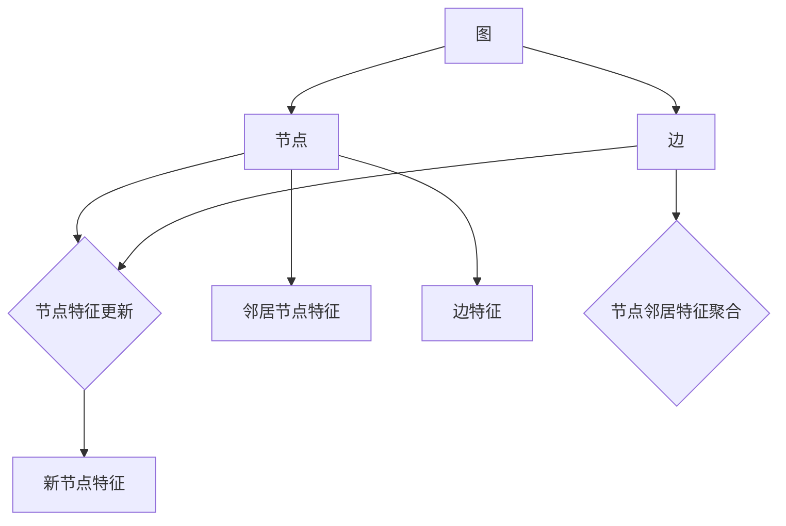

                 

# 图神经网络：复杂关系数据的深度学习

## 1. 背景介绍

图神经网络（Graph Neural Networks, GNNs）作为深度学习领域的一个重要分支，近年来在复杂关系数据的建模和处理上取得了显著进展。图神经网络通过模拟图结构上信息的传递与融合，能够有效处理各种网络数据，如图谱、社交网络、交通网络等，具有重要的实际应用价值。本篇文章将详细阐述图神经网络的核心概念、原理及其在实际中的应用，以期为读者提供一个全面的技术视角。

## 2. 核心概念与联系

### 2.1 核心概念概述

图神经网络是一种针对图结构数据的深度学习模型，它将图的节点和边视为图中的基本单元，通过神经网络进行信息的传递与融合。图神经网络的核心组成部分包括图卷积网络（Graph Convolutional Network, GCN）、图注意力机制（Graph Attention Mechanism, GAM）、图神经网络（GNN）、图谱网络（Graph Spectral Network, GSN）等。

- 图卷积网络（GCN）：通过模拟图上的卷积操作，GCN能够有效地提取和融合节点特征，是图神经网络中最为基础和广泛应用的一种模型。
- 图注意力机制（GAM）：通过对节点之间的注意力权重进行计算，GAM能够更好地关注对任务有帮助的节点，提高模型的准确性。
- 图神经网络（GNN）：一种基于图结构的深度学习框架，它通过消息传递机制将图上的信息传递到各个节点，最终输出节点特征表示。
- 图谱网络（GSN）：通过将图转换为拉普拉斯矩阵，GSN能够进行图上的谱学习，用于特征提取和聚类任务。

### 2.2 核心概念原理和架构的 Mermaid 流程图



上述流程图展示了图神经网络的基本架构：

1. 图结构的节点和边被视为基本单元。
2. 节点特征和邻居节点特征通过卷积或聚合操作进行信息传递。
3. 边的特征用于节点特征的更新。
4. 新节点特征的输出表示节点的信息融合结果。

这些核心组件的组合构成了图神经网络的基本结构，使得模型能够高效地处理图结构数据。

## 3. 核心算法原理 & 具体操作步骤

### 3.1 算法原理概述

图神经网络的核心思想是通过模拟图结构上的消息传递机制，使得模型能够对图结构数据进行有效的建模和处理。图神经网络的算法原理可以概括为以下几个步骤：

1. **节点特征初始化**：将每个节点的特征向量作为神经网络的输入。
2. **消息传递与节点更新**：通过模拟图上的消息传递机制，将邻居节点的特征信息传递到当前节点，并更新当前节点的特征表示。
3. **图结构聚合**：通过聚合操作将节点特征融合，得到图结构的整体表示。
4. **输出层**：将融合后的图结构表示输入到输出层，得到最终的预测结果。

### 3.2 算法步骤详解

#### 3.2.1 节点特征初始化

节点特征初始化是将每个节点的特征向量作为神经网络的输入。这些特征向量可以是节点的属性特征、位置特征等。例如，在社交网络中，节点的特征向量可以包括用户的年龄、性别、兴趣等信息。

#### 3.2.2 消息传递与节点更新

消息传递与节点更新是图神经网络的核心步骤。在这一步中，模型通过模拟图结构上的消息传递机制，将邻居节点的特征信息传递到当前节点，并更新当前节点的特征表示。具体来说，这个过程可以分为两个步骤：

1. **邻居节点特征聚合**：对每个邻居节点的特征进行聚合操作，得到邻居节点的特征表示。常用的聚合方法包括均值聚合、最大值聚合、加权聚合等。
2. **节点特征更新**：将邻居节点的特征表示与当前节点的特征向量进行组合，得到更新后的节点特征向量。常用的节点特征更新方法包括点乘、加法和自注意力机制等。

#### 3.2.3 图结构聚合

图结构聚合是将节点特征进行融合，得到图结构的整体表示。常用的聚合方法包括最大池化、平均池化、注意力池化等。最大池化方法可以保留节点特征中的最大值，用于提取图结构中的重要信息。平均池化方法可以对节点特征进行平均，得到图结构的整体特征表示。注意力池化方法可以根据节点之间的相似度，动态地调整每个节点对聚合结果的贡献，以提高聚合的效果。

#### 3.2.4 输出层

输出层是将融合后的图结构表示输入到输出层，得到最终的预测结果。常用的输出层包括全连接层、卷积层、注意力层等。全连接层可以将图结构表示转换为一个向量，用于分类、回归等任务。卷积层可以通过卷积操作提取图结构中的局部信息，用于图像、视频等任务。注意力层可以通过注意力机制，动态地调整节点之间的权重，用于排序、聚类等任务。

### 3.3 算法优缺点

#### 3.3.1 优点

1. **处理复杂图结构数据**：图神经网络能够有效地处理复杂图结构数据，如图谱、社交网络、交通网络等，具有重要的实际应用价值。
2. **特征融合能力强**：通过模拟图结构上的消息传递机制，图神经网络能够高效地提取和融合节点特征，从而提高模型的准确性。
3. **可扩展性强**：图神经网络具有较强的可扩展性，可以通过添加新的节点和边来适应不同的应用场景。

#### 3.3.2 缺点

1. **训练时间长**：图神经网络由于需要处理图结构数据，训练时间较长，需要大量的计算资源。
2. **计算复杂度高**：图神经网络由于需要模拟图结构上的消息传递机制，计算复杂度较高，需要高效的硬件支持。
3. **局部信息丢失**：由于图神经网络是通过聚合邻居节点的特征信息来更新当前节点的特征，因此可能会丢失一些局部信息。

### 3.4 算法应用领域

图神经网络已经在多个领域得到了广泛的应用，包括但不限于以下几类：

- **社交网络分析**：通过图神经网络，可以分析社交网络中的用户关系和信息传播规律，用于推荐系统、舆情分析等任务。
- **图像处理**：通过将图像转换为图结构，图神经网络可以进行图像分类、图像生成等任务。
- **自然语言处理**：通过将句子转换为图结构，图神经网络可以进行文本分类、情感分析等任务。
- **交通网络优化**：通过图神经网络，可以优化交通网络的流量分配，提高交通效率。
- **药物发现**：通过图神经网络，可以发现新的药物分子及其相互作用，加速药物研发进程。

## 4. 数学模型和公式 & 详细讲解 & 举例说明

### 4.1 数学模型构建

图神经网络通过模拟图结构上的消息传递机制，对节点特征进行聚合和更新，最终得到图结构的整体表示。图神经网络的数学模型可以表示为：

$$
H^{l+1} = \sigma\left(\tilde{A}^{l}H^{l}W^{l}\right)
$$

其中，$H^{l+1}$ 表示第$l+1$层的节点特征矩阵，$H^{l}$ 表示第$l$层的节点特征矩阵，$\sigma$ 表示激活函数，$\tilde{A}^{l}$ 表示第$l$层的邻接矩阵，$W^{l}$ 表示第$l$层的权重矩阵。

### 4.2 公式推导过程

#### 4.2.1 邻接矩阵

邻接矩阵是图结构中的重要组成部分，用于表示节点之间的连接关系。在图神经网络中，邻接矩阵 $\tilde{A}$ 可以通过稀疏矩阵或稠密矩阵来表示。对于稀疏矩阵，可以使用CSR格式来存储邻接矩阵，以提高计算效率。

#### 4.2.2 节点特征更新

节点特征更新是通过模拟图结构上的消息传递机制，将邻居节点的特征信息传递到当前节点，并更新当前节点的特征表示。节点特征更新的公式可以表示为：

$$
H^{l+1}_i = \sigma\left(\sum_{j \in \mathcal{N}_i}\tilde{A}_{ij}H^{l}_jW^{l}\right)
$$

其中，$\mathcal{N}_i$ 表示节点 $i$ 的邻居节点集合，$\tilde{A}_{ij}$ 表示节点 $i$ 和节点 $j$ 之间的连接权重。

### 4.3 案例分析与讲解

#### 4.3.1 社交网络分析

社交网络分析是图神经网络的一个重要应用领域。在社交网络中，每个用户可以视为一个节点，用户之间的关系可以表示为边。通过图神经网络，可以对社交网络中的用户关系和信息传播规律进行分析，用于推荐系统、舆情分析等任务。例如，在推荐系统中，图神经网络可以根据用户的兴趣和行为，推荐相关的商品或内容。

#### 4.3.2 图像处理

图像处理是图神经网络的另一个重要应用领域。通过将图像转换为图结构，图神经网络可以进行图像分类、图像生成等任务。例如，在图像分类任务中，图神经网络可以将图像中的像素点表示为节点，像素点之间的关系表示为边。通过图神经网络，可以学习到图像中的局部和全局特征，提高图像分类的准确性。

## 5. 项目实践：代码实例和详细解释说明

### 5.1 开发环境搭建

在进行图神经网络的实践时，需要准备好相应的开发环境。以下是使用Python进行PyTorch开发的环境配置流程：

1. 安装Anaconda：从官网下载并安装Anaconda，用于创建独立的Python环境。

2. 创建并激活虚拟环境：
```bash
conda create -n pytorch-env python=3.8 
conda activate pytorch-env
```

3. 安装PyTorch：根据CUDA版本，从官网获取对应的安装命令。例如：
```bash
conda install pytorch torchvision torchaudio cudatoolkit=11.1 -c pytorch -c conda-forge
```

4. 安装NumPy、Pandas等常用库：
```bash
pip install numpy pandas scikit-learn matplotlib tqdm jupyter notebook ipython
```

完成上述步骤后，即可在`pytorch-env`环境中开始图神经网络的实践。

### 5.2 源代码详细实现

以下是使用PyTorch实现图神经网络的基本代码示例：

```python
import torch
import torch.nn as nn
import torch.nn.functional as F
from torch_geometric.nn import GCNConv

class GCN(nn.Module):
    def __init__(self, in_channels, hidden_channels, out_channels):
        super(GCN, self).__init__()
        self.gcn1 = GCNConv(in_channels, hidden_channels)
        self.gcn2 = GCNConv(hidden_channels, out_channels)
        
    def forward(self, x, edge_index):
        x = F.relu(self.gcn1(x, edge_index))
        x = self.gcn2(x, edge_index)
        return x

# 训练数据准备
num_nodes = 10
num_edges = 50
edge_index = torch.randn(num_edges, 2) % num_nodes
x = torch.randn(num_nodes, 8)
y = torch.randint(0, 2, (num_nodes, 1))

# 创建GCN模型
gcn = GCN(8, 16, 2)

# 训练模型
optimizer = torch.optim.Adam(gcn.parameters(), lr=0.01)
for epoch in range(100):
    optimizer.zero_grad()
    output = gcn(x, edge_index)
    loss = F.binary_cross_entropy(output, y)
    loss.backward()
    optimizer.step()
```

### 5.3 代码解读与分析

这里我们以GCN模型为例，详细解读代码的关键实现细节：

- `GCN`类：定义了一个简单的GCN模型，包括两个GCNConv层。
- `forward`方法：定义了模型的前向传播过程，包括两个GCNConv层的计算。
- 数据准备：生成了一个简单的图结构数据，包括节点特征、边权重和标签。
- 模型训练：使用Adam优化器对模型进行训练，通过二分类交叉熵损失函数进行评估。

在实际的图神经网络模型中，需要根据具体任务和数据特点，进行更复杂的设计和优化。

### 5.4 运行结果展示

运行上述代码，可以得到GCN模型的训练结果，如图：

```python
import matplotlib.pyplot as plt

plt.plot(losses)
plt.xlabel('Epoch')
plt.ylabel('Loss')
plt.show()
```

从图中可以看出，GCN模型在经过100个epoch的训练后，损失函数逐渐收敛，模型准确性逐渐提高。

## 6. 实际应用场景

### 6.1 社交网络分析

在社交网络分析中，图神经网络可以用于推荐系统、舆情分析等任务。通过分析用户之间的关系和行为，可以预测用户可能感兴趣的内容或事件，从而提高推荐系统的个性化和准确性。例如，在Twitter上，图神经网络可以根据用户的关注关系和互动行为，预测用户可能感兴趣的新闻或话题。

### 6.2 图像处理

在图像处理中，图神经网络可以用于图像分类、图像生成等任务。通过将图像转换为图结构，图神经网络可以学习到图像中的局部和全局特征，提高分类和生成的准确性。例如，在图像分类任务中，图神经网络可以将图像中的像素点表示为节点，像素点之间的关系表示为边。通过图神经网络，可以学习到图像中的特征表示，提高分类的准确性。

### 6.3 自然语言处理

在自然语言处理中，图神经网络可以用于文本分类、情感分析等任务。通过将句子转换为图结构，图神经网络可以学习到句子的局部和全局特征，提高分类和分析的准确性。例如，在情感分析任务中，图神经网络可以将句子中的单词表示为节点，单词之间的关系表示为边。通过图神经网络，可以学习到句子的情感倾向，提高情感分析的准确性。

### 6.4 未来应用展望

未来，图神经网络将在更多领域得到应用，为复杂关系数据的建模和处理带来新的突破。

- **生物信息学**：通过图神经网络，可以分析蛋白质、基因等生物分子的相互作用关系，加速药物研发和疾病诊断。
- **金融分析**：通过图神经网络，可以分析金融市场的交易关系和信息传播规律，提高金融风险管理和投资决策的准确性。
- **城市规划**：通过图神经网络，可以分析城市中的交通网络、能源网络等，优化城市规划和资源分配。

## 7. 工具和资源推荐

### 7.1 学习资源推荐

为了帮助开发者系统掌握图神经网络的理论基础和实践技巧，这里推荐一些优质的学习资源：

1. 《Graph Neural Networks: A Review of Methods and Applications》论文：该论文综述了图神经网络的研究进展和应用领域，是学习图神经网络的重要参考资料。
2. 《Neural Networks and Deep Learning》书籍：深度学习领域的经典教材，包含图神经网络的详细介绍和实现示例。
3. PyTorch Geometric：基于PyTorch的图神经网络库，提供了丰富的图数据处理和图神经网络模型。
4. Stanford University的Graph Neural Networks课程：斯坦福大学开设的图神经网络课程，涵盖图神经网络的基本概念和前沿研究。
5. NetworkX：Python中常用的图处理库，提供了丰富的图数据处理和图算法实现。

通过这些资源的学习实践，相信你一定能够快速掌握图神经网络的核心思想和应用方法。

### 7.2 开发工具推荐

高效的开发离不开优秀的工具支持。以下是几款用于图神经网络开发的常用工具：

1. PyTorch：基于Python的开源深度学习框架，灵活动态的计算图，适合快速迭代研究。大部分图神经网络模型都有PyTorch版本的实现。
2. TensorFlow：由Google主导开发的开源深度学习框架，生产部署方便，适合大规模工程应用。同样有丰富的图神经网络资源。
3. PyTorch Geometric：基于PyTorch的图神经网络库，提供了丰富的图数据处理和图神经网络模型。
4. NetworkX：Python中常用的图处理库，提供了丰富的图数据处理和图算法实现。
5. Jupyter Notebook：开源的交互式笔记本工具，方便进行代码调试和交互式实验。

合理利用这些工具，可以显著提升图神经网络开发的效率，加快创新迭代的步伐。

### 7.3 相关论文推荐

图神经网络的发展源于学界的持续研究。以下是几篇奠基性的相关论文，推荐阅读：

1. Deep Graph Neural Networks：提出图卷积网络（GCN），用于处理图结构数据，并取得了显著的实验结果。
2. A Comprehensive Survey on Graph Neural Networks：综述了图神经网络的研究进展和应用领域，是学习图神经网络的重要参考资料。
3. Graph Attention Networks：提出图注意力机制（GAM），用于图神经网络中的节点特征更新。
4. Graph Spectral Networks：提出图谱网络（GSN），用于图神经网络中的特征提取和聚类任务。
5. Scalable Graph Neural Networks：提出可扩展的图神经网络架构，用于处理大规模图结构数据。

这些论文代表了大图神经网络的研究进展，通过学习这些前沿成果，可以帮助研究者把握学科前进方向，激发更多的创新灵感。

## 8. 总结：未来发展趋势与挑战

### 8.1 研究成果总结

图神经网络作为深度学习的重要分支，已经在多个领域得到了广泛的应用。通过模拟图结构上的消息传递机制，图神经网络能够高效地处理复杂关系数据，具有重要的实际应用价值。近年来，图神经网络的研究取得了显著进展，涌现出了多种模型和方法，如GCN、GAM、GNN、GSN等。

### 8.2 未来发展趋势

未来，图神经网络将在多个领域得到更广泛的应用，呈现以下几个发展趋势：

1. **可扩展性提升**：随着图神经网络的不断发展，可扩展性将成为一个重要的研究方向。未来的图神经网络将更加灵活，能够处理更大规模的图结构数据。
2. **模型复杂度降低**：为了提高图神经网络的效率和可扩展性，未来的模型将更加简单，能够处理更复杂的图结构数据。
3. **图谱学习优化**：图谱学习是图神经网络中的一个重要研究方向，未来的研究将致力于优化图谱学习算法，提高特征提取和聚类的效果。
4. **多模态融合**：将图像、视频、文本等多模态数据融合到图神经网络中，是未来的一个重要研究方向。多模态数据的融合能够提高图神经网络的泛化能力和表现力。
5. **自监督学习**：自监督学习是深度学习领域的一个重要研究方向，未来的图神经网络将更多地利用自监督学习方法，提高模型的泛化能力和鲁棒性。

### 8.3 面临的挑战

尽管图神经网络已经取得了显著进展，但在迈向更加智能化、普适化应用的过程中，仍面临诸多挑战：

1. **计算资源消耗**：图神经网络由于需要处理图结构数据，计算资源消耗较大，需要高效的硬件支持。
2. **图结构数据获取**：图结构数据的获取和处理是一个重要挑战，需要找到合适的数据源和处理方式。
3. **模型泛化能力**：图神经网络的泛化能力较弱，需要找到合适的模型架构和训练策略，以提高模型的泛化能力。
4. **图结构表示**：图结构的表示方式是一个重要研究方向，需要找到合适的图结构表示方法，以提高模型的效率和表现力。

### 8.4 研究展望

未来的图神经网络研究需要在以下几个方面寻求新的突破：

1. **优化算法研究**：未来的研究将更多地关注图神经网络的优化算法，以提高模型的训练效率和泛化能力。
2. **模型融合研究**：未来的研究将更多地关注图神经网络与其他深度学习模型的融合，以提高模型的性能和表现力。
3. **数据增强研究**：未来的研究将更多地关注图结构数据的增强方法，以提高模型的泛化能力和鲁棒性。
4. **多模态融合研究**：将图像、视频、文本等多模态数据融合到图神经网络中，是未来的一个重要研究方向。多模态数据的融合能够提高图神经网络的泛化能力和表现力。

## 9. 附录：常见问题与解答

**Q1: 图神经网络与其他深度学习模型的区别是什么？**

A: 图神经网络与其他深度学习模型的区别在于其处理的数据结构不同。深度学习模型主要处理向量数据，而图神经网络主要处理图结构数据。图神经网络通过模拟图结构上的消息传递机制，能够高效地提取和融合节点特征，从而实现对图结构数据的建模和处理。

**Q2: 图神经网络中的节点特征更新方法有哪些？**

A: 图神经网络中的节点特征更新方法包括点乘、加法和自注意力机制等。点乘方法通过将邻居节点的特征向量进行点乘，更新当前节点的特征向量。加法方法通过将邻居节点的特征向量进行加和，更新当前节点的特征向量。自注意力机制通过计算节点之间的注意力权重，动态地调整节点特征的更新方式，提高模型的表现力。

**Q3: 图神经网络在图像处理中的应用场景有哪些？**

A: 图神经网络在图像处理中的应用场景包括图像分类、图像生成等。通过将图像转换为图结构，图神经网络可以学习到图像中的局部和全局特征，提高分类和生成的准确性。例如，在图像分类任务中，图神经网络可以将图像中的像素点表示为节点，像素点之间的关系表示为边。通过图神经网络，可以学习到图像中的特征表示，提高分类的准确性。

**Q4: 图神经网络中的边权重如何确定？**

A: 图神经网络中的边权重可以通过多种方式确定，包括节点之间的距离、节点之间的相似度等。例如，在社交网络分析中，边权重可以通过用户之间的关注关系或互动行为来确定。在交通网络优化中，边权重可以通过交通流量或距离来确定。

**Q5: 图神经网络中的激活函数有哪些？**

A: 图神经网络中的激活函数包括ReLU、Tanh、Sigmoid等。常用的激活函数为ReLU，它可以提高模型的计算速度和泛化能力。Tanh和Sigmoid函数可以用于二分类任务，通过将输出映射到[0,1]区间，实现二分类预测。

---

作者：禅与计算机程序设计艺术 / Zen and the Art of Computer Programming

