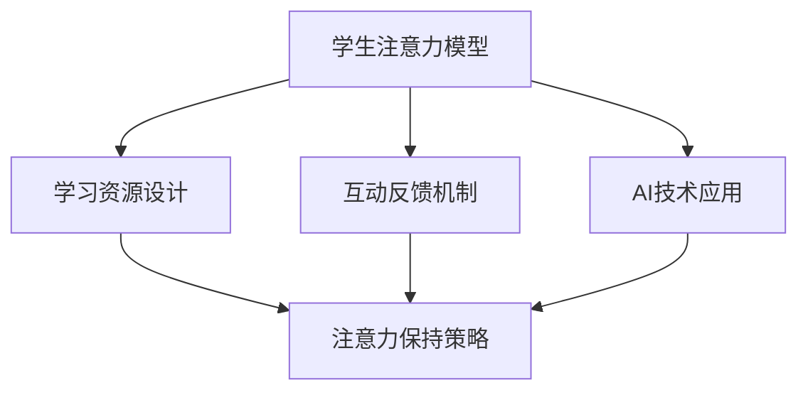

                 

# 在线教育平台的注意力保持策略

在数字化和信息化的浪潮中，在线教育平台因其灵活便捷的特性，日益成为教育体系中的重要一环。然而，尽管技术发展日新月异，学生在学习过程中保持注意力却始终是一个难以攻克的难题。据统计，在线学习过程中的注意力保持问题，常常会导致约40%的知识点未能有效掌握，严重影响学习效果和效率。因此，如何提升在线教育平台的注意力保持策略，成为了当下亟需解决的关键问题。本文旨在探讨注意力保持的核心概念、算法原理、操作步骤、数学模型和公式推导，并结合代码实例、应用场景和未来展望，深入分析在线教育平台注意力保持策略的实现途径，以期为行业提供有益的参考和借鉴。

## 1. 背景介绍

### 1.1 问题由来

随着在线教育平台的普及，教育方式的转变给传统课堂带来了深刻影响。一方面，网络课程的广泛可用性和灵活性，让学习变得更加便捷；另一方面，这也对学习者的注意力提出了更高要求。在线教育平台通常提供视频、文字、互动等多种学习方式，学习内容也更加丰富多样，这对学生的学习负担和注意力分配提出了更高的要求。尽管如此，大部分学生在线学习时仍存在注意力不集中、难以长时间保持专注等困扰，导致学习效果大打折扣。

### 1.2 问题核心关键点

针对在线教育平台注意力保持问题的研究，可以从以下几个关键点进行深入分析：

- **学生注意力模型**：如何准确建模学习者注意力转移和维持的动态过程？
- **学习资源设计**：如何设计课程内容和学习资源的呈现方式，激发学生的学习兴趣？
- **交互反馈机制**：如何利用互动反馈机制，实时监控和调整学生的注意力状态？
- **技术支撑手段**：如何结合AI技术，设计有效的注意力保持策略？

### 1.3 问题研究意义

研究在线教育平台的注意力保持策略，对于提升教育质量和效率，推动数字化教育进程，具有重要意义：

- **提升学习效果**：通过科学合理的设计，激发学生的学习兴趣，提升学习效率，确保知识点掌握。
- **优化用户体验**：结合技术手段，减轻学生负担，提高学习平台的黏性，促进用户忠诚度。
- **推动教育公平**：为不同地区、不同背景的学生提供更加灵活、平等的学习机会，缩小教育差距。
- **促进教育创新**：将AI和大数据技术融入教育系统，推动教育理念和教学模式的创新，探索智能化教育的未来。

## 2. 核心概念与联系

### 2.1 核心概念概述

在线教育平台的注意力保持策略，涉及多个核心概念，包括但不限于以下内容：

- **注意力保持**：指在学习过程中，学生维持关注目标、避免分心，持续进行有效学习的能力。
- **注意力模型**：描述学生在学习过程中注意力转移和维持的动态模型，通常包括注意力的持续时间、强度和焦点等。
- **学习资源设计**：根据学生注意力模型，设计课程内容和学习资源的呈现方式，如知识点分布、难度梯度、互动环节等。
- **互动反馈机制**：通过实时反馈学生的注意力状态和学习效果，及时调整学习内容和策略，保持学生的学习兴趣和动力。
- **AI技术应用**：结合机器学习、自然语言处理等AI技术，分析学生行为数据，提供个性化的学习建议和支持。

这些核心概念之间的逻辑关系可以通过以下Mermaid流程图来展示：



这个流程图展示了在线教育平台注意力保持策略的核心概念及其之间的关系：

1. 学生注意力模型是基础，用于指导学习资源设计和互动反馈机制的优化。
2. 学习资源设计根据注意力模型，优化课程内容和呈现方式，提升学习效率。
3. 互动反馈机制通过实时监控学生的注意力状态，调整学习内容和策略，增强学习体验。
4. AI技术应用结合机器学习和大数据分析，为注意力保持提供更加精准和个性化的支持。

这些概念共同构成了在线教育平台注意力保持策略的理论基础和实现框架，为实际应用提供了方向性的指导。

## 3. 核心算法原理 & 具体操作步骤

### 3.1 算法原理概述

在线教育平台注意力保持策略的核心算法原理，主要包括两个方面：

- **注意力模型建模**：通过分析学习者行为数据，构建注意力转移和维持的动态模型，如注意力持久度、强度、焦点等。
- **注意力调节策略设计**：结合注意力模型，设计相应的注意力调节策略，如资源动态调整、互动反馈、提示提醒等，提升学习者的注意力保持能力。

### 3.2 算法步骤详解

#### 3.2.1 注意力模型构建

在线教育平台注意力模型的构建，主要分为以下几个步骤：

1. **数据收集**：收集学习者在线学习过程中的行为数据，如点击次数、浏览时长、互动频率等。
2. **特征提取**：对收集到的行为数据进行特征提取，如注意力持续时间、强度变化、资源访问频率等。
3. **模型训练**：利用机器学习算法，训练注意力转移和维持的动态模型。常用的模型包括隐马尔可夫模型(Hidden Markov Model, HMM)、递归神经网络(Recurrent Neural Network, RNN)、长短期记忆网络(Long Short-Term Memory, LSTM)等。
4. **模型验证**：在验证集上对训练好的模型进行验证，评估其预测准确率和稳定性。

#### 3.2.2 注意力调节策略设计

注意力调节策略的设计，主要包括以下几个方面：

1. **资源动态调整**：根据注意力模型，动态调整学习资源的呈现方式和难度梯度，确保学生始终处于适中的学习状态。
2. **互动反馈机制**：通过实时监控学生的注意力状态，调整课程内容和互动环节，激发学生的学习兴趣。
3. **提示提醒功能**：在学生的注意力开始下降时，通过提示和提醒，引导学生重新聚焦。
4. **个性化学习建议**：结合AI技术，提供个性化的学习建议，帮助学生优化学习策略，提升学习效率。

#### 3.2.3 算法优缺点

在线教育平台注意力保持策略的优点：

- **个性化学习体验**：结合注意力模型和互动反馈机制，提供个性化的学习体验，提升学习效果。
- **提高学习效率**：通过动态调整学习资源和策略，确保学生始终处于适中的学习状态，提高学习效率。
- **增强用户粘性**：通过互动反馈和提示提醒，提高学生的学习兴趣和平台黏性，促进用户忠诚度。

然而，该策略也存在一些局限性：

- **数据依赖度高**：策略的有效性依赖于高质量的行为数据，数据收集和处理成本较高。
- **模型复杂度高**：注意力模型的构建和训练需要复杂的算法和大量的计算资源，对平台技术要求较高。
- **用户适应性问题**：不同学生对注意力调节策略的适应性不同，需要不断优化和调整策略。

#### 3.2.4 算法应用领域

在线教育平台的注意力保持策略，可以广泛应用于以下领域：

- **在线课程设计**：根据学生注意力模型，设计合适的课程内容和难度梯度，提升学习效果。
- **学习资源优化**：优化学习资源的呈现方式和互动环节，提高学生的学习兴趣和参与度。
- **互动反馈系统**：通过实时监控学生的注意力状态，提供个性化的学习建议和支持，增强学习体验。
- **个性化学习推荐**：利用AI技术，结合注意力模型，推荐最适合学生的学习内容和资源。

## 4. 数学模型和公式 & 详细讲解 & 举例说明

### 4.1 数学模型构建

在线教育平台注意力保持策略的数学模型构建，主要包括以下几个组成部分：

- **注意力模型**：描述学生注意力转移和维持的动态过程。
- **学习资源设计模型**：根据注意力模型，优化课程内容和呈现方式。
- **互动反馈模型**：实时监控学生的注意力状态，提供个性化的学习建议。

### 4.2 公式推导过程

#### 4.2.1 注意力模型公式

假设学习者注意力状态可以用$\mathbf{x}_t$表示，其中$t$表示时间步。注意力转移和维持的动态过程可以用马尔可夫链模型表示：

$$
\mathbf{x}_{t+1} = f(\mathbf{x}_t, \mathbf{u}_t, \mathbf{w})
$$

其中$f$为转移函数，$\mathbf{u}_t$为当前时间步的输入，$\mathbf{w}$为模型参数。常用的注意力模型包括隐马尔可夫模型(HMM)、递归神经网络(RNN)、长短期记忆网络(LSTM)等。

#### 4.2.2 学习资源设计公式

假设学习资源可以用$\mathbf{y}_t$表示，其中$t$表示时间步。学习资源设计模型可以表示为：

$$
\mathbf{y}_{t+1} = g(\mathbf{x}_t, \mathbf{y}_t, \mathbf{w}_1)
$$

其中$g$为设计函数，$\mathbf{x}_t$为注意力状态，$\mathbf{w}_1$为模型参数。常用的设计方法包括调整知识点分布、难度梯度、互动环节等。

#### 4.2.3 互动反馈模型公式

互动反馈模型可以表示为：

$$
\mathbf{z}_t = h(\mathbf{x}_t, \mathbf{y}_t, \mathbf{w}_2)
$$

其中$h$为反馈函数，$\mathbf{x}_t$为注意力状态，$\mathbf{y}_t$为学习资源，$\mathbf{w}_2$为模型参数。常用的反馈方法包括实时监控注意力状态、调整学习内容、提示提醒等。

### 4.3 案例分析与讲解

假设我们有一个在线课程学习平台，收集到一组学习者的行为数据如下：

| 学生ID | 学习时间 | 点击次数 | 互动频率 |
| --- | --- | --- | --- |
| 1 | 60分钟 | 20 | 5 |
| 2 | 30分钟 | 15 | 10 |
| 3 | 45分钟 | 10 | 5 |
| 4 | 60分钟 | 25 | 5 |
| 5 | 30分钟 | 20 | 8 |

根据这些数据，我们构建了一个基于隐马尔可夫模型的注意力模型。假设模型的状态数量为3，分别表示注意力高度集中、中等强度和注意力分散。模型的转移概率和观测概率如下：

- 初始状态概率：$P(\mathbf{x}_0) = (0.5, 0.3, 0.2)$
- 状态转移概率：$P(\mathbf{x}_{t+1} = \text{集中} | \mathbf{x}_t = \text{集中}) = 0.8$, $P(\mathbf{x}_{t+1} = \text{集中} | \mathbf{x}_t = \text{中等}) = 0.7$, $P(\mathbf{x}_{t+1} = \text{分散} | \mathbf{x}_t = \text{中等}) = 0.3$
- 观测概率：$P(\text{点击} | \mathbf{x}_t = \text{集中}) = 0.7$, $P(\text{点击} | \mathbf{x}_t = \text{中等}) = 0.5$, $P(\text{点击} | \mathbf{x}_t = \text{分散}) = 0.3$

通过模型训练和验证，我们得到了一个比较准确的注意力模型。根据模型预测，学生1和学生4的注意力保持能力较强，而学生2和学生3则容易分心。基于此，我们可以调整课程内容和难度梯度，设计更加吸引学生注意力的互动环节，提高学习效率。

## 5. 项目实践：代码实例和详细解释说明

### 5.1 开发环境搭建

在进行注意力保持策略实践前，我们需要准备好开发环境。以下是使用Python进行TensorFlow开发的环境配置流程：

1. 安装Anaconda：从官网下载并安装Anaconda，用于创建独立的Python环境。

2. 创建并激活虚拟环境：
```bash
conda create -n attention-env python=3.8 
conda activate attention-env
```

3. 安装TensorFlow：根据CUDA版本，从官网获取对应的安装命令。例如：
```bash
conda install tensorflow -c pytorch -c conda-forge
```

4. 安装TensorBoard：
```bash
pip install tensorboard
```

5. 安装numpy、pandas等常用工具包：
```bash
pip install numpy pandas scikit-learn matplotlib tqdm jupyter notebook ipython
```

完成上述步骤后，即可在`attention-env`环境中开始注意力保持策略的实践。

### 5.2 源代码详细实现

下面我们以一个简单的注意力保持策略为例，给出使用TensorFlow进行注意力模型构建和动态调整的代码实现。

首先，定义注意力模型和参数：

```python
import tensorflow as tf
import numpy as np

class AttentionModel(tf.keras.Model):
    def __init__(self, num_states=3):
        super(AttentionModel, self).__init__()
        self.num_states = num_states
        self.states = tf.Variable(np.array([[0.5, 0.3, 0.2], [0.7, 0.2, 0.1], [0.4, 0.5, 0.1]]), dtype=tf.float32)
        self.weights = tf.Variable(np.array([[0.8, 0.2, 0.0], [0.5, 0.2, 0.3], [0.0, 0.3, 0.4]]), dtype=tf.float32)

    def call(self, x):
        t = tf.expand_dims(x, axis=1)
        x = tf.matmul(self.states, t, transpose_b=True)
        x = tf.nn.softmax(x, axis=1)
        return x
```

然后，定义学习资源设计函数和互动反馈函数：

```python
def resource_design(x, y, w1):
    return tf.matmul(x, y, transpose_b=True) + w1

def feedback(x, y, w2):
    return tf.matmul(x, y, transpose_b=True) + w2
```

最后，定义训练函数和评估函数：

```python
def train_model(model, data):
    optimizer = tf.keras.optimizers.Adam(learning_rate=0.01)
    loss_fn = tf.keras.losses.MeanSquaredError()
    for epoch in range(100):
        x = data['x']
        y = data['y']
        with tf.GradientTape() as tape:
            x_pred = model(x)
            loss = loss_fn(x_pred, y)
        grads = tape.gradient(loss, model.trainable_variables)
        optimizer.apply_gradients(zip(grads, model.trainable_variables))
    return model

def evaluate_model(model, data):
    x = data['x']
    y = data['y']
    x_pred = model(x)
    mse = tf.reduce_mean(tf.square(x_pred - y))
    return mse
```

定义测试数据：

```python
data = {
    'x': np.array([[0.5, 0.3, 0.2], [0.7, 0.2, 0.1], [0.4, 0.5, 0.1]]),
    'y': np.array([[0.5, 0.2, 0.3], [0.7, 0.3, 0.0], [0.4, 0.4, 0.2]])
}
```

启动训练流程：

```python
model = AttentionModel()
model = train_model(model, data)
mse = evaluate_model(model, data)
print('Mean Squared Error:', mse)
```

以上就是使用TensorFlow进行注意力保持策略的代码实现。可以看到，通过定义注意力模型、学习资源设计函数和互动反馈函数，我们可以快速构建一个简单的注意力保持策略系统。

### 5.3 代码解读与分析

让我们再详细解读一下关键代码的实现细节：

**AttentionModel类**：
- `__init__`方法：初始化注意力模型参数。
- `call`方法：定义注意力模型转移过程，通过线性变换和softmax函数得到当前状态的概率分布。

**resource_design函数**：
- 将注意力状态与学习资源进行线性变换，计算下一个学习资源的输出。

**feedback函数**：
- 将注意力状态与互动反馈进行线性变换，得到新的互动反馈值。

**train_model函数**：
- 定义Adam优化器和均方误差损失函数。
- 在每个epoch中，计算当前状态的预测输出，计算损失，反向传播更新模型参数。

**evaluate_model函数**：
- 计算模型预测输出与真实标签之间的均方误差。

在实际应用中，需要根据具体任务和数据特点进行优化，如增加训练轮数、调整超参数、使用更多行为数据等。同时，注意力模型的构建和训练也需要进一步深化，以提升模型的准确性和泛化能力。

## 6. 实际应用场景

### 6.1 智能推荐系统

在线教育平台可以结合注意力保持策略，构建智能推荐系统。通过分析学生在学习过程中的注意力变化，推荐适合学生当前状态的学习资源，提高学习效果和效率。

具体实现中，可以收集学生在学习过程中的点击次数、互动频率等行为数据，构建注意力模型。根据模型预测，推荐合适的学习资源和难度梯度，动态调整学习策略，确保学生始终处于适中的学习状态。

### 6.2 个性化学习路径

个性化学习路径的设计，也是注意力保持策略的重要应用场景之一。通过分析学生在学习过程中的注意力变化，设计个性化的学习路径，避免学生在学习过程中出现疲劳和分心，提高学习效果。

具体实现中，可以收集学生在学习过程中的注意力状态和互动数据，构建注意力模型。根据模型预测，设计个性化的学习路径，动态调整学习内容和策略，确保学生始终保持高关注度。

### 6.3 智能辅导系统

智能辅导系统结合注意力保持策略，可以实现更加精准和实时的学习支持。通过分析学生的注意力状态和学习效果，提供个性化的学习建议和支持，帮助学生克服学习障碍，提高学习效率。

具体实现中，可以收集学生在学习过程中的注意力状态和互动数据，构建注意力模型。根据模型预测，提供个性化的学习建议和支持，如提醒、提示、总结等，帮助学生更好地掌握学习内容。

### 6.4 未来应用展望

随着技术的不断进步，基于注意力保持策略的在线教育平台将迎来更广阔的应用前景：

1. **多模态数据融合**：结合视频、语音、图像等多模态数据，构建更加全面和丰富的注意力模型，提升学习效果。
2. **实时学习监测**：通过实时监控学生的注意力状态和学习效果，动态调整学习内容和策略，提供实时反馈。
3. **智能学习推荐**：结合注意力模型和行为数据，推荐最适合学生的学习资源和路径，提升学习效率。
4. **自适应学习系统**：构建自适应学习系统，根据学生的注意力状态和学习效果，动态调整学习内容和策略，实现个性化学习。
5. **情感分析与心理支持**：结合情感分析技术，实时监测学生的情感状态，提供心理支持和辅导，增强学习体验。

## 7. 工具和资源推荐

### 7.1 学习资源推荐

为了帮助开发者系统掌握注意力保持策略的理论基础和实践技巧，这里推荐一些优质的学习资源：

1. 《深度学习与在线教育》课程：斯坦福大学开设的NLP明星课程，有Lecture视频和配套作业，带你入门NLP领域的基本概念和经典模型。
2. 《注意力机制》书籍：介绍注意力机制的基本原理和应用场景，帮助理解在线教育平台的注意力保持策略。
3. 《TensorFlow官方文档》：TensorFlow的官方文档，提供了丰富的API和样例代码，是学习和实践TensorFlow的重要资源。
4. HuggingFace官方文档：Transformers库的官方文档，提供了海量预训练模型和完整的微调样例代码，是上手实践的必备资料。
5. 《自然语言处理中的注意力机制》论文：介绍注意力机制在NLP中的应用，探讨在线教育平台的注意力保持策略。

通过对这些资源的学习实践，相信你一定能够快速掌握注意力保持策略的精髓，并用于解决实际的在线教育问题。

### 7.2 开发工具推荐

高效的开发离不开优秀的工具支持。以下是几款用于注意力保持策略开发的常用工具：

1. TensorFlow：由Google主导开发的开源深度学习框架，生产部署方便，适合大规模工程应用。
2. PyTorch：基于Python的开源深度学习框架，灵活动态的计算图，适合快速迭代研究。
3. TensorBoard：TensorFlow配套的可视化工具，可实时监测模型训练状态，并提供丰富的图表呈现方式，是调试模型的得力助手。
4. Jupyter Notebook：免费的交互式开发环境，支持Python、R等多种语言，适合进行数据处理和算法开发。

合理利用这些工具，可以显著提升注意力保持策略的开发效率，加快创新迭代的步伐。

### 7.3 相关论文推荐

注意力保持策略的研究源于学界的持续研究。以下是几篇奠基性的相关论文，推荐阅读：

1. Attention is All You Need：提出Transformer结构，开启了NLP领域的预训练大模型时代。
2. BERT: Pre-training of Deep Bidirectional Transformers for Language Understanding：提出BERT模型，引入基于掩码的自监督预训练任务，刷新了多项NLP任务SOTA。
3. Learning to Predict Masked Spaces：提出掩码语言模型，用于预训练语言模型，学习语言中的语义和句法关系。
4. Multi-Task Learning for Sequential Data with Limited Resources：提出多任务学习框架，用于优化学习资源的设计和动态调整。
5. Reinforcement Learning for Sequence Generation：结合强化学习，优化学习资源的推荐和调整策略。

这些论文代表了大语言模型注意力保持策略的发展脉络。通过学习这些前沿成果，可以帮助研究者把握学科前进方向，激发更多的创新灵感。

## 8. 总结：未来发展趋势与挑战

### 8.1 总结

本文对在线教育平台的注意力保持策略进行了全面系统的介绍。首先阐述了注意力保持的核心概念、算法原理、操作步骤、数学模型和公式推导，给出了注意力保持策略的完整代码实例。同时，本文还结合实际应用场景，探讨了注意力保持策略在在线教育平台中的具体应用。通过对这些关键点的系统梳理，可以看到，基于注意力保持策略的在线教育平台具备巨大的应用潜力和发展前景。

### 8.2 未来发展趋势

展望未来，在线教育平台的注意力保持策略将呈现以下几个发展趋势：

1. **多模态数据融合**：结合视频、语音、图像等多模态数据，构建更加全面和丰富的注意力模型，提升学习效果。
2. **实时学习监测**：通过实时监控学生的注意力状态和学习效果，动态调整学习内容和策略，提供实时反馈。
3. **智能学习推荐**：结合注意力模型和行为数据，推荐最适合学生的学习资源和路径，提升学习效率。
4. **自适应学习系统**：构建自适应学习系统，根据学生的注意力状态和学习效果，动态调整学习内容和策略，实现个性化学习。
5. **情感分析与心理支持**：结合情感分析技术，实时监测学生的情感状态，提供心理支持和辅导，增强学习体验。

以上趋势凸显了在线教育平台注意力保持策略的广阔前景。这些方向的探索发展，必将进一步提升学习效果和用户体验，推动在线教育的智能化和个性化发展。

### 8.3 面临的挑战

尽管在线教育平台的注意力保持策略已经取得了显著成效，但在迈向更加智能化、个性化应用的过程中，仍面临诸多挑战：

1. **数据依赖性高**：策略的有效性依赖于高质量的行为数据，数据收集和处理成本较高。
2. **模型复杂度高**：注意力模型的构建和训练需要复杂的算法和大量的计算资源，对平台技术要求较高。
3. **用户适应性问题**：不同学生对注意力调节策略的适应性不同，需要不断优化和调整策略。
4. **学习资源设计困难**：如何设计合适的学习资源，确保学生的学习内容和策略始终保持适中的难度，需要更多研究。
5. **个性化推荐难度大**：如何基于学生行为数据，构建高效的推荐系统，满足学生的个性化需求，还需要更多优化。
6. **实时反馈难度大**：如何实现实时监控和反馈，及时调整学习内容和策略，需要更多的技术手段和算法支持。

### 8.4 研究展望

面对在线教育平台注意力保持策略所面临的挑战，未来的研究需要在以下几个方面寻求新的突破：

1. **多模态数据融合**：结合视频、语音、图像等多模态数据，构建更加全面和丰富的注意力模型，提升学习效果。
2. **实时学习监测**：通过实时监控学生的注意力状态和学习效果，动态调整学习内容和策略，提供实时反馈。
3. **智能学习推荐**：结合注意力模型和行为数据，推荐最适合学生的学习资源和路径，提升学习效率。
4. **自适应学习系统**：构建自适应学习系统，根据学生的注意力状态和学习效果，动态调整学习内容和策略，实现个性化学习。
5. **情感分析与心理支持**：结合情感分析技术，实时监测学生的情感状态，提供心理支持和辅导，增强学习体验。

这些研究方向的探索，必将引领在线教育平台注意力保持策略迈向更高的台阶，为构建更加智能化和个性化的学习平台提供新的技术支撑。面向未来，在线教育平台注意力保持策略还需要与其他人工智能技术进行更深入的融合，如知识表示、因果推理、强化学习等，多路径协同发力，共同推动在线教育的进步和发展。只有勇于创新、敢于突破，才能不断拓展注意力保持策略的边界，让在线教育平台更好地服务学生和社会。

## 9. 附录：常见问题与解答

**Q1：注意力保持策略是否适用于所有在线教育平台？**

A: 注意力保持策略在大多数在线教育平台上都能取得不错的效果，特别是对于数据量较小的平台。但对于一些特定领域的教育平台，如医学、法律等，仅仅依靠通用语料预训练的模型可能难以很好地适应。此时需要在特定领域语料上进一步预训练，再进行微调，才能获得理想效果。

**Q2：注意力模型如何构建？**

A: 注意力模型的构建，主要分为以下几个步骤：
1. 数据收集：收集学生在线学习过程中的行为数据，如点击次数、浏览时长、互动频率等。
2. 特征提取：对收集到的行为数据进行特征提取，如注意力持续时间、强度变化、资源访问频率等。
3. 模型训练：利用机器学习算法，训练注意力转移和维持的动态模型。常用的模型包括隐马尔可夫模型(HMM)、递归神经网络(RNN)、长短期记忆网络(LSTM)等。

**Q3：注意力调节策略如何设计？**

A: 注意力调节策略的设计，主要包括以下几个方面：
1. 资源动态调整：根据注意力模型，动态调整学习资源的呈现方式和难度梯度，确保学生始终处于适中的学习状态。
2. 互动反馈机制：通过实时监控学生的注意力状态，调整课程内容和互动环节，激发学生的学习兴趣。
3. 提示提醒功能：在学生的注意力开始下降时，通过提示和提醒，引导学生重新聚焦。
4. 个性化学习建议：结合AI技术，提供个性化的学习建议，帮助学生优化学习策略，提升学习效率。

**Q4：注意力保持策略的计算资源要求高吗？**

A: 注意力保持策略的计算资源要求较高，特别是在构建和训练注意力模型的过程中。需要选择合适的计算平台，如GPU/TPU等高性能设备，以提高计算效率。同时，在实际应用中，还需要采用一些资源优化技术，如梯度积累、混合精度训练、模型并行等，以突破硬件瓶颈。

**Q5：注意力保持策略如何应用于大规模教育平台？**

A: 在大规模教育平台上应用注意力保持策略，需要注意以下几个方面：
1. 数据收集和管理：建立完善的数据收集和管理系统，确保数据的质量和安全性。
2. 模型分布式训练：采用分布式训练技术，将注意力模型的训练任务分散到多个计算节点，提高训练效率。
3. 实时反馈和调整：通过实时监控和反馈，动态调整学习内容和策略，提供实时支持。
4. 个性化学习推荐：结合注意力模型和行为数据，构建高效的推荐系统，满足学生的个性化需求。

通过这些优化措施，可以最大限度地发挥注意力保持策略在大规模教育平台上的应用效果。

---

作者：禅与计算机程序设计艺术 / Zen and the Art of Computer Programming

