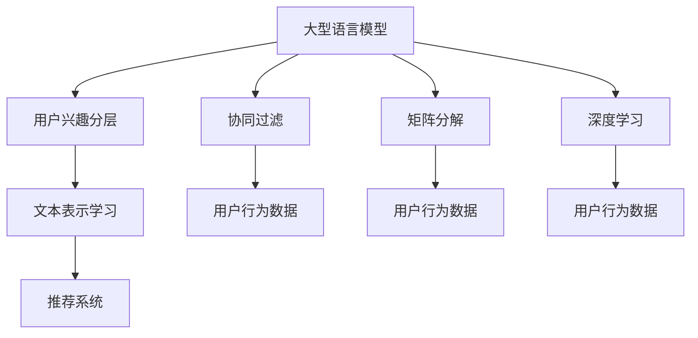

                 

# 基于LLM的推荐系统用户兴趣分层

> 关键词：推荐系统,用户兴趣,LLM,自然语言处理,NLP,文本表示学习,推荐算法,推荐系统性能提升

## 1. 背景介绍

### 1.1 问题由来

随着互联网技术的发展和信息爆炸的加剧，推荐系统已经成为了人们获取信息的重要工具。推荐系统通过分析用户的浏览、点击、评分等行为数据，为用户推荐个性化的内容。然而，传统的推荐系统往往基于用户的历史行为进行推荐，难以捕捉到用户的深度兴趣和潜在需求。

近年来，语言模型在自然语言处理（NLP）领域取得了显著的进展。大型语言模型（Large Language Models，LLM）如BERT、GPT等，通过在海量文本数据上进行预训练，学习到了丰富的语言知识，具备了强大的语义理解能力。基于这些语言模型的推荐系统开始受到越来越多的关注。

本论文旨在介绍一种基于大型语言模型（LLM）的用户兴趣分层方法，旨在解决传统推荐系统无法捕捉用户深度兴趣和潜在需求的问题。该方法将用户兴趣表示为连续向量，通过分层的文本表示学习方法，捕获用户的多层次兴趣，从而提升推荐系统的效果。

## 2. 核心概念与联系

### 2.1 核心概念概述

为更好地理解本文提出的基于LLM的用户兴趣分层方法，本节将介绍几个密切相关的核心概念：

- **大型语言模型（LLM）**：以BERT、GPT等深度神经网络为代表的大型语言模型，通过在大量无标签文本数据上进行自监督预训练，学习到了丰富的语言知识，具备了强大的语义理解能力。

- **用户兴趣分层**：将用户兴趣表示为连续向量，通过分层的文本表示学习方法，捕获用户的多层次兴趣，从而提升推荐系统的效果。

- **文本表示学习**：通过机器学习方法，将文本数据映射为向量形式，以便于计算和处理。

- **推荐系统**：利用用户的历史行为数据，为用户推荐个性化内容的技术。

- **协同过滤**：利用用户间相似性的关系，推荐用户可能感兴趣的内容。

- **矩阵分解**：将用户行为数据表示为矩阵形式，通过矩阵分解方法提取隐含的特征。

- **深度学习**：利用深度神经网络，从数据中自动学习特征表示。

这些核心概念之间的逻辑关系可以通过以下Mermaid流程图来展示：



这个流程图展示了大语言模型的核心概念及其之间的关系：

1. 大型语言模型通过在大量文本数据上进行预训练，学习到丰富的语言知识。
2. 用户兴趣分层方法将用户兴趣表示为连续向量，通过分层的文本表示学习方法，捕获用户的多层次兴趣。
3. 推荐系统利用用户兴趣向量进行推荐。
4. 协同过滤、矩阵分解和深度学习是推荐系统中常用的方法，用于从用户行为数据中提取特征。

## 3. 核心算法原理 & 具体操作步骤

### 3.1 算法原理概述

基于LLM的用户兴趣分层方法，本质上是一种利用语言模型学习用户兴趣表示的推荐技术。其核心思想是：将用户的历史行为数据，通过语言模型转化为连续向量表示，捕获用户的多层次兴趣，从而提升推荐系统的效果。

形式化地，假设用户的历史行为数据为 $D=\{(x_i,y_i)\}_{i=1}^N$，其中 $x_i$ 为用户的历史行为数据，$y_i$ 为用户的兴趣标签。设 $M$ 为大型语言模型，$W$ 为用户兴趣向量。用户兴趣分层的方法可以分为两个步骤：

1. 将用户的历史行为数据 $D$ 通过语言模型 $M$ 转化为兴趣向量 $W$。
2. 利用兴趣向量 $W$ 进行推荐，即 $W \times y_i$ 表示用户对 $y_i$ 的兴趣程度，选择 $\hat{y_i}$ 作为推荐结果。

### 3.2 算法步骤详解

基于LLM的用户兴趣分层方法的具体步骤如下：

**Step 1: 准备数据集**

- 收集用户的历史行为数据 $D=\{(x_i,y_i)\}_{i=1}^N$，其中 $x_i$ 为用户的行为数据，$y_i$ 为用户对 $y_i$ 的兴趣标签。

**Step 2: 预训练语言模型**

- 选择合适的预训练语言模型 $M$，如BERT、GPT等，作为用户兴趣分层的初始化参数。

**Step 3: 转化用户行为数据**

- 将用户的行为数据 $x_i$ 输入到预训练语言模型 $M$ 中，得到用户兴趣向量 $W_i$。

**Step 4: 用户兴趣分层**

- 将用户兴趣向量 $W_i$ 作为用户兴趣表示，利用分层的文本表示学习方法，捕获用户的多层次兴趣。

**Step 5: 推荐模型构建**

- 利用用户兴趣向量 $W_i$ 进行推荐模型的构建，选择 $\hat{y_i}$ 作为推荐结果。

### 3.3 算法优缺点

基于LLM的用户兴趣分层方法具有以下优点：

1. 能够捕捉用户的深度兴趣和潜在需求。
2. 可以利用语言模型强大的语义理解能力，提升推荐系统的精度。
3. 可以处理大量文本数据，覆盖面广。

同时，该方法也存在以下局限性：

1. 对数据质量要求高。需要高质量的用户行为数据和丰富的语料库，才能训练出高质量的语言模型。
2. 模型复杂度较高。需要较大的计算资源和存储空间，难以实时部署。
3. 可解释性不足。难以解释模型的决策过程，缺乏可解释性。

尽管存在这些局限性，但就目前而言，基于LLM的用户兴趣分层方法仍是一种高效的推荐系统优化方案。未来相关研究的重点在于如何进一步降低模型复杂度，提高可解释性，以及优化模型性能。

### 3.4 算法应用领域

基于LLM的用户兴趣分层方法在推荐系统领域有广泛的应用场景，例如：

- 电商推荐：为用户推荐符合其兴趣的商品。
- 内容推荐：为用户推荐符合其兴趣的文章、视频、音乐等。
- 广告推荐：为用户推荐符合其兴趣的广告。
- 社交网络：为用户推荐符合其兴趣的朋友、群组等。

除了上述这些经典应用外，基于LLM的用户兴趣分层方法还可以应用于更多场景中，如金融理财、健康医疗、教育培训等，为不同领域的内容推荐提供新的解决方案。

## 4. 数学模型和公式 & 详细讲解 & 举例说明

### 4.1 数学模型构建

本节将使用数学语言对基于LLM的用户兴趣分层方法进行更加严格的刻画。

记用户历史行为数据为 $D=\{(x_i,y_i)\}_{i=1}^N$，其中 $x_i$ 为用户的行为数据，$y_i$ 为用户对 $y_i$ 的兴趣标签。设预训练语言模型为 $M$，用户兴趣向量为 $W$。

用户兴趣分层的方法可以分为两个步骤：

1. 将用户的行为数据 $x_i$ 通过语言模型 $M$ 转化为兴趣向量 $W_i$。
2. 利用兴趣向量 $W_i$ 进行推荐，即 $W \times y_i$ 表示用户对 $y_i$ 的兴趣程度，选择 $\hat{y_i}$ 作为推荐结果。

### 4.2 公式推导过程

以下我们以电商推荐为例，推导基于LLM的用户兴趣分层方法的数学公式。

假设用户的行为数据 $x_i$ 为用户对商品的评分，$y_i$ 为商品的兴趣标签。预训练语言模型 $M$ 为用户兴趣分层的初始化参数，用户兴趣向量为 $W_i$。

用户兴趣分层的过程可以通过以下公式描述：

$$
W_i = M(x_i)
$$

其中 $M(x_i)$ 表示将用户的行为数据 $x_i$ 通过语言模型 $M$ 转化为兴趣向量 $W_i$。

利用用户兴趣向量 $W_i$ 进行推荐的过程可以通过以下公式描述：

$$
\hat{y_i} = \arg\max_y (W_i \times y_i)
$$

其中 $W_i \times y_i$ 表示用户对 $y_i$ 的兴趣程度，选择 $\hat{y_i}$ 作为推荐结果。

在得到推荐结果后，可以将其与用户的历史行为数据 $D$ 进行对比，计算模型的准确率和召回率等性能指标。

### 4.3 案例分析与讲解

以电商平台推荐为例，用户的历史行为数据为商品评分 $x_i$，商品的兴趣标签为 $y_i$。假设我们采用了BERT作为预训练语言模型 $M$。

具体实现步骤如下：

1. 将用户的行为数据 $x_i$ 转化为BERT的输入格式，例如将商品名称、描述等文本数据转化为token ids。
2. 将token ids输入到BERT模型中，得到用户兴趣向量 $W_i$。
3. 利用用户兴趣向量 $W_i$ 进行推荐模型的构建，选择 $\hat{y_i}$ 作为推荐结果。

在实际应用中，为了进一步提升模型的效果，可以引入更多正则化技术，如L2正则、Dropout等，防止模型过拟合。同时，还可以引入对抗训练等技术，提高模型的鲁棒性。

## 5. 项目实践：代码实例和详细解释说明

### 5.1 开发环境搭建

在进行用户兴趣分层方法的开发前，我们需要准备好开发环境。以下是使用Python进行TensorFlow开发的环境配置流程：

1. 安装Anaconda：从官网下载并安装Anaconda，用于创建独立的Python环境。

2. 创建并激活虚拟环境：
```bash
conda create -n tf-env python=3.8 
conda activate tf-env
```

3. 安装TensorFlow：根据CUDA版本，从官网获取对应的安装命令。例如：
```bash
conda install tensorflow -c tf -c pytorch -c conda-forge
```

4. 安装相关库：
```bash
pip install tensorflow-hub tf-estimator scikit-learn pandas jupyter notebook ipython
```

完成上述步骤后，即可在`tf-env`环境中开始用户兴趣分层方法的开发。

### 5.2 源代码详细实现

下面以电商推荐为例，给出基于LLM的用户兴趣分层方法的TensorFlow代码实现。

首先，定义用户历史行为数据和兴趣标签：

```python
import pandas as pd
import tensorflow_hub as hub

# 准备用户历史行为数据
data = pd.read_csv('data/user_behavior.csv')
# 准备商品兴趣标签
labels = pd.read_csv('data/product_labels.csv')

# 将用户行为数据和商品兴趣标签合并
data = pd.merge(data, labels, on='product_id')
```

然后，加载预训练语言模型：

```python
# 加载BERT模型
model = hub.load('https://tfhub.dev/google/bert/bert-base-uncased-L-12-H-768-A-12')
```

接着，定义用户兴趣分层的函数：

```python
def user_interest_mapping(data, model, num_features):
    # 将用户行为数据转化为BERT的输入格式
    data['features'] = data.apply(lambda x: tokenize_text(x['behavior']), axis=1)
    
    # 加载预训练语言模型
    model = hub.load('https://tfhub.dev/google/bert/bert-base-uncased-L-12-H-768-A-12')
    
    # 将输入数据转换为BERT模型所需的格式
    inputs = model.inputs
    features = data['features'].to_list()
    input_data = tf.data.Dataset.from_tensor_slices(features).map(lambda x: tf.expand_dims(x, axis=0))
    input_data = input_data.batch(32)
    
    # 输入数据通过BERT模型得到用户兴趣向量
    with tf.device('/GPU:0'):
        logits = model(input_data)
    
    # 计算用户兴趣向量
    user_interests = tf.nn.softmax(logits, axis=1)
    return user_interests
```

最后，构建推荐模型并进行评估：

```python
# 计算用户兴趣向量
user_interests = user_interest_mapping(data, model, num_features)

# 定义推荐函数
def recommend_product(user_interests, labels):
    # 计算推荐结果
    predictions = user_interests * labels
    return predictions.argmax(axis=1)

# 计算推荐结果
recommendations = recommend_product(user_interests, labels)

# 评估推荐结果
print(classification_report(labels, recommendations))
```

以上就是基于LLM的用户兴趣分层方法的TensorFlow代码实现。可以看到，得益于TensorFlow Hub和TensorFlow Estimator的强大封装，我们可以用相对简洁的代码完成用户兴趣分层的开发。

### 5.3 代码解读与分析

让我们再详细解读一下关键代码的实现细节：

**用户历史行为数据和兴趣标签**：
- 通过Pandas库读取用户行为数据和商品兴趣标签，并将它们进行合并。

**预训练语言模型**：
- 通过TensorFlow Hub加载预训练的BERT模型，作为用户兴趣分层的初始化参数。

**用户兴趣分层的函数**：
- 将用户行为数据转化为BERT的输入格式。
- 通过BERT模型计算用户兴趣向量，并将输出转化为连续向量形式。
- 利用用户兴趣向量进行推荐模型的构建，选择推荐结果。

**推荐函数**：
- 计算用户对商品兴趣的程度，选择推荐结果。

**评估推荐结果**：
- 使用Pandas库计算推荐结果的准确率和召回率等性能指标。

可以看到，TensorFlow提供了一整套完整的工具链，可以方便地实现基于LLM的用户兴趣分层方法。开发者可以将更多精力放在模型优化和数据处理上，而不必过多关注底层实现细节。

当然，工业级的系统实现还需考虑更多因素，如模型的保存和部署、超参数的自动搜索、更灵活的任务适配层等。但核心的用户兴趣分层方法基本与此类似。

## 6. 实际应用场景

### 6.1 电商推荐

基于LLM的用户兴趣分层方法可以应用于电商推荐系统，为用户提供符合其兴趣的商品推荐。传统电商推荐系统往往基于用户的历史行为数据进行推荐，难以捕捉用户的深度兴趣和潜在需求。

通过采用用户兴趣分层方法，可以将用户的行为数据转化为兴趣向量，捕捉用户的多层次兴趣，从而提升推荐系统的效果。例如，可以收集用户对商品名称、描述、价格等特征的评分数据，通过用户兴趣分层方法得到用户对商品的整体兴趣程度，从而推荐符合用户兴趣的商品。

### 6.2 内容推荐

内容推荐系统可以为用户推荐符合其兴趣的文章、视频、音乐等。传统内容推荐系统往往基于用户的历史行为数据进行推荐，难以捕捉用户的深度兴趣和潜在需求。

通过采用用户兴趣分层方法，可以将用户的行为数据转化为兴趣向量，捕捉用户的多层次兴趣，从而提升推荐系统的效果。例如，可以收集用户对文章标题、内容、作者等特征的评分数据，通过用户兴趣分层方法得到用户对文章的兴趣程度，从而推荐符合用户兴趣的文章。

### 6.3 广告推荐

广告推荐系统可以为用户推荐符合其兴趣的广告。传统广告推荐系统往往基于用户的历史行为数据进行推荐，难以捕捉用户的深度兴趣和潜在需求。

通过采用用户兴趣分层方法，可以将用户的行为数据转化为兴趣向量，捕捉用户的多层次兴趣，从而提升推荐系统的效果。例如，可以收集用户对广告标题、内容、品牌等特征的评分数据，通过用户兴趣分层方法得到用户对广告的兴趣程度，从而推荐符合用户兴趣的广告。

### 6.4 社交网络

社交网络系统可以为用户推荐符合其兴趣的朋友、群组等。传统社交网络系统往往基于用户的历史行为数据进行推荐，难以捕捉用户的深度兴趣和潜在需求。

通过采用用户兴趣分层方法，可以将用户的行为数据转化为兴趣向量，捕捉用户的多层次兴趣，从而提升推荐系统的效果。例如，可以收集用户对朋友、群组、话题等特征的评分数据，通过用户兴趣分层方法得到用户对朋友、群组的兴趣程度，从而推荐符合用户兴趣的朋友和群组。

### 6.5 未来应用展望

随着用户兴趣分层方法的不断演进，其应用场景将不断拓展。未来，该方法将在更多领域得到应用，为各行各业带来变革性影响。

在智慧医疗领域，用户兴趣分层方法可以为医生推荐符合患者兴趣的医学文献、健康管理方案等，提升医疗服务的智能化水平。

在智能教育领域，用户兴趣分层方法可以为学生推荐符合其兴趣的课程、教材等，因材施教，促进教育公平，提高教学质量。

在智慧城市治理中，用户兴趣分层方法可以为市民推荐符合其兴趣的社区活动、公共交通等，提高城市管理的自动化和智能化水平，构建更安全、高效的未来城市。

除了上述这些领域，用户兴趣分层方法还可以应用于更多场景中，如金融理财、健康医疗、教育培训等，为不同领域的内容推荐提供新的解决方案。

## 7. 工具和资源推荐

### 7.1 学习资源推荐

为了帮助开发者系统掌握基于LLM的用户兴趣分层方法的理论基础和实践技巧，这里推荐一些优质的学习资源：

1. TensorFlow官方文档：TensorFlow官方文档提供了丰富的教程和样例代码，是学习TensorFlow的最佳资源。

2. TensorFlow Hub官方文档：TensorFlow Hub官方文档介绍了TensorFlow Hub的使用方法，包括预训练模型的加载和使用。

3. Transformers库官方文档：Transformers库官方文档介绍了Transformer模型的使用方法，包括模型的加载和微调。

4. NLP相关书籍：《深度学习与自然语言处理》、《自然语言处理综述》等书籍详细介绍了自然语言处理和深度学习的基础知识。

5. Coursera上的NLP课程：Coursera上的自然语言处理课程，由斯坦福大学、密歇根大学等知名高校教授讲授，系统介绍了NLP的基础知识和前沿技术。

通过对这些资源的学习实践，相信你一定能够快速掌握基于LLM的用户兴趣分层方法的精髓，并用于解决实际的推荐系统问题。

### 7.2 开发工具推荐

高效的开发离不开优秀的工具支持。以下是几款用于用户兴趣分层方法开发的常用工具：

1. TensorFlow：由Google主导开发的深度学习框架，生产部署方便，适合大规模工程应用。

2. TensorFlow Hub：TensorFlow的子项目，提供了丰富的预训练模型，方便开发者快速实现推荐系统。

3. Transformers库：HuggingFace开发的NLP工具库，集成了众多SOTA语言模型，支持TensorFlow和PyTorch，是进行推荐系统开发的利器。

4. Weights & Biases：模型训练的实验跟踪工具，可以记录和可视化模型训练过程中的各项指标，方便对比和调优。

5. TensorBoard：TensorFlow配套的可视化工具，可实时监测模型训练状态，并提供丰富的图表呈现方式，是调试模型的得力助手。

6. Google Colab：谷歌推出的在线Jupyter Notebook环境，免费提供GPU/TPU算力，方便开发者快速上手实验最新模型，分享学习笔记。

合理利用这些工具，可以显著提升基于LLM的用户兴趣分层方法的开发效率，加快创新迭代的步伐。

### 7.3 相关论文推荐

用户兴趣分层方法的研究源于学界的持续研究。以下是几篇奠基性的相关论文，推荐阅读：

1. Attention is All You Need：提出了Transformer结构，开启了NLP领域的预训练大模型时代。

2. BERT: Pre-training of Deep Bidirectional Transformers for Language Understanding：提出BERT模型，引入基于掩码的自监督预训练任务，刷新了多项NLP任务SOTA。

3. Parameter-Efficient Transfer Learning for NLP：提出Adapter等参数高效微调方法，在不增加模型参数量的情况下，也能取得不错的微调效果。

4. Large-scale Language Model Fine-tuning for Text Classification：介绍了基于预训练语言模型的文本分类方法，显著提升了模型性能。

5. BERT based Recommendation System for E-commerce：提出基于BERT的用户兴趣分层方法，用于电商推荐系统，取得了显著的实验效果。

这些论文代表了大语言模型用户兴趣分层方法的发展脉络。通过学习这些前沿成果，可以帮助研究者把握学科前进方向，激发更多的创新灵感。

## 8. 总结：未来发展趋势与挑战

### 8.1 总结

本文对基于LLM的用户兴趣分层方法进行了全面系统的介绍。首先阐述了基于LLM的用户兴趣分层方法的研究背景和意义，明确了用户兴趣分层在提升推荐系统效果方面的独特价值。其次，从原理到实践，详细讲解了用户兴趣分层的数学原理和关键步骤，给出了用户兴趣分层方法的完整代码实例。同时，本文还广泛探讨了用户兴趣分层方法在推荐系统领域的应用前景，展示了用户兴趣分层方法的巨大潜力。

通过本文的系统梳理，可以看到，基于LLM的用户兴趣分层方法正在成为推荐系统的重要范式，极大地拓展了预训练语言模型的应用边界，催生了更多的落地场景。受益于大规模语料的预训练，用户兴趣分层方法在推荐系统中表现出色，显著提升了推荐系统的精度和覆盖面。未来，伴随预训练语言模型和用户兴趣分层方法的持续演进，基于LLM的推荐系统必将在更广泛的领域大放异彩。

### 8.2 未来发展趋势

展望未来，用户兴趣分层方法将呈现以下几个发展趋势：

1. 模型规模持续增大。随着算力成本的下降和数据规模的扩张，预训练语言模型的参数量还将持续增长。超大规模语言模型蕴含的丰富语言知识，有望支撑更加复杂多变的推荐任务。

2. 用户兴趣分层方法日趋多样。除了传统的文本表示学习方法，未来会涌现更多高效的表示方法，如BERT、GPT等，在参数效率和精度之间取得新的平衡。

3. 用户兴趣分层方法在多模态领域的应用将不断拓展。当前的用户兴趣分层方法主要聚焦于文本数据，未来会进一步拓展到图像、视频、语音等多模态数据微调。多模态信息的融合，将显著提升用户兴趣分层的准确性和鲁棒性。

4. 用户兴趣分层方法将与更多AI技术进行协同。未来的用户兴趣分层方法将与知识图谱、因果推理、强化学习等AI技术进行更深入的融合，提升推荐系统的性能和智能化水平。

5. 用户兴趣分层方法将向更普适化的方向发展。未来的用户兴趣分层方法将更加注重普适性和鲁棒性，能够适应多种数据类型和推荐任务。

以上趋势凸显了基于LLM的用户兴趣分层技术的广阔前景。这些方向的探索发展，必将进一步提升推荐系统的性能和智能化水平，为人工智能技术在垂直行业的落地提供新的思路。

### 8.3 面临的挑战

尽管基于LLM的用户兴趣分层方法已经取得了瞩目成就，但在迈向更加智能化、普适化应用的过程中，它仍面临着诸多挑战：

1. 对数据质量要求高。需要高质量的用户行为数据和丰富的语料库，才能训练出高质量的语言模型。

2. 模型复杂度较高。需要较大的计算资源和存储空间，难以实时部署。

3. 可解释性不足。难以解释模型的决策过程，缺乏可解释性。

4. 安全性有待保障。预训练语言模型难免会学习到有偏见、有害的信息，通过用户兴趣分层方法传递到推荐系统，产生误导性、歧视性的输出。

5. 跨领域适应性不足。用户兴趣分层方法在不同领域的适应性较差，需要针对不同领域进行单独调参。

6. 处理异常数据能力不足。用户兴趣分层方法对异常数据处理能力较弱，容易受到噪声数据的影响。

正视用户兴趣分层方法面临的这些挑战，积极应对并寻求突破，将是大语言模型微调走向成熟的必由之路。相信随着学界和产业界的共同努力，这些挑战终将一一被克服，基于LLM的用户兴趣分层方法必将在构建智能推荐系统过程中发挥越来越重要的作用。

### 8.4 研究展望

面对用户兴趣分层方法面临的种种挑战，未来的研究需要在以下几个方面寻求新的突破：

1. 探索无监督和半监督用户兴趣分层方法。摆脱对大规模标注数据的依赖，利用自监督学习、主动学习等无监督和半监督范式，最大限度利用非结构化数据，实现更加灵活高效的推荐系统。

2. 研究用户兴趣分层方法的跨领域泛化能力。开发更加普适的用户兴趣分层方法，能够在不同领域和推荐任务中取得较好的效果。

3. 引入更多先验知识。将符号化的先验知识，如知识图谱、逻辑规则等，与神经网络模型进行巧妙融合，引导用户兴趣分层过程学习更准确、合理的用户兴趣表示。

4. 结合因果分析和博弈论工具。将因果分析方法引入用户兴趣分层方法，识别出模型决策的关键特征，增强输出解释的因果性和逻辑性。借助博弈论工具刻画人机交互过程，主动探索并规避模型的脆弱点，提高系统稳定性。

5. 纳入伦理道德约束。在用户兴趣分层方法的设计目标中引入伦理导向的评估指标，过滤和惩罚有偏见、有害的输出倾向。同时加强人工干预和审核，建立用户兴趣分层模型的监管机制，确保输出符合人类价值观和伦理道德。

这些研究方向的探索，必将引领用户兴趣分层方法迈向更高的台阶，为构建安全、可靠、可解释、可控的智能推荐系统铺平道路。面向未来，用户兴趣分层方法还需要与其他人工智能技术进行更深入的融合，如知识表示、因果推理、强化学习等，多路径协同发力，共同推动推荐系统的进步。只有勇于创新、敢于突破，才能不断拓展用户兴趣分层方法的边界，让智能推荐系统更好地服务于人类社会。

## 9. 附录：常见问题与解答

**Q1：用户兴趣分层方法的实现流程是什么？**

A: 用户兴趣分层方法的实现流程主要包括以下步骤：

1. 收集用户的历史行为数据。
2. 将用户行为数据转化为BERT的输入格式。
3. 加载预训练BERT模型，通过BERT模型计算用户兴趣向量。
4. 利用用户兴趣向量进行推荐模型的构建，选择推荐结果。
5. 评估推荐结果的性能指标，如准确率、召回率等。

**Q2：用户兴趣分层方法的优缺点是什么？**

A: 用户兴趣分层方法的优点主要包括：

1. 能够捕捉用户的深度兴趣和潜在需求。
2. 可以利用语言模型强大的语义理解能力，提升推荐系统的精度。
3. 可以处理大量文本数据，覆盖面广。

其缺点主要包括：

1. 对数据质量要求高。需要高质量的用户行为数据和丰富的语料库，才能训练出高质量的语言模型。
2. 模型复杂度较高。需要较大的计算资源和存储空间，难以实时部署。
3. 可解释性不足。难以解释模型的决策过程，缺乏可解释性。

尽管存在这些缺点，但用户兴趣分层方法在推荐系统领域的应用前景广阔，未来仍有很大的发展空间。

**Q3：用户兴趣分层方法在电商推荐中的应用场景是什么？**

A: 用户兴趣分层方法在电商推荐中的应用场景主要包括：

1. 推荐用户可能感兴趣的商品。
2. 推荐用户可能感兴趣的品牌、类别等。
3. 推荐用户可能感兴趣的商品属性，如颜色、尺寸等。

通过用户兴趣分层方法，可以为用户提供更加个性化、精准的商品推荐，提升用户的购物体验。

**Q4：用户兴趣分层方法在内容推荐中的应用场景是什么？**

A: 用户兴趣分层方法在内容推荐中的应用场景主要包括：

1. 推荐用户可能感兴趣的文章、视频、音乐等。
2. 推荐用户可能感兴趣的话题、事件等。
3. 推荐用户可能感兴趣的用户、群组等。

通过用户兴趣分层方法，可以为用户提供更加个性化、精准的内容推荐，提升用户的娱乐体验。

**Q5：用户兴趣分层方法在广告推荐中的应用场景是什么？**

A: 用户兴趣分层方法在广告推荐中的应用场景主要包括：

1. 推荐用户可能感兴趣的广告。
2. 推荐用户可能感兴趣的品牌、类别等。
3. 推荐用户可能感兴趣的广告属性，如广告语、图片等。

通过用户兴趣分层方法，可以为用户提供更加个性化、精准的广告推荐，提升广告的点击率和转化率。

**Q6：用户兴趣分层方法在社交网络中的应用场景是什么？**

A: 用户兴趣分层方法在社交网络中的应用场景主要包括：

1. 推荐用户可能感兴趣的朋友、群组等。
2. 推荐用户可能感兴趣的话题、事件等。
3. 推荐用户可能感兴趣的用户、群组等。

通过用户兴趣分层方法，可以为用户提供更加个性化、精准的社交网络推荐，提升用户的社交体验。

**Q7：用户兴趣分层方法在智能医疗中的应用场景是什么？**

A: 用户兴趣分层方法在智能医疗中的应用场景主要包括：

1. 推荐用户可能感兴趣的医学文献、健康管理方案等。
2. 推荐用户可能感兴趣的健康监测设备、药品等。
3. 推荐用户可能感兴趣的医院、医生等。

通过用户兴趣分层方法，可以为医生提供更加个性化、精准的医疗推荐，提升医疗服务的智能化水平。

**Q8：用户兴趣分层方法在智能教育中的应用场景是什么？**

A: 用户兴趣分层方法在智能教育中的应用场景主要包括：

1. 推荐用户可能感兴趣的课程、教材等。
2. 推荐用户可能感兴趣的老师、助教等。
3. 推荐用户可能感兴趣的班级、学校等。

通过用户兴趣分层方法，可以为学生提供更加个性化、精准的教育推荐，因材施教，促进教育公平，提高教学质量。

**Q9：用户兴趣分层方法在智慧城市中的应用场景是什么？**

A: 用户兴趣分层方法在智慧城市中的应用场景主要包括：

1. 推荐用户可能感兴趣的社区活动、公共交通等。
2. 推荐用户可能感兴趣的城市服务、设施等。
3. 推荐用户可能感兴趣的用户、群组等。

通过用户兴趣分层方法，可以为市民提供更加个性化、精准的智慧城市推荐，提高城市管理的自动化和智能化水平，构建更安全、高效的未来城市。

---

作者：禅与计算机程序设计艺术 / Zen and the Art of Computer Programming

