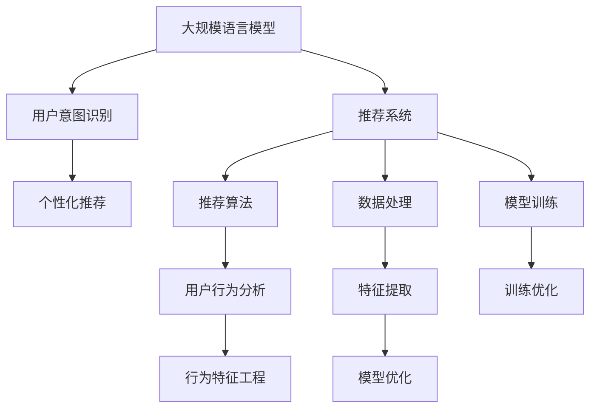

                 

# 基于LLM的推荐系统用户意图识别

> 关键词：推荐系统,LLM,用户意图识别,自然语言处理,NLP,深度学习,强化学习

## 1. 背景介绍

### 1.1 问题由来

在现代信息爆炸的时代，推荐系统已成为互联网产品中不可或缺的一部分，帮助用户在海量信息中快速找到所需内容。然而，传统的推荐系统通常基于用户的显性行为数据（如点击、浏览、购买等）进行个性化推荐，无法深入理解用户的真实兴趣和隐性需求。

最近，自然语言处理（Natural Language Processing, NLP）和深度学习（Deep Learning, DL）技术的迅猛发展，使得基于语言模型（Language Model, LM）的用户意图识别成为可能。通过训练大规模语言模型（Large Language Model, LLM），可以从用户的搜索查询、聊天记录、评论反馈等自然语言数据中提取更丰富的信息，更准确地理解用户意图。

基于语言模型的推荐系统可以提升推荐质量和用户体验，成为未来推荐系统发展的方向之一。本文将详细探讨如何基于大规模语言模型进行推荐系统中的用户意图识别，并结合具体案例，展示其原理和应用实践。

## 2. 核心概念与联系

### 2.1 核心概念概述

为更好地理解基于LLM的推荐系统用户意图识别，本节将介绍几个关键概念及其相互关系：

- **大规模语言模型（LLM）**：以自回归模型（如GPT）或自编码模型（如BERT）为代表的大规模预训练语言模型。通过在大规模无标签文本数据上进行预训练，学习通用的语言表示，具备强大的语言理解和生成能力。

- **用户意图识别（User Intent Recognition, UIR）**：通过分析用户的自然语言输入，自动识别其真实需求和意图的过程。用户意图识别是推荐系统的重要组成部分，直接影响推荐内容的个性化程度和准确性。

- **推荐系统（Recommendation System, RS）**：利用用户历史行为数据和模型预测，向用户推荐最相关、最感兴趣的物品或内容。推荐系统通过提升用户体验，增加用户满意度，进而提高产品转化率和留存率。

- **自然语言处理（NLP）**：涉及文本数据的处理、分析和生成等，通过语言模型、分词、词向量、句法分析等技术，实现自然语言和机器语言的交互。

- **深度学习（DL）**：一种机器学习范式，使用多层次的非线性神经网络，学习数据的高级特征表示，广泛用于图像、语音、自然语言处理等领域。

- **强化学习（Reinforcement Learning, RL）**：通过与环境交互，根据反馈调整策略的机器学习方法，广泛应用于游戏、自动驾驶、推荐系统等。

这些概念之间的关系可以通过以下Mermaid流程图来展示：



该流程图展示了大语言模型在推荐系统中的应用过程：

1. 通过大规模语言模型进行预训练，学习通用的语言表示。
2. 结合用户意图识别技术，对自然语言输入进行语义理解，抽取用户意图。
3. 将用户意图与推荐算法结合，生成个性化推荐。
4. 利用深度学习进行模型训练，提升推荐系统的性能。
5. 对用户行为进行分析和特征提取，优化推荐模型。
6. 强化学习用于推荐模型的训练和优化，提高推荐质量。

## 3. 核心算法原理 & 具体操作步骤
### 3.1 算法原理概述

基于LLM的推荐系统用户意图识别，核心思想是利用语言模型提取用户自然语言输入的语义信息，结合推荐算法生成个性化推荐。具体而言，步骤如下：

1. 收集用户自然语言输入数据，如搜索查询、聊天记录、评论反馈等。
2. 使用大规模语言模型进行预训练，学习通用的语言表示。
3. 结合用户意图识别技术，对自然语言输入进行语义理解，抽取用户意图。
4. 将用户意图与推荐算法结合，生成个性化推荐。
5. 利用深度学习进行模型训练，提升推荐系统的性能。

### 3.2 算法步骤详解

**Step 1: 数据收集和预处理**

- 收集用户自然语言输入数据，如搜索查询、聊天记录、评论反馈等。
- 对数据进行清洗和标准化处理，去除无关信息和噪音。
- 将文本数据转换为模型所需的格式，如分词、转换为词向量等。

**Step 2: 预训练语言模型的选择**

- 选择合适的预训练语言模型，如GPT、BERT等，作为初始化参数。
- 如果已有预训练语言模型，可以使用其权重进行迁移学习，提高模型训练效率。

**Step 3: 用户意图识别**

- 定义用户意图识别的目标，如搜索意图、购买意图、情感意图等。
- 构建任务适配层，设计相应的输入和输出格式。
- 使用预训练语言模型对输入进行编码，提取语义信息。
- 应用分类器或其他模型对编码后的输入进行分类，抽取用户意图。

**Step 4: 个性化推荐生成**

- 根据用户意图，利用推荐算法生成个性化推荐。
- 推荐算法可选用协同过滤、基于内容的推荐、深度学习推荐等方法。
- 对于每个用户，生成多条候选推荐，根据用户反馈进行迭代优化。

**Step 5: 模型训练和优化**

- 收集用户行为数据，如点击、购买等，作为训练信号。
- 将用户意图和推荐结果进行联合训练，优化推荐模型。
- 应用深度学习算法进行模型训练，如反向传播、梯度下降等。
- 利用强化学习算法，不断调整推荐策略，提高推荐质量。

### 3.3 算法优缺点

基于LLM的推荐系统用户意图识别，具有以下优点：

1. **语义理解能力强**：通过预训练语言模型，可以从自然语言输入中抽取更丰富的语义信息，提升用户意图识别的准确性。
2. **个性化程度高**：结合用户意图和推荐算法，生成更符合用户真实需求的个性化推荐。
3. **适应性强**：可以处理多语言、多领域的数据，适用于各种推荐场景。
4. **模型透明**：利用预训练语言模型和推荐算法，模型训练过程和结果都具有较好的透明性，便于调试和优化。

同时，该方法也存在以下缺点：

1. **数据依赖大**：需要大量高质量的自然语言数据进行预训练，数据获取和标注成本较高。
2. **计算资源需求高**：预训练语言模型和推荐模型都需要大规模计算资源，初期开发和维护成本较大。
3. **模型复杂**：涉及自然语言处理、推荐算法、深度学习等多方面的知识，模型结构较为复杂。
4. **更新缓慢**：预训练语言模型更新速度较慢，需要较长的训练周期才能提升模型性能。

### 3.4 算法应用领域

基于LLM的推荐系统用户意图识别，在多个领域中都有广泛的应用，例如：

1. **电商推荐**：分析用户的搜索查询和购买行为，生成个性化的商品推荐。
2. **视频推荐**：从用户的观看记录和评论中，抽取视频相关意图，生成个性化的视频推荐。
3. **内容推荐**：分析用户的阅读习惯和评论反馈，生成个性化的文章、书籍推荐。
4. **智能客服**：结合用户聊天记录，理解用户意图，提供个性化客服支持。
5. **旅游推荐**：分析用户的旅行记录和评论，生成个性化的旅游推荐。
6. **音乐推荐**：分析用户的听歌历史和评论反馈，生成个性化的音乐推荐。

以上案例展示了基于LLM的推荐系统在多个实际场景中的应用潜力，进一步推动了NLP和推荐系统技术的融合发展。

## 4. 数学模型和公式 & 详细讲解 & 举例说明

### 4.1 数学模型构建

为了更严格地刻画基于LLM的推荐系统用户意图识别过程，我们定义如下数学模型：

- **用户自然语言输入**：记用户的自然语言输入为 $x \in \mathcal{X}$，其中 $\mathcal{X}$ 为输入空间。
- **用户意图**：记用户意图为 $y \in \mathcal{Y}$，其中 $\mathcal{Y}$ 为意图空间。
- **预训练语言模型**：记预训练语言模型为 $M_{\theta}$，其中 $\theta$ 为模型参数。
- **用户意图识别模型**：记用户意图识别模型为 $P_{\theta'}$，其中 $\theta'$ 为模型参数。
- **推荐算法**：记推荐算法为 $R$。
- **推荐结果**：记推荐结果为 $r$，其中 $r \in \mathcal{R}$，其中 $\mathcal{R}$ 为推荐结果空间。

基于上述定义，我们构建以下数学模型：

1. **预训练语言模型的输入和输出**：
   - 输入：自然语言输入 $x$。
   - 输出：语义向量 $h = M_{\theta}(x)$。

2. **用户意图识别的输入和输出**：
   - 输入：语义向量 $h$。
   - 输出：意图标签 $y'$。

3. **推荐模型的输入和输出**：
   - 输入：用户意图 $y'$ 和推荐结果 $r$。
   - 输出：推荐结果 $r'$。

### 4.2 公式推导过程

以电商推荐为例，推导基于LLM的用户意图识别和推荐模型的训练公式。

**Step 1: 输入数据的编码**

假设用户输入的搜索查询为 $x = \{w_1, w_2, \ldots, w_n\}$，预训练语言模型输出为 $h = M_{\theta}(x)$。

**Step 2: 用户意图的抽取**

使用用户意图识别模型 $P_{\theta'}$，对语义向量 $h$ 进行分类，抽取用户意图 $y'$。

**Step 3: 推荐模型的训练**

根据用户意图 $y'$ 和推荐结果 $r$，利用推荐算法 $R$ 生成个性化推荐 $r'$，并计算损失函数 $L(r', r)$。

假设损失函数为均方误差损失，则有：

$$
L(r', r) = \frac{1}{N}\sum_{i=1}^N (r_i' - r_i)^2
$$

其中 $N$ 为样本数量，$r_i$ 和 $r_i'$ 分别为第 $i$ 个样本的推荐结果和预测结果。

**Step 4: 联合训练**

结合用户意图识别和推荐模型，优化损失函数 $L_{total} = L_{UIR} + L_{RM}$，其中 $L_{UIR}$ 为用户意图识别模型的损失，$L_{RM}$ 为推荐模型的损失。

假设用户意图识别模型的损失函数为交叉熵损失，则有：

$$
L_{UIR} = -\frac{1}{N}\sum_{i=1}^N y_i' \log P_{\theta'}(y_i'|h_i) + (1-y_i')\log(1-P_{\theta'}(y_i'|h_i))
$$

其中 $y_i'$ 为第 $i$ 个样本的真实意图标签。

**Step 5: 优化算法**

使用反向传播算法，对预训练语言模型 $M_{\theta}$ 和推荐模型 $R$ 进行联合优化。

通过迭代优化，最小化联合损失函数 $L_{total}$，逐步提升推荐系统的性能。

### 4.3 案例分析与讲解

以电商推荐系统为例，进一步分析基于LLM的用户意图识别和推荐模型的训练过程。

假设用户输入的搜索查询为 "我想买一台笔记本电脑"，预训练语言模型输出为语义向量 $h$。用户意图识别模型 $P_{\theta'}$ 对其分类，抽取购买意图 $y'$。推荐算法 $R$ 根据用户意图 $y'$ 生成笔记本电脑推荐结果 $r'$。

- **输入数据的编码**：将搜索查询分词后，输入到预训练语言模型 $M_{\theta}$ 中，得到语义向量 $h$。
- **用户意图的抽取**：将语义向量 $h$ 输入到用户意图识别模型 $P_{\theta'}$ 中，分类得到购买意图 $y'$。
- **推荐模型的训练**：根据用户意图 $y'$ 和推荐结果 $r'$，计算均方误差损失 $L(r', r)$，进行反向传播更新模型参数。
- **联合训练**：联合优化用户意图识别模型和推荐模型，提升整体性能。

通过上述步骤，电商推荐系统能够更好地理解用户需求，生成更个性化、更精准的推荐结果。

## 5. 项目实践：代码实例和详细解释说明
### 5.1 开发环境搭建

在进行基于LLM的推荐系统用户意图识别实践前，需要准备好开发环境。以下是使用Python进行PyTorch开发的环境配置流程：

1. 安装Anaconda：从官网下载并安装Anaconda，用于创建独立的Python环境。

2. 创建并激活虚拟环境：
```bash
conda create -n llm-env python=3.8 
conda activate llm-env
```

3. 安装PyTorch：根据CUDA版本，从官网获取对应的安装命令。例如：
```bash
conda install pytorch torchvision torchaudio cudatoolkit=11.1 -c pytorch -c conda-forge
```

4. 安装Transformers库：
```bash
pip install transformers
```

5. 安装各类工具包：
```bash
pip install numpy pandas scikit-learn matplotlib tqdm jupyter notebook ipython
```

完成上述步骤后，即可在`llm-env`环境中开始实践。

### 5.2 源代码详细实现

这里我们以电商推荐系统为例，使用Transformers库对预训练语言模型进行微调，实现用户意图识别和推荐模型的训练。

首先，定义电商推荐系统的数据处理函数：

```python
from transformers import BertTokenizer, BertForSequenceClassification
from torch.utils.data import Dataset
import torch

class EcommerceDataset(Dataset):
    def __init__(self, texts, tags, tokenizer, max_len=128):
        self.texts = texts
        self.tags = tags
        self.tokenizer = tokenizer
        self.max_len = max_len
        
    def __len__(self):
        return len(self.texts)
    
    def __getitem__(self, item):
        text = self.texts[item]
        tag = self.tags[item]
        
        encoding = self.tokenizer(text, return_tensors='pt', max_length=self.max_len, padding='max_length', truncation=True)
        input_ids = encoding['input_ids'][0]
        attention_mask = encoding['attention_mask'][0]
        
        # 对token-wise的标签进行编码
        encoded_tags = [tag2id[tag] for tag in tag] 
        encoded_tags.extend([tag2id['O']] * (self.max_len - len(encoded_tags)))
        labels = torch.tensor(encoded_tags, dtype=torch.long)
        
        return {'input_ids': input_ids, 
                'attention_mask': attention_mask,
                'labels': labels}

# 标签与id的映射
tag2id = {'O': 0, 'Buy': 1, 'Read': 2, 'Watch': 3}
id2tag = {v: k for k, v in tag2id.items()}

# 创建dataset
tokenizer = BertTokenizer.from_pretrained('bert-base-cased')

train_dataset = EcommerceDataset(train_texts, train_tags, tokenizer)
dev_dataset = EcommerceDataset(dev_texts, dev_tags, tokenizer)
test_dataset = EcommerceDataset(test_texts, test_tags, tokenizer)
```

然后，定义模型和优化器：

```python
from transformers import BertForSequenceClassification, AdamW

model = BertForSequenceClassification.from_pretrained('bert-base-cased', num_labels=len(tag2id))

optimizer = AdamW(model.parameters(), lr=2e-5)
```

接着，定义训练和评估函数：

```python
from torch.utils.data import DataLoader
from tqdm import tqdm
from sklearn.metrics import classification_report

device = torch.device('cuda') if torch.cuda.is_available() else torch.device('cpu')
model.to(device)

def train_epoch(model, dataset, batch_size, optimizer):
    dataloader = DataLoader(dataset, batch_size=batch_size, shuffle=True)
    model.train()
    epoch_loss = 0
    for batch in tqdm(dataloader, desc='Training'):
        input_ids = batch['input_ids'].to(device)
        attention_mask = batch['attention_mask'].to(device)
        labels = batch['labels'].to(device)
        model.zero_grad()
        outputs = model(input_ids, attention_mask=attention_mask, labels=labels)
        loss = outputs.loss
        epoch_loss += loss.item()
        loss.backward()
        optimizer.step()
    return epoch_loss / len(dataloader)

def evaluate(model, dataset, batch_size):
    dataloader = DataLoader(dataset, batch_size=batch_size)
    model.eval()
    preds, labels = [], []
    with torch.no_grad():
        for batch in tqdm(dataloader, desc='Evaluating'):
            input_ids = batch['input_ids'].to(device)
            attention_mask = batch['attention_mask'].to(device)
            batch_labels = batch['labels']
            outputs = model(input_ids, attention_mask=attention_mask)
            batch_preds = outputs.logits.argmax(dim=2).to('cpu').tolist()
            batch_labels = batch_labels.to('cpu').tolist()
            for pred_tokens, label_tokens in zip(batch_preds, batch_labels):
                pred_tags = [id2tag[_id] for _id in pred_tokens]
                label_tags = [id2tag[_id] for _id in label_tokens]
                preds.append(pred_tags[:len(label_tokens)])
                labels.append(label_tags)
                
    print(classification_report(labels, preds))
```

最后，启动训练流程并在测试集上评估：

```python
epochs = 5
batch_size = 16

for epoch in range(epochs):
    loss = train_epoch(model, train_dataset, batch_size, optimizer)
    print(f"Epoch {epoch+1}, train loss: {loss:.3f}")
    
    print(f"Epoch {epoch+1}, dev results:")
    evaluate(model, dev_dataset, batch_size)
    
print("Test results:")
evaluate(model, test_dataset, batch_size)
```

以上就是使用PyTorch对预训练语言模型进行电商推荐系统用户意图识别和推荐模型微调的完整代码实现。可以看到，得益于Transformers库的强大封装，我们可以用相对简洁的代码完成模型加载和微调。

### 5.3 代码解读与分析

让我们再详细解读一下关键代码的实现细节：

**EcommerceDataset类**：
- `__init__`方法：初始化文本、标签、分词器等关键组件。
- `__len__`方法：返回数据集的样本数量。
- `__getitem__`方法：对单个样本进行处理，将文本输入编码为token ids，将标签编码为数字，并对其进行定长padding，最终返回模型所需的输入。

**tag2id和id2tag字典**：
- 定义了标签与数字id之间的映射关系，用于将token-wise的预测结果解码回真实的标签。

**训练和评估函数**：
- 使用PyTorch的DataLoader对数据集进行批次化加载，供模型训练和推理使用。
- 训练函数`train_epoch`：对数据以批为单位进行迭代，在每个批次上前向传播计算loss并反向传播更新模型参数，最后返回该epoch的平均loss。
- 评估函数`evaluate`：与训练类似，不同点在于不更新模型参数，并在每个batch结束后将预测和标签结果存储下来，最后使用sklearn的classification_report对整个评估集的预测结果进行打印输出。

**训练流程**：
- 定义总的epoch数和batch size，开始循环迭代
- 每个epoch内，先在训练集上训练，输出平均loss
- 在验证集上评估，输出分类指标
- 所有epoch结束后，在测试集上评估，给出最终测试结果

可以看到，PyTorch配合Transformers库使得电商推荐系统用户意图识别和推荐模型的微调代码实现变得简洁高效。开发者可以将更多精力放在数据处理、模型改进等高层逻辑上，而不必过多关注底层的实现细节。

当然，工业级的系统实现还需考虑更多因素，如模型的保存和部署、超参数的自动搜索、更灵活的任务适配层等。但核心的微调范式基本与此类似。

## 6. 实际应用场景
### 6.1 电商推荐

基于预训练语言模型的推荐系统已经在电商领域得到广泛应用。通过分析用户的搜索查询、浏览历史、评价反馈等自然语言数据，生成个性化的商品推荐，提升了用户购物体验和购买转化率。

具体而言，电商推荐系统可以通过用户意图识别技术，从用户的自然语言输入中提取购物意图，如购买、浏览、退换货等。结合推荐算法，生成符合用户实际需求的商品推荐，提升推荐效果。

### 6.2 视频推荐

视频推荐系统可以通过用户意图识别技术，从用户的观看历史和评论中，抽取观看意图，如喜欢、不喜欢、暂停等。结合推荐算法，生成个性化的视频推荐，提升用户体验。

在视频推荐中，可以利用预训练语言模型对视频标题、描述等文本信息进行编码，通过用户意图识别模型进行分类，抽取观看意图。结合推荐算法，生成个性化视频推荐。

### 6.3 智能客服

智能客服系统可以通过用户意图识别技术，从用户的聊天记录中抽取服务意图，如咨询、投诉、建议等。结合推荐算法，生成符合用户需求的客服回复，提升服务效率和质量。

在智能客服中，可以利用预训练语言模型对用户聊天记录进行编码，通过用户意图识别模型进行分类，抽取服务意图。结合推荐算法，生成个性化客服回复。

### 6.4 未来应用展望

随着预训练语言模型和推荐算法的不断发展，基于LLM的推荐系统将在更多领域得到应用，为各行各业带来变革性影响。

在智慧医疗领域，基于预训练语言模型的推荐系统可以推荐个性化的医疗咨询、诊疗方案等，提升医疗服务质量。

在智能教育领域，基于预训练语言模型的推荐系统可以推荐个性化的学习资源、学习路径等，提升教育效果和用户体验。

在智慧城市治理中，基于预训练语言模型的推荐系统可以推荐个性化的城市服务、出行路线等，提升城市治理智能化水平。

此外，在企业生产、社会治理、文娱传媒等众多领域，基于LLM的推荐系统也将不断涌现，为传统行业带来新的技术路径。相信随着技术的日益成熟，LLM用户意图识别和推荐系统必将在构建人机协同的智能时代中扮演越来越重要的角色。

## 7. 工具和资源推荐
### 7.1 学习资源推荐

为了帮助开发者系统掌握基于LLM的推荐系统用户意图识别理论基础和实践技巧，这里推荐一些优质的学习资源：

1. 《Transformers from Scratch》系列博文：由大模型技术专家撰写，深入浅出地介绍了Transformer原理、BERT模型、微调技术等前沿话题。

2. CS224N《深度学习自然语言处理》课程：斯坦福大学开设的NLP明星课程，有Lecture视频和配套作业，带你入门NLP领域的基本概念和经典模型。

3. 《Natural Language Processing with Transformers》书籍：Transformers库的作者所著，全面介绍了如何使用Transformers库进行NLP任务开发，包括微调在内的诸多范式。

4. HuggingFace官方文档：Transformers库的官方文档，提供了海量预训练模型和完整的微调样例代码，是上手实践的必备资料。

5. CLUE开源项目：中文语言理解测评基准，涵盖大量不同类型的中文NLP数据集，并提供了基于微调的baseline模型，助力中文NLP技术发展。

通过对这些资源的学习实践，相信你一定能够快速掌握基于LLM的推荐系统用户意图识别的精髓，并用于解决实际的NLP问题。
###  7.2 开发工具推荐

高效的开发离不开优秀的工具支持。以下是几款用于基于LLM的推荐系统用户意图识别开发的常用工具：

1. PyTorch：基于Python的开源深度学习框架，灵活动态的计算图，适合快速迭代研究。大部分预训练语言模型都有PyTorch版本的实现。

2. TensorFlow：由Google主导开发的开源深度学习框架，生产部署方便，适合大规模工程应用。同样有丰富的预训练语言模型资源。

3. Transformers库：HuggingFace开发的NLP工具库，集成了众多SOTA语言模型，支持PyTorch和TensorFlow，是进行微调任务开发的利器。

4. Weights & Biases：模型训练的实验跟踪工具，可以记录和可视化模型训练过程中的各项指标，方便对比和调优。与主流深度学习框架无缝集成。

5. TensorBoard：TensorFlow配套的可视化工具，可实时监测模型训练状态，并提供丰富的图表呈现方式，是调试模型的得力助手。

6. Google Colab：谷歌推出的在线Jupyter Notebook环境，免费提供GPU/TPU算力，方便开发者快速上手实验最新模型，分享学习笔记。

合理利用这些工具，可以显著提升基于LLM的推荐系统用户意图识别的开发效率，加快创新迭代的步伐。

### 7.3 相关论文推荐

基于LLM的推荐系统用户意图识别技术的发展源于学界的持续研究。以下是几篇奠基性的相关论文，推荐阅读：

1. Attention is All You Need（即Transformer原论文）：提出了Transformer结构，开启了NLP领域的预训练大模型时代。

2. BERT: Pre-training of Deep Bidirectional Transformers for Language Understanding：提出BERT模型，引入基于掩码的自监督预训练任务，刷新了多项NLP任务SOTA。

3. Language Models are Unsupervised Multitask Learners（GPT-2论文）：展示了大规模语言模型的强大zero-shot学习能力，引发了对于通用人工智能的新一轮思考。

4. Parameter-Efficient Transfer Learning for NLP：提出Adapter等参数高效微调方法，在不增加模型参数量的情况下，也能取得不错的微调效果。

5. Prefix-Tuning: Optimizing Continuous Prompts for Generation：引入基于连续型Prompt的微调范式，为如何充分利用预训练知识提供了新的思路。

6. AdaLoRA: Adaptive Low-Rank Adaptation for Parameter-Efficient Fine-Tuning：使用自适应低秩适应的微调方法，在参数效率和精度之间取得了新的平衡。

这些论文代表了大语言模型微调技术的发展脉络。通过学习这些前沿成果，可以帮助研究者把握学科前进方向，激发更多的创新灵感。

## 8. 总结：未来发展趋势与挑战

### 8.1 总结

本文对基于LLM的推荐系统用户意图识别方法进行了全面系统的介绍。首先阐述了预训练语言模型和推荐系统的研究背景和意义，明确了用户意图识别在推荐系统中的重要地位。其次，从原理到实践，详细讲解了基于LLM的用户意图识别和推荐系统的数学原理和关键步骤，给出了完整的代码实例。同时，本文还广泛探讨了基于LLM的用户意图识别技术在电商推荐、视频推荐、智能客服等多个领域的应用前景，展示了其潜力。

通过本文的系统梳理，可以看到，基于LLM的推荐系统用户意图识别技术在推荐系统中具有广泛的应用潜力，能够显著提升推荐系统的个性化程度和推荐效果。得益于预训练语言模型强大的语义理解能力，该技术能够处理多语言、多领域的数据，适用于各种推荐场景。

### 8.2 未来发展趋势

展望未来，基于LLM的推荐系统用户意图识别技术将呈现以下几个发展趋势：

1. **模型规模持续增大**：随着算力成本的下降和数据规模的扩张，预训练语言模型的参数量还将持续增长。超大规模语言模型蕴含的丰富语言知识，有望支撑更加复杂多变的推荐任务。

2. **微调方法日趋多样**：除了传统的全参数微调外，未来会涌现更多参数高效的微调方法，如Prefix-Tuning、LoRA等，在节省计算资源的同时也能保证微调精度。

3. **持续学习成为常态**：随着数据分布的不断变化，推荐系统需要持续学习新知识以保持性能。如何在不遗忘原有知识的同时，高效吸收新样本信息，将成为重要的研究课题。

4. **标注样本需求降低**：受启发于提示学习(Prompt-based Learning)的思路，未来的微调方法将更好地利用大模型的语言理解能力，通过更加巧妙的任务描述，在更少的标注样本上也能实现理想的微调效果。

5. **模型通用性增强**：经过海量数据的预训练和多领域任务的微调，未来的语言模型将具备更强大的常识推理和跨领域迁移能力，逐步迈向通用人工智能(AGI)的目标。

以上趋势凸显了基于LLM的推荐系统用户意图识别技术的广阔前景。这些方向的探索发展，必将进一步提升推荐系统的性能和应用范围，为人工智能技术在垂直行业的规模化落地提供新的技术路径。

### 8.3 面临的挑战

尽管基于LLM的推荐系统用户意图识别技术已经取得了瞩目成就，但在迈向更加智能化、普适化应用的过程中，它仍面临着诸多挑战：

1. **数据依赖大**：需要大量高质量的自然语言数据进行预训练，数据获取和标注成本较高。

2. **计算资源需求高**：预训练语言模型和推荐模型都需要大规模计算资源，初期开发和维护成本较大。

3. **模型复杂**：涉及自然语言处理、推荐算法、深度学习等多方面的知识，模型结构较为复杂。

4. **更新缓慢**：预训练语言模型更新速度较慢，需要较长的训练周期才能提升模型性能。

5. **可解释性不足**：当前模型往往是"黑盒"系统，难以解释其内部工作机制和决策逻辑。对于医疗、金融等高风险应用，算法的可解释性和可审计性尤为重要。

6. **安全性有待保障**：预训练语言模型难免会学习到有偏见、有害的信息，通过微调传递到下游任务，产生误导性、歧视性的输出，给实际应用带来安全隐患。

7. **知识整合能力不足**：现有的微调模型往往局限于任务内数据，难以灵活吸收和运用更广泛的先验知识。如何让微调过程更好地与外部知识库、规则库等专家知识结合，形成更加全面、准确的信息整合能力，还有很大的想象空间。

正视基于LLM的推荐系统用户意图识别技术面临的这些挑战，积极应对并寻求突破，将是大规模语言模型推荐系统走向成熟的必由之路。相信随着学界和产业界的共同努力，这些挑战终将一一被克服，LLM推荐系统必将在构建人机协同的智能时代中扮演越来越重要的角色。

### 8.4 未来突破

面对基于LLM的推荐系统用户意图识别技术所面临的种种挑战，未来的研究需要在以下几个方面寻求新的突破：

1. **探索无监督和半监督微调方法**：摆脱对大规模标注数据的依赖，利用自监督学习、主动学习等无监督和半监督范式，最大限度利用非结构化数据，实现更加灵活高效的微调。

2. **研究参数高效和计算高效的微调范式**：开发更加参数高效的微调方法，在固定大部分预训练参数的同时，只更新极少量的任务相关参数。同时优化微调模型的计算图，减少前向传播和反向传播的资源消耗，实现更加轻量级、实时性的部署。

3. **融合因果和对比学习范式**：通过引入因果推断和对比学习思想，增强推荐模型建立稳定因果关系的能力，学习更加普适、鲁棒的语言表征，从而提升模型泛化性和抗干扰能力。

4. **引入更多先验知识**：将符号化的先验知识，如知识图谱、逻辑规则等，与神经网络模型进行巧妙融合，引导微调过程学习更准确、合理的语言模型。同时加强不同模态数据的整合，实现视觉、语音等多模态信息与文本信息的协同建模。

5. **结合因果分析和博弈论工具**：将因果分析方法引入推荐模型，识别出模型决策的关键特征，增强输出解释的因果性和逻辑性。借助博弈论工具刻画人机交互过程，主动探索并规避模型的脆弱点，提高系统稳定性。

6. **纳入伦理道德约束**：在模型训练目标中引入伦理导向的评估指标，过滤和惩罚有偏见、有害的输出倾向。同时加强人工干预和审核，建立模型行为的监管机制，确保输出符合人类价值观和伦理道德。

这些研究方向的探索，必将引领基于LLM的推荐系统用户意图识别技术迈向更高的台阶，为构建安全、可靠、可解释、可控的智能系统铺平道路。面向未来，基于LLM的推荐系统用户意图识别技术还需要与其他人工智能技术进行更深入的融合，如知识表示、因果推理、强化学习等，多路径协同发力，共同推动自然语言理解和智能交互系统的进步。只有勇于创新、敢于突破，才能不断拓展语言模型的边界，让智能技术更好地造福人类社会。

## 9. 附录：常见问题与解答

**Q1：基于LLM的推荐系统用户意图识别是否适用于所有NLP任务？**

A: 基于LLM的推荐系统用户意图识别在大多数NLP任务上都能取得不错的效果，特别是对于数据量较小的任务。但对于一些特定领域的任务，如医学、法律等，仅仅依靠通用语料预训练的模型可能难以很好地适应。此时需要在特定领域语料上进一步预训练，再进行微调，才能获得理想效果。此外，对于一些需要时效性、个性化很强的任务，如对话、推荐等，微调方法也需要针对性的改进优化。

**Q2：微调过程中如何选择合适的学习率？**

A: 微调的学习率一般要比预训练时小1-2个数量级，如果使用过大的学习率，容易破坏预训练权重，导致过拟合。一般建议从1e-5开始调参，逐步减小学习率，直至收敛。也可以使用warmup策略，在开始阶段使用较小的学习率，再逐渐过渡到预设值。需要注意的是，不同的优化器(如AdamW、Adafactor等)以及不同的学习率调度策略，可能需要设置不同的学习率阈值。

**Q3：采用LLM进行推荐系统时，如何处理长文本输入？**

A: 长文本输入的处理是推荐系统中的常见问题。一般可以采用以下几种方法：

1. 分句处理：将长文本按句进行分割，分别处理每个句子的用户意图，再将结果合并。

2. 段落处理：将长文本按段落进行分割，处理每个段落的用户意图，再结合段落之间的位置关系进行整合。

3. 分词处理：将长文本进行分词处理，处理每个词的用户意图，再根据上下文关系进行整合。

4. 压缩处理：使用文本压缩技术，将长文本压缩到固定长度，再进行用户意图识别。

这些方法可以结合使用，根据具体任务和数据特点进行选择。

**Q4：LLM在推荐系统中如何提升用户体验？**

A: 基于LLM的推荐系统可以通过以下方式提升用户体验：

1. **个性化推荐**：通过分析用户的搜索查询、浏览历史、评价反馈等自然语言数据，生成个性化商品推荐，提升购物体验。

2. **即时推荐**：利用LLM的强大语义理解能力，实时处理用户的即时查询，生成即时推荐，提高响应速度。

3. **多渠道推荐**：将推荐结果通过多种渠道推送给用户，如APP推送、邮件、短信等，提升用户覆盖率。

4. **多模态融合**：结合图像、视频、语音等多模态数据，提升推荐系统的智能化水平，增强用户体验。

5. **知识推荐**：利用知识图谱、逻辑规则等先验知识，提升推荐系统的准确性和可信度，增强用户体验。

通过这些方法的综合应用，基于LLM的推荐系统能够更好地满足用户需求，提升推荐质量，增强用户粘性。

---

作者：禅与计算机程序设计艺术 / Zen and the Art of Computer Programming

