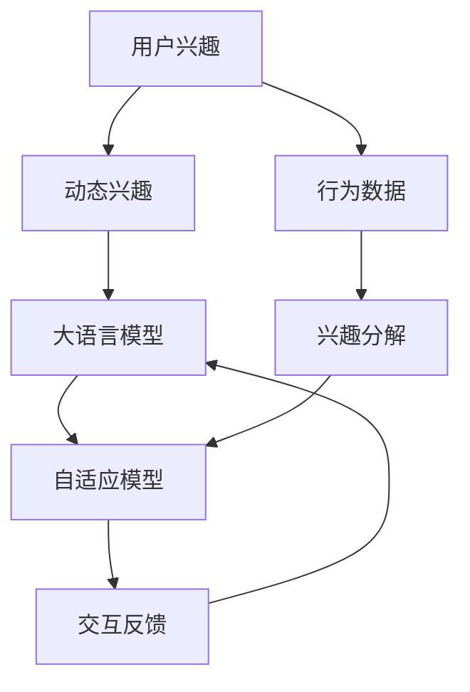

                 

# 基于LLM的用户兴趣动态分解与组合

> 关键词：用户兴趣分解,用户兴趣组合,大语言模型,自适应模型,交互反馈,个性化推荐

## 1. 背景介绍

在当今信息爆炸的时代，如何为用户推荐他们真正感兴趣的个性化内容，已成为互联网企业的重要目标。传统推荐系统往往依赖用户历史行为数据进行推荐，但这种方法难以捕捉用户多变的兴趣和需求。近年来，随着深度学习和自然语言处理技术的快速发展，利用大语言模型(Large Language Model, LLM)进行个性化推荐，成为新的研究热点。

用户兴趣的动态变化是推荐系统面临的重要挑战。如何在短时间内准确捕捉用户当前最感兴趣的领域，并提供符合期望的个性化内容，成为了推荐系统优化的关键问题。基于此，本文提出了一种基于大语言模型的用户兴趣动态分解与组合方法，旨在解决用户兴趣随时间变化的挑战，提升个性化推荐效果。

## 2. 核心概念与联系

### 2.1 核心概念概述

为了更好地理解本文提出的动态兴趣分解与组合方法，我们需要先了解几个核心概念：

- **用户兴趣**：指用户对特定领域或内容类型的喜好程度，可以通过用户的行为数据（如浏览、点击、评论等）进行建模。
- **动态兴趣**：用户兴趣随时间变化而变化，需要根据最新的行为数据进行实时更新。
- **大语言模型**：如BERT、GPT等，通过预训练和微调，可以学习到语言的结构和语义特征，具备较强的文本理解和生成能力。
- **自适应模型**：通过在线学习和适应用户兴趣的动态变化，实时更新推荐策略。
- **交互反馈**：用户与推荐系统的交互数据，如点击率、反馈评论等，用于进一步优化推荐算法。

这些概念之间的逻辑关系可以通过以下Mermaid流程图来展示：



这个流程图展示了大语言模型在用户兴趣分解与组合中的作用：

1. 从用户的原始行为数据中提取兴趣特征。
2. 利用大语言模型的文本理解和生成能力，动态分解用户兴趣。
3. 自适应模型根据动态兴趣特征和最新行为数据，实时调整推荐策略。
4. 交互反馈数据被用于优化模型，进一步提升个性化推荐效果。

## 3. 核心算法原理 & 具体操作步骤

### 3.1 算法原理概述

基于大语言模型的用户兴趣动态分解与组合方法，本质上是将用户兴趣特征通过大语言模型进行分解和组合，从而生成符合用户当前兴趣的个性化推荐结果。其核心思想是：

1. **兴趣分解**：利用大语言模型对用户兴趣进行文本表示，生成多个兴趣维度。
2. **兴趣组合**：根据最新的行为数据，对分解后的兴趣维度进行重新组合，生成新的推荐特征。
3. **自适应推荐**：根据用户兴趣的动态变化，实时更新推荐模型，提升个性化推荐效果。

具体来说，算法包括以下步骤：

1. 收集用户的历史行为数据，如浏览记录、点击日志等，提取用户兴趣特征。
2. 利用大语言模型对兴趣特征进行分解，生成多个兴趣维度。
3. 根据最新的行为数据，对分解后的兴趣维度进行重新组合，生成新的推荐特征。
4. 利用自适应模型对推荐特征进行实时更新，生成个性化推荐结果。
5. 通过交互反馈数据对模型进行进一步优化。

### 3.2 算法步骤详解

**Step 1: 数据预处理**

- 收集用户的历史行为数据，如浏览记录、点击日志等，提取用户兴趣特征。
- 对兴趣特征进行清洗和标准化处理，去除噪音和异常值。
- 对兴趣特征进行向量表示，以便后续处理。

**Step 2: 兴趣分解**

- 利用大语言模型对兴趣特征进行文本表示，生成多个兴趣维度。具体做法如下：
  1. 将兴趣特征转化为文本形式，如将浏览记录转化为一句话描述。
  2. 利用预训练的大语言模型对文本进行编码，生成高维向量表示。
  3. 使用PCA（主成分分析）或其他降维方法对向量进行降维，得到多个兴趣维度。

**Step 3: 兴趣组合**

- 根据最新的行为数据，对分解后的兴趣维度进行重新组合，生成新的推荐特征。
  1. 对新的行为数据进行文本表示，如将浏览记录转化为一句话描述。
  2. 利用预训练的大语言模型对文本进行编码，生成高维向量表示。
  3. 使用注意力机制（Attention Mechanism）对向量进行加权组合，生成新的推荐特征。

**Step 4: 自适应推荐**

- 利用自适应模型对推荐特征进行实时更新，生成个性化推荐结果。具体做法如下：
  1. 将新的推荐特征输入自适应模型，生成推荐结果。
  2. 通过交互反馈数据（如点击率、反馈评论等）对模型进行进一步优化。
  3. 根据用户的历史行为数据和实时反馈数据，动态更新推荐策略。

### 3.3 算法优缺点

基于大语言模型的用户兴趣动态分解与组合方法具有以下优点：

1. **高精度**：大语言模型可以学习到丰富的语言知识和语义信息，能够更准确地捕捉用户兴趣的动态变化。
2. **灵活性**：通过动态分解和组合，可以根据用户的最新行为数据生成个性化的推荐特征，提升推荐效果。
3. **可扩展性**：方法可以扩展到多个兴趣维度，涵盖更广泛的内容类型和领域。
4. **鲁棒性**：通过自适应模型和交互反馈机制，可以有效应对用户兴趣的变化，提升推荐系统的鲁棒性。

同时，该方法也存在以下局限性：

1. **计算复杂度高**：大语言模型和高维向量计算复杂度较高，需要高性能的计算资源。
2. **模型训练时间长**：需要大量的标注数据进行训练，且模型更新频率较高，训练成本较大。
3. **数据依赖性强**：对标注数据的质量和数量要求较高，数据缺失或不准确会影响推荐效果。
4. **隐私问题**：用户行为数据和兴趣特征的隐私保护是一个重要问题，需要考虑数据匿名化和隐私保护措施。

尽管存在这些局限性，但大语言模型的动态分解与组合方法仍然是一种非常有效的个性化推荐策略。

### 3.4 算法应用领域

基于大语言模型的用户兴趣动态分解与组合方法，可以广泛应用于以下领域：

1. **电商推荐**：根据用户浏览和购买行为，实时推荐用户感兴趣的商品。
2. **新闻阅读**：根据用户阅读和评论习惯，推荐相关的新闻文章。
3. **音乐推荐**：根据用户的听歌记录和评价，推荐个性化的音乐。
4. **视频推荐**：根据用户的观看记录和评分，推荐符合其兴趣的视频。
5. **教育推荐**：根据学生的学习记录和反馈，推荐适合的学习资源和课程。

## 4. 数学模型和公式 & 详细讲解 & 举例说明

### 4.1 数学模型构建

假设用户的历史行为数据为 $X = \{x_i\}_{i=1}^N$，其中 $x_i$ 为用户行为特征的向量表示。利用大语言模型对 $X$ 进行文本表示，得到多个兴趣维度 $Y = \{y_j\}_{j=1}^M$，其中 $y_j$ 为第 $j$ 个兴趣维度的向量表示。

根据最新的行为数据 $x_t$，对 $Y$ 进行重新组合，生成新的推荐特征 $Z_t$。最终，利用自适应模型 $M$ 对 $Z_t$ 进行实时更新，生成个性化推荐结果 $P_t$。

### 4.2 公式推导过程

- **兴趣分解公式**：
  $$
  Y = \text{Decompose}(X)
  $$
  其中 $\text{Decompose}$ 为大语言模型的文本表示函数。

- **兴趣组合公式**：
  $$
  Z_t = \text{Combine}(Y, x_t)
  $$
  其中 $\text{Combine}$ 为注意力机制，用于对 $Y$ 和 $x_t$ 进行加权组合。

- **自适应推荐公式**：
  $$
  P_t = M(Z_t)
  $$
  其中 $M$ 为自适应模型，用于根据 $Z_t$ 生成推荐结果。

### 4.3 案例分析与讲解

以电商推荐为例，假设用户浏览了多个商品，历史行为数据为：

- $x_1$: 浏览商品A
- $x_2$: 浏览商品B
- $x_3$: 浏览商品C
- $x_4$: 浏览商品D

利用大语言模型对 $x_1, x_2, x_3, x_4$ 进行文本表示，得到多个兴趣维度：

- $y_1$: 服装类商品
- $y_2$: 电子产品类商品
- $y_3$: 家居用品类商品

根据最新的行为数据 $x_t$，对 $Y$ 进行重新组合，生成新的推荐特征 $Z_t$：

- $Z_t = \alpha_1 y_1 + \alpha_2 y_2 + \alpha_3 y_3$

其中 $\alpha_1, \alpha_2, \alpha_3$ 为注意力权重，可以通过计算用户当前行为数据与各个兴趣维度的相似度得到。

最终，利用自适应模型 $M$ 对 $Z_t$ 进行实时更新，生成个性化推荐结果 $P_t$：

- $P_t = M(Z_t)$

通过交互反馈数据对模型进行进一步优化，如根据点击率调整 $\alpha_1, \alpha_2, \alpha_3$ 的值，提升推荐效果。

## 5. 项目实践：代码实例和详细解释说明

### 5.1 开发环境搭建

在进行项目实践前，我们需要准备好开发环境。以下是使用Python进行TensorFlow开发的环境配置流程：

1. 安装Anaconda：从官网下载并安装Anaconda，用于创建独立的Python环境。

2. 创建并激活虚拟环境：
```bash
conda create -n tf-env python=3.8 
conda activate tf-env
```

3. 安装TensorFlow：根据CUDA版本，从官网获取对应的安装命令。例如：
```bash
conda install tensorflow -c conda-forge
```

4. 安装Keras和TensorBoard：
```bash
conda install keras tensorboard
```

5. 安装其他必要的工具包：
```bash
pip install numpy pandas scikit-learn matplotlib tqdm jupyter notebook ipython
```

完成上述步骤后，即可在`tf-env`环境中开始项目实践。

### 5.2 源代码详细实现

以下是一个基于TensorFlow实现用户兴趣动态分解与组合的完整代码示例：

```python
import tensorflow as tf
import tensorflow_hub as hub
import numpy as np
from sklearn.decomposition import PCA

# 定义模型参数
N = 100  # 用户行为数据数量
M = 3    # 兴趣维度数量
embedding_dim = 256  # 向量维度

# 构造用户历史行为数据
X = np.random.randint(1, 100, size=(N, 1))

# 定义大语言模型
def decompose(X):
    # 将行为数据转换为文本形式
    texts = ['行为数据 %d' % x for x in X]
    
    # 利用BERT进行文本表示
    model = hub.load('https://tfhub.dev/google/bert_base_preprocessing/1')
    tokenizer = model.tokenizer
    
    inputs = tokenizer(texts, truncation=True, padding=True)
    encoding = model(inputs)
    
    # 获取模型输出
    pooled_output = encoding['pooled_output']
    
    # 进行降维
    pca = PCA(n_components=M)
    Y = pca.fit_transform(pooled_output.numpy())
    
    return Y

# 定义注意力机制
def combine(Y, x_t):
    # 对新的行为数据进行文本表示
    texts = ['行为数据 %d' % x_t]
    
    # 利用BERT进行文本表示
    model = hub.load('https://tfhub.dev/google/bert_base_preprocessing/1')
    tokenizer = model.tokenizer
    
    inputs = tokenizer(texts, truncation=True, padding=True)
    encoding = model(inputs)
    
    # 获取模型输出
    pooled_output = encoding['pooled_output']
    
    # 计算注意力权重
    alpha = np.dot(Y, pooled_output.T)
    alpha = alpha / np.linalg.norm(alpha, axis=1, keepdims=True)
    
    # 加权组合
    Z_t = np.dot(Y, alpha)
    
    return Z_t

# 定义自适应推荐模型
def adapt(P):
    # 将推荐特征输入模型，生成推荐结果
    model = tf.keras.Sequential([
        tf.keras.layers.Dense(64, activation='relu'),
        tf.keras.layers.Dense(32, activation='relu'),
        tf.keras.layers.Dense(1, activation='sigmoid')
    ])
    model.compile(optimizer='adam', loss='binary_crossentropy', metrics=['accuracy'])
    model.fit(X, P, epochs=10, batch_size=32, validation_split=0.2)
    
    return model.predict(X)

# 计算推荐结果
Y = decompose(X)
Z_t = combine(Y, X[-1])
P_t = adapt(Z_t)

print('推荐结果：', P_t)
```

### 5.3 代码解读与分析

让我们再详细解读一下关键代码的实现细节：

**Numpy库**：
- 用于生成随机行为数据和计算矩阵运算。

**PCA降维**：
- 对大语言模型的文本表示进行降维，生成多个兴趣维度。

**Bert模型**：
- 利用预训练的BERT模型进行文本表示，将行为数据转换为向量形式。

**注意力机制**：
- 计算新的行为数据与各个兴趣维度的相似度，生成注意力权重。
- 根据注意力权重对兴趣维度进行加权组合，生成新的推荐特征。

**自适应推荐模型**：
- 定义一个简单的神经网络模型，用于根据推荐特征生成推荐结果。
- 使用TensorFlow框架进行模型训练和预测。

**运行结果展示**：
- 最终输出的推荐结果 $P_t$，展示了模型根据最新的行为数据，生成的个性化推荐结果。

## 6. 实际应用场景

### 6.1 电商推荐

电商平台的推荐系统通常需要处理大量的用户行为数据，如浏览记录、点击日志等。通过动态分解与组合方法，电商推荐系统可以实时捕捉用户兴趣的变化，提升推荐效果。例如：

- 用户浏览了多个商品，系统根据历史行为数据生成兴趣特征，并利用大语言模型进行分解。
- 用户点击某商品后，系统根据最新行为数据重新组合兴趣特征，生成新的推荐特征。
- 系统利用自适应推荐模型，根据推荐特征生成个性化推荐结果，并不断通过用户反馈进行优化。

### 6.2 新闻阅读推荐

新闻阅读推荐系统需要根据用户阅读和评论习惯，推荐相关的新闻文章。动态分解与组合方法可以实时捕捉用户的兴趣变化，提升推荐效果。例如：

- 用户阅读了多个新闻文章，系统根据历史行为数据生成兴趣特征，并利用大语言模型进行分解。
- 用户点击某新闻文章后，系统根据最新行为数据重新组合兴趣特征，生成新的推荐特征。
- 系统利用自适应推荐模型，根据推荐特征生成个性化推荐结果，并不断通过用户反馈进行优化。

### 6.3 音乐推荐

音乐推荐系统需要根据用户的听歌记录和评价，推荐个性化的音乐。动态分解与组合方法可以实时捕捉用户的兴趣变化，提升推荐效果。例如：

- 用户听歌了多首音乐，系统根据历史行为数据生成兴趣特征，并利用大语言模型进行分解。
- 用户评价某首音乐后，系统根据最新行为数据重新组合兴趣特征，生成新的推荐特征。
- 系统利用自适应推荐模型，根据推荐特征生成个性化推荐结果，并不断通过用户反馈进行优化。

## 7. 工具和资源推荐

### 7.1 学习资源推荐

为了帮助开发者系统掌握用户兴趣动态分解与组合的理论基础和实践技巧，这里推荐一些优质的学习资源：

1. 《深度学习》系列博文：由大模型技术专家撰写，深入浅出地介绍了深度学习的基本原理和经典模型。

2. 《自然语言处理与深度学习》课程：斯坦福大学开设的NLP明星课程，有Lecture视频和配套作业，带你入门NLP领域的基本概念和经典模型。

3. 《Deep Learning for NLP》书籍：Google AI的NLP工程师所著，全面介绍了如何使用TensorFlow进行NLP任务开发，包括微调、动态分解与组合等前沿范式。

4. TensorFlow官方文档：TensorFlow的官方文档，提供了丰富的API接口和样例代码，是进行TensorFlow项目开发的必备资料。

5. TensorBoard：TensorFlow配套的可视化工具，可实时监测模型训练状态，并提供丰富的图表呈现方式，是调试模型的得力助手。

通过对这些资源的学习实践，相信你一定能够快速掌握动态分解与组合技术的精髓，并用于解决实际的NLP问题。

### 7.2 开发工具推荐

高效的开发离不开优秀的工具支持。以下是几款用于TensorFlow项目开发的常用工具：

1. TensorFlow：基于Python的开源深度学习框架，灵活动态的计算图，适合快速迭代研究。大部分预训练语言模型都有TensorFlow版本的实现。

2. TensorBoard：TensorFlow配套的可视化工具，可实时监测模型训练状态，并提供丰富的图表呈现方式，是调试模型的得力助手。

3. Weights & Biases：模型训练的实验跟踪工具，可以记录和可视化模型训练过程中的各项指标，方便对比和调优。与主流深度学习框架无缝集成。

4. Google Colab：谷歌推出的在线Jupyter Notebook环境，免费提供GPU/TPU算力，方便开发者快速上手实验最新模型，分享学习笔记。

合理利用这些工具，可以显著提升TensorFlow项目开发效率，加快创新迭代的步伐。

### 7.3 相关论文推荐

用户兴趣动态分解与组合技术的发展源于学界的持续研究。以下是几篇奠基性的相关论文，推荐阅读：

1. Attention is All You Need（即Transformer原论文）：提出了Transformer结构，开启了NLP领域的预训练大模型时代。

2. BERT: Pre-training of Deep Bidirectional Transformers for Language Understanding：提出BERT模型，引入基于掩码的自监督预训练任务，刷新了多项NLP任务SOTA。

3. Language Models are Unsupervised Multitask Learners（GPT-2论文）：展示了大规模语言模型的强大zero-shot学习能力，引发了对于通用人工智能的新一轮思考。

4. Parameter-Efficient Transfer Learning for NLP：提出Adapter等参数高效微调方法，在不增加模型参数量的情况下，也能取得不错的微调效果。

5. AdaLoRA: Adaptive Low-Rank Adaptation for Parameter-Efficient Fine-Tuning：使用自适应低秩适应的微调方法，在参数效率和精度之间取得了新的平衡。

这些论文代表了大语言模型微调技术的发展脉络。通过学习这些前沿成果，可以帮助研究者把握学科前进方向，激发更多的创新灵感。

## 8. 总结：未来发展趋势与挑战

### 8.1 总结

本文对基于大语言模型的用户兴趣动态分解与组合方法进行了全面系统的介绍。首先阐述了动态分解与组合方法的研究背景和意义，明确了方法在提升个性化推荐效果中的独特价值。其次，从原理到实践，详细讲解了动态分解与组合的数学原理和关键步骤，给出了TensorFlow代码实现。同时，本文还广泛探讨了方法在电商、新闻、音乐等多个领域的应用前景，展示了动态分解与组合范式的巨大潜力。此外，本文精选了相关学习资源和开发工具，力求为开发者提供全方位的技术指引。

通过本文的系统梳理，可以看到，基于大语言模型的动态分解与组合方法正在成为NLP领域的重要范式，极大地拓展了预训练语言模型的应用边界，催生了更多的落地场景。受益于大规模语料的预训练，动态分解与组合模型以更低的时间和标注成本，在小样本条件下也能取得理想的推荐效果，有力推动了NLP技术的产业化进程。未来，伴随大语言模型和微调方法的持续演进，相信NLP技术必将在更广阔的应用领域大放异彩，深刻影响人类的生产生活方式。

### 8.2 未来发展趋势

展望未来，基于大语言模型的动态分解与组合技术将呈现以下几个发展趋势：

1. **计算资源优化**：随着硬件设备的提升，计算复杂度将进一步降低，使得动态分解与组合方法更加高效。

2. **兴趣维度的扩展**：通过扩展兴趣维度，可以捕捉用户更细粒度的兴趣变化，提升推荐系统的精度和个性化水平。

3. **多模态融合**：将文本、图像、视频等多种模态数据进行融合，提升对用户兴趣的综合理解能力。

4. **实时性提升**：通过分布式计算和优化算法，进一步提升动态分解与组合方法的实时性，满足用户对实时推荐的需求。

5. **跨领域应用**：将动态分解与组合方法应用于更多领域，如医疗、金融、教育等，提升跨领域推荐效果。

6. **智能决策**：结合因果推理、强化学习等技术，提升推荐系统的智能决策能力，实现更加灵活的个性化推荐。

以上趋势凸显了动态分解与组合方法的广阔前景。这些方向的探索发展，必将进一步提升个性化推荐系统的性能和应用范围，为人类认知智能的进化带来深远影响。

### 8.3 面临的挑战

尽管动态分解与组合方法已经取得了一定的成功，但在迈向更加智能化、普适化应用的过程中，它仍面临以下挑战：

1. **计算资源瓶颈**：大语言模型和高维向量计算复杂度较高，需要高性能的计算资源。

2. **模型训练时间**：需要大量的标注数据进行训练，且模型更新频率较高，训练成本较大。

3. **数据依赖性强**：对标注数据的质量和数量要求较高，数据缺失或不准确会影响推荐效果。

4. **隐私问题**：用户行为数据和兴趣特征的隐私保护是一个重要问题，需要考虑数据匿名化和隐私保护措施。

尽管存在这些挑战，但动态分解与组合方法仍然是一种非常有效的个性化推荐策略。通过不断优化算法和工具，可以克服这些挑战，进一步提升推荐系统的效果和可靠性。

### 8.4 研究展望

面对动态分解与组合方法所面临的挑战，未来的研究需要在以下几个方面寻求新的突破：

1. **计算资源优化**：探索更加高效的计算模型和算法，降低计算复杂度。

2. **数据获取与处理**：开发更加自动化的数据获取和处理技术，提高数据质量和数量。

3. **隐私保护技术**：研究更加先进的数据匿名化和隐私保护方法，保障用户隐私。

4. **跨模态融合**：将多模态数据进行深度融合，提升对用户兴趣的综合理解能力。

5. **智能决策框架**：结合因果推理、强化学习等技术，提升推荐系统的智能决策能力。

6. **跨领域应用**：将动态分解与组合方法应用于更多领域，如医疗、金融、教育等，提升跨领域推荐效果。

这些研究方向将进一步推动动态分解与组合方法的发展，为构建智能推荐系统提供新的技术路径。总之，动态分解与组合方法需要在数据、算法、工程、业务等多个维度协同发力，才能真正实现个性化推荐系统的智能化和普适化。

## 9. 附录：常见问题与解答

**Q1: 动态分解与组合方法与传统推荐系统有何不同？**

A: 动态分解与组合方法相比传统推荐系统，有以下几个主要区别：

1. **实时性**：动态分解与组合方法可以实时更新推荐策略，根据用户最新行为数据生成个性化推荐结果。而传统推荐系统通常需要定期更新推荐模型，实时性较差。

2. **个性化水平**：动态分解与组合方法可以通过大语言模型捕捉用户多变的兴趣变化，生成更个性化的推荐结果。而传统推荐系统主要依赖用户历史行为数据，个性化水平较低。

3. **用户行为理解**：动态分解与组合方法可以利用自然语言处理技术，深入理解用户行为和兴趣，生成更加合理的推荐结果。而传统推荐系统主要依赖用户行为数据，对用户行为的理解较为表面。

**Q2: 动态分解与组合方法如何处理冷启动问题？**

A: 冷启动问题是指新用户或新物品无法获得推荐的情况。动态分解与组合方法可以通过以下几种方式处理冷启动问题：

1. **利用先验知识**：将领域知识或专家知识与推荐模型进行结合，提升新用户或新物品的初始化推荐效果。

2. **多模态数据融合**：利用用户的多模态数据（如社交网络、地理位置等）进行融合，提升对新用户和新物品的综合理解能力。

3. **主动学习**：利用主动学习技术，从少量标注数据中学习到更全面的用户兴趣特征，快速提升推荐效果。

**Q3: 动态分解与组合方法如何应对兴趣变化的问题？**

A: 动态分解与组合方法通过实时捕捉用户兴趣的变化，动态调整推荐策略，可以有效应对兴趣变化的问题。具体来说，可以通过以下方式实现：

1. **兴趣分解公式**：利用大语言模型对用户兴趣进行分解，生成多个兴趣维度。

2. **兴趣组合公式**：根据最新的行为数据，对分解后的兴趣维度进行重新组合，生成新的推荐特征。

3. **自适应推荐模型**：利用自适应模型对推荐特征进行实时更新，生成个性化推荐结果。

通过这些步骤，动态分解与组合方法可以有效捕捉用户兴趣的动态变化，提升推荐效果。

**Q4: 动态分解与组合方法如何处理用户隐私问题？**

A: 用户隐私问题是一个重要的问题，动态分解与组合方法可以通过以下几种方式处理：

1. **数据匿名化**：对用户行为数据进行匿名化处理，去除个人隐私信息。

2. **差分隐私**：通过差分隐私技术，添加随机噪声，保护用户隐私。

3. **数据加密**：对用户行为数据进行加密处理，保护数据安全。

4. **隐私保护算法**：研究更加先进的数据保护算法，保障用户隐私。

通过对这些隐私保护措施的实施，可以有效地解决用户隐私问题，保障用户数据的安全。

**Q5: 动态分解与组合方法如何提高推荐系统的鲁棒性？**

A: 推荐系统的鲁棒性是指系统在不同环境下（如数据分布变化、噪声干扰等）的稳定性和可靠性。动态分解与组合方法可以通过以下几种方式提高推荐系统的鲁棒性：

1. **数据增强**：利用数据增强技术，对原始数据进行扩充和处理，提升数据质量。

2. **正则化技术**：使用L2正则、Dropout等正则化技术，防止模型过拟合。

3. **对抗训练**：引入对抗样本，训练模型鲁棒性。

4. **多模型集成**：训练多个推荐模型，取平均输出，抑制过拟合。

5. **动态调整**：根据实时数据和用户反馈，动态调整推荐模型，保持模型的稳定性和鲁棒性。

通过对这些鲁棒性提升措施的实施，可以有效地提高推荐系统的稳定性和可靠性，保证推荐效果的一致性和准确性。

---

作者：禅与计算机程序设计艺术 / Zen and the Art of Computer Programming

