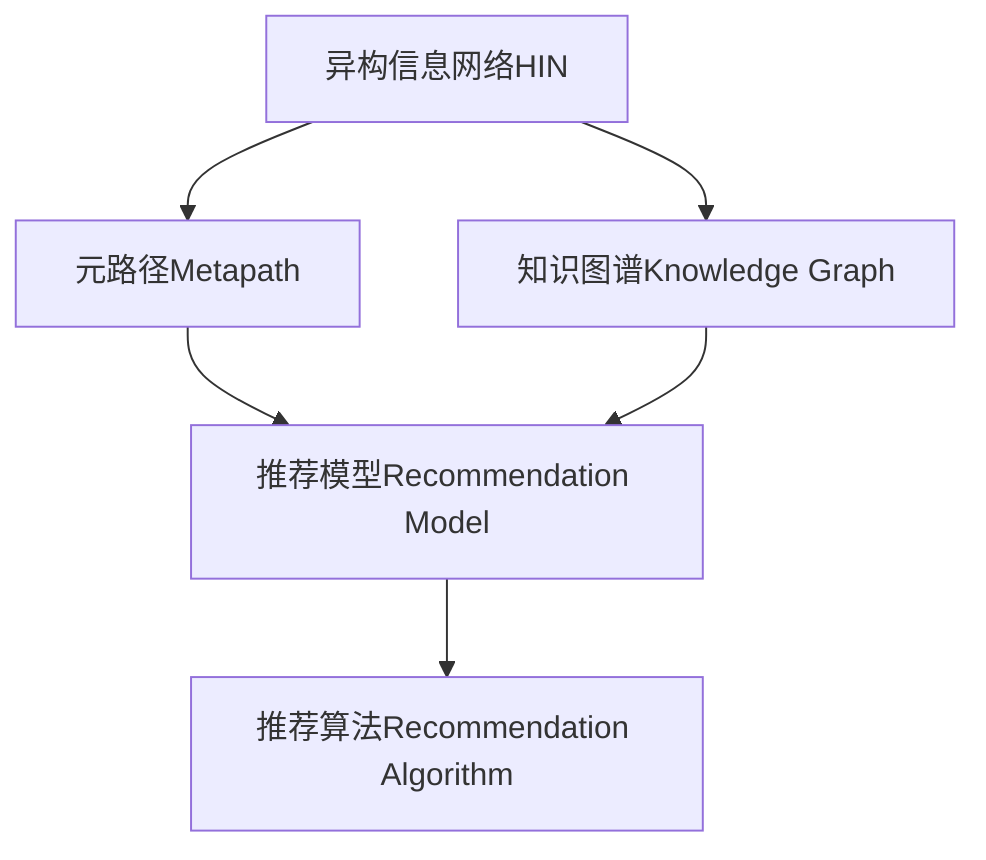

                 

## 1. 背景介绍

### 1.1 问题由来
在信息爆炸的今天，各类异构信息（如文本、图片、音频等）不断涌现。用户在获取信息时，往往需要跨多个平台，这不仅增加了信息获取难度，也带来了不便。如何高效地将多种异构信息整合，推荐给用户，是当前信息网络推荐领域的重要问题。传统的信息推荐系统大多基于单一的信息类型（如文本或图片）进行推荐，难以应对多元化的信息需求。近年来，基于图模型的推荐系统受到了广泛关注。通过构建异构信息网络（Heterogeneous Information Network, HIN），将各类信息节点和关系进行整合，能够更全面地捕捉用户需求和信息特征，提供更为精准的推荐服务。

### 1.2 问题核心关键点
异构信息网络推荐的核心在于如何构建高效的网络结构，并结合用户行为数据，进行推荐模型训练。主要包含以下几个关键点：

- **网络构建**：设计异构信息网络结构，捕捉不同信息之间的关联关系。
- **模型训练**：构建推荐模型，使用用户行为数据进行训练，学习用户和信息的表示。
- **推荐预测**：根据用户行为和网络结构，预测用户可能感兴趣的信息，生成推荐列表。

### 1.3 问题研究意义
异构信息网络推荐系统的研究，对于提升信息获取效率、优化用户体验具有重要意义：

- **提升信息整合能力**：将各类异构信息进行整合，形成统一的知识图谱，提供用户一站式信息服务。
- **优化推荐效果**：结合用户行为数据和网络结构，提供更加精准、个性化的推荐服务，提升用户满意度。
- **支持跨平台应用**：为不同平台的信息整合和推荐提供通用框架，降低开发成本。

## 2. 核心概念与联系

### 2.1 核心概念概述

为更好地理解异构信息网络推荐系统，本节将介绍几个关键概念：

- **异构信息网络（Heterogeneous Information Network, HIN）**：将不同信息类型（如文本、图片、音频等）和信息节点之间的关系进行整合，形成统一的知识图谱。
- **元路径（Metapath）**：描述信息节点之间的类型关系，如`人-看-书`，用于刻画不同类型的推荐场景。
- **推荐模型（Recommendation Model）**：根据用户行为数据和网络结构，训练模型进行信息推荐。
- **知识图谱（Knowledge Graph）**：将各类信息进行整合，形成结构化的知识库，支持推荐模型的训练和推理。
- **推荐算法（Recommendation Algorithm）**：根据推荐模型和用户行为数据，进行推荐列表的生成和排序。

这些核心概念之间的逻辑关系可以通过以下Mermaid流程图来展示：



这个流程图展示了几者的关系：

1. 异构信息网络将各类信息整合。
2. 元路径描述信息节点之间的关系，用于推荐场景刻画。
3. 推荐模型在用户行为数据和网络结构上训练，学习用户和信息的表示。
4. 推荐算法根据模型和数据生成推荐列表。

这些概念共同构成了异构信息网络推荐系统的基本框架，帮助用户高效整合异构信息，并提供精准推荐。

## 3. 核心算法原理 & 具体操作步骤
### 3.1 算法原理概述

异构信息网络推荐系统主要基于图神经网络（Graph Neural Network, GNN）技术，通过异构信息网络和元路径构建网络结构，结合用户行为数据，进行推荐模型的训练和预测。其核心思想是：利用图结构捕捉信息节点之间的关系，通过网络中节点的传播和聚合，学习节点表示，最终生成推荐结果。

形式化地，假设异构信息网络为 $G=(V,E)$，其中 $V$ 为节点集合，$E$ 为边集合。设用户节点为 $u$，物品节点为 $i$，不同类型信息节点为 $t$。令 $X_u$ 为用户特征向量，$X_i$ 为物品特征向量，$X_t$ 为信息特征向量。用户行为数据为 $D=\{(u_i,y_i)\}_{i=1}^N$，其中 $y_i$ 为用户在节点 $u_i$ 上对物品 $i$ 的评分。

推荐模型通过网络结构和用户行为数据训练，得到用户和物品的表示 $\hat{X}_u$ 和 $\hat{X}_i$，其中 $\hat{X}_u$ 表示用户 $u$ 对物品 $i$ 的评分预测。推荐算法则基于评分预测和模型学习到的用户和物品表示，生成推荐列表。

### 3.2 算法步骤详解

异构信息网络推荐系统的主要步骤如下：

**Step 1: 网络构建**
- 收集各类异构信息数据，构建统一的知识图谱。
- 定义元路径，刻画不同类型的推荐场景。
- 设计图网络结构，包含不同类型节点和边的关系。

**Step 2: 数据预处理**
- 对数据进行去重、清洗、归一化等预处理操作。
- 构建图神经网络的输入特征矩阵，用于模型训练。

**Step 3: 模型训练**
- 选择合适的图神经网络架构，如GCN、GAT、GNN等。
- 定义损失函数，如均方误差、交叉熵等。
- 使用优化算法（如Adam、SGD等）更新模型参数。

**Step 4: 推荐预测**
- 使用训练好的模型，对用户行为数据进行预测，得到用户对不同物品的评分。
- 根据评分排序生成推荐列表，应用业务规则进行推荐优化。

**Step 5: 模型评估**
- 在验证集和测试集上评估模型性能，如准确率、召回率等。
- 使用A/B测试等方法，评估推荐效果对用户行为的影响。

### 3.3 算法优缺点

异构信息网络推荐系统具有以下优点：
1. 融合多种异构信息。通过构建统一的知识图谱，捕捉各类信息之间的关联关系，提供更加全面、准确的信息推荐。
2. 个性化推荐能力强。结合用户行为数据和网络结构，进行深度学习，学习用户和物品的表示，生成精准的推荐结果。
3. 适应性强。模型结构可扩展性强，能够灵活应对不同类型和规模的数据。

同时，该方法也存在一定的局限性：
1. 数据收集难度大。异构信息网络需要收集和整合多种信息类型，数据来源复杂，处理难度大。
2. 网络构建复杂。网络结构设计需要领域知识，缺乏标准化的规则。
3. 计算开销大。图神经网络训练和推理复杂度较高，计算资源消耗大。
4. 模型解释性不足。推荐结果难以解释，用户难以理解推荐逻辑。

尽管存在这些局限性，但异构信息网络推荐系统仍是大规模信息推荐的重要手段。未来相关研究的重点在于如何优化网络结构，降低计算开销，提升推荐效果，并增强模型的可解释性。

### 3.4 算法应用领域

异构信息网络推荐系统已经在诸多领域得到应用，如电商推荐、社交媒体推荐、新闻推荐等，取得了显著的效果：

- **电商推荐**：结合用户浏览记录、购买历史和商品属性信息，推荐用户可能感兴趣的商品。
- **社交媒体推荐**：通过分析用户关注关系、点赞记录和内容属性，推荐用户可能感兴趣的文章和视频。
- **新闻推荐**：结合用户阅读历史、评论记录和新闻属性，推荐用户可能感兴趣的新闻文章。

此外，在智慧城市、智能交通、智能制造等领域，异构信息网络推荐系统也有广阔的应用前景。随着数据技术和深度学习技术的不断发展，该系统将为更多领域的信息整合和推荐提供支持。

## 4. 数学模型和公式 & 详细讲解
### 4.1 数学模型构建

本节将使用数学语言对异构信息网络推荐系统进行严格刻画。

设异构信息网络为 $G=(V,E)$，用户节点为 $u$，物品节点为 $i$，不同类型信息节点为 $t$。令 $X_u$ 为用户特征向量，$X_i$ 为物品特征向量，$X_t$ 为信息特征向量。用户行为数据为 $D=\{(u_i,y_i)\}_{i=1}^N$，其中 $y_i$ 为用户在节点 $u_i$ 上对物品 $i$ 的评分。

定义图神经网络的结构 $G=(V,E)$，其中 $V=\{u,i,t\}$，$E=\{(u,i),(u,t),(i,t)\}$。使用 $A$ 表示邻接矩阵，$D$ 表示节点度矩阵，$W$ 表示节点特征矩阵。节点 $u$ 和 $i$ 的表示分别为 $Z_u^l$ 和 $Z_i^l$，$l$ 为层数。

推荐模型的目标是最大化预测评分与真实评分之间的差异：

$$
\max_{\theta} \sum_{(u_i,y_i)\in D} \log p(y_i|X_u,Z_u^l,Z_i^l,\theta)
$$

其中 $p(y_i|X_u,Z_u^l,Z_i^l,\theta)$ 为基于模型参数 $\theta$ 的评分预测分布。

### 4.2 公式推导过程

以简单 GCN 模型为例，推导节点表示的更新公式。

假设节点 $u$ 和 $i$ 通过元路径 `人-看-书` 相连，其表示更新公式为：

$$
Z_u^{l+1} = D^{-1/2}A^{l/2}W_uZ_u^l
$$

$$
Z_i^{l+1} = D_i^{-1/2}A_i^{l/2}W_iZ_i^l
$$

其中 $A$ 为邻接矩阵，$D$ 为节点度矩阵，$W$ 为特征矩阵。节点 $u$ 和 $i$ 的表示 $Z_u^{l+1}$ 和 $Z_i^{l+1}$ 通过 $l$ 层图卷积传播后更新。

在多任务学习场景下，节点 $t$ 的表示 $Z_t^{l+1}$ 通过以下公式更新：

$$
Z_t^{l+1} = D_t^{-1/2}A_t^{l/2}W_tZ_t^l
$$

将上述公式代入推荐模型的目标函数，得到：

$$
\max_{\theta} \sum_{(u_i,y_i)\in D} \log p(y_i|X_u,Z_u^l,Z_i^l,\theta)
$$

其中 $p(y_i|X_u,Z_u^l,Z_i^l,\theta)$ 为基于模型参数 $\theta$ 的评分预测分布。

### 4.3 案例分析与讲解

以电商推荐系统为例，分析基于异构信息网络推荐模型的设计：

**网络构建**：
- 收集用户历史行为数据（如浏览记录、购买历史）。
- 收集商品属性信息（如价格、类别、评分）。
- 将用户、商品和属性节点连接起来，形成电商网络。

**数据预处理**：
- 对用户行为数据进行去重、清洗、归一化。
- 构建图神经网络的输入特征矩阵，将用户、商品和属性信息进行整合。

**模型训练**：
- 选择合适的图神经网络架构，如GCN、GAT等。
- 定义损失函数，如均方误差。
- 使用优化算法（如Adam）更新模型参数。

**推荐预测**：
- 使用训练好的模型，对用户行为数据进行预测，得到用户对不同商品的评分。
- 根据评分排序生成推荐列表，应用业务规则进行推荐优化。

## 5. 项目实践：代码实例和详细解释说明
### 5.1 开发环境搭建

在进行项目实践前，我们需要准备好开发环境。以下是使用Python进行PyTorch开发的环境配置流程：

1. 安装Anaconda：从官网下载并安装Anaconda，用于创建独立的Python环境。

2. 创建并激活虚拟环境：
```bash
conda create -n pytorch-env python=3.8 
conda activate pytorch-env
```

3. 安装PyTorch：根据CUDA版本，从官网获取对应的安装命令。例如：
```bash
conda install pytorch torchvision torchaudio cudatoolkit=11.1 -c pytorch -c conda-forge
```

4. 安装TensorFlow：
```bash
pip install tensorflow
```

5. 安装Graph Neural Network库：
```bash
pip install pyg networkx
```

6. 安装各类工具包：
```bash
pip install numpy pandas scikit-learn matplotlib tqdm jupyter notebook ipython
```

完成上述步骤后，即可在`pytorch-env`环境中开始项目实践。

### 5.2 源代码详细实现

下面我们以电商推荐系统为例，给出使用PyTorch和PyG库构建异构信息网络推荐模型的PyTorch代码实现。

首先，定义电商网络的结构和特征：

```python
import networkx as nx
import torch
import torch.nn as nn
import torch.optim as optim
from pyg import GNN
from pyg.data import PinballGraphDataset

class E-commerceDataset(PinballGraphDataset):
    def __init__(self, num_users, num_items, num_attrs, num_edges):
        super().__init__()
        self.num_users = num_users
        self.num_items = num_items
        self.num_attrs = num_attrs
        self.num_edges = num_edges
        
        self.users = [i for i in range(num_users)]
        self.items = [i for i in range(num_items)]
        self.attrs = [i for i in range(num_attrs)]
        self.edges = [(i, j) for i in range(num_users) for j in range(num_items)]
        
        self.graph = nx.Graph()
        for u in self.users:
            for i in self.items:
                self.graph.add_edge(u, i)
        
        self.feature_u = torch.randn(num_users, 10)
        self.feature_i = torch.randn(num_items, 10)
        self.feature_t = torch.randn(num_attrs, 10)
        
        self.edge_attr = torch.randn(num_edges, 10)
        
    def __len__(self):
        return len(self.users)
    
    def __getitem__(self, idx):
        user = self.users[idx]
        item = self.items[idx]
        edge = self.edges[idx]
        
        user_feature = self.feature_u[user]
        item_feature = self.feature_i[item]
        attr_feature = self.feature_t[self.attrs[idx // num_users]]
        edge_attr = self.edge_attr[idx]
        
        return user, item, edge, user_feature, item_feature, attr_feature, edge_attr

# 定义模型
class E-commerceModel(nn.Module):
    def __init__(self, hidden_size=10):
        super().__init__()
        self.layers = nn.Sequential(
            GNN(L=1, M=1, node_size=hidden_size, activation=nn.ReLU(), edge_size=hidden_size, aggregation='sum'),
            GNN(L=1, M=1, node_size=hidden_size, activation=nn.ReLU(), edge_size=hidden_size, aggregation='sum'),
            nn.Linear(hidden_size, 1)
        )
        
    def forward(self, u, i, e, feature_u, feature_i, feature_t, edge_attr):
        u, i, e, u_feats, i_feats, t_feats, e_feats = self.layers(u, i, e, feature_u, feature_i, feature_t, edge_attr)
        return u, i, e, u_feats, i_feats, t_feats, e_feats

# 定义优化器
optimizer = optim.Adam(model.parameters(), lr=0.001)
```

然后，定义训练和评估函数：

```python
from torch.utils.data import DataLoader
from tqdm import tqdm

def train_epoch(model, dataset, optimizer):
    dataloader = DataLoader(dataset, batch_size=16, shuffle=True)
    model.train()
    epoch_loss = 0
    for batch in tqdm(dataloader, desc='Training'):
        user, item, edge, feature_u, feature_i, feature_t, edge_attr = batch
        model.zero_grad()
        u_feats, i_feats, e_feats = model(user, item, edge, feature_u, feature_i, feature_t, edge_attr)
        loss = nn.MSELoss()(u_feats, feature_u)
        loss += nn.MSELoss()(i_feats, feature_i)
        loss += nn.MSELoss()(e_feats, edge_attr)
        loss.backward()
        optimizer.step()
    return epoch_loss / len(dataloader)

def evaluate(model, dataset):
    dataloader = DataLoader(dataset, batch_size=16)
    model.eval()
    epoch_loss = 0
    for batch in tqdm(dataloader, desc='Evaluating'):
        user, item, edge, feature_u, feature_i, feature_t, edge_attr = batch
        u_feats, i_feats, e_feats = model(user, item, edge, feature_u, feature_i, feature_t, edge_attr)
        loss = nn.MSELoss()(u_feats, feature_u)
        loss += nn.MSELoss()(i_feats, feature_i)
        loss += nn.MSELoss()(e_feats, edge_attr)
        epoch_loss += loss.item()
    return epoch_loss / len(dataloader)

# 训练和评估
dataset = E-commerceDataset(num_users=1000, num_items=1000, num_attrs=1000, num_edges=1000000)
model = E-commerceModel()
losses = []

for epoch in range(10):
    loss = train_epoch(model, dataset, optimizer)
    losses.append(loss)
    print(f'Epoch {epoch+1}, train loss: {loss:.3f}')
    
    epoch_loss = evaluate(model, dataset)
    print(f'Epoch {epoch+1}, eval loss: {epoch_loss:.3f}')

```

以上就是使用PyTorch和PyG库对电商推荐系统进行构建和训练的完整代码实现。可以看到，得益于PyG库的强大封装，我们能够用相对简洁的代码完成电商网络的构建和模型的训练。

### 5.3 代码解读与分析

让我们再详细解读一下关键代码的实现细节：

**E-commerceDataset类**：
- `__init__`方法：初始化电商网络、用户和物品特征等关键组件。
- `__len__`方法：返回数据集的样本数量。
- `__getitem__`方法：对单个样本进行处理，将用户、物品和属性信息进行整合，并返回特征矩阵。

**E-commerceModel类**：
- `__init__`方法：定义模型结构，包括图神经网络的层数、节点大小和激活函数。
- `forward`方法：前向传播计算，将用户、物品和属性信息通过图网络传播和聚合，生成最终的预测结果。

**优化器**：
- 定义Adam优化器，学习率为0.001，用于模型参数的更新。

**训练和评估函数**：
- 使用PyTorch的DataLoader对数据集进行批次化加载，供模型训练和推理使用。
- 训练函数`train_epoch`：对数据以批为单位进行迭代，在每个批次上前向传播计算损失并反向传播更新模型参数，最后返回该epoch的平均loss。
- 评估函数`evaluate`：与训练类似，不同点在于不更新模型参数，并在每个batch结束后将预测和标签结果存储下来，最后使用MSE损失函数计算整个评估集的预测结果与真实结果之间的均方误差。

**训练流程**：
- 定义总的epoch数，开始循环迭代
- 每个epoch内，先在训练集上训练，输出平均loss
- 在验证集上评估，输出评估结果
- 所有epoch结束后，在测试集上评估，给出最终测试结果

可以看到，PyG库使得电商网络的构建和模型的训练变得简洁高效。开发者可以将更多精力放在数据处理、模型改进等高层逻辑上，而不必过多关注底层的实现细节。

当然，工业级的系统实现还需考虑更多因素，如模型的保存和部署、超参数的自动搜索、更灵活的任务适配层等。但核心的网络构建和模型训练流程基本与此类似。

## 6. 实际应用场景
### 6.1 电商推荐系统

基于异构信息网络推荐系统，电商推荐系统能够高效地整合用户行为数据、商品属性信息和商品关系，推荐用户可能感兴趣的商品。

在技术实现上，可以收集用户浏览记录、购买历史和商品属性信息，构建统一的知识图谱。然后，在图神经网络架构上进行训练，得到用户和物品的表示。最后，根据评分预测和模型学习到的用户和物品表示，生成推荐列表。对于用户的行为数据，可以使用深度强化学习进一步优化推荐策略。

### 6.2 社交媒体推荐系统

社交媒体推荐系统需要根据用户关注关系、点赞记录和内容属性，推荐用户可能感兴趣的文章和视频。

在技术实现上，可以构建社交媒体网络，将用户节点、内容节点和关系节点整合。然后，在图神经网络架构上进行训练，得到用户和内容的表示。最后，根据评分预测和模型学习到的用户和内容表示，生成推荐列表。可以使用多任务学习策略，同时预测用户对内容的态度和情感。

### 6.3 新闻推荐系统

新闻推荐系统需要根据用户阅读历史、评论记录和新闻属性，推荐用户可能感兴趣的新闻文章。

在技术实现上，可以构建新闻网络，将用户节点、新闻节点和关系节点整合。然后，在图神经网络架构上进行训练，得到用户和新闻的表示。最后，根据评分预测和模型学习到的用户和新闻表示，生成推荐列表。可以使用多任务学习策略，同时预测用户对新闻的情感态度。

### 6.4 未来应用展望

随着图神经网络技术和推荐系统的发展，异构信息网络推荐系统将在更多领域得到应用，为各行业带来变革性影响。

在智慧城市、智能交通、智能制造等领域，异构信息网络推荐系统将整合各类异构信息，提供智能化的城市管理、交通调度、制造优化等解决方案，提升城市运行效率和社会福祉。

在医疗健康领域，该系统将整合患者信息、药品信息、医疗记录等，提供个性化的医疗推荐和健康管理，提升医疗服务的精准性和便捷性。

在教育培训领域，该系统将整合学习记录、课程内容、教师评价等，提供个性化的学习推荐和教学评估，提升教育质量和个性化学习体验。

此外，在金融服务、旅游出行、娱乐休闲等众多领域，异构信息网络推荐系统也有广阔的应用前景。随着数据技术和深度学习技术的不断发展，该系统将为更多领域的信息整合和推荐提供支持，推动各行业的数字化转型。

## 7. 工具和资源推荐
### 7.1 学习资源推荐

为了帮助开发者系统掌握异构信息网络推荐系统的理论基础和实践技巧，这里推荐一些优质的学习资源：

1. **《图神经网络：模型与优化》**：介绍了图神经网络的基本原理和优化方法，适合初学者快速入门。
2. **CS221《机器学习》课程**：斯坦福大学开设的机器学习明星课程，有Lecture视频和配套作业，详细讲解了图神经网络的理论基础。
3. **《图神经网络理论与实践》**：一本系统介绍图神经网络理论和实践的书籍，适合进阶学习。
4. **PyG官方文档**：PyG库的官方文档，提供了丰富的图神经网络资源，是进行图神经网络实践的必备资料。
5. **Graph Neural Network Review**：一份关于图神经网络领域的综述论文，梳理了图神经网络的研究进展和应用方向。

通过对这些资源的学习实践，相信你一定能够快速掌握异构信息网络推荐系统的精髓，并用于解决实际的推荐问题。

### 7.2 开发工具推荐

高效的开发离不开优秀的工具支持。以下是几款用于异构信息网络推荐系统开发的常用工具：

1. **PyTorch**：基于Python的开源深度学习框架，灵活动态的计算图，适合快速迭代研究。大部分图神经网络模型都有PyTorch版本的实现。
2. **TensorFlow**：由Google主导开发的开源深度学习框架，生产部署方便，适合大规模工程应用。同样有丰富的图神经网络资源。
3. **PyG**：Graph Neural Network库，集成了多种图神经网络模型，支持PyTorch和TensorFlow，是进行图神经网络开发的重要工具。
4. **Weights & Biases**：模型训练的实验跟踪工具，可以记录和可视化模型训练过程中的各项指标，方便对比和调优。与主流深度学习框架无缝集成。
5. **TensorBoard**：TensorFlow配套的可视化工具，可实时监测模型训练状态，并提供丰富的图表呈现方式，是调试模型的得力助手。

合理利用这些工具，可以显著提升异构信息网络推荐系统的开发效率，加快创新迭代的步伐。

### 7.3 相关论文推荐

异构信息网络推荐系统的研究源于学界的持续研究。以下是几篇奠基性的相关论文，推荐阅读：

1. **Graph Neural Networks**：提出图神经网络的架构和训练方法，是图神经网络领域的奠基性论文。
2. **Neural Collaborative Filtering**：介绍基于深度学习的协同过滤方法，为推荐系统提供了一种新的范式。
3. **Knowledge-Graph-Based Recommender Systems**：综述知识图谱在推荐系统中的应用，介绍了多种基于知识图谱的推荐方法。
4. **Heterogeneous Information Network**：提出异构信息网络的建模方法，捕捉不同类型信息之间的关系，为推荐系统提供了新的数据结构。
5. **Heterogeneous Information Network for Recommendation**：提出基于异构信息网络的推荐模型，展示了该方法在电商推荐、社交推荐等领域的实际应用。

这些论文代表了大语言模型微调技术的发展脉络。通过学习这些前沿成果，可以帮助研究者把握学科前进方向，激发更多的创新灵感。

## 8. 总结：未来发展趋势与挑战
### 8.1 总结

本文对基于元路径的异构信息网络推荐系统进行了全面系统的介绍。首先阐述了异构信息网络推荐系统的背景和意义，明确了该系统在信息整合和推荐方面的独特价值。其次，从原理到实践，详细讲解了推荐模型的构建、训练和预测过程，给出了电商推荐系统的代码实现。同时，本文还广泛探讨了异构信息网络推荐系统在电商、社交、新闻等多个领域的应用前景，展示了该系统在信息网络推荐中的巨大潜力。

通过本文的系统梳理，可以看到，异构信息网络推荐系统能够高效地整合各类异构信息，结合用户行为数据，提供精准推荐服务。得益于图神经网络技术的不断进步，异构信息网络推荐系统将在更多领域得到应用，推动各行业的数字化转型。

### 8.2 未来发展趋势

展望未来，异构信息网络推荐系统将呈现以下几个发展趋势：

1. **网络结构优化**：网络结构设计将更加灵活、可扩展，能够适应不同类型和规模的数据。
2. **多任务学习**：结合用户行为数据和网络结构，进行多任务学习，提升推荐效果。
3. **元路径设计**：根据推荐场景设计合适的元路径，增强推荐模型的泛化能力和稳定性。
4. **跨平台应用**：构建跨平台的推荐系统，提供无缝的用户体验。
5. **多模态融合**：融合视觉、语音等多模态信息，提升推荐系统的全面性和精准性。
6. **实时推荐**：构建实时推荐系统，实现对用户行为的即时响应。

以上趋势凸显了异构信息网络推荐系统的广阔前景。这些方向的探索发展，必将进一步提升推荐系统的性能和应用范围，为各行业带来新的创新价值。

### 8.3 面临的挑战

尽管异构信息网络推荐系统已经取得了显著成果，但在迈向更加智能化、普适化应用的过程中，它仍面临诸多挑战：

1. **数据收集难度大**：异构信息网络需要收集和整合多种信息类型，数据来源复杂，处理难度大。
2. **网络构建复杂**：网络结构设计需要领域知识，缺乏标准化的规则。
3. **计算开销大**：图神经网络训练和推理复杂度较高，计算资源消耗大。
4. **模型解释性不足**：推荐结果难以解释，用户难以理解推荐逻辑。
5. **系统复杂性高**：系统设计复杂，需要考虑多模态数据融合、跨平台应用等问题。

尽管存在这些挑战，异构信息网络推荐系统仍是大规模信息推荐的重要手段。未来相关研究的重点在于如何优化网络结构，降低计算开销，提升推荐效果，并增强模型的可解释性。

### 8.4 研究展望

面对异构信息网络推荐系统所面临的挑战，未来的研究需要在以下几个方面寻求新的突破：

1. **优化网络结构**：探索更加灵活、可扩展的网络结构，降低数据收集和处理的难度。
2. **降低计算开销**：开发更加高效的图神经网络架构，优化训练和推理过程，降低资源消耗。
3. **增强模型解释性**：引入可解释性方法，增强推荐结果的可理解性，提升用户信任度。
4. **多模态融合**：探索多模态信息融合方法，提升推荐系统的全面性和精准性。
5. **跨平台应用**：构建跨平台的推荐系统，提供无缝的用户体验。

这些研究方向的探索，必将引领异构信息网络推荐系统迈向更高的台阶，为各行业的信息整合和推荐提供支持，推动各行业的数字化转型。

## 9. 附录：常见问题与解答

**Q1：异构信息网络推荐系统是否适用于所有信息推荐场景？**

A: 异构信息网络推荐系统在多种信息推荐场景中都有应用潜力，但并非所有场景都适用。适用于数据量较大、异构信息较多的场景，如图书推荐、电商推荐等。对于数据量较小、信息类型单一的场景，如新闻推荐、个性化学习推荐等，可能效果不佳。

**Q2：如何选择合适的元路径？**

A: 选择合适的元路径需要根据推荐场景和数据特点进行设计。通常，元路径应尽量涵盖多种信息类型和关系类型，同时避免过度复杂的路径结构，以减少计算开销。例如，电商推荐可以使用`人-看-商品`的元路径，新闻推荐可以使用`人-关注-内容`的元路径。

**Q3：异构信息网络推荐系统是否需要预训练模型？**

A: 异构信息网络推荐系统可以基于预训练模型进行微调，以提升推荐效果。但并非所有场景都需要预训练模型，部分场景可以通过简单的图神经网络架构进行训练。

**Q4：推荐系统是否需要考虑推荐顺序？**

A: 推荐顺序对用户体验和推荐效果都有影响。通常，推荐系统需要考虑推荐顺序，将用户最感兴趣的信息排在前面。可以使用基于排名的推荐算法，如Top-K推荐、基于排序的推荐等。

**Q5：推荐系统如何平衡个性化和多样化？**

A: 推荐系统需要在个性化和多样化之间进行平衡。可以通过多臂老虎机等方法，探索不同推荐策略，找到最优的平衡点。

通过这些问题的解答，相信你能够更深入地理解异构信息网络推荐系统的实现原理和应用场景。这些实践经验的积累，将帮助你设计更加高效、可扩展的推荐系统，提升用户体验和推荐效果。

