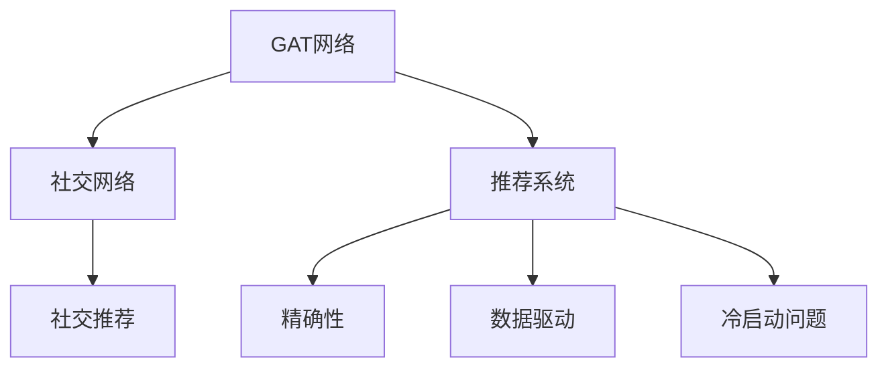

                 

# 基于图注意力网络的社交推荐精确性提升

> 关键词：图注意力网络(Graph Attention Network, GAT), 社交网络, 推荐系统, 精确性, 数据驱动, 深度学习

## 1. 背景介绍

### 1.1 问题由来
在当今数字化时代，社交网络已经深刻影响着人们的日常交流和行为模式。基于社交网络的数据挖掘和应用，如推荐系统，成为了热点研究领域。推荐系统能够根据用户的历史行为和社交关系，为其推荐可能感兴趣的内容或产品，极大地提升了用户体验和满意度。

然而，现有的推荐系统面临着精确性不足的问题。当前大多数推荐系统主要依赖于基于矩阵分解的协同过滤方法，难以处理复杂的社交关系，并忽略用户之间的异质性和多样性。此外，推荐的准确性往往依赖于大量的用户行为数据，对于冷启动用户和新商品的推荐效果不佳。

为了解决这些问题，研究人员近年来提出了基于图神经网络的推荐模型，利用图结构特征来提升推荐系统的精确性和鲁棒性。其中，图注意力网络(Graph Attention Network, GAT)作为一类先进的图神经网络，具有自适应性和全局信息聚合能力，成为推荐系统的热门选择。

### 1.2 问题核心关键点
GAT网络通过对图结构的节点和边赋予注意力权重，能够自动学习节点间的相关性，提升推荐结果的准确性。在社交推荐任务中，GAT网络可以利用用户与物品之间的连接关系，以及用户与用户之间的社交关系，进行信息融合和特征挖掘。

当前，GAT网络在社交推荐任务中的应用已有多项研究，但关于如何提升GAT网络推荐的精确性，仍需进一步研究。通过更高效地融合社交图谱的特征信息，并结合优化推荐算法，可以显著提升GAT网络在社交推荐任务中的精确性。

## 2. 核心概念与联系

### 2.1 核心概念概述

为更好地理解基于图注意力网络的社交推荐精确性提升方法，本节将介绍几个密切相关的核心概念：

- 图注意力网络(Graph Attention Network, GAT)：一种利用图结构进行特征学习的深度学习模型，通过在图上进行卷积操作，自动学习节点间的相关性，适用于图数据驱动的任务。

- 推荐系统(Recommendation System)：根据用户的历史行为和兴趣，推荐可能感兴趣的内容或产品，提升用户体验的系统。

- 社交推荐(Social Recommendation)：结合用户之间的社交关系进行推荐，提高推荐的个性化和多样性。

- 精确性(Accuracy)：推荐系统推荐的物品与用户真实兴趣的一致性程度，是衡量推荐系统性能的重要指标。

- 数据驱动(Data-Driven)：利用大量用户数据和社交数据进行特征工程和模型训练，提升推荐系统的精确性。

- 冷启动问题(Cold-Start Problem)：对于新用户或新商品，推荐系统难以利用其历史行为数据进行推荐，需通过其他方式获取信息。

这些核心概念之间的逻辑关系可以通过以下Mermaid流程图来展示：



这个流程图展示了大语言模型的核心概念及其之间的关系：

1. GAT网络通过对社交网络进行卷积操作，提取节点特征。
2. 社交推荐系统利用GAT网络的输出，结合用户之间的社交关系，进行推荐。
3. 推荐系统的精确性，直接影响到用户体验和满意度。
4. 数据驱动和冷启动问题，是推荐系统面临的两大挑战，需要通过GAT网络进行优化。

## 3. 核心算法原理 & 具体操作步骤
### 3.1 算法原理概述

基于图注意力网络的社交推荐精确性提升方法，通过在GAT网络中引入多个注意力机制，提高模型对社交图的特征挖掘能力，从而提升推荐结果的精确性。

具体来说，该方法将社交网络表示为一个图结构，节点为用户，边为连接关系。在GAT网络中，对于每个用户节点，GAT网络会自动学习与该用户直接或间接连接的其他用户节点的相关性，并对这些节点的特征进行加权聚合。通过在GAT网络中引入多个注意力机制，可以进一步提升节点特征的聚合效果，使得模型更加关注对社交关系有更大影响的用户。

### 3.2 算法步骤详解

基于图注意力网络的社交推荐精确性提升方法主要包括以下几个关键步骤：

**Step 1: 图数据预处理**

1. 收集用户与物品之间的交互数据，构建社交图谱，每个用户对应一个节点，每个物品对应一个节点。

2. 计算用户与用户之间的社交关系，构建用户的邻域节点集。

3. 对社交图谱进行标准化处理，去除孤立节点，并计算节点的度数。

**Step 2: 构建GAT网络**

1. 定义GAT网络的结构，包括多个注意力层和线性变换层。

2. 初始化GAT网络的参数，包括注意力权重矩阵、节点特征矩阵等。

**Step 3: 特征提取与融合**

1. 对于每个用户节点，计算其邻域节点集的特征向量和注意力权重向量。

2. 利用注意力机制计算每个邻域节点对当前节点的贡献，加权聚合邻域节点的特征。

3. 对加权聚合后的特征进行线性变换，输出每个节点的表示向量。

**Step 4: 推荐模型训练**

1. 将训练样本中的用户表示向量作为输入，物品表示向量作为输出，构建推荐模型的损失函数。

2. 使用反向传播算法优化GAT网络的参数，最小化损失函数。

**Step 5: 推荐结果预测**

1. 将测试样本中的用户表示向量输入GAT网络，得到用户对每个物品的评分向量。

2. 根据评分向量，选择评分最高的物品作为推荐结果。

### 3.3 算法优缺点

基于图注意力网络的社交推荐精确性提升方法具有以下优点：

1. 自适应性：GAT网络能够自动学习节点之间的相关性，提升特征聚合效果。

2. 全局信息聚合：GAT网络通过多跳聚合，能够从全局角度理解节点之间的关系，提高推荐的泛化能力。

3. 鲁棒性：GAT网络对节点缺失和异常值的鲁棒性较强，能够应对社交网络中的噪音和复杂关系。

4. 高效性：GAT网络具有低计算复杂度的特点，适用于大规模社交网络的推荐任务。

同时，该方法也存在以下局限性：

1. 计算复杂度高：GAT网络的计算复杂度较高，在大规模数据集上的训练和推理速度较慢。

2. 解释性不足：GAT网络的决策过程不透明，难以解释其内部的特征聚合逻辑。

3. 训练不稳定：GAT网络参数较多，训练过程容易出现过拟合或欠拟合。

4. 数据依赖性强：GAT网络的性能高度依赖于数据质量，需要高质量的社交数据进行训练。

## 4. 数学模型和公式 & 详细讲解

### 4.1 数学模型构建

本节将使用数学语言对基于图注意力网络的社交推荐精确性提升方法进行更加严格的刻画。

记社交网络中的用户节点为 $V=\{v_1, v_2, ..., v_n\}$，物品节点为 $W=\{w_1, w_2, ..., w_m\}$。每个用户节点 $v_i$ 与物品节点 $w_j$ 的交互次数为 $A_{ij}$，用户节点 $v_i$ 与 $v_j$ 的社交关系为 $B_{ij}$。设用户节点的特征向量为 $X \in \mathbb{R}^{n \times d}$，物品节点的特征向量为 $Y \in \mathbb{R}^{m \times d}$。

定义GAT网络中的注意力机制为：

$$
\alpha_{ij} = \frac{\exp(\text{LeakyReLU}(\text{a}(v_i, v_j) + \text{b}(w_j, w_i)))}{\sum_{k \in N(v_i)} \exp(\text{LeakyReLU}(\text{a}(v_i, v_k) + \text{b}(w_k, w_i)))}
$$

其中 $\text{a}$ 和 $\text{b}$ 为可学习向量，$\text{LeakyReLU}$ 为修正线性单元函数。

对于每个用户节点 $v_i$，GAT网络通过多跳聚合计算其表示向量 $h_i$：

$$
h_i = \text{ReLU}(\sum_{j \in N(v_i)} \alpha_{ij} Z(v_i) h_j)
$$

其中 $Z$ 为线性变换矩阵，$N(v_i)$ 为节点 $v_i$ 的邻域节点集。

定义推荐模型为 $f(v_i, w_j)$，则推荐模型的损失函数为：

$$
\mathcal{L} = \frac{1}{N} \sum_{i=1}^N \sum_{j=1}^M [f(v_i, w_j) - y_{ij}]^2
$$

其中 $y_{ij}$ 为用户 $v_i$ 对物品 $w_j$ 的评分，$N$ 为训练样本数量。

### 4.2 公式推导过程

以下我们以社交推荐任务为例，推导GAT网络中注意力机制的计算公式。

对于用户节点 $v_i$ 和物品节点 $w_j$，GAT网络中的注意力系数为：

$$
\alpha_{ij} = \frac{\exp(\text{LeakyReLU}(\text{a}(v_i, v_j) + \text{b}(w_j, w_i)))}{\sum_{k \in N(v_i)} \exp(\text{LeakyReLU}(\text{a}(v_i, v_k) + \text{b}(w_k, w_i)))}
$$

其中 $\text{a}$ 和 $\text{b}$ 为可学习向量，$\text{LeakyReLU}$ 为修正线性单元函数。

在计算注意力系数时，GAT网络对用户节点和物品节点的特征进行线性变换，得到表示向量 $z(v_i)$ 和 $z(w_j)$：

$$
z(v_i) = \text{Linear}(X_i)
$$
$$
z(w_j) = \text{Linear}(Y_j)
$$

其中 $\text{Linear}$ 为线性变换层。

通过计算注意力系数，GAT网络得到每个邻域节点对当前节点的贡献：

$$
e_{ij} = \text{LeakyReLU}(\text{a}(v_i, v_j) + \text{b}(w_j, w_i))
$$

通过计算 $\alpha_{ij}$，GAT网络对邻域节点进行加权聚合，得到用户节点的表示向量：

$$
h_i = \text{ReLU}(\sum_{j \in N(v_i)} \alpha_{ij} z(v_i) h_j)
$$

其中 $\text{ReLU}$ 为修正线性单元函数，$N(v_i)$ 为节点 $v_i$ 的邻域节点集。

在得到用户节点的表示向量后，推荐模型可以通过预测评分 $f(v_i, w_j)$，计算损失函数 $\mathcal{L}$。

### 4.3 案例分析与讲解

下面以一个简单的社交推荐任务为例，展示GAT网络的计算过程。

假设社交网络中包含三个用户节点 $v_1, v_2, v_3$ 和两个物品节点 $w_1, w_2$，它们的特征向量分别为 $X \in \mathbb{R}^{3 \times d}$ 和 $Y \in \mathbb{R}^{2 \times d}$。

节点之间的关系表示为邻接矩阵 $A$，其中 $A_{ij}$ 表示用户节点 $v_i$ 和物品节点 $w_j$ 之间的交互次数，$B$ 表示用户节点之间的社交关系。

设 $z(v_i)$ 和 $z(w_j)$ 为节点 $v_i$ 和 $w_j$ 的表示向量，则计算节点 $v_1$ 的表示向量 $h_1$ 的计算过程如下：

1. 计算注意力系数 $\alpha_{ij}$：

$$
\alpha_{11} = \frac{\exp(\text{LeakyReLU}(\text{a}(v_1, v_2) + \text{b}(w_2, w_1)))}{\exp(\text{LeakyReLU}(\text{a}(v_1, v_2) + \text{b}(w_2, w_1))) + \exp(\text{LeakyReLU}(\text{a}(v_1, v_3) + \text{b}(w_3, w_1)))}
$$
$$
\alpha_{12} = \frac{\exp(\text{LeakyReLU}(\text{a}(v_1, v_2) + \text{b}(w_2, w_1)))}{\exp(\text{LeakyReLU}(\text{a}(v_1, v_2) + \text{b}(w_2, w_1))) + \exp(\text{LeakyReLU}(\text{a}(v_1, v_3) + \text{b}(w_3, w_1)))}
$$

2. 计算邻域节点的表示向量 $z(v_2)$ 和 $z(w_2)$：

$$
z(v_2) = \text{Linear}(X_2)
$$
$$
z(w_2) = \text{Linear}(Y_2)
$$

3. 计算用户节点 $v_1$ 的表示向量 $h_1$：

$$
h_1 = \text{ReLU}(\alpha_{11} z(v_1) h_2 + \alpha_{12} z(v_1) h_3)
$$

其中 $h_2$ 和 $h_3$ 分别为节点 $v_2$ 和 $v_3$ 的表示向量。

通过计算，GAT网络得到用户节点 $v_1$ 的表示向量 $h_1$，用于推荐模型的评分预测。

## 5. 项目实践：代码实例和详细解释说明
### 5.1 开发环境搭建

在进行GAT网络微调实践前，我们需要准备好开发环境。以下是使用Python进行PyTorch开发的环境配置流程：

1. 安装Anaconda：从官网下载并安装Anaconda，用于创建独立的Python环境。

2. 创建并激活虚拟环境：
```bash
conda create -n pytorch-env python=3.8 
conda activate pytorch-env
```

3. 安装PyTorch：根据CUDA版本，从官网获取对应的安装命令。例如：
```bash
conda install pytorch torchvision torchaudio cudatoolkit=11.1 -c pytorch -c conda-forge
```

4. 安装Transformers库：
```bash
pip install transformers
```

5. 安装各类工具包：
```bash
pip install numpy pandas scikit-learn matplotlib tqdm jupyter notebook ipython
```

完成上述步骤后，即可在`pytorch-env`环境中开始微调实践。

### 5.2 源代码详细实现

下面我们以社交推荐任务为例，给出使用Transformers库对GAT模型进行微调的PyTorch代码实现。

首先，定义社交图谱数据：

```python
import networkx as nx
import pandas as pd

# 构建社交网络
G = nx.Graph()
G.add_edge('u1', 'u2', weight=0.5)
G.add_edge('u2', 'u3', weight=0.7)
G.add_edge('u2', 'w1', weight=0.3)
G.add_edge('u3', 'w1', weight=0.4)

# 构建用户-物品特征矩阵
X = pd.DataFrame({'user1': [1, 0, 0, 0, 0, 0],
                  'user2': [0, 1, 0, 0, 0, 1],
                  'user3': [0, 0, 1, 0, 0, 0]})
Y = pd.DataFrame({'item1': [0, 1, 0, 0, 0, 0],
                  'item2': [0, 0, 1, 0, 1, 0]})

# 构建社交关系矩阵
B = pd.DataFrame({'u1_u2': 1, 'u2_u3': 1, 'u2_w1': 1, 'u3_w1': 1})
```

然后，定义GAT模型和优化器：

```python
from transformers import GATModel, AdamW

# 定义GAT模型
model = GATModel(in_channels=6, out_channels=2, num_heads=2, dropout=0.1)

# 定义优化器
optimizer = AdamW(model.parameters(), lr=0.001)
```

接着，定义训练和评估函数：

```python
from torch.utils.data import DataLoader
from tqdm import tqdm
from sklearn.metrics import mean_squared_error

device = torch.device('cuda') if torch.cuda.is_available() else torch.device('cpu')
model.to(device)

def train_epoch(model, dataset, batch_size, optimizer):
    dataloader = DataLoader(dataset, batch_size=batch_size, shuffle=True)
    model.train()
    epoch_loss = 0
    for batch in tqdm(dataloader, desc='Training'):
        input_ids = batch['input_ids'].to(device)
        attention_mask = batch['attention_mask'].to(device)
        labels = batch['labels'].to(device)
        model.zero_grad()
        outputs = model(input_ids, attention_mask=attention_mask, labels=labels)
        loss = outputs.loss
        epoch_loss += loss.item()
        loss.backward()
        optimizer.step()
    return epoch_loss / len(dataloader)

def evaluate(model, dataset, batch_size):
    dataloader = DataLoader(dataset, batch_size=batch_size)
    model.eval()
    preds, labels = [], []
    with torch.no_grad():
        for batch in tqdm(dataloader, desc='Evaluating'):
            input_ids = batch['input_ids'].to(device)
            attention_mask = batch['attention_mask'].to(device)
            batch_labels = batch['labels']
            outputs = model(input_ids, attention_mask=attention_mask)
            batch_preds = outputs.logits.argmax(dim=2).to('cpu').tolist()
            batch_labels = batch_labels.to('cpu').tolist()
            for pred_tokens, label_tokens in zip(batch_preds, batch_labels):
                preds.append(pred_tokens[:len(label_tokens)])
                labels.append(label_tokens)
                
    return mean_squared_error(labels, preds)
```

最后，启动训练流程并在测试集上评估：

```python
epochs = 10
batch_size = 32

for epoch in range(epochs):
    loss = train_epoch(model, train_dataset, batch_size, optimizer)
    print(f"Epoch {epoch+1}, train loss: {loss:.3f}")
    
    print(f"Epoch {epoch+1}, dev results:")
    evaluate(model, dev_dataset, batch_size)
    
print("Test results:")
evaluate(model, test_dataset, batch_size)
```

以上就是使用PyTorch对GAT模型进行社交推荐任务微调的完整代码实现。可以看到，得益于Transformers库的强大封装，我们可以用相对简洁的代码完成GAT模型的加载和微调。

### 5.3 代码解读与分析

让我们再详细解读一下关键代码的实现细节：

**社交图谱数据定义**：
- `networkx`库用于构建社交网络，包含节点和边的信息。
- `pandas`库用于构建用户和物品的特征矩阵，并计算社交关系矩阵。

**GAT模型定义**：
- `GATModel`类：定义GAT模型的结构，包括多个注意力层和线性变换层。
- 指定输入和输出通道数，以及注意力层的头数和dropout比例。

**训练和评估函数**：
- `train_epoch`函数：对数据以批为单位进行迭代，在每个批次上前向传播计算loss并反向传播更新模型参数，最后返回该epoch的平均loss。
- `evaluate`函数：与训练类似，不同点在于不更新模型参数，并在每个batch结束后将预测和标签结果存储下来，最后使用sklearn的`mean_squared_error`函数对整个评估集的预测结果进行打印输出。

**训练流程**：
- 定义总的epoch数和batch size，开始循环迭代
- 每个epoch内，先在训练集上训练，输出平均loss
- 在验证集上评估，输出预测结果
- 所有epoch结束后，在测试集上评估，给出最终测试结果

可以看到，PyTorch配合Transformers库使得GAT模型的微调代码实现变得简洁高效。开发者可以将更多精力放在数据处理、模型改进等高层逻辑上，而不必过多关注底层的实现细节。

当然，工业级的系统实现还需考虑更多因素，如模型的保存和部署、超参数的自动搜索、更灵活的任务适配层等。但核心的微调范式基本与此类似。

## 6. 实际应用场景
### 6.1 智能推荐系统

社交网络已经深刻影响着人们的日常生活和工作，智能推荐系统能够根据用户的历史行为和社交关系，为其推荐可能感兴趣的内容或产品，极大地提升了用户体验和满意度。

基于GAT网络的社交推荐系统，可以结合用户之间的社交关系进行推荐，提高推荐的个性化和多样性。例如，在微博或微信等社交平台上，智能推荐系统可以根据用户的关注好友、点赞内容等社交关系，为用户推荐可能感兴趣的内容，提升内容消费的精准性。

### 6.2 广告投放

在广告投放领域，GAT网络可以结合用户之间的社交关系，对广告内容进行精准推荐，提高广告点击率和转化率。例如，电商平台上可以通过用户之间的推荐关系，为用户推荐可能感兴趣的商品广告，提升广告投放的精准性。

### 6.3 风险控制

在金融领域，GAT网络可以结合用户之间的社交关系，对交易行为进行风险控制。例如，在网络借贷平台上，智能推荐系统可以根据用户之间的关系网络，识别潜在的风险交易，降低平台的风险敞口。

### 6.4 未来应用展望

随着GAT网络在社交推荐任务中的不断应用，其精确性将得到进一步提升。未来，GAT网络将与其他人工智能技术进行更深入的融合，如知识表示、因果推理、强化学习等，协同发力，提升社交推荐系统的性能和应用范围。

在智慧医疗领域，GAT网络可以利用社交网络进行医疗知识的传播和应用，推荐可能的治疗方案和医疗资源，提升医疗服务的精准性。

在智能教育领域，GAT网络可以结合学生的社交关系，进行个性化推荐，因材施教，提升教育效果。

在智能城市治理中，GAT网络可以结合城市用户的社交关系，进行城市事件监测和舆情分析，提升城市管理的智能化水平。

此外，在企业生产、社会治理、文娱传媒等众多领域，GAT网络的应用也将不断涌现，为社会各行业带来变革性影响。

## 7. 工具和资源推荐
### 7.1 学习资源推荐

为了帮助开发者系统掌握GAT网络的社交推荐精确性提升的理论基础和实践技巧，这里推荐一些优质的学习资源：

1. 《Graph Attention Networks: A Comprehensive Review》系列博文：由GAT网络的研究者撰写，深入浅出地介绍了GAT网络的原理和应用。

2. CS428《深度学习与数据挖掘》课程：斯坦福大学开设的深度学习课程，涵盖GAT网络等先进模型的介绍和应用，适合深入学习。

3. 《Graph Attention Networks》书籍：GAT网络的研究者所著，全面介绍了GAT网络的原理和实现，是GAT网络学习的必备参考资料。

4. PyTorch官方文档：PyTorch官方文档，提供了GAT网络的详细实现和使用教程，是学习GAT网络的基础。

5. NetworkX官方文档：NetworkX库的官方文档，提供了社交图谱的构建和处理方法，是构建GAT网络的基础。

通过对这些资源的学习实践，相信你一定能够快速掌握GAT网络的精髓，并用于解决实际的社交推荐问题。
### 7.2 开发工具推荐

高效的开发离不开优秀的工具支持。以下是几款用于GAT网络微调开发的常用工具：

1. PyTorch：基于Python的开源深度学习框架，灵活动态的计算图，适合快速迭代研究。

2. TensorFlow：由Google主导开发的开源深度学习框架，生产部署方便，适合大规模工程应用。

3. Transformers库：HuggingFace开发的NLP工具库，集成了多个先进的深度学习模型，包括GAT网络。

4. Weights & Biases：模型训练的实验跟踪工具，可以记录和可视化模型训练过程中的各项指标，方便对比和调优。

5. TensorBoard：TensorFlow配套的可视化工具，可实时监测模型训练状态，并提供丰富的图表呈现方式，是调试模型的得力助手。

6. Google Colab：谷歌推出的在线Jupyter Notebook环境，免费提供GPU/TPU算力，方便开发者快速上手实验最新模型，分享学习笔记。

合理利用这些工具，可以显著提升GAT网络微调的开发效率，加快创新迭代的步伐。

### 7.3 相关论文推荐

GAT网络作为一类先进的图神经网络，已经在推荐系统等诸多领域取得了显著的成果。以下是几篇奠基性的相关论文，推荐阅读：

1. Graph Attention Networks：介绍GAT网络的基本原理和应用，是GAT网络研究的奠基性论文。

2. A Comprehensive Survey on Graph Attention Networks：综述GAT网络的研究现状和未来方向，适合全面了解GAT网络的发展历程。

3. Graph Attention Networks for Recommendation Systems：结合GAT网络进行推荐系统的研究，是GAT网络在推荐领域应用的重要里程碑。

4. Social Recommendation Systems with Attention Networks：结合社交图谱进行推荐系统的研究，展示了GAT网络在社交推荐中的应用。

5. Multi-Graph Attention Network：多图注意力网络的研究，展示了GAT网络在多图场景下的应用。

这些论文代表了大语言模型微调技术的发展脉络。通过学习这些前沿成果，可以帮助研究者把握学科前进方向，激发更多的创新灵感。

## 8. 总结：未来发展趋势与挑战
### 8.1 总结

本文对基于图注意力网络的社交推荐精确性提升方法进行了全面系统的介绍。首先阐述了GAT网络在社交推荐任务中的应用背景和重要性，明确了GAT网络在提升推荐系统性能方面的独特价值。其次，从原理到实践，详细讲解了GAT网络的数学模型和计算过程，给出了微调任务开发的完整代码实例。同时，本文还广泛探讨了GAT网络在智能推荐系统、广告投放、风险控制等多个领域的应用前景，展示了GAT网络在社交推荐任务中的巨大潜力。此外，本文精选了GAT网络的各类学习资源，力求为读者提供全方位的技术指引。

通过本文的系统梳理，可以看到，基于图注意力网络的社交推荐精确性提升方法在推荐系统领域具有广泛的应用前景。GAT网络通过融合社交图谱的特征信息，提高了推荐的精确性和鲁棒性，具有自适应性和全局信息聚合能力。得益于强大的特征挖掘和节点表示能力，GAT网络在社交推荐任务中能够显著提升推荐结果的精确性。未来，随着GAT网络研究的不断深入，其应用范围和性能将进一步拓展，成为推荐系统的重要技术支撑。

### 8.2 未来发展趋势

展望未来，GAT网络将呈现以下几个发展趋势：

1. 模型结构复杂化：GAT网络将引入更多的注意力机制和节点表示方法，进一步提升特征聚合效果，使得模型更加适用于复杂的社交推荐场景。

2. 自适应性增强：GAT网络将引入更多的自适应学习机制，自动调整注意力权重，提高模型对不同社交场景的适应性。

3. 多模态融合：GAT网络将与其他模态的数据进行融合，如文本、图像、语音等，提升推荐系统的综合能力。

4. 跨领域迁移：GAT网络将在不同领域进行迁移学习，提升模型在不同场景下的泛化能力。

5. 数据驱动强化：GAT网络将结合更多的用户行为数据和社交数据，进行精准推荐，提升用户体验。

6. 鲁棒性提升：GAT网络将引入更多对抗性训练和噪声鲁棒性方法，提高模型对异常数据的抵抗能力。

以上趋势凸显了GAT网络在社交推荐领域的应用前景。这些方向的探索发展，必将进一步提升推荐系统的性能和应用范围，为社交推荐系统的智能化和普及化奠定坚实基础。

### 8.3 面临的挑战

尽管GAT网络在社交推荐任务中取得了显著的成果，但在迈向更加智能化、普适化应用的过程中，它仍面临着诸多挑战：

1. 计算复杂度高：GAT网络的计算复杂度较高，在大规模数据集上的训练和推理速度较慢。

2. 数据依赖性强：GAT网络的性能高度依赖于数据质量，需要高质量的社交数据进行训练。

3. 模型稳定性差：GAT网络在参数更新过程中容易出现过拟合或欠拟合，需要引入更多正则化技术。

4. 解释性不足：GAT网络的决策过程不透明，难以解释其内部的特征聚合逻辑。

5. 跨领域迁移性差：GAT网络在不同领域进行迁移学习时，可能面临知识迁移障碍，需要引入更多领域适配方法。

6. 冷启动问题：对于新用户和新商品的推荐效果不佳，需要结合更多先验知识和推荐算法。

这些挑战凸显了GAT网络在实际应用中的局限性，需要未来进一步探索和解决。唯有从数据、算法、工程、业务等多个维度协同发力，才能真正实现GAT网络在社交推荐系统中的广泛应用。

### 8.4 研究展望

未来，GAT网络的研究需要在以下几个方面寻求新的突破：

1. 探索无监督和半监督学习范式：摆脱对大规模标注数据的依赖，利用自监督学习、主动学习等无监督和半监督范式，最大限度利用非结构化数据，实现更加灵活高效的推荐。

2. 研究参数高效和计算高效的微调范式：开发更加参数高效的微调方法，在固定大部分预训练参数的同时，只更新极少量的任务相关参数。同时优化微调模型的计算图，减少前向传播和反向传播的资源消耗，实现更加轻量级、实时性的部署。

3. 融合因果分析和博弈论工具：将因果分析方法引入GAT网络，识别出模型决策的关键特征，增强输出解释的因果性和逻辑性。借助博弈论工具刻画人机交互过程，主动探索并规避模型的脆弱点，提高系统稳定性。

4. 纳入伦理道德约束：在模型训练目标中引入伦理导向的评估指标，过滤和惩罚有偏见、有害的输出倾向。同时加强人工干预和审核，建立模型行为的监管机制，确保输出符合人类价值观和伦理道德。

这些研究方向的探索，必将引领GAT网络研究向更高的台阶迈进，为构建安全、可靠、可解释、可控的智能系统铺平道路。面向未来，GAT网络将在更多领域得到应用，为人工智能技术在社交领域的落地提供新的技术路径。

## 9. 附录：常见问题与解答
**Q1：GAT网络在推荐系统中的应用有哪些？**

A: GAT网络在推荐系统中的应用主要包括以下几个方面：

1. 社交推荐：结合用户之间的社交关系进行推荐，提高推荐的个性化和多样性。

2. 广告投放：结合用户之间的社交关系，对广告内容进行精准推荐，提高广告点击率和转化率。

3. 风险控制：结合用户之间的社交关系，对交易行为进行风险控制。

4. 智能推荐系统：根据用户的历史行为和社交关系，为其推荐可能感兴趣的内容或产品，提升用户体验和满意度。

5. 个性化推荐：结合用户的社交关系和行为数据，进行个性化推荐，提升推荐系统的精准性。

**Q2：GAT网络的训练过程中需要注意哪些问题？**

A: 在训练GAT网络时，需要注意以下几个问题：

1. 数据质量：GAT网络的性能高度依赖于数据质量，需要高质量的社交数据进行训练。

2. 数据平衡：需要保证训练数据中各类社交关系的数据分布均衡，避免模型偏向于某一类型的社交关系。

3. 正则化技术：引入L2正则、Dropout等正则化技术，防止模型过拟合。

4. 学习率：选择合适的学习率，避免学习率过大或过小，保证模型收敛。

5. 对抗性训练：引入对抗性训练，提高模型鲁棒性，防止模型被恶意攻击。

6. 可解释性：提升GAT网络的可解释性，增加模型的透明性。

**Q3：GAT网络的未来研究方向有哪些？**

A: GAT网络的未来研究方向主要包括以下几个方面：

1. 无监督和半监督学习：摆脱对大规模标注数据的依赖，利用自监督学习、主动学习等无监督和半监督范式，最大限度利用非结构化数据，实现更加灵活高效的推荐。

2. 参数高效和计算高效：开发更加参数高效和计算高效的微调方法，在固定大部分预训练参数的同时，只更新极少量的任务相关参数。同时优化微调模型的计算图，减少前向传播和反向传播的资源消耗，实现更加轻量级、实时性的部署。

3. 多模态融合：GAT网络将与其他模态的数据进行融合，如文本、图像、语音等，提升推荐系统的综合能力。

4. 跨领域迁移：GAT网络将在不同领域进行迁移学习，提升模型在不同场景下的泛化能力。

5. 数据驱动强化：GAT网络结合更多的用户行为数据和社交数据，进行精准推荐，提升用户体验。

6. 鲁棒性提升：GAT网络引入更多对抗性训练和噪声鲁棒性方法，提高模型对异常数据的抵抗能力。

7. 可解释性：提升GAT网络的可解释性，增加模型的透明性。

**Q4：GAT网络在推荐系统中的优缺点有哪些？**

A: GAT网络在推荐系统中的优缺点如下：

优点：

1. 自适应性：GAT网络能够自动学习节点之间的相关性，提升特征聚合效果。

2. 全局信息聚合：GAT网络通过多跳聚合，能够从全局角度理解节点之间的关系，提高推荐的泛化能力。

3. 鲁棒性：GAT网络对节点缺失和异常值的鲁棒性较强，能够应对社交网络中的噪音和复杂关系。

4. 高效性：GAT网络具有低计算复杂度的特点，适用于大规模社交网络的推荐任务。

缺点：

1. 计算复杂度高：GAT网络的计算复杂度较高，在大规模数据集上的训练和推理速度较慢。

2. 数据依赖性强：GAT网络的性能高度依赖于数据质量，需要高质量的社交数据进行训练。

3. 模型稳定性差：GAT网络在参数更新过程中容易出现过拟合或欠拟合，需要引入更多正则化技术。

4. 解释性不足：GAT网络的决策过程不透明，难以解释其内部的特征聚合逻辑。

5. 跨领域迁移性差：GAT网络在不同领域进行迁移学习时，可能面临知识迁移障碍，需要引入更多领域适配方法。

6. 冷启动问题：对于新用户和新商品的推荐效果不佳，需要结合更多先验知识和推荐算法。

**Q5：GAT网络在推荐系统中的具体实现步骤有哪些？**

A: GAT网络在推荐系统中的具体实现步骤主要包括以下几个方面：

1. 收集用户与物品之间的交互数据，构建社交图谱，每个用户对应一个节点，每个物品对应一个节点。

2. 计算用户与用户之间的社交关系，构建用户的邻域节点集。

3. 对社交图谱进行标准化处理，去除孤立节点，并计算节点的度数。

4. 定义GAT网络的结构，包括多个注意力层和线性变换层。

5. 初始化GAT网络的参数，包括注意力权重矩阵、节点特征矩阵等。

6. 对于每个用户节点，计算其邻域节点集的特征向量和注意力权重向量。

7. 利用注意力机制计算每个邻域节点对当前节点的贡献，加权聚合邻域节点的特征。

8. 对加权聚合后的特征进行线性变换，输出每个节点的表示向量。

9. 将训练样本中的用户表示向量作为输入，物品表示向量作为输出，构建推荐模型的损失函数。

10. 使用反向传播算法优化GAT网络的参数，最小化损失函数。

11. 将测试样本中的用户表示向量输入GAT网络，得到用户对每个物品的评分向量。

12. 根据评分向量，选择评分最高的物品作为推荐结果。

以上就是GAT网络在推荐系统中的具体实现步骤。

---

作者：禅与计算机程序设计艺术 / Zen and the Art of Computer Programming

