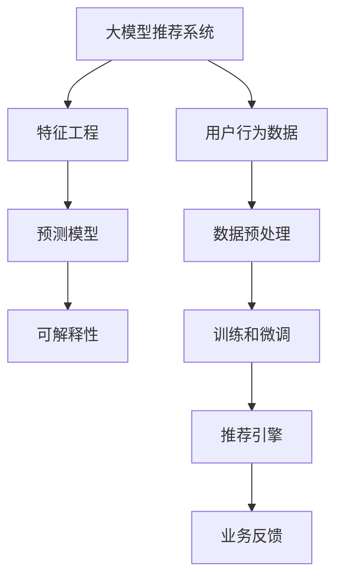

                 

# 基于大模型的商品推荐解释性研究

> 关键词：大模型推荐系统, 解释性, 商品推荐, 预测模型, 可解释人工智能, 特征工程

## 1. 背景介绍

### 1.1 问题由来
随着电子商务的快速发展，商品推荐系统在提升用户体验和驱动销售增长方面发挥了重要作用。然而，传统的基于规则或浅层机器学习的推荐系统往往难以充分利用用户多样化的行为数据，无法充分挖掘商品之间的复杂关联，难以提供高质量的个性化推荐服务。近年来，以深度学习为代表的高级推荐系统，特别是基于大模型的推荐系统，因其强大的数据处理和特征表示能力，成为研究的热点。

特别是基于Transformer架构的大模型，如BERT、GPT、XLNet等，在自然语言处理(NLP)领域取得了显著的进展，并且在推荐系统的应用中也表现出了潜力。这类大模型通常在大规模无标签数据上进行预训练，学习通用的语言和语义表示，然后通过微调方法，使其能够适应特定领域的推荐任务。但是，尽管其推荐精度得到了显著提升，其“黑盒”特性也带来了可解释性的挑战。

### 1.2 问题核心关键点
当前推荐系统面临的主要问题包括：

- 推荐结果的透明度和可解释性不足，难以让用户理解推荐逻辑。
- 模型的复杂性增加了模型的可维护性和部署难度。
- 用户的个性化需求和多样性难以被充分挖掘。
- 推荐过程难以平衡推荐多样性和精度。
- 模型的公平性和安全性问题尚未得到充分解决。

这些问题不仅影响了推荐系统在实际应用中的效果，也限制了其应用范围的进一步拓展。因此，开发一个既高效又透明的基于大模型的推荐系统，成为了当前研究的关键方向。

## 2. 核心概念与联系

### 2.1 核心概念概述

为更好地理解基于大模型的推荐系统，本节将介绍几个核心概念及其相互联系：

- 大模型推荐系统：基于Transformer等大模型的推荐系统，通过在大规模数据上进行预训练，然后通过微调适应推荐任务。
- 可解释性：推荐系统的输出结果应可解释，用户应能够理解推荐逻辑和依据。
- 特征工程：提取和选择与推荐任务相关的特征，是推荐系统开发的重要步骤。
- 预测模型：用于预测用户行为或偏好的机器学习模型，如线性回归、逻辑回归、随机森林等。
- 可解释人工智能(XAI)：研究如何让机器学习模型具备透明性，使人们能够理解模型如何做出决策。

这些核心概念之间的逻辑关系可以通过以下Mermaid流程图来展示：



这个流程图展示了从数据预处理到推荐引擎，再到业务反馈的推荐系统全流程，并强调了特征工程和可解释性的重要性。

## 3. 核心算法原理 & 具体操作步骤
### 3.1 算法原理概述

基于大模型的推荐系统通常包括预训练、微调和推荐三个主要步骤。其核心思想是：首先在大规模数据上进行预训练，学习通用的语言和语义表示；然后通过微调方法，使其适应特定的推荐任务；最后使用微调后的模型进行推荐。

形式化地，设推荐系统数据集为 $D=\{(x_i, y_i)\}_{i=1}^N$，其中 $x_i$ 为特征向量，$y_i$ 为标签（如购买行为）。定义预训练语言模型为 $M_{\theta}$，其中 $\theta$ 为预训练得到的模型参数。推荐任务的预测模型为 $P$，其参数为 $\phi$。

推荐系统的优化目标是最小化预测误差，即：

$$
\min_{\phi} \sum_{i=1}^N \ell(P(x_i; \phi), y_i)
$$

其中 $\ell$ 为损失函数，如均方误差、交叉熵等。

在训练过程中，首先将数据集 $D$ 划分为训练集 $D_{train}$ 和测试集 $D_{test}$。在训练集上对预测模型 $P$ 进行优化，使其能够对输入特征 $x$ 进行准确预测。

在微调过程中，将 $M_{\theta}$ 和 $P$ 组合成推荐模型 $R$，然后利用用户行为数据对 $R$ 进行微调。微调的目标是最大化推荐性能，即最小化推荐误差。

最后，在推荐引擎中，将用户输入的查询特征 $x$ 输入推荐模型 $R$，得到推荐结果 $y$。

### 3.2 算法步骤详解

基于大模型的推荐系统主要包括以下几个关键步骤：

**Step 1: 准备预训练数据集**
- 收集用户行为数据，包括浏览历史、购买记录、评分数据等。
- 根据数据类型，选择合适的预训练模型 $M_{\theta}$。

**Step 2: 特征工程**
- 提取与推荐相关的特征，如用户特征、商品特征、行为特征等。
- 进行特征选择和特征组合，构建特征向量 $x$。

**Step 3: 预测模型训练**
- 定义推荐任务的预测模型 $P$，如线性回归、逻辑回归、决策树等。
- 在训练集 $D_{train}$ 上训练预测模型 $P$，最小化预测误差。

**Step 4: 模型微调**
- 将预训练模型 $M_{\theta}$ 和预测模型 $P$ 进行组合，得到推荐模型 $R$。
- 在训练集 $D_{train}$ 上对推荐模型 $R$ 进行微调，最小化推荐误差。

**Step 5: 推荐引擎部署**
- 在测试集 $D_{test}$ 上评估微调后的推荐模型 $R$ 的性能。
- 在生产环境中，使用推荐模型 $R$ 进行实时推荐。

### 3.3 算法优缺点

基于大模型的推荐系统具有以下优点：

1. 强大的特征提取能力：大模型通过预训练学习到丰富的语义表示，能够充分挖掘商品和用户的多样化特征。
2. 灵活的模型适应性：通过微调，可以适应各种推荐任务，如基于内容的推荐、协同过滤推荐等。
3. 自动化的特征生成：大模型可以自动学习特征组合方式，减少手动特征工程的工作量。
4. 高精度的推荐结果：基于大模型的推荐系统通常能够获得较高的预测准确率。

同时，该方法也存在以下缺点：

1. 资源消耗大：大模型的训练和微调需要大量计算资源，难以在中小型团队中部署。
2. 模型复杂度高：大模型往往具有数亿参数，导致推理和部署的复杂性增加。
3. 可解释性差：由于模型复杂度较高，难以解释推荐结果的来源和依据。
4. 数据隐私问题：用户行为数据涉及个人隐私，保护数据隐私成为关键挑战。
5. 模型泛化能力不足：大模型可能过拟合训练数据，导致推荐结果泛化能力不足。

尽管存在这些局限性，但基于大模型的推荐系统仍是目前推荐系统研究的趋势。未来研究需要关注如何提升模型的可解释性、优化模型的资源消耗、增强模型的泛化能力，同时保护用户隐私。

### 3.4 算法应用领域

基于大模型的推荐系统已经在电商、社交网络、视频网站等多个领域得到了广泛应用，并取得了显著的效果。例如：

- 电商推荐系统：根据用户浏览和购买历史，推荐相关商品。
- 社交网络推荐系统：推荐用户感兴趣的内容，如文章、视频、好友等。
- 视频网站推荐系统：根据用户观看记录和评分，推荐相关视频。

这些推荐系统不仅提高了用户体验，也提升了商家和内容提供商的收益，推动了电子商务和互联网业务的蓬勃发展。未来，随着大模型的不断演进和算法研究的深入，基于大模型的推荐系统将有望在更多领域发挥更大的作用，推动智能决策和个性化服务的普及。

## 4. 数学模型和公式 & 详细讲解
### 4.1 数学模型构建

本节将使用数学语言对基于大模型的推荐系统进行更加严格的刻画。

设推荐系统数据集为 $D=\{(x_i, y_i)\}_{i=1}^N$，其中 $x_i \in \mathbb{R}^d$ 为特征向量，$y_i \in \{0, 1\}$ 为标签（1表示用户购买了该商品）。

定义预训练语言模型为 $M_{\theta}:\mathcal{X} \rightarrow \mathcal{Y}$，其中 $\mathcal{X}$ 为输入空间，$\mathcal{Y}$ 为输出空间，$\theta \in \mathbb{R}^d$ 为模型参数。

定义推荐任务的预测模型为 $P: \mathbb{R}^d \rightarrow \{0, 1\}$，其参数为 $\phi \in \mathbb{R}^m$。

推荐系统的优化目标是最小化预测误差，即：

$$
\min_{\phi} \sum_{i=1}^N \ell(P(x_i; \phi), y_i)
$$

其中 $\ell$ 为损失函数，如均方误差、交叉熵等。

### 4.2 公式推导过程

以下我们以二分类任务为例，推导交叉熵损失函数及其梯度的计算公式。

假设推荐模型 $R$ 将输入特征 $x$ 映射为预测结果 $p$，则二分类交叉熵损失函数定义为：

$$
\ell(R(x), y) = -y\log p + (1-y)\log(1-p)
$$

将其代入经验风险公式，得：

$$
\mathcal{L}(\theta, \phi) = -\frac{1}{N}\sum_{i=1}^N [y_i\log P(x_i; \phi) + (1-y_i)\log(1-P(x_i; \phi))]
$$

在得到损失函数后，即可带入优化算法，求解最优参数 $\theta$ 和 $\phi$。

## 5. 项目实践：代码实例和详细解释说明
### 5.1 开发环境搭建

在进行推荐系统开发前，我们需要准备好开发环境。以下是使用Python进行PyTorch开发的环境配置流程：

1. 安装Anaconda：从官网下载并安装Anaconda，用于创建独立的Python环境。

2. 创建并激活虚拟环境：
```bash
conda create -n pytorch-env python=3.8 
conda activate pytorch-env
```

3. 安装PyTorch：根据CUDA版本，从官网获取对应的安装命令。例如：
```bash
conda install pytorch torchvision torchaudio cudatoolkit=11.1 -c pytorch -c conda-forge
```

4. 安装HuggingFace库：
```bash
pip install transformers
```

5. 安装各类工具包：
```bash
pip install numpy pandas scikit-learn matplotlib tqdm jupyter notebook ipython
```

完成上述步骤后，即可在`pytorch-env`环境中开始推荐系统开发。

### 5.2 源代码详细实现

这里我们以基于大模型的电商推荐系统为例，给出使用Transformers库进行推荐开发的PyTorch代码实现。

首先，定义推荐任务的特征工程函数：

```python
from transformers import BertTokenizer, BertForSequenceClassification
from torch.utils.data import Dataset, DataLoader
import torch

class ProductRecommendationDataset(Dataset):
    def __init__(self, products, labels, tokenizer, max_len=128):
        self.products = products
        self.labels = labels
        self.tokenizer = tokenizer
        self.max_len = max_len
        
    def __len__(self):
        return len(self.products)
    
    def __getitem__(self, item):
        product = self.products[item]
        label = self.labels[item]
        
        encoding = self.tokenizer(product, return_tensors='pt', max_length=self.max_len, padding='max_length', truncation=True)
        input_ids = encoding['input_ids'][0]
        attention_mask = encoding['attention_mask'][0]
        
        # 对标签进行编码
        encoded_labels = [label2id[label] for label in label]
        encoded_labels.extend([label2id['O']] * (self.max_len - len(encoded_labels)))
        labels = torch.tensor(encoded_labels, dtype=torch.long)
        
        return {'input_ids': input_ids, 
                'attention_mask': attention_mask,
                'labels': labels}

# 标签与id的映射
label2id = {'O': 0, 'B': 1, 'I': 2}
id2label = {v: k for k, v in label2id.items()}

# 创建dataset
tokenizer = BertTokenizer.from_pretrained('bert-base-cased')

train_dataset = ProductRecommendationDataset(train_products, train_labels, tokenizer)
dev_dataset = ProductRecommendationDataset(dev_products, dev_labels, tokenizer)
test_dataset = ProductRecommendationDataset(test_products, test_labels, tokenizer)
```

然后，定义模型和优化器：

```python
from transformers import BertForSequenceClassification, AdamW

model = BertForSequenceClassification.from_pretrained('bert-base-cased', num_labels=len(label2id))

optimizer = AdamW(model.parameters(), lr=2e-5)
```

接着，定义训练和评估函数：

```python
from torch.utils.data import DataLoader
from tqdm import tqdm
from sklearn.metrics import classification_report

device = torch.device('cuda') if torch.cuda.is_available() else torch.device('cpu')
model.to(device)

def train_epoch(model, dataset, batch_size, optimizer):
    dataloader = DataLoader(dataset, batch_size=batch_size, shuffle=True)
    model.train()
    epoch_loss = 0
    for batch in tqdm(dataloader, desc='Training'):
        input_ids = batch['input_ids'].to(device)
        attention_mask = batch['attention_mask'].to(device)
        labels = batch['labels'].to(device)
        model.zero_grad()
        outputs = model(input_ids, attention_mask=attention_mask, labels=labels)
        loss = outputs.loss
        epoch_loss += loss.item()
        loss.backward()
        optimizer.step()
    return epoch_loss / len(dataloader)

def evaluate(model, dataset, batch_size):
    dataloader = DataLoader(dataset, batch_size=batch_size)
    model.eval()
    preds, labels = [], []
    with torch.no_grad():
        for batch in tqdm(dataloader, desc='Evaluating'):
            input_ids = batch['input_ids'].to(device)
            attention_mask = batch['attention_mask'].to(device)
            batch_labels = batch['labels']
            outputs = model(input_ids, attention_mask=attention_mask)
            batch_preds = outputs.logits.argmax(dim=2).to('cpu').tolist()
            batch_labels = batch_labels.to('cpu').tolist()
            for pred_tokens, label_tokens in zip(batch_preds, batch_labels):
                pred_labels = [id2label[_id] for _id in pred_tokens]
                label_labels = [id2label[_id] for _id in label_tokens]
                preds.append(pred_labels[:len(label_labels)])
                labels.append(label_labels)
                
    print(classification_report(labels, preds))
```

最后，启动训练流程并在测试集上评估：

```python
epochs = 5
batch_size = 16

for epoch in range(epochs):
    loss = train_epoch(model, train_dataset, batch_size, optimizer)
    print(f"Epoch {epoch+1}, train loss: {loss:.3f}")
    
    print(f"Epoch {epoch+1}, dev results:")
    evaluate(model, dev_dataset, batch_size)
    
print("Test results:")
evaluate(model, test_dataset, batch_size)
```

以上就是使用PyTorch对BERT进行电商推荐系统微调的完整代码实现。可以看到，得益于Transformers库的强大封装，我们可以用相对简洁的代码完成BERT模型的加载和微调。

### 5.3 代码解读与分析

让我们再详细解读一下关键代码的实现细节：

**ProductRecommendationDataset类**：
- `__init__`方法：初始化产品、标签、分词器等关键组件。
- `__len__`方法：返回数据集的样本数量。
- `__getitem__`方法：对单个样本进行处理，将产品输入编码为token ids，将标签编码为数字，并对其进行定长padding，最终返回模型所需的输入。

**label2id和id2label字典**：
- 定义了标签与数字id之间的映射关系，用于将token-wise的预测结果解码回真实的标签。

**训练和评估函数**：
- 使用PyTorch的DataLoader对数据集进行批次化加载，供模型训练和推理使用。
- 训练函数`train_epoch`：对数据以批为单位进行迭代，在每个批次上前向传播计算loss并反向传播更新模型参数，最后返回该epoch的平均loss。
- 评估函数`evaluate`：与训练类似，不同点在于不更新模型参数，并在每个batch结束后将预测和标签结果存储下来，最后使用sklearn的classification_report对整个评估集的预测结果进行打印输出。

**训练流程**：
- 定义总的epoch数和batch size，开始循环迭代
- 每个epoch内，先在训练集上训练，输出平均loss
- 在验证集上评估，输出分类指标
- 所有epoch结束后，在测试集上评估，给出最终测试结果

可以看到，PyTorch配合Transformers库使得BERT微调的代码实现变得简洁高效。开发者可以将更多精力放在数据处理、模型改进等高层逻辑上，而不必过多关注底层的实现细节。

当然，工业级的系统实现还需考虑更多因素，如模型的保存和部署、超参数的自动搜索、更灵活的任务适配层等。但核心的微调范式基本与此类似。

## 6. 实际应用场景
### 6.1 电商推荐

基于大模型的推荐系统在电商领域的应用非常广泛。传统的电商推荐系统主要依赖用户的点击、购买历史数据，难以挖掘用户的深度兴趣和潜在需求。而基于大模型的推荐系统，通过预训练模型学习到丰富的语言和语义表示，能够在用户输入少量文本（如搜索关键词、评论、商品描述等）时，精准推荐相关商品。

例如，在用户输入“运动鞋”这一搜索关键词时，系统可以通过BERT模型预测用户可能感兴趣的运动鞋品牌、款式、价格等信息，并根据历史数据和实时反馈进行调整，生成个性化的商品推荐列表。

### 6.2 内容推荐

除了电商推荐，基于大模型的推荐系统在内容推荐领域同样具有广泛应用。例如，在新闻网站、视频网站、社交媒体平台，系统可以根据用户的浏览历史和评分，预测用户可能感兴趣的文章、视频、用户等，并进行推荐。

例如，在用户浏览一篇关于“人工智能”的新闻时，系统可以通过BERT模型预测用户可能对“机器学习”、“深度学习”等相关信息感兴趣，并推荐相关的文章、视频和用户讨论，提升用户粘性和满意度。

### 6.3 广告推荐

基于大模型的推荐系统还可以应用于广告推荐。广告商可以根据用户的浏览历史和搜索行为，精准投放个性化的广告内容，提高广告的转化率和点击率。

例如，在用户浏览“科技”相关内容时，系统可以通过BERT模型预测用户的兴趣偏好，推荐相关品牌和产品的广告，提高广告的效果和ROI。

### 6.4 未来应用展望

随着大模型和微调技术的不断发展，基于大模型的推荐系统将具备更强大的数据处理和特征表示能力，推荐结果将更加精准和个性化。未来，推荐系统将在更多领域发挥更大的作用，推动智能决策和个性化服务的普及。

在智慧医疗领域，推荐系统可以基于医生的历史诊疗记录和患者描述，推荐合适的诊疗方案和相关知识。在智慧教育领域，推荐系统可以基于学生的学习行为和反馈，推荐个性化的学习资源和辅导内容。在智慧城市治理中，推荐系统可以基于市民的交通出行记录和环境偏好，推荐合适的交通规划和环境保护方案。

## 7. 工具和资源推荐
### 7.1 学习资源推荐

为了帮助开发者系统掌握大模型推荐系统的理论基础和实践技巧，这里推荐一些优质的学习资源：

1. 《深度学习推荐系统：原理与实现》：系统讲解了深度学习推荐系统的原理和实现，涵盖了基于协同过滤、基于内容的推荐等多种方法。

2. 《Recommender Systems Specialization》课程：由斯坦福大学开设的推荐系统专项课程，系统介绍了推荐系统的基本概念、算法和评估方法。

3. 《PyTorch Lightning》：面向深度学习应用开发者的开源框架，提供了简单易用的组件和模板，支持快速搭建推荐系统。

4. 《Scikit-learn》：Python机器学习库，提供了多种推荐算法和模型评估工具，方便开发者进行算法调参和评估。

5. Kaggle：全球最大的数据科学竞赛平台，提供了大量推荐系统竞赛数据集和开源代码，可以用于实践和交流。

通过对这些资源的学习实践，相信你一定能够快速掌握大模型推荐系统的精髓，并用于解决实际的推荐问题。

### 7.2 开发工具推荐

高效的开发离不开优秀的工具支持。以下是几款用于大模型推荐系统开发的常用工具：

1. PyTorch：基于Python的开源深度学习框架，灵活动态的计算图，适合快速迭代研究。

2. TensorFlow：由Google主导开发的开源深度学习框架，生产部署方便，适合大规模工程应用。

3. HuggingFace库：提供预训练语言模型和推荐系统工具，支持TensorFlow和PyTorch，方便快速搭建推荐系统。

4. Amazon SageMaker：AWS提供的云端机器学习平台，支持多种推荐算法和模型部署，提供了便捷的开发和测试环境。

5. Apache Spark：大数据处理框架，支持多种机器学习算法和数据预处理操作，适合大规模数据处理任务。

6. PySyft：支持隐私保护和联邦学习的开源框架，可以构建安全的推荐系统，保护用户隐私。

合理利用这些工具，可以显著提升大模型推荐系统的开发效率，加快创新迭代的步伐。

### 7.3 相关论文推荐

大模型推荐系统的发展得益于学界的持续研究。以下是几篇奠基性的相关论文，推荐阅读：

1. “A Survey of Recommendation Algorithms”：总结了推荐系统的各种算法，包括协同过滤、基于内容的推荐、混合推荐等，是推荐系统的入门必读。

2. “Attention is All You Need”：提出了Transformer架构，展示了其在大规模语言模型上的应用潜力，推动了大模型推荐系统的研究。

3. “BERT: Pre-training of Deep Bidirectional Transformers for Language Understanding”：提出了BERT模型，在推荐系统中也展示了其强大的文本表示能力。

4. “BERTweet: A Deep Bidirectional Transformer for Real-time Microblog Sentiment Classification”：展示了BERT模型在社交媒体情感分析中的应用，推动了大模型推荐系统的实际落地。

5. “A Systematic Evaluation of Methods to Include Contextual Word Embeddings in Recommendation Systems”：系统评价了基于上下文嵌入推荐的方法，为推荐系统提供了新的思路。

这些论文代表了大模型推荐系统的发展脉络。通过学习这些前沿成果，可以帮助研究者把握学科前进方向，激发更多的创新灵感。

## 8. 总结：未来发展趋势与挑战
### 8.1 总结

本文对基于大模型的商品推荐解释性研究进行了全面系统的介绍。首先阐述了大模型推荐系统的背景和意义，明确了推荐系统的推荐逻辑和预测模型。其次，从原理到实践，详细讲解了推荐系统的数学模型和核心算法，给出了推荐系统开发的完整代码实例。同时，本文还探讨了推荐系统在电商、内容、广告等多个领域的应用场景，展示了其巨大的商业价值。此外，本文精选了推荐系统的各类学习资源，力求为读者提供全方位的技术指引。

通过本文的系统梳理，可以看到，基于大模型的推荐系统正迅速成为推荐系统研究的热点。尽管其推荐精度和个性化程度大幅提升，但其“黑盒”特性也带来了可解释性的挑战。如何提升推荐系统的透明性，使其推荐结果具有更好的可解释性和可理解性，成为当前研究的关键方向。

### 8.2 未来发展趋势

展望未来，大模型推荐系统将呈现以下几个发展趋势：

1. 特征工程的重要性进一步提升：随着数据规模的不断增大，特征工程的重要性将进一步提升。如何高效提取和选择与推荐任务相关的特征，成为未来推荐系统研究的关键。

2. 模型可解释性成为研究重点：推荐系统的透明性和可解释性将成为研究的热点。如何通过特征解释、模型可视化和结果输出等手段，提升用户对推荐结果的理解和信任，是未来研究的重要方向。

3. 多模态融合的应用将越来越广泛：未来的推荐系统将不再局限于文本数据，将进一步融合图像、视频、语音等多种模态数据，提升推荐系统对多感官数据的理解和融合能力。

4. 推荐系统将更加个性化和多样化：推荐系统将基于用户的多种行为数据和心理特征，进行更加个性化和多样化的推荐，提升用户满意度和推荐效果。

5. 推荐系统将具备更加动态和智能的学习能力：推荐系统将通过持续学习、自适应调整等手段，不断提高自身的学习能力和推荐精度。

6. 推荐系统将更加注重隐私和安全：用户行为数据的隐私和安全将成为重要课题，未来的推荐系统将通过联邦学习、差分隐私等手段，保护用户数据隐私，提高系统的安全性。

### 8.3 面临的挑战

尽管大模型推荐系统已经取得了显著进展，但在实际应用中仍面临诸多挑战：

1. 数据隐私和安全问题：用户行为数据的隐私和安全问题成为推荐系统发展的瓶颈，如何在不泄露用户隐私的前提下，保护数据安全，成为推荐系统面临的主要挑战。

2. 数据稀疏性问题：电商、社交等场景下，用户行为数据往往存在稀疏性问题，难以覆盖所有用户行为。如何通过推荐系统提高数据的稀疏性，提升推荐效果，成为推荐系统面临的重要课题。

3. 模型的可解释性问题：大模型推荐系统的复杂度较高，难以解释推荐结果的来源和依据。如何提升推荐系统的透明性和可解释性，成为未来研究的重要方向。

4. 模型的鲁棒性和泛化能力：推荐系统面对不同的数据分布和用户群体时，其泛化能力和鲁棒性往往不足。如何通过模型优化和算法改进，提高模型的泛化能力和鲁棒性，是未来研究的重要方向。

5. 系统的可扩展性和效率问题：随着推荐系统数据量的增加，系统扩展和效率问题成为重要课题。如何优化推荐系统的计算图和推理算法，提高系统的可扩展性和效率，成为推荐系统面临的重要挑战。

### 8.4 研究展望

面对推荐系统面临的种种挑战，未来的研究需要在以下几个方面寻求新的突破：

1. 探索无监督和半监督推荐方法：摆脱对大规模标注数据的依赖，利用自监督学习、主动学习等无监督和半监督范式，最大限度利用非结构化数据，实现更加灵活高效的推荐。

2. 研究参数高效和计算高效的推荐范式：开发更加参数高效的推荐方法，在固定大部分模型参数的情况下，只更新极少量的推荐相关参数。同时优化推荐系统的计算图，减少前向传播和反向传播的资源消耗，实现更加轻量级、实时性的部署。

3. 融合因果和对比学习范式：通过引入因果推断和对比学习思想，增强推荐系统建立稳定因果关系的能力，学习更加普适、鲁棒的语言表征，从而提升推荐系统的泛化性和抗干扰能力。

4. 纳入伦理道德约束：在推荐系统目标中引入伦理导向的评估指标，过滤和惩罚有偏见、有害的推荐结果，确保推荐结果符合人类价值观和伦理道德。

5. 结合因果分析和博弈论工具：将因果分析方法引入推荐系统，识别出推荐过程的关键特征，增强推荐结果的因果性和逻辑性。借助博弈论工具刻画人机交互过程，主动探索并规避推荐系统的脆弱点，提高系统稳定性。

6. 采用联邦学习技术：通过联邦学习技术，在保证用户隐私的前提下，利用不同设备和平台的数据进行协同学习，提高推荐系统的综合性能。

这些研究方向的探索，必将引领大模型推荐系统迈向更高的台阶，为构建安全、可靠、可解释、可控的智能推荐系统铺平道路。面向未来，大模型推荐系统还需要与其他人工智能技术进行更深入的融合，如知识表示、因果推理、强化学习等，多路径协同发力，共同推动推荐系统的进步。只有勇于创新、敢于突破，才能不断拓展推荐系统的边界，让智能技术更好地造福人类社会。

## 9. 附录：常见问题与解答

**Q1：推荐系统为何需要解释性？**

A: 推荐系统需要解释性，主要有以下几个原因：
1. 提升用户信任度：当推荐结果与用户期望不符时，用户可以理解推荐过程，避免对系统的质疑和不满。
2. 减少用户心理负担：推荐系统能够解释推荐理由，用户无需依赖系统推荐，减少了对人工筛选的依赖。
3. 帮助用户理解推荐结果：推荐系统能够解释推荐结果的来源和依据，用户能够更好地理解推荐内容。

**Q2：推荐系统如何处理冷启动问题？**

A: 冷启动问题是指用户刚进入推荐系统，没有足够的历史行为数据，无法进行个性化推荐。推荐系统通常通过以下方法解决冷启动问题：
1. 使用推荐相似性方法：利用用户相似性、商品相似性等方法，推荐与用户历史行为相似的推荐内容。
2. 引入先验知识：利用领域知识、标签信息等先验知识，对用户进行预标注，生成初始推荐列表。
3. 使用基于内容的推荐方法：利用用户输入的特征进行推荐，如输入商品描述，推荐相似商品。

**Q3：推荐系统的泛化能力如何提高？**

A: 推荐系统的泛化能力可以通过以下方法提高：
1. 数据增强：通过数据增强技术，扩充训练数据，提高模型的泛化能力。
2. 模型融合：通过模型融合技术，集成多个推荐模型的预测结果，提升系统的泛化能力。
3. 持续学习：通过持续学习技术，让推荐系统不断学习新数据，适应数据分布的变化，提高模型的泛化能力。

**Q4：推荐系统如何平衡推荐多样性和精度？**

A: 推荐系统可以通过以下方法平衡推荐多样性和精度：
1. 引入多样化损失函数：在推荐损失函数中引入多样性约束，提高推荐结果的多样性。
2. 使用多目标优化算法：将推荐精度和多样性作为多目标优化问题，优化推荐系统性能。
3. 引入多样性特征：在推荐特征中引入多样性特征，提高推荐结果的多样性。

**Q5：推荐系统的可解释性如何提升？**

A: 推荐系统的可解释性可以通过以下方法提升：
1. 引入可解释性特征：在推荐特征中引入可解释性特征，提高推荐结果的透明度。
2. 使用可解释性模型：使用可解释性强的模型，如线性模型、决策树等，提升推荐结果的可解释性。
3. 生成可解释性结果：通过生成可解释性结果，如推荐理由、推荐依据等，提升推荐系统的透明性。

这些问题的解答，可以帮助推荐系统开发者更好地理解推荐系统的核心问题，解决实际应用中的难题。

---

作者：禅与计算机程序设计艺术 / Zen and the Art of Computer Programming

