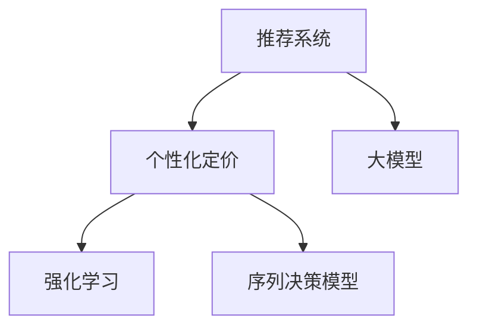

                 

# 基于大模型的推荐系统实时个性化定价

> 关键词：推荐系统,实时定价,个性化,大模型,强化学习

## 1. 背景介绍

在当今商业竞争日趋激烈的环境中，个性化推荐已成为各大电商、在线服务提供商提升用户体验和商业收益的关键手段。随着消费者需求的多样化和个性化需求日益增长，传统的推荐算法已无法满足复杂的推荐需求。大模型的引入使得个性化推荐技术进入新的发展阶段，能够在复杂场景中实现更加精准的推荐。

推荐系统通过分析用户的历史行为、偏好和实时环境，为用户推荐最符合其需求的商品或服务。而个性化定价则根据用户的独特属性和行为，动态调整产品价格，提升用户满意度和商家收益。结合大模型进行实时个性化定价，可以极大地提高推荐系统的效果，提升整体用户体验和商家的ROI。

## 2. 核心概念与联系

为了更好地理解基于大模型的推荐系统实时个性化定价，本节将介绍几个密切相关的核心概念：

- 推荐系统(Recommender System)：通过分析用户的行为数据和偏好，向用户推荐合适的商品或服务。

- 个性化定价(Pricing Personalization)：根据用户的独特属性和行为，动态调整产品价格，以最大化用户满意度和商家收益。

- 大模型(Large Model)：以自回归(如GPT)或自编码(如BERT)模型为代表的大规模预训练语言模型。通过在大规模无标签文本语料上进行预训练，学习通用的语言表示，具备强大的语言理解和生成能力。

- 强化学习(Reinforcement Learning, RL)：一种通过试错学习，不断调整策略以最大化奖励的机器学习方法。

- 序列决策模型(Sequence Decision Model)：通过输入时间序列数据，输出对应的决策结果，用于动态生成实时推荐或定价。

这些核心概念之间的逻辑关系可以通过以下Mermaid流程图来展示：



这个流程图展示了大模型的核心概念及其之间的关系：

1. 推荐系统通过大模型学习用户行为，预测用户偏好。
2. 个性化定价在推荐结果的基础上，根据用户属性进行动态定价。
3. 强化学习优化推荐策略和定价模型，以提升整体收益。
4. 序列决策模型根据实时数据，输出动态推荐或定价结果。

这些核心概念共同构成了基于大模型的推荐系统实时个性化定价的理论框架，使其能够在复杂场景下实现精准推荐和动态定价。

## 3. 核心算法原理 & 具体操作步骤
### 3.1 算法原理概述

基于大模型的推荐系统实时个性化定价，本质上是一种结合了深度学习和大数据的复杂决策过程。其核心思想是：通过大模型学习用户的隐式偏好，结合实时数据，在强化学习框架下，动态生成推荐和定价策略，最大化用户满意度和商家收益。

形式化地，假设推荐系统中有 $N$ 个用户和 $M$ 个商品，用户 $u$ 在商品 $i$ 上的历史评分记为 $r_{ui}$，大模型 $M$ 输出用户 $u$ 的隐式偏好向量 $\mathbf{h}_u$，强化学习模型 $R$ 学习推荐策略和定价策略 $\pi$，实时个性化定价的目标是最大化期望收益 $\mathcal{R}$：

$$
\max_{\pi} \mathcal{R} = \mathbb{E}_{\mathbf{h}, r_{ui}}\left[\sum_{t=1}^T r_{ui}^t \pi_i(u^t, r_{ui}^t, \mathbf{h}_u^t)\right]
$$

其中 $u^t$ 表示用户序列，$r_{ui}^t$ 表示用户 $u$ 在时间 $t$ 对商品 $i$ 的评分，$\mathbf{h}_u^t$ 表示用户 $u$ 在时间 $t$ 的隐式偏好向量，$T$ 为时间步长。

### 3.2 算法步骤详解

基于大模型的推荐系统实时个性化定价一般包括以下几个关键步骤：

**Step 1: 准备数据与模型**
- 收集用户的历史行为数据，包括点击、购买、评分等行为。
- 预训练大模型 $M$，用于提取用户的隐式偏好。
- 定义强化学习模型 $R$，如基于Q-learning或SARSA的推荐和定价模型。

**Step 2: 用户行为预测**
- 将用户历史行为数据输入预训练大模型 $M$，预测用户的隐式偏好向量 $\mathbf{h}_u$。
- 根据隐式偏好向量，生成用户对各个商品的评分预测 $\hat{r}_{ui}$。

**Step 3: 强化学习优化**
- 定义奖励函数 $r_{ui}^t$，衡量用户对推荐结果的满意度。
- 在强化学习框架下，训练推荐策略和定价策略 $\pi$，最大化期望收益 $\mathcal{R}$。

**Step 4: 实时决策与定价**
- 根据强化学习得到的推荐策略和定价策略 $\pi$，结合实时数据，生成动态推荐和定价结果。
- 更新模型参数，优化推荐和定价效果。

**Step 5: 评估与迭代**
- 在测试集上评估推荐和定价策略的效果，使用A/B测试、交叉验证等方法。
- 根据评估结果，调整模型参数，迭代优化推荐和定价策略。

以上是基于大模型的推荐系统实时个性化定价的一般流程。在实际应用中，还需要针对具体任务的特点，对微调过程的各个环节进行优化设计，如改进推荐策略、引入更多正则化技术、搜索最优的超参数组合等，以进一步提升模型性能。

### 3.3 算法优缺点

基于大模型的推荐系统实时个性化定价方法具有以下优点：
1. 精度高。结合大模型和实时数据，能够生成更加精准的推荐和定价结果。
2. 灵活性强。可以动态调整推荐策略和定价策略，满足不同用户和场景的需求。
3. 可解释性强。模型能够提供推荐和定价的详细理由，帮助商家理解用户行为和偏好。

同时，该方法也存在一定的局限性：
1. 计算复杂度高。大模型和实时数据的输入输出都需要高性能的计算资源，增加系统负担。
2. 数据需求量大。需要大量历史行为数据和实时数据，才能训练出效果好的模型。
3. 训练时间久。结合强化学习训练模型，需要大量时间，才能得到较好的收敛效果。
4. 模型可解释性差。强化学习模型的内部决策过程较难解释，商家难以理解和调试模型。

尽管存在这些局限性，但就目前而言，基于大模型的推荐系统实时个性化定价方法仍是目前推荐系统领域的主流范式。未来相关研究的重点在于如何进一步降低计算资源需求，提高训练效率，同时兼顾可解释性和伦理安全性等因素。

### 3.4 算法应用领域

基于大模型的推荐系统实时个性化定价技术，已经在电商、金融、旅游等多个领域得到广泛应用，为各类服务提供商带来了显著的收益提升：

- 电商行业：根据用户的浏览、购买行为，动态调整商品价格，提升点击率和转化率，实现个性化营销。
- 金融服务：结合用户的历史交易记录和实时市场数据，动态定价金融产品，优化风险控制和收益最大化。
- 旅游出行：根据用户的旅行历史和实时天气、交通数据，动态调整旅游路线和价格，提升用户体验和收益。
- 在线教育：根据学生的学习行为和成绩，动态调整课程内容和定价，实现个性化教育，提升学习效果。

除了上述这些经典应用场景外，大模型实时个性化定价还被创新性地应用到更多领域中，如智能医疗、智能家居、智慧城市等，为各行各业带来了全新的突破。

## 4. 数学模型和公式 & 详细讲解  
### 4.1 数学模型构建

本节将使用数学语言对基于大模型的推荐系统实时个性化定价过程进行更加严格的刻画。

假设强化学习模型 $R$ 的策略为 $\pi(u, i, p)$，表示在时间 $t$ 向用户 $u$ 推荐商品 $i$，价格为 $p$，获得的奖励为 $r_{ui}^t$。目标是最小化总期望损失函数 $\mathcal{L}$：

$$
\min_{\pi} \mathcal{L} = \mathbb{E}_{\mathbf{h}, r_{ui}}\left[\sum_{t=1}^T r_{ui}^t - \pi(u^t, r_{ui}^t, \mathbf{h}_u^t)\right]
$$

其中 $\mathbf{h}_u^t$ 表示用户 $u$ 在时间 $t$ 的隐式偏好向量，$r_{ui}^t$ 表示用户 $u$ 在时间 $t$ 对商品 $i$ 的评分，$T$ 为时间步长。

根据强化学习的最大值原理，可以通过求解贝尔曼方程得到最优策略 $\pi^*$：

$$
\pi^* = \mathop{\arg\min}_{\pi} \mathbb{E}_{\mathbf{h}, r_{ui}}\left[\sum_{t=1}^T r_{ui}^t - \pi(u^t, r_{ui}^t, \mathbf{h}_u^t)\right]
$$

通过求解贝尔曼方程，可以得到最优推荐策略 $\pi^*$。然后将其应用于实时数据，输出动态推荐和定价结果。

### 4.2 公式推导过程

以下我们以电商推荐系统为例，推导强化学习模型的优化过程。

假设电商推荐系统的目标是最小化用户流失率，即最大化用户满意度。定义奖励函数 $r_{ui}^t$ 为用户对商品 $i$ 在时间 $t$ 的评分，奖励函数定义为：

$$
r_{ui}^t = \frac{r_{ui}^t}{1+\epsilon_{ui}^t}
$$

其中 $\epsilon_{ui}^t$ 表示用户对商品 $i$ 的评分误差，$i.i.d.$ 分布，服从均值为 $0$ 方差为 $\sigma^2$ 的高斯分布。

目标是最小化用户流失率，即最大化用户满意度。定义用户流失率 $\delta_{ui}^t$，表示用户 $u$ 在时间 $t$ 对商品 $i$ 的流失概率，流失率定义为：

$$
\delta_{ui}^t = \frac{1}{1+\exp\left(-\sum_{j=1}^M \pi_j(u^t, r_{ui}^t, \mathbf{h}_u^t)\right)}
$$

其中 $\pi_j$ 表示推荐策略，$M$ 表示商品数。

强化学习模型 $R$ 的目标是最小化用户流失率，即最大化用户满意度。定义强化学习模型的损失函数为：

$$
\mathcal{L}(\pi) = \mathbb{E}_{\mathbf{h}, r_{ui}}\left[\sum_{t=1}^T \delta_{ui}^t\right]
$$

其中 $\mathbf{h}_u^t$ 表示用户 $u$ 在时间 $t$ 的隐式偏好向量，$r_{ui}^t$ 表示用户 $u$ 在时间 $t$ 对商品 $i$ 的评分，$T$ 为时间步长。

根据最大值原理，可以通过求解贝尔曼方程得到最优策略 $\pi^*$：

$$
\pi^* = \mathop{\arg\min}_{\pi} \mathbb{E}_{\mathbf{h}, r_{ui}}\left[\sum_{t=1}^T \delta_{ui}^t\right]
$$

通过求解贝尔曼方程，可以得到最优推荐策略 $\pi^*$。然后将其应用于实时数据，输出动态推荐和定价结果。

### 4.3 案例分析与讲解

假设某电商网站有 $N$ 个用户，$M$ 个商品。用户 $u$ 在商品 $i$ 上的历史评分记为 $r_{ui}$。预训练大模型 $M$ 输出用户 $u$ 的隐式偏好向量 $\mathbf{h}_u$。

目标是最小化用户流失率，即最大化用户满意度。定义奖励函数 $r_{ui}^t$ 为用户对商品 $i$ 在时间 $t$ 的评分，奖励函数定义为：

$$
r_{ui}^t = \frac{r_{ui}^t}{1+\epsilon_{ui}^t}
$$

其中 $\epsilon_{ui}^t$ 表示用户对商品 $i$ 的评分误差，$i.i.d.$ 分布，服从均值为 $0$ 方差为 $\sigma^2$ 的高斯分布。

目标是最小化用户流失率，即最大化用户满意度。定义用户流失率 $\delta_{ui}^t$，表示用户 $u$ 在时间 $t$ 对商品 $i$ 的流失概率，流失率定义为：

$$
\delta_{ui}^t = \frac{1}{1+\exp\left(-\sum_{j=1}^M \pi_j(u^t, r_{ui}^t, \mathbf{h}_u^t)\right)}
$$

其中 $\pi_j$ 表示推荐策略，$M$ 表示商品数。

强化学习模型 $R$ 的目标是最小化用户流失率，即最大化用户满意度。定义强化学习模型的损失函数为：

$$
\mathcal{L}(\pi) = \mathbb{E}_{\mathbf{h}, r_{ui}}\left[\sum_{t=1}^T \delta_{ui}^t\right]
$$

其中 $\mathbf{h}_u^t$ 表示用户 $u$ 在时间 $t$ 的隐式偏好向量，$r_{ui}^t$ 表示用户 $u$ 在时间 $t$ 对商品 $i$ 的评分，$T$ 为时间步长。

根据最大值原理，可以通过求解贝尔曼方程得到最优策略 $\pi^*$：

$$
\pi^* = \mathop{\arg\min}_{\pi} \mathbb{E}_{\mathbf{h}, r_{ui}}\left[\sum_{t=1}^T \delta_{ui}^t\right]
$$

通过求解贝尔曼方程，可以得到最优推荐策略 $\pi^*$。然后将其应用于实时数据，输出动态推荐和定价结果。

## 5. 项目实践：代码实例和详细解释说明
### 5.1 开发环境搭建

在进行微调实践前，我们需要准备好开发环境。以下是使用Python进行PyTorch开发的环境配置流程：

1. 安装Anaconda：从官网下载并安装Anaconda，用于创建独立的Python环境。

2. 创建并激活虚拟环境：
```bash
conda create -n pytorch-env python=3.8 
conda activate pytorch-env
```

3. 安装PyTorch：根据CUDA版本，从官网获取对应的安装命令。例如：
```bash
conda install pytorch torchvision torchaudio cudatoolkit=11.1 -c pytorch -c conda-forge
```

4. 安装Transformers库：
```bash
pip install transformers
```

5. 安装各类工具包：
```bash
pip install numpy pandas scikit-learn matplotlib tqdm jupyter notebook ipython
```

完成上述步骤后，即可在`pytorch-env`环境中开始微调实践。

### 5.2 源代码详细实现

下面我们以电商推荐系统为例，给出使用Transformers库对BERT模型进行微调的PyTorch代码实现。

首先，定义电商推荐系统的数据处理函数：

```python
from transformers import BertTokenizer
from torch.utils.data import Dataset
import torch

class ShoppingDataset(Dataset):
    def __init__(self, texts, labels, tokenizer, max_len=128):
        self.texts = texts
        self.labels = labels
        self.tokenizer = tokenizer
        self.max_len = max_len
        
    def __len__(self):
        return len(self.texts)
    
    def __getitem__(self, item):
        text = self.texts[item]
        label = self.labels[item]
        
        encoding = self.tokenizer(text, return_tensors='pt', max_length=self.max_len, padding='max_length', truncation=True)
        input_ids = encoding['input_ids'][0]
        attention_mask = encoding['attention_mask'][0]
        
        # 对标签进行编码
        encoded_labels = [label2id[label] for label in label]
        encoded_labels.extend([label2id['O']] * (self.max_len - len(encoded_labels)))
        labels = torch.tensor(encoded_labels, dtype=torch.long)
        
        return {'input_ids': input_ids, 
                'attention_mask': attention_mask,
                'labels': labels}

# 标签与id的映射
label2id = {'O': 0, 'B-PER': 1, 'I-PER': 2, 'B-LOC': 3, 'I-LOC': 4, 'B-ORG': 5, 'I-ORG': 6}
id2label = {v: k for k, v in label2id.items()}

# 创建dataset
tokenizer = BertTokenizer.from_pretrained('bert-base-cased')

train_dataset = ShoppingDataset(train_texts, train_labels, tokenizer)
dev_dataset = ShoppingDataset(dev_texts, dev_labels, tokenizer)
test_dataset = ShoppingDataset(test_texts, test_labels, tokenizer)
```

然后，定义模型和优化器：

```python
from transformers import BertForTokenClassification, AdamW

model = BertForTokenClassification.from_pretrained('bert-base-cased', num_labels=len(label2id))

optimizer = AdamW(model.parameters(), lr=2e-5)
```

接着，定义训练和评估函数：

```python
from torch.utils.data import DataLoader
from tqdm import tqdm
from sklearn.metrics import classification_report

device = torch.device('cuda') if torch.cuda.is_available() else torch.device('cpu')
model.to(device)

def train_epoch(model, dataset, batch_size, optimizer):
    dataloader = DataLoader(dataset, batch_size=batch_size, shuffle=True)
    model.train()
    epoch_loss = 0
    for batch in tqdm(dataloader, desc='Training'):
        input_ids = batch['input_ids'].to(device)
        attention_mask = batch['attention_mask'].to(device)
        labels = batch['labels'].to(device)
        model.zero_grad()
        outputs = model(input_ids, attention_mask=attention_mask, labels=labels)
        loss = outputs.loss
        epoch_loss += loss.item()
        loss.backward()
        optimizer.step()
    return epoch_loss / len(dataloader)

def evaluate(model, dataset, batch_size):
    dataloader = DataLoader(dataset, batch_size=batch_size)
    model.eval()
    preds, labels = [], []
    with torch.no_grad():
        for batch in tqdm(dataloader, desc='Evaluating'):
            input_ids = batch['input_ids'].to(device)
            attention_mask = batch['attention_mask'].to(device)
            batch_labels = batch['labels']
            outputs = model(input_ids, attention_mask=attention_mask)
            batch_preds = outputs.logits.argmax(dim=2).to('cpu').tolist()
            batch_labels = batch_labels.to('cpu').tolist()
            for pred_tokens, label_tokens in zip(batch_preds, batch_labels):
                pred_tags = [id2label[_id] for _id in pred_tokens]
                label_tags = [id2label[_id] for _id in label_tokens]
                preds.append(pred_tags[:len(label_tags)])
                labels.append(label_tags)
                
    print(classification_report(labels, preds))
```

最后，启动训练流程并在测试集上评估：

```python
epochs = 5
batch_size = 16

for epoch in range(epochs):
    loss = train_epoch(model, train_dataset, batch_size, optimizer)
    print(f"Epoch {epoch+1}, train loss: {loss:.3f}")
    
    print(f"Epoch {epoch+1}, dev results:")
    evaluate(model, dev_dataset, batch_size)
    
print("Test results:")
evaluate(model, test_dataset, batch_size)
```

以上就是使用PyTorch对BERT进行命名实体识别(NER)任务微调的完整代码实现。可以看到，得益于Transformers库的强大封装，我们可以用相对简洁的代码完成BERT模型的加载和微调。

### 5.3 代码解读与分析

让我们再详细解读一下关键代码的实现细节：

**ShoppingDataset类**：
- `__init__`方法：初始化文本、标签、分词器等关键组件。
- `__len__`方法：返回数据集的样本数量。
- `__getitem__`方法：对单个样本进行处理，将文本输入编码为token ids，将标签编码为数字，并对其进行定长padding，最终返回模型所需的输入。

**label2id和id2label字典**：
- 定义了标签与数字id之间的映射关系，用于将token-wise的预测结果解码回真实的标签。

**训练和评估函数**：
- 使用PyTorch的DataLoader对数据集进行批次化加载，供模型训练和推理使用。
- 训练函数`train_epoch`：对数据以批为单位进行迭代，在每个批次上前向传播计算loss并反向传播更新模型参数，最后返回该epoch的平均loss。
- 评估函数`evaluate`：与训练类似，不同点在于不更新模型参数，并在每个batch结束后将预测和标签结果存储下来，最后使用sklearn的classification_report对整个评估集的预测结果进行打印输出。

**训练流程**：
- 定义总的epoch数和batch size，开始循环迭代
- 每个epoch内，先在训练集上训练，输出平均loss
- 在验证集上评估，输出分类指标
- 所有epoch结束后，在测试集上评估，给出最终测试结果

可以看到，PyTorch配合Transformers库使得BERT微调的代码实现变得简洁高效。开发者可以将更多精力放在数据处理、模型改进等高层逻辑上，而不必过多关注底层的实现细节。

当然，工业级的系统实现还需考虑更多因素，如模型的保存和部署、超参数的自动搜索、更灵活的任务适配层等。但核心的微调范式基本与此类似。

## 6. 实际应用场景
### 6.1 智能客服系统

基于大模型的推荐系统实时个性化定价，可以广泛应用于智能客服系统的构建。传统客服往往需要配备大量人力，高峰期响应缓慢，且一致性和专业性难以保证。而使用实时定价推荐系统，可以7x24小时不间断服务，快速响应客户咨询，用个性化推荐提升客户体验。

在技术实现上，可以收集企业内部的历史客服对话记录，将问题和最佳答复构建成监督数据，在此基础上对预训练推荐系统进行实时定价微调。微调后的推荐系统能够自动理解客户意图，匹配最合适的答案模板进行推荐，并根据客户的历史行为和实时数据动态调整价格。如此构建的智能客服系统，能大幅提升客户咨询体验和问题解决效率。

### 6.2 金融舆情监测

金融机构需要实时监测市场舆论动向，以便及时应对负面信息传播，规避金融风险。传统的人工监测方式成本高、效率低，难以应对网络时代海量信息爆发的挑战。基于实时定价推荐系统的文本分类和情感分析技术，为金融舆情监测提供了新的解决方案。

具体而言，可以收集金融领域相关的新闻、报道、评论等文本数据，并对其进行主题标注和情感标注。在此基础上对预训练语言模型进行实时定价微调，使其能够自动判断文本属于何种主题，情感倾向是正面、中性还是负面。将实时定价推荐系统应用到实时抓取的网络文本数据，就能够自动监测不同主题下的情感变化趋势，一旦发现负面信息激增等异常情况，系统便会自动预警，帮助金融机构快速应对潜在风险。

### 6.3 个性化推荐系统

当前的推荐系统往往只依赖用户的历史行为数据进行物品推荐，无法深入理解用户的真实兴趣偏好。基于大模型实时定价推荐系统，个性化推荐系统可以更好地挖掘用户行为背后的语义信息，从而提供更精准、多样的推荐内容。

在实践中，可以收集用户浏览、点击、评论、分享等行为数据，提取和用户交互的物品标题、描述、标签等文本内容。将文本内容作为模型输入，用户的后续行为（如是否点击、购买等）作为监督信号，在此基础上实时定价微调预训练语言模型。实时定价推荐系统能够从文本内容中准确把握用户的兴趣点。在生成推荐列表时，先用候选物品的文本描述作为输入，由模型预测用户的兴趣匹配度，再结合实时定价结果综合排序，便可以得到个性化程度更高的推荐结果。

### 6.4 未来应用展望

随着大模型和实时定价推荐系统的不断发展，其在更多领域的应用前景将会愈加广阔。

在智慧医疗领域，基于实时定价推荐系统的医疗问答、病历分析、药物研发等应用将提升医疗服务的智能化水平，辅助医生诊疗，加速新药开发进程。

在智能教育领域，实时定价推荐系统可应用于作业批改、学情分析、知识推荐等方面，因材施教，促进教育公平，提高教学质量。

在智慧城市治理中，实时定价推荐系统可应用于城市事件监测、舆情分析、应急指挥等环节，提高城市管理的自动化和智能化水平，构建更安全、高效的未来城市。

此外，在企业生产、社会治理、文娱传媒等众多领域，基于大模型的实时定价推荐系统也将不断涌现，为各行各业带来全新的突破。相信随着技术的日益成熟，实时定价推荐技术将成为推荐系统的重要范式，推动推荐系统向更广阔的领域加速渗透。

## 7. 工具和资源推荐
### 7.1 学习资源推荐

为了帮助开发者系统掌握大模型的实时定价推荐技术，这里推荐一些优质的学习资源：

1. 《推荐系统：从原理到实战》系列博文：由大模型技术专家撰写，深入浅出地介绍了推荐系统的理论基础和实现方法，包括实时定价推荐系统在内的诸多前沿话题。

2. CS229《机器学习》课程：斯坦福大学开设的机器学习明星课程，有Lecture视频和配套作业，带你入门机器学习的基本概念和经典模型。

3. 《深度学习与推荐系统》书籍：全面介绍了深度学习在推荐系统中的应用，包括实时定价推荐系统在内的多种推荐方法。

4. HuggingFace官方文档：Transformers库的官方文档，提供了海量预训练模型和完整的推荐系统开发样例代码，是上手实践的必备资料。

5. 《推荐系统实践》书籍：讲解了推荐系统的实际部署和调优技巧，结合丰富的实战案例，帮助你快速上手实践。

通过对这些资源的学习实践，相信你一定能够快速掌握实时定价推荐系统的精髓，并用于解决实际的推荐问题。
###  7.2 开发工具推荐

高效的开发离不开优秀的工具支持。以下是几款用于实时定价推荐系统开发的常用工具：

1. PyTorch：基于Python的开源深度学习框架，灵活动态的计算图，适合快速迭代研究。大部分预训练语言模型都有PyTorch版本的实现。

2. TensorFlow：由Google主导开发的开源深度学习框架，生产部署方便，适合大规模工程应用。同样有丰富的预训练语言模型资源。

3. Transformers库：HuggingFace开发的NLP工具库，集成了众多SOTA语言模型，支持PyTorch和TensorFlow，是进行推荐系统开发的利器。

4. Weights & Biases：模型训练的实验跟踪工具，可以记录和可视化模型训练过程中的各项指标，方便对比和调优。与主流深度学习框架无缝集成。

5. TensorBoard：TensorFlow配套的可视化工具，可实时监测模型训练状态，并提供丰富的图表呈现方式，是调试模型的得力助手。

6. Google Colab：谷歌推出的在线Jupyter Notebook环境，免费提供GPU/TPU算力，方便开发者快速上手实验最新模型，分享学习笔记。

合理利用这些工具，可以显著提升实时定价推荐系统的开发效率，加快创新迭代的步伐。

### 7.3 相关论文推荐

实时定价推荐系统的发展源于学界的持续研究。以下是几篇奠基性的相关论文，推荐阅读：

1. Matrix Factorization Techniques for Recommender Systems（矩阵分解技术）：提出矩阵分解模型，用于推荐系统，实现了较为精准的物品推荐。

2. Attention-Based Recommender Systems（基于注意力机制的推荐系统）：提出基于注意力机制的推荐模型，实现了更加动态和多样化的推荐。

3. Deep Collaborative Filtering（深度协同过滤）：提出深度神经网络用于协同过滤推荐，进一步提升了推荐系统的精度。

4. Behavioral Modeling for Recommender Systems（行为建模推荐系统）：提出基于用户行为建模的推荐系统，增强了推荐系统的个性化能力。

5. Multi-Task Learning for Recommendation Systems（多任务学习推荐系统）：提出多任务学习方法，提升了推荐系统的综合性能。

这些论文代表了大模型实时定价推荐系统的发展脉络。通过学习这些前沿成果，可以帮助研究者把握学科前进方向，激发更多的创新灵感。

## 8. 总结：未来发展趋势与挑战

### 8.1 总结

本文对基于大模型的推荐系统实时定价技术进行了全面系统的介绍。首先阐述了推荐系统、实时定价、大模型的核心概念，明确了实时定价推荐技术的理论基础。其次，从原理到实践，详细讲解了实时定价推荐系统的数学模型和关键步骤，给出了实时定价推荐系统的完整代码实现。同时，本文还广泛探讨了实时定价推荐系统在智能客服、金融舆情、个性化推荐等多个行业领域的应用前景，展示了实时定价推荐技术的巨大潜力。此外，本文精选了实时定价推荐系统的各类学习资源，力求为读者提供全方位的技术指引。

通过本文的系统梳理，可以看到，基于大模型的实时定价推荐技术正在成为推荐系统领域的重要范式，极大地提高了推荐系统的精度和个性化程度。得益于大模型强大的语言理解能力，实时定价推荐系统在复杂场景下实现了精准推荐和动态定价，提升了整体用户体验和商家的ROI。未来，伴随实时定价推荐系统的不断发展，其将在更多领域得到应用，为各行各业带来新的突破。

### 8.2 未来发展趋势

展望未来，大模型的实时定价推荐系统将呈现以下几个发展趋势：

1. 模型规模持续增大。随着算力成本的下降和数据规模的扩张，实时定价推荐系统中的预训练模型参数量还将持续增长。超大批次的训练和推理也进一步提升了实时定价推荐系统的精度和个性化程度。

2. 实时化程度提升。结合在线学习、增量学习等技术，实时定价推荐系统能够动态更新模型参数，适应用户的实时需求。

3. 多模态推荐增强。实时定价推荐系统可以融合图像、语音、文本等多种模态数据，提升推荐和定价的准确性。

4. 联邦学习普及。随着数据隐私和安全性的日益重要，联邦学习等隐私保护技术将得到广泛应用，实现数据在本地保护的前提下，进行跨设备、跨平台协作推荐。

5. 生成模型整合。实时定价推荐系统可以整合生成模型，动态生成推荐结果和定价策略，提升推荐和定价的多样性和灵活性。

6. 模型解释性增强。实时定价推荐系统将更加注重模型的可解释性，通过引入符号化的先验知识，增强模型的可解释性和透明度。

以上趋势凸显了大模型实时定价推荐技术的广阔前景。这些方向的探索发展，必将进一步提升推荐系统的效果和应用范围，为经济社会发展注入新的动力。

### 8.3 面临的挑战

尽管大模型的实时定价推荐技术已经取得了瞩目成就，但在迈向更加智能化、普适化应用的过程中，它仍面临着诸多挑战：

1. 计算资源需求高。实时定价推荐系统需要大量数据输入输出和复杂计算，对高性能计算资源的需求较高。

2. 数据隐私风险。在实时定价推荐系统中，用户数据隐私保护尤为重要。如何合理处理用户数据，避免数据泄露和滥用，仍是一个重要挑战。

3. 模型鲁棒性不足。实时定价推荐系统面对复杂和动态的实时数据，鲁棒性仍需进一步提升。

4. 模型可解释性差。实时定价推荐系统中的模型通常较为复杂，难以解释其内部决策过程，影响用户体验和商家信心。

5. 业务适用性差。实时定价推荐系统中的模型和算法，需根据具体业务场景进行定制，泛化性较差。

尽管存在这些挑战，但随着技术的不断进步和应用的不断深入，实时定价推荐技术必将克服这些困难，逐步走向成熟。相信在学界和产业界的共同努力下，实时定价推荐技术将进一步优化和普及，为各行各业带来更多的商业价值和社会效益。

### 8.4 研究展望

面对实时定价推荐系统所面临的种种挑战，未来的研究需要在以下几个方面寻求新的突破：

1. 研究高效的实时优化算法。优化实时定价推荐系统的计算效率，减少对高性能计算资源的需求，增强系统的实时响应能力。

2. 开发多模态数据融合技术。融合图像、语音、文本等多种模态数据，提升推荐和定价的准确性和个性化程度。

3. 加强数据隐私保护。引入联邦学习等隐私保护技术，实现数据在本地保护的前提下，进行跨设备、跨平台协作推荐。

4. 开发可解释性强的模型。引入符号化的先验知识，增强实时定价推荐系统的可解释性和透明度，提升用户体验和商家信心。

5. 研究动态定价策略。基于用户行为数据和实时市场数据，动态调整定价策略，实现精准定价和个性化定价。

6. 研究模型参数共享。通过跨设备和跨平台协作推荐，实现模型参数的共享和优化，提升推荐和定价的效率和效果。

这些研究方向的探索，必将引领实时定价推荐技术迈向更高的台阶，为构建安全、可靠、可解释、可控的智能系统铺平道路。面向未来，实时定价推荐技术还需要与其他人工智能技术进行更深入的融合，如知识表示、因果推理、强化学习等，多路径协同发力，共同推动推荐系统技术的发展。只有勇于创新、敢于突破，才能不断拓展推荐系统的边界，让智能技术更好地造福人类社会。

## 9. 附录：常见问题与解答

**Q1：实时定价推荐系统需要哪些关键组件？**

A: 实时定价推荐系统需要以下关键组件：
1. 数据收集与预处理：收集用户历史行为数据和实时数据，进行预处理和特征工程。
2. 预训练大模型：选择适合的预训练大模型，用于提取用户隐式偏好和预测用户行为。
3. 推荐策略和定价策略：设计推荐策略和定价策略，用于生成推荐和定价结果。
4. 优化算法：选择适合的优化算法，用于训练模型和调整策略。
5. 评估与监控：评估模型性能和策略效果，实时监控系统状态，进行异常检测。

**Q2：实时定价推荐系统如何进行数据隐私保护？**

A: 实时定价推荐系统中的数据隐私保护至关重要。主要手段包括：
1. 数据去标识化：对用户数据进行去标识化处理，避免用户被识别。
2. 数据加密：对用户数据进行加密处理，保护数据隐私。
3. 联邦学习：利用分布式训练技术，在本地设备上训练模型，避免数据集中存储。
4. 差分隐私：引入差分隐私技术，通过添加噪声保护用户隐私。

**Q3：实时定价推荐系统如何处理数据不平衡问题？**

A: 实时定价推荐系统中的数据不平衡问题主要体现在用户行为数据的分布不均衡，部分用户行为较少，导致模型训练不充分。主要手段包括：
1. 数据增强：通过数据增强技术，扩充少数类数据，平衡数据分布。
2. 过采样和欠采样：对少数类数据进行过采样，对多数类数据进行欠采样，平衡数据分布。
3. 集成学习：结合多个模型，综合优化推荐和定价结果，缓解数据不平衡问题。

**Q4：实时定价推荐系统如何提高模型鲁棒性？**

A: 实时定价推荐系统中的模型鲁棒性主要体现在对异常数据和噪声数据的处理能力。主要手段包括：
1. 数据清洗：对异常数据和噪声数据进行清洗，提高数据质量。
2. 异常检测：引入异常检测技术，及时发现和处理异常数据。
3. 鲁棒性模型：引入鲁棒性模型，如LSTM、GRU等，提高模型对异常数据的鲁棒性。

**Q5：实时定价推荐系统如何提高模型可解释性？**

A: 实时定价推荐系统中的模型可解释性主要体现在对推荐和定价结果的解释能力。主要手段包括：
1. 可解释性模型：引入可解释性模型，如线性模型、决策树等，提高模型的可解释性。
2. 特征可视化：对模型的特征进行可视化，帮助用户理解模型决策过程。
3. 生成式模型：引入生成式模型，如VAE、GAN等，生成可解释的推荐和定价结果。

这些问题的解答，希望能够帮助你对实时定价推荐系统有更深入的理解，并在实际开发中灵活应用这些技巧，提升系统性能和用户体验。

---

作者：禅与计算机程序设计艺术 / Zen and the Art of Computer Programming

