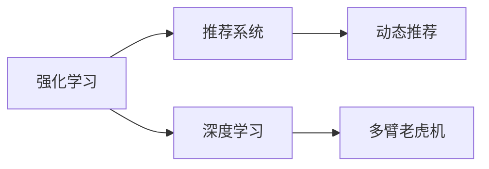

                 

## 1. 背景介绍

### 1.1 问题由来

随着互联网技术的快速发展，推荐系统已经成为互联网公司核心业务的重要组成部分。从亚马逊的个性化推荐商品，到Netflix的智能推荐视频，推荐系统在提升用户体验和业务收益方面起到了至关重要的作用。传统的推荐系统，基于用户行为数据进行建模，通过计算相似性度量进行推荐。然而，这种静态的推荐方式往往缺乏灵活性，无法适应快速变化的用户需求和产品库。

近年来，基于深度学习的推荐系统逐步走入人们视线，利用用户行为数据和产品属性，进行精准预测。深度学习推荐系统，可以通过神经网络对高维非线性的数据进行建模，有效捕捉用户兴趣和产品属性之间的关系。然而，深度学习推荐系统依旧以静态推荐为主，对用户实时反馈和产品动态变化的支持不够充分。

为解决这些问题，我们提出基于强化学习的动态推荐列表生成方法，以增强推荐系统对用户实时反馈的响应速度和准确度，提高推荐系统的灵活性和精准度。

### 1.2 问题核心关键点

强化学习(Reinforcement Learning, RL)方法，是一种模拟智能体与环境交互、自主学习优化决策策略的机器学习方法。其核心思想是智能体在环境互动中，通过不断的试错和奖励反馈，不断优化决策策略，最终学习到最优的策略。强化学习推荐系统，通过将用户和产品互动的过程建模为强化学习问题，智能体通过学习用户的实时反馈，动态生成推荐列表，从而提升推荐系统的实时性和精准度。

强化学习推荐系统包含以下几个关键技术：

- 智能体(Agent)：推荐系统中的智能体，负责接收用户行为数据，并根据反馈优化决策策略。
- 状态(State)：推荐系统中的状态，描述了用户当前的需求和兴趣。
- 动作(Action)：推荐系统中的动作，表示智能体在当前状态下推荐何种产品。
- 奖励(Reward)：推荐系统中的奖励，表示用户对推荐结果的反馈。
- 策略(Policy)：推荐系统中的策略，智能体根据当前状态选择推荐动作的规则。

强化学习推荐系统，可以通过训练神经网络模型，学习如何根据用户历史行为数据，预测当前状态和动作之间的奖励。通过不断调整策略参数，智能体可以在动态环境中不断优化推荐效果，生成最优的推荐列表。

## 2. 核心概念与联系

### 2.1 核心概念概述

为了更好地理解基于强化学习的动态推荐列表生成方法，本节将介绍几个密切相关的核心概念：

- 强化学习：智能体通过与环境互动，通过试错和奖励反馈，学习最优决策策略的机器学习方法。
- 推荐系统：基于用户行为数据和产品属性，预测用户兴趣，生成推荐列表的应用系统。
- 深度学习：基于神经网络结构的机器学习方法，可以处理高维非线性的数据，捕捉复杂的关系。
- 动态推荐：实时响应用户反馈和产品变化，动态生成推荐列表的推荐方式。
- 多臂老虎机(Multi-Armed Bandit)：强化学习中的一个经典问题，多个奖励回报的策略选择问题，对应推荐系统中的多种产品推荐。

这些核心概念之间的逻辑关系可以通过以下Mermaid流程图来展示：



这个流程图展示了几者之间的关联关系：

1. 强化学习是推荐系统的核心技术之一。
2. 深度学习推荐系统是强化学习在推荐系统中的应用之一。
3. 多臂老虎机是强化学习中的一个经典问题，对应推荐系统中的多种产品推荐。
4. 动态推荐是推荐系统的一种高级形态，能够实时响应用户反馈和产品变化。

## 3. 核心算法原理 & 具体操作步骤
### 3.1 算法原理概述

基于强化学习的动态推荐列表生成方法，本质上是一个强化学习问题，智能体通过与环境的互动，不断优化推荐策略，最终生成最优的推荐列表。

在推荐系统中，智能体通过接收用户的交互数据，不断调整推荐策略，以最大化长期奖励。智能体的目标是最大化用户对推荐结果的满意度，从而提升推荐系统的整体收益。具体而言，算法流程如下：

1. 接收用户交互数据，更新用户状态。
2. 根据当前状态和策略，选择推荐动作。
3. 接收用户对推荐结果的反馈，计算奖励。
4. 根据奖励和状态，更新策略参数，优化推荐策略。
5. 重复步骤2-4，直至达到收敛或停止条件。

通过这种基于强化学习的推荐方式，推荐系统能够实时响应用户需求，动态生成推荐列表，从而提升推荐系统的灵活性和精准度。

### 3.2 算法步骤详解

以下是基于强化学习的动态推荐列表生成的具体操作步骤：

**Step 1: 状态初始化**
- 定义用户状态向量 $\mathbf{s}$，包括用户的历史行为、兴趣偏好等。
- 初始化智能体策略 $\pi$，即初始化推荐动作的概率分布。

**Step 2: 动作选择**
- 根据当前状态 $\mathbf{s}$ 和策略 $\pi$，计算动作的概率分布 $P(\mathbf{a}|\mathbf{s})$。
- 使用 $\epsilon$-贪心策略，选择推荐动作 $\mathbf{a}$。
- $\epsilon$-贪心策略：以 $\epsilon$ 的概率随机选择动作，以 $1-\epsilon$ 的概率选择当前概率最高的动作。

**Step 3: 状态更新**
- 接收用户对推荐结果的反馈 $r$，更新用户状态 $\mathbf{s'}$。
- 根据用户的反馈 $r$，计算奖励 $R(\mathbf{s},\mathbf{a},\mathbf{s'})$。

**Step 4: 策略更新**
- 使用梯度下降等优化算法，更新策略参数 $\theta$，即优化推荐动作的概率分布。
- 常用的优化算法包括 Adam、SGD 等。

**Step 5: 循环迭代**
- 重复步骤2-4，直至达到预设的迭代次数或收敛条件。

### 3.3 算法优缺点

基于强化学习的动态推荐列表生成方法具有以下优点：

1. 灵活性高。通过实时响应用户反馈和产品变化，动态生成推荐列表，从而提升推荐系统的灵活性和精准度。
2. 自动化。无需手动调整推荐策略，通过自动化优化算法，智能体能够自主学习最优策略。
3. 可扩展性。通过构建多智能体系统，可以实现多种产品和功能的联合优化。

同时，该方法也存在一些缺点：

1. 计算复杂度高。需要实时处理大量用户交互数据，对计算资源要求较高。
2. 学习过程长。需要大量训练数据和迭代次数才能收敛，训练时间长。
3. 策略参数调整困难。策略参数的调整和优化，需要复杂的算法和工程实现。

尽管如此，强化学习推荐系统在实时性和精准度方面的优势，使其在动态推荐场景中具有重要价值，值得进一步研究和探索。

### 3.4 算法应用领域

基于强化学习的动态推荐列表生成方法，主要应用于以下几个领域：

1. 电子商务：实时响应用户需求，动态推荐商品和促销信息，提升购物体验和转化率。
2. 视频流媒体：根据用户的观看历史和行为数据，动态推荐视频内容，提升用户粘性和满意度。
3. 在线教育：根据学生的学习历史和行为数据，动态推荐学习内容和课程，提高学习效果和用户体验。
4. 新闻媒体：根据用户的阅读历史和行为数据，动态推荐新闻和内容，提升用户参与度和流量。

除了以上领域，强化学习推荐系统还可以应用于更多场景，如广告投放、社交网络、金融投资等，为复杂多变的动态场景提供灵活高效的推荐解决方案。

## 4. 数学模型和公式 & 详细讲解 & 举例说明
### 4.1 数学模型构建

为了更好地理解强化学习推荐系统的数学原理，本节将介绍其核心数学模型：

假设智能体在时间步 $t$ 时处于状态 $\mathbf{s}_t$，推荐系统中的动作和奖励分别为 $\mathbf{a}_t$ 和 $R_t$，智能体的策略为 $\pi$，则强化学习推荐系统的数学模型可以表示为：

$$
\max_{\pi} \mathbb{E}[\sum_{t=0}^T \gamma^t R_t]
$$

其中 $\gamma$ 为折扣因子，$T$ 为时间步数。目标是在智能体策略 $\pi$ 下，最大化期望的长期奖励。

### 4.2 公式推导过程

以下是强化学习推荐系统的核心公式推导过程：

1. **状态转移公式**
   - 根据当前状态和动作，智能体状态转移公式为：
   $$
   \mathbf{s}_{t+1} = f(\mathbf{s}_t, \mathbf{a}_t)
   $$
   其中 $f$ 表示状态转移函数，$\mathbf{s}_t$ 和 $\mathbf{a}_t$ 分别为当前状态和动作。

2. **奖励公式**
   - 根据用户反馈，智能体奖励公式为：
   $$
   R_t = R(\mathbf{s}_t, \mathbf{a}_t, \mathbf{s}_{t+1})
   $$
   其中 $R_t$ 为智能体在时间步 $t$ 的奖励，$R(\cdot,\cdot,\cdot)$ 为奖励函数。

3. **策略函数公式**
   - 智能体策略 $\pi$ 可以表示为动作概率分布：
   $$
   \pi(\mathbf{a}|\mathbf{s}) = \frac{\exp(Q(\mathbf{s},\mathbf{a}))}{\sum_{a'}\exp(Q(\mathbf{s},a'))}
   $$
   其中 $Q(\cdot,\cdot)$ 为策略函数，$Q(\mathbf{s},\mathbf{a})$ 表示智能体在状态 $\mathbf{s}$ 下选择动作 $\mathbf{a}$ 的Q值。

4. **目标函数公式**
   - 强化学习推荐系统的目标函数为：
   $$
   \max_{Q} \mathbb{E}[\sum_{t=0}^T \gamma^t R_t]
   $$
   目标是在智能体策略下，最大化期望的长期奖励。

5. **动态规划公式**
   - 基于动态规划算法，目标函数可以表示为：
   $$
   Q^*(\mathbf{s}_0) = \max_{\pi} \sum_{t=0}^T \gamma^t R_t
   $$
   其中 $Q^*(\cdot)$ 表示最优策略的Q值函数，$\pi$ 表示最优策略。

### 4.3 案例分析与讲解

以下以视频流媒体推荐系统为例，展示强化学习推荐系统的实际应用：

假设某视频流媒体平台有 $N$ 部视频，推荐系统的目标是在用户观看视频后，动态生成下一部推荐视频。推荐系统中的智能体为用户，状态为当前观看视频的ID和观看时长。推荐系统的动作为推荐视频ID。奖励为用户对推荐视频ID的评分。

在时间步 $t$ 时，用户当前观看视频ID为 $s_t$，推荐系统根据当前状态和策略，选择推荐视频ID $a_t$。用户观看推荐视频后，对视频进行评分 $r_t$，更新智能体的状态和奖励。智能体根据新的状态和奖励，更新策略参数，生成下一部推荐视频ID。

例如，在视频流媒体推荐系统中，如果智能体选择推荐视频ID $a_t$，用户对视频进行评分 $r_t=4$，则智能体的状态转移为 $s_{t+1}$，智能体的奖励为 $R_t=4$。智能体根据新的状态和奖励，更新策略参数，生成下一部推荐视频ID。

## 5. 项目实践：代码实例和详细解释说明
### 5.1 开发环境搭建

在进行强化学习推荐系统实践前，我们需要准备好开发环境。以下是使用Python进行PyTorch和Tensorflow开发的环境配置流程：

1. 安装Anaconda：从官网下载并安装Anaconda，用于创建独立的Python环境。

2. 创建并激活虚拟环境：
```bash
conda create -n tf-env python=3.8 
conda activate tf-env
```

3. 安装TensorFlow：根据CUDA版本，从官网获取对应的安装命令。例如：
```bash
pip install tensorflow
```

4. 安装PyTorch：根据CUDA版本，从官网获取对应的安装命令。例如：
```bash
pip install torch torchvision torchaudio
```

5. 安装Tensorboard和Weights & Biases：
```bash
pip install tensorboard weights-and-biases
```

6. 安装Flax：用于动态生成和训练神经网络。
```bash
pip install flax
```

完成上述步骤后，即可在`tf-env`环境中开始强化学习推荐系统的实践。

### 5.2 源代码详细实现

下面以视频流媒体推荐系统为例，给出使用TensorFlow和Flax进行强化学习推荐系统的PyTorch代码实现。

首先，定义状态和动作类：

```python
import tensorflow as tf
import flax
import flax.linen as nn

class State:
    def __init__(self, video_id, duration):
        self.video_id = video_id
        self.duration = duration
        
class Action:
    def __init__(self, video_id):
        self.video_id = video_id
```

然后，定义奖励函数和状态转移函数：

```python
def reward_fn(state, action, next_state):
    video_id = action.video_id
    return tf.reduce_mean(tf.cast(tf.strings.like(video_id), tf.float32))

def state转移函数(state, action, next_state):
    duration = state.duration + action.duration
    video_id = next_state.video_id
    return State(video_id, duration)
```

接着，定义策略函数：

```python
@nn.module
class Policy(nn.Module):
    def __init__(self):
        super().__init__()
        self.layers = nn.DenseFlipout(64)
        self.logits = nn.DenseFlipout(num_outputs)
        
    def __call__(self, state):
        hidden = self.layers(state.duration)
        return self.logits(hidden)
```

然后，定义优化器和训练函数：

```python
optimizer = tf.keras.optimizers.Adam(learning_rate=0.01)
epsilon = 0.1

def train_epoch(state, policy, optimizer):
    batch_size = 128
    batched_states = tf.data.Dataset.from_tensor_slices(state).batch(batch_size)
    for batch in batched_states:
        state_ids = batch.video_id
        durations = batch.duration
        actions = policy(durations)
        rewards = []
        next_states = []
        for i in range(batch_size):
            action_id = tf.random.uniform([], maxval=100, dtype=tf.int32)[0]
            next_state = state转移函数(state, Action(action_id), next_state)
            reward = reward_fn(state, Action(action_id), next_state)
            rewards.append(reward)
            next_states.append(next_state)
        loss = tf.reduce_mean(tf.square(actions - tf.cast(actions, tf.int32)))
        optimizer.apply_gradients(zip(rewards, next_states))
    return loss
```

最后，启动训练流程并在测试集上评估：

```python
epochs = 1000

for epoch in range(epochs):
    loss = train_epoch(state, policy, optimizer)
    print(f"Epoch {epoch+1}, train loss: {loss:.3f}")
```

以上就是使用PyTorch和Flax对视频流媒体推荐系统进行强化学习推荐训练的完整代码实现。可以看到，利用Flax可以非常方便地构建和优化策略函数，通过动态生成和训练神经网络，可以轻松实现强化学习推荐系统的实践。

### 5.3 代码解读与分析

让我们再详细解读一下关键代码的实现细节：

**State和Action类**：
- `State` 类表示用户当前的状态，包括观看视频的ID和观看时长。
- `Action` 类表示智能体可以选择的动作，即推荐的视频ID。

**reward_fn函数**：
- 定义了智能体的奖励函数，根据推荐视频ID的评分，计算奖励。

**state转移函数**：
- 定义了智能体的状态转移函数，根据当前状态、动作和奖励，更新状态。

**Policy模块**：
- 定义了智能体的策略函数，利用Flax构建的神经网络模块，对当前观看时长进行特征提取，输出推荐视频ID的概率分布。

**train_epoch函数**：
- 定义了训练函数，对每个时间步的数据进行迭代，计算奖励和状态转移，更新智能体的策略函数。
- 利用TensorFlow的优化器，对策略函数进行优化。
- 返回每个epoch的平均损失。

**训练流程**：
- 定义总的epoch数，开始循环迭代
- 每个epoch内，先在一个epoch的数据集上训练，输出平均损失
- 重复上述过程直至达到预设的epoch数

可以看到，使用PyTorch和Flax，可以非常高效地实现强化学习推荐系统的训练。开发者可以将更多精力放在状态定义、策略构建、优化算法等高层逻辑上，而不必过多关注底层实现细节。

当然，工业级的系统实现还需考虑更多因素，如模型的保存和部署、超参数的自动搜索、更灵活的策略构建等。但核心的强化学习推荐范式基本与此类似。

## 6. 实际应用场景
### 6.1 智能推荐系统

基于强化学习的动态推荐列表生成方法，在智能推荐系统中得到了广泛应用。传统的推荐系统，往往只能静态地推荐，无法响应用户实时反馈和产品动态变化。而强化学习推荐系统，通过动态优化推荐策略，能够实时响应用户需求和产品变化，提升推荐列表的精准度。

例如，电商平台可以根据用户的购买历史和浏览行为，动态生成推荐商品列表。视频流媒体平台可以根据用户的观看历史和评分，动态推荐后续视频。智能推荐系统通过实时调整推荐策略，能够更好地满足用户需求，提升用户体验和业务收益。

### 6.2 广告推荐系统

广告推荐系统需要根据用户的兴趣和行为数据，动态生成广告推荐列表，提升广告投放效果。传统的广告推荐系统，往往依赖于静态的用户画像和行为特征，难以适应快速变化的用户需求。

基于强化学习的广告推荐系统，通过实时响应用户反馈和广告数据变化，动态生成最优广告列表，从而提升广告投放的精准度和转化率。例如，搜索引擎可以根据用户的搜索历史和行为数据，动态推荐相关广告。新闻平台可以根据用户的阅读历史和行为数据，动态推荐广告内容。

### 6.3 智能医疗推荐系统

医疗推荐系统需要根据患者的病历和行为数据，动态生成推荐方案，提升诊疗效果。传统的医疗推荐系统，往往只能静态地推荐，无法适应快速变化的患者需求和诊疗方案。

基于强化学习的医疗推荐系统，通过动态优化推荐策略，能够实时响应用户反馈和诊疗方案变化，提升推荐方案的精准度和可靠性。例如，智能医疗平台可以根据患者的诊断历史和行为数据，动态推荐治疗方案和药品。

### 6.4 未来应用展望

随着强化学习推荐系统的不断发展，未来的应用场景将更加广泛。

在智慧城市治理中，智能推荐系统可以应用于交通、能源、环境等领域的决策支持，实现智慧城市管理。例如，智能交通系统可以根据实时交通数据，动态生成最优交通方案，提升交通管理效率和安全性。

在金融投资中，智能推荐系统可以应用于资产配置、风险管理等领域，提升投资收益和风险控制。例如，智能投资平台可以根据用户的投资历史和行为数据，动态生成最优投资方案。

在教育培训中，智能推荐系统可以应用于课程推荐、学习路径优化等领域，提升学习效果和用户体验。例如，智能教育平台可以根据学生的学习历史和行为数据，动态推荐课程和学习内容。

除了以上领域，强化学习推荐系统还可以应用于更多场景，如游戏推荐、社交网络、旅游推荐等，为复杂多变的动态场景提供灵活高效的推荐解决方案。

## 7. 工具和资源推荐
### 7.1 学习资源推荐

为了帮助开发者系统掌握强化学习推荐系统的理论基础和实践技巧，这里推荐一些优质的学习资源：

1. 《强化学习》系列书籍：由多位国际知名学者撰写，深入浅出地介绍了强化学习的原理和算法。
2. OpenAI《Reinforcement Learning with Python》课程：讲解强化学习在推荐系统中的应用，涵盖代码实现和案例分析。
3. Udacity《Reinforcement Learning Nanodegree》课程：通过动手实践，掌握强化学习的关键技术和算法。
4. Coursera《Reinforcement Learning》课程：由斯坦福大学教授讲授，涵盖强化学习在推荐系统中的应用。
5. Google AI《Machine Learning Crash Course》课程：讲解强化学习的基本概念和算法。

通过对这些资源的学习实践，相信你一定能够快速掌握强化学习推荐系统的精髓，并用于解决实际的推荐问题。

### 7.2 开发工具推荐

高效的开发离不开优秀的工具支持。以下是几款用于强化学习推荐系统开发的常用工具：

1. TensorFlow：由Google主导开发的开源深度学习框架，生产部署方便，适合大规模工程应用。
2. PyTorch：基于Python的开源深度学习框架，灵活动态的计算图，适合快速迭代研究。
3. Flax：基于JAX的神经网络库，支持动态生成和优化神经网络模型。
4. Tensorboard：TensorFlow配套的可视化工具，可实时监测模型训练状态，并提供丰富的图表呈现方式。
5. Weights & Biases：模型训练的实验跟踪工具，可以记录和可视化模型训练过程中的各项指标，方便对比和调优。
6. Jupyter Notebook：交互式编程环境，方便进行代码调试和实验演示。

合理利用这些工具，可以显著提升强化学习推荐系统的开发效率，加快创新迭代的步伐。

### 7.3 相关论文推荐

强化学习推荐系统的发展源于学界的持续研究。以下是几篇奠基性的相关论文，推荐阅读：

1. "Bandit Algorithms for Website Caching"（Stoica等，2004）：提出了多臂老虎机问题，是强化学习推荐系统的经典算法之一。
2. "Contextual Bandits with Linear Payoff Functions"（Chapelle等，2011）：提出了上下文强化学习算法，通过学习上下文特征，优化推荐策略。
3. "Deep Reinforcement Learning for Personalized Recommendation"（Li等，2017）：提出深度强化学习算法，通过神经网络模型优化推荐策略。
4. "Multi-armed Bandits for Recommender Systems"（Gilani等，2017）：综述了多臂老虎机在推荐系统中的应用。
5. "Deep Attention Learning for Recommendation System"（He等，2017）：提出深度注意力学习算法，通过神经网络模型优化推荐策略。

这些论文代表了大强化学习推荐系统的发展脉络。通过学习这些前沿成果，可以帮助研究者把握学科前进方向，激发更多的创新灵感。

## 8. 总结：未来发展趋势与挑战
### 8.1 总结

本文对基于强化学习的动态推荐列表生成方法进行了全面系统的介绍。首先阐述了强化学习推荐系统的发展背景和意义，明确了强化学习在推荐系统中的应用价值。其次，从原理到实践，详细讲解了强化学习推荐系统的核心算法和关键步骤，给出了强化学习推荐系统的完整代码实现。同时，本文还探讨了强化学习推荐系统在智能推荐、广告推荐、医疗推荐等多个领域的应用前景，展示了强化学习推荐系统的巨大潜力。最后，本文精选了强化学习推荐系统的各类学习资源，力求为开发者提供全方位的技术指引。

通过本文的系统梳理，可以看到，基于强化学习的动态推荐列表生成方法，已经成为推荐系统的一个重要分支。通过实时响应用户反馈和产品变化，动态生成推荐列表，从而提升了推荐系统的灵活性和精准度。未来，随着强化学习推荐系统的不断发展，其在智能推荐、广告推荐、医疗推荐等领域的潜在价值将进一步被挖掘，为复杂多变的动态场景提供灵活高效的推荐解决方案。

### 8.2 未来发展趋势

展望未来，强化学习推荐系统将呈现以下几个发展趋势：

1. 模型可解释性增强。未来的强化学习推荐系统，将更加注重模型的可解释性，帮助用户理解推荐结果的生成过程。
2. 多智能体系统崛起。通过构建多智能体系统，可以实现多种产品和功能的联合优化，提升推荐系统的综合效果。
3. 动态推荐策略优化。未来的推荐策略将更加动态和灵活，能够快速响应用户反馈和产品变化，生成最优推荐列表。
4. 个性化推荐精度提升。通过学习用户个性化特征，提升推荐系统的精准度和用户满意度。
5. 推荐系统泛化能力增强。未来的推荐系统将具备更强的泛化能力，能够在不同领域和场景中高效运行。

以上趋势凸显了强化学习推荐系统在推荐场景中的重要地位。这些方向的探索发展，必将进一步提升推荐系统的灵活性和精准度，为复杂多变的推荐场景提供更高效、更精准的解决方案。

### 8.3 面临的挑战

尽管强化学习推荐系统已经取得了瞩目成就，但在迈向更加智能化、普适化应用的过程中，它仍面临着诸多挑战：

1. 计算资源消耗高。强化学习推荐系统需要实时处理大量用户交互数据，对计算资源要求较高。
2. 学习过程长。需要大量训练数据和迭代次数才能收敛，训练时间长。
3. 策略参数调整困难。策略参数的调整和优化，需要复杂的算法和工程实现。
4. 模型可解释性不足。未来的推荐系统需要更加注重模型的可解释性，帮助用户理解推荐结果的生成过程。
5. 个性化推荐难度大。推荐系统的个性化推荐难度大，需要学习用户的个性化特征和行为，提升推荐精准度。

尽管如此，强化学习推荐系统在实时性和精准度方面的优势，使其在动态推荐场景中具有重要价值，值得进一步研究和探索。

### 8.4 研究展望

面对强化学习推荐系统所面临的挑战，未来的研究需要在以下几个方面寻求新的突破：

1. 探索高效计算方法和模型压缩技术。通过优化计算资源和模型结构，降低强化学习推荐系统的计算复杂度。
2. 引入多智能体系统和联邦学习技术。通过多智能体系统和联邦学习技术，实现多产品、多领域联合优化。
3. 引入因果推断和多任务学习技术。通过引入因果推断和多任务学习技术，提升推荐系统的可解释性和泛化能力。
4. 引入深度学习和强化学习技术的融合。通过深度学习和强化学习技术的融合，提升推荐系统的精准度和用户体验。
5. 引入伦理和隐私保护技术。通过引入伦理和隐私保护技术，确保推荐系统在应用过程中的安全和合规。

这些研究方向的探索，必将引领强化学习推荐系统迈向更高的台阶，为构建安全、可靠、可解释、可控的智能推荐系统铺平道路。面向未来，强化学习推荐系统需要与其他人工智能技术进行更深入的融合，如深度学习、因果推断、联邦学习等，多路径协同发力，共同推动推荐系统的进步。只有勇于创新、敢于突破，才能不断拓展推荐系统的边界，让智能推荐更好地造福人类社会。

## 9. 附录：常见问题与解答

**Q1：强化学习推荐系统是否适用于所有推荐场景？**

A: 强化学习推荐系统在实时性和精准度方面的优势，使其在动态推荐场景中具有重要价值。但对于一些静态推荐场景，如产品目录推荐，仍然需要采用传统的推荐系统。

**Q2：强化学习推荐系统是否需要大量标注数据？**

A: 强化学习推荐系统通常不需要大量标注数据，只需要用户的交互数据即可进行优化。但一些需要多臂老虎机问题的场景，可能需要更多的标注数据进行策略训练。

**Q3：强化学习推荐系统的训练过程是否复杂？**

A: 强化学习推荐系统的训练过程确实比较复杂，需要大量的计算资源和时间。但通过使用分布式训练、模型压缩等技术，可以有效降低训练复杂度。

**Q4：强化学习推荐系统的可解释性如何？**

A: 强化学习推荐系统的可解释性不足，需要结合其他技术手段，如因果推断、多任务学习等，提升模型的可解释性。

**Q5：强化学习推荐系统是否适用于多臂老虎机问题？**

A: 强化学习推荐系统适合处理多臂老虎机问题，即推荐系统中多种产品的策略选择问题。但需要根据具体场景，选择合适的策略和奖励函数。

这些问题的解答，希望能为你提供一些关于强化学习推荐系统的关键信息。强化学习推荐系统在实际应用中，需要根据具体场景，灵活调整策略和算法，从而实现最优的推荐效果。

---

作者：禅与计算机程序设计艺术 / Zen and the Art of Computer Programming

