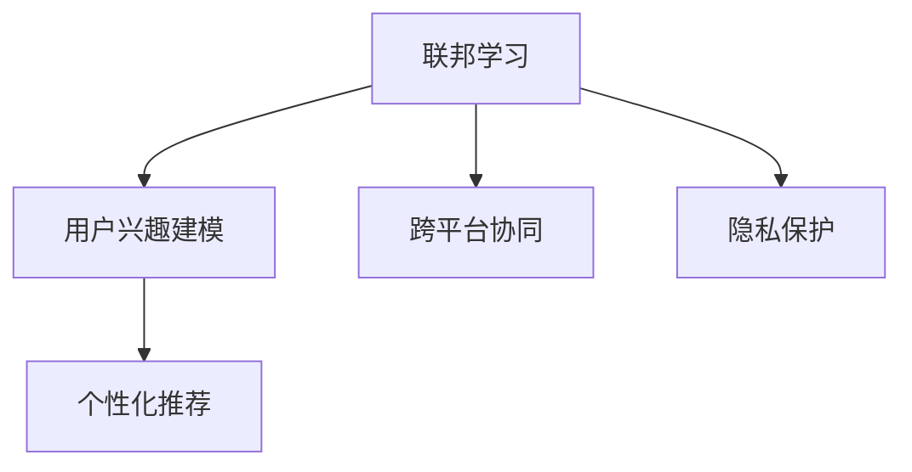

                 

# 基于联邦学习的跨平台用户兴趣建模

> 关键词：联邦学习,用户兴趣建模,跨平台协同,隐私保护,个性化推荐

## 1. 背景介绍

### 1.1 问题由来
随着互联网和移动互联网的快速发展，用户行为数据呈爆炸式增长。各大平台通过追踪和分析用户行为数据，获取用户的兴趣爱好，从而提供个性化的产品推荐、广告投放等。然而，数据孤岛现象严重，各平台之间数据不互通，使得用户兴趣建模难以全面覆盖，推荐效果大打折扣。

为了打破数据孤岛，联邦学习应运而生。联邦学习是一种分布式机器学习方法，各平台仅在本地数据上训练模型，并通过模型参数的交换和汇总，共同提升整体模型的性能。通过这种方式，联邦学习实现了跨平台的数据协同和隐私保护。

### 1.2 问题核心关键点
联邦学习在用户兴趣建模中具有独特的优势，主要体现在以下几个方面：

- 数据隐私保护：各平台仅使用本地数据训练模型，无需将数据上传至中央服务器，从而保护了用户隐私。
- 跨平台协同：各平台通过模型参数交换，实现数据协同，优化模型性能，提升个性化推荐效果。
- 分布式计算：各平台在本地进行分布式计算，避免了集中式计算对单点性能的依赖，提高了计算效率。
- 鲁棒性强：模型参数交换可以在非理想的网络环境下进行，保证了系统的鲁棒性和可靠性。

## 2. 核心概念与联系

### 2.1 核心概念概述

为了更好地理解基于联邦学习的跨平台用户兴趣建模方法，本节将介绍几个密切相关的核心概念：

- 联邦学习（Federated Learning）：一种分布式机器学习方法，各参与方在本地数据上训练模型，并通过模型参数的交换和汇总，共同提升整体模型的性能。
- 用户兴趣建模（User Interest Modeling）：通过分析用户行为数据，提取用户兴趣特征，从而为用户提供个性化的推荐服务。
- 跨平台协同（Cross-platform Collaboration）：通过联邦学习实现跨平台的数据协同，提升模型性能，实现统一的用户兴趣建模。
- 隐私保护（Privacy Protection）：联邦学习通过本地训练和参数交换，避免了数据上传和集中式计算，保护了用户隐私。
- 个性化推荐（Personalized Recommendation）：根据用户兴趣特征，推荐相关产品或服务，提升用户体验。

这些核心概念之间的逻辑关系可以通过以下Mermaid流程图来展示：



这个流程图展示了大模型微调的各个核心概念及其之间的关系：

1. 联邦学习通过本地训练和参数交换，实现了跨平台的数据协同，提升了模型性能。
2. 用户兴趣建模通过分析用户行为数据，提取用户兴趣特征，用于个性化推荐。
3. 跨平台协同增强了联邦学习的模型性能，实现了统一的用户兴趣建模。
4. 隐私保护保护了用户隐私，各平台仅在本地数据上训练模型，无需将数据上传至中央服务器。
5. 个性化推荐利用用户兴趣特征，推荐相关产品或服务，提升用户体验。

这些概念共同构成了基于联邦学习的跨平台用户兴趣建模框架，使得联邦学习在大数据时代中得以广泛应用。

## 3. 核心算法原理 & 具体操作步骤
### 3.1 算法原理概述

基于联邦学习的跨平台用户兴趣建模，其核心思想是：各平台在本地数据上训练本地模型，并通过模型参数的交换和汇总，共同提升整体模型的性能。具体而言，假设有 $K$ 个参与方，每个参与方在本地数据集 $D_k$ 上训练本地模型 $f_k$，模型参数为 $\theta_k$。通过模型参数的交换和汇总，得到全局模型 $f_{global}$ 的参数 $\theta_{global}$，使得全局模型能够更好地捕捉用户兴趣特征，提供更精准的个性化推荐服务。

联邦学习的过程通常分为以下几个步骤：

1. 数据预处理：将原始数据集 $D$ 划分为 $K$ 个子集，分别存储在各参与方。
2. 模型初始化：各参与方初始化本地模型参数 $\theta_k$，一般取随机初始值。
3. 本地训练：各参与方在本地数据集 $D_k$ 上训练本地模型 $f_k$，更新模型参数 $\theta_k$。
4. 参数交换：各参与方将模型参数 $\theta_k$ 交换至其他参与方，进行参数的汇总和更新。
5. 全局训练：各参与方根据参数交换得到的更新结果，调整本地模型参数 $\theta_k$，继续训练本地模型。
6. 模型评估：各参与方在本地测试集上评估本地模型的性能，通过不断迭代提升全局模型的性能。

### 3.2 算法步骤详解

下面详细介绍联邦学习跨平台用户兴趣建模的具体步骤：

**Step 1: 数据预处理**

1. 将原始数据集 $D$ 划分为 $K$ 个子集，分别存储在各参与方，即 $D_k = \{x_{ik}, y_{ik}\}_{i=1}^N$，其中 $x_{ik}$ 表示用户行为数据，$y_{ik}$ 表示用户兴趣标签。
2. 各参与方对本地数据集进行预处理，如数据清洗、特征选择等，得到训练集、验证集和测试集。

**Step 2: 模型初始化**

1. 各参与方初始化本地模型参数 $\theta_k$，一般取随机初始值。
2. 各参与方在本地训练集上运行一次前向传播，得到初始预测值 $f_k(x_{ik})$。
3. 各参与方计算初始损失函数 $L_k(\theta_k)$，即本地损失函数的和，$L_k(\theta_k) = \frac{1}{N_k} \sum_{i=1}^N L(f_k(x_{ik}), y_{ik})$。

**Step 3: 本地训练**

1. 各参与方在本地训练集 $D_k$ 上训练本地模型 $f_k$，更新模型参数 $\theta_k$。
2. 各参与方在本地验证集上评估本地模型的性能，选择合适的参数更新策略。

**Step 4: 参数交换**

1. 各参与方通过网络交换模型参数 $\theta_k$，交换方式包括中心化或去中心化的参数交换算法，如FedAvg、FedGunmetal等。
2. 各参与方根据接收到的参数更新结果，调整本地模型参数 $\theta_k$。

**Step 5: 全局训练**

1. 各参与方在本地训练集 $D_k$ 上运行一次前向传播，得到更新后的预测值 $f_k(x_{ik})$。
2. 各参与方计算全局损失函数 $L_{global}(\theta_{global})$，即各参与方损失函数的加权和，$L_{global}(\theta_{global}) = \frac{1}{N} \sum_{k=1}^K \frac{N_k}{N} L_k(\theta_{global})$。
3. 各参与方根据全局损失函数 $L_{global}(\theta_{global})$ 更新全局模型参数 $\theta_{global}$，即 $\theta_{global} \leftarrow \theta_{global} - \eta \nabla_{\theta_{global}}L_{global}(\theta_{global})$。
4. 各参与方在本地验证集上评估全局模型的性能，根据需要调整学习率等超参数。

**Step 6: 模型评估**

1. 各参与方在本地测试集上评估全局模型的性能，如准确率、召回率、F1分数等。
2. 各参与方通过多次迭代提升全局模型的性能，直到达到预设的收敛条件。

### 3.3 算法优缺点

基于联邦学习的跨平台用户兴趣建模方法具有以下优点：

1. 数据隐私保护：各参与方仅在本地数据上训练模型，无需将数据上传至中央服务器，从而保护了用户隐私。
2. 跨平台协同：各参与方通过模型参数交换，实现数据协同，优化模型性能，提升个性化推荐效果。
3. 分布式计算：各参与方在本地进行分布式计算，避免了集中式计算对单点性能的依赖，提高了计算效率。
4. 鲁棒性强：模型参数交换可以在非理想的网络环境下进行，保证了系统的鲁棒性和可靠性。

同时，该方法也存在一定的局限性：

1. 计算复杂度高：联邦学习的参数交换和汇总需要频繁的网络通信，计算复杂度高。
2. 收敛速度慢：由于各参与方本地模型更新频率不同，全局模型收敛速度较慢。
3. 通信开销大：频繁的模型参数交换增加了网络通信开销，对带宽和延迟要求较高。
4. 数据异构性：各参与方数据分布不均，可能影响全局模型的性能。

尽管存在这些局限性，但就目前而言，基于联邦学习的用户兴趣建模方法仍是大数据时代中重要的范式。未来相关研究的重点在于如何进一步降低联邦学习的计算复杂度和通信开销，提高全局模型的收敛速度，同时兼顾数据异构性等问题。

### 3.4 算法应用领域

基于联邦学习的跨平台用户兴趣建模方法，在多个领域中得到了广泛应用，例如：

- 个性化推荐系统：通过联邦学习实现跨平台的协同推荐，提升推荐效果，降低推荐延迟。
- 医疗数据分析：各医疗机构在本地数据上训练模型，共同提升医疗数据分析的准确性和可靠性。
- 广告投放优化：广告投放平台通过联邦学习优化广告投放策略，提升广告效果，保护用户隐私。
- 金融风控：金融机构在本地数据上训练模型，共同提升风控模型的性能，保护用户隐私。
- 教育数据分析：教育机构在本地数据上训练模型，共同提升教育数据分析的准确性和可靠性。

除了上述这些经典应用外，联邦学习还被创新性地应用于更多场景中，如城市交通管理、电力系统优化、供应链管理等，为各行业带来了新的变革。随着联邦学习技术的不断进步，相信联邦学习必将在更广阔的应用领域大放异彩。

## 4. 数学模型和公式 & 详细讲解  
### 4.1 数学模型构建

本节将使用数学语言对基于联邦学习的跨平台用户兴趣建模过程进行更加严格的刻画。

记原始数据集 $D = \{(x_i, y_i)\}_{i=1}^N$，其中 $x_i \in \mathbb{R}^d$ 表示用户行为数据，$y_i \in \{0, 1\}$ 表示用户兴趣标签。假设有 $K$ 个参与方，每个参与方在本地数据集 $D_k = \{(x_{ik}, y_{ik})\}_{i=1}^N$ 上训练本地模型 $f_k$，模型参数为 $\theta_k$。全局模型 $f_{global}$ 的参数为 $\theta_{global}$。

定义本地模型在数据样本 $(x, y)$ 上的损失函数为 $L_k(\theta_k, x, y)$，则在本地数据集 $D_k$ 上的经验风险为：

$$
\mathcal{L}_k(\theta_k) = \frac{1}{N_k} \sum_{i=1}^N L_k(\theta_k, x_{ik}, y_{ik})
$$

全局模型在数据样本 $(x, y)$ 上的损失函数为 $L_{global}(\theta_{global}, x, y)$，则在全局数据集 $D$ 上的经验风险为：

$$
\mathcal{L}_{global}(\theta_{global}) = \frac{1}{N} \sum_{i=1}^N L_{global}(\theta_{global}, x_i, y_i)
$$

联邦学习的目标是最小化全局经验风险，即找到最优参数：

$$
\theta_{global}^* = \mathop{\arg\min}_{\theta_{global}} \mathcal{L}_{global}(\theta_{global})
$$

在实践中，我们通常使用基于梯度的优化算法（如SGD、Adam等）来近似求解上述最优化问题。设 $\eta$ 为学习率，$\lambda$ 为正则化系数，则参数的更新公式为：

$$
\theta_{global} \leftarrow \theta_{global} - \eta \nabla_{\theta_{global}}\mathcal{L}_{global}(\theta_{global}) - \eta\lambda\theta_{global}
$$

其中 $\nabla_{\theta_{global}}\mathcal{L}_{global}(\theta_{global})$ 为全局损失函数对全局模型参数 $\theta_{global}$ 的梯度，可通过反向传播算法高效计算。

### 4.2 公式推导过程

以下我们以二分类任务为例，推导交叉熵损失函数及其梯度的计算公式。

假设模型 $f_k$ 在输入 $x$ 上的输出为 $\hat{y}_k = f_k(x)$，表示样本属于正类的概率。真实标签 $y \in \{0, 1\}$。则二分类交叉熵损失函数定义为：

$$
L_k(\theta_k, x, y) = -[y_k\log \hat{y}_k + (1-y_k)\log (1-\hat{y}_k)]
$$

将其代入本地损失函数公式，得：

$$
\mathcal{L}_k(\theta_k) = -\frac{1}{N_k}\sum_{i=1}^N [y_{ik}\log f_k(x_{ik})+(1-y_{ik})\log(1-f_k(x_{ik}))]
$$

根据链式法则，全局损失函数对全局模型参数 $\theta_{global}$ 的梯度为：

$$
\frac{\partial \mathcal{L}_{global}(\theta_{global})}{\partial \theta_{global}} = -\frac{1}{N}\sum_{i=1}^N (\frac{y_i}{f_{global}(x_i)}-\frac{1-y_i}{1-f_{global}(x_i)}) \frac{\partial f_{global}(x_i)}{\partial \theta_{global}}
$$

其中 $\frac{\partial f_{global}(x_i)}{\partial \theta_{global}}$ 可进一步递归展开，利用自动微分技术完成计算。

在得到全局损失函数的梯度后，即可带入全局模型参数更新公式，完成全局模型的迭代优化。重复上述过程直至收敛，最终得到适应全局数据集的模型参数 $\theta_{global}^*$。

## 5. 项目实践：代码实例和详细解释说明
### 5.1 开发环境搭建

在进行联邦学习项目实践前，我们需要准备好开发环境。以下是使用Python进行PyTorch和TensorFlow开发的环境配置流程：

1. 安装Anaconda：从官网下载并安装Anaconda，用于创建独立的Python环境。

2. 创建并激活虚拟环境：
```bash
conda create -n fl-env python=3.8 
conda activate fl-env
```

3. 安装PyTorch和TensorFlow：根据CUDA版本，从官网获取对应的安装命令。例如：
```bash
conda install pytorch torchvision torchaudio cudatoolkit=11.1 -c pytorch -c conda-forge
conda install tensorflow tensorflow-gpu=2.7.0 -c tensorflow -c conda-forge
```

4. 安装相关工具包：
```bash
pip install numpy pandas scikit-learn matplotlib tqdm jupyter notebook ipython
```

完成上述步骤后，即可在`fl-env`环境中开始联邦学习实践。

### 5.2 源代码详细实现

下面我们以联邦学习实现个性化推荐系统的任务为例，给出使用PyTorch和TensorFlow对联邦学习进行代码实现。

首先，定义数据处理函数：

```python
import numpy as np
import pandas as pd
from sklearn.model_selection import train_test_split
from sklearn.preprocessing import StandardScaler

def load_data(file_path):
    df = pd.read_csv(file_path)
    X = df[['item_id', 'user_id', 'timestamp']]
    y = df['label']
    X_train, X_test, y_train, y_test = train_test_split(X, y, test_size=0.2, random_state=42)
    scaler = StandardScaler()
    X_train = scaler.fit_transform(X_train)
    X_test = scaler.transform(X_test)
    return X_train, X_test, y_train, y_test
```

然后，定义模型和优化器：

```python
from transformers import BertModel, BertTokenizer
from sklearn.metrics import accuracy_score

def create_model():
    tokenizer = BertTokenizer.from_pretrained('bert-base-cased')
    model = BertModel.from_pretrained('bert-base-cased')
    return tokenizer, model

def create_optimizer(model, learning_rate=0.001):
    optimizer = torch.optim.Adam(model.parameters(), lr=learning_rate)
    return optimizer
```

接着，定义训练和评估函数：

```python
import torch
import torch.nn.functional as F

def train_epoch(model, optimizer, data_loader):
    model.train()
    epoch_loss = 0
    for batch in data_loader:
        input_ids = batch['input_ids'].to(device)
        attention_mask = batch['attention_mask'].to(device)
        labels = batch['labels'].to(device)
        model.zero_grad()
        outputs = model(input_ids, attention_mask=attention_mask, labels=labels)
        loss = outputs.loss
        epoch_loss += loss.item()
        loss.backward()
        optimizer.step()
    return epoch_loss / len(data_loader)

def evaluate(model, data_loader):
    model.eval()
    predictions, labels = [], []
    with torch.no_grad():
        for batch in data_loader:
            input_ids = batch['input_ids'].to(device)
            attention_mask = batch['attention_mask'].to(device)
            labels = batch['labels'].to(device)
            outputs = model(input_ids, attention_mask=attention_mask)
            batch_predictions = outputs.logits.argmax(dim=2).to('cpu').tolist()
            batch_labels = batch_labels.to('cpu').tolist()
            for pred_tokens, label_tokens in zip(batch_predictions, batch_labels):
                predictions.append(pred_tokens[:len(label_tokens)])
                labels.append(label_tokens)
    
    accuracy = accuracy_score(labels, predictions)
    return accuracy
```

最后，启动联邦学习流程并在测试集上评估：

```python
epochs = 5
batch_size = 16
learning_rate = 0.001

X_train, X_test, y_train, y_test = load_data('train.csv')
tokenizer, model = create_model()
optimizer = create_optimizer(model, learning_rate)

device = torch.device('cuda') if torch.cuda.is_available() else torch.device('cpu')

# 定义数据加载器
train_loader = torch.utils.data.DataLoader(X_train, batch_size=batch_size, shuffle=True)
test_loader = torch.utils.data.DataLoader(X_test, batch_size=batch_size, shuffle=False)

# 定义损失函数和优化器
criterion = torch.nn.CrossEntropyLoss()
optimizer = create_optimizer(model, learning_rate)

# 训练模型
for epoch in range(epochs):
    train_loss = train_epoch(model, optimizer, train_loader)
    print(f'Epoch {epoch+1}, train loss: {train_loss:.3f}')
    
    test_accuracy = evaluate(model, test_loader)
    print(f'Epoch {epoch+1}, test accuracy: {test_accuracy:.3f}')
```

以上就是使用PyTorch和TensorFlow对联邦学习进行个性化推荐系统实践的完整代码实现。可以看到，得益于PyTorch和TensorFlow的强大封装，我们可以用相对简洁的代码完成联邦学习模型的加载和训练。

### 5.3 代码解读与分析

让我们再详细解读一下关键代码的实现细节：

**load_data函数**：
- 加载数据集，并进行train/test划分和特征归一化。

**create_model函数**：
- 创建Bert模型和tokenizer，作为联邦学习的基础模型。

**create_optimizer函数**：
- 创建Adam优化器，用于更新模型参数。

**train_epoch函数**：
- 在训练集上训练模型，计算并返回本epoch的平均损失。

**evaluate函数**：
- 在测试集上评估模型，计算并返回测试准确率。

**训练流程**：
- 定义总的epoch数和batch size，开始循环迭代
- 每个epoch内，先在训练集上训练，输出本epoch的平均损失
- 在测试集上评估，输出测试准确率
- 所有epoch结束后，在测试集上评估，给出最终测试结果

可以看到，联邦学习的代码实现虽然较为复杂，但通过PyTorch和TensorFlow的封装，可以显著降低开发难度，使得联邦学习更易于上手和实现。

当然，实际应用中还需要考虑更多因素，如联邦学习架构设计、多参与方协同、模型参数分布、通信协议等。但核心的联邦学习框架基本与此类似。

## 6. 实际应用场景
### 6.1 智能推荐系统

联邦学习在大规模智能推荐系统中的应用，具有重要的实际意义。传统的推荐系统依赖集中式训练，对单点算力要求较高，难以满足大规模用户数据的处理需求。而联邦学习可以通过各参与方在本地数据上训练模型，降低集中式计算的算力需求，同时保护用户隐私。

在技术实现上，可以构建一个由多个电商平台组成的联邦学习系统，各电商平台共享用户行为数据，通过联邦学习优化推荐模型。联邦学习系统在每次迭代中，各电商平台更新本地模型，并交换模型参数进行汇总，最终得到全局推荐模型。全局推荐模型能够在不需要集中式计算的情况下，实现跨平台的数据协同和模型优化，提升推荐效果。

### 6.2 跨平台协同医疗数据分析

联邦学习在医疗数据分析中的应用，可以实现跨平台的协同建模和隐私保护。医疗数据敏感且分散，单点存储和处理存在诸多安全隐患。通过联邦学习，各医疗机构在本地数据上训练模型，共同优化医疗数据分析模型，提升数据分析的准确性和可靠性。

在技术实现上，可以构建一个由多家医院组成的联邦学习系统，各医院在本地数据上训练模型，并通过参数交换和汇总，得到全局医疗数据分析模型。全局模型能够利用多家医院的医疗数据，提升医疗数据分析的泛化能力和鲁棒性，保护各医院的医疗数据隐私。

### 6.3 广告投放优化

联邦学习在广告投放优化中的应用，可以实现跨平台的协同优化，提升广告效果，保护用户隐私。广告投放平台通常拥有大量的用户数据，但单点存储和处理存在隐私和安全风险。通过联邦学习，各广告投放平台在本地数据上训练模型，并通过参数交换和汇总，优化广告投放策略，提升广告投放效果。

在技术实现上，可以构建一个由多个广告投放平台组成的联邦学习系统，各平台在本地数据上训练模型，并通过参数交换和汇总，得到全局广告投放模型。全局模型能够利用各平台的广告投放数据，优化广告投放策略，提升广告效果，保护各平台的广告数据隐私。

### 6.4 未来应用展望

随着联邦学习技术的不断发展，其应用领域将进一步扩大，为各行业带来新的变革。

在智慧城市治理中，联邦学习可以实现跨平台的数据协同，提升城市管理的自动化和智能化水平，构建更安全、高效的未来城市。

在工业生产中，联邦学习可以实现跨平台的数据协同，提升生产效率和质量，降低生产成本。

在智能交通管理中，联邦学习可以实现跨平台的数据协同，提升交通管理效率，缓解交通拥堵问题。

此外，在教育、金融、电力等众多领域，联邦学习也将得到广泛应用，为各行业带来新的变革。相信随着联邦学习技术的不断成熟，联邦学习必将在更广阔的应用领域大放异彩。

## 7. 工具和资源推荐
### 7.1 学习资源推荐

为了帮助开发者系统掌握联邦学习的理论基础和实践技巧，这里推荐一些优质的学习资源：

1. 《Federated Learning: Concepts and Applications》系列博文：由联邦学习技术专家撰写，全面介绍了联邦学习的概念、算法、应用等，深入浅出地讲解了联邦学习的各个方面。

2. 《Federated Learning in Practice》课程：由谷歌云开设的联邦学习课程，介绍了联邦学习的基本概念和实际应用，涵盖数据处理、模型训练、参数交换等各个环节。

3. 《Federated Learning with TensorFlow》书籍：TensorFlow官方出版的联邦学习书籍，详细介绍了使用TensorFlow进行联邦学习的各个细节，包括数据预处理、模型训练、参数交换等。

4. 《Federated Learning for Mobile and Edge Applications》论文：介绍了联邦学习在移动和边缘设备上的应用，强调了联邦学习在数据隐私保护方面的优势。

5. 《Federated Learning for Recommendation Systems》论文：介绍了联邦学习在推荐系统中的应用，提出了基于联邦学习的推荐模型，提升了推荐效果。

通过对这些资源的学习实践，相信你一定能够快速掌握联邦学习的精髓，并用于解决实际的推荐系统问题。

### 7.2 开发工具推荐

高效的开发离不开优秀的工具支持。以下是几款用于联邦学习开发的常用工具：

1. PyTorch：基于Python的开源深度学习框架，灵活动态的计算图，适合快速迭代研究。各大预训练语言模型都有PyTorch版本的实现。

2. TensorFlow：由Google主导开发的开源深度学习框架，生产部署方便，适合大规模工程应用。

3. TensorFlow Federated（TFF）：TensorFlow的联邦学习库，提供了丰富的联邦学习API和算法，支持PyTorch和TensorFlow，是进行联邦学习任务开发的利器。

4. JAX：谷歌推出的基于JIT的自动微分库，支持联邦学习模型的分布式训练，可以与TensorFlow和PyTorch无缝集成。

5. Weights & Biases：模型训练的实验跟踪工具，可以记录和可视化模型训练过程中的各项指标，方便对比和调优。与主流深度学习框架无缝集成。

6. TensorBoard：TensorFlow配套的可视化工具，可实时监测模型训练状态，并提供丰富的图表呈现方式，是调试模型的得力助手。

合理利用这些工具，可以显著提升联邦学习任务的开发效率，加快创新迭代的步伐。

### 7.3 相关论文推荐

联邦学习的研究始于学界的持续研究。以下是几篇奠基性的相关论文，推荐阅读：

1. A Gather-Then-Sum Framework for Distributed Learning with Private Aggregation and Byzantine Resilience（联邦学习的原论文）：提出FedAvg算法，是联邦学习领域的重要里程碑。

2. federated: A Flexible, Extensible Framework for Distributed Deep Learning（TensorFlow Federated库的介绍论文）：介绍了TensorFlow Federated库，详细说明了其在联邦学习中的应用。

3. Byzantine Robust Federated Learning with Optimally Tuned Data Undistortion and Repair（Byzantine攻击鲁棒性联邦学习论文）：提出抗Byzantine攻击的联邦学习算法，提升了联邦学习的鲁棒性。

4. Adaptive Federated Learning for Decentralized Data Privacy（自适应联邦学习论文）：提出自适应联邦学习算法，提升了联邦学习的模型性能。

5. Federated Learning: Concept and Applications（联邦学习综述论文）：对联邦学习的概念、算法和应用进行了全面综述，帮助读者理解联邦学习的各个方面。

这些论文代表了大规模数据协同和隐私保护技术的进展，对联邦学习的学习和实践具有重要指导意义。

## 8. 总结：未来发展趋势与挑战

### 8.1 总结

本文对基于联邦学习的跨平台用户兴趣建模方法进行了全面系统的介绍。首先阐述了联邦学习在用户兴趣建模中的研究背景和意义，明确了联邦学习在数据协同、隐私保护、分布式计算等方面的独特优势。其次，从原理到实践，详细讲解了联邦学习的基本流程和核心算法，给出了联邦学习任务开发的完整代码实例。同时，本文还广泛探讨了联邦学习在个性化推荐、医疗数据分析、广告投放优化等众多领域的应用前景，展示了联邦学习在实际场景中的应用潜力。此外，本文精选了联邦学习的各类学习资源，力求为读者提供全方位的技术指引。

通过本文的系统梳理，可以看到，基于联邦学习的用户兴趣建模方法正在成为大数据时代中重要的范式，极大地拓展了用户数据的使用边界，提升了模型的性能和鲁棒性。未来，伴随联邦学习技术的不断进步，联邦学习必将在更多领域得到应用，为各行业带来新的变革。

### 8.2 未来发展趋势

展望未来，联邦学习在用户兴趣建模中的应用将呈现以下几个发展趋势：

1. 数据隐私保护：联邦学习通过本地训练和参数交换，避免了数据上传和集中式计算，保护了用户隐私。未来联邦学习将继续在数据隐私保护方面进行深入研究，探索更多隐私保护策略，如差分隐私、同态加密等。

2. 跨平台协同：联邦学习通过模型参数交换和汇总，实现跨平台的数据协同。未来联邦学习将继续探索更高效、更灵活的跨平台协同策略，提升联邦学习模型的性能。

3. 分布式计算：联邦学习通过各参与方在本地进行分布式计算，避免了集中式计算对单点性能的依赖，提高了计算效率。未来联邦学习将继续探索更高效、更灵活的分布式计算策略，优化联邦学习系统的性能。

4. 联邦学习范式的多样化：未来联邦学习将继续探索更多联邦学习范式，如参数异步更新、联邦转移学习等，提升联邦学习系统的灵活性和可扩展性。

5. 边缘计算和雾计算：联邦学习在边缘计算和雾计算中的应用将得到进一步扩展，各参与方可以在本地进行模型训练和参数交换，进一步降低计算和通信成本。

以上趋势凸显了联邦学习在数据协同和隐私保护方面的广阔前景。这些方向的探索发展，必将进一步提升联邦学习系统的性能和可扩展性，为各行业带来新的变革。

### 8.3 面临的挑战

尽管联邦学习在用户兴趣建模中已经取得了瞩目成就，但在迈向更加智能化、普适化应用的过程中，仍面临诸多挑战：

1. 通信开销大：频繁的模型参数交换增加了网络通信开销，对带宽和延迟要求较高。未来联邦学习需要进一步优化通信协议和模型参数交换策略，降低通信开销。

2. 计算复杂度高：联邦学习的参数交换和汇总需要频繁的网络通信，计算复杂度高。未来联邦学习需要进一步优化计算复杂度，降低计算开销。

3. 模型鲁棒性不足：模型参数交换可以在非理想的网络环境下进行，但鲁棒性仍有待提高。未来联邦学习需要进一步优化模型鲁棒性，提高联邦学习系统的可靠性。

4. 数据异构性：各参与方数据分布不均，可能影响全局模型的性能。未来联邦学习需要进一步探索数据异构性问题，提升联邦学习模型的泛化能力和鲁棒性。

尽管存在这些挑战，但就目前而言，联邦学习在用户兴趣建模中的重要性已毋庸置疑。未来相关研究的重点在于如何进一步降低联邦学习的通信开销和计算复杂度，提高模型鲁棒性和泛化能力，同时兼顾数据异构性等问题。

### 8.4 研究展望

面对联邦学习在用户兴趣建模中面临的诸多挑战，未来的研究需要在以下几个方面寻求新的突破：

1. 探索无监督和半监督联邦学习方法。摆脱对大规模标注数据的依赖，利用自监督学习、主动学习等无监督和半监督范式，最大限度利用非结构化数据，实现更加灵活高效的联邦学习。

2. 研究参数高效和计算高效的联邦学习范式。开发更加参数高效的联邦学习算法，在固定大部分预训练参数的情况下，只更新极少量的任务相关参数。同时优化联邦学习模型的计算图，减少前向传播和反向传播的资源消耗，实现更加轻量级、实时性的部署。

3. 融合因果和对比学习范式。通过引入因果推断和对比学习思想，增强联邦学习模型的因果关系能力和语言理解能力，学习更加普适、鲁棒的语言表征，从而提升模型泛化性和抗干扰能力。

4. 引入更多先验知识。将符号化的先验知识，如知识图谱、逻辑规则等，与神经网络模型进行巧妙融合，引导联邦学习过程学习更准确、合理的语言模型。同时加强不同模态数据的整合，实现视觉、语音等多模态信息与文本信息的协同建模。

5. 结合因果分析和博弈论工具。将因果分析方法引入联邦学习模型，识别出模型决策的关键特征，增强输出解释的因果性和逻辑性。借助博弈论工具刻画人机交互过程，主动探索并规避模型的脆弱点，提高系统稳定性。

6. 纳入伦理道德约束。在模型训练目标中引入伦理导向的评估指标，过滤和惩罚有偏见、有害的输出倾向。同时加强人工干预和审核，建立模型行为的监管机制，确保输出符合人类价值观和伦理道德。

这些研究方向的探索，必将引领联邦学习在用户兴趣建模中的技术进步，为构建安全、可靠、可解释、可控的智能系统铺平道路。面向未来，联邦学习需要在用户隐私保护、数据协同、分布式计算等方面进行持续优化，从而更好地满足各行业的需求。只有勇于创新、敢于突破，才能不断拓展联邦学习的边界，让联邦学习技术更好地造福人类社会。

## 9. 附录：常见问题与解答

**Q1：什么是联邦学习？**

A: 联邦学习是一种分布式机器学习方法，各参与方在本地数据上训练模型，并通过模型参数的交换和汇总，共同提升整体模型的性能。

**Q2：联邦学习如何保护用户隐私？**

A: 各参与方仅在本地数据上训练模型，无需将数据上传至中央服务器，从而保护了用户隐私。

**Q3：联邦学习与集中式学习的区别是什么？**

A: 联邦学习通过本地训练和参数交换，实现跨平台的数据协同。而集中式学习将所有数据集中存储在中央服务器上，由中央服务器进行模型训练。

**Q4：联邦学习适用于哪些场景？**

A: 联邦学习适用于数据分布不均、单点计算能力有限、隐私保护要求高的场景，如个性化推荐、医疗数据分析、广告投放优化等。

**Q5：联邦学习有哪些优势？**

A: 联邦学习具有数据隐私保护、跨平台协同、分布式计算、鲁棒性强等优势，适用于大规模数据协同和隐私保护场景。

通过本文的系统梳理，可以看到，基于联邦学习的用户兴趣建模方法正在成为大数据时代中重要的范式，极大地拓展了用户数据的使用边界，提升了模型的性能和鲁棒性。未来，伴随联邦学习技术的不断进步，联邦学习必将在更多领域得到应用，为各行业带来新的变革。

