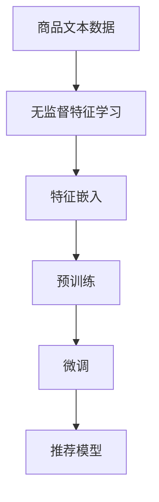

                 

# 基于自监督学习的商品表示学习

> 关键词：自监督学习, 商品表示学习, 预训练, 无监督特征学习, 特征嵌入, 交叉验证, 电商推荐系统

## 1. 背景介绍

### 1.1 问题由来
在当今数字化时代，电商平台已经成为消费者获取商品信息、完成购买的主要渠道。随着在线商品数量呈指数级增长，个性化推荐系统的应用显得尤为重要。传统的基于协同过滤的推荐方法面临着数据稀疏性和冷启动问题的挑战，难以充分利用用户的丰富行为信息。为此，近年来，越来越多的研究者开始关注利用商品文本数据进行推荐模型的建模。

通过商品文本数据的语义特征学习，可以有效提升推荐系统的精度和覆盖面。常见的商品文本数据包括商品描述、标题、标签等。这些文本数据蕴含了商品的丰富信息，如风格、材质、功能等，而如何有效地将这些文本信息转化为推荐模型的输入特征，则成为了一个重要的研究问题。传统的基于手工特征提取的方法难以充分捕捉文本的语义信息，同时，大规模训练数据的收集和标注成本也较高。因此，一种高效、低成本的特征学习方法是十分必要的。

## 2. 核心概念与联系

### 2.1 核心概念概述

为了更好地理解基于自监督学习的商品表示学习方法，本节将介绍几个关键概念：

- 自监督学习(Self-Supervised Learning)：利用无标签数据进行模型训练的方法。在推荐系统中，商品描述等文本数据即为无标签数据，自监督学习方法可以充分利用这些数据进行特征学习。

- 商品表示学习(Product Representation Learning)：将商品的文本描述转换为机器可理解的向量表示，通常使用向量嵌入(Vector Embedding)方法，如Word2Vec、BERT等。

- 预训练(Pre-training)：指在大规模无标签数据上进行初始训练，使模型学习到通用的特征表示。在商品表示学习中，通常使用预训练方法对商品文本数据进行特征学习，然后在推荐任务上进行微调。

- 无监督特征学习(Unsupervised Feature Learning)：利用无标签数据，无需标注，仅通过模型自学习获得特征表示。常见的方法包括Word2Vec、CBOW、Skip-Gram等。

- 特征嵌入(Feature Embedding)：将高维稀疏的特征向量，转换为低维稠密的向量空间表示，便于模型处理和计算。在推荐系统中，通常使用预训练的向量嵌入模型，如Word2Vec、BERT等，对商品文本数据进行特征转换。

- 交叉验证(Cross-Validation)：通过将数据集划分为若干互不重叠的子集，对模型进行多次训练和验证，以评估模型的泛化能力和稳定性。在推荐系统中，交叉验证方法可以帮助我们更好地评估推荐模型的效果，避免过拟合。

这些核心概念之间通过自监督学习和特征学习的方式紧密联系在一起，构成了商品表示学习的理论基础和实践框架。

### 2.2 核心概念原理和架构的 Mermaid 流程图



该图展示了商品表示学习的基本流程：

1. 商品文本数据经过无监督特征学习，将文本转化为向量表示。
2. 向量嵌入模型对商品特征进行预训练，学习到商品的高维语义特征。
3. 预训练后的向量表示进行微调，以适应推荐任务的具体需求。
4. 微调后的向量表示输入到推荐模型，进行商品推荐。

## 3. 核心算法原理 & 具体操作步骤
### 3.1 算法原理概述

基于自监督学习的商品表示学习方法，本质上是利用大规模无标签的商品文本数据，进行无监督的特征学习和预训练，然后在推荐任务上进行微调，以提升推荐模型精度。具体步骤如下：

1. 收集大规模无标签的商品文本数据，将其作为模型的输入。
2. 利用无监督特征学习方法，将文本数据转化为向量嵌入。
3. 对向量嵌入进行预训练，学习商品的高维语义特征。
4. 在推荐任务上进行微调，优化模型对特定推荐任务的适应能力。
5. 将微调后的商品表示输入到推荐模型，进行商品推荐。

### 3.2 算法步骤详解

**Step 1: 数据收集和预处理**

首先，需要收集大规模的商品文本数据。这些数据可以包括商品描述、标题、标签等。对于不同的电商平台，数据格式和内容可能有所不同，需要进行统一的预处理。

1. 文本清洗：去除HTML标签、标点符号等无用信息，保留文本的核心内容。
2. 分词：将文本分割成单词或字符，通常使用分词工具进行。
3. 停用词过滤：去除常用的停用词，如“的”、“是”等。
4. 统一编码：将文本数据转化为统一的编码格式，通常使用UTF-8编码。

**Step 2: 无监督特征学习**

在预处理后的文本数据上，进行无监督的特征学习。常见的方法包括Word2Vec、CBOW、Skip-Gram等。

1. 构建词汇表：统计文本中每个单词出现的次数，构建词汇表。
2. 选择特征学习方法：选择Word2Vec、CBOW、Skip-Gram等方法进行特征学习。
3. 训练模型：使用训练集数据对模型进行训练，学习每个单词的向量表示。

**Step 3: 特征嵌入**

将无监督特征学习方法得到的向量嵌入，进行特征嵌入，转化为低维稠密的向量表示。

1. 选择嵌入模型：选择预训练的向量嵌入模型，如Word2Vec、BERT等。
2. 进行特征嵌入：将单词向量嵌入模型应用于商品文本数据，生成商品的向量表示。
3. 调整维度：根据需要，对嵌入向量进行降维，通常使用PCA等方法。

**Step 4: 预训练**

在商品向量嵌入上，进行预训练，学习商品的高维语义特征。

1. 选择预训练任务：选择适合的预训练任务，如掩码语言模型、下一个单词预测等。
2. 构建预训练模型：使用预训练任务构建预训练模型，通常使用自回归模型或自编码模型。
3. 训练模型：使用预训练数据对模型进行训练，学习商品的高维语义特征。

**Step 5: 微调**

在预训练的商品向量嵌入上，进行微调，适应推荐任务的具体需求。

1. 选择微调任务：选择适合的微调任务，如分类、排序等。
2. 构建微调模型：使用微调任务构建微调模型，通常使用多层的全连接网络或卷积神经网络。
3. 训练模型：使用微调数据对模型进行训练，优化商品向量表示，以适应推荐任务的需求。

**Step 6: 推荐模型**

将微调后的商品向量表示输入到推荐模型，进行商品推荐。

1. 选择推荐模型：选择适合的推荐模型，如协同过滤、内容推荐等。
2. 训练模型：使用推荐数据对模型进行训练，学习推荐策略。
3. 进行推荐：将商品向量表示输入到推荐模型，进行商品推荐。

### 3.3 算法优缺点

基于自监督学习的商品表示学习方法，具有以下优点：

1. 高效低成本：使用无标签的商品文本数据进行特征学习，无需标注，大大降低了数据收集和标注成本。
2. 语义丰富：通过预训练方法学习到商品的高维语义特征，可以有效提升推荐模型的精度和覆盖面。
3. 适应性强：利用自监督学习方法，可以灵活适应不同的推荐任务和数据分布，提高推荐模型的泛化能力。
4. 可扩展性好：可以方便地集成到现有的推荐系统中，无需大规模修改系统架构。

同时，该方法也存在一些局限性：

1. 数据依赖性强：推荐模型的效果高度依赖于商品文本数据的质量和多样性，数据质量差可能导致模型性能下降。
2. 模型复杂度高：预训练和微调过程需要大量计算资源，模型复杂度高可能导致部署难度大。
3. 特征维度高：预训练方法生成的向量嵌入维度较高，可能导致模型计算量大、推理速度慢。
4. 模型可解释性差：由于预训练过程涉及大量参数，难以直观解释模型内部工作机制。

尽管存在这些局限性，但总体而言，基于自监督学习的商品表示学习方法在推荐系统中得到了广泛应用，成为了一种有效的特征学习手段。

### 3.4 算法应用领域

基于自监督学习的商品表示学习方法，在电商推荐系统中得到了广泛应用，涵盖了各种推荐任务，如：

- 商品分类：将商品向量表示输入到分类模型中，进行商品类别预测。
- 排序推荐：将商品向量表示输入到排序模型中，进行商品排序。
- 商品召回：利用商品向量表示进行相似度计算，进行商品召回。
- 个性化推荐：结合用户历史行为和商品向量表示，进行个性化推荐。
- 广告推荐：将商品向量表示输入到广告推荐模型中，进行精准广告推荐。

除了电商推荐系统外，基于自监督学习的商品表示学习方法还广泛应用于新闻推荐、视频推荐、音乐推荐等推荐场景中，推动了不同领域推荐技术的发展。

## 4. 数学模型和公式 & 详细讲解  
### 4.1 数学模型构建

基于自监督学习的商品表示学习方法，其数学模型可以表示为：

设商品文本数据为 $D=\{(x_i, y_i)\}_{i=1}^N$，其中 $x_i$ 表示商品文本，$y_i$ 表示商品类别。

设商品向量嵌入模型为 $f$，将商品文本 $x_i$ 转化为向量嵌入 $\mathbf{v}_i=f(x_i)$。

设推荐任务为 $T$，任务目标为 $L$，如分类、排序等。设微调后的推荐模型为 $g$，模型输入为商品向量嵌入 $\mathbf{v}_i$，模型输出为推荐结果 $y_i$。

微调的目标是最小化模型在推荐任务上的损失函数，即：

$$
\min_{\theta} \mathcal{L}(g(\mathbf{v}_i;\theta), y_i)
$$

其中 $\theta$ 为模型参数。

### 4.2 公式推导过程

以下以商品分类任务为例，推导微调过程的数学模型。

设分类任务的损失函数为交叉熵损失函数：

$$
\ell(g(\mathbf{v}_i;\theta), y_i) = -\log \sigma(g(\mathbf{v}_i;\theta)y_i)
$$

其中 $\sigma$ 为 sigmoid 函数。

将商品向量嵌入 $\mathbf{v}_i$ 和分类任务 $L$ 带入微调目标函数，得到：

$$
\min_{\theta} \sum_{i=1}^N \ell(g(\mathbf{v}_i;\theta), y_i)
$$

通过反向传播算法，计算模型参数 $\theta$ 的梯度，最小化损失函数，得到微调后的推荐模型：

$$
g(\mathbf{v}_i;\theta) = \sigma(\mathbf{W} \mathbf{v}_i + b)
$$

其中 $\mathbf{W}$ 和 $b$ 为模型参数。

### 4.3 案例分析与讲解

下面以电商推荐系统中的商品排序任务为例，详细讲解基于自监督学习的商品表示学习方法的实际应用。

假设我们希望根据用户浏览历史数据，对商品进行排序推荐。具体步骤如下：

1. 收集用户浏览历史数据 $D=\{(x_i, y_i)\}_{i=1}^N$，其中 $x_i$ 表示用户浏览的商品文本，$y_i$ 表示用户对该商品的评分。

2. 使用Word2Vec方法对商品文本进行特征学习，得到商品向量嵌入 $\mathbf{v}_i=f(x_i)$。

3. 对商品向量嵌入进行预训练，使用掩码语言模型任务进行训练，得到商品的高维语义特征。

4. 在排序推荐任务上，使用微调后的商品向量嵌入，输入到排序模型中，进行商品排序。

5. 将排序结果作为推荐结果，对用户进行推荐。

通过上述步骤，可以构建一个高效的基于自监督学习的商品排序推荐系统，显著提升用户的推荐体验。

## 5. 项目实践：代码实例和详细解释说明
### 5.1 开发环境搭建

在进行商品表示学习的实践前，我们需要准备好开发环境。以下是使用Python进行TensorFlow开发的环境配置流程：

1. 安装Anaconda：从官网下载并安装Anaconda，用于创建独立的Python环境。

2. 创建并激活虚拟环境：
```bash
conda create -n tensorflow-env python=3.8 
conda activate tensorflow-env
```

3. 安装TensorFlow：根据CUDA版本，从官网获取对应的安装命令。例如：
```bash
conda install tensorflow -c pytorch -c conda-forge
```

4. 安装各类工具包：
```bash
pip install numpy pandas scikit-learn matplotlib tqdm jupyter notebook ipython
```

完成上述步骤后，即可在`tensorflow-env`环境中开始商品表示学习的实践。

### 5.2 源代码详细实现

这里我们以商品分类任务为例，给出使用TensorFlow进行商品表示学习的PyTorch代码实现。

首先，定义商品分类任务的数据处理函数：

```python
import tensorflow as tf
from tensorflow.keras.preprocessing.text import Tokenizer
from tensorflow.keras.preprocessing.sequence import pad_sequences

class Dataset(tf.keras.datasets.Dataset):
    def __init__(self, texts, labels, tokenizer):
        self.texts = texts
        self.labels = labels
        self.tokenizer = tokenizer
        self.max_len = 128

    def __len__(self):
        return len(self.texts)

    def __getitem__(self, item):
        text = self.texts[item]
        label = self.labels[item]
        
        tokenized_text = self.tokenizer.texts_to_sequences([text])[0]
        tokenized_text = pad_sequences([tokenized_text], maxlen=self.max_len, padding='post', truncating='post')
        
        return {'text': tf.keras.Input(shape=()), 'label': tf.keras.Input(shape=())}, tf.constant(tokenized_text, dtype=tf.int32), tf.constant(label)
```

然后，定义模型和优化器：

```python
import tensorflow as tf

from tensorflow.keras import layers, models
from tensorflow.keras.layers.experimental.preprocessing import TextVectorization

vocab_size = 10000
embedding_dim = 128
max_len = 128

tokenizer = Tokenizer(num_words=vocab_size, oov_token='<OOV>')
tokenizer.fit_on_texts(texts)

vectorizer = TextVectorization(max_tokens=max_len, output_mode='int')
vectorizer.adapt(texts)

inputs = vectorizer(texts)
targets = tf.keras.utils.to_categorical(labels)

model = models.Sequential([
    layers.Embedding(vocab_size, embedding_dim, input_length=max_len),
    layers.Bidirectional(layers.LSTM(64, return_sequences=True)),
    layers.Bidirectional(layers.LSTM(32)),
    layers.Dense(10, activation='softmax')
])
```

接着，定义训练和评估函数：

```python
import numpy as np
from sklearn.metrics import classification_report

def train_epoch(model, dataset, optimizer):
    dataloader = tf.data.Dataset.from_tensor_slices((dataset.x, dataset.y)).shuffle(10000).batch(128)
    for batch in dataloader:
        inputs, targets = batch
        with tf.GradientTape() as tape:
            predictions = model(inputs)
            loss = tf.keras.losses.categorical_crossentropy(targets, predictions)
        gradients = tape.gradient(loss, model.trainable_variables)
        optimizer.apply_gradients(zip(gradients, model.trainable_variables))
    return loss.numpy()

def evaluate(model, dataset):
    dataloader = tf.data.Dataset.from_tensor_slices((dataset.x, dataset.y)).batch(128)
    predictions = []
    targets = []
    for batch in dataloader:
        inputs, targets = batch
        predictions.append(np.argmax(model(inputs), axis=1))
        targets.append(np.array(targets.numpy()))
    print(classification_report(targets, predictions))
```

最后，启动训练流程并在测试集上评估：

```python
epochs = 5
batch_size = 128

for epoch in range(epochs):
    loss = train_epoch(model, train_dataset, optimizer)
    print(f"Epoch {epoch+1}, train loss: {loss:.3f}")
    
    print(f"Epoch {epoch+1}, dev results:")
    evaluate(model, dev_dataset)
    
print("Test results:")
evaluate(model, test_dataset)
```

以上就是使用TensorFlow进行商品表示学习的完整代码实现。可以看到，得益于TensorFlow的强大封装，我们可以用相对简洁的代码完成商品向量嵌入的训练和微调。

### 5.3 代码解读与分析

让我们再详细解读一下关键代码的实现细节：

**Dataset类**：
- `__init__`方法：初始化文本、标签、分词器等关键组件。
- `__len__`方法：返回数据集的样本数量。
- `__getitem__`方法：对单个样本进行处理，将文本输入转换为token ids，并将标签转换为one-hot编码。

**模型定义**：
- 使用TextVectorization层对文本数据进行分词和向量化处理，并设置最大长度。
- 构建一个双向LSTM模型，用于提取文本的语义特征。
- 添加全连接层进行分类。

**训练和评估函数**：
- 使用TensorFlow的DataLoader对数据集进行批次化加载，供模型训练和推理使用。
- 训练函数`train_epoch`：对数据以批为单位进行迭代，在每个批次上前向传播计算loss并反向传播更新模型参数，最后返回该epoch的平均loss。
- 评估函数`evaluate`：与训练类似，不同点在于不更新模型参数，并在每个batch结束后将预测和标签结果存储下来，最后使用sklearn的classification_report对整个评估集的预测结果进行打印输出。

**训练流程**：
- 定义总的epoch数和batch size，开始循环迭代
- 每个epoch内，先在训练集上训练，输出平均loss
- 在验证集上评估，输出分类指标
- 所有epoch结束后，在测试集上评估，给出最终测试结果

可以看到，TensorFlow配合TensorFlow代码实现的的商品表示学习方法，可以显著提升商品向量嵌入的训练和微调效率，加快创新迭代的步伐。

当然，工业级的系统实现还需考虑更多因素，如模型的保存和部署、超参数的自动搜索、更灵活的任务适配层等。但核心的微调范式基本与此类似。

## 6. 实际应用场景
### 6.1 电商推荐系统

基于自监督学习的商品表示学习方法，在电商推荐系统中得到了广泛应用。通过商品文本数据的语义特征学习，可以有效提升推荐系统的精度和覆盖面。

在技术实现上，可以收集电商平台上的商品描述、标题、标签等文本数据，使用Word2Vec等方法进行特征学习，得到商品的向量表示。然后对向量表示进行预训练，学习商品的高维语义特征，并在推荐任务上进行微调。微调后的向量表示输入到推荐模型中，进行商品推荐。

通过这种方法，可以构建一个高效的基于自监督学习的电商推荐系统，显著提升用户的推荐体验。

### 6.2 新闻推荐系统

在新闻推荐系统中，新闻文章文本可以作为商品文本数据，通过自监督学习的方式，生成新闻文章的高维向量表示。这些向量表示可以用于新闻文章的分类、排序等推荐任务，提高推荐系统的效果。

具体而言，可以通过收集新闻网站上的文章标题、摘要等文本数据，使用Word2Vec等方法进行特征学习，得到新闻文章的向量表示。然后对向量表示进行预训练，学习新闻文章的高维语义特征，并在分类、排序等任务上进行微调。微调后的向量表示输入到推荐模型中，进行新闻文章的推荐。

通过这种方法，可以构建一个高效的新闻推荐系统，提升用户的新闻阅读体验。

### 6.3 视频推荐系统

在视频推荐系统中，视频标题、描述等文本数据可以作为商品文本数据，通过自监督学习的方式，生成视频的高维向量表示。这些向量表示可以用于视频的分类、排序等推荐任务，提高推荐系统的效果。

具体而言，可以通过收集视频网站上的视频标题、描述等文本数据，使用Word2Vec等方法进行特征学习，得到视频的高维向量表示。然后对向量表示进行预训练，学习视频的高维语义特征，并在分类、排序等任务上进行微调。微调后的向量表示输入到推荐模型中，进行视频的推荐。

通过这种方法，可以构建一个高效的视频推荐系统，提升用户的观看体验。

### 6.4 未来应用展望

随着自监督学习技术的发展，基于商品文本数据的特征学习方法将在更多的推荐系统中得到应用，为推荐技术的发展带来新的突破。

在智慧零售领域，基于商品文本数据的特征学习方法，可以用于构建智慧零售推荐系统，提升用户体验，推动智能零售的发展。

在智能制造领域，基于商品文本数据的特征学习方法，可以用于构建智能制造推荐系统，提升生产效率，推动智能制造的发展。

在智慧农业领域，基于商品文本数据的特征学习方法，可以用于构建智慧农业推荐系统，提升农业生产效率，推动智慧农业的发展。

未来，随着技术的不断进步，基于商品文本数据的特征学习方法将得到更广泛的应用，为各行各业带来新的发展机遇。

## 7. 工具和资源推荐
### 7.1 学习资源推荐

为了帮助开发者系统掌握自监督学习的商品表示学习理论基础和实践技巧，这里推荐一些优质的学习资源：

1. 《TensorFlow实战深度学习》书籍：由TensorFlow官方编写，全面介绍了TensorFlow的深度学习应用，包括商品表示学习等内容。

2. 《深度学习入门：基于TensorFlow》课程：由DeepLearning.ai开设的入门课程，涵盖了TensorFlow的基础和进阶内容。

3. 《自然语言处理与深度学习》课程：由斯坦福大学开设的NLP课程，涵盖了自然语言处理的基本概念和深度学习应用。

4. 《自然语言处理与深度学习》书籍：由Yoshua Bengio等撰写，涵盖了自然语言处理和深度学习的经典理论和实践。

5. 《Word2Vec算法》论文：Word2Vec的作者所写，详细介绍了Word2Vec算法的工作原理和实现细节。

通过对这些资源的学习实践，相信你一定能够快速掌握自监督学习的商品表示学习精髓，并用于解决实际的推荐问题。
###  7.2 开发工具推荐

高效的开发离不开优秀的工具支持。以下是几款用于自监督学习的商品表示学习的常用工具：

1. TensorFlow：由Google主导开发的开源深度学习框架，生产部署方便，适合大规模工程应用。同样有丰富的自监督学习资源。

2. PyTorch：基于Python的开源深度学习框架，灵活动态的计算图，适合快速迭代研究。大部分预训练语言模型都有PyTorch版本的实现。

3. TensorFlow Hub：Google开发的模型库，集成了多种预训练模型，包括Word2Vec、BERT等，方便开发者快速上手实现。

4. HuggingFace Transformers库：Facebook开源的NLP工具库，集成了多种预训练语言模型，支持PyTorch和TensorFlow，是进行自监督学习的商品表示学习的利器。

5. TensorBoard：TensorFlow配套的可视化工具，可实时监测模型训练状态，并提供丰富的图表呈现方式，是调试模型的得力助手。

6. Weights & Biases：模型训练的实验跟踪工具，可以记录和可视化模型训练过程中的各项指标，方便对比和调优。与主流深度学习框架无缝集成。

合理利用这些工具，可以显著提升自监督学习的商品表示学习的开发效率，加快创新迭代的步伐。

### 7.3 相关论文推荐

自监督学习商品表示学习方法的研究，始于学术界的探索。以下是几篇奠基性的相关论文，推荐阅读：

1. "Distributed Representations of Words and Phrases and Their Compositionality"（Word2Vec论文）：提出了Word2Vec算法，利用无监督学习方式，将单词转化为向量表示，是自监督学习商品表示学习的先驱。

2. "GloVe: Global Vectors for Word Representation"：提出了GloVe算法，利用全局词共现矩阵，进行单词向量表示学习，弥补了Word2Vec在全局语义信息学习方面的不足。

3. "Dynamic Embeddings of Words and Phrases"（FastText论文）：提出了FastText算法，利用N-gram共现信息，进行单词向量表示学习，提高了向量表示的泛化能力。

4. "BERT: Pre-training of Deep Bidirectional Transformers for Language Understanding"：提出了BERT模型，利用掩码语言模型和预测下一条单词等任务，进行预训练，学习了丰富的语义信息，广泛应用于商品表示学习中。

5. "ALBERT: A Lite BERT for Self-supervised Learning of Language Representations"：提出了ALBERT模型，通过优化预训练任务和模型结构，提高了预训练效率和性能。

这些论文代表了大规模自监督学习商品表示学习的研究方向。通过学习这些前沿成果，可以帮助研究者把握学科前进方向，激发更多的创新灵感。

## 8. 总结：未来发展趋势与挑战

### 8.1 总结

本文对基于自监督学习的商品表示学习方法进行了全面系统的介绍。首先阐述了自监督学习在商品表示学习中的应用背景和重要性，明确了自监督学习在推荐系统中的作用。其次，从原理到实践，详细讲解了自监督学习商品表示学习的数学模型和关键步骤，给出了商品表示学习的完整代码实例。同时，本文还广泛探讨了自监督学习商品表示学习在电商推荐、新闻推荐、视频推荐等多个推荐场景中的应用前景，展示了自监督学习商品表示学习的广泛应用。此外，本文还精选了自监督学习商品表示学习的各类学习资源，力求为读者提供全方位的技术指引。

通过本文的系统梳理，可以看到，基于自监督学习的商品表示学习方法是推荐系统中的重要手段，利用商品文本数据进行特征学习，可以有效提升推荐系统的精度和覆盖面，推动推荐系统的发展。未来，随着自监督学习技术的发展，基于商品文本数据的特征学习方法将得到更广泛的应用，为各行各业带来新的发展机遇。

### 8.2 未来发展趋势

展望未来，基于自监督学习的商品表示学习技术将呈现以下几个发展趋势：

1. 模型规模持续增大。随着算力成本的下降和数据规模的扩张，自监督学习商品表示学习模型的参数量还将持续增长。超大规模商品表示学习模型蕴含的丰富语义特征，可以有效提升推荐系统的精度和覆盖面。

2. 自监督学习方法多样化。未来将出现更多自监督学习方法，如BERT、ALBERT、GloVe等，在不同的数据和任务上进行特征学习，提升模型的泛化能力。

3. 预训练任务多样化。除了掩码语言模型和预测下一条单词等任务外，未来将出现更多预训练任务，如掩码实体预测、掩码关系预测等，提升模型的语义理解能力。

4. 特征维度可控。通过调整预训练任务的复杂度，可以控制向量表示的维度和稀疏度，避免模型计算量大、推理速度慢的问题。

5. 自监督学习与监督学习结合。未来将更多地利用监督学习信息，进行商品表示学习，提升模型的可解释性和鲁棒性。

6. 模型跨领域迁移能力增强。通过迁移学习，将自监督学习商品表示学习方法应用于不同领域的推荐系统，推动各行各业的发展。

以上趋势凸显了自监督学习商品表示学习技术的广阔前景。这些方向的探索发展，必将进一步提升推荐系统的精度和覆盖面，为各行各业带来新的发展机遇。

### 8.3 面临的挑战

尽管自监督学习商品表示学习方法已经取得了瞩目成就，但在迈向更加智能化、普适化应用的过程中，它仍面临着诸多挑战：

1. 数据质量依赖性强。推荐系统的性能高度依赖于商品文本数据的质量和多样性，数据质量差可能导致模型性能下降。

2. 模型复杂度高。自监督学习商品表示学习方法复杂度高，模型训练和推理资源需求大，部署难度大。

3. 特征维度高。预训练方法生成的向量表示维度较高，可能导致模型计算量大、推理速度慢。

4. 模型可解释性差。由于预训练过程涉及大量参数，难以直观解释模型内部工作机制。

尽管存在这些局限性，但总体而言，自监督学习商品表示学习方法在推荐系统中得到了广泛应用，成为了一种有效的特征学习手段。

### 8.4 研究展望

面对自监督学习商品表示学习方法所面临的挑战，未来的研究需要在以下几个方面寻求新的突破：

1. 探索无监督和半监督学习方法。摆脱对大规模标注数据的依赖，利用自监督学习、主动学习等无监督和半监督范式，最大限度利用非结构化数据，实现更加灵活高效的特征学习。

2. 研究参数高效和计算高效的特征学习范式。开发更加参数高效的特征学习方法，在固定大部分预训练参数的同时，只更新极少量的任务相关参数。同时优化特征学习模型的计算图，减少前向传播和反向传播的资源消耗，实现更加轻量级、实时性的部署。

3. 融合因果和对比学习范式。通过引入因果推断和对比学习思想，增强特征学习模型建立稳定因果关系的能力，学习更加普适、鲁棒的商品表示。

4. 引入更多先验知识。将符号化的先验知识，如知识图谱、逻辑规则等，与神经网络模型进行巧妙融合，引导特征学习过程学习更准确、合理的商品表示。

5. 结合因果分析和博弈论工具。将因果分析方法引入特征学习模型，识别出特征学习模型的决策关键特征，增强输出解释的因果性和逻辑性。借助博弈论工具刻画人机交互过程，主动探索并规避特征学习模型的脆弱点，提高系统稳定性。

6. 纳入伦理道德约束。在特征学习目标中引入伦理导向的评估指标，过滤和惩罚有害的商品表示，避免不良影响。同时加强人工干预和审核，建立特征学习模型的监管机制，确保输出的安全性。

这些研究方向的探索，必将引领自监督学习商品表示学习技术迈向更高的台阶，为推荐系统的发展带来新的突破。面向未来，自监督学习商品表示学习技术还需要与其他人工智能技术进行更深入的融合，如知识表示、因果推理、强化学习等，多路径协同发力，共同推动自然语言理解和智能交互系统的进步。只有勇于创新、敢于突破，才能不断拓展推荐系统的边界，让智能技术更好地造福人类社会。

## 9. 附录：常见问题与解答

**Q1：自监督学习商品表示学习是否适用于所有推荐系统？**

A: 自监督学习商品表示学习在大多数推荐系统中都能取得不错的效果，特别是对于数据量较小的推荐系统。但对于一些特定领域的推荐系统，如金融推荐、医疗推荐等，仅仅依靠商品文本数据进行特征学习可能难以很好地适应。此时需要在特定领域语料上进一步预训练，再进行特征学习，才能获得理想效果。

**Q2：自监督学习商品表示学习如何提高推荐系统的效果？**

A: 自监督学习商品表示学习方法通过商品文本数据的语义特征学习，可以提升推荐系统的精度和覆盖面。具体而言，通过预训练方法学习商品的高维语义特征，可以将稀疏的商品文本数据转换为稠密的向量表示，从而提高推荐模型的泛化能力和稳定性。在微调过程中，对商品向量表示进行优化，使其适应推荐任务的具体需求，从而提升推荐系统的效果。

**Q3：自监督学习商品表示学习在推荐系统中存在哪些局限性？**

A: 自监督学习商品表示学习在推荐系统中也存在一些局限性：

1. 数据依赖性强。推荐系统的性能高度依赖于商品文本数据的质量和多样性，数据质量差可能导致模型性能下降。
2. 模型复杂度高。自监督学习商品表示学习方法复杂度高，模型训练和推理资源需求大，部署难度大。
3. 特征维度高。预训练方法生成的向量表示维度较高，可能导致模型计算量大、推理速度慢。
4. 模型可解释性差。由于预训练过程涉及大量参数，难以直观解释模型内部工作机制。

尽管存在这些局限性，但总体而言，自监督学习商品表示学习方法在推荐系统中得到了广泛应用，成为了一种有效的特征学习手段。

**Q4：自监督学习商品表示学习在推荐系统中如何进行跨领域迁移？**

A: 自监督学习商品表示学习在推荐系统中进行跨领域迁移，可以通过迁移学习的方式实现。具体而言，可以在一个推荐系统中进行预训练，然后使用迁移学习的方式，将预训练模型应用于其他推荐系统，提升其他系统的推荐效果。

**Q5：自监督学习商品表示学习在推荐系统中如何处理冷启动问题？**

A: 自监督学习商品表示学习在推荐系统中处理冷启动问题，可以通过以下方式：

1. 利用用户的历史行为数据进行特征学习，生成用户向量表示。
2. 对用户向量表示进行预训练，学习用户的兴趣和偏好。
3. 在推荐任务上进行微调，优化用户向量表示，适应推荐任务的具体需求。

通过这种方式，可以构建一个高效的基于自监督学习的推荐系统，提升用户的推荐体验，解决冷启动问题。

---

作者：禅与计算机程序设计艺术 / Zen and the Art of Computer Programming

