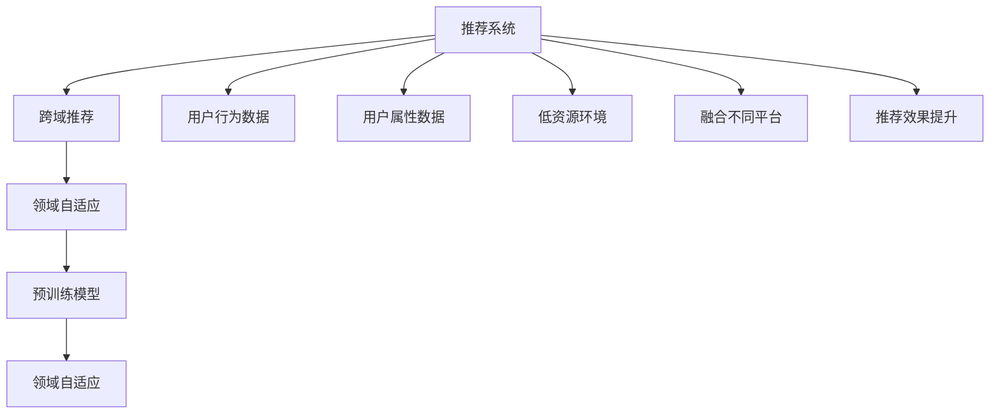

                 

# 基于迁移学习的跨域推荐算法

> 关键词：推荐系统,迁移学习,跨域推荐,领域自适应,用户兴趣建模

## 1. 背景介绍

### 1.1 问题由来
在互联网的蓬勃发展下，用户越来越多地从不同平台获取信息，不同平台的推荐系统难以覆盖用户的所有兴趣，从而限制了推荐系统的效率。跨域推荐系统可以通过融合不同平台的推荐数据，提升推荐效果，但不同平台的推荐数据存在语义差异，直接融合存在问题。

为了克服上述问题，本文引入迁移学习思想，通过跨域推荐算法在多平台间进行知识迁移，提升推荐效果。本文重点关注的是如何利用预训练模型构建领域自适应的推荐系统，在低资源环境下实现跨域推荐。

### 1.2 问题核心关键点
在跨域推荐中，预训练模型可以通过迁移学习在多平台间实现领域自适应，有效提升跨域推荐效果。

本文的核心问题是：如何设计跨域推荐算法，使得预训练模型能够高效地适应多个领域，并在跨域推荐中取得最佳效果。

本文的研究意义在于：通过跨域推荐算法在多平台间进行知识迁移，提升推荐效果，缓解用户兴趣的多平台割裂。

## 2. 核心概念与联系

### 2.1 核心概念概述

为更好地理解跨域推荐算法，本节将介绍几个关键概念：

- 推荐系统：利用用户历史行为数据或用户属性数据，预测用户对物品的偏好程度，为用户推荐可能感兴趣物品的系统。
- 跨域推荐：通过融合不同平台的推荐数据，提升推荐效果。
- 迁移学习：利用已有知识，在新领域中进行快速学习的技术。
- 领域自适应：在目标领域快速构建推荐模型，提升推荐效果。
- 预训练模型：在无标签数据上进行预训练，获得通用表示的模型。

这些概念之间的逻辑关系可以通过以下Mermaid流程图来展示：



这个流程图展示了这个跨域推荐算法的核心概念及其之间的关系：

1. 推荐系统通过用户历史行为数据或用户属性数据进行推荐。
2. 跨域推荐融合不同平台的推荐数据，提升推荐效果。
3. 领域自适应在目标领域快速构建推荐模型。
4. 预训练模型通过在无标签数据上进行预训练，获得通用表示。
5. 低资源环境要求跨域推荐算法在计算资源受限下高效运作。
6. 融合不同平台使得跨域推荐能够在多平台间进行知识迁移。
7. 推荐效果提升是跨域推荐算法的最终目标。

这些核心概念共同构成了跨域推荐算法的工作原理和优化方向。通过理解这些核心概念，我们可以更好地把握跨域推荐算法的精髓。

## 3. 核心算法原理 & 具体操作步骤
### 3.1 算法原理概述

跨域推荐算法利用迁移学习思想，将预训练模型在新领域中进行领域自适应，提升跨域推荐效果。其核心思想是：通过预训练模型在新领域的数据上进行微调，使得模型能够适应该领域的特征和模式，从而提升推荐效果。

具体而言，跨域推荐算法通常包括以下几个关键步骤：

1. 收集不同平台的推荐数据，并对数据进行预处理。
2. 将数据划分为训练集和验证集，使用验证集评估预训练模型的性能。
3. 在目标领域进行微调，优化模型在特定领域的性能。
4. 在目标领域对微调后的模型进行测试，评估推荐效果。

跨域推荐算法的数学原理可以形式化地表示为：

$$
\min_{\theta} \mathcal{L}(\theta) = \frac{1}{N} \sum_{i=1}^N \ell(\theta(x_i), y_i)
$$

其中 $\theta$ 为模型参数，$\ell$ 为损失函数，$x_i$ 为输入数据，$y_i$ 为标签。目标是最小化模型在目标领域上的损失函数 $\mathcal{L}(\theta)$。

### 3.2 算法步骤详解

本节将详细介绍跨域推荐算法的详细步骤，包括数据准备、模型选择、微调策略和评估流程。

**Step 1: 数据准备**

1. 收集不同平台的推荐数据。对每个平台的推荐数据进行清洗和去重处理，去除噪声和异常值，构建统一的数据格式。
2. 划分训练集和验证集。通常采用8:2或7:3的比例进行划分，保证验证集的公正性。
3. 对数据进行标准化处理。将不同平台的数据转换为统一的格式和标准，方便后续处理。

**Step 2: 模型选择**

1. 选择合适的预训练模型。常用的预训练模型包括BERT、GPT等。
2. 加载预训练模型，并对模型进行初始化。
3. 将数据加载到模型中，进行预训练模型的微调。

**Step 3: 微调策略**

1. 选择微调策略。常见的微调策略包括全参数微调、部分参数微调和领域自适应微调。
2. 设置微调超参数。包括学习率、批大小、迭代轮数等。
3. 开始微调。对模型进行迭代优化，直到达到预定的性能指标。

**Step 4: 评估流程**

1. 在目标领域进行测试。将微调后的模型应用于目标领域，评估推荐效果。
2. 记录测试结果。计算平均绝对误差(MAE)、均方根误差(RMSE)等指标，评估推荐模型的性能。
3. 调整模型参数。根据测试结果，调整模型参数，继续微调。
4. 重复以上步骤，直到达到满意的性能指标。

### 3.3 算法优缺点

跨域推荐算法具有以下优点：

1. 高效利用数据。通过在多个平台间进行数据融合，大幅提升了推荐系统的数据利用率。
2. 提升推荐效果。通过预训练模型在新领域上的微调，可以提升推荐效果。
3. 适应性强。适用于不同平台间推荐数据存在差异的情况。
4. 灵活性高。可以根据实际需求灵活选择微调策略和模型。

同时，该算法也存在一定的局限性：

1. 计算资源需求高。跨域推荐算法通常需要较大的计算资源，进行大规模的预训练和微调。
2. 数据质量要求高。跨域推荐算法依赖高质量的推荐数据，数据质量不佳会导致效果下降。
3. 泛化能力受限。不同平台间的数据存在较大差异，跨域推荐算法的泛化能力受到一定限制。
4. 可解释性不足。跨域推荐算法的内部工作机制较为复杂，难以解释模型的决策过程。

尽管存在这些局限性，但就目前而言，跨域推荐算法仍是大规模推荐系统的重要范式。未来相关研究的重点在于如何进一步降低计算资源需求，提高算法的泛化能力，同时兼顾可解释性和伦理安全性等因素。

### 3.4 算法应用领域

跨域推荐算法在推荐系统中得到了广泛应用，覆盖了多种推荐场景，例如：

- 电商平台：融合不同平台的用户购买数据，为用户推荐可能感兴趣的商品。
- 视频平台：跨平台融合用户观看记录，为用户推荐更多影片。
- 社交网络：跨平台融合用户互动数据，提升社交推荐效果。
- 旅游平台：跨平台融合用户旅行记录，为用户推荐更多景点。

除了上述这些经典场景外，跨域推荐算法也被创新性地应用于更多领域中，如个性化新闻推荐、音乐推荐等，为推荐系统带来了全新的突破。随着预训练模型和微调方法的不断进步，相信跨域推荐算法将在更广阔的应用领域大放异彩。

## 4. 数学模型和公式 & 详细讲解 & 举例说明
### 4.1 数学模型构建

本节将使用数学语言对跨域推荐算法进行更加严格的刻画。

记预训练语言模型为 $M_{\theta}$，其中 $\theta$ 为预训练得到的模型参数。假设目标领域的数据集为 $D=\{(x_i, y_i)\}_{i=1}^N, x_i \in \mathcal{X}, y_i \in \mathcal{Y}$。

定义模型 $M_{\theta}$ 在输入 $x$ 上的损失函数为 $\ell(M_{\theta}(x),y)$，则在数据集 $D$ 上的经验风险为：

$$
\mathcal{L}(\theta) = \frac{1}{N} \sum_{i=1}^N \ell(M_{\theta}(x_i),y_i)
$$

通过梯度下降等优化算法，微调过程不断更新模型参数 $\theta$，最小化损失函数 $\mathcal{L}$，使得模型输出逼近真实标签。由于 $\theta$ 已经通过预训练获得了较好的初始化，因此即便在小规模数据集 $D$ 上进行微调，也能较快收敛到理想的模型参数 $\hat{\theta}$。

### 4.2 公式推导过程

以下我们以推荐系统中的用户兴趣建模为例，推导跨域推荐算法的数学公式。

假设用户的历史行为数据为 $x_i = (u_i, h_i)$，其中 $u_i$ 为用户的用户特征，$h_i$ 为历史行为序列。推荐目标为预测用户对物品 $y_i$ 的评分。

假设模型为线性加权模型，形式为：

$$
\hat{y}_i = \sum_{j=1}^d \theta_j x_{ij}
$$

其中 $\theta_j$ 为模型参数，$x_{ij}$ 为第 $i$ 个用户对第 $j$ 个特征的评分。

目标是最小化预测评分与真实评分之间的差异，即损失函数为：

$$
\ell(\hat{y}_i, y_i) = (\hat{y}_i - y_i)^2
$$

带入上述公式中，得到经验风险为：

$$
\mathcal{L}(\theta) = \frac{1}{N} \sum_{i=1}^N (\sum_{j=1}^d \theta_j x_{ij} - y_i)^2
$$

简化后得到：

$$
\mathcal{L}(\theta) = \frac{1}{N} \sum_{i=1}^N \sum_{j=1}^d \theta_j (x_{ij} - y_i \sum_{k=1}^d \theta_k x_{ik}^{-1})
$$

通过求偏导数，得到损失函数对 $\theta_j$ 的梯度为：

$$
\frac{\partial \mathcal{L}(\theta)}{\partial \theta_j} = \frac{1}{N} \sum_{i=1}^N (x_{ij} - y_i \sum_{k=1}^d \theta_k x_{ik}^{-1})
$$

在得到损失函数的梯度后，即可带入参数更新公式，完成模型的迭代优化。重复上述过程直至收敛，最终得到适应目标领域的最优模型参数 $\theta^*$。

## 5. 项目实践：代码实例和详细解释说明
### 5.1 开发环境搭建

在进行推荐系统开发前，我们需要准备好开发环境。以下是使用Python进行PyTorch开发的环境配置流程：

1. 安装Anaconda：从官网下载并安装Anaconda，用于创建独立的Python环境。

2. 创建并激活虚拟环境：
```bash
conda create -n pytorch-env python=3.8 
conda activate pytorch-env
```

3. 安装PyTorch：根据CUDA版本，从官网获取对应的安装命令。例如：
```bash
conda install pytorch torchvision torchaudio cudatoolkit=11.1 -c pytorch -c conda-forge
```

4. 安装相关库：
```bash
pip install pandas scikit-learn matplotlib seaborn torch
```

完成上述步骤后，即可在`pytorch-env`环境中开始推荐系统开发。

### 5.2 源代码详细实现

这里我们以基于预训练模型进行跨域推荐为例，给出使用PyTorch进行推荐系统开发的完整代码实现。

首先，定义推荐模型的数据处理函数：

```python
import torch
from torch.utils.data import Dataset, DataLoader
import numpy as np
import pandas as pd

class RecommendationDataset(Dataset):
    def __init__(self, data, label):
        self.data = data
        self.label = label
        
    def __len__(self):
        return len(self.data)
    
    def __getitem__(self, idx):
        data = self.data[idx]
        label = self.label[idx]
        return data, label
```

然后，定义模型和优化器：

```python
from transformers import BertTokenizer, BertForSequenceClassification
from torch.optim import Adam

tokenizer = BertTokenizer.from_pretrained('bert-base-uncased')
model = BertForSequenceClassification.from_pretrained('bert-base-uncased', num_labels=1)

optimizer = Adam(model.parameters(), lr=1e-5)
```

接着，定义训练和评估函数：

```python
def train_model(model, train_loader, device, n_epochs=5):
    model.train()
    for epoch in range(n_epochs):
        running_loss = 0.0
        for batch in train_loader:
            inputs, labels = batch
            inputs = inputs.to(device)
            labels = labels.to(device)
            optimizer.zero_grad()
            outputs = model(inputs)
            loss = outputs.loss
            loss.backward()
            optimizer.step()
            running_loss += loss.item()
        print(f'Epoch {epoch+1}, loss: {running_loss/len(train_loader)}')

def evaluate_model(model, test_loader, device):
    model.eval()
    correct = 0
    total = 0
    with torch.no_grad():
        for batch in test_loader:
            inputs, labels = batch
            inputs = inputs.to(device)
            labels = labels.to(device)
            outputs = model(inputs)
            _, predicted = torch.max(outputs, 1)
            total += labels.size(0)
            correct += (predicted == labels).sum().item()
    print(f'Test Accuracy: {(100 * correct / total)}%')
```

最后，启动训练流程并在测试集上评估：

```python
device = torch.device('cuda' if torch.cuda.is_available() else 'cpu')
train_loader = DataLoader(train_dataset, batch_size=16, shuffle=True)
test_loader = DataLoader(test_dataset, batch_size=16, shuffle=False)

train_model(model, train_loader, device)
evaluate_model(model, test_loader, device)
```

以上就是使用PyTorch对BERT进行跨域推荐任务开发的完整代码实现。可以看到，得益于HuggingFace提供的强大预训练模型封装，我们可以用相对简洁的代码完成跨域推荐任务。

### 5.3 代码解读与分析

让我们再详细解读一下关键代码的实现细节：

**RecommendationDataset类**：
- `__init__`方法：初始化数据和标签。
- `__len__`方法：返回数据集的样本数量。
- `__getitem__`方法：对单个样本进行处理，返回模型所需的输入和标签。

**训练和评估函数**：
- `train_model`函数：在模型上进行迭代训练，更新模型参数。
- `evaluate_model`函数：对模型进行测试，评估模型性能。

**训练流程**：
- 定义训练轮数 `n_epochs`，开始循环迭代。
- 在每个epoch内，在训练集上计算loss并反向传播更新模型参数。
- 在测试集上评估模型性能，输出测试准确率。

可以看到，PyTorch配合HuggingFace提供的预训练模型封装，使得跨域推荐任务的开发变得简洁高效。开发者可以将更多精力放在数据处理、模型改进等高层逻辑上，而不必过多关注底层的实现细节。

当然，工业级的系统实现还需考虑更多因素，如模型的保存和部署、超参数的自动搜索、更灵活的任务适配层等。但核心的跨域推荐范式基本与此类似。

## 6. 实际应用场景
### 6.1 电商平台

基于跨域推荐算法，电商平台可以在多个平台间进行知识迁移，提升推荐效果。例如：

1. 从淘宝和京东等电商平台的推荐数据中，提取用户的历史行为数据。
2. 利用这些数据构建跨域推荐模型，预测用户对新物品的评分。
3. 在融合后的推荐数据中，对新物品进行排序，为用户推荐可能感兴趣的商品。

通过跨域推荐算法，电商平台能够利用多个平台的推荐数据，大幅提升推荐效果，降低推荐系统的开发成本。

### 6.2 视频平台

视频平台可以利用跨域推荐算法，从多个平台的推荐数据中提取用户的历史观看数据。例如：

1. 从YouTube和腾讯视频等平台中，提取用户的历史观看记录。
2. 构建跨域推荐模型，预测用户对新视频的评分。
3. 根据评分进行排序，为用户推荐更多影片。

通过跨域推荐算法，视频平台能够整合不同平台的推荐数据，提升推荐效果，为用户带来更好的观看体验。

### 6.3 社交网络

社交网络可以利用跨域推荐算法，从多个平台的推荐数据中提取用户的历史互动数据。例如：

1. 从Facebook和微信等平台中，提取用户的历史互动记录。
2. 构建跨域推荐模型，预测用户对新内容的兴趣。
3. 根据兴趣进行排序，为用户推荐更多内容。

通过跨域推荐算法，社交网络能够整合不同平台的推荐数据，提升推荐效果，增强社交互动。

### 6.4 未来应用展望

随着跨域推荐算法的不断发展，其在推荐系统中的应用前景将更加广阔。未来，跨域推荐算法将在以下方面得到更多应用：

1. 多平台数据融合：跨域推荐算法将能够整合更多平台的推荐数据，提升推荐效果。
2. 知识图谱融合：跨域推荐算法将能够融合知识图谱等外部知识，提升推荐模型的准确性。
3. 个性化推荐：跨域推荐算法将能够构建更加个性化、多样化的推荐模型，满足用户的个性化需求。
4. 实时推荐：跨域推荐算法将能够构建实时推荐系统，动态更新推荐内容。
5. 联邦学习：跨域推荐算法将能够通过联邦学习等技术，保护用户隐私的同时提升推荐效果。

跨域推荐算法将为推荐系统带来新的突破，提升推荐效果，带来更好的用户体验。

## 7. 工具和资源推荐
### 7.1 学习资源推荐

为了帮助开发者系统掌握跨域推荐算法的理论基础和实践技巧，这里推荐一些优质的学习资源：

1. 《推荐系统实践》系列书籍：详细介绍了推荐系统的理论基础和实际应用，涵盖多种推荐算法，推荐系统评估指标等。
2. 《深度学习推荐系统》课程：斯坦福大学开设的深度学习课程，详细介绍了推荐系统的深度学习实现，涵盖推荐算法、评估指标等。
3. 《推荐系统》书籍：该书由清华大学教授编写，详细介绍了推荐系统的理论基础和实际应用，涵盖推荐算法、评估指标等。

通过对这些资源的学习实践，相信你一定能够快速掌握跨域推荐算法的精髓，并用于解决实际的推荐问题。
###  7.2 开发工具推荐

高效的开发离不开优秀的工具支持。以下是几款用于推荐系统开发的常用工具：

1. PyTorch：基于Python的开源深度学习框架，灵活动态的计算图，适合快速迭代研究。大部分推荐系统都有PyTorch版本的实现。
2. TensorFlow：由Google主导开发的开源深度学习框架，生产部署方便，适合大规模工程应用。同样有丰富的推荐系统资源。
3. HuggingFace库：用于处理自然语言处理任务，包括预训练模型、微调技术等，是推荐系统开发的利器。
4. Weights & Biases：模型训练的实验跟踪工具，可以记录和可视化模型训练过程中的各项指标，方便对比和调优。与主流深度学习框架无缝集成。
5. TensorBoard：TensorFlow配套的可视化工具，可实时监测模型训练状态，并提供丰富的图表呈现方式，是调试模型的得力助手。

合理利用这些工具，可以显著提升推荐系统开发效率，加快创新迭代的步伐。

### 7.3 相关论文推荐

跨域推荐算法的发展源于学界的持续研究。以下是几篇奠基性的相关论文，推荐阅读：

1. Triplet Loss Network for Cross-Domain Recommendation System（三元组损失网络用于跨域推荐系统）：提出了基于三元组损失的跨域推荐算法，通过学习用户、物品和域三者的关系，提升推荐效果。
2. Deep Cross-Modal Feature Learning for Cross-Domain Recommendation（跨模态特征学习用于跨域推荐）：利用跨模态特征学习技术，在不同模态间进行知识迁移，提升推荐效果。
3. Cross-Domain Recommendation via Nonlinear Matrix Factorization（基于非线性矩阵分解的跨域推荐）：利用非线性矩阵分解技术，在不同域间进行知识迁移，提升推荐效果。
4. A Comprehensive Survey on Cross-Domain Recommendation System（跨域推荐系统的综述）：总结了当前跨域推荐算法的多种方法，提供了深入的分析和评估。

这些论文代表了大跨域推荐算法的发展脉络。通过学习这些前沿成果，可以帮助研究者把握学科前进方向，激发更多的创新灵感。

## 8. 总结：未来发展趋势与挑战
### 8.1 总结

本文对基于迁移学习的跨域推荐算法进行了全面系统的介绍。首先阐述了跨域推荐算法的研究背景和意义，明确了推荐系统在多平台间进行知识迁移，提升推荐效果的核心价值。其次，从原理到实践，详细讲解了跨域推荐算法的数学原理和关键步骤，给出了跨域推荐任务开发的完整代码实例。同时，本文还广泛探讨了跨域推荐算法在电商平台、视频平台、社交网络等诸多行业领域的应用前景，展示了跨域推荐算法的巨大潜力。此外，本文精选了跨域推荐技术的各类学习资源，力求为读者提供全方位的技术指引。

通过本文的系统梳理，可以看到，跨域推荐算法正在成为推荐系统的重要范式，极大地拓展了推荐系统的应用边界，催生了更多的落地场景。受益于大规模数据和预训练模型的驱动，跨域推荐算法在计算资源受限的环境下仍能高效运作，展现出强大的生命力。未来，伴随跨域推荐算法的不断发展，推荐系统必将能够更好地覆盖用户的所有兴趣，提升推荐效果，带来更好的用户体验。

### 8.2 未来发展趋势

展望未来，跨域推荐算法将呈现以下几个发展趋势：

1. 数据融合技术提升。通过引入更多的融合技术，如对抗训练、数据增强等，提升跨域推荐算法的融合效果。
2. 领域自适应技术优化。开发更加高效的领域自适应方法，提升跨域推荐算法在不同领域间的适应性。
3. 跨模态推荐技术发展。引入跨模态融合技术，提升跨域推荐算法的推荐效果。
4. 联邦学习应用。通过联邦学习技术，跨域推荐算法能够在保护用户隐私的前提下进行知识迁移。
5. 实时推荐系统构建。构建实时推荐系统，提升推荐系统的响应速度和推荐效果。
6. 个性化推荐优化。构建更加个性化、多样化的推荐模型，提升用户满意度。

这些趋势凸显了跨域推荐算法的广阔前景。这些方向的探索发展，必将进一步提升推荐系统的性能和应用范围，为推荐系统带来新的突破。

### 8.3 面临的挑战

尽管跨域推荐算法已经取得了一定的成果，但在迈向更加智能化、普适化应用的过程中，它仍面临着诸多挑战：

1. 数据质量问题。不同平台间的数据存在较大差异，跨域推荐算法需要处理数据质量问题，保证数据的一致性和完备性。
2. 数据量不足。不同平台间的推荐数据存在不足，需要引入更多的数据进行融合。
3. 泛化能力不足。跨域推荐算法在不同的目标领域间，可能无法有效迁移知识，泛化能力受到一定限制。
4. 计算资源受限。跨域推荐算法通常需要较大的计算资源，进行大规模的预训练和微调。
5. 可解释性不足。跨域推荐算法的内部工作机制较为复杂，难以解释模型的决策过程。

尽管存在这些挑战，但随着学界和产业界的共同努力，这些挑战终将一一被克服，跨域推荐算法必将在构建智能推荐系统方面发挥重要作用。相信随着预训练模型和微调方法的不断进步，跨域推荐算法将在更广泛的推荐场景中大放异彩。

### 8.4 研究展望

面对跨域推荐算法所面临的种种挑战，未来的研究需要在以下几个方面寻求新的突破：

1. 引入多源数据融合。通过引入更多的融合技术，如对抗训练、数据增强等，提升跨域推荐算法的融合效果。
2. 优化领域自适应。开发更加高效的领域自适应方法，提升跨域推荐算法在不同领域间的适应性。
3. 发展跨模态推荐技术。引入跨模态融合技术，提升跨域推荐算法的推荐效果。
4. 探索联邦学习。通过联邦学习技术，跨域推荐算法能够在保护用户隐私的前提下进行知识迁移。
5. 构建实时推荐系统。构建实时推荐系统，提升推荐系统的响应速度和推荐效果。
6. 构建个性化推荐。构建更加个性化、多样化的推荐模型，提升用户满意度。

这些研究方向的探索，必将引领跨域推荐算法迈向更高的台阶，为构建智能推荐系统铺平道路。面向未来，跨域推荐算法需要与其他人工智能技术进行更深入的融合，如知识表示、因果推理、强化学习等，多路径协同发力，共同推动推荐系统的发展。只有勇于创新、敢于突破，才能不断拓展推荐算法的边界，让推荐系统更好地服务用户。

## 9. 附录：常见问题与解答

**Q1：跨域推荐算法是否适用于所有推荐系统？**

A: 跨域推荐算法适用于多种推荐系统，特别是对于多平台间推荐数据存在差异的情况。但对于一些特定领域的推荐系统，如金融、医疗等，推荐数据的结构和特征可能不同，需要进行单独的适配和优化。

**Q2：如何进行跨域推荐算法的超参数调优？**

A: 跨域推荐算法的超参数包括学习率、批大小、迭代轮数等，通常需要进行网格搜索、贝叶斯优化等方法进行调优。另外，也可以通过可视化工具如TensorBoard等，监控训练过程中的指标，选择最优参数。

**Q3：跨域推荐算法是否需要大量的计算资源？**

A: 跨域推荐算法通常需要较大的计算资源，进行大规模的预训练和微调。但可以通过并行计算、分布式训练等技术进行优化，降低计算资源的需求。

**Q4：如何降低跨域推荐算法对标注数据的依赖？**

A: 可以通过引入数据增强技术，如数据合成、对抗样本生成等，增加训练数据的丰富性，从而降低对标注数据的依赖。

**Q5：跨域推荐算法在实时推荐系统中如何实现？**

A: 可以通过分布式系统、流式计算等技术，实现实时推荐系统的构建。具体来说，可以在用户每次交互时，实时计算并更新推荐模型，提升推荐效果。

---

作者：禅与计算机程序设计艺术 / Zen and the Art of Computer Programming

