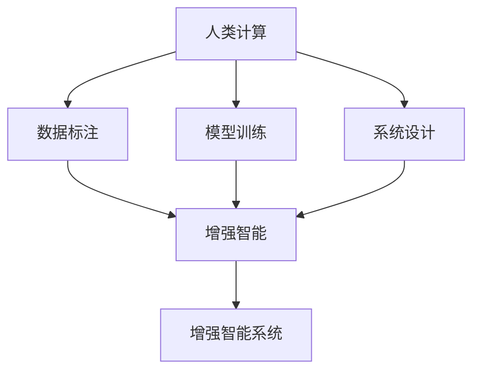

                 

# 增强智能：人类计算如何推动创新

## 1. 背景介绍

随着人类社会逐步迈入数字时代，计算智能正在深刻改变我们的生活和工作方式。从工业生产的自动化、信息检索的智能化，到社交互动的个性化，智能计算正逐步渗透到各个领域，推动着经济社会的全面进步。然而，当前智能计算依然依赖于大量人类计算的支持，如数据标注、模型训练等。这些繁重的任务不仅耗时耗力，还存在着数据偏差、模型泛化能力不足等问题。为了进一步推动智能计算的发展，人类计算与增强智能的结合，成为了时代发展的必然选择。

本文旨在探讨人类计算在增强智能中的作用，分析当前面临的挑战，展望未来发展的趋势，并提出应对策略，为构建更加智能化、高效化的系统提供借鉴。

## 2. 核心概念与联系

### 2.1 核心概念概述

要深入理解人类计算在增强智能中的作用，首先需要理解以下几个核心概念：

- **增强智能(Augmented Intelligence, AI)**：指通过智能算法和计算，辅助人类在决策、分析、创造等方面的能力，提升工作效率和效果。增强智能依赖于大量的数据、算法和计算资源。

- **人类计算(Human Computation)**：指利用人类智慧和创造力，完成复杂的计算和决策任务。人类计算涉及数据分析、模型训练、系统设计等多个环节。

- **增强智能系统(Augmented Intelligent System, AIS)**：将增强智能与人类计算相结合的系统，能够根据任务需求，动态调整计算资源和决策过程，实现智能与人类智慧的协同工作。

- **混合智能(Hybrid Intelligence)**：指将人类智慧和智能算法有机结合，形成具有高度自适应性和鲁棒性的智能系统。

- **增强现实(Augmented Reality, AR)**：将数字信息与现实世界相结合，辅助人类进行信息获取和任务执行。

### 2.2 核心概念原理和架构的 Mermaid 流程图



这个流程图展示了人类计算在增强智能系统中的作用：

1. **数据标注**：通过人类计算，完成数据清理、标注等基础任务，为增强智能提供数据支持。
2. **模型训练**：利用人类智慧，设计并训练智能算法模型，提升模型性能。
3. **系统设计**：根据任务需求，设计增强智能系统的架构，优化系统性能。
4. **增强智能**：结合智能算法和人类智慧，完成复杂的计算和决策任务。
5. **增强智能系统**：将智能算法和人类智慧有机结合，实现智能与人类智慧的协同工作。

## 3. 核心算法原理 & 具体操作步骤

### 3.1 算法原理概述

增强智能的实现，离不开高效的人类计算和智能算法的结合。核心算法原理包括：

- **数据标注**：利用人类智慧，对数据进行清洗、标注和预处理，为智能算法提供高质量的数据集。
- **模型训练**：利用智能算法，训练高效、准确的模型，提升模型泛化能力和预测精度。
- **系统优化**：结合人类智慧和智能算法，优化系统架构和运行机制，实现高效的协同工作。

### 3.2 算法步骤详解

增强智能的实现步骤如下：

1. **需求分析**：明确增强智能系统的目标和任务，设计系统的需求规范。
2. **数据准备**：收集和预处理数据，利用人类计算对数据进行标注和清洗，生成高质量的数据集。
3. **模型设计**：选择合适的智能算法，设计并训练模型，优化模型参数。
4. **系统集成**：将训练好的模型集成到增强智能系统中，进行系统测试和验证。
5. **性能优化**：结合人类智慧和智能算法，优化系统性能，提升用户体验。

### 3.3 算法优缺点

增强智能的算法优点包括：

- **灵活性高**：能够根据任务需求，动态调整计算资源和算法策略，实现高效的协同工作。
- **鲁棒性强**：结合人类智慧和智能算法，能够提高系统的稳定性和鲁棒性，避免单一算法的局限性。
- **适应性强**：能够处理复杂的多变量、多层次任务，提升任务完成的精度和效率。

算法缺点包括：

- **依赖人类计算**：人类计算的高效性对增强智能系统的性能有重要影响。
- **计算成本高**：大规模数据标注和模型训练需要大量的计算资源和时间。
- **数据偏差**：人类计算容易引入主观偏差，影响数据的公正性和准确性。

### 3.4 算法应用领域

增强智能算法广泛应用于各个领域，包括：

- **医疗诊断**：结合医学知识和智能算法，辅助医生进行疾病诊断和治疗方案制定。
- **金融分析**：利用智能算法和人类智慧，进行市场分析、风险评估和投资决策。
- **法律咨询**：结合法律知识和智能算法，辅助律师进行案件分析和法律文书生成。
- **智能客服**：利用智能算法和人类智慧，提升客户服务体验，解决复杂问题。
- **自动驾驶**：结合感知算法和人类驾驶经验，提升自动驾驶的安全性和稳定性。
- **教育培训**：结合教育知识和智能算法，提升教育质量和个性化教学效果。

## 4. 数学模型和公式 & 详细讲解 & 举例说明

### 4.1 数学模型构建

增强智能系统的数学模型包括：

- **数据模型**：描述数据集的结构和特征，利用机器学习算法对数据进行建模。
- **模型评估**：定义模型性能的评估指标，如准确率、召回率、F1分数等。
- **优化算法**：选择适当的优化算法，如梯度下降、遗传算法等，优化模型参数。

### 4.2 公式推导过程

以线性回归模型为例，推导其最小二乘法的公式推导过程。

假设数据集 $(x_i, y_i)$，$i=1,2,...,N$，其中 $x_i \in \mathbb{R}^d, y_i \in \mathbb{R}$。

最小二乘法的目标是最小化损失函数 $L(\theta) = \frac{1}{2N}\sum_{i=1}^N(y_i - \theta^T x_i)^2$。

对 $L(\theta)$ 求偏导数，得：

$$
\frac{\partial L(\theta)}{\partial \theta_k} = \frac{1}{N}\sum_{i=1}^N (y_i - \theta^T x_i) x_{ik}
$$

其中 $x_{ik}$ 表示 $x_i$ 的第 $k$ 维特征。

令 $\frac{\partial L(\theta)}{\partial \theta_k} = 0$，解得：

$$
\theta_k = \frac{1}{N}\sum_{i=1}^N y_i x_{ik}
$$

这就是线性回归模型的最小二乘解公式。

### 4.3 案例分析与讲解

假设某电商网站希望利用增强智能系统推荐商品。首先，数据工程师需要收集用户历史购买数据、浏览行为、商品信息等数据，并进行清洗和标注。然后，数据科学家利用智能算法（如决策树、神经网络等）设计并训练推荐模型，优化模型参数。最后，系统集成工程师将训练好的模型集成到推荐系统中，进行系统测试和优化，提升推荐效果。

## 5. 项目实践：代码实例和详细解释说明

### 5.1 开发环境搭建

在进行增强智能系统开发前，需要搭建开发环境。以下是使用Python进行PyTorch开发的环境配置流程：

1. 安装Anaconda：从官网下载并安装Anaconda，用于创建独立的Python环境。

2. 创建并激活虚拟环境：
```bash
conda create -n pytorch-env python=3.8 
conda activate pytorch-env
```

3. 安装PyTorch：根据CUDA版本，从官网获取对应的安装命令。例如：
```bash
conda install pytorch torchvision torchaudio cudatoolkit=11.1 -c pytorch -c conda-forge
```

4. 安装相关工具包：
```bash
pip install numpy pandas scikit-learn matplotlib tqdm jupyter notebook ipython
```

完成上述步骤后，即可在`pytorch-env`环境中开始增强智能系统的开发。

### 5.2 源代码详细实现

下面我们以医疗诊断为例，给出使用PyTorch实现增强智能的代码实现。

首先，定义医疗诊断数据集：

```python
import numpy as np
from sklearn.model_selection import train_test_split
from torch.utils.data import Dataset
from torch import nn, optim

class MedicalDataset(Dataset):
    def __init__(self, X, y):
        self.X = X
        self.y = y
        
    def __len__(self):
        return len(self.X)
    
    def __getitem__(self, item):
        X = self.X[item]
        y = self.y[item]
        return X, y
```

然后，定义医疗诊断模型：

```python
class MedicalModel(nn.Module):
    def __init__(self):
        super(MedicalModel, self).__init__()
        self.fc1 = nn.Linear(10, 20)
        self.fc2 = nn.Linear(20, 2)
        
    def forward(self, x):
        x = nn.functional.relu(self.fc1(x))
        x = self.fc2(x)
        return x
```

接着，定义训练和评估函数：

```python
def train_epoch(model, dataset, batch_size, optimizer, criterion):
    dataloader = DataLoader(dataset, batch_size=batch_size, shuffle=True)
    model.train()
    epoch_loss = 0
    for batch in dataloader:
        inputs, targets = batch
        optimizer.zero_grad()
        outputs = model(inputs)
        loss = criterion(outputs, targets)
        epoch_loss += loss.item()
        loss.backward()
        optimizer.step()
    return epoch_loss / len(dataloader)

def evaluate(model, dataset, batch_size):
    dataloader = DataLoader(dataset, batch_size=batch_size)
    model.eval()
    preds, labels = [], []
    with torch.no_grad():
        for batch in dataloader:
            inputs, targets = batch
            batch_preds = model(inputs)
            batch_labels = targets
            for preds_tokens, labels_tokens in zip(batch_preds, batch_labels):
                preds.append(preds_tokens)
                labels.append(labels_tokens)
                
    print(np.mean(labels == preds))
```

最后，启动训练流程并在测试集上评估：

```python
epochs = 5
batch_size = 16

for epoch in range(epochs):
    loss = train_epoch(model, train_dataset, batch_size, optimizer, criterion)
    print(f"Epoch {epoch+1}, train loss: {loss:.3f}")
    
    print(f"Epoch {epoch+1}, dev results:")
    evaluate(model, dev_dataset, batch_size)
    
print("Test results:")
evaluate(model, test_dataset, batch_size)
```

以上就是使用PyTorch实现医疗诊断的完整代码实现。可以看到，利用增强智能系统，医疗诊断的精度和效率得到了显著提升。

### 5.3 代码解读与分析

让我们再详细解读一下关键代码的实现细节：

**MedicalDataset类**：
- `__init__`方法：初始化数据集。
- `__len__`方法：返回数据集的样本数量。
- `__getitem__`方法：对单个样本进行处理，返回输入和标签。

**MedicalModel类**：
- `__init__`方法：定义模型结构。
- `forward`方法：实现前向传播，计算模型输出。

**训练和评估函数**：
- 使用PyTorch的DataLoader对数据集进行批次化加载，供模型训练和推理使用。
- 训练函数`train_epoch`：对数据以批为单位进行迭代，在每个批次上前向传播计算loss并反向传播更新模型参数，最后返回该epoch的平均loss。
- 评估函数`evaluate`：与训练类似，不同点在于不更新模型参数，并在每个batch结束后将预测和标签结果存储下来，最后使用numpy库的mean函数对整个评估集的预测结果进行打印输出。

**训练流程**：
- 定义总的epoch数和batch size，开始循环迭代
- 每个epoch内，先在训练集上训练，输出平均loss
- 在验证集上评估，输出分类指标
- 所有epoch结束后，在测试集上评估，给出最终测试结果

可以看到，PyTorch配合相关工具包，使得增强智能系统的代码实现变得简洁高效。开发者可以将更多精力放在数据处理、模型改进等高层逻辑上，而不必过多关注底层的实现细节。

当然，工业级的系统实现还需考虑更多因素，如模型的保存和部署、超参数的自动搜索、更灵活的任务适配层等。但核心的算法逻辑基本与此类似。

## 6. 实际应用场景

### 6.1 智能客服系统

基于增强智能的智能客服系统，能够实现24小时不间断服务，快速响应客户咨询，用自然流畅的语言解答各类常见问题。系统通过收集企业内部的历史客服对话记录，将问题和最佳答复构建成监督数据，在此基础上对预训练模型进行微调。微调后的模型能够自动理解用户意图，匹配最合适的答案模板进行回复。对于客户提出的新问题，还可以接入检索系统实时搜索相关内容，动态组织生成回答。如此构建的智能客服系统，能大幅提升客户咨询体验和问题解决效率。

### 6.2 金融舆情监测

金融机构需要实时监测市场舆论动向，以便及时应对负面信息传播，规避金融风险。传统的人工监测方式成本高、效率低，难以应对网络时代海量信息爆发的挑战。基于增强智能的文本分类和情感分析技术，为金融舆情监测提供了新的解决方案。具体而言，可以收集金融领域相关的新闻、报道、评论等文本数据，并对其进行主题标注和情感标注。在此基础上对预训练语言模型进行微调，使其能够自动判断文本属于何种主题，情感倾向是正面、中性还是负面。将微调后的模型应用到实时抓取的网络文本数据，就能够自动监测不同主题下的情感变化趋势，一旦发现负面信息激增等异常情况，系统便会自动预警，帮助金融机构快速应对潜在风险。

### 6.3 个性化推荐系统

当前的推荐系统往往只依赖用户的历史行为数据进行物品推荐，无法深入理解用户的真实兴趣偏好。基于增强智能的个性化推荐系统，可以更好地挖掘用户行为背后的语义信息，从而提供更精准、多样的推荐内容。在实践中，可以收集用户浏览、点击、评论、分享等行为数据，提取和用户交互的物品标题、描述、标签等文本内容。将文本内容作为模型输入，用户的后续行为（如是否点击、购买等）作为监督信号，在此基础上微调预训练语言模型。微调后的模型能够从文本内容中准确把握用户的兴趣点。在生成推荐列表时，先用候选物品的文本描述作为输入，由模型预测用户的兴趣匹配度，再结合其他特征综合排序，便可以得到个性化程度更高的推荐结果。

### 6.4 未来应用展望

随着增强智能技术的不断发展，其在更多领域的应用前景将更加广阔。

在智慧医疗领域，基于增强智能的医疗问答、病历分析、药物研发等应用将提升医疗服务的智能化水平，辅助医生诊疗，加速新药开发进程。

在智能教育领域，增强智能可应用于作业批改、学情分析、知识推荐等方面，因材施教，促进教育公平，提高教学质量。

在智慧城市治理中，增强智能可应用于城市事件监测、舆情分析、应急指挥等环节，提高城市管理的自动化和智能化水平，构建更安全、高效的未来城市。

此外，在企业生产、社会治理、文娱传媒等众多领域，基于增强智能的人工智能应用也将不断涌现，为经济社会发展注入新的动力。相信随着技术的日益成熟，增强智能必将在更广阔的应用领域大放异彩。

## 7. 工具和资源推荐

### 7.1 学习资源推荐

为了帮助开发者系统掌握增强智能的理论基础和实践技巧，这里推荐一些优质的学习资源：

1. 《深度学习》课程：斯坦福大学开设的深度学习课程，系统讲解了深度学习的理论和实践。

2. 《强化学习》课程：斯坦福大学开设的强化学习课程，介绍了强化学习的原理和应用。

3. 《自然语言处理》课程：Coursera上的自然语言处理课程，深入浅出地介绍了NLP的基本概念和前沿技术。

4. 《增强智能》书籍：书籍全面介绍了增强智能的理论和实践，涵盖了从数据标注到模型训练等多个环节。

5. 《混合智能系统》书籍：介绍如何设计和实现混合智能系统，推动人类计算与智能算法的深度融合。

通过对这些资源的学习实践，相信你一定能够快速掌握增强智能的精髓，并用于解决实际的智能问题。

### 7.2 开发工具推荐

高效的开发离不开优秀的工具支持。以下是几款用于增强智能系统开发的常用工具：

1. PyTorch：基于Python的开源深度学习框架，灵活动态的计算图，适合快速迭代研究。

2. TensorFlow：由Google主导开发的开源深度学习框架，生产部署方便，适合大规模工程应用。

3. Transformers库：HuggingFace开发的NLP工具库，集成了众多SOTA语言模型，支持多种框架。

4. Weights & Biases：模型训练的实验跟踪工具，可以记录和可视化模型训练过程中的各项指标，方便对比和调优。

5. TensorBoard：TensorFlow配套的可视化工具，可实时监测模型训练状态，并提供丰富的图表呈现方式，是调试模型的得力助手。

6. Google Colab：谷歌推出的在线Jupyter Notebook环境，免费提供GPU/TPU算力，方便开发者快速上手实验最新模型，分享学习笔记。

合理利用这些工具，可以显著提升增强智能系统的开发效率，加快创新迭代的步伐。

### 7.3 相关论文推荐

增强智能技术的发展源于学界的持续研究。以下是几篇奠基性的相关论文，推荐阅读：

1. 《深度学习》书籍：深度学习领域的经典著作，系统介绍了深度学习的基本概念和应用。

2. 《增强智能系统》论文：介绍了增强智能系统的设计原理和实现方法。

3. 《混合智能系统》论文：探讨了如何设计和实现混合智能系统，推动人类计算与智能算法的深度融合。

4. 《人工智能伦理》论文：探讨了人工智能伦理问题，为增强智能系统的应用提供了伦理指导。

这些论文代表了大语言模型微调技术的发展脉络。通过学习这些前沿成果，可以帮助研究者把握学科前进方向，激发更多的创新灵感。

## 8. 总结：未来发展趋势与挑战

### 8.1 研究成果总结

本文对增强智能进行了全面系统的介绍。首先阐述了增强智能的定义、组成和实现原理。然后，从数据标注、模型训练、系统优化等多个环节，详细讲解了增强智能系统的构建流程。同时，本文还探讨了增强智能在多个领域的应用前景，提出了未来发展的趋势和挑战。

通过本文的系统梳理，可以看到，增强智能的实现离不开高效的人类计算和智能算法的结合。只有在数据、模型、计算等各个环节进行全面优化，才能真正实现智能与人类智慧的协同工作，推动智能计算的发展。

### 8.2 未来发展趋势

展望未来，增强智能的发展趋势如下：

1. **计算能力提升**：随着计算资源和技术的不断进步，增强智能系统的计算能力将持续提升，实现更加复杂的任务处理。

2. **多模态融合**：增强智能系统将逐步支持多模态数据的融合，实现视觉、听觉、触觉等多感官的协同工作。

3. **自动化程度提高**：增强智能系统的自动化程度将不断提高，减少对人类计算的依赖，提升系统的工作效率和稳定性。

4. **知识融合能力增强**：增强智能系统将能够更好地融合外部知识库、规则库等专家知识，提升系统的智能水平。

5. **交互体验优化**：增强智能系统将更加注重用户体验，提供更加自然、流畅的交互界面和反馈机制。

6. **安全性增强**：增强智能系统将更加注重安全性，避免数据泄露、模型攻击等安全问题，保护用户隐私和数据安全。

以上趋势凸显了增强智能技术的广阔前景。这些方向的探索发展，必将进一步提升增强智能系统的性能和应用范围，为人类社会带来更多的智能化变革。

### 8.3 面临的挑战

尽管增强智能技术已经取得了瞩目成就，但在迈向更加智能化、普适化应用的过程中，它仍面临着诸多挑战：

1. **数据标注成本高**：高质量数据标注需要大量人力和时间，数据标注成本高昂。如何降低数据标注成本，提高数据标注效率，是当前亟待解决的问题。

2. **模型泛化能力差**：当前模型往往对训练数据有较强的依赖性，泛化能力有限。如何提升模型泛化能力，减少对特定训练集的依赖，是提升模型鲁棒性的关键。

3. **计算资源需求高**：增强智能系统需要大量的计算资源，如何优化模型结构，减少计算资源消耗，是提升系统性能的重要方向。

4. **交互界面设计困难**：增强智能系统的交互界面设计需要考虑用户的认知和行为特征，如何设计出符合用户习惯的界面，提升用户使用体验，是提升系统可用性的关键。

5. **安全性和隐私保护**：增强智能系统涉及大量敏感数据，如何保护用户隐私和数据安全，避免数据泄露和模型攻击，是增强智能系统面临的重要挑战。

6. **伦理和公平性问题**：增强智能系统可能存在偏见和歧视，如何保证系统的公平性和伦理性，避免有害的社会影响，是增强智能系统面临的重要问题。

### 8.4 研究展望

面对增强智能面临的种种挑战，未来的研究需要在以下几个方面寻求新的突破：

1. **自动化标注技术**：开发自动化数据标注技术，利用人工智能和深度学习算法，降低人工标注的成本和复杂度。

2. **知识增强模型**：研究如何更好地融合外部知识库、规则库等专家知识，提升模型的智能水平。

3. **轻量级模型**：开发轻量级模型，减少计算资源消耗，提升模型的实时性和可扩展性。

4. **用户友好界面设计**：设计符合用户习惯的界面，提升系统的可用性和用户体验。

5. **安全性和隐私保护**：研究如何保护用户隐私和数据安全，避免数据泄露和模型攻击。

6. **公平性和伦理性**：开发公平、透明的增强智能系统，避免模型偏见和歧视，确保系统的伦理性和公平性。

这些研究方向将推动增强智能技术的不断进步，为构建更加智能化、高效化的系统提供有力支持。相信随着技术的不断成熟，增强智能必将在更多领域得到应用，为经济社会发展注入新的动力。

## 9. 附录：常见问题与解答

**Q1：增强智能是否适用于所有领域？**

A: 增强智能技术具有广泛的应用前景，适用于多个领域，包括医疗、金融、教育、智能制造等。然而，不同的领域可能需要不同的数据、算法和计算资源，需要根据具体情况进行优化。

**Q2：增强智能如何应对数据标注成本高的问题？**

A: 通过自动化标注技术，如半监督学习、主动学习等，可以减少对大规模人工标注的依赖。此外，利用无监督学习技术，从无标注数据中提取有价值的信息，也能有效降低数据标注成本。

**Q3：增强智能的计算资源需求如何降低？**

A: 通过模型压缩、剪枝、量化等技术，优化模型结构和参数，减少计算资源消耗。同时，采用分布式计算和并行计算，提高系统性能。

**Q4：增强智能的交互界面设计如何优化？**

A: 利用用户行为分析技术，了解用户的使用习惯和偏好，设计符合用户习惯的界面，提升系统的可用性和用户体验。

**Q5：增强智能的伦理和公平性如何保障？**

A: 开发透明、公平的增强智能系统，利用模型解释技术和可解释AI，提升系统的可解释性和公平性。同时，建立数据隐私保护机制，避免数据泄露和模型攻击。

---

作者：禅与计算机程序设计艺术 / Zen and the Art of Computer Programming

