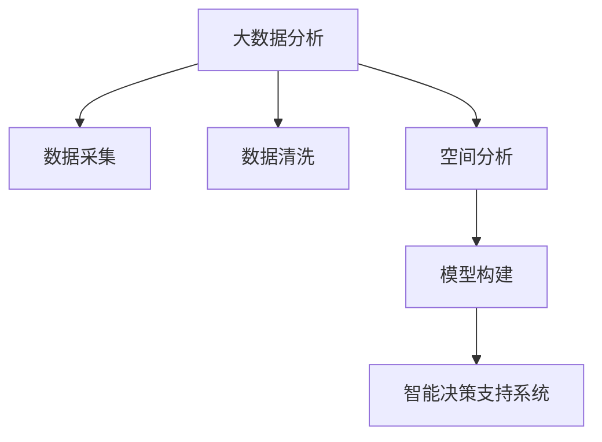

                 

# 大数据分析在城市规划中的应用：智能化决策支持

> 关键词：大数据分析, 城市规划, 智能化决策, 空间分析, 智能系统

## 1. 背景介绍

### 1.1 问题由来

随着城市化进程的加快和城市人口的增长，城市规划面临越来越大的压力。传统的城市规划方法依赖于人工分析和经验决策，难以满足日益复杂的规划需求。大数据分析技术的兴起，为城市规划带来了新的机遇和挑战。

大数据分析在城市规划中的应用，主要包括数据采集、数据清洗、数据分析、模型构建和决策支持等环节。通过采集城市各个领域的原始数据，利用先进的数据处理和分析技术，构建出高质量的城市规划模型，为城市管理者提供科学、高效、智能的决策支持。

### 1.2 问题核心关键点

城市规划中的大数据分析，涉及数据来源多样化、数据量大、分析过程复杂、结果影响重大等关键点。以下是几个核心关键问题：

- **数据采集**：如何有效地从多源异构的数据中提取有用信息？
- **数据清洗**：如何处理缺失、异常、重复等数据问题，确保数据质量？
- **空间分析**：如何利用空间分析技术对城市空间进行有效建模和可视化？
- **模型构建**：如何选择合适的分析模型和方法，保证分析结果的准确性和可靠性？
- **决策支持**：如何将分析结果转化为可行的决策方案，提升城市管理效率和效果？

## 2. 核心概念与联系

### 2.1 核心概念概述

为更好地理解大数据分析在城市规划中的应用，本节将介绍几个密切相关的核心概念：

- **大数据分析(Big Data Analytics)**：指通过对大规模数据集进行收集、存储、处理和分析，以发现隐藏在数据中的有价值信息、知识和规律的过程。
- **城市规划(Urban Planning)**：指根据城市发展的需求，对城市的土地利用、交通、环境、公共设施等方面进行综合规划和布局，以提升城市的整体功能和居民的生活质量。
- **空间分析(Spatial Analysis)**：指通过地理信息系统(GIS)等工具，对空间数据进行采集、存储、分析、可视化和决策的过程。
- **智能决策支持系统(Intelligent Decision Support System, IDSS)**：指通过集成数据分析、模型构建、决策规则等多种技术，为城市管理者提供实时、准确、智能的决策支持。

这些核心概念之间的逻辑关系可以通过以下Mermaid流程图来展示：



这个流程图展示了大数据分析在城市规划中的核心概念及其之间的关系：

1. 大数据分析通过对多源异构数据进行收集和处理，为城市规划提供丰富的数据基础。
2. 数据清洗是保证数据质量的重要环节，移除噪声和冗余，提升数据可用性。
3. 空间分析利用GIS等工具对城市空间进行建模和可视化，便于理解和分析。
4. 模型构建选择适合的数据分析模型和方法，实现对数据的深入挖掘和分析。
5. 智能决策支持系统将分析结果转化为可行的决策方案，辅助城市管理者进行科学决策。

这些概念共同构成了大数据分析在城市规划中的应用框架，使得城市规划能够更加科学、高效、智能地进行。

## 3. 核心算法原理 & 具体操作步骤
### 3.1 算法原理概述

大数据分析在城市规划中的应用，本质上是对大规模数据集进行高效、准确地处理和分析，以提供科学、可靠的决策支持。

### 3.2 算法步骤详解

基于大数据分析的城市规划决策支持系统一般包括以下几个关键步骤：

**Step 1: 数据采集与清洗**

- **数据采集**：从交通、人口、经济、环境、公共设施等多个领域采集数据，包括原始数据和历史数据。采用API接口、爬虫、传感器等多种方式进行数据收集。
- **数据清洗**：对采集的数据进行去重、去噪、处理缺失值、异常值等，保证数据的质量和一致性。使用ETL(Extract, Transform, Load)工具进行处理。

**Step 2: 空间分析与建模**

- **空间分析**：利用GIS等工具，对城市空间进行建模和可视化。包括地图绘制、空间关系分析、路径规划等。
- **模型构建**：选择合适的数据分析模型和方法，如回归分析、聚类分析、时序分析等，对数据进行深入分析。
- **知识图谱构建**：将城市中的各类设施、交通、环境等信息进行结构化，构建知识图谱，便于数据分析和推理。

**Step 3: 数据分析与可视化**

- **数据分析**：对处理后的数据进行统计分析、关联分析、趋势分析等，发现数据中的规律和关联。
- **结果可视化**：利用图表、热力图、地图等工具，对分析结果进行可视化展示，便于理解和决策。

**Step 4: 决策支持与优化**

- **决策支持**：结合城市管理者的经验与知识，对分析结果进行综合判断，提出可行的决策方案。
- **方案优化**：通过模拟和优化，评估不同方案的优劣，选择最佳的决策方案。
- **持续学习**：不断收集新数据，更新模型和知识图谱，提升决策系统的智能和准确性。

### 3.3 算法优缺点

大数据分析在城市规划中的应用具有以下优点：

1. **数据驱动**：利用大数据技术，将数据作为决策的主要依据，提升决策的科学性和准确性。
2. **高效处理**：通过分布式计算、并行处理等技术，对大规模数据进行高效处理，提高决策效率。
3. **可视化展示**：利用可视化工具，将分析结果直观展示，便于城市管理者理解和使用。
4. **持续优化**：通过持续学习和模型优化，不断提升决策系统的智能化水平。

同时，该方法也存在一些局限性：

1. **数据质量依赖**：大数据分析的效果很大程度上取决于数据的质量和完整性，数据采集和清洗工作量较大。
2. **模型复杂性**：选择合适的分析模型和算法，对数据进行深入挖掘，需要较强的数据处理和分析能力。
3. **技术门槛高**：涉及数据采集、清洗、分析、可视化等多个环节，技术门槛较高，需要跨领域的知识和技能。
4. **隐私和安全**：城市数据涉及敏感信息，数据采集和使用过程中需要关注隐私保护和数据安全问题。

尽管存在这些局限性，但就目前而言，大数据分析在城市规划中的应用已经成为一种主流趋势，具有广阔的发展前景。

### 3.4 算法应用领域

大数据分析在城市规划中的应用已经涵盖了多个领域，以下是几个典型应用案例：

- **交通规划**：通过分析交通流量、车辆行驶轨迹等数据，优化交通网络布局，提升交通效率。
- **公共设施布局**：利用人口分布、设施密度等数据，优化公共设施如学校、医院、图书馆的布局，提升居民生活便利性。
- **环境监测与治理**：通过分析空气、水质、噪音等数据，监测城市环境状况，制定治理措施。
- **智能出行与导航**：利用交通数据和实时定位，提供智能出行和导航服务，提升出行效率和安全性。
- **城市管理与应急响应**：通过分析城市基础设施数据和突发事件数据，辅助城市管理者进行应急响应和灾害预防。

这些应用案例展示了大数据分析在城市规划中的广泛应用，对提升城市管理水平和居民生活质量具有重要意义。

## 4. 数学模型和公式 & 详细讲解 & 举例说明
### 4.1 数学模型构建

本节将使用数学语言对大数据分析在城市规划中的应用进行更加严格的刻画。

假设城市规划的决策问题为 $P$，输入为 $D$，包括城市的基础设施、交通、环境、公共设施等多个领域的数据。目标是找到最优决策方案 $X$，使得 $P(D,X)$ 最大化，即：

$$
\max_{X} P(D,X)
$$

其中 $P$ 为决策问题的概率分布，$D$ 为输入数据，$X$ 为决策方案。

### 4.2 公式推导过程

以下我们以交通规划为例，推导回归分析模型的构建过程。

假设交通流量 $F$ 与城市道路长度 $L$、人口密度 $P$、平均车速 $V$ 等变量有关。可以建立如下线性回归模型：

$$
F = \beta_0 + \beta_1 L + \beta_2 P + \beta_3 V + \epsilon
$$

其中 $\beta_0, \beta_1, \beta_2, \beta_3$ 为模型参数，$\epsilon$ 为误差项。通过最小二乘法求解最优参数：

$$
\hat{\beta} = \arg \min_{\beta} \sum_{i=1}^n (y_i - (\beta_0 + \beta_1 x_{i1} + \beta_2 x_{i2} + \beta_3 x_{i3}))^2
$$

求解上述最小二乘问题，得到模型参数估计值：

$$
\hat{\beta} = (X^T X)^{-1} X^T Y
$$

其中 $X = \begin{bmatrix} 1 & x_{11} & x_{12} & x_{13} \\ 1 & x_{21} & x_{22} & x_{23} \\ \vdots & \vdots & \vdots & \vdots \\ 1 & x_{n1} & x_{n2} & x_{n3} \end{bmatrix}$，$Y = \begin{bmatrix} y_1 \\ y_2 \\ \vdots \\ y_n \end{bmatrix}$。

### 4.3 案例分析与讲解

假设某城市需要优化道路布局，提高交通流量和通行效率。数据集包括道路长度、人口密度、平均车速等多个特征，可以使用线性回归模型对交通流量进行预测和分析。

1. **数据预处理**：将数据集划分为训练集和测试集，进行归一化和特征选择。
2. **模型训练**：使用训练集数据拟合回归模型，求解最优参数。
3. **结果评估**：使用测试集数据评估模型效果，计算均方误差(MSE)和决定系数(R^2)等指标。
4. **决策支持**：结合城市管理者的经验和专业知识，对模型预测结果进行综合判断，提出可行的道路布局方案。

## 5. 项目实践：代码实例和详细解释说明
### 5.1 开发环境搭建

在进行大数据分析实践前，我们需要准备好开发环境。以下是使用Python进行PyTorch开发的环境配置流程：

1. 安装Anaconda：从官网下载并安装Anaconda，用于创建独立的Python环境。

2. 创建并激活虚拟环境：
```bash
conda create -n pytorch-env python=3.8 
conda activate pytorch-env
```

3. 安装PyTorch：根据CUDA版本，从官网获取对应的安装命令。例如：
```bash
conda install pytorch torchvision torchaudio cudatoolkit=11.1 -c pytorch -c conda-forge
```

4. 安装各类工具包：
```bash
pip install numpy pandas scikit-learn matplotlib tqdm jupyter notebook ipython
```

完成上述步骤后，即可在`pytorch-env`环境中开始大数据分析实践。

### 5.2 源代码详细实现

下面我们以交通规划为例，给出使用PyTorch进行回归分析的PyTorch代码实现。

首先，定义数据处理函数：

```python
import pandas as pd
from sklearn.preprocessing import StandardScaler
from sklearn.model_selection import train_test_split
from torch.utils.data import TensorDataset, DataLoader
from torch import nn, optim
import torch.nn.functional as F

def read_data(file_path):
    data = pd.read_csv(file_path)
    return data

def preprocessing(data):
    # 数据清洗和特征选择
    # ...
    # 数据归一化
    scaler = StandardScaler()
    data['features'] = scaler.fit_transform(data[['features']])
    # 分割训练集和测试集
    X_train, X_test, y_train, y_test = train_test_split(data['features'], data['target'], test_size=0.2, random_state=42)
    return X_train, X_test, y_train, y_test

def create_tensor_dataset(X, y):
    X_tensor = torch.from_numpy(X).float()
    y_tensor = torch.from_numpy(y).float()
    return TensorDataset(X_tensor, y_tensor)

def create_dataloader(dataset, batch_size=64, shuffle=True):
    dataloader = DataLoader(dataset, batch_size=batch_size, shuffle=shuffle)
    return dataloader
```

然后，定义模型和优化器：

```python
class LinearRegression(nn.Module):
    def __init__(self, input_size, output_size):
        super(LinearRegression, self).__init__()
        self.linear = nn.Linear(input_size, output_size)

    def forward(self, x):
        return self.linear(x)

model = LinearRegression(input_size, output_size)

optimizer = optim.SGD(model.parameters(), lr=0.01, momentum=0.9)
```

接着，定义训练和评估函数：

```python
def train_model(model, dataloader, optimizer, num_epochs=100):
    model.train()
    for epoch in range(num_epochs):
        for batch_idx, (inputs, targets) in enumerate(dataloader):
            optimizer.zero_grad()
            outputs = model(inputs)
            loss = F.mse_loss(outputs, targets)
            loss.backward()
            optimizer.step()
            if (epoch + 1) % 10 == 0:
                print(f'Epoch {epoch+1}, Loss: {loss.item()}')

def evaluate_model(model, dataloader):
    model.eval()
    total_loss = 0
    for batch_idx, (inputs, targets) in enumerate(dataloader):
        outputs = model(inputs)
        loss = F.mse_loss(outputs, targets)
        total_loss += loss.item()
    return total_loss / len(dataloader)
```

最后，启动训练流程并在测试集上评估：

```python
X_train, X_test, y_train, y_test = preprocessing('data.csv')

train_dataset = create_tensor_dataset(X_train, y_train)
test_dataset = create_tensor_dataset(X_test, y_test)

train_dataloader = create_dataloader(train_dataset)
test_dataloader = create_dataloader(test_dataset)

train_model(model, train_dataloader, optimizer)
test_loss = evaluate_model(model, test_dataloader)
print(f'Test Loss: {test_loss:.4f}')
```

以上就是使用PyTorch进行线性回归分析的完整代码实现。可以看到，得益于PyTorch的强大封装，我们可以用相对简洁的代码完成回归模型的构建和训练。

### 5.3 代码解读与分析

让我们再详细解读一下关键代码的实现细节：

**read_data函数**：
- 读取CSV文件，返回数据集。

**preprocessing函数**：
- 对数据进行清洗、特征选择和归一化，划分训练集和测试集。

**create_tensor_dataset函数**：
- 将数据转换为PyTorch的Tensor格式，用于模型训练。

**create_dataloader函数**：
- 使用PyTorch的DataLoader，对数据进行批处理和打乱，提供模型训练所需的数据流。

**LinearRegression模型**：
- 定义线性回归模型，包含一个全连接层。

**train_model函数**：
- 定义训练函数，遍历训练集，前向传播计算损失，反向传播更新模型参数，并输出每epoch的平均损失。

**evaluate_model函数**：
- 定义评估函数，遍历测试集，计算平均损失，并返回评估结果。

**训练流程**：
- 定义训练集和测试集，使用DataLoader进行批处理。
- 调用train_model函数进行模型训练。
- 在测试集上调用evaluate_model函数评估模型性能。

可以看到，PyTorch配合Python语言，使得线性回归模型的实现变得简洁高效。开发者可以将更多精力放在数据处理、模型改进等高层逻辑上，而不必过多关注底层的实现细节。

当然，工业级的系统实现还需考虑更多因素，如模型的保存和部署、超参数的自动搜索、更灵活的模型构建方式等。但核心的回归分析范式基本与此类似。

## 6. 实际应用场景
### 6.1 智能交通系统

大数据分析在智能交通系统中的应用，可以有效提高交通流量和通行效率，提升城市交通管理水平。具体应用场景包括：

- **交通流量预测**：通过分析历史交通流量数据，预测未来流量变化趋势，优化交通信号灯控制。
- **路径规划与导航**：利用实时交通数据和地图信息，提供智能路径规划和导航服务，减少拥堵和延误。
- **公交调度优化**：通过分析公交运行数据和乘客需求数据，优化公交线路和班次，提高公交效率。

### 6.2 智慧城市管理

大数据分析在智慧城市管理中的应用，可以提高城市管理的智能化水平，提升公共服务效率和居民满意度。具体应用场景包括：

- **环境监测与治理**：通过分析空气、水质、噪音等数据，监测城市环境状况，制定治理措施。
- **公共设施管理**：利用城市基础设施数据，优化公共设施布局，提升公共服务水平。
- **城市应急响应**：通过分析突发事件数据，辅助城市管理者进行应急响应和灾害预防。

### 6.3 智能物流与配送

大数据分析在智能物流与配送中的应用，可以有效提升物流效率和配送服务质量，降低运营成本。具体应用场景包括：

- **配送路线优化**：通过分析历史配送数据和实时路况，优化配送路线，减少运输时间和成本。
- **仓库管理与调度**：利用库存数据和订单数据，优化仓库管理，提高仓储效率。
- **货物追踪与监控**：通过实时追踪和监控货物位置，提升配送透明度和安全性。

### 6.4 未来应用展望

随着大数据技术的发展和城市管理的数字化转型，大数据分析在城市规划中的应用将更加广泛和深入。未来，大数据分析将在以下几个方向取得更大突破：

1. **多源数据融合**：通过将多种数据源进行融合，提升数据分析的全面性和准确性。
2. **实时数据分析**：利用流式计算和大数据技术，实现对实时数据的快速分析和处理。
3. **智能决策支持**：通过集成机器学习、自然语言处理等技术，提供更加智能和灵活的决策支持。
4. **公众参与与反馈**：通过社交媒体和公众反馈数据，增强决策的透明度和公众参与度。
5. **跨领域应用**：将大数据分析技术应用到更多领域，如教育、医疗、旅游等，提升社会治理水平。

以上趋势展示了大数据分析在城市规划中的广阔前景，将为城市管理带来更加高效、智能、透明的服务体验。

## 7. 工具和资源推荐
### 7.1 学习资源推荐

为了帮助开发者系统掌握大数据分析在城市规划中的应用，这里推荐一些优质的学习资源：

1. 《Python数据分析基础》系列博文：介绍Python在数据分析中的应用，涵盖数据采集、清洗、可视化等基础技术。

2. 《大数据技术与应用》课程：由大数据领域专家授课，涵盖大数据技术、Hadoop、Spark等核心知识，适合初学者入门。

3. 《城市规划大数据分析》书籍：介绍大数据在城市规划中的具体应用，结合实际案例，帮助读者深入理解。

4. Kaggle平台：数据科学竞赛平台，提供丰富的数据集和竞赛题目，适合实战练习和技能提升。

5. GeeksforGeeks：面向程序员的技术博客，涵盖数据科学、机器学习、编程语言等多个领域，提供丰富的学习资源和实践代码。

通过对这些资源的学习实践，相信你一定能够快速掌握大数据分析在城市规划中的应用，并用于解决实际的城市管理问题。

### 7.2 开发工具推荐

高效的数据分析离不开优秀的工具支持。以下是几款用于大数据分析开发的常用工具：

1. Python语言：作为数据科学的主流编程语言，Python具有丰富的数据处理库和分析工具，如NumPy、Pandas、Matplotlib等。

2. Apache Spark：由Apache基金会开源的大数据处理框架，支持分布式计算和大规模数据处理。

3. Hadoop生态系统：由Apache基金会开源的大数据处理框架，支持大规模数据存储和处理。

4. Tableau：商业化的数据可视化工具，支持数据连接、可视化展示、报表生成等功能。

5. Jupyter Notebook：基于Python的交互式编程环境，支持代码编辑、数据展示、结果输出等功能。

合理利用这些工具，可以显著提升大数据分析的开发效率，加快创新迭代的步伐。

### 7.3 相关论文推荐

大数据分析在城市规划中的应用，涉及多个前沿研究方向。以下是几篇奠基性的相关论文，推荐阅读：

1. "Big Data in Smart Cities: A Survey"（大数据在智慧城市中的应用综述）：综述了大数据在城市规划中的多个应用场景，提供了全面的技术框架和案例分析。

2. "Urban Planning with Data Mining and Statistical Learning"（基于数据挖掘与统计学习的城市规划）：介绍了利用数据挖掘和统计学习技术，提升城市规划决策的准确性和可靠性。

3. "Traffic Flow Prediction and Intelligent Traffic Management"（交通流量预测与智能交通管理）：提出了基于时间序列分析和机器学习的交通流量预测模型，优化交通管理策略。

4. "Urban Environment Monitoring and Smart Governance"（城市环境监测与智能治理）：介绍了利用传感器数据和遥感数据，进行城市环境监测和智能治理。

5. "Smart Logistics and Supply Chain Optimization"（智能物流与供应链优化）：介绍了利用大数据和机器学习，提升物流效率和供应链管理水平。

这些论文代表了大数据分析在城市规划中的发展脉络。通过学习这些前沿成果，可以帮助研究者把握学科前进方向，激发更多的创新灵感。

## 8. 总结：未来发展趋势与挑战
### 8.1 总结

本文对大数据分析在城市规划中的应用进行了全面系统的介绍。首先阐述了大数据分析在城市规划中的研究背景和意义，明确了大数据分析在城市规划中的独特价值。其次，从原理到实践，详细讲解了大数据分析在城市规划中的数学模型和关键步骤，给出了大数据分析任务开发的完整代码实例。同时，本文还广泛探讨了大数据分析在智能交通、智慧城市、智能物流等多个领域的应用前景，展示了大数据分析的广阔前景。此外，本文精选了大数据分析技术的各类学习资源，力求为读者提供全方位的技术指引。

通过本文的系统梳理，可以看到，大数据分析在城市规划中的应用已经成为一种主流趋势，极大地提升了城市管理的智能化水平，为城市发展注入了新的动力。未来，伴随大数据技术的不断进步，大数据分析在城市规划中的应用将更加广泛和深入。

### 8.2 未来发展趋势

展望未来，大数据分析在城市规划中的应用将呈现以下几个发展趋势：

1. **数据质量提升**：通过数据清洗和数据融合技术，提升数据质量和一致性，确保数据分析结果的可靠性。
2. **模型多样化**：引入更多先进的机器学习模型，如深度学习、强化学习等，提升模型预测和决策的准确性。
3. **实时分析能力**：利用流式计算和大数据技术，实现对实时数据的快速分析和处理，提升决策的及时性。
4. **跨领域应用**：将大数据分析技术应用到更多领域，如教育、医疗、旅游等，提升社会治理水平。
5. **公众参与与反馈**：通过社交媒体和公众反馈数据，增强决策的透明度和公众参与度，提升城市管理的民主化和科学化。

以上趋势凸显了大数据分析在城市规划中的广阔前景，将为城市管理带来更加高效、智能、透明的服务体验。

### 8.3 面临的挑战

尽管大数据分析在城市规划中的应用已经取得了显著成效，但在迈向更加智能化、普适化应用的过程中，它仍面临诸多挑战：

1. **数据隐私与安全**：城市数据涉及敏感信息，数据采集和使用过程中需要关注隐私保护和数据安全问题。
2. **技术门槛高**：大数据分析涉及多个技术领域，如数据清洗、数据建模、可视化等，需要较强的技术能力和跨领域知识。
3. **数据质量依赖**：大数据分析的效果很大程度上取决于数据的质量和完整性，数据采集和清洗工作量较大。
4. **模型复杂性**：选择合适的分析模型和算法，对数据进行深入挖掘，需要较强的数据处理和分析能力。
5. **资源消耗大**：大数据分析涉及大规模数据处理和复杂模型训练，资源消耗大，需要高性能计算资源支持。

尽管存在这些挑战，但大数据分析在城市规划中的应用前景广阔，需要更多的跨领域合作和技术创新，才能实现更加智能和高效的城市管理。

### 8.4 研究展望

面对大数据分析在城市规划中面临的挑战，未来的研究需要在以下几个方面寻求新的突破：

1. **隐私保护与数据安全**：研究数据隐私保护技术，确保数据采集和使用过程中的安全性和隐私性。
2. **跨领域技术融合**：将大数据分析技术与人工智能、物联网、区块链等技术进行融合，提升城市管理的智能化水平。
3. **低成本大数据分析**：研究低成本大数据分析技术，如边缘计算、轻量级算法等，降低大数据分析的资源消耗和成本。
4. **自动化数据分析**：研究自动化数据分析技术，提高数据分析的效率和准确性，降低人工干预的依赖。
5. **实时数据流分析**：研究实时数据流分析技术，提高数据分析的时效性和准确性，满足实时决策的需求。

这些研究方向的探索，必将引领大数据分析在城市规划中的应用进入新的阶段，为构建智慧城市提供更加可靠、高效、智能的技术支撑。面向未来，大数据分析需要与其他技术进行更深入的融合，共同推动城市管理的数字化转型和智能化升级。总之，大数据分析在城市规划中的应用将不断拓展其应用边界，为城市发展注入新的动力。

## 9. 附录：常见问题与解答

**Q1：大数据分析在城市规划中的应用是否适用于所有城市？**

A: 大数据分析在城市规划中的应用具有普适性，但不同城市的数据规模、特点和管理需求存在差异。具体应用需要结合城市实际情况进行调整和优化。

**Q2：城市规划中的大数据分析是否需要大量的资金投入？**

A: 大数据分析在城市规划中的应用，确实需要一定的资金投入，包括数据采集、清洗、建模、部署等环节。但相较于传统的人工规划方法，大数据分析可以大幅提升规划效率和准确性，减少人力和时间成本。

**Q3：大数据分析在城市规划中的数据质量如何保证？**

A: 数据质量是大数据分析应用的核心，需要在数据采集、清洗、处理等环节进行严格控制。使用ETL工具、数据仓库等技术，可以提升数据质量和一致性。

**Q4：城市规划中的大数据分析是否会面临数据隐私和安全问题？**

A: 是的，城市规划中的大数据分析涉及大量敏感信息，需要在数据采集、处理、存储、传输等环节进行严格的安全保护，确保数据隐私和安全。

**Q5：城市规划中的大数据分析是否可以持续更新和优化？**

A: 是的，大数据分析模型可以通过持续学习、模型更新和数据融合等技术，不断提升数据分析的准确性和实时性，满足城市规划的需求变化。

---

作者：禅与计算机程序设计艺术 / Zen and the Art of Computer Programming

