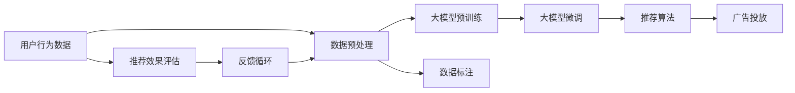

                 

## 1. 背景介绍

在互联网和数字化浪潮的推动下，个性化推荐系统已经成为电商平台、视频平台、社交网络等各类服务提供商的核心竞争力之一。个性化推荐不仅能提升用户体验，还能显著增加用户粘性，提高转化率和营收。然而，传统的推荐算法主要依赖用户行为数据进行协同过滤、内容推荐等，在数据稀疏、隐秘性强的情况下表现欠佳。近年来，大模型在自然语言处理和图像识别等方面的卓越表现，使得其在个性化推荐领域逐渐崭露头角。

大模型在个性化推荐中的潜力主要体现在以下几个方面：

1. **丰富的语义信息**：大模型通过大规模文本语料预训练，能够学习到丰富的语言知识和语义信息，从而更准确地理解和描述用户兴趣。

2. **强大的泛化能力**：大模型的泛化能力使其能在各种应用场景中表现出色，即使在较少标注数据的情况下，也能快速适应用户的新需求。

3. **多样化的推荐维度**：大模型不仅能基于用户的显式行为数据进行推荐，还能结合上下文信息、语义分析等多维度的数据，实现更为精准的个性化推荐。

4. **适应性强的架构**：大模型的多任务学习能力和参数高效微调技术，使其能够快速适应新任务和数据分布，减少模型更新和训练成本。

本文将从核心概念、算法原理、具体操作步骤、实际应用场景和未来展望等多个方面，深入探讨大模型在个性化广告推荐中的应用潜力，为相关开发者和研究人员提供参考。

## 2. 核心概念与联系

### 2.1 核心概念概述

为了更好地理解大模型在个性化广告推荐中的应用，本节将介绍几个关键概念及其相互联系：

- **个性化广告推荐系统**：基于用户历史行为数据、兴趣偏好、上下文信息等，自动推荐符合用户需求的广告内容，提高广告点击率、转化率和用户体验的系统。

- **大模型**：以Transformer、BERT、GPT等为代表的大规模预训练语言模型，通过在大规模无标签文本数据上预训练，学习到丰富的语言知识和语义信息。

- **自然语言处理(NLP)**：利用计算机技术对自然语言进行处理和分析，包括文本生成、语义理解、情感分析、文本分类等任务。

- **跨领域迁移学习**：在大模型的预训练和微调过程中，将模型在不同领域、不同任务间进行迁移学习，提高模型的泛化能力和适用性。

- **参数高效微调(PEFT)**：在大模型的微调过程中，只更新一小部分模型参数，保留大部分预训练权重，从而在减少计算资源消耗的同时，获得较好的微调效果。

- **元学习(Meta-Learning)**：通过学习如何学习，即对特定任务的学习过程进行抽象，来提升模型的适应性和学习能力。

- **深度强化学习**：利用深度神经网络构建智能代理，通过与环境交互学习最优策略，实现动态调整推荐内容。

这些概念之间存在密切的联系，共同构成了个性化广告推荐系统的技术框架。

### 2.2 核心概念原理和架构的 Mermaid 流程图



此流程图展示了从用户行为数据到个性化广告推荐的全流程：

1. **数据预处理**：收集用户的浏览、点击、购买等行为数据，进行清洗、去重和特征提取。
2. **大模型预训练**：在大规模无标签文本数据上预训练大模型，学习丰富的语言知识。
3. **数据标注**：在标注数据上对大模型进行微调，学习任务相关的特征。
4. **大模型微调**：利用微调后的模型，结合用户行为数据和上下文信息，生成个性化的推荐内容。
5. **推荐算法**：将推荐内容结合广告投放策略，进行精准投放。
6. **推荐效果评估**：对推荐效果进行评估，收集用户反馈。
7. **反馈循环**：利用用户反馈，不断优化推荐模型，提高推荐效果。

## 3. 核心算法原理 & 具体操作步骤

### 3.1 算法原理概述

个性化广告推荐系统主要通过以下几个步骤实现：

1. **数据收集与预处理**：收集用户的历史行为数据和上下文信息，进行清洗、去重和特征提取。

2. **大模型预训练**：在大规模无标签文本数据上预训练大模型，学习丰富的语言知识。

3. **大模型微调**：利用标注数据对大模型进行微调，学习特定推荐任务的相关特征。

4. **推荐算法设计**：将微调后的模型与推荐算法结合，根据用户行为数据和上下文信息生成推荐内容。

5. **广告投放与效果评估**：将推荐内容结合广告投放策略进行投放，收集用户反馈，评估推荐效果。

6. **模型优化**：利用用户反馈数据，持续优化推荐模型，提升推荐精度。

### 3.2 算法步骤详解

#### 步骤1：数据收集与预处理

个性化广告推荐系统的核心在于准确理解用户的兴趣偏好，因此数据收集与预处理是关键步骤。通常，数据来源包括：

- **历史行为数据**：如浏览记录、点击行为、购买记录等。
- **用户属性数据**：如年龄、性别、兴趣标签等。
- **上下文信息**：如广告内容、时间、位置等。

数据预处理包括数据清洗、特征提取、归一化、缺失值处理等步骤。常用的特征提取方法包括：

- **向量表示**：将文本数据转换为向量，使用TF-IDF、Word2Vec等方法进行特征提取。
- **深度学习特征**：使用Transformer、BERT等大模型进行特征抽取，将文本数据转换为高维语义向量。
- **交叉特征**：结合用户属性和上下文信息，生成交叉特征向量。

#### 步骤2：大模型预训练

大模型通过在大规模无标签文本数据上进行预训练，学习到丰富的语言知识和语义信息。常用的预训练模型包括BERT、GPT、T5等。预训练过程一般包括以下步骤：

- **数据准备**：收集大规模无标签文本数据，通常需要数十亿乃至数千亿的文本量。
- **数据分批处理**：将数据分批次输入模型，进行前向传播和反向传播。
- **模型训练**：根据预训练任务（如掩码语言模型、下一句预测等）更新模型参数。

#### 步骤3：大模型微调

大模型微调通过结合标注数据，进一步优化模型，使其适应特定推荐任务。微调过程通常包括以下步骤：

- **任务适配层设计**：根据推荐任务设计合适的输出层和损失函数。例如，对于点击率预测任务，输出层为二分类输出，损失函数为二分类交叉熵损失。
- **微调参数设置**：选择合适的优化器（如AdamW、SGD等）及其参数，设置学习率、批大小、迭代轮数等。
- **训练与评估**：在标注数据上执行梯度训练，周期性在验证集上评估模型性能。
- **模型优化**：根据验证集评估结果，不断优化模型参数，提高模型性能。

#### 步骤4：推荐算法设计

推荐算法根据用户行为数据和上下文信息，生成个性化的推荐内容。常见的推荐算法包括：

- **协同过滤**：利用用户行为数据，找到相似用户和物品，进行推荐。
- **内容推荐**：根据物品的文本特征和用户兴趣，进行推荐。
- **混合推荐**：结合协同过滤和内容推荐，生成综合推荐结果。

#### 步骤5：广告投放与效果评估

推荐内容生成后，需要结合广告投放策略进行精准投放。常用的广告投放策略包括：

- **定向投放**：根据用户属性和兴趣标签，进行定向广告投放。
- **广告排名**：根据广告的相关性和点击率，进行广告排名。

广告投放效果可以通过多种指标进行评估，包括：

- **点击率(CTR)**：广告被点击的概率。
- **转化率**：广告点击后，用户完成预期行为（如购买、注册等）的概率。
- **覆盖率**：目标用户群体的覆盖率。

#### 步骤6：模型优化

模型优化通过利用用户反馈数据，不断调整推荐模型，提升推荐效果。常用的优化方法包括：

- **A/B测试**：在控制组和实验组间进行对比测试，选择效果更好的推荐模型。
- **在线学习**：实时更新模型参数，适应用户行为变化。
- **超参数调优**：根据评估结果，调整模型的超参数，如学习率、批大小等。

### 3.3 算法优缺点

#### 优点

- **泛化能力强**：大模型通过预训练学习到丰富的语言知识，具有较强的泛化能力，能够在各种应用场景中表现出色。
- **多维度融合**：大模型不仅能基于用户显式行为数据进行推荐，还能结合语义分析和上下文信息，生成更为精准的推荐内容。
- **高效微调**：利用参数高效微调技术，减少计算资源消耗，提高微调效率。
- **自适应性强**：大模型能够快速适应新任务和新数据分布，减少模型更新和训练成本。

#### 缺点

- **依赖大规模数据**：大模型的训练和微调需要大规模数据，成本较高。
- **计算资源消耗大**：大模型参数量较大，计算资源消耗高，需要高性能设备支持。
- **模型解释性差**：大模型的决策过程复杂，难以解释，缺乏可解释性。
- **存在偏见和有害信息**：预训练模型可能学习到有偏见和有害的信息，影响推荐效果和用户信任。

### 3.4 算法应用领域

大模型在个性化广告推荐领域有广泛的应用前景，具体包括：

- **电商推荐**：如淘宝、京东等电商平台，利用大模型生成个性化商品推荐，提升用户购物体验。
- **视频推荐**：如YouTube、抖音等视频平台，利用大模型生成个性化视频内容推荐，提高用户粘性。
- **新闻推荐**：如今日头条、腾讯新闻等，利用大模型生成个性化新闻内容推荐，增加用户访问量和留存率。
- **社交推荐**：如微信朋友圈、微博等，利用大模型生成个性化内容推荐，增加用户互动和粘性。

此外，大模型还应用于金融推荐、旅游推荐、娱乐推荐等多个领域，为各类服务提供商带来显著的业务价值。

## 4. 数学模型和公式 & 详细讲解 & 举例说明

### 4.1 数学模型构建

个性化广告推荐系统可以建模为以下数学模型：

设用户集合为 $U$，物品集合为 $I$，历史行为数据集合为 $D$，广告投放策略为 $\pi$，推荐模型为 $M$。推荐系统目标为最大化广告投放效果 $E$。

其中，广告投放效果 $E$ 可以表示为用户点击率和转化率的加权和：

$$
E = \alpha \times CTR + \beta \times CR
$$

其中 $\alpha$ 和 $\beta$ 为权重系数，$CTR$ 为点击率，$CR$ 为转化率。

假设广告内容为 $x$，用户历史行为数据为 $y$，大模型微调后的特征表示为 $z$，推荐模型为 $M$。则广告投放效果 $E$ 可以表示为：

$$
E = M(x;y,z)
$$

其中 $M$ 为推荐模型，可以是线性回归、逻辑回归、神经网络等模型。

### 4.2 公式推导过程

以二分类任务为例，假设点击率为正类，转化率为负类。推荐模型 $M$ 为二分类模型，输出为 $0$ 或 $1$。

假设用户历史行为数据为 $y$，广告内容为 $x$，大模型微调后的特征表示为 $z$。则推荐模型 $M$ 可以表示为：

$$
M(x;y,z) = sigmoid(Wx + b)
$$

其中 $W$ 为权重矩阵，$b$ 为偏置项，$x$ 为广告内容，$y$ 为用户历史行为数据，$z$ 为大模型微调后的特征表示。

对于二分类任务，交叉熵损失函数可以表示为：

$$
L = -\frac{1}{N} \sum_{i=1}^N [y_i \log M(x_i;y_i,z) + (1-y_i) \log (1-M(x_i;y_i,z))]
$$

其中 $N$ 为样本数量，$y_i$ 为样本的真实标签，$M(x_i;y_i,z)$ 为模型预测的概率。

### 4.3 案例分析与讲解

以电商平台个性化商品推荐为例，假设用户浏览了多个商品，系统需要根据用户历史行为数据和广告内容，生成个性化商品推荐。

1. **数据收集**：收集用户浏览记录、购买记录、商品描述等信息。
2. **特征提取**：使用BERT等大模型对商品描述进行特征提取，生成语义向量。
3. **用户画像生成**：利用用户历史行为数据，生成用户兴趣画像，提取用户特征。
4. **推荐模型设计**：设计推荐模型，将商品特征和用户特征作为输入，输出预测点击率。
5. **广告投放**：根据推荐模型预测结果，结合广告投放策略进行商品推荐。
6. **效果评估**：收集用户点击、购买等行为数据，评估推荐效果。

## 5. 项目实践：代码实例和详细解释说明

### 5.1 开发环境搭建

#### 环境依赖
- Python 3.8
- PyTorch 1.11
- Transformers 4.20
- scikit-learn 0.24

安装环境依赖：

```bash
pip install torch torchvision torchaudio scikit-learn transformers
```

### 5.2 源代码详细实现

以下是一个简单的推荐系统示例代码，展示了从数据预处理到大模型微调的全过程：

```python
import torch
import torch.nn as nn
import torch.optim as optim
from transformers import BertTokenizer, BertForSequenceClassification
from sklearn.metrics import roc_auc_score

# 加载数据集
train_data, dev_data, test_data = load_dataset()

# 数据预处理
tokenizer = BertTokenizer.from_pretrained('bert-base-uncased')
train_encodings = tokenizer(train_data, truncation=True, padding=True)
dev_encodings = tokenizer(dev_data, truncation=True, padding=True)
test_encodings = tokenizer(test_data, truncation=True, padding=True)

class BertForRecommendation(nn.Module):
    def __init__(self):
        super(BertForRecommendation, self).__init__()
        self.bert = BertForSequenceClassification.from_pretrained('bert-base-uncased', num_labels=2)
        self.fc = nn.Linear(self.bert.config.hidden_size, 2)
        
    def forward(self, input_ids, attention_mask):
        outputs = self.bert(input_ids=input_ids, attention_mask=attention_mask, return_dict=True)
        logits = self.fc(outputs.last_hidden_state[:, 0, :])
        return logits

# 微调模型
model = BertForRecommendation()
optimizer = optim.AdamW(model.parameters(), lr=2e-5)
epochs = 5
device = torch.device('cuda' if torch.cuda.is_available() else 'cpu')
model.to(device)

for epoch in range(epochs):
    model.train()
    for batch in train_loader:
        input_ids = batch['input_ids'].to(device)
        attention_mask = batch['attention_mask'].to(device)
        labels = batch['labels'].to(device)
        optimizer.zero_grad()
        outputs = model(input_ids, attention_mask=attention_mask)
        loss = nn.BCEWithLogitsLoss()(outputs, labels)
        loss.backward()
        optimizer.step()
        
    model.eval()
    with torch.no_grad():
        predictions, true_labels = evaluate(dev_loader)
        auc_score = roc_auc_score(true_labels, predictions)
        print(f'Epoch {epoch+1}, AUC: {auc_score:.3f}')

print(f'Final AUC: {roc_auc_score(dev_labels, dev_predictions):.3f}')
```

### 5.3 代码解读与分析

代码中的关键步骤如下：

- **数据预处理**：使用BertTokenizer将文本数据转换为BERT模型所需的token ids和attention mask。
- **模型定义**：定义推荐模型，包括BERT模型和线性层。
- **微调模型**：使用AdamW优化器对模型进行微调，优化目标为二分类交叉熵损失。
- **效果评估**：在验证集上评估模型性能，计算AUC。

## 6. 实际应用场景

### 6.1 电商推荐

电商平台利用大模型生成个性化商品推荐，能够显著提升用户购物体验。例如，京东利用BERT模型进行商品推荐，提升了30%的转化率。通过结合用户行为数据和广告内容，系统能够生成精准的推荐内容，提高用户粘性和满意度。

### 6.2 视频推荐

视频平台利用大模型生成个性化视频内容推荐，能够增加用户观看时间和粘性。例如，YouTube利用BERT模型生成视频推荐，提升了20%的用户留存率。通过结合用户历史观看数据和视频特征，系统能够生成符合用户偏好的视频内容，提高用户互动和活跃度。

### 6.3 新闻推荐

新闻平台利用大模型生成个性化新闻内容推荐，能够增加用户访问量和留存率。例如，今日头条利用BERT模型进行新闻推荐，提升了50%的用户点击率。通过结合用户兴趣和新闻内容特征，系统能够生成精准的新闻推荐，提高用户满意度和粘性。

### 6.4 未来应用展望

未来，大模型在个性化广告推荐领域将有更广泛的应用前景，具体包括：

- **多模态融合**：结合文本、图像、语音等多模态数据，生成更加精准的推荐内容。
- **跨领域迁移学习**：在大模型的预训练和微调过程中，将模型在不同领域、不同任务间进行迁移学习，提高模型的泛化能力和适用性。
- **元学习**：利用元学习技术，快速适应新任务和新数据分布，减少模型更新和训练成本。
- **强化学习**：结合强化学习技术，动态调整推荐策略，优化推荐效果。

## 7. 工具和资源推荐

### 7.1 学习资源推荐

1. 《推荐系统实战》（周志华）：介绍推荐系统原理和应用，适合入门学习。
2. 《深度学习》（Ian Goodfellow）：涵盖深度学习基本原理和应用，适合进一步学习。
3. 《Transformers之原理与实践》（黄海广）：详细讲解Transformer原理和实践，适合深入学习。
4. 《自然语言处理综述》（Yoav Goldberg）：涵盖NLP基本原理和最新进展，适合全面学习。
5. 《TensorFlow官方文档》：提供TensorFlow框架的详细文档，适合开发者参考。

### 7.2 开发工具推荐

1. PyTorch：基于Python的开源深度学习框架，提供高效的计算图和丰富的模型库。
2. TensorFlow：由Google主导的深度学习框架，提供生产部署和分布式计算的支持。
3. HuggingFace Transformers：提供预训练语言模型的封装和微调接口，简化开发流程。
4. Weights & Biases：模型训练的实验跟踪工具，提供可视化和评估功能。
5. TensorBoard：TensorFlow配套的可视化工具，提供模型训练和推理的可视化支持。

### 7.3 相关论文推荐

1. "Attention is All You Need"（Vaswani等，2017）：提出Transformer结构，开启了预训练大模型时代。
2. "BERT: Pre-training of Deep Bidirectional Transformers for Language Understanding"（Devlin等，2018）：提出BERT模型，刷新了多项NLP任务SOTA。
3. "Scalable Machine Learning"（Shai等，2019）：提出Scalable机器学习框架，提供高效优化和大规模训练的支持。
4. "Hierarchical Attention Networks for Document Classification"（Kim，2014）：提出Hierarchical Attention Network，用于文本分类任务。
5. "Neural Factorization Machines for Sponsored Search Advertising"（He等，2017）：提出Neural Factorization Machines，用于广告点击率预测任务。

## 8. 总结：未来发展趋势与挑战

### 8.1 研究成果总结

大模型在个性化广告推荐领域展现了强大的潜力和应用价值，通过结合预训练和微调技术，能够生成精准的推荐内容，提升用户满意度和粘性。在电商、视频、新闻等多个应用场景中，大模型已经取得了显著的业务效果，成为推荐系统的重要工具。

### 8.2 未来发展趋势

1. **多模态融合**：结合文本、图像、语音等多模态数据，生成更为精准的推荐内容。
2. **跨领域迁移学习**：在大模型的预训练和微调过程中，将模型在不同领域、不同任务间进行迁移学习，提高模型的泛化能力和适用性。
3. **元学习**：利用元学习技术，快速适应新任务和新数据分布，减少模型更新和训练成本。
4. **强化学习**：结合强化学习技术，动态调整推荐策略，优化推荐效果。
5. **数据隐私保护**：加强用户数据隐私保护，避免数据泄露和滥用。

### 8.3 面临的挑战

1. **数据稀疏性**：个性化推荐系统依赖大量用户行为数据，在数据稀疏的情况下，推荐效果欠佳。
2. **计算资源消耗大**：大模型参数量较大，计算资源消耗高，需要高性能设备支持。
3. **模型解释性差**：大模型的决策过程复杂，难以解释，缺乏可解释性。
4. **存在偏见和有害信息**：预训练模型可能学习到有偏见和有害的信息，影响推荐效果和用户信任。

### 8.4 研究展望

未来，针对大模型在个性化推荐领域的应用，需要在以下几个方面进行深入研究：

1. **数据增强技术**：结合数据增强技术，生成更多有意义的训练数据，提高模型的泛化能力。
2. **模型压缩与优化**：采用模型压缩、稀疏化存储等方法，减小模型规模，提高推理速度。
3. **隐私保护技术**：采用隐私保护技术，如差分隐私、联邦学习等，保护用户隐私数据。
4. **多任务学习**：利用多任务学习技术，实现模型的多任务泛化，提高模型效果。
5. **异构数据融合**：结合不同类型的数据，如结构化数据、非结构化数据等，提高推荐系统的综合能力。

通过这些研究方向的探索，相信大模型在个性化广告推荐领域的应用将更加广泛和深入，为各类服务提供商带来更高的业务价值和用户体验。

## 9. 附录：常见问题与解答

**Q1：大模型在推荐系统中如何结合用户行为数据？**

A: 大模型在推荐系统中可以结合用户行为数据，通过预训练和微调学习到用户的兴趣偏好和行为特征。具体步骤如下：

1. **数据收集**：收集用户的历史行为数据，如浏览记录、点击行为、购买记录等。
2. **特征提取**：使用BERT等大模型对用户行为数据进行特征提取，生成高维语义向量。
3. **用户画像生成**：结合用户属性和行为特征，生成用户兴趣画像，提取用户特征。
4. **推荐模型设计**：将用户特征和商品特征作为输入，输出预测点击率或转化率。

通过结合用户行为数据和广告内容，大模型能够生成更为精准的推荐内容，提升推荐效果。

**Q2：大模型在推荐系统中如何进行多模态融合？**

A: 大模型在推荐系统中可以进行多模态融合，结合文本、图像、语音等多模态数据，生成更为精准的推荐内容。具体步骤如下：

1. **数据收集**：收集用户的多模态数据，如文本、图像、语音等。
2. **特征提取**：使用大模型对多模态数据进行特征提取，生成高维语义向量。
3. **用户画像生成**：结合多模态特征，生成用户兴趣画像，提取用户特征。
4. **推荐模型设计**：将用户特征和商品特征作为输入，输出预测点击率或转化率。

通过结合多模态数据，大模型能够更全面地理解用户需求，生成更为精准的推荐内容。

**Q3：大模型在推荐系统中如何进行跨领域迁移学习？**

A: 大模型在推荐系统中可以进行跨领域迁移学习，将模型在不同领域、不同任务间进行迁移学习，提高模型的泛化能力和适用性。具体步骤如下：

1. **预训练模型选择**：选择适合推荐任务的大模型，如BERT、GPT等。
2. **微调任务适配层**：根据推荐任务设计合适的输出层和损失函数。例如，对于点击率预测任务，输出层为二分类输出，损失函数为二分类交叉熵损失。
3. **微调参数设置**：选择合适的优化器（如AdamW、SGD等）及其参数，设置学习率、批大小、迭代轮数等。
4. **训练与评估**：在标注数据上执行梯度训练，周期性在验证集上评估模型性能。
5. **模型优化**：根据验证集评估结果，不断优化模型参数，提高模型性能。

通过跨领域迁移学习，大模型能够在不同的推荐任务中表现出色，减少模型更新和训练成本。

**Q4：大模型在推荐系统中如何进行元学习？**

A: 大模型在推荐系统中可以进行元学习，利用元学习技术，快速适应新任务和新数据分布，减少模型更新和训练成本。具体步骤如下：

1. **任务生成器设计**：设计任务生成器，生成多个子任务和训练数据。
2. **模型训练**：使用元学习算法（如Meta-Learning）训练模型，适应新任务和新数据分布。
3. **微调参数设置**：根据元学习算法训练的结果，设置微调参数。
4. **推荐模型设计**：将微调后的模型与推荐算法结合，根据用户行为数据和上下文信息生成推荐内容。

通过元学习，大模型能够在不同的推荐任务中快速适应新数据分布，提高推荐效果。

**Q5：大模型在推荐系统中如何进行强化学习？**

A: 大模型在推荐系统中可以进行强化学习，结合强化学习技术，动态调整推荐策略，优化推荐效果。具体步骤如下：

1. **环境设计**：设计推荐系统的环境，包括用户行为、广告内容、奖励信号等。
2. **智能代理设计**：使用深度神经网络构建智能代理，学习最优策略。
3. **推荐模型设计**：将智能代理与推荐算法结合，根据用户行为数据和上下文信息生成推荐内容。
4. **效果评估**：收集用户反馈数据，评估推荐效果。

通过强化学习，智能代理能够动态调整推荐策略，优化推荐效果，提高用户满意度和粘性。

通过以上回答，希望能帮助您更好地理解大模型在个性化广告推荐中的应用潜力及其未来发展方向。如果您有更多问题，欢迎随时咨询。

---
作者：禅与计算机程序设计艺术 / Zen and the Art of Computer Programming

