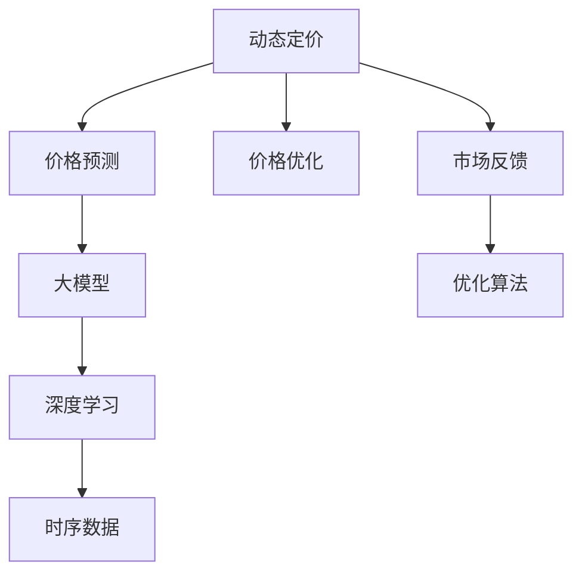

                 

# 大模型在动态定价中的应用

## 1. 背景介绍

在现代商业环境中，动态定价（Dynamic Pricing）已经成为一种常用的策略，它能够根据市场需求和供应变化灵活调整价格，优化资源配置，增加收入。传统的定价模型往往基于静态的假设，无法适应快速变化的市场环境。随着人工智能和大数据技术的发展，动态定价模型开始利用机器学习和大模型技术，实现实时价格调整，提升企业竞争力。

### 1.1 问题由来

动态定价的核心是利用历史数据和实时信息，预测市场需求，并动态调整产品或服务的价格。传统上，这个预测和调整的过程往往依赖于复杂的数学模型和统计方法，需要大量的手工调整和参数优化。随着深度学习和大模型的崛起，动态定价开始借助深度神经网络模型进行学习和预测，显著提高了定价的自动化和智能化水平。

### 1.2 问题核心关键点

动态定价的关键在于如何高效地进行价格预测和调整，同时避免价格波动过大导致市场失衡。基于大模型的动态定价方法主要利用深度学习模型，尤其是序列模型（如RNN、GRU、LSTM等）和时序预测模型（如时间差分模型、自回归模型）对价格进行预测，并结合优化算法（如梯度下降、Adam等）进行参数更新，调整价格。

## 2. 核心概念与联系

### 2.1 核心概念概述

为了深入理解大模型在动态定价中的应用，本节将介绍几个关键概念：

- 动态定价(Dynamic Pricing)：根据市场需求和供给的变化，实时调整产品或服务的价格，优化资源配置和利润最大化。
- 大模型(Large Model)：指具有大规模参数量的深度神经网络模型，如Transformer、BERT等，能够处理大规模数据，提取复杂特征。
- 价格预测(Pricing Prediction)：利用历史数据和实时信息，预测未来价格走势。
- 价格优化(Pricing Optimization)：在预测结果基础上，结合市场反馈，调整价格以实现最佳收益。
- 时序数据(Time Series Data)：具有明显时间顺序的数据，如销售数据、股票价格等。
- 深度学习(Deep Learning)：通过多层神经网络进行特征提取和模式识别，能够处理非线性关系和复杂数据。

这些概念之间的联系可以通过以下Mermaid流程图来展示：



这个流程图展示了动态定价的核心流程：

1. 动态定价系统首先收集市场数据（价格、销量等）。
2. 利用大模型进行价格预测，提取特征。
3. 结合深度学习技术，进行复杂的时序预测。
4. 在预测基础上进行价格优化，结合市场反馈进行实时调整。
5. 优化算法用于更新模型参数，提升预测准确性。

## 3. 核心算法原理 & 具体操作步骤

### 3.1 算法原理概述

基于大模型的动态定价方法，主要利用深度学习模型进行价格预测和优化。其核心思想是：

1. 利用大模型提取历史价格数据中的模式和规律。
2. 结合时序数据，预测未来价格走势。
3. 在预测结果基础上，通过优化算法调整价格，实现收益最大化。

具体而言，假设预测的价格序列为 $\{p_t\}_{t=1}^T$，其中 $p_t$ 表示第 $t$ 个时间点的价格。历史价格数据和市场反馈数据为 $\{d_t\}_{t=1}^T$，其中 $d_t$ 表示第 $t$ 个时间点的市场反馈（如销售量、客户反馈等）。

模型的目标是最小化预测误差和价格调整的波动性，即：

$$
\min_{\theta} \frac{1}{T} \sum_{t=1}^T (p_t - \hat{p}_t)^2 + \lambda \sum_{t=1}^T |p_{t+1} - p_t|^2
$$

其中，$\theta$ 为模型的参数，$\hat{p}_t$ 为模型预测的价格，$\lambda$ 为价格调整的惩罚系数。

### 3.2 算法步骤详解

基于大模型的动态定价算法主要分为以下几个步骤：

**Step 1: 数据准备**

- 收集历史价格数据 $\{d_t\}_{t=1}^T$，包括价格、销量、时间戳等信息。
- 收集市场反馈数据 $\{d_t\}_{t=1}^T$，如客户评价、促销效果等。
- 将数据进行清洗、归一化和编码，形成模型输入。

**Step 2: 构建模型**

- 选择合适的深度学习模型，如LSTM、GRU等，作为价格预测模型。
- 设计合适的损失函数，如均方误差、绝对误差等，用于衡量预测误差。
- 确定模型的超参数，如学习率、批大小、优化器等。

**Step 3: 模型训练**

- 将历史数据划分为训练集和验证集，采用交叉验证等技术进行模型选择。
- 利用训练集数据进行模型训练，最小化预测误差。
- 在验证集上评估模型性能，选择合适的模型进行微调。

**Step 4: 价格预测**

- 利用训练好的模型，对实时市场反馈数据进行价格预测。
- 根据预测结果，结合优化算法进行价格调整。

**Step 5: 价格优化**

- 结合市场反馈和预测结果，调整价格以实现收益最大化。
- 重复进行价格预测和优化，实现实时动态定价。

### 3.3 算法优缺点

基于大模型的动态定价方法具有以下优点：

1. 能够处理大规模时序数据，提取复杂特征，提高价格预测准确性。
2. 能够实时调整价格，快速响应市场变化，提高市场竞争力。
3. 结合深度学习技术，能够处理非线性关系，提升定价灵活性。
4. 模型结构可解释性强，便于理解和优化。

同时，该方法也存在一些局限性：

1. 需要大量的历史数据进行训练，数据获取成本较高。
2. 模型复杂度高，计算资源需求大，需要高性能硬件支持。
3. 对模型和算法依赖性强，一旦模型参数或算法选择不当，可能导致预测偏差。
4. 模型存在过拟合风险，需要谨慎选择模型结构和超参数。

尽管存在这些局限性，但就目前而言，基于大模型的动态定价方法仍然是实现实时动态定价的有效手段。未来相关研究的重点在于如何进一步降低数据需求，提高模型效率，降低计算资源消耗，同时兼顾模型的可解释性和泛化能力。

### 3.4 算法应用领域

基于大模型的动态定价方法在多个领域得到了广泛应用，例如：

- 航空业：根据航班需求和预定情况，实时调整机票价格。
- 酒店业：根据客房空置率和预订情况，调整房间价格。
- 零售业：根据销售数据和库存情况，优化商品价格。
- 金融业：根据市场利率和交易量，实时调整金融产品价格。
- 旅游业：根据季节和需求，动态调整旅游景点门票价格。

除了上述这些经典应用外，大模型定价方法还被创新性地应用到更多场景中，如个性化定价、跨平台定价、动态广告定价等，为各行业带来了新的业务机遇。

## 4. 数学模型和公式 & 详细讲解 & 举例说明

### 4.1 数学模型构建

本节将使用数学语言对基于大模型的动态定价模型进行更加严格的刻画。

假设历史价格数据和市场反馈数据为 $d_t = (p_t, r_t)$，其中 $p_t$ 表示第 $t$ 个时间点的价格，$r_t$ 表示第 $t$ 个时间点的市场反馈。

定义模型 $M_{\theta}$ 在输入 $d_t$ 上的价格预测为 $\hat{p}_t = M_{\theta}(d_t)$，其中 $\theta$ 为模型的参数。

模型的目标是最小化预测误差和价格调整的波动性，即：

$$
\min_{\theta} \frac{1}{T} \sum_{t=1}^T (p_t - \hat{p}_t)^2 + \lambda \sum_{t=1}^T |p_{t+1} - p_t|^2
$$

在实践中，我们通常使用基于梯度的优化算法（如SGD、Adam等）来近似求解上述最优化问题。设 $\eta$ 为学习率，$\lambda$ 为价格调整的惩罚系数，则参数的更新公式为：

$$
\theta \leftarrow \theta - \eta \nabla_{\theta}\mathcal{L}(\theta) - \eta\lambda\theta
$$

其中 $\nabla_{\theta}\mathcal{L}(\theta)$ 为损失函数对参数 $\theta$ 的梯度，可通过反向传播算法高效计算。

### 4.2 公式推导过程

以下我们以LSTM模型为例，推导基于大模型的动态定价公式。

假设模型 $M_{\theta}$ 为LSTM模型，其价格预测公式为：

$$
\hat{p}_t = \tanh(W_h \cdot [d_{t-1}, h_{t-1}] + b_h) \cdot \sigma(W_o \cdot [d_{t-1}, h_{t-1}] + b_o) + b_p
$$

其中 $W_h, b_h, W_o, b_o, b_p$ 为模型的权重和偏置，$h_{t-1}$ 为LSTM模型的隐藏状态。

模型的损失函数为均方误差损失：

$$
\mathcal{L}(\theta) = \frac{1}{T} \sum_{t=1}^T (p_t - \hat{p}_t)^2
$$

根据链式法则，损失函数对参数 $\theta$ 的梯度为：

$$
\frac{\partial \mathcal{L}(\theta)}{\partial \theta} = -\frac{2}{T} \sum_{t=1}^T (p_t - \hat{p}_t) \cdot \frac{\partial \hat{p}_t}{\partial \theta}
$$

将价格预测公式代入梯度公式，得：

$$
\frac{\partial \hat{p}_t}{\partial \theta} = \frac{\partial \tanh(W_h \cdot [d_{t-1}, h_{t-1}] + b_h) \cdot \sigma(W_o \cdot [d_{t-1}, h_{t-1}] + b_o) + b_p}{\partial \theta}
$$

进一步展开，得：

$$
\frac{\partial \hat{p}_t}{\partial \theta} = \frac{\partial \tanh}{\partial \theta}(W_h \cdot [d_{t-1}, h_{t-1}] + b_h) \cdot \sigma(W_o \cdot [d_{t-1}, h_{t-1}] + b_o) + \frac{\partial \sigma}{\partial \theta}(W_o \cdot [d_{t-1}, h_{t-1}] + b_o) \cdot \tanh(W_h \cdot [d_{t-1}, h_{t-1}] + b_h) \cdot \frac{\partial \hat{p}_t}{\partial \theta}
$$

将梯度公式代入优化算法，得：

$$
\theta \leftarrow \theta - \eta \left( -\frac{2}{T} \sum_{t=1}^T (p_t - \hat{p}_t) \cdot \frac{\partial \hat{p}_t}{\partial \theta} - \eta\lambda\theta \right)
$$

如此，我们就得到了基于LSTM模型的动态定价算法。在实践中，我们通常采用梯度累积、混合精度训练等技术，提高训练效率，同时利用TensorBoard等工具，实时监控训练过程中的各项指标，确保模型收敛。

### 4.3 案例分析与讲解

假设某电商平台通过大模型实现了动态定价系统，用于实时调整商品价格。系统收集了1000个商品的历史销售数据，包含价格、销售量、时间戳等信息，并结合实时库存和促销信息，构建了动态定价模型。

模型采用LSTM网络，输入为销售数据和库存信息，输出为商品价格预测。模型通过均方误差损失函数进行训练，并结合价格调整的惩罚系数，最小化预测误差和价格波动。

在训练过程中，我们首先将数据分为训练集和验证集，采用交叉验证等技术进行模型选择。在训练集上，模型通过梯度下降算法不断更新参数，最小化损失函数。在验证集上，我们评估模型性能，并选择合适的模型进行微调。

训练完成后，系统开始实时接收市场反馈，利用训练好的模型进行价格预测，结合价格调整策略，实时调整商品价格。例如，当库存紧张时，系统会提高商品价格，以缓解供不应求的情况。当促销活动开始时，系统会降低商品价格，吸引更多用户购买。

系统运行一段时间后，评估其效果，发现动态定价策略显著提升了商品销售量和平均收入。同时，通过实时监控系统各项指标，确保价格调整的合理性和稳定性。

## 5. 项目实践：代码实例和详细解释说明

### 5.1 开发环境搭建

在进行动态定价项目实践前，我们需要准备好开发环境。以下是使用Python进行TensorFlow开发的环境配置流程：

1. 安装Anaconda：从官网下载并安装Anaconda，用于创建独立的Python环境。

2. 创建并激活虚拟环境：
```bash
conda create -n pytorch-env python=3.8 
conda activate pytorch-env
```

3. 安装TensorFlow：根据CUDA版本，从官网获取对应的安装命令。例如：
```bash
conda install tensorflow tensorflow-cpu -c conda-forge
```

4. 安装TensorBoard：
```bash
pip install tensorboard
```

5. 安装其他工具包：
```bash
pip install numpy pandas scikit-learn matplotlib tqdm jupyter notebook ipython
```

完成上述步骤后，即可在`pytorch-env`环境中开始项目实践。

### 5.2 源代码详细实现

下面我们以电商平台动态定价系统为例，给出使用TensorFlow实现LSTM模型的代码实现。

首先，定义动态定价任务的输入和输出：

```python
import tensorflow as tf
from tensorflow.keras.layers import LSTM, Dense, Dropout, Input
from tensorflow.keras.models import Model

def create_model(input_shape, output_shape):
    input = Input(shape=input_shape)
    x = LSTM(128, dropout=0.2, recurrent_dropout=0.2)(input)
    x = Dense(output_shape, activation='tanh')(x)
    model = Model(inputs=input, outputs=x)
    return model

input_shape = (None, 3)
output_shape = 1

model = create_model(input_shape, output_shape)
model.compile(optimizer='adam', loss='mse')
```

然后，定义价格预测函数：

```python
def predict_price(model, X, y):
    y_pred = model.predict(X)
    return y_pred.flatten()

X = ...
y = ...
y_pred = predict_price(model, X, y)
```

最后，训练模型并使用进行价格预测：

```python
X_train = ...
y_train = ...
X_val = ...
y_val = ...

model.fit(X_train, y_train, epochs=10, batch_size=32, validation_data=(X_val, y_val))

X_test = ...
y_test = ...

y_pred = predict_price(model, X_test, y_test)
```

以上就是使用TensorFlow对LSTM模型进行动态定价的完整代码实现。可以看到，TensorFlow提供了强大的深度学习框架，使得模型构建和训练变得简单高效。

### 5.3 代码解读与分析

让我们再详细解读一下关键代码的实现细节：

**create_model函数**：
- 定义LSTM模型，并添加全连接层进行价格预测。
- 使用Adam优化器进行模型训练，均方误差损失函数用于衡量预测误差。

**predict_price函数**：
- 利用训练好的模型对输入数据进行价格预测，并返回预测结果。

**训练过程**：
- 将训练集数据和标签划分为训练集和验证集，并在训练集上不断迭代优化模型参数。
- 在验证集上评估模型性能，选择最优模型进行微调。
- 在测试集上评估模型效果，确保预测准确性。

以上代码展示了使用TensorFlow实现动态定价的基本流程，包含了模型构建、训练和预测等关键步骤。通过实践操作，读者可以快速掌握TensorFlow的基本使用方法，并应用到实际项目中。

## 6. 实际应用场景

### 6.1 智能交通

智能交通系统通过动态定价策略，能够实时调整交通流量和行车速度，提升道路利用率和安全性。例如，在高峰时段，系统可以根据实时交通数据和路况信息，动态调整停车费和过路费，减少拥堵现象。

在技术实现上，智能交通系统可以利用大模型对交通流量进行预测，结合实时交通数据，动态调整道路价格，引导车辆优化路线，减少拥堵。通过不断学习和优化，系统能够自适应道路状况，提升交通效率。

### 6.2 智能电网

智能电网通过动态定价策略，能够实时调整电价和负荷，优化电力资源配置，提高供电效率。例如，在系统负载过高时，系统可以根据实时需求和供电量，动态调整电价和负荷分配，缓解电网压力。

在技术实现上，智能电网系统可以利用大模型对电力负荷进行预测，结合实时需求和供电量，动态调整电价和负荷分配，实现电力资源的优化配置。通过不断学习和优化，系统能够自适应电力需求变化，提高供电效率。

### 6.3 在线教育

在线教育平台通过动态定价策略，能够实时调整课程价格和促销活动，提高用户参与度和满意度。例如，在特定时段或活动期间，系统可以根据用户参与度和学习效果，动态调整课程价格和优惠力度，吸引更多用户参与。

在技术实现上，在线教育平台可以利用大模型对用户行为进行预测，结合实时反馈数据，动态调整课程价格和促销活动，实现用户需求的精准匹配。通过不断学习和优化，系统能够自适应用户需求变化，提升用户参与度和满意度。

### 6.4 未来应用展望

随着大模型和动态定价技术的不断发展，未来在更多领域将迎来新的应用机遇：

1. 智能医疗：通过动态定价策略，能够实时调整医疗资源配置和价格，提高医疗服务的可及性和效率。例如，在疫情期间，系统可以根据实时需求和医疗资源情况，动态调整挂号费和医疗服务价格，缓解供不应求的情况。

2. 智能制造：通过动态定价策略，能够实时调整生产资源配置和价格，优化生产效率和成本。例如，在系统需求波动时，系统可以根据实时需求和库存情况，动态调整生产计划和价格，实现资源的灵活配置。

3. 智能城市：通过动态定价策略，能够实时调整城市资源配置和价格，提升城市治理效率。例如，在交通拥堵时，系统可以根据实时交通数据，动态调整停车费和过路费，减少拥堵现象。

4. 智能农业：通过动态定价策略，能够实时调整农产品价格和销售策略，优化农业生产和管理。例如，在系统需求波动时，系统可以根据实时市场信息，动态调整农产品价格和销售策略，实现资源的灵活配置。

总之，大模型和动态定价技术将在更多领域迎来新的应用场景，为各行各业带来变革性影响。

## 7. 工具和资源推荐
### 7.1 学习资源推荐

为了帮助开发者系统掌握大模型和动态定价的理论基础和实践技巧，这里推荐一些优质的学习资源：

1. 《深度学习》课程：斯坦福大学开设的深度学习课程，涵盖深度学习基础、模型训练和优化等重要内容。

2. 《TensorFlow官方文档》：TensorFlow的官方文档，提供了丰富的教程和示例，是学习TensorFlow的必备资源。

3. 《动态定价模型》书籍：深入介绍动态定价的理论基础和实际应用，适合技术和管理人员参考。

4. 《LSTM网络》论文：LSTM网络的经典论文，提供了详细的模型架构和训练方法，是学习LSTM模型的重要参考资料。

5. 《动态定价优化》论文：介绍动态定价模型的优化算法和应用场景，适合实践开发者参考。

通过对这些资源的学习实践，相信你一定能够快速掌握大模型和动态定价的核心技术，并应用于实际项目中。

### 7.2 开发工具推荐

高效的开发离不开优秀的工具支持。以下是几款用于大模型和动态定价开发的常用工具：

1. TensorFlow：由Google主导开发的深度学习框架，生产部署方便，适合大规模工程应用。

2. PyTorch：基于Python的开源深度学习框架，灵活动态的计算图，适合快速迭代研究。

3. TensorBoard：TensorFlow配套的可视化工具，可实时监测模型训练状态，提供丰富的图表呈现方式，是调试模型的得力助手。

4. Weights & Biases：模型训练的实验跟踪工具，可以记录和可视化模型训练过程中的各项指标，方便对比和调优。

5. Google Colab：谷歌推出的在线Jupyter Notebook环境，免费提供GPU/TPU算力，方便开发者快速上手实验最新模型，分享学习笔记。

合理利用这些工具，可以显著提升大模型和动态定价项目的开发效率，加快创新迭代的步伐。

### 7.3 相关论文推荐

大模型和动态定价技术的发展源于学界的持续研究。以下是几篇奠基性的相关论文，推荐阅读：

1. LSTM: A Search Space Odyssey: The Sequence Modeling Revolution (Hochreiter, 1997)：LSTM网络的经典论文，介绍了LSTM的架构和训练方法，奠定了LSTM网络在序列建模中的重要地位。

2. Dynamic Pricing in E-commerce: A Review and Research Directions (Wang et al., 2019)：综述了电子商务领域的动态定价研究，提供了丰富的案例和应用场景。

3. Learning and Optimizing Dynamic Pricing Strategies (Chen et al., 2017)：介绍了动态定价的优化算法和实际应用，适合技术和管理人员参考。

4. Dynamic Pricing Model for E-commerce (Hu et al., 2016)：介绍了一种基于深度学习的动态定价模型，适用于电子商务领域的实际应用。

5. A Survey on Dynamic Pricing in Electricity Markets (Szepieniec et al., 2019)：综述了电力市场的动态定价研究，提供了丰富的案例和应用场景。

这些论文代表了大模型和动态定价技术的发展脉络。通过学习这些前沿成果，可以帮助研究者把握学科前进方向，激发更多的创新灵感。

## 8. 总结：未来发展趋势与挑战

### 8.1 总结

本文对大模型在动态定价中的应用进行了全面系统的介绍。首先阐述了大模型和动态定价的研究背景和意义，明确了动态定价在大模型中的应用价值。其次，从原理到实践，详细讲解了基于大模型的动态定价算法，给出了实际应用的完整代码实例。同时，本文还广泛探讨了大模型定价在智能交通、智能电网、在线教育等多个领域的应用前景，展示了动态定价的广泛应用潜力。

通过本文的系统梳理，可以看到，大模型和动态定价技术正在成为现代商业智能的核心手段，极大地提升了企业资源配置和市场竞争能力。未来，伴随大模型和动态定价技术的不断演进，相信其在各行各业的应用将更加广泛和深入。

### 8.2 未来发展趋势

展望未来，大模型和动态定价技术将呈现以下几个发展趋势：

1. 模型规模持续增大。随着算力成本的下降和数据规模的扩张，大模型的参数量还将持续增长。超大批次的训练和推理也可能遇到硬件瓶颈。

2. 动态定价模型将更多地结合多模态数据，如图像、视频等，提高价格预测的准确性和灵活性。

3. 动态定价模型将更多地引入强化学习等技术，实现自主学习和优化，提高系统的自适应能力。

4. 动态定价系统将更多地结合边缘计算技术，实现实时数据处理和分析，提高系统的响应速度和可靠性。

5. 动态定价系统将更多地结合区块链等技术，实现透明、可信的价格调整和优化，提高系统的安全性和公平性。

6. 动态定价系统将更多地结合人工智能伦理和隐私保护技术，确保系统的公正性和合法性。

以上趋势凸显了大模型和动态定价技术的广阔前景。这些方向的探索发展，必将进一步提升大模型和动态定价系统的性能和应用范围，为各行业带来新的业务机遇。

### 8.3 面临的挑战

尽管大模型和动态定价技术已经取得了瞩目成就，但在迈向更加智能化、普适化应用的过程中，它仍面临着诸多挑战：

1. 数据质量和标注成本仍是制约动态定价技术的重要瓶颈。高质量的标注数据和实时反馈数据，对于动态定价系统的精准性和稳定性至关重要。

2. 模型复杂度和计算资源需求高，需要高性能硬件和先进算法支持，否则容易导致过拟合和计算瓶颈。

3. 动态定价模型存在决策黑盒问题，难以理解和解释模型的决策过程和结果，容易引发管理和监管风险。

4. 动态定价模型在多场景应用中存在泛化性和鲁棒性问题，可能对某些极端情况和异常数据表现不佳。

5. 动态定价系统在部署和运维过程中，可能面临稳定性、安全性和隐私保护等风险，需要全面考虑技术和管理措施。

尽管存在这些挑战，但通过不断优化和改进动态定价模型，结合先进的算法和工具，相信动态定价技术将在未来实现更大规模和更广泛的应用，为各行业带来更多创新和机遇。

### 8.4 研究展望

面对大模型和动态定价技术所面临的挑战，未来的研究需要在以下几个方面寻求新的突破：

1. 探索低成本、高效益的动态定价模型，减少对高成本标注数据和复杂计算资源的依赖。

2. 开发更加高效、鲁棒的动态定价算法，提高模型的泛化性和鲁棒性，增强系统的稳定性和可靠性。

3. 引入多模态数据和高级学习算法，提高动态定价系统的灵活性和自适应性。

4. 结合区块链和人工智能伦理技术，确保系统的公正性和合法性，提高系统的透明度和可信度。

5. 开发动态定价系统的运维和管理工具，确保系统的稳定性和安全性，提高系统的可操作性和可维护性。

6. 结合人工智能伦理和隐私保护技术，确保系统的公正性和合法性，提高系统的透明度和可信度。

这些研究方向的探索，必将引领大模型和动态定价技术迈向更高的台阶，为构建安全、可靠、可解释、可控的智能系统铺平道路。面向未来，大模型和动态定价技术还需要与其他人工智能技术进行更深入的融合，如知识表示、因果推理、强化学习等，多路径协同发力，共同推动动态定价系统的进步。只有勇于创新、敢于突破，才能不断拓展大模型和动态定价系统的边界，让智能技术更好地造福人类社会。

## 9. 附录：常见问题与解答

**Q1：大模型在动态定价中是否需要大量的标注数据？**

A: 大模型在动态定价中对标注数据的需求取决于具体应用场景。对于某些简单的应用场景，可能只需要少量的标注数据即可训练出良好的动态定价模型。但对于一些复杂的应用场景，如电商、金融等领域，可能需要大量的标注数据才能训练出高质量的动态定价模型。

**Q2：大模型在动态定价中的训练时间如何控制？**

A: 训练时间取决于模型规模、数据量、硬件配置等因素。为了缩短训练时间，可以采用以下策略：

1. 使用GPU/TPU等高性能设备，加速训练过程。

2. 采用小批量训练、混合精度训练等技术，提高训练效率。

3. 使用预训练模型或迁移学习技术，减少训练时间。

4. 使用动态调整学习率、提前停止等技术，避免过拟合和计算浪费。

通过合理的训练策略，可以显著缩短大模型在动态定价中的训练时间。

**Q3：动态定价模型在实际应用中需要注意哪些问题？**

A: 动态定价模型在实际应用中需要注意以下问题：

1. 数据质量和标注成本仍是制约动态定价技术的重要瓶颈，高质量的标注数据和实时反馈数据对模型的准确性至关重要。

2. 模型复杂度和计算资源需求高，需要高性能硬件和先进算法支持，否则容易导致过拟合和计算瓶颈。

3. 动态定价模型存在决策黑盒问题，难以理解和解释模型的决策过程和结果，容易引发管理和监管风险。

4. 动态定价模型在多场景应用中存在泛化性和鲁棒性问题，可能对某些极端情况和异常数据表现不佳。

5. 动态定价系统在部署和运维过程中，可能面临稳定性、安全性和隐私保护等风险，需要全面考虑技术和管理措施。

通过合理的技术和管理措施，可以最大限度地发挥动态定价模型的优势，规避潜在风险。

**Q4：动态定价系统如何结合区块链技术？**

A: 区块链技术可以提供透明、可信的价格调整和优化机制，提高动态定价系统的公平性和可信度。具体实现方式包括：

1. 使用智能合约，实现自动化的价格调整和优化。

2. 使用区块链账本，记录每一次价格调整的历史记录，确保透明和可信。

3. 使用去中心化算法，确保价格调整的公平性和合法性。

4. 使用共识机制，确保系统的高可用性和可靠性。

结合区块链技术，可以实现透明、可信、公平的动态定价系统，提高系统的稳定性和可靠性。

**Q5：动态定价系统如何结合人工智能伦理和隐私保护技术？**

A: 动态定价系统需要考虑人工智能伦理和隐私保护问题，以确保系统的公正性和合法性。具体实现方式包括：

1. 引入公平性约束，确保动态定价系统对所有用户公平，不产生歧视性行为。

2. 引入透明性约束，确保系统的决策过程和结果透明、可解释，便于用户理解和监督。

3. 引入隐私保护技术，确保用户的隐私数据安全，防止数据泄露和滥用。

4. 引入可信性约束，确保系统的行为可信，不产生虚假宣传和误导性信息。

结合人工智能伦理和隐私保护技术，可以确保动态定价系统的公正性和合法性，提高系统的透明度和可信度。

---

作者：禅与计算机程序设计艺术 / Zen and the Art of Computer Programming

