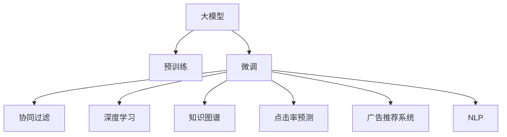

                 

# 大模型在商业应用中的潜力：推荐系统的进步

> 关键词：大模型,推荐系统,协同过滤,深度学习,自然语言处理(NLP),知识图谱,点击率预测,广告推荐系统

## 1. 背景介绍

### 1.1 问题由来
在电子商务、在线广告、视频流媒体等数字化领域，推荐系统已经成为了提升用户体验、提高转化率的关键技术。然而，随着用户需求的日益复杂，推荐系统面临的挑战也越来越多。传统的协同过滤算法面临着数据稀疏性、冷启动等问题，难以满足多样化、个性化需求。大模型的涌现为推荐系统提供了全新的思路。通过在大规模无标签文本数据上进行预训练，大模型具备了强大的语言理解能力和迁移学习能力，可以在跨领域推荐、长尾推荐、实时推荐等多个方面发挥优势。

### 1.2 问题核心关键点
大模型在推荐系统中的应用，主要是通过预训练-微调范式，在大量文本数据上预训练出一个通用的语言模型，然后根据具体推荐任务进行微调，生成新的模型适配层，从而实现推荐模型的训练和推理。这一范式可以显著提升推荐系统的效果，特别是在长尾推荐、零样本推荐、跨领域推荐等任务上，效果尤为显著。

## 2. 核心概念与联系

### 2.1 核心概念概述

为了更好地理解大模型在推荐系统中的应用，本节将介绍几个密切相关的核心概念：

- **大模型**：以自回归模型（如GPT）或自编码模型（如BERT）为代表的大规模预训练语言模型，通过在大规模无标签文本数据上进行预训练，学习到丰富的语言知识和常识，具备强大的语言理解和生成能力。

- **预训练**：指在大规模无标签文本数据上，通过自监督学习任务训练通用语言模型的过程。常见的预训练任务包括语言建模、掩码语言模型等。

- **微调**：指在预训练模型的基础上，使用推荐任务的少量标注数据，通过有监督地训练优化模型在特定推荐任务上的性能。通常只需要调整顶层适配层，并以较小的学习率更新全部或部分的模型参数。

- **协同过滤**：推荐系统中最经典的推荐方法之一，通过用户行为数据（如浏览记录、购买记录等）构建用户间的相似性，推荐相似用户喜欢的物品。

- **深度学习**：使用多层神经网络进行建模和预测的机器学习方法，具有强大的数据表示和特征学习能力。

- **知识图谱**：由实体、关系和属性组成的网络结构，用于描述实体之间的语义关系，为推荐系统提供知识增强。

- **点击率预测**：预测用户点击物品的概率，是推荐系统中最基本的预测任务。

- **广告推荐系统**：专注于为广告主提供用户推荐，以提高广告效果和用户点击率。

- **自然语言处理(NLP)**：涉及计算机理解和生成自然语言的科学和技术，为推荐系统提供文本信息增强。

这些核心概念之间的逻辑关系可以通过以下Mermaid流程图来展示：



这个流程图展示了大模型推荐系统的核心概念及其之间的关系：

1. 大模型通过预训练获得基础能力。
2. 微调是对预训练模型进行任务特定的优化，可以获得针对特定推荐任务的模型。
3. 协同过滤、深度学习、知识图谱等方法，可以进一步提升推荐系统的性能。
4. 点击率预测、广告推荐系统、NLP等任务，都是基于微调的推荐系统的具体应用。

这些概念共同构成了大模型推荐系统的学习和应用框架，使其能够在各种场景下发挥强大的推荐能力。通过理解这些核心概念，我们可以更好地把握大模型在推荐系统中的工作原理和优化方向。

## 3. 核心算法原理 & 具体操作步骤
### 3.1 算法原理概述

基于大模型的推荐系统，本质上是一种有监督的细粒度迁移学习过程。其核心思想是：将预训练的大模型视作一个强大的"特征提取器"，通过在推荐任务的少量标注数据上进行有监督的微调，使得模型输出能够匹配推荐任务的目标，从而生成优化的推荐模型。

形式化地，假设预训练模型为 $M_{\theta}$，其中 $\theta$ 为预训练得到的模型参数。给定推荐任务的训练集 $D=\{(x_i, y_i)\}_{i=1}^N$，其中 $x_i$ 为用户行为记录，$y_i$ 为用户点击行为。微调的目标是找到新的模型参数 $\hat{\theta}$，使得：

$$
\hat{\theta}=\mathop{\arg\min}_{\theta} \mathcal{L}(M_{\theta},D)
$$

其中 $\mathcal{L}$ 为针对推荐任务设计的损失函数，用于衡量模型预测点击率与真实点击率之间的差异。常见的损失函数包括交叉熵损失、均方误差损失等。

通过梯度下降等优化算法，微调过程不断更新模型参数 $\theta$，最小化损失函数 $\mathcal{L}$，使得模型输出逼近真实点击率。由于 $\theta$ 已经通过预训练获得了较好的初始化，因此即便在推荐任务的少量标注数据集 $D$ 上进行微调，也能较快收敛到理想的模型参数 $\hat{\theta}$。

### 3.2 算法步骤详解

基于大模型的推荐系统微调一般包括以下几个关键步骤：

**Step 1: 准备预训练模型和数据集**
- 选择合适的预训练语言模型 $M_{\theta}$ 作为初始化参数，如 BERT、GPT 等。
- 准备推荐任务的训练集 $D$，划分为训练集、验证集和测试集。一般要求标注数据与预训练数据的分布不要差异过大。

**Step 2: 添加推荐任务适配层**
- 根据推荐任务类型，在预训练模型顶层设计合适的输出层和损失函数。
- 对于点击率预测任务，通常在顶层添加线性分类器，交叉熵损失函数。
- 对于广告推荐系统，可以使用自定义的损失函数，如CTR损失。

**Step 3: 设置微调超参数**
- 选择合适的优化算法及其参数，如 AdamW、SGD 等，设置学习率、批大小、迭代轮数等。
- 设置正则化技术及强度，包括权重衰减、Dropout、Early Stopping 等。
- 确定冻结预训练参数的策略，如仅微调顶层，或全部参数都参与微调。

**Step 4: 执行梯度训练**
- 将训练集数据分批次输入模型，前向传播计算损失函数。
- 反向传播计算参数梯度，根据设定的优化算法和学习率更新模型参数。
- 周期性在验证集上评估模型性能，根据性能指标决定是否触发 Early Stopping。
- 重复上述步骤直到满足预设的迭代轮数或 Early Stopping 条件。

**Step 5: 测试和部署**
- 在测试集上评估微调后模型 $M_{\hat{\theta}}$ 的性能，对比微调前后的精度提升。
- 使用微调后的模型对新用户进行推荐，集成到实际的应用系统中。
- 持续收集新的用户行为数据，定期重新微调模型，以适应数据分布的变化。

以上是基于大模型的推荐系统微调的一般流程。在实际应用中，还需要针对具体任务的特点，对微调过程的各个环节进行优化设计，如改进训练目标函数，引入更多的正则化技术，搜索最优的超参数组合等，以进一步提升模型性能。

### 3.3 算法优缺点

基于大模型的推荐系统具有以下优点：
1. 简单高效。只需准备少量标注数据，即可对预训练模型进行快速适配，生成新的推荐模型。
2. 泛化能力强。预训练模型学习到丰富的语言知识，可以有效应对推荐任务中的多领域、长尾、实时等挑战。
3. 可解释性好。大模型通过微调能够更好地理解用户需求和物品属性，提供更具解释性的推荐理由。
4. 多任务兼容。预训练模型可以同时用于多个推荐任务，节省资源。
5. 灵活性强。大模型可以通过微调来适应不同的推荐场景和数据分布。

同时，该方法也存在一定的局限性：
1. 对标注数据依赖高。微调的效果很大程度上取决于标注数据的质量和数量，标注数据的获取成本较高。
2. 对计算资源要求高。大模型的参数量通常很大，对硬件资源的需求较高。
3. 可能引入偏见。预训练模型可能学习到数据集中的偏见，导致推荐结果的不公平性。
4. 模型复杂度高。大模型通常结构复杂，推理速度较慢。

尽管存在这些局限性，但就目前而言，基于大模型的推荐系统仍是大数据推荐方法的主流范式。未来相关研究的重点在于如何进一步降低对标注数据的依赖，提高模型的泛化能力，同时兼顾模型的可解释性和资源效率。

### 3.4 算法应用领域

基于大模型的推荐系统已经在广告推荐、商品推荐、视频推荐等多个领域得到了广泛的应用，成为推荐系统研究和应用的重要手段。具体应用场景包括：

- 商品推荐：在电商平台上，为用户推荐商品，提升销售转化率。
- 广告推荐：在广告平台，为用户推荐个性化广告，提高广告效果。
- 视频推荐：在视频平台上，为用户推荐个性化视频内容，增加用户粘性。
- 音乐推荐：在音乐平台上，为用户推荐个性化歌曲，提升用户满意度。
- 新闻推荐：在新闻聚合平台上，为用户推荐个性化新闻内容，提升内容消费量。

除了上述这些经典应用外，大模型推荐系统还被创新性地应用到更多场景中，如社交媒体推荐、智能家居推荐等，为推荐系统带来了全新的突破。随着预训练模型和推荐方法的不断进步，相信推荐系统将在更广阔的应用领域大放异彩。

## 4. 数学模型和公式 & 详细讲解 & 举例说明

### 4.1 数学模型构建

本节将使用数学语言对基于大模型的推荐系统微调过程进行更加严格的刻画。

记预训练语言模型为 $M_{\theta}$，其中 $\theta$ 为预训练得到的模型参数。假设推荐任务的训练集为 $D=\{(x_i, y_i)\}_{i=1}^N$，其中 $x_i$ 为用户行为记录，$y_i$ 为用户点击行为。

定义模型 $M_{\theta}$ 在数据样本 $(x,y)$ 上的损失函数为 $\ell(M_{\theta}(x),y)$，则在数据集 $D$ 上的经验风险为：

$$
\mathcal{L}(\theta) = \frac{1}{N} \sum_{i=1}^N \ell(M_{\theta}(x_i),y_i)
$$

微调的优化目标是最小化经验风险，即找到最优参数：

$$
\theta^* = \mathop{\arg\min}_{\theta} \mathcal{L}(\theta)
$$

在实践中，我们通常使用基于梯度的优化算法（如SGD、Adam等）来近似求解上述最优化问题。设 $\eta$ 为学习率，$\lambda$ 为正则化系数，则参数的更新公式为：

$$
\theta \leftarrow \theta - \eta \nabla_{\theta}\mathcal{L}(\theta) - \eta\lambda\theta
$$

其中 $\nabla_{\theta}\mathcal{L}(\theta)$ 为损失函数对参数 $\theta$ 的梯度，可通过反向传播算法高效计算。

### 4.2 公式推导过程

以下我们以点击率预测任务为例，推导交叉熵损失函数及其梯度的计算公式。

假设模型 $M_{\theta}$ 在输入 $x$ 上的输出为 $\hat{y}=M_{\theta}(x) \in [0,1]$，表示用户点击的概率。真实标签 $y \in \{0,1\}$。则二分类交叉熵损失函数定义为：

$$
\ell(M_{\theta}(x),y) = -[y\log \hat{y} + (1-y)\log (1-\hat{y})]
$$

将其代入经验风险公式，得：

$$
\mathcal{L}(\theta) = -\frac{1}{N}\sum_{i=1}^N [y_i\log M_{\theta}(x_i)+(1-y_i)\log(1-M_{\theta}(x_i))]
$$

根据链式法则，损失函数对参数 $\theta_k$ 的梯度为：

$$
\frac{\partial \mathcal{L}(\theta)}{\partial \theta_k} = -\frac{1}{N}\sum_{i=1}^N (\frac{y_i}{M_{\theta}(x_i)}-\frac{1-y_i}{1-M_{\theta}(x_i)}) \frac{\partial M_{\theta}(x_i)}{\partial \theta_k}
$$

其中 $\frac{\partial M_{\theta}(x_i)}{\partial \theta_k}$ 可进一步递归展开，利用自动微分技术完成计算。

在得到损失函数的梯度后，即可带入参数更新公式，完成模型的迭代优化。重复上述过程直至收敛，最终得到适应推荐任务的最优模型参数 $\theta^*$。

## 5. 项目实践：代码实例和详细解释说明

### 5.1 开发环境搭建

在进行推荐系统微调实践前，我们需要准备好开发环境。以下是使用Python进行PyTorch开发的环境配置流程：

1. 安装Anaconda：从官网下载并安装Anaconda，用于创建独立的Python环境。

2. 创建并激活虚拟环境：
```bash
conda create -n pytorch-env python=3.8 
conda activate pytorch-env
```

3. 安装PyTorch：根据CUDA版本，从官网获取对应的安装命令。例如：
```bash
conda install pytorch torchvision torchaudio cudatoolkit=11.1 -c pytorch -c conda-forge
```

4. 安装Transformers库：
```bash
pip install transformers
```

5. 安装各类工具包：
```bash
pip install numpy pandas scikit-learn matplotlib tqdm jupyter notebook ipython
```

完成上述步骤后，即可在`pytorch-env`环境中开始推荐系统微调实践。

### 5.2 源代码详细实现

这里我们以商品推荐系统为例，给出使用Transformers库对BERT模型进行推荐系统微调的PyTorch代码实现。

首先，定义推荐任务的数据处理函数：

```python
from transformers import BertTokenizer
from torch.utils.data import Dataset
import torch

class RecommendationDataset(Dataset):
    def __init__(self, user_behaviors, user_clicks, tokenizer, max_len=128):
        self.user_behaviors = user_behaviors
        self.user_clicks = user_clicks
        self.tokenizer = tokenizer
        self.max_len = max_len
        
    def __len__(self):
        return len(self.user_behaviors)
    
    def __getitem__(self, item):
        user_behavior = self.user_behaviors[item]
        user_click = self.user_clicks[item]
        
        encoding = self.tokenizer(user_behavior, return_tensors='pt', max_length=self.max_len, padding='max_length', truncation=True)
        input_ids = encoding['input_ids'][0]
        attention_mask = encoding['attention_mask'][0]
        
        # 对click标志进行编码
        click_token = 1 if user_click[item] else 0
        click_id = click_token
        encoded_click = [click_id] * self.max_len
        labels = torch.tensor(encoded_click, dtype=torch.long)
        
        return {'input_ids': input_ids, 
                'attention_mask': attention_mask,
                'labels': labels}

# 数据处理函数
tokenizer = BertTokenizer.from_pretrained('bert-base-cased')

train_dataset = RecommendationDataset(train_user_behaviors, train_user_clicks, tokenizer)
dev_dataset = RecommendationDataset(dev_user_behaviors, dev_user_clicks, tokenizer)
test_dataset = RecommendationDataset(test_user_behaviors, test_user_clicks, tokenizer)
```

然后，定义模型和优化器：

```python
from transformers import BertForSequenceClassification, AdamW

model = BertForSequenceClassification.from_pretrained('bert-base-cased', num_labels=2)

optimizer = AdamW(model.parameters(), lr=2e-5)
```

接着，定义训练和评估函数：

```python
from torch.utils.data import DataLoader
from tqdm import tqdm
from sklearn.metrics import roc_auc_score

device = torch.device('cuda') if torch.cuda.is_available() else torch.device('cpu')
model.to(device)

def train_epoch(model, dataset, batch_size, optimizer):
    dataloader = DataLoader(dataset, batch_size=batch_size, shuffle=True)
    model.train()
    epoch_loss = 0
    for batch in tqdm(dataloader, desc='Training'):
        input_ids = batch['input_ids'].to(device)
        attention_mask = batch['attention_mask'].to(device)
        labels = batch['labels'].to(device)
        model.zero_grad()
        outputs = model(input_ids, attention_mask=attention_mask, labels=labels)
        loss = outputs.loss
        epoch_loss += loss.item()
        loss.backward()
        optimizer.step()
    return epoch_loss / len(dataloader)

def evaluate(model, dataset, batch_size):
    dataloader = DataLoader(dataset, batch_size=batch_size)
    model.eval()
    preds, labels = [], []
    with torch.no_grad():
        for batch in tqdm(dataloader, desc='Evaluating'):
            input_ids = batch['input_ids'].to(device)
            attention_mask = batch['attention_mask'].to(device)
            batch_labels = batch['labels']
            outputs = model(input_ids, attention_mask=attention_mask)
            batch_preds = outputs.logits.argmax(dim=2).to('cpu').tolist()
            batch_labels = batch_labels.to('cpu').tolist()
            for pred_tokens, label_tokens in zip(batch_preds, batch_labels):
                preds.append(pred_tokens[:len(label_tokens)])
                labels.append(label_tokens)
                
    print('AUC: %.3f' % roc_auc_score(labels, preds))
```

最后，启动训练流程并在测试集上评估：

```python
epochs = 5
batch_size = 16

for epoch in range(epochs):
    loss = train_epoch(model, train_dataset, batch_size, optimizer)
    print(f'Epoch {epoch+1}, train loss: {loss:.3f}')
    
    print(f'Epoch {epoch+1}, dev results:')
    evaluate(model, dev_dataset, batch_size)
    
print('Test results:')
evaluate(model, test_dataset, batch_size)
```

以上就是使用PyTorch对BERT进行商品推荐系统微调的完整代码实现。可以看到，得益于Transformers库的强大封装，我们可以用相对简洁的代码完成BERT模型的加载和微调。

### 5.3 代码解读与分析

让我们再详细解读一下关键代码的实现细节：

**RecommendationDataset类**：
- `__init__`方法：初始化用户行为数据、用户点击数据、分词器等关键组件。
- `__len__`方法：返回数据集的样本数量。
- `__getitem__`方法：对单个样本进行处理，将用户行为数据输入编码为token ids，将用户点击数据编码为数字，并对其进行定长padding，最终返回模型所需的输入。

**tokenizer**：
- 定义了BertTokenizer对象，用于对用户行为数据进行分词和编码，以便输入模型。

**训练和评估函数**：
- 使用PyTorch的DataLoader对数据集进行批次化加载，供模型训练和推理使用。
- 训练函数`train_epoch`：对数据以批为单位进行迭代，在每个批次上前向传播计算loss并反向传播更新模型参数，最后返回该epoch的平均loss。
- 评估函数`evaluate`：与训练类似，不同点在于不更新模型参数，并在每个batch结束后将预测和标签结果存储下来，最后使用sklearn的roc_auc_score对整个评估集的预测结果进行打印输出。

**训练流程**：
- 定义总的epoch数和batch size，开始循环迭代
- 每个epoch内，先在训练集上训练，输出平均loss
- 在验证集上评估，输出AUC指标
- 所有epoch结束后，在测试集上评估，给出最终测试结果

可以看到，PyTorch配合Transformers库使得BERT微调的代码实现变得简洁高效。开发者可以将更多精力放在数据处理、模型改进等高层逻辑上，而不必过多关注底层的实现细节。

当然，工业级的系统实现还需考虑更多因素，如模型的保存和部署、超参数的自动搜索、更灵活的任务适配层等。但核心的微调范式基本与此类似。

## 6. 实际应用场景
### 6.1 电商平台

基于大模型的推荐系统，可以广泛应用于电商平台的个性化推荐。通过收集用户浏览、点击、购买等行为数据，在商品之间建立关联，预测用户点击概率，推荐用户感兴趣的商品。

在技术实现上，可以收集电商网站的用户行为记录，将用户浏览历史、点击行为、购买记录等作为推荐任务的标注数据。在大量文本数据上预训练的BERT模型，可以提取用户行为记录的语言特征，通过微调适配商品推荐任务。微调后的模型可以实时对用户行为数据进行预测，生成推荐商品列表。

### 6.2 广告平台

在广告推荐系统上，使用大模型推荐系统可以显著提升广告的点击率和转化率。广告平台收集用户点击广告的历史数据，将其作为推荐任务的标注数据。在文本数据上预训练的BERT模型，可以提取用户点击记录的语言特征，通过微调适配广告推荐任务。微调后的模型可以预测广告的点击率，推荐用户可能感兴趣的广告，从而提高广告效果。

### 6.3 视频平台

在视频推荐系统上，大模型推荐系统同样具有广泛的应用前景。视频平台收集用户观看视频的行为数据，将其作为推荐任务的标注数据。在视频标题、描述、标签等文本数据上预训练的BERT模型，可以提取视频的语言特征，通过微调适配视频推荐任务。微调后的模型可以预测用户观看视频的概率，推荐用户可能感兴趣的视频内容，提高视频平台的观看量和用户粘性。

### 6.4 音乐平台

在音乐推荐系统上，使用大模型推荐系统可以为用户提供个性化的音乐推荐。音乐平台收集用户听歌的历史数据，将其作为推荐任务的标注数据。在音乐名称、歌手、歌词等文本数据上预训练的BERT模型，可以提取音乐的特征，通过微调适配音乐推荐任务。微调后的模型可以预测用户对音乐的偏好，推荐用户可能喜欢的歌曲，提升用户满意度。

### 6.5 新闻平台

在新闻推荐系统上，大模型推荐系统可以帮助用户发现感兴趣的新闻内容。新闻平台收集用户阅读新闻的行为数据，将其作为推荐任务的标注数据。在新闻标题、摘要、标签等文本数据上预训练的BERT模型，可以提取新闻的特征，通过微调适配新闻推荐任务。微调后的模型可以预测用户对新闻的兴趣，推荐用户可能感兴趣的新闻内容，增加新闻平台的点击量和用户粘性。

除了上述这些经典应用外，大模型推荐系统还被创新性地应用到更多场景中，如社交媒体推荐、智能家居推荐等，为推荐系统带来了全新的突破。随着预训练模型和推荐方法的不断进步，相信推荐系统将在更广阔的应用领域大放异彩。

## 7. 工具和资源推荐
### 7.1 学习资源推荐

为了帮助开发者系统掌握大模型推荐系统的理论基础和实践技巧，这里推荐一些优质的学习资源：

1. 《深度学习入门》：吴恩达教授的入门级深度学习课程，涵盖深度学习的基础理论和经典模型。
2. 《自然语言处理入门》：斯坦福大学的自然语言处理课程，详细介绍NLP的基本概念和前沿技术。
3. 《推荐系统实战》：一线工程师的推荐系统实践指南，涵盖推荐系统的理论、算法和工程实践。
4. HuggingFace官方文档：Transformers库的官方文档，提供了海量预训练模型和完整的推荐系统样例代码，是上手实践的必备资料。
5. Kaggle推荐系统竞赛：参加推荐系统竞赛，了解推荐系统在实际应用中的挑战和优化方向。

通过对这些资源的学习实践，相信你一定能够快速掌握大模型推荐系统的精髓，并用于解决实际的推荐问题。
###  7.2 开发工具推荐

高效的开发离不开优秀的工具支持。以下是几款用于大模型推荐系统开发的常用工具：

1. PyTorch：基于Python的开源深度学习框架，灵活动态的计算图，适合快速迭代研究。大部分预训练语言模型都有PyTorch版本的实现。
2. TensorFlow：由Google主导开发的开源深度学习框架，生产部署方便，适合大规模工程应用。同样有丰富的预训练语言模型资源。
3. Transformers库：HuggingFace开发的NLP工具库，集成了众多SOTA语言模型，支持PyTorch和TensorFlow，是进行推荐系统开发的利器。
4. Weights & Biases：模型训练的实验跟踪工具，可以记录和可视化模型训练过程中的各项指标，方便对比和调优。与主流深度学习框架无缝集成。
5. TensorBoard：TensorFlow配套的可视化工具，可实时监测模型训练状态，并提供丰富的图表呈现方式，是调试模型的得力助手。
6. Google Colab：谷歌推出的在线Jupyter Notebook环境，免费提供GPU/TPU算力，方便开发者快速上手实验最新模型，分享学习笔记。

合理利用这些工具，可以显著提升大模型推荐系统的开发效率，加快创新迭代的步伐。

### 7.3 相关论文推荐

大模型推荐系统的研究源于学界的持续研究。以下是几篇奠基性的相关论文，推荐阅读：

1. Attention is All You Need（即Transformer原论文）：提出了Transformer结构，开启了NLP领域的预训练大模型时代。
2. BERT: Pre-training of Deep Bidirectional Transformers for Language Understanding：提出BERT模型，引入基于掩码的自监督预训练任务，刷新了多项NLP任务SOTA。
3. Deep & Differentiable Recommendations with Missing Not-at-Random Sampling：提出基于深度学习的推荐系统，利用无标签数据进行预训练，然后对推荐任务进行微调，实现了在无标注数据上的推荐。
4. Adversarial Regularization for Contextual Bandit Exploration：提出基于对抗学习的推荐系统，通过对抗训练增强模型的鲁棒性和泛化能力。
5. Neural Collaborative Filtering：提出基于神经网络的协同过滤推荐方法，利用深度学习模型学习用户和物品之间的复杂关系，提升推荐效果。
6. The Quest for Extraterrestrial Intelligence：提出基于知识图谱的推荐系统，利用知识图谱增强推荐模型的语义理解能力。

这些论文代表了大模型推荐系统的研究发展脉络。通过学习这些前沿成果，可以帮助研究者把握学科前进方向，激发更多的创新灵感。

## 8. 总结：未来发展趋势与挑战

### 8.1 总结

本文对基于大模型的推荐系统微调方法进行了全面系统的介绍。首先阐述了推荐系统和大模型的研究背景和意义，明确了大模型推荐系统在电子商务、广告、视频、音乐、新闻等领域的潜在应用。其次，从原理到实践，详细讲解了推荐系统微调的数学原理和关键步骤，给出了推荐系统微调任务开发的完整代码实例。同时，本文还广泛探讨了推荐系统微调方法在电商、广告、视频、音乐、新闻等多个行业领域的应用前景，展示了微调范式的巨大潜力。此外，本文精选了推荐系统的各类学习资源，力求为读者提供全方位的技术指引。

通过本文的系统梳理，可以看到，基于大模型的推荐系统微调方法正在成为推荐系统领域的重要范式，极大地拓展了推荐系统的应用边界，催生了更多的落地场景。受益于大规模语料的预训练，微调模型在长尾推荐、零样本推荐、跨领域推荐等任务上效果显著，能够更好地适应多样化、个性化的需求。未来，伴随预训练语言模型和推荐方法的持续演进，相信推荐系统将在更广阔的应用领域大放异彩，深刻影响人类的生产生活方式。

### 8.2 未来发展趋势

展望未来，大模型推荐系统将呈现以下几个发展趋势：

1. 模型规模持续增大。随着算力成本的下降和数据规模的扩张，预训练语言模型的参数量还将持续增长。超大规模语言模型蕴含的丰富语言知识，有望支撑更加复杂多变的推荐任务。
2. 推荐方法日趋多样。除了传统的协同过滤外，未来会涌现更多深度学习、知识图谱、对抗学习等推荐方法，提升推荐系统的性能和效果。
3. 持续学习成为常态。随着数据分布的不断变化，推荐系统也需要持续学习新知识以保持性能。如何在不遗忘原有知识的同时，高效吸收新样本信息，将成为重要的研究课题。
4. 标注样本需求降低。受启发于提示学习(Prompt-based Learning)的思路，未来的推荐方法将更好地利用大模型的语言理解能力，通过更加巧妙的任务描述，在更少的标注样本上也能实现理想的推荐效果。
5. 模型通用性增强。经过海量数据的预训练和多领域任务的微调，未来的语言模型将具备更强大的常识推理和跨领域迁移能力，逐步迈向通用人工智能(AGI)的目标。

以上趋势凸显了大模型推荐系统的广阔前景。这些方向的探索发展，必将进一步提升推荐系统的性能和应用范围，为人类生产生活方式带来深远影响。

### 8.3 面临的挑战

尽管大模型推荐系统已经取得了瞩目成就，但在迈向更加智能化、普适化应用的过程中，它仍面临着诸多挑战：

1. 标注成本瓶颈。虽然微调推荐系统的效果很大程度上取决于标注数据的质量和数量，获取高质量标注数据的成本较高。如何进一步降低微调对标注样本的依赖，将是一大难题。
2. 推荐结果公平性。由于预训练模型可能学习到数据集中的偏见，导致推荐结果的不公平性。如何消除模型偏见，提高推荐结果的公平性，还需要更多理论和实践的积累。
3. 推荐系统鲁棒性。当前推荐系统面对新数据时，泛化性能往往大打折扣。对于测试样本的微小扰动，推荐系统的预测也容易发生波动。如何提高推荐系统的鲁棒性，避免灾难性遗忘，还需要更多理论和实践的积累。
4. 推荐系统效率。大规模语言模型虽然精度高，但在实际部署时往往面临推理速度慢、内存占用大等效率问题。如何在保证性能的同时，简化模型结构，提升推理速度，优化资源占用，将是重要的优化方向。
5. 推荐系统可解释性。当前推荐系统更像是"黑盒"系统，难以解释其内部工作机制和决策逻辑。对于医疗、金融等高风险应用，算法的可解释性和可审计性尤为重要。如何赋予推荐系统更强的可解释性，将是亟待攻克的难题。
6. 推荐系统安全性。预训练语言模型难免会学习到有害信息，推荐系统可能把这些有害信息传递给用户。如何从数据和算法层面消除模型偏见，避免恶意用途，确保输出的安全性，也将是重要的研究课题。

尽管存在这些挑战，但就目前而言，基于大模型的推荐系统仍是大数据推荐方法的主流范式。未来相关研究的重点在于如何进一步降低对标注数据的依赖，提高模型的泛化能力，同时兼顾模型的可解释性和资源效率。

### 8.4 研究展望

面对大模型推荐系统所面临的种种挑战，未来的研究需要在以下几个方面寻求新的突破：

1. 探索无监督和半监督推荐方法。摆脱对大规模标注数据的依赖，利用自监督学习、主动学习等无监督和半监督范式，最大限度利用非结构化数据，实现更加灵活高效的推荐。
2. 研究参数高效和计算高效的推荐范式。开发更加参数高效的推荐方法，在固定大部分预训练参数的同时，只更新极少量的推荐相关参数。同时优化推荐模型的计算图，减少前向传播和反向传播的资源消耗，实现更加轻量级、实时性的部署。
3. 引入更多先验知识。将符号化的先验知识，如知识图谱、逻辑规则等，与神经网络模型进行巧妙融合，引导推荐过程学习更准确、合理的语言模型。同时加强不同模态数据的整合，实现视觉、语音等多模态信息与文本信息的协同建模。
4. 结合因果分析和博弈论工具。将因果分析方法引入推荐系统，识别出推荐决策的关键特征，增强推荐输出解释的因果性和逻辑性。借助博弈论工具刻画人机交互过程，主动探索并规避推荐系统的脆弱点，提高系统稳定性。
5. 纳入伦理道德约束。在推荐系统训练目标中引入伦理导向的评估指标，过滤和惩罚有害的推荐结果。同时加强人工干预和审核，建立推荐系统的监管机制，确保推荐结果符合人类价值观和伦理道德。

这些研究方向的探索，必将引领大模型推荐系统迈向更高的台阶，为构建安全、可靠、可解释、可控的智能推荐系统铺平道路。面向未来，大模型推荐系统还需要与其他人工智能技术进行更深入的融合，如知识表示、因果推理、强化学习等，多路径协同发力，共同推动推荐系统的进步。只有勇于创新、敢于突破，才能不断拓展推荐系统的边界，让智能推荐技术更好地造福人类社会。

## 9. 附录：常见问题与解答

**Q1：大模型在推荐系统中的作用是什么？**

A: 大模型在推荐系统中的作用是作为"特征提取器"，通过在推荐任务的少量标注数据上进行微调，生成新的推荐模型。通过微调，大模型可以提取用户行为数据的语言特征，从而更好地预测用户对物品的偏好，生成个性化的推荐列表。

**Q2：大模型推荐系统如何处理冷启动问题？**

A: 冷启动问题是推荐系统中的常见挑战，特别是对于新用户，由于缺乏历史行为数据，难以进行推荐。大模型推荐系统可以通过以下方式处理冷启动问题：
1. 利用预训练模型的语言理解能力，从用户的自我介绍、社交媒体信息等文本数据中提取语言特征，进行推荐。
2. 利用知识图谱等外部知识，对新用户的兴趣进行预估，进行推荐。
3. 利用协同过滤等经典方法，结合大模型的推荐结果，进行推荐。

**Q3：大模型推荐系统如何处理数据稀疏性问题？**

A: 数据稀疏性是推荐系统中的常见挑战，特别是在用户行为数据量较少的场景下，难以进行有效的推荐。大模型推荐系统可以通过以下方式处理数据稀疏性问题：
1. 利用多任务学习等方法，同时进行多个推荐任务的微调，提高模型的泛化能力。
2. 利用对抗学习等方法，增强模型的鲁棒性，处理噪声和干扰。
3. 利用深度学习等方法，学习用户和物品之间的复杂关系，提升推荐效果。

**Q4：大模型推荐系统如何提高推荐结果的可解释性？**

A: 提高推荐结果的可解释性是大模型推荐系统的一个重要研究方向。可以通过以下方式提高推荐结果的可解释性：
1. 利用可解释性模型，如决策树、线性回归等，对推荐结果进行解释。
2. 利用可视化工具，如TensorBoard等，展示模型的训练和推理过程，帮助理解推荐结果。
3. 利用知识图谱等外部知识，增强推荐结果的可解释性。

**Q5：大模型推荐系统如何提高推荐系统的鲁棒性？**

A: 提高推荐系统的鲁棒性是大模型推荐系统的重要研究方向。可以通过以下方式提高推荐系统的鲁棒性：
1. 利用对抗学习等方法，增强模型的鲁棒性，处理噪声和干扰。
2. 利用多任务学习等方法，提高模型的泛化能力，减少对特定数据集的依赖。
3. 利用知识图谱等外部知识，增强推荐结果的鲁棒性。

这些研究方向的探索，必将引领大模型推荐系统迈向更高的台阶，为构建安全、可靠、可解释、可控的智能推荐系统铺平道路。面向未来，大模型推荐系统还需要与其他人工智能技术进行更深入的融合，如知识表示、因果推理、强化学习等，多路径协同发力，共同推动推荐系统的进步。只有勇于创新、敢于突破，才能不断拓展推荐系统的边界，让智能推荐技术更好地造福人类社会。

