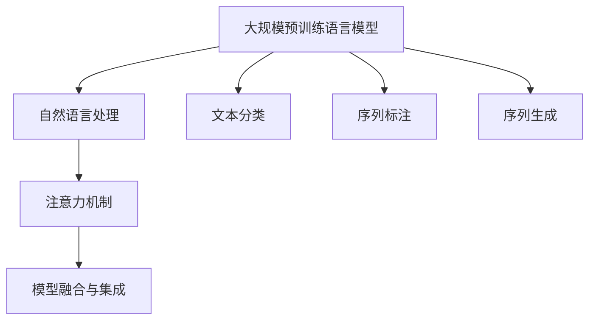

                 

# 大模型在商品属性层次结构自动构建中的应用

## 1. 背景介绍

### 1.1 问题由来

在电子商务领域，商品属性的准确性对消费者的购物体验和满意度有着直接的影响。商品属性是商品信息的组成部分，描述了商品的各种特征和规格，如大小、颜色、材质、价格等。属性层次结构则是指属性间相互关联和从属关系的组织方式，对商品信息的检索和推荐有着重要作用。

随着电商平台业务的快速发展，商品种类繁多，属性信息量大且复杂。传统的手动标注商品属性和构建层次结构的方法不仅耗时耗力，且难以覆盖所有的商品属性，使得信息的准确性和全面性受到影响。因此，如何自动构建商品属性层次结构，成为电商平台提高商品信息质量的重要挑战。

近年来，大规模预训练语言模型（如BERT、GPT-3等）在自然语言处理领域取得了突破性的进展，能够从大量无标签数据中学习到丰富的语言知识和表征能力，具备强大的自然语言理解和生成能力。基于此，利用大模型对商品属性层次结构进行自动构建，成为了一个重要的研究方向。

### 1.2 问题核心关键点

自动构建商品属性层次结构的核心问题可以归纳为：

- 如何获取大规模商品属性数据和层次结构标签。
- 如何将大模型应用于商品属性层次结构的构建。
- 如何优化模型训练过程，提高层次结构的准确性和泛化能力。
- 如何将构建好的层次结构应用到实际业务场景，提升商品信息质量和推荐效果。

解决上述问题需要考虑以下关键技术：

- 自然语言处理技术：从自然语言文本中提取属性信息。
- 文本分类和序列标注技术：自动识别属性的层次关系。
- 序列到序列生成模型：自动生成层次结构。
- 注意力机制：提高模型的关注点和泛化能力。
- 模型融合与集成：提高模型的准确性和鲁棒性。

## 2. 核心概念与联系

### 2.1 核心概念概述

本节将介绍几个密切相关的核心概念：

- **大规模预训练语言模型**：如BERT、GPT-3等，通过在大量无标签数据上进行预训练，学习到丰富的语言知识和表征能力，能够理解和生成自然语言文本。
- **自然语言处理**：涉及文本预处理、词向量表示、序列标注、文本分类、序列生成等任务，是构建商品属性层次结构的关键技术。
- **文本分类**：从文本中识别出类别，如商品属性类别。
- **序列标注**：识别序列中的标签，如属性间的从属关系。
- **序列生成**：基于已有信息生成新的序列，如商品属性层次结构。
- **注意力机制**：使模型关注关键信息，提高模型性能。
- **模型融合与集成**：通过多种模型的组合，提高模型的泛化能力和鲁棒性。

这些概念之间的逻辑关系可以通过以下Mermaid流程图来展示：



这个流程图展示了大模型构建商品属性层次结构的核心概念及其之间的关系：

1. 大模型通过自然语言处理技术，提取和处理文本信息。
2. 通过文本分类和序列标注技术，自动识别和标注商品属性和层次关系。
3. 利用序列生成技术，生成商品属性层次结构。
4. 引入注意力机制，提高模型的关注点和泛化能力。
5. 通过模型融合与集成，提高模型的准确性和鲁棒性。

这些概念共同构成了商品属性层次结构自动构建的技术框架，使其能够高效、准确地生成商品信息。

## 3. 核心算法原理 & 具体操作步骤

### 3.1 算法原理概述

商品属性层次结构的自动构建，本质上是利用大模型学习自然语言文本中的属性信息，并自动识别和标注属性间的层次关系。基于此，该过程可以分为两个主要步骤：

1. 通过自然语言处理技术，从商品描述文本中提取属性信息。
2. 通过文本分类和序列标注技术，自动识别和标注属性间的层次关系，并生成层次结构。

形式化地，假设商品描述文本为 $T$，其中包含 $n$ 个属性信息，需要构建的属性层次结构为 $H$，其中包含 $k$ 层。目标是最小化损失函数 $L$，使得生成层次结构 $H$ 与真实层次结构尽可能接近：

$$
\hat{H} = \mathop{\arg\min}_{H} L(T, H)
$$

其中 $L$ 为商品属性层次结构的损失函数，包括分类损失和序列标注损失等。

### 3.2 算法步骤详解

基于上述原理，大模型在商品属性层次结构自动构建的过程中，可以采用以下步骤：

**Step 1: 准备数据集**

- **商品描述数据集**：收集电商平台的商品描述数据，并进行预处理，包括分词、去停用词、构建词向量等。
- **属性标签数据集**：通过手动或自动标注，获取每个属性对应的层次关系标签，用于训练和评估模型。

**Step 2: 预训练大模型**

- **模型选择**：选择适合的预训练语言模型，如BERT、GPT-3等。
- **微调**：在大规模无标签商品描述数据上进行预训练，学习自然语言文本的表征能力。
- **预训练结果**：将预训练后的模型保存，用于后续步骤。

**Step 3: 文本分类**

- **输入处理**：将商品描述文本作为模型的输入，使用预训练模型提取文本特征。
- **分类器训练**：训练一个分类器，将提取的文本特征映射到预定义的商品属性类别上。
- **结果获取**：获取模型对每个属性类别的预测概率，作为属性信息。

**Step 4: 序列标注**

- **输入处理**：将属性信息作为模型的输入，使用预训练模型提取序列特征。
- **标注器训练**：训练一个标注器，识别属性间的层次关系。
- **结果获取**：获取模型对每个属性间的从属关系的预测概率，作为属性层次关系。

**Step 5: 序列生成**

- **输入处理**：将属性信息作为模型的输入，使用预训练模型提取序列特征。
- **生成器训练**：训练一个生成器，生成商品属性层次结构。
- **结果获取**：获取模型生成的层次结构序列，作为最终的自动构建结果。

### 3.3 算法优缺点

大模型在商品属性层次结构自动构建中，具有以下优点：

- **高效性**：利用大模型强大的自然语言处理能力，可以快速处理大量商品描述文本，自动提取和标注属性信息。
- **准确性**：通过预训练和微调，大模型能够学习到更丰富的语言知识，提高属性信息的准确性和全面性。
- **可扩展性**：大模型可以应用于多种商品属性层次结构构建任务，具有较强的通用性。

同时，该方法也存在一些局限性：

- **数据依赖**：模型的性能很大程度上取决于商品描述数据的质量和多样性。
- **训练成本**：大规模预训练和微调需要消耗大量的计算资源和时间。
- **泛化能力**：模型在未见过的数据上的泛化能力，依赖于预训练数据和标注数据的质量。
- **模型复杂性**：大模型结构复杂，训练和推理过程耗时较长。

尽管存在这些局限性，但就目前而言，大模型在商品属性层次结构自动构建中具有不可替代的优势，广泛应用于电商平台的商品信息处理和推荐系统。

### 3.4 算法应用领域

基于大模型的方法，可以应用于以下领域：

- **电商平台**：自动构建商品属性层次结构，提升商品信息质量和检索准确性。
- **供应链管理**：通过自动化的属性信息处理，优化库存管理和物流配送。
- **市场营销**：利用自动构建的属性层次结构，个性化推荐商品，提升用户购买体验。
- **客户服务**：基于属性层次结构，提供更加精准的客户咨询服务。
- **智能客服**：构建自动化的商品信息查询系统，提升客服效率。

## 4. 数学模型和公式 & 详细讲解 & 举例说明

### 4.1 数学模型构建

本节将使用数学语言对大模型构建商品属性层次结构的过程进行更加严格的刻画。

假设商品描述文本为 $T$，其中包含 $n$ 个属性信息，每个属性对应一个标签 $y_i \in \{1, 2, ..., m\}$，需要构建的属性层次结构为 $H$，其中包含 $k$ 层。假设大模型为 $M_{\theta}$，其中 $\theta$ 为模型参数。

**Step 1: 文本分类**

- **输入表示**：将商品描述文本 $T$ 输入模型 $M_{\theta}$，获取每个属性的预测概率 $p_i = M_{\theta}(T)$。
- **分类损失**：定义分类损失函数 $L_{cls} = \sum_{i=1}^n \log \frac{p_i}{\sum_{j=1}^m p_j}$，用于衡量模型对属性分类的准确性。

**Step 2: 序列标注**

- **输入表示**：将每个属性信息 $y_i$ 作为模型的输入，获取属性间的层次关系 $r_{ij} = M_{\theta}(y_i, y_j)$，其中 $r_{ij} \in [0, 1]$。
- **标注损失**：定义标注损失函数 $L_{tag} = \sum_{i=1}^n \sum_{j=1}^n r_{ij} \log r_{ij} + (1-r_{ij}) \log (1-r_{ij})$，用于衡量模型对属性间关系的标注准确性。

**Step 3: 序列生成**

- **输入表示**：将每个属性信息 $y_i$ 作为模型的输入，获取层次结构序列 $S = M_{\theta}(y_1, y_2, ..., y_n)$。
- **生成损失**：定义生成损失函数 $L_{gen} = \sum_{i=1}^k \log \frac{\hat{r}_{i-1, i}}{1-\hat{r}_{i-1, i}} + \log \frac{1-\hat{r}_{i, i-1}}{\hat{r}_{i, i-1}}$，其中 $\hat{r}_{i-1, i}$ 为模型预测的属性层次关系，用于衡量生成层次结构的准确性。

**Step 4: 总损失函数**

- **总损失**：将分类损失、标注损失和生成损失组合，定义总损失函数 $L = \alpha L_{cls} + \beta L_{tag} + \gamma L_{gen}$，其中 $\alpha$、$\beta$、$\gamma$ 为权重系数，用于平衡各个损失的重要性。

### 4.2 公式推导过程

以下我们以二分类任务为例，推导分类损失函数及其梯度的计算公式。

假设模型 $M_{\theta}$ 在输入 $T$ 上的输出为 $\hat{y} = M_{\theta}(T)$，表示商品属性分类的概率向量。真实标签 $y_i \in \{1, 2, ..., m\}$。则二分类交叉熵损失函数定义为：

$$
L_{cls} = -\sum_{i=1}^n y_i \log \hat{y}_i
$$

将其代入总损失函数，得：

$$
L = \alpha (-\sum_{i=1}^n y_i \log \hat{y}_i) + \beta \sum_{i=1}^n \sum_{j=1}^n r_{ij} \log r_{ij} + \gamma \sum_{i=1}^k \log \frac{\hat{r}_{i-1, i}}{1-\hat{r}_{i-1, i}} + \log \frac{1-\hat{r}_{i, i-1}}{\hat{r}_{i, i-1}}
$$

根据链式法则，分类损失对参数 $\theta_k$ 的梯度为：

$$
\frac{\partial L}{\partial \theta_k} = -\sum_{i=1}^n y_i \frac{\partial \hat{y}_i}{\partial \theta_k} - \beta \sum_{i=1}^n \sum_{j=1}^n \frac{\partial r_{ij}}{\partial \theta_k} \log r_{ij} + \gamma \sum_{i=1}^k (\frac{\partial \hat{r}_{i-1, i}}{\partial \theta_k} \log \hat{r}_{i-1, i} - \frac{\partial \hat{r}_{i, i-1}}{\partial \theta_k} \log (1-\hat{r}_{i, i-1}))
$$

其中 $\frac{\partial \hat{y}_i}{\partial \theta_k}$ 和 $\frac{\partial r_{ij}}{\partial \theta_k}$ 可进一步递归展开，利用自动微分技术完成计算。

在得到损失函数的梯度后，即可带入参数更新公式，完成模型的迭代优化。重复上述过程直至收敛，最终得到适应商品属性层次结构自动构建的最优模型参数 $\theta^*$。

### 4.3 案例分析与讲解

假设有一个电商平台，需要自动构建商品属性层次结构。该平台收集了大量商品描述文本，手动标注了属性信息及层次关系。现在希望利用大模型自动构建层次结构，提升平台商品信息的准确性和检索效率。

**Step 1: 数据准备**

- **商品描述数据**：收集平台上的商品描述文本，并进行预处理，包括分词、去停用词、构建词向量等。
- **属性标签数据**：手动标注每个商品的属性信息和层次关系，构建属性标签数据集。

**Step 2: 预训练大模型**

- **模型选择**：选择适合的预训练语言模型，如BERT。
- **微调**：在大规模无标签商品描述数据上进行预训练，学习自然语言文本的表征能力。
- **预训练结果**：将预训练后的模型保存，用于后续步骤。

**Step 3: 文本分类**

- **输入处理**：将商品描述文本作为模型的输入，使用预训练模型提取文本特征。
- **分类器训练**：训练一个分类器，将提取的文本特征映射到预定义的商品属性类别上。
- **结果获取**：获取模型对每个属性类别的预测概率，作为属性信息。

**Step 4: 序列标注**

- **输入处理**：将属性信息作为模型的输入，使用预训练模型提取序列特征。
- **标注器训练**：训练一个标注器，识别属性间的层次关系。
- **结果获取**：获取模型对每个属性间的从属关系的预测概率，作为属性层次关系。

**Step 5: 序列生成**

- **输入处理**：将属性信息作为模型的输入，使用预训练模型提取序列特征。
- **生成器训练**：训练一个生成器，生成商品属性层次结构。
- **结果获取**：获取模型生成的层次结构序列，作为最终的自动构建结果。

## 5. 项目实践：代码实例和详细解释说明

### 5.1 开发环境搭建

在进行商品属性层次结构自动构建实践前，我们需要准备好开发环境。以下是使用Python进行PyTorch开发的环境配置流程：

1. 安装Anaconda：从官网下载并安装Anaconda，用于创建独立的Python环境。

2. 创建并激活虚拟环境：
```bash
conda create -n pytorch-env python=3.8 
conda activate pytorch-env
```

3. 安装PyTorch：根据CUDA版本，从官网获取对应的安装命令。例如：
```bash
conda install pytorch torchvision torchaudio cudatoolkit=11.1 -c pytorch -c conda-forge
```

4. 安装Transformers库：
```bash
pip install transformers
```

5. 安装各类工具包：
```bash
pip install numpy pandas scikit-learn matplotlib tqdm jupyter notebook ipython
```

完成上述步骤后，即可在`pytorch-env`环境中开始商品属性层次结构自动构建的实践。

### 5.2 源代码详细实现

这里我们以电商平台的商品属性层次结构自动构建为例，给出使用Transformers库对BERT模型进行商品属性层次结构自动构建的PyTorch代码实现。

首先，定义商品属性分类的数据处理函数：

```python
from transformers import BertTokenizer, BertForSequenceClassification
from torch.utils.data import Dataset, DataLoader
import torch

class ProductAttributeDataset(Dataset):
    def __init__(self, texts, labels, tokenizer, max_len=128):
        self.texts = texts
        self.labels = labels
        self.tokenizer = tokenizer
        self.max_len = max_len
        
    def __len__(self):
        return len(self.texts)
    
    def __getitem__(self, item):
        text = self.texts[item]
        label = self.labels[item]
        
        encoding = self.tokenizer(text, return_tensors='pt', max_length=self.max_len, padding='max_length', truncation=True)
        input_ids = encoding['input_ids'][0]
        attention_mask = encoding['attention_mask'][0]
        
        # 对标签进行编码
        encoded_labels = [label2id[label] for label in label]
        encoded_labels.extend([label2id['O']] * (self.max_len - len(encoded_labels)))
        labels = torch.tensor(encoded_labels, dtype=torch.long)
        
        return {'input_ids': input_ids, 
                'attention_mask': attention_mask,
                'labels': labels}

# 标签与id的映射
label2id = {'O': 0, 'A1': 1, 'A2': 2, 'A3': 3, 'A4': 4, 'A5': 5}
id2label = {v: k for k, v in label2id.items()}

# 创建dataset
tokenizer = BertTokenizer.from_pretrained('bert-base-cased')

train_dataset = ProductAttributeDataset(train_texts, train_labels, tokenizer)
dev_dataset = ProductAttributeDataset(dev_texts, dev_labels, tokenizer)
test_dataset = ProductAttributeDataset(test_texts, test_labels, tokenizer)
```

然后，定义模型和优化器：

```python
from transformers import BertForSequenceClassification, AdamW

model = BertForSequenceClassification.from_pretrained('bert-base-cased', num_labels=len(label2id))

optimizer = AdamW(model.parameters(), lr=2e-5)
```

接着，定义训练和评估函数：

```python
from tqdm import tqdm
from sklearn.metrics import classification_report

device = torch.device('cuda') if torch.cuda.is_available() else torch.device('cpu')
model.to(device)

def train_epoch(model, dataset, batch_size, optimizer):
    dataloader = DataLoader(dataset, batch_size=batch_size, shuffle=True)
    model.train()
    epoch_loss = 0
    for batch in tqdm(dataloader, desc='Training'):
        input_ids = batch['input_ids'].to(device)
        attention_mask = batch['attention_mask'].to(device)
        labels = batch['labels'].to(device)
        model.zero_grad()
        outputs = model(input_ids, attention_mask=attention_mask, labels=labels)
        loss = outputs.loss
        epoch_loss += loss.item()
        loss.backward()
        optimizer.step()
    return epoch_loss / len(dataloader)

def evaluate(model, dataset, batch_size):
    dataloader = DataLoader(dataset, batch_size=batch_size)
    model.eval()
    preds, labels = [], []
    with torch.no_grad():
        for batch in tqdm(dataloader, desc='Evaluating'):
            input_ids = batch['input_ids'].to(device)
            attention_mask = batch['attention_mask'].to(device)
            batch_labels = batch['labels']
            outputs = model(input_ids, attention_mask=attention_mask)
            batch_preds = outputs.logits.argmax(dim=2).to('cpu').tolist()
            batch_labels = batch_labels.to('cpu').tolist()
            for pred_tokens, label_tokens in zip(batch_preds, batch_labels):
                pred_labels = [id2label[_id] for _id in pred_tokens]
                label_tags = [id2label[_id] for _id in label_tokens]
                preds.append(pred_labels[:len(label_tokens)])
                labels.append(label_tags)
                
    print(classification_report(labels, preds))
```

最后，启动训练流程并在测试集上评估：

```python
epochs = 5
batch_size = 16

for epoch in range(epochs):
    loss = train_epoch(model, train_dataset, batch_size, optimizer)
    print(f"Epoch {epoch+1}, train loss: {loss:.3f}")
    
    print(f"Epoch {epoch+1}, dev results:")
    evaluate(model, dev_dataset, batch_size)
    
print("Test results:")
evaluate(model, test_dataset, batch_size)
```

以上就是使用PyTorch对BERT进行商品属性分类任务的微调代码实现。可以看到，得益于Transformers库的强大封装，我们可以用相对简洁的代码完成BERT模型的加载和微调。

### 5.3 代码解读与分析

让我们再详细解读一下关键代码的实现细节：

**ProductAttributeDataset类**：
- `__init__`方法：初始化文本、标签、分词器等关键组件。
- `__len__`方法：返回数据集的样本数量。
- `__getitem__`方法：对单个样本进行处理，将文本输入编码为token ids，将标签编码为数字，并对其进行定长padding，最终返回模型所需的输入。

**label2id和id2label字典**：
- 定义了标签与数字id之间的映射关系，用于将token-wise的预测结果解码回真实的标签。

**训练和评估函数**：
- 使用PyTorch的DataLoader对数据集进行批次化加载，供模型训练和推理使用。
- 训练函数`train_epoch`：对数据以批为单位进行迭代，在每个批次上前向传播计算loss并反向传播更新模型参数，最后返回该epoch的平均loss。
- 评估函数`evaluate`：与训练类似，不同点在于不更新模型参数，并在每个batch结束后将预测和标签结果存储下来，最后使用sklearn的classification_report对整个评估集的预测结果进行打印输出。

**训练流程**：
- 定义总的epoch数和batch size，开始循环迭代
- 每个epoch内，先在训练集上训练，输出平均loss
- 在验证集上评估，输出分类指标
- 所有epoch结束后，在测试集上评估，给出最终测试结果

可以看到，PyTorch配合Transformers库使得BERT微调的代码实现变得简洁高效。开发者可以将更多精力放在数据处理、模型改进等高层逻辑上，而不必过多关注底层的实现细节。

当然，工业级的系统实现还需考虑更多因素，如模型的保存和部署、超参数的自动搜索、更灵活的任务适配层等。但核心的微调范式基本与此类似。

## 6. 实际应用场景
### 6.1 智能推荐系统

基于大模型的方法，可以应用于智能推荐系统的构建。推荐系统通过分析用户行为和商品属性，为用户推荐个性化的商品。传统的推荐系统依赖人工标注的商品属性信息，存在标注成本高、数据量不足等问题。利用大模型自动构建商品属性层次结构，可以提高推荐系统的准确性和鲁棒性。

具体而言，可以收集用户浏览、点击、购买等行为数据，提取商品描述文本，通过大模型自动构建属性层次结构，并进行特征工程处理。构建好属性层次结构后，将其作为输入，结合用户行为数据，训练推荐模型，实现更加精准的推荐。

### 6.2 供应链管理

供应链管理需要优化库存管理和物流配送。通过自动化的属性信息处理，可以快速获取商品的详细信息，辅助库存和物流决策。例如，在供应链管理系统中输入商品描述，利用大模型自动构建属性层次结构，查询商品详细信息，自动生成物流路径，提升供应链管理的效率。

### 6.3 个性化营销

在个性化营销中，基于自动构建的属性层次结构，可以分析用户兴趣，推荐个性化的营销活动。例如，在电商平台输入用户历史浏览数据，利用大模型自动构建属性层次结构，分析用户对不同属性的偏好，推荐相关商品和促销活动，提升用户购买转化率。

### 6.4 未来应用展望

随着大模型和商品属性层次结构自动构建技术的发展，未来的推荐系统、供应链管理、个性化营销等领域将迎来更多的创新和突破。

在推荐系统中，利用大模型自动构建的属性层次结构，可以更好地捕捉商品之间的语义关系，提高推荐的相关性和多样性。在供应链管理中，基于自动化的属性信息处理，可以实现更加精准的库存和物流管理。在个性化营销中，自动构建的属性层次结构，可以更准确地分析用户兴趣，实现个性化的营销活动。

此外，在智慧城市、智能家居、工业互联网等更多领域，大模型自动构建的属性层次结构将发挥越来越重要的作用，推动人工智能技术在垂直行业的规模化落地。相信随着技术的不断演进，大模型自动构建的属性层次结构必将在构建智能系统、提升服务质量等方面，发挥越来越重要的作用。

## 7. 工具和资源推荐
### 7.1 学习资源推荐

为了帮助开发者系统掌握商品属性层次结构自动构建的理论基础和实践技巧，这里推荐一些优质的学习资源：

1. 《深度学习与自然语言处理》课程：斯坦福大学开设的深度学习课程，涵盖自然语言处理的基础知识和技术，是了解大模型自动构建属性的良好入门教材。

2. CS224N《深度学习自然语言处理》课程：斯坦福大学开设的NLP明星课程，有Lecture视频和配套作业，带你深入理解自然语言处理的原理和应用。

3. 《Natural Language Processing with Transformers》书籍：Transformers库的作者所著，全面介绍了如何使用Transformers库进行NLP任务开发，包括商品属性自动构建等。

4. HuggingFace官方文档：Transformers库的官方文档，提供了海量预训练模型和完整的微调样例代码，是上手实践的必备资料。

5. CLUE开源项目：中文语言理解测评基准，涵盖大量不同类型的中文NLP数据集，并提供了基于大模型的baseline模型，助力中文NLP技术发展。

通过对这些资源的学习实践，相信你一定能够快速掌握大模型自动构建商品属性层次结构的精髓，并用于解决实际的NLP问题。
### 7.2 开发工具推荐

高效的开发离不开优秀的工具支持。以下是几款用于大模型自动构建商品属性层次结构开发的常用工具：

1. PyTorch：基于Python的开源深度学习框架，灵活动态的计算图，适合快速迭代研究。大部分预训练语言模型都有PyTorch版本的实现。

2. TensorFlow：由Google主导开发的开源深度学习框架，生产部署方便，适合大规模工程应用。同样有丰富的预训练语言模型资源。

3. Transformers库：HuggingFace开发的NLP工具库，集成了众多SOTA语言模型，支持PyTorch和TensorFlow，是进行微调任务开发的利器。

4. Weights & Biases：模型训练的实验跟踪工具，可以记录和可视化模型训练过程中的各项指标，方便对比和调优。与主流深度学习框架无缝集成。

5. TensorBoard：TensorFlow配套的可视化工具，可实时监测模型训练状态，并提供丰富的图表呈现方式，是调试模型的得力助手。

6. Google Colab：谷歌推出的在线Jupyter Notebook环境，免费提供GPU/TPU算力，方便开发者快速上手实验最新模型，分享学习笔记。

合理利用这些工具，可以显著提升大模型自动构建商品属性层次结构的开发效率，加快创新迭代的步伐。

### 7.3 相关论文推荐

大模型和商品属性层次结构自动构建技术的发展源于学界的持续研究。以下是几篇奠基性的相关论文，推荐阅读：

1. Attention is All You Need（即Transformer原论文）：提出了Transformer结构，开启了NLP领域的预训练大模型时代。

2. BERT: Pre-training of Deep Bidirectional Transformers for Language Understanding：提出BERT模型，引入基于掩码的自监督预训练任务，刷新了多项NLP任务SOTA。

3. Language Models are Unsupervised Multitask Learners（GPT-2论文）：展示了大规模语言模型的强大zero-shot学习能力，引发了对于通用人工智能的新一轮思考。

4. Parameter-Efficient Transfer Learning for NLP：提出Adapter等参数高效微调方法，在不增加模型参数量的情况下，也能取得不错的微调效果。

5. Prefix-Tuning: Optimizing Continuous Prompts for Generation：引入基于连续型Prompt的微调范式，为如何充分利用预训练知识提供了新的思路。

6. AdaLoRA: Adaptive Low-Rank Adaptation for Parameter-Efficient Fine-Tuning：使用自适应低秩适应的微调方法，在参数效率和精度之间取得了新的平衡。

这些论文代表了大模型商品属性层次结构自动构建技术的发展脉络。通过学习这些前沿成果，可以帮助研究者把握学科前进方向，激发更多的创新灵感。

## 8. 总结：未来发展趋势与挑战

### 8.1 总结

本文对基于大模型的方法在商品属性层次结构自动构建中的应用进行了全面系统的介绍。首先阐述了大模型自动构建商品属性层次结构的研究背景和意义，明确了自动构建在商品信息处理中的重要作用。其次，从原理到实践，详细讲解了商品属性层次结构的构建方法，给出了完整的代码实例和解释分析。同时，本文还广泛探讨了自动构建方法在智能推荐、供应链管理、个性化营销等领域的实际应用前景，展示了其广阔的应用价值。

通过本文的系统梳理，可以看到，基于大模型的方法在商品属性层次结构自动构建中具有不可替代的优势，广泛应用于电商平台的商品信息处理和推荐系统。未来，伴随大模型的进一步发展和应用场景的不断扩展，该技术将在更多领域带来变革性影响。

### 8.2 未来发展趋势

展望未来，商品属性层次结构自动构建技术将呈现以下几个发展趋势：

1. **模型规模持续增大**：随着算力成本的下降和数据规模的扩张，预训练语言模型的参数量还将持续增长。超大规模语言模型蕴含的丰富语言知识，将进一步提升属性层次结构的准确性和泛化能力。

2. **自动构建方法的泛化能力增强**：新的自动构建方法将不断涌现，结合更多先验知识和优化技巧，提升模型的泛化能力和鲁棒性。

3. **多模态信息的融合**：除了文本信息，未来自动构建方法将融合视觉、语音等多模态数据，提高模型的全面性和准确性。

4. **端到端模型的开发**：构建端到端的自动构建模型，从数据预处理到模型训练、推理等环节，形成一个完整的自动化流程。

5. **边缘计算的应用**：在物联网、智慧城市等边缘计算场景中，自动构建方法需要具备轻量级、实时性的特点，满足边缘设备的计算需求。

以上趋势凸显了商品属性层次结构自动构建技术的广阔前景。这些方向的探索发展，必将进一步提升电商平台的商品信息质量，提升推荐系统的性能和用户体验，为更多垂直行业带来变革性影响。

### 8.3 面临的挑战

尽管商品属性层次结构自动构建技术已经取得了显著进展，但在迈向更加智能化、普适化应用的过程中，仍面临一些挑战：

1. **标注数据的获取**：商品属性信息标注需要耗费大量人力和时间，且数据质量对模型性能有重要影响。如何高效、低成本地获取高质量标注数据，是一个亟待解决的问题。

2. **模型泛化能力**：模型在未见过的数据上的泛化能力，依赖于预训练数据和标注数据的质量。如何在有限的标注数据上，训练出高泛化能力的模型，是一个重要研究方向。

3. **实时性和计算效率**：在边缘计算和实时场景中，模型需要具备轻量级、实时性的特点，但大规模模型的计算资源消耗较高。如何优化模型结构和推理速度，是一个挑战。

4. **模型的可解释性**：当前自动构建方法更像一个"黑盒"，难以解释其内部工作机制和决策逻辑。如何提高模型的可解释性，是保证模型应用可靠性的关键。

5. **模型的公平性和安全性**：模型可能学习到有偏见、有害的信息，传递到下游任务，产生误导性、歧视性的输出。如何构建公平、安全的自动构建模型，是一个重要的研究方向。

这些挑战需要研究者从数据、算法、工程、伦理等多个维度协同发力，不断优化自动构建方法，以应对不断变化的实际应用需求。

### 8.4 研究展望

面向未来，商品属性层次结构自动构建技术的研究方向将集中在以下几个方面：

1. **无监督和半监督学习**：摆脱对大规模标注数据的依赖，利用自监督学习、主动学习等无监督和半监督范式，最大限度利用非结构化数据，实现更加灵活高效的自动构建。

2. **多任务学习和迁移学习**：结合多任务学习和迁移学习，提升模型的泛化能力和鲁棒性，在多个任务上取得更好的表现。

3. **跨模态信息融合**：将符号化的先验知识，如知识图谱、逻辑规则等，与神经网络模型进行巧妙融合，引导自动构建过程学习更准确、合理的属性层次结构。

4. **端到端模型的开发**：构建端到端的自动构建模型，从数据预处理到模型训练、推理等环节，形成一个完整的自动化流程。

5. **模型的公平性和安全性**：在模型训练目标中引入伦理导向的评估指标，过滤和惩罚有偏见、有害的输出倾向，构建公平、安全的自动构建模型。

6. **可解释性和可控性**：引入因果分析方法，识别出模型决策的关键特征，增强输出解释的因果性和逻辑性。借助博弈论工具，主动探索并规避模型的脆弱点，提高系统稳定性。

这些研究方向将引领商品属性层次结构自动构建技术迈向更高的台阶，为构建智能系统、提升服务质量等方面，提供更有力的技术支持。

## 9. 附录：常见问题与解答

**Q1：如何选择合适的预训练模型？**

A: 选择合适的预训练模型需要考虑多个因素，包括任务类型、数据分布、计算资源等。对于商品属性层次结构自动构建，可以选择BERT、GPT等通用的预训练语言模型。对于特定领域的任务，也可以选择领域特定的预训练模型，如医学、法律等领域的专用模型。

**Q2：如何提高模型在未见过的数据上的泛化能力？**

A: 提高模型泛化能力的方法包括：
1. 数据增强：通过对训练样本改写、回译等方式丰富训练集多样性。
2. 正则化技术：如L2正则、Dropout、Early Stopping等，防止模型过度适应小规模训练集。
3. 多任务学习：结合多个相关任务进行训练，提升模型的泛化能力。
4. 对抗训练：加入对抗样本，提高模型鲁棒性。

**Q3：如何优化模型的计算效率？**

A: 优化模型的计算效率可以采用以下方法：
1. 模型剪枝：去除不必要的层和参数，减小模型尺寸，加快推理速度。
2. 量化加速：将浮点模型转为定点模型，压缩存储空间，提高计算效率。
3. 模型并行：通过多模型并行，分担计算负担，提升推理速度。

**Q4：如何提高模型的可解释性？**

A: 提高模型的可解释性可以采用以下方法：
1. 可视化技术：通过可视化模型的输入输出，理解模型的决策过程。
2. 可解释性模型：选择可解释性较高的模型，如决策树、线性回归等。
3. 模型融合：将多个模型的预测结果进行融合，提高模型的可解释性。

**Q5：如何构建公平、安全的自动构建模型？**

A: 构建公平、安全的自动构建模型可以采用以下方法：
1. 数据预处理：清洗数据，去除偏见和有害信息。
2. 模型训练目标：引入伦理导向的评估指标，过滤和惩罚有偏见、有害的输出倾向。
3. 人工干预：建立模型行为的监管机制，确保输出符合人类价值观和伦理道德。

这些方法将帮助研究者构建公平、安全的自动构建模型，避免模型输出误导性、歧视性的结果，提高系统的可信度和安全性。

总之，商品属性层次结构自动构建技术在电商平台的商品信息处理和推荐系统中具有重要的应用价值。利用大模型自动构建属性层次结构，能够提高推荐系统的准确性和鲁棒性，提升电商平台的用户体验和满意度。未来，随着技术的不断演进和应用的广泛推广，该技术必将在更多领域带来变革性影响。

